# Use Joule Studio to Extend the AP Invoice Agent using Agent Extensions

<!-- description -->Use Joule Studio to extend the AP Invoice agent.


## Prerequisites

- Access to Joule Work and Joule Studio in the Agent Lab at SAPPHIRE
- You have been provided with the logon information


## You will learn

- How to use intent-based development to extend existing agents
- How to design and extend the existing agents using instructions, MCP Servers and Hooks


## Intro

>**IMPORTANT**
>
>**Welcome to the Agent lab SAPPHIRE 2026!**
>
>You are working with a pre-release version of the Joule Studio. This gives you an early look at our upcoming capabilities. Please keep the following in mind:
>
> * Features are subject to change: The user interface (UI), terminology, and functionalities you see in this lab may differ from the final generally available product (GA).
> * For Educational use only: This environment is designed for learning and experimentation, not for production use.
> * Potential instability: As a preview version, you may encounter occasional instability or minor bugs. The exercises are designed to work with the current state of the platform. If you get stuck, please notify a session instructor.

Problem Statement : AP Invoice Agent
AP Invoice agent supports AP Invoice Automation receiving Invoices from EDI channel. 


---

### Getting Started

1. Go to **Joule Work**.

    If you do not see the tiles, choose **<> Develop**.

    <!-- border -->
    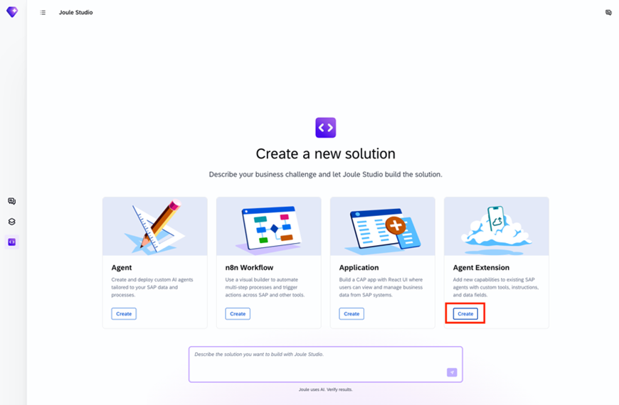  

2. On the **Agent Extension** tile, choose **Create**.

3. On the **Create Extension** dialog, choose **Agent Extension**.

    <!-- border -->
    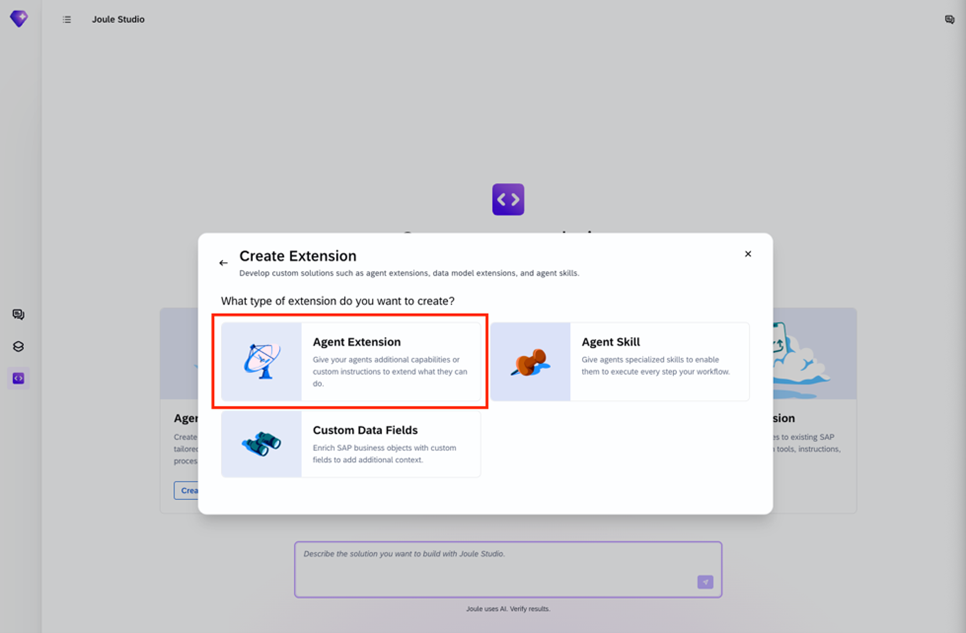  

4. Leave the selected **New Solution** unchanged, and fill in the agent details:

    Agent Name: **`AP Notification`**

    Intent statement: **`Create an extension to the AP Invoice Agent. Add a post-hook n8n workflow. For any invoice that cannot be matched: Create a SAP Task Center task. Send a notification to the responsible AP team member via SAP Task Center.`**

    <!-- border -->
    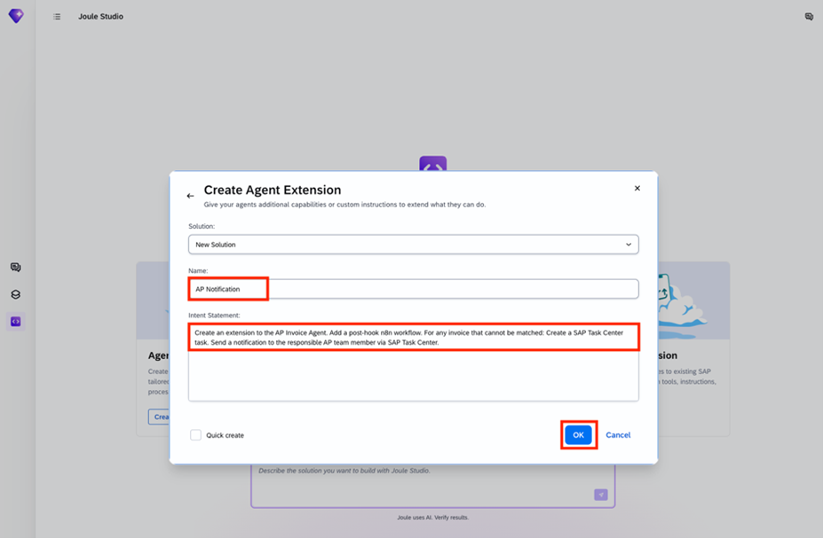


5. Choose **OK**.

    In the panel on the right, you can see that your intent statement has been taken as the starting prompt. It automatically finds the AP Invoice agent and starts creating the extension.

    <!-- border -->
    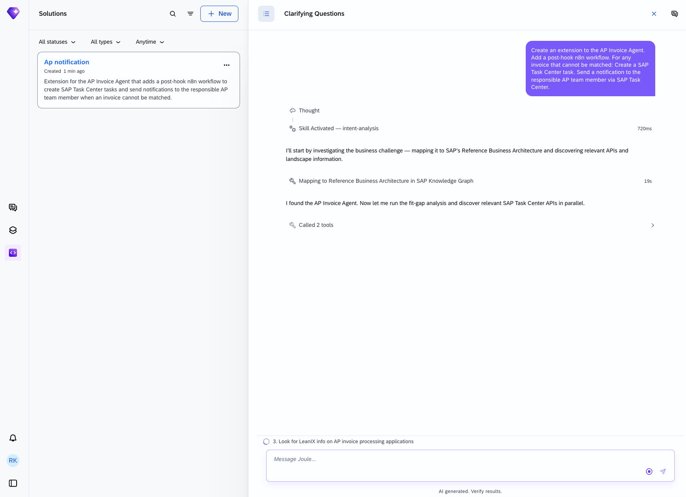


### Intent

This is where the tool tries to understand your intentions. The tool will attempt to understand your prompt and will likely ask you clarifying questions. Once it decides it understands enough, it will map the challenge to SAP's Reference Business Architecture and performs a fit-gap analysis. It has access to SAP Knowledge Graph, SAP LeanIX, and SAP Domain Models to help it create the intent document. Intent fit indicates how closely the proposed solution corresponds to your requirement.

6. If required, answer the questions set by the tool. 

    The questions that the tool asks cannot be predicted, so you have to use your judgement. Bear in mind that the landscape has S/4HANA as a backend so tailor your responses accordingly. The more complex you make your scenario, the longer it will take to generate and test the solution. The screenshot below is just an indication of what you might see. Joule might provide a selection of answers that you can choose from.


    <!-- border -->
    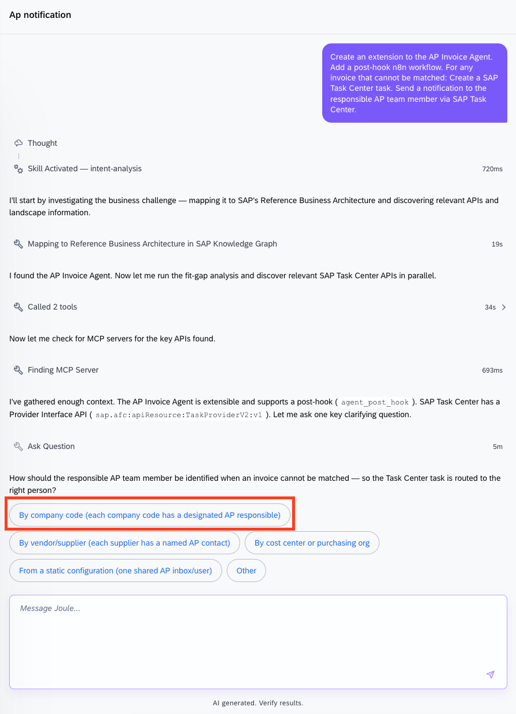


Once the intent document is created, proceed to the next phase, which is requirement generation. This might happen automatically if you have selected quick-create at the start.

7. If processesing is waiting for your input to proceed, enter **Create Requirement** or similar. 

    While the requirements are being generated, you can explore the intent on the **Idea Board**.

    <!-- border -->
    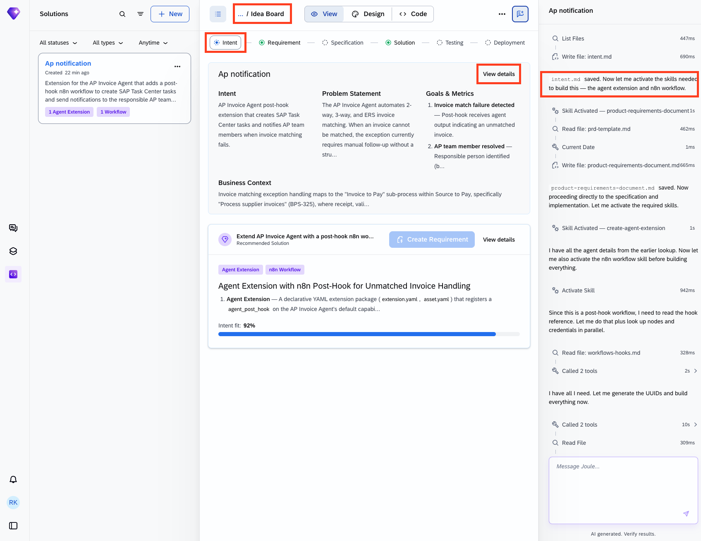


### Requirement

When the requirement is ready, you have the opprortunity to review and refine it. For this tutorial, you will accept suggested product requirement document without changes. To progress to the next phase, you need to transform the PRD into a technical specification. Depending on your role in your company, you might be finished at this point and make the PRD available to a different team to take further. However, in this tutorial, you are taking the project forward with the generation of a technical specification.

8. Similar to the previous step, this might happen automatically if you have selected quick-create at the start. At this stage, you can see the your PRD similar to the one below in markdown format. If you need to update it manually, you can just proceed clicking on the text in the view or by editing the files in the dedicated code tab.

    <!-- border -->
    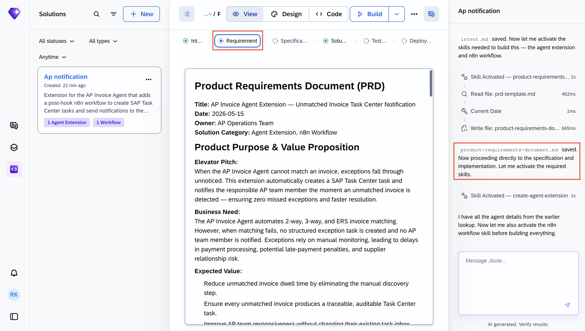


### Solution

9.	Wait until the implementation is finished successfully. You can see in the **Solution** tab, the agent extension is created as a Post Hook using n8n workflows.


    <!-- border -->
    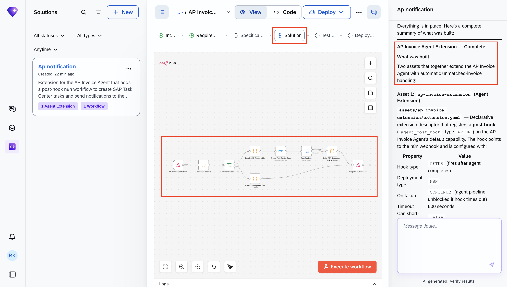


10. You can then explore the n8n code if you need to.

    <!-- border -->
    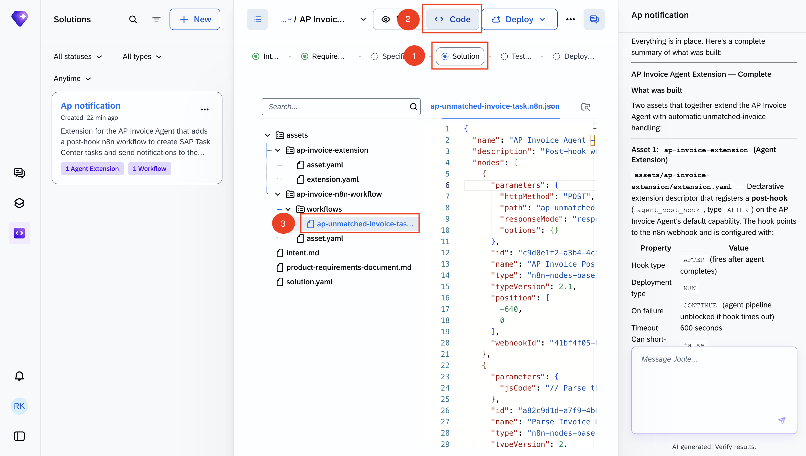

    You have successfully extended the AP Invoice agent with a post hook.

You can also extend the agent by providing additional instructions and context. 

11.	In the **Design** tab, click on **Edit** button under **Instructions and Context**.

    <!-- border -->
    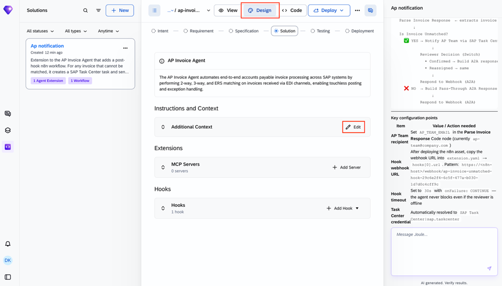

    This allows you to inject domain-specific context, rules, and behavioural guidance into the agent's prompt.

12. Add the following instruction:

    ```
    Tax Validation Policy: ALWAYS validate tax on pending invoices using the validate-tax tool before recommending approval. Response Handling: 
    - ERROR/BLOCK: Flag as non-approvable 
    - WARNING: Note discrepancy, allow with warning 
    - OK: Safe to approve 
    Note: Watch for International vendors charging domestic tax rates on cross-border shipments. 
    ```

    <!-- border -->
    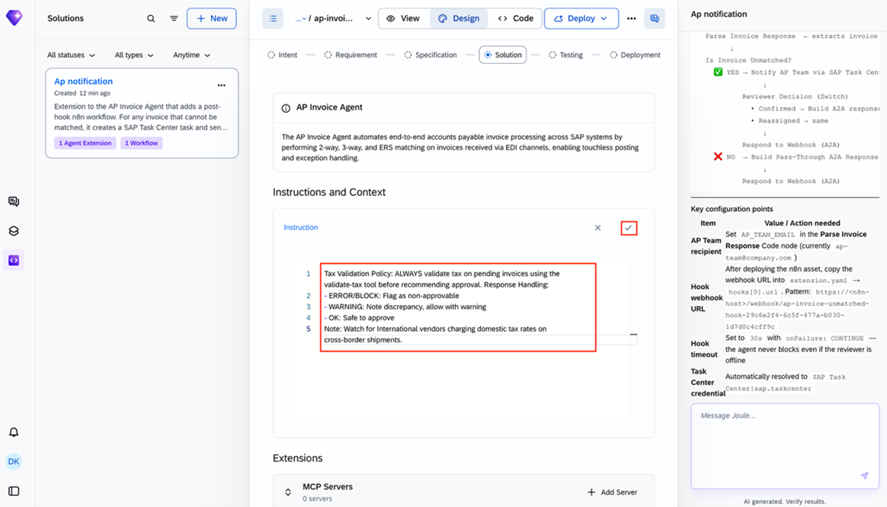

You can also extend the agent by connecting to agent to additional MCP servers and tools that the agent can invoke at. 

12. In the **Design** tab, click on **Add Server** button under **Extensions** -> **MCP Servers**.

    <!-- border -->
    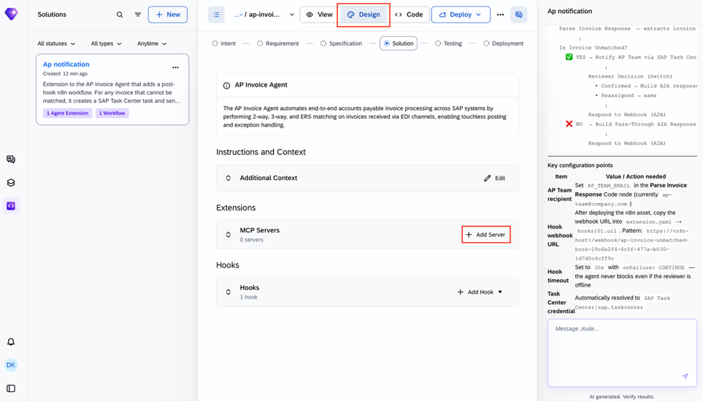


You can see the available MCP servers. 

13. Click on **View Details**.

    <!-- border -->
    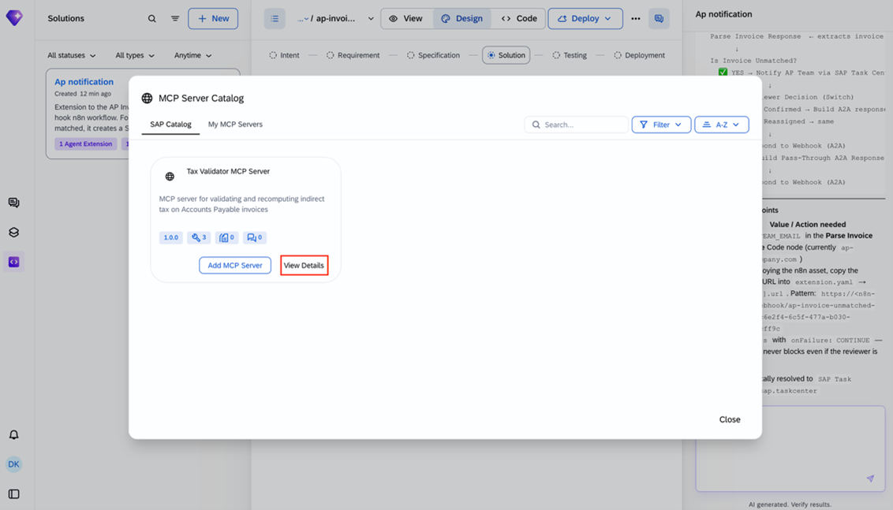

You will see the available tools in the MCP server with their descriptions. 

14. Click **Add MCP Server**.

    <!-- border -->
    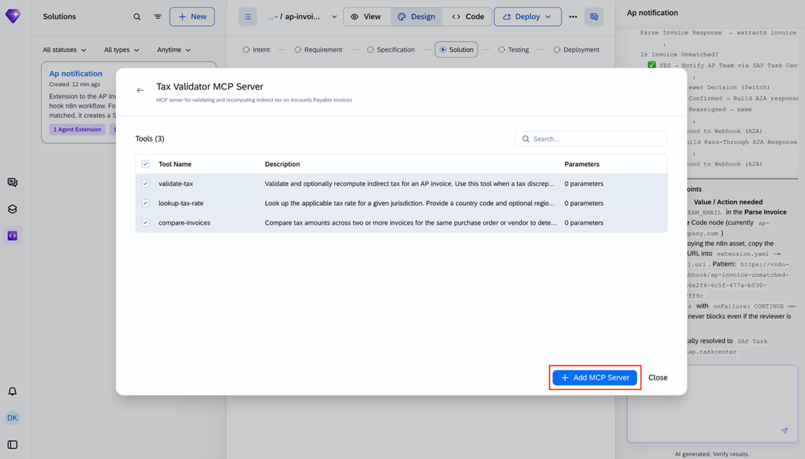


    You have successfully extended the AP Invoice agent with instructions, MCP Servers and Hooks.

    <!-- border -->
    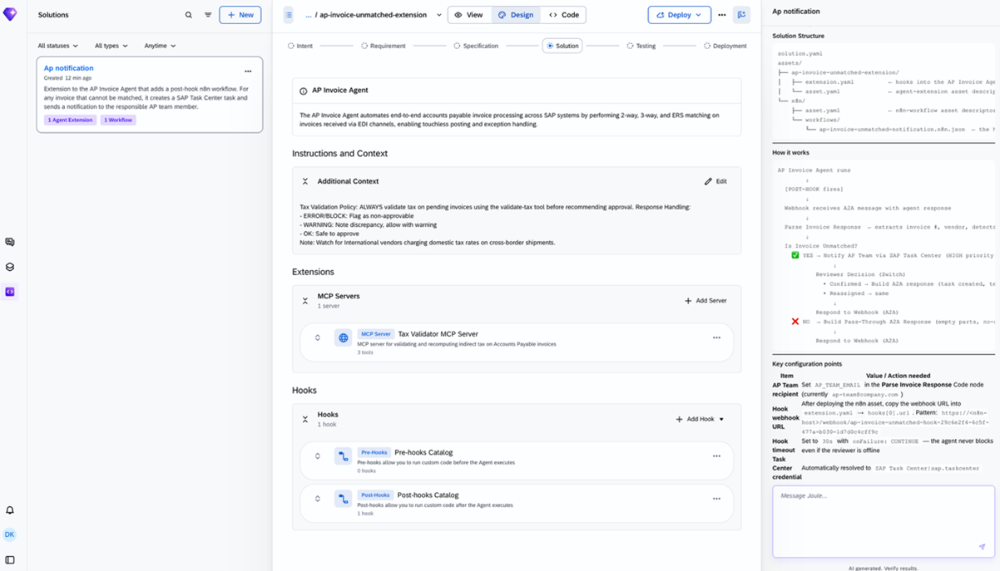

For the Agent Lab at SAPPHIRE, you will not be deploying your agent. However, the code that has been generated follows SAP best practices and would be deployable to the runtime by choosing **Deploy**.


