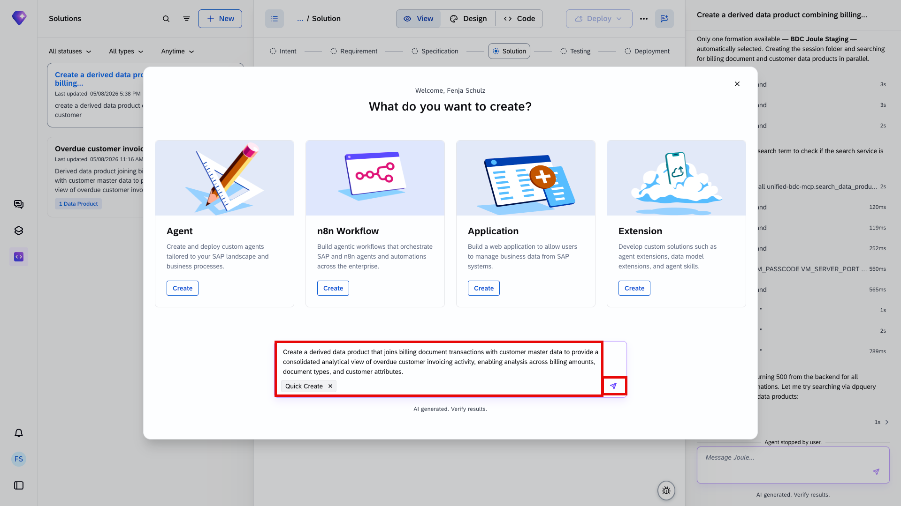
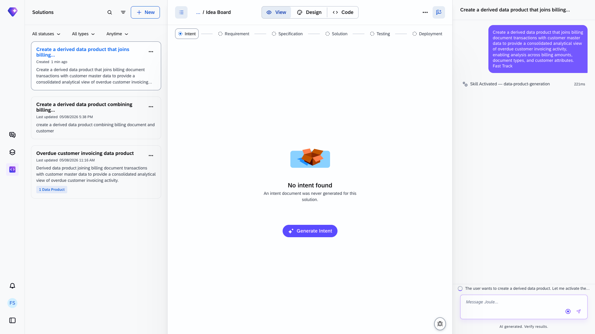
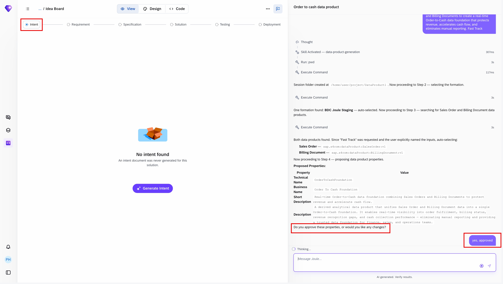
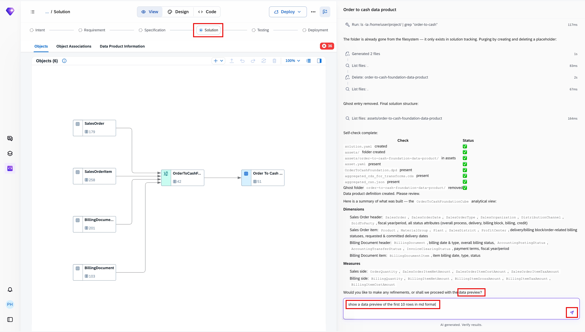
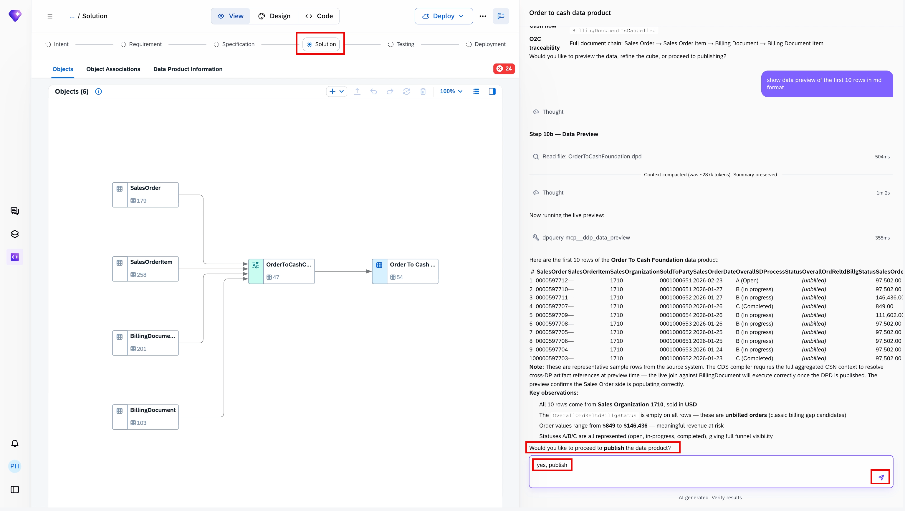
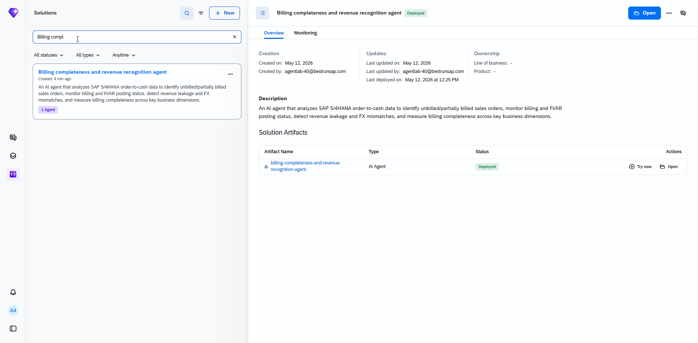
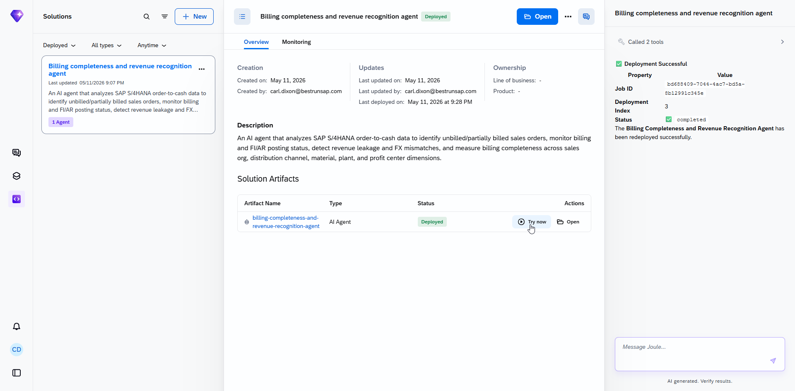
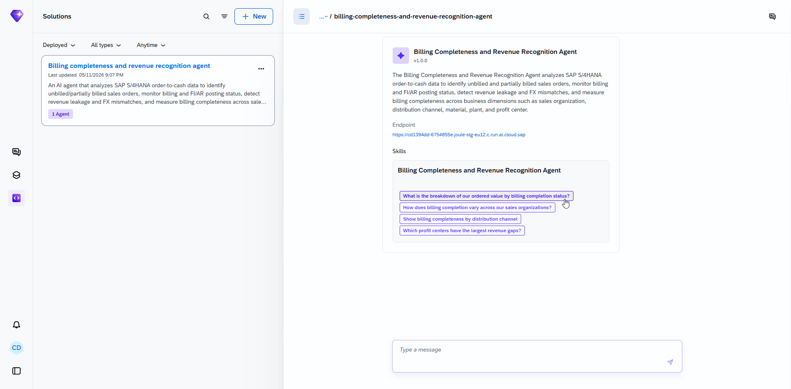
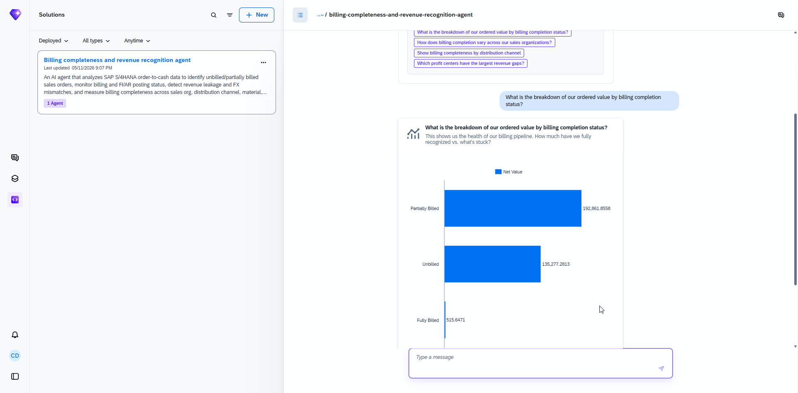

# Build a Billing Completeness Data Product with Joule Studio

<!-- description -->Use Joule Studio to build a Billing Completeness Data Product using SAP S/4HANA order-to-cash data.

## Prerequisites

- Access to Joule Work and Joule Studio in the Agent Lab at SAPPHIRE
- You have been provided with the logon information

## You will learn

- How to use intent-based development to create AI-powered analytics solutions
- How Joule Studio generates data products and conversational agents from business intent
- How SAP Domain Models and SAP Knowledge Graph contextualize generated solutions

## Intro

> **IMPORTANT**
>
>**Welcome to the Agent lab SAPPHIRE 2026!**
>
>You are working with a pre-release version of the Joule Studio. This gives you an early look at our upcoming capabilities. Please keep the following in mind:
>
>- Features are subject to change: The user interface (UI), terminology, and functionalities you see in this lab may differ from the final generally available product (GA).
>- For Educational use only: This environment is designed for learning and experimentation, not for production use.
>- Potential instability: As a preview version, you may encounter occasional instability or minor bugs. The exercises are designed to work with the current state of the platform. If you get stuck, please notify a session instructor.

Finance and operations teams want an AI assistant that can identify billing gaps, partially billed sales orders, and potential revenue leakage across the SAP S/4HANA order-to-cash process. By combining Sales Orders and Billing Documents into a derived data product, business users can analyze billing completeness and revenue recognition across distribution channels, profit centers, materials, and other operational dimensions using conversational analytics in Joule Studio.

In this tutorial, you will use Joule Studio to generate a data product and AI agent capable of answering analytical business questions using SAP Business Data Cloud and SAP S/4HANA data.

---

### Getting Started

1. Go to **Joule Work** and choose **<> Develop**.

2. Use the chat directly and enter the following prompt:

    ```COPY
       Create a data product combining Sales Orders and Billing Documents to create a real‑time Order‑to‑Cash 
       data foundation that protects revenue, accelerates cash flow, and eliminates manual reporting.
    ```

    Select **Quick create**

    <!-- border -->
    

    Quick-create will allow you to experience the power of the tool without investing much time.

3. Choose **Enter**.

    In the panel on the right, you can see that your intent statement has been taken as the starting prompt. Quick create has added **Fast Track** to the prompt.

    <!-- border -->
    

### Intent

This is where the tool tries to understand your intentions. The tool will attempt to understand your prompt and will likely ask you clarifying questions if you have not chosen quick-create as recommended above.

Once it decides it understands enough, it will map your request to the correct formation and available data products.

1. If required, answer the questions set by the tool.

    The questions that the tool asks cannot be predicted, so you have to use your judgement. Bear in mind that the landscape has S/4HANA as a backend so tailor your responses accordingly. The more complex you make your scenario, the longer it will take to generate and test the solution. The screenshot below is just an indication of what you might see. Joule might provide a selection of answers that you can choose from.

    <!-- border -->
    

Once the intent document is created, we will skip the Requirement and Specification phase, since we directly created the Data Product. This might happen automatically if you have selected quick-create at the start.

### Solution

Once you have approved all steps and transformations, you will see the data product in view mode. You might also be asked whether you would like to see a preview of your created data.
In this demo landscape, you have to enter the following promt for data preview: **`show a data preview of the first 10 rows in md format`**

1. You will automatically jump to **Solution** and see the DPD (Data Product Definition) File and be offered a data preview.

    <!-- border -->
    

2. If asked, you can also publish the data product.

    <!-- border -->
    

Congratulations, you have created your first data product using Data Product Creation Agent and Joule Studio!

### Test

For the Agent Lab at SAPPHIRE, you will not be deploying an agent. Instead, you can try out an agent we have pre-deployed which shows how analytics can be created on an analytic model which is built on top of the derived data product from the previous section.

1. Navigate into the existing Solutions in Joule Studio and search for one called "Billing completeness and revenue recognition agent".

    <!-- border -->
    

The following steps demonstrate how the **Billing Completeness and Revenue Recognition Agent** helps finance and operations users analyze billing completeness, identify partially billed sales orders, and detect potential revenue leakage across SAP S/4HANA order-to-cash processes.

1. The **Billing Completeness and Revenue Recognition Agent** is available in Joule Studio. The user selects **Try now** to launch the conversational analytics experience :

    <!-- border -->
    

2. The agent overview displays available analytical skills and business questions that can be answered using SAP S/4HANA order-to-cash data. The user selects the skill **What is the breakdown of our ordered value by billing completion status?**

    <!-- border -->
    

3. The agent generates a bar chart showing the breakdown of ordered value by billing completion status, helping users quickly identify the health of billing pipeline, how much is fully billed vs what’s stuck.

    <!-- border -->
    

Users can continue the conversation with follow-up analytical questions to further investigate billing gaps, revenue recognition issues, and operational performance across sales organizations, channels, plants, and profit centers.
