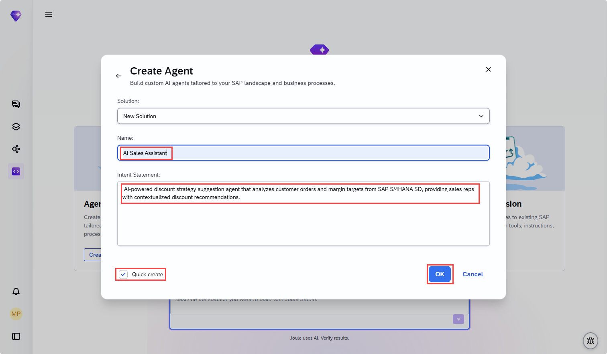
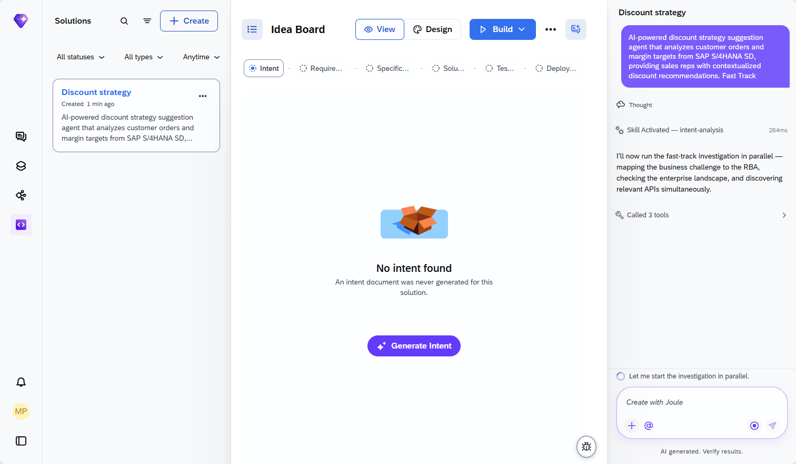
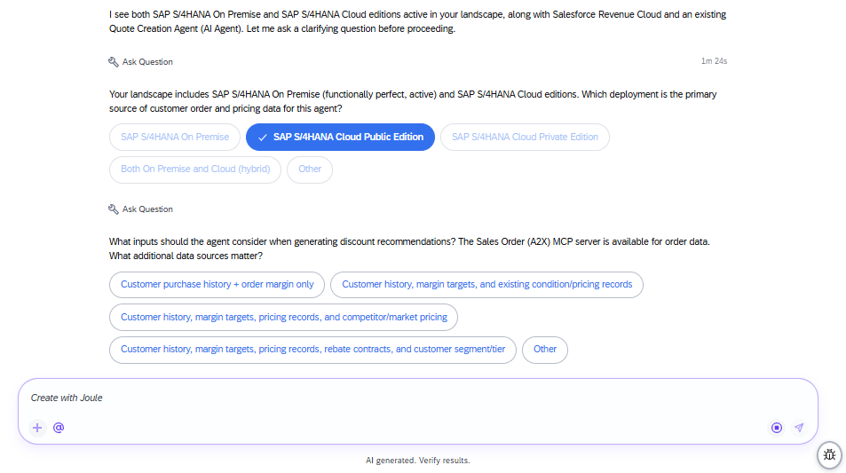
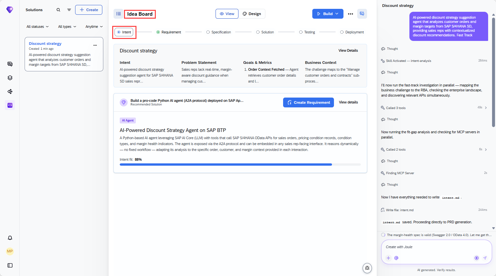
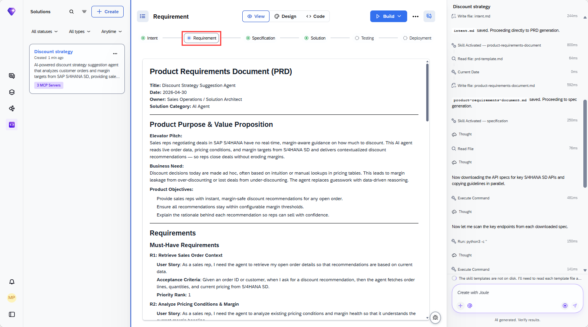
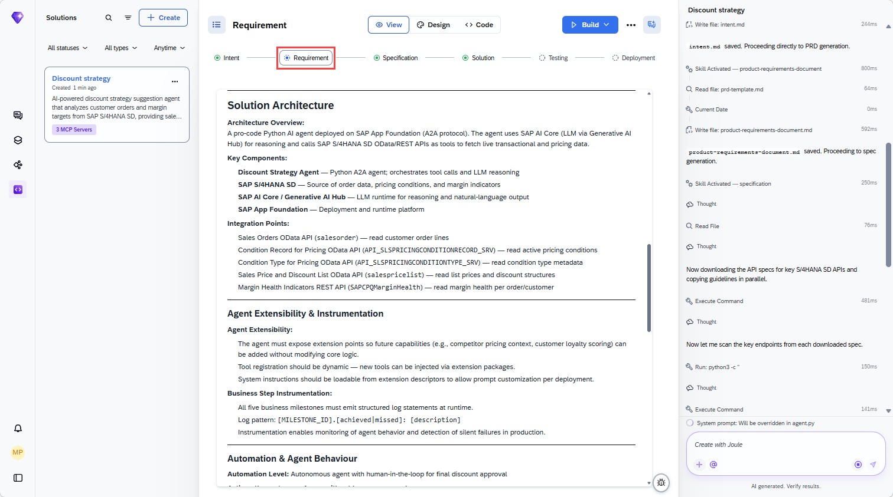
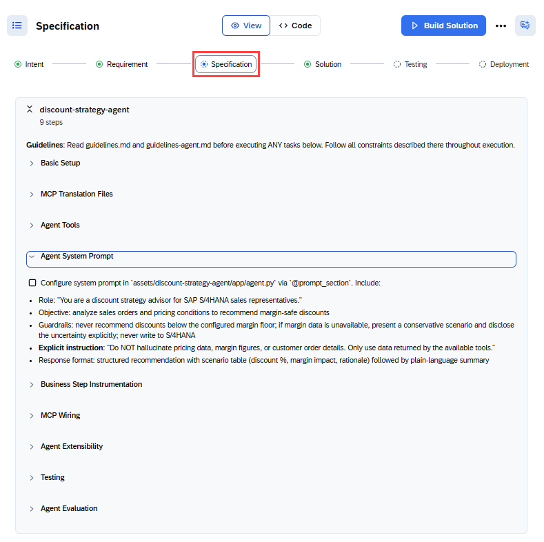
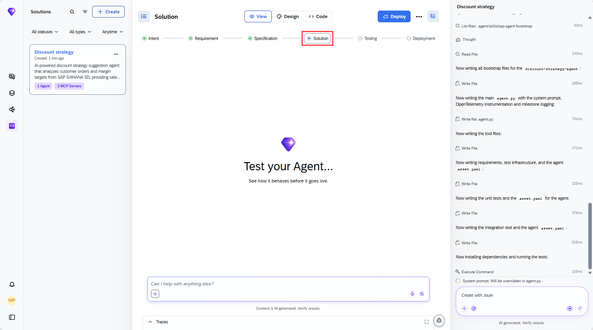
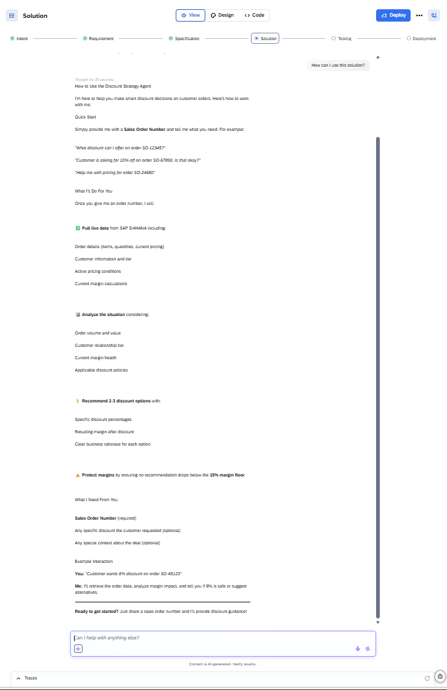

# Use Joule Studio to Create an AI Assistant for Sales Reps

<!-- description -->Use Joule Studio to Create an AI Assistant for Customer Experience Sales Reps.

## Prerequisites

- Access to Joule Work and Joule Studio in the Agent Lab at SAPPHIRE
- You have been provided with the logon information

## You will learn

- How to use intent-based development to create AI solutions
- How SAP Domain Models and other resources are leveraged to contextualize the generated solution

## Intro

>**IMPORTANT**
>
>**Welcome to the Agent lab SAPPHIRE 2026!**
>
>You are working with a pre-release version of the Joule Studio. This gives you an early look at our upcoming capabilities. Please keep the following in mind:
>
> * Features are subject to change: The user interface (UI), terminology, and functionalities you see in this lab may differ from the final generally available product (GA).
> * For Educational use only: This environment is designed for learning and experimentation, not for production use.
> * Potential instability: As a preview version, you may encounter occasional instability or minor bugs. The exercises are designed to work with the current state of the platform. If you get stuck, please notify a session instructor.

Sales Representatives want an AI assistant to suggest 2–3 ranked discount strategies based on the customer's order history and the margin targets so that they can negotiate from a position of data rather than instinct.​ Each strategy should include suggested discount %, rationale, estimated win probability, and projected margin impact.​ In this tutorial, you will be provided with a prompt that focusses on the agent creation. This will give you the best chance to see the development process in a short time.

---

### Getting Started

1. Go to **Joule Work**.

    If you do not see the tiles, choose **<> Develop**.

    <!-- border -->
      

2. On the **Agent** tile, choose **Create**.

3. Leave the selected **New Solution** unchanged, and fill in the agent details:

    Agent Name: **`AI Sales Assistant`**

    Intent statement: **`AI-powered discount strategy suggestion agent that analyzes customer orders and margin targets from SAP S/4HANA SD, providing sales reps with contextualized discount recommendations.`**

    Select **Quick create**.

    <!-- border -->
    

    Quick-create will allow you to experience the power of the tool without investing much time.

4. Choose **OK**.

    In the panel on the right, you can see that your intent statement has been taken as the starting prompt. Quick create has added **Fast Track** to the prompt.

    <!-- border -->
    

### Intent

This is where the tool tries to understand your intentions. The tool will attempt to understand your prompt and will likely ask you clarifying questions if you have not chosen quick-create as recommended above.

Once it decides it understands enough, it will map the challenge to SAP's Reference Business Architecture and performs a fit-gap analysis. It has access to SAP Knowledge Graph, SAP LeanIX, and SAP Domain Models to help it create the intent document. Intent fit indicates how closely the proposed solution corresponds to your requirement.

5. If required, answer the questions set by the tool. 

    The questions that the tool asks cannot be predicted, so you have to use your judgement. Bear in mind that the landscape has S/4HANA as a backend so tailor your responses accordingly. The more complex you make your scenario, the longer it will take to generate and test the solution. The screenshot below is just an indication of what you might see. Joule might provide a selection of answers that you can choose from.

    <!-- border -->
    

Once the intent document is created, proceed to the next phase, which is requirement generation. This might happen automatically if you have selected quick-create at the start.

6. If processesing is waiting for your input to proceed, enter **Create Requirement** or similar. 

    While the requirements are being generated, you can explore the intent on the **Idea Board**.

    <!-- border -->
    

### Requirement

When the requirement is ready, you have the opprotunity to review and refine it. For this tutorial, you will accept suggested product requirement document without changes. To progress to the next phase, you need to transform the PRD into a technical specification. 

Depending on your role in your company, you might be finished at this point and make the PRD available to a different team to take further. However, in this tutorial, you are taking the project forward with the generation of a technical specification.

7. Enter **Create Specification**. This might happen automatically if you have selected quick-create at the start.

    While the specification is being generated, you can explore the **Requirement**.

    <!-- border -->
    

    In particular, look at the **Solution Architecture** section to see what will be created.

    <!-- border -->
    

### Specification

When the specification is complete you could pass it on to another team to do the implementation. However, here you are going to get the tool to implement the agent.  This might happen automatically if you have selected quick-create at the start.

8. If processesing is waiting for your input, enter **Implement the Solution**.

    The tool will work through the tasks defined in the specification. When it is finished, it will update the specification to show the tasks have been done.

    While the solution is being generated, you can explore the **Specification**.

    <!-- border -->
    

### Solution and Testing

Wait until the unit tests are finished successfully. You can then try out your agent.

9. Go to **Testing** and see the results of the unit testing. 

10. Go to **Solution** and try your agent. What you can do will depend on what has been implemented.

    <!-- border -->
    

11. Ask **`How can I use this solution?`**.

    <!-- border -->
    

   For the Agent Lab at SAPPHIRE, you will not be deploying your agent. However, the code that has been generated follows SAP best practices and would be deployable to the runtime by choosing **Deploy**.

   For your next steps, try the other scenarios provided as part of the Agent Lab or repeat this exercise without quick-create enabled.

