# Use Joule Studio to Create an FI Collection Email Drafting Assistant

<!-- description -->Use Joule Studio to create and test an agent for an intelligent finance Assistant

## Prerequisites

- Access to Joule Work and Joule Studio in the Agent Lab
- You have been provided with the logon information

## You will learn

- How to use intent-based development to create AI solutions, workflows and extensions
- How SAP Domain Models and other resources are leveraged to contextualize the generated solution

## Intro

>**IMPORTANT**
>
>**Welcome to the Agent Lab**
>
>You are working with a pre-release version of the Joule Studio. This gives you an early look at our upcoming capabilities. Please keep the following in mind:
>
> - **Features are subject to change:** The UI, terminology, and functionality you see may differ from the final product.
> - **Educational use only:** This environment is designed for learning and experimentation, not for production use.
> - **Potential instability:** As a preview version, you may encounter occasional instability or unexpected behavior.

Collection's specialists spend significant time manually crafting dunning and collection emails for each customer. Collectors need an agent that reads payment history and open AR items from SAP S/4HANA and generates context-aware, personalized collection emails hence reducing manual effort and improving collection effectiveness. Learn how to create such an intelligent finance assistant in a short time using Joule Studio's **intent-based development**.

### Getting Started

1. Open **Joule Work**

    If you do not see the tiles, choose **<> Develop**.

2. On the **Agent** tile, choose **Create**.

    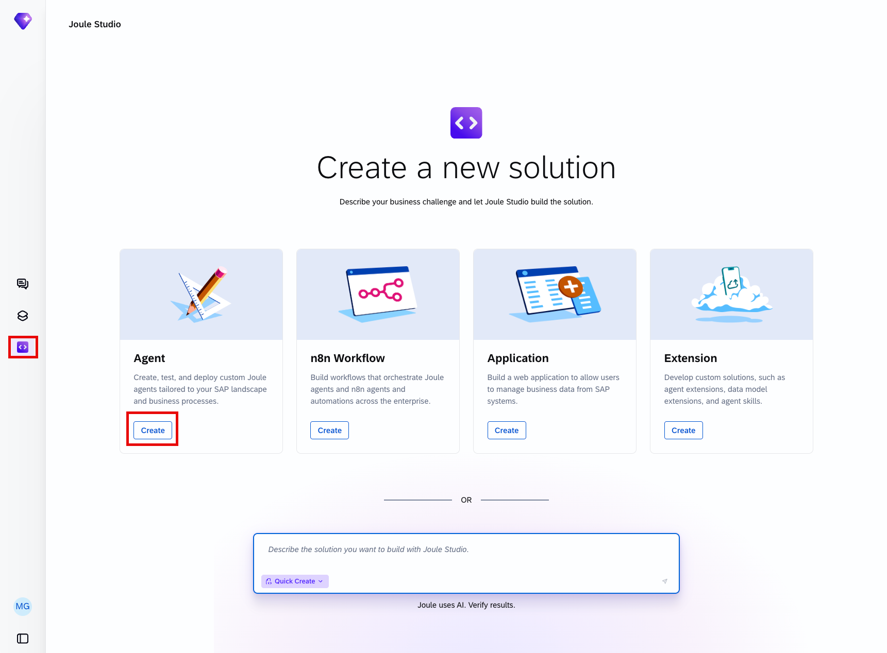


3. In the **Create Agent** dialog, leave the selected **New Solution** unchanged, and fill in the agent details:

    Agent Name:

    ```COPY
    AR Collection Email
    ```

    Intent Statement:

    ```COPY
    Create an agent which drafts personalized collection emails based on payment history and outstanding items.
    ```

    > You may either choose option **Quick Create** by skipping clarifying questions and start directly building the solution or choose option **Ideate and plan** by refining the intent before building. Please choose the option that best suits your needs by clicking on one of the below tabs.

[OPTION BEGIN [Quick Create]]

1. Check the **Quick Create** checkbox below the intent statement and choose **Create**.

    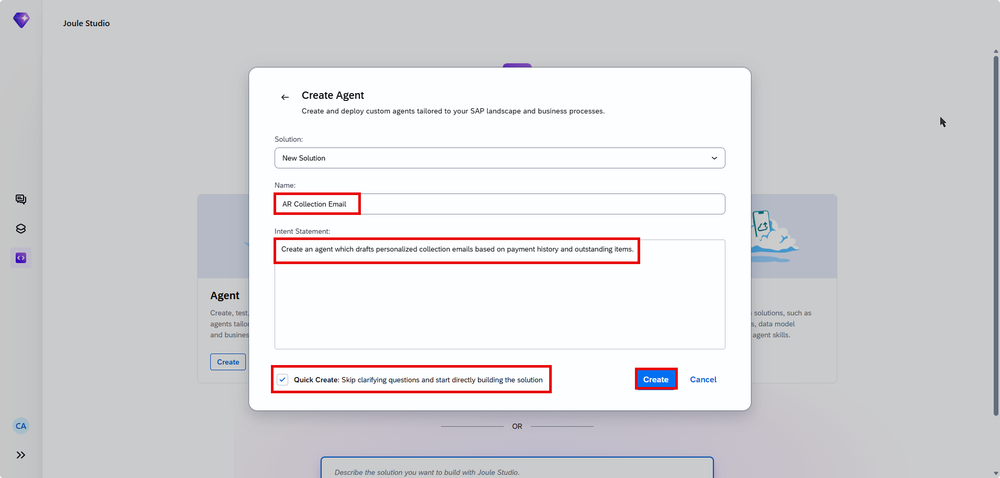

    **Quick Create** option will allow you to experience the power of the tool without investing much time.

2. In the panel on the right, you can see that your intent statement has been taken as the starting prompt. **Quick Create** has added **Fast Track** to the prompt.

    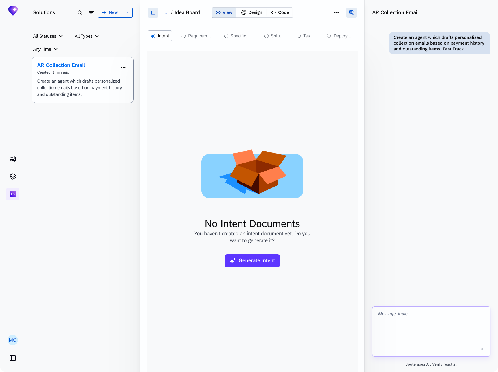

    **Alternative:** If you prefer a faster setup, type your intent directly into the Joule Studio input field on the home screen and click **Quick Create**. Skips the clarifying questions and starts directly building the solution.

    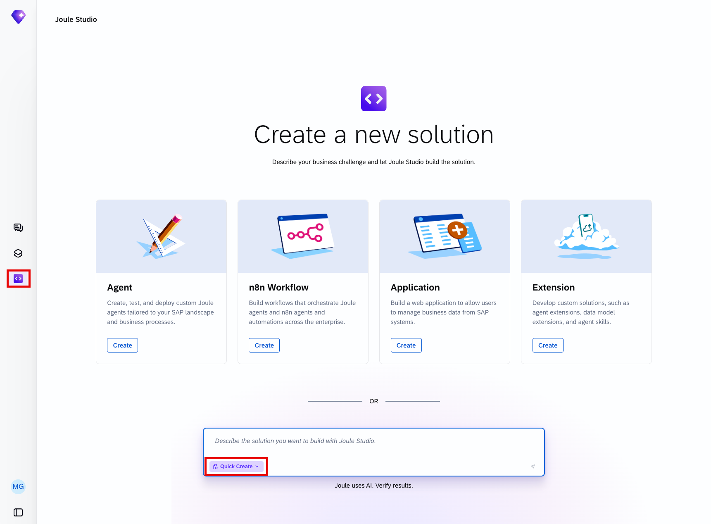

[OPTION END]

[OPTION BEGIN [Ideate and Plan]]

1. Uncheck the **Quick Create** checkbox below the intent statement and choose **Create**.

    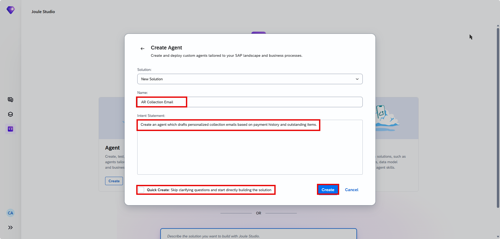

    Unchecking **Quick Create** option will allow you to answer clarifying questions to capture your intent in more detail before building the solution.

2. In the panel on the right, you can see that your intent statement has been taken as the starting prompt.

    

    **Alternative:** If you prefer a faster setup, type your intent directly into the Joule Studio input field on the home screen and select **Ideate and plan**. You'll be asked to answer some clarifying questions before building the solution.

    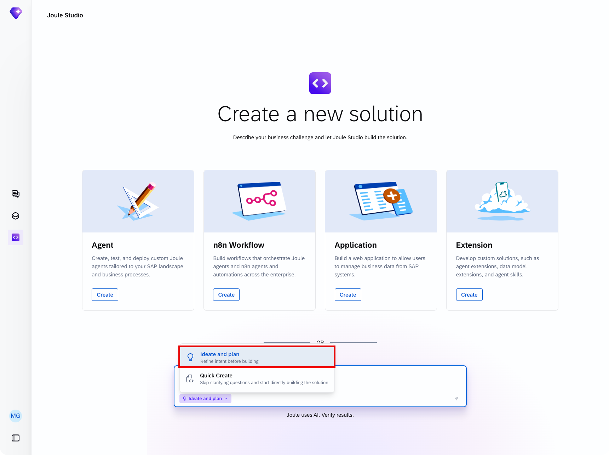

[OPTION END]

### Intent

This is where the tool tries to understand your intentions. The tool will attempt to understand your prompt and will likely ask you clarifying questions if you have not chosen **Quick Create** as mentioned above.

Once it decides it understands enough, it will map the challenge to SAP’s Reference Business Architecture and performs a fit-gap analysis. It has access to SAP Knowledge Graph, SAP LeanIX, and SAP Domain Models to help it create the intent document. Intent fit indicates how closely the proposed solution corresponds to your requirement.

1. If required, answer the questions set by the tool. The questions that the tool asks cannot be predicted, so you have to use your judgement. Bear in mind that the landscape has S/4HANA as a backend so tailor your responses accordingly. The more complex you make your scenario, the longer it will take to generate and test the solution. The screenshot below is just an indication of what you might see. Joule might provide a selection of answers that you can choose from.

    | **Question** | **Answer** |
    | ------------ | ---------- |
    | Who are the primary users of this agent? (e.g., Accounts Receivable clerks, finance managers, collections team) | Accounts receivable clerks and finance managers |
    | What pain points do they face today when drafting collection emails? | Manual email draftings, escalation tone Is applied inconsistently, inaccurate emails damage customer relationships |
    | What data should the agent use to personalize emails? | Outstanding invoice amounts and due dates, customer payment history, customer master data |
    | How should the agent handle escalation? | Select a tone automatically (friendly reminder → firm → legal warning) based on days overdue or number of prior reminders. AR clerk must review and approve drafts before sending. |
    | What is your current system landscape? | SAP S/4HANA Public Cloud |
    | What does success look like for this agent? | Reduction in time spent drafting emails, improved collection rate, fewer customer complaints about tone or inaccurate content |

    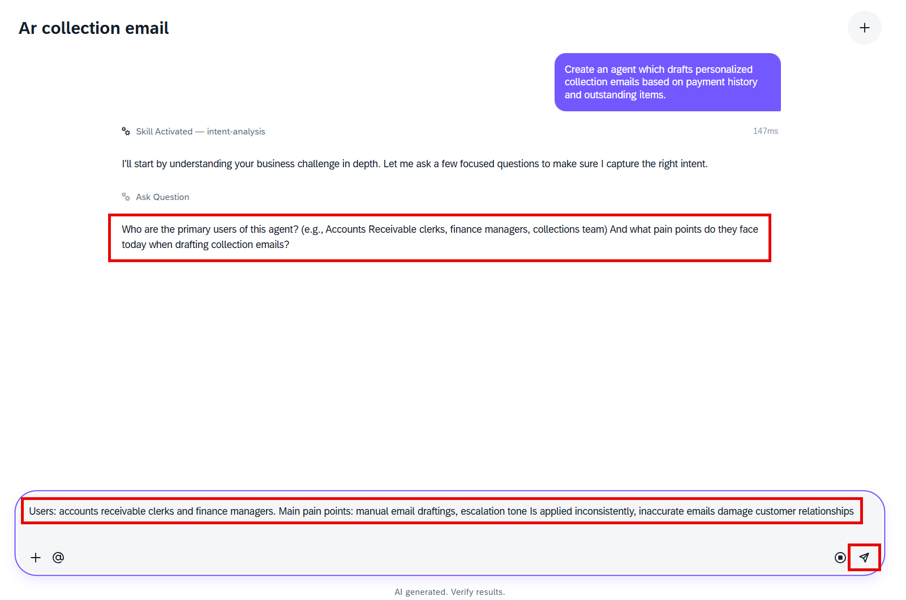

2. Once the intent document is created, proceed to the next phase, which is requirement generation. This might happen automatically if you have selected **Quick Create** at the start. If processing is waiting for your input to proceed, enter Create Requirement or similar. While the requirements are being generated, you can explore the intent on the Idea Board.

    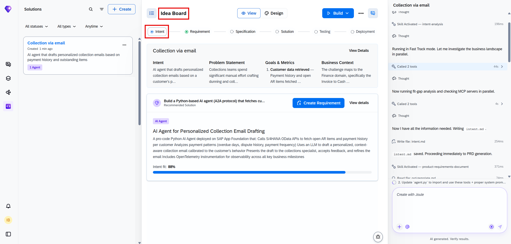

### Requirement

When the requirement is ready, you have the opportunity to review and refine it. For this tutorial, you will accept suggested product requirement document without changes. To progress to the next phase, you need to transform the PRD into a technical specification.

Depending on your role in your company, you might be finished at this point and make the PRD available to a different team to take further. However, in this tutorial, you are taking the project forward with the generation of a technical specification.

1. Enter **Create Specification**. This might happen automatically if you have selected **Quick Create** at the start. While the specification is being generated, you can explore the **Requirement**.

    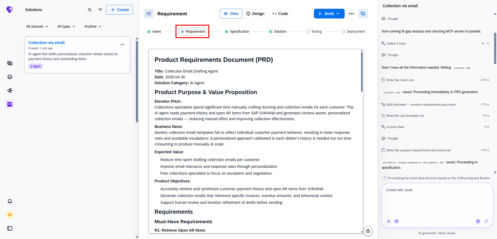

2. In particular, look at the **Solution Architecture** section to see what will be created.

    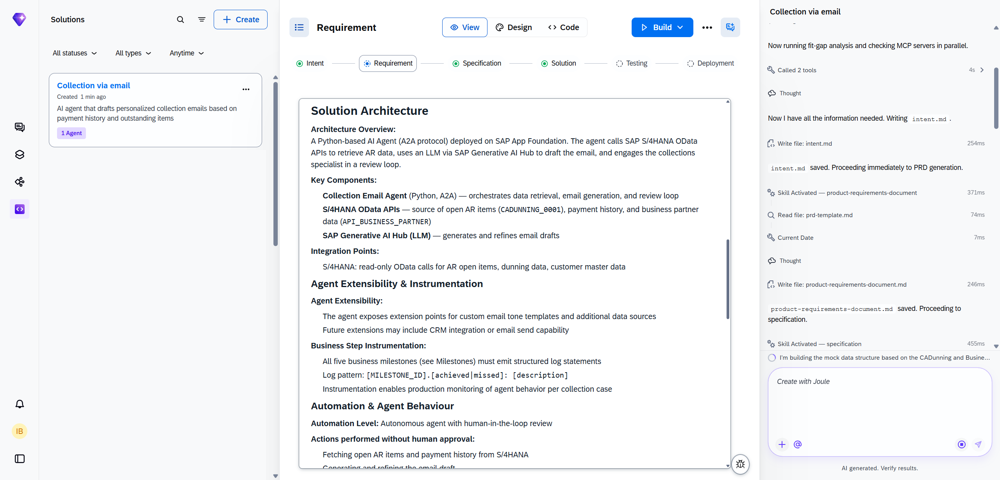

### Specification

When the specification is complete you could pass it on to another team to do the implementation. However, here you are going to get the tool to implement the agent. This might happen automatically if you have selected **Quick Create** at the start.

1. If processing is waiting for your input, enter **Implement the Solution**. The tool will work through the tasks defined in the specification. When it is finished, it will update the specification to show the tasks have been done. While the solution is being generated, you can explore the **Specification**.

    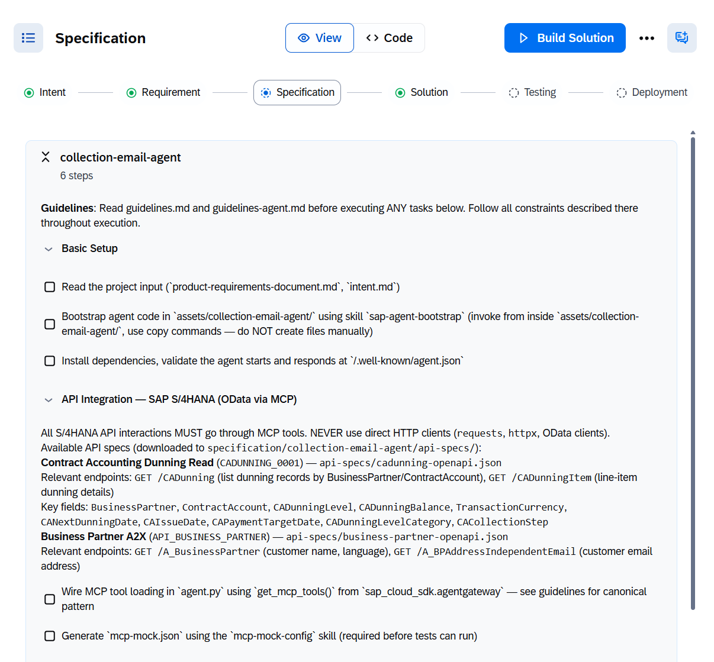

### Solution

Wait until the solution is implemented successfully. You can then try out your agent.

1. Go to **Solution** and try your agent. What you can do will depend on what has been implemented.

    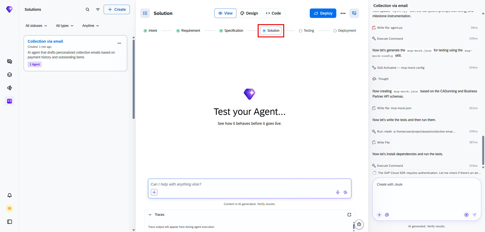

2. Ask `How can I use this solution?`.

    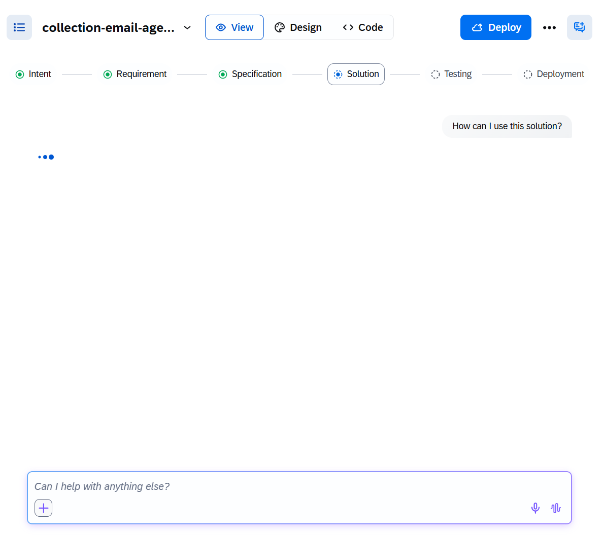

3. You can check the solution **Code**.

    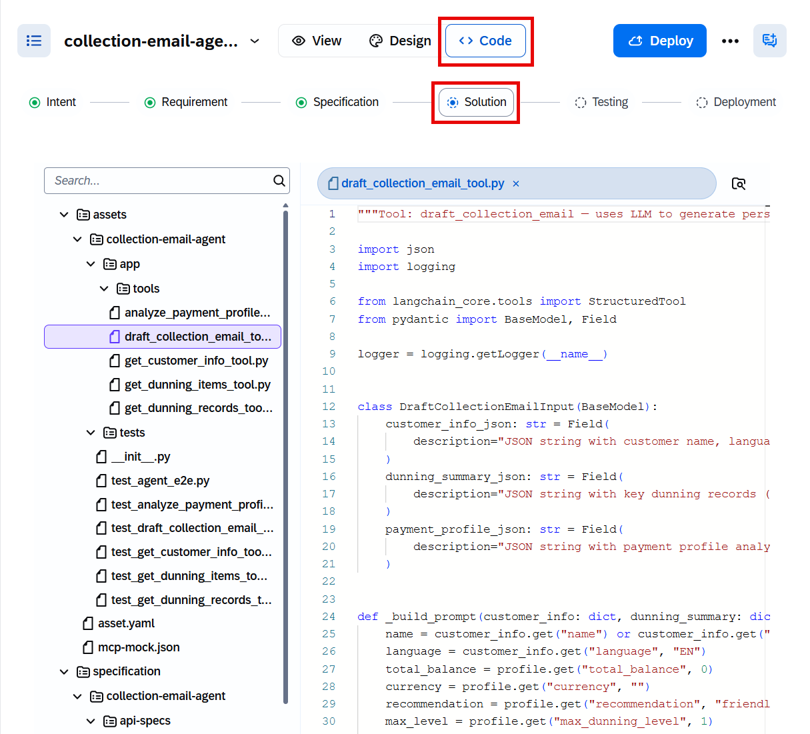

For the Agent Lab, you will not be deploying your agent. However, the code that has been generated follows SAP best practices and would be deployable to the runtime by choosing **Deploy**.
