# Use Joule Studio to Create an FI Collection Workbench

<!-- description -->Use Joule Studio to create and test an agent for an intelligent finance workbrench.

## Prerequisites

- Access to Joule Work and Joule Studio in the Agent Lab at SAPPHIRE
- You have been provided with the logon information

## You will learn

- How to use intent-based development to create AI solutions, workflows and extensions
- How SAP Domain Models and other resources are leveraged to contextualize the generated solution

## Intro

>**IMPORTANT**
>
>**Welcome to the Agent lab SAPPHIRE 2026!**
>
>You are working with a pre-release version of the Joule Studio. This gives you an early look at our upcoming capabilities. Please keep the following in mind:
>
> - Features are subject to change: The user interface (UI), terminology, and functionalities you see in this lab may differ from the final generally available product (GA).
> - For Educational use only: This environment is designed for learning and experimentation, not for production use.
> - Potential instability: As a preview version, you may encounter occasional instability or minor bugs. The exercises are designed to work with the current state of the platform. If you get stuck, please notify a session instructor.

Collections specialists are losing productive hours manually monitoring overdue accounts, deciding who to follow up with, and writing generic dunning letters that customers ignore. They need a purpose-built workbench that surfaces the right accounts at the right time, automatically dispatches tiered reminder emails, and uses AI to draft personalized collection correspondence grounded in each customer's actual payment history, all in one place. Learn how to create such an intelligent finance workbench in a short time using Joule Studio's **intent-based development**.

### Getting Started

1. Open **Joule Work** and choose **+ Create**.

2. Enter the following prompt (delete **Quick Create** option if presented):

    ```COPY
        I need a collections workbench that shows overdue customer receivables. 
        Set up automated payment reminder sequences, and create an AI assistant that can draft personalized 
        collection emails based on the customer's payment history and outstanding invoices.
    ```

    <!-- border -->
    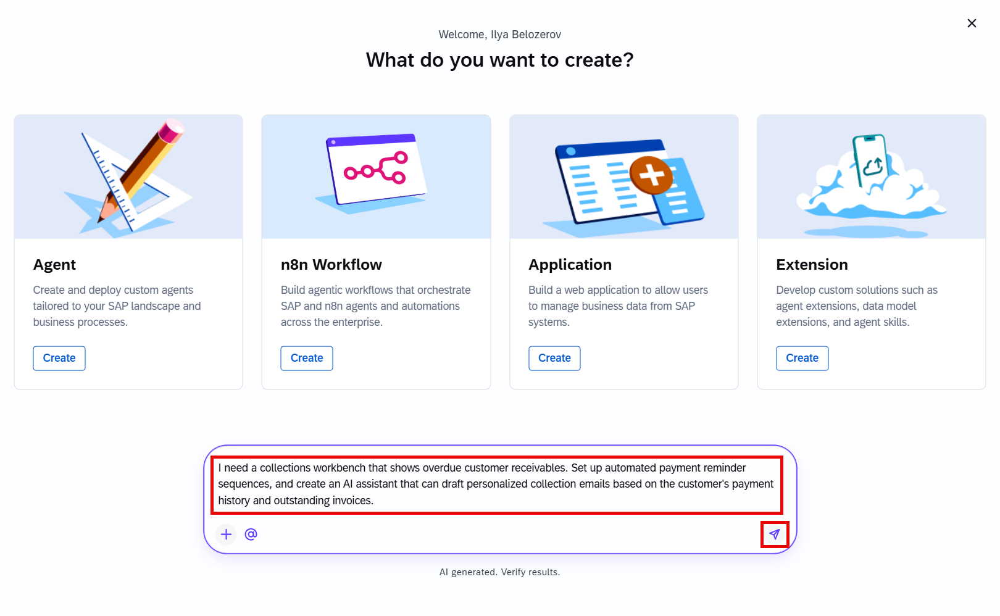

3. Choose **OK**. In the panel on the right, you can see that your intent statement has been taken as the starting prompt.

    <!-- border -->
    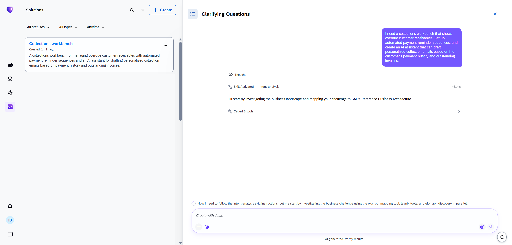

### Intent

This is where the tool tries to understand your intentions. The tool will attempt to understand your prompt and will likely ask you clarifying questions if you have not chosen quick-create as recommended above.

Once it decides it understands enough, it will map the challenge to SAP’s Reference Business Architecture and performs a fit-gap analysis. It has access to SAP Knowledge Graph, SAP LeanIX, and SAP Domain Models to help it create the intent document. Intent fit indicates how closely the proposed solution corresponds to your requirement.

1. If required, answer the questions set by the tool. The questions that the tool asks cannot be predicted, so you have to use your judgement. Bear in mind that the landscape has S/4HANA as a backend so tailor your responses accordingly. The more complex you make your scenario, the longer it will take to generate and test the solution. The screenshot below is just an indication of what you might see. Joule might provide a selection of answers that you can choose from.

    <!-- border -->
    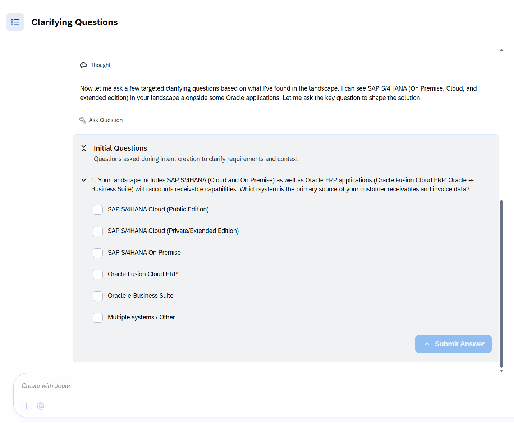

2. Once the intent document is created, proceed to the next phase, which is requirement generation. This might happen automatically if you have selected quick-create at the start. If processesing is waiting for your input to proceed, enter Create Requirement or similar. While the requirements are being generated, you can explore the intent on the Idea Board.

    <!-- border -->
    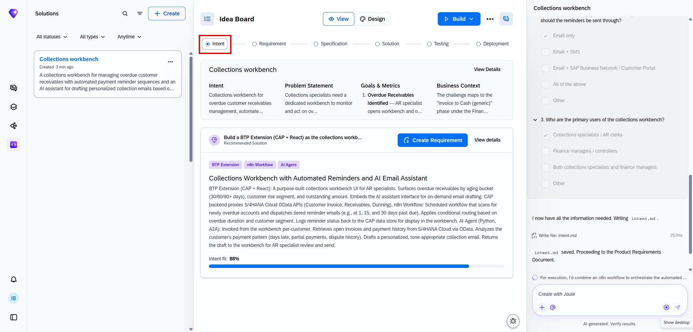

### Requirement

When the requirement is ready, you have the opportunity to review and refine it. For this tutorial, you will accept suggested product requirement document without changes. To progress to the next phase, you need to transform the PRD into a technical specification.

Depending on your role in your company, you might be finished at this point and make the PRD available to a different team to take further. However, in this tutorial, you are taking the project forward with the generation of a technical specification.

1. Enter **Create Specification**. This might happen automatically if you have selected quick-create at the start. While the specification is being generated, you can explore the **Requirement**.

    <!-- border -->
    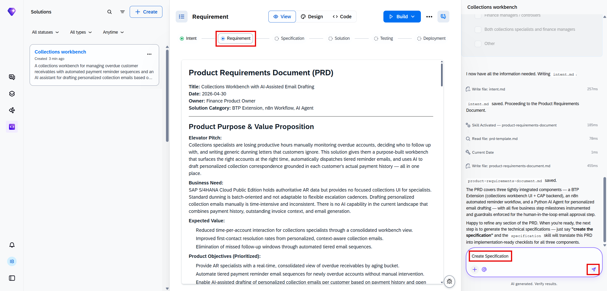

2. In particular, look at the **Solution Architecture** section to see what will be created.

    <!-- border -->
    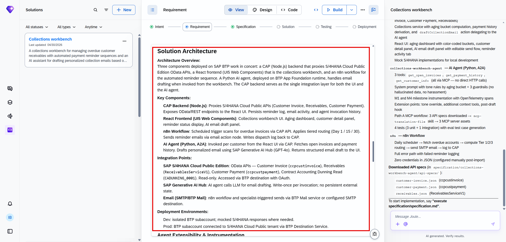

### Specification

When the specification is complete you could pass it on to another team to do the implementation. However, here you are going to get the tool to implement the solution. This might happen automatically if you have selected quick-create at the start.

1. If processesing is waiting for your input, enter **Implement the Solution** (alternatively use **Build Solution** button). The tool will work through the tasks defined in the specification. When it is finished, it will update the specification to show the tasks have been done. While the solution is being generated, you can explore the **Specification**.

    <!-- border -->
    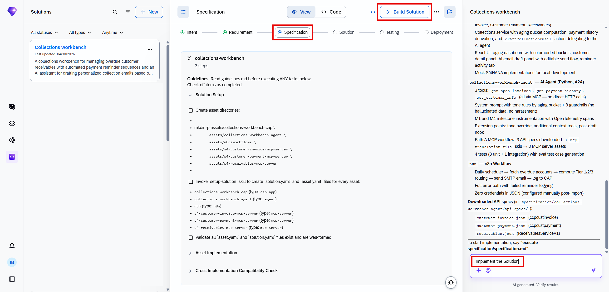

### Solution

1. Wait until the solution is implemented successfully. You can then preview your solution.

    <!-- border -->
    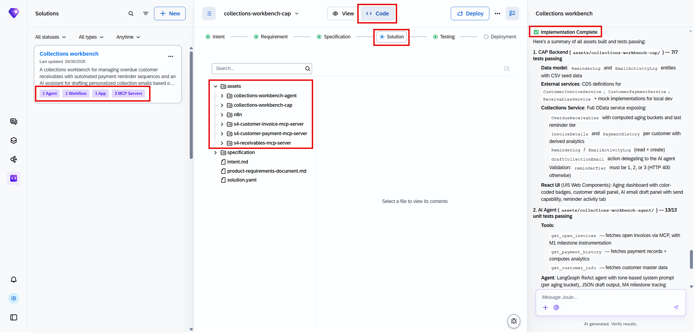

2. Go to **Solution** in select the **View** mode. Choose a CAP application in the artifacts list. You will see the app with its UI built on top of the CAP application.

    <!-- border -->
    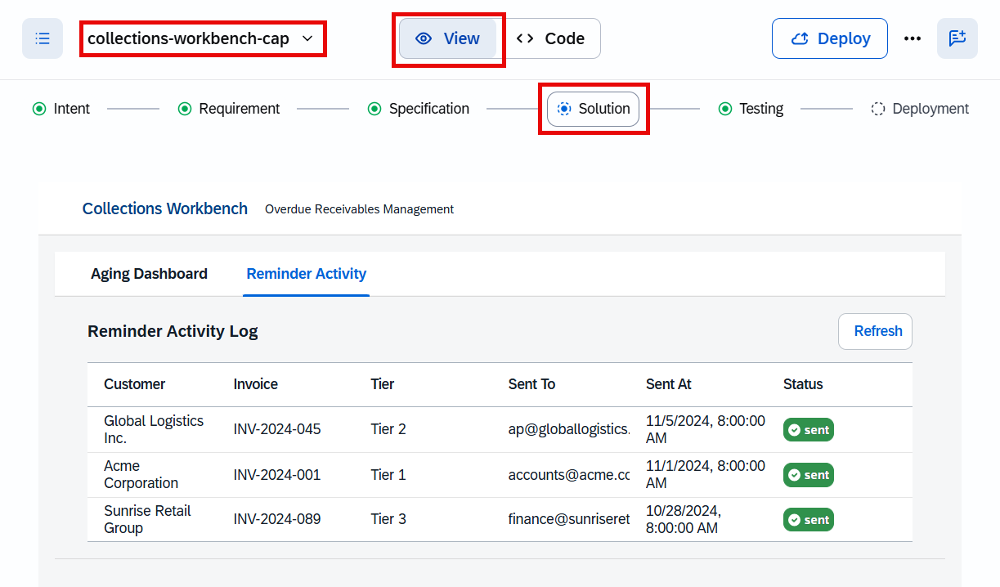

3. Choose a workflow in the artifacts list. You will see the **n8n** workflow and can test it directly from the UI using the **Execute workflow** button.

    <!-- border -->
    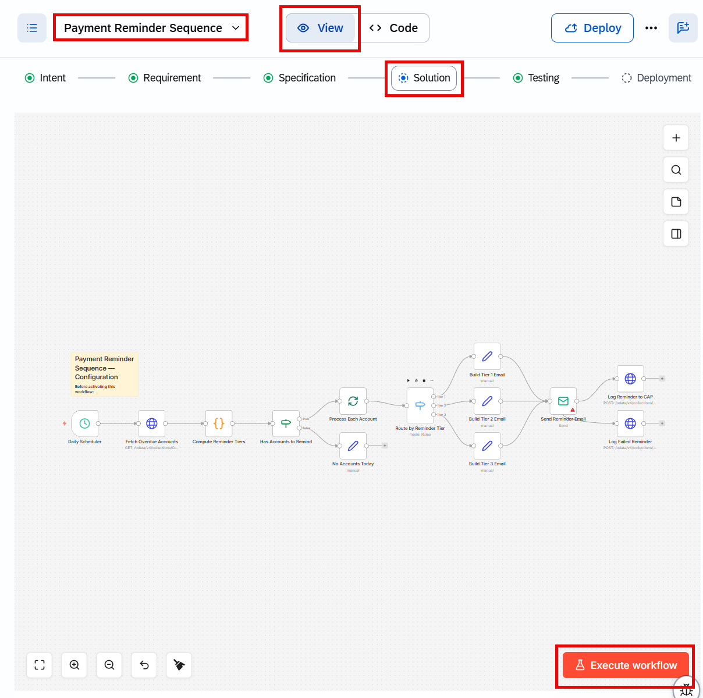

4. Choose an agent in the artifacts list. You can talk to your agent locally to test how it works.

    <!-- border -->
    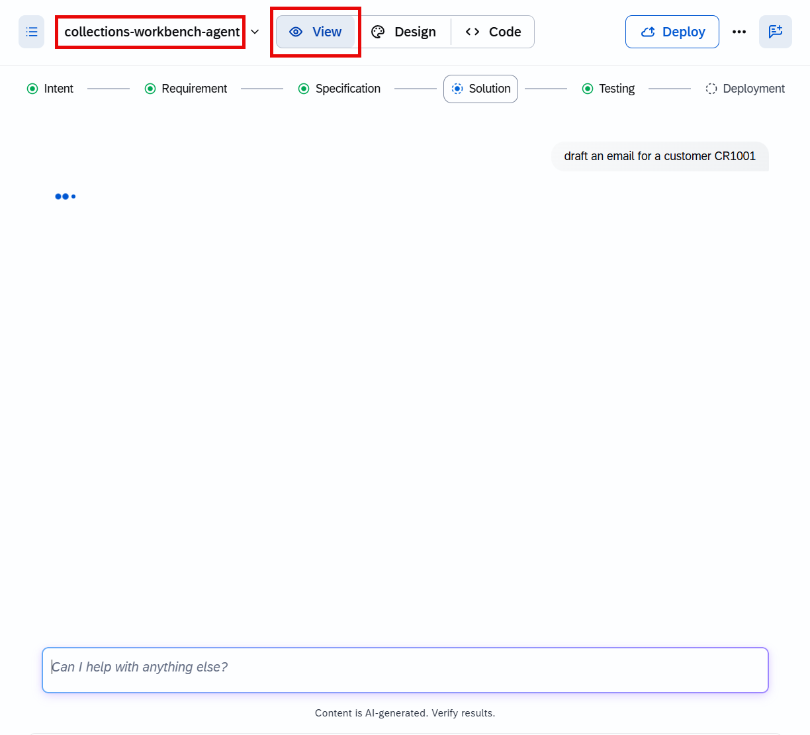

For the Agent Lab at SAPPHIRE, you will not be deploying your solution. However, the code that has been generated follows SAP best practices and would be deployable to the runtime.
