# Use Joule Studio to Create an HR Onboarding Assistant

<!-- description -->Use Joule Studio to create and test an agent for an Onboarding Assistant for human capital management

## Prerequisites

- Access to Joule Work and Joule Studio in the Agent Lab
- You have been provided with the logon information

## You will learn

- How to use intent-based development to create AI solutions
- How SAP Domain Models and other resources are leveraged to contextualize the generated solution

## Intro

>**IMPORTANT**
>
>**Welcome to the Agent lab**
>
>You are working with a pre-release version of the Joule Studio. This gives you an early look at our upcoming capabilities. Please keep the following in mind:
>
> - **Features are subject to change:** The UI, terminology, and functionality you see may differ from the final product.
> - **Educational use only:** This environment is designed for learning and experimentation, not for production use.
> - **Potential instability:** As a preview version, you may encounter occasional instability or unexpected behavior.

Using Joule Studio's **intent-based development**, learn to create an intelligent Human Capital Management (HCM) assistant that supports HR Business Partners by automating employee inquiries, generating real-time workforce insights, and proactively identifying attrition and skill gap risks. The assistant acts as a virtual HR partner for employees and managers - answering common HR questions, analyzing workforce data, predicting retention risks, and recommending personalized development and engagement actions. This enables HR to shift from administrative, reactive work to a strategic, people-centric role.

### Get Started

[OPTION BEGIN [Quick Create]]

1. Open **Joule Work** and select the **Develop** area.

    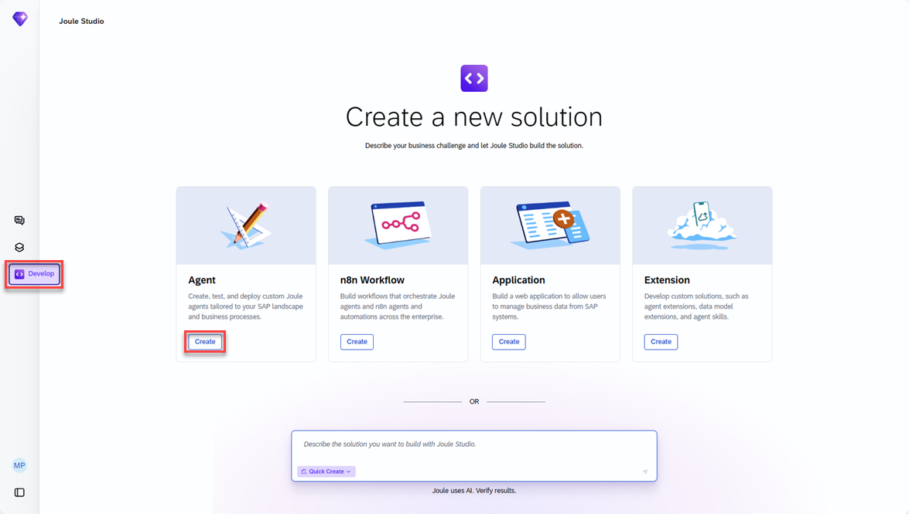

2. On the **Agent** tile, choose **Create**.

3. Leave the selected **New Solution** unchanged, and fill in the agent details:

    Agent Name:

   ```COPY
       HR Virtual Assistant
   ```

    Intent Statement:

   ```COPY
       Create an AI agent that acts as an HR virtual assistant, answers employee HR questions, 
       analyzes workforce data, predicts attrition risks, and generates actionable insights and development 
       recommendations using simulated HCM data.
   ```

    Select **Quick Create**.

    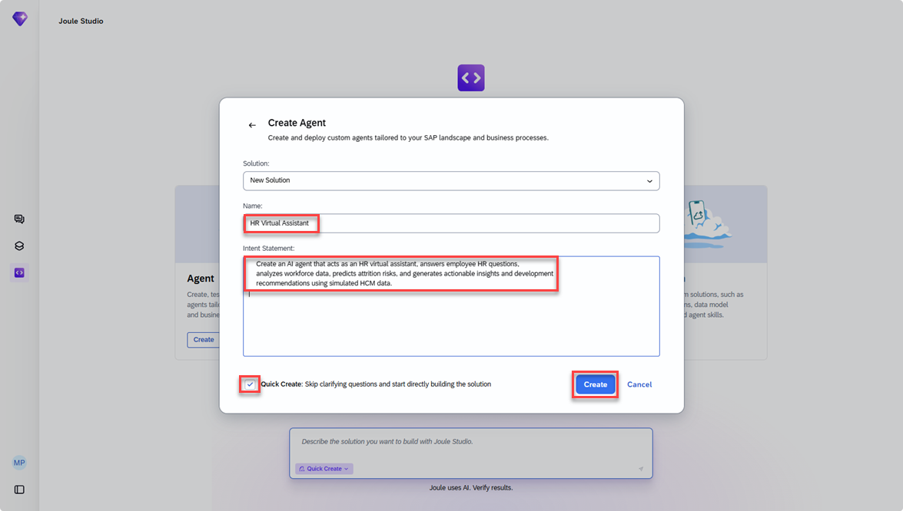

4. Choose **Create** to launch Joule Studio.

[OPTION END]

[OPTION BEGIN [Ideate and Plan]]

1. Open **Joule Work** and select the **Develop** area.

    

2. On the **Agent** tile, choose **Create**.

3. Leave the selected **New Solution** unchanged, and fill in the agent details:

    Agent Name:

   ```COPY
       HR Virtual Assistant
   ```

    Intent Statement:

   ```COPY
       Create an AI agent that acts as an HR virtual assistant, answers employee HR questions, 
       analyzes workforce data, predicts attrition risks, and generates actionable insights and development 
       recommendations using simulated HCM data.
   ```

    Deselect **Quick Create**. This tells the tool to ask you clarifying questions before generating the intent, and to pause for your confirmation at each phase.

    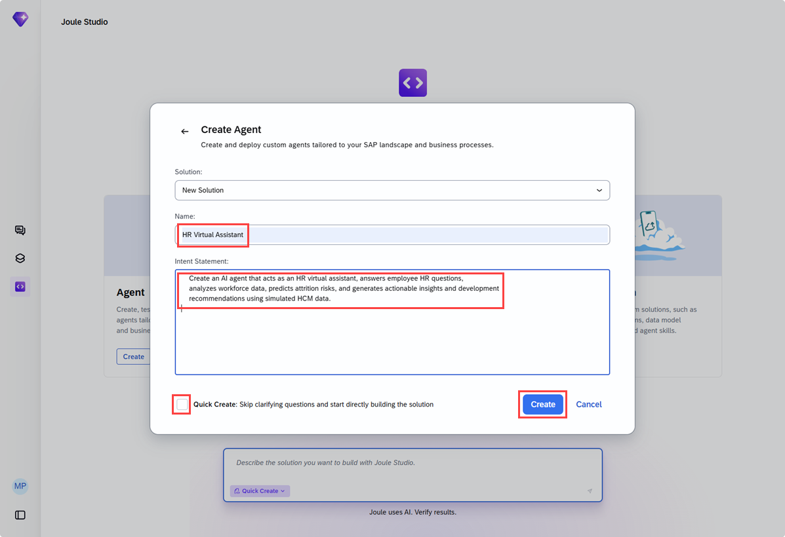


4. Choose **Create** to launch Joule Studio.

[OPTION END]

### Intent

[OPTION BEGIN [Quick Create]]

This is where the tool tries to understand your intent and map the challenge to SAP's Reference Business Architecture. It has access to SAP Knowledge Graph, SAP LeanIX, and SAP Domain Models to help it create the intent document. Intent fit indicates how closely the proposed solution corresponds to your requirement.

In **Quick Create** mode, the tool skips the clarifying questions and generates the intent document directly.

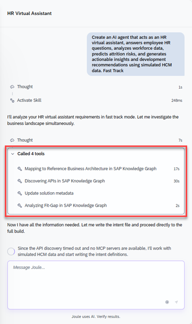

Once the intent document is created, the next phase, which is requirement generation, should start automatically.

1. While the requirements are being generated, you can explore the intent on the **Idea Board**.  


    
    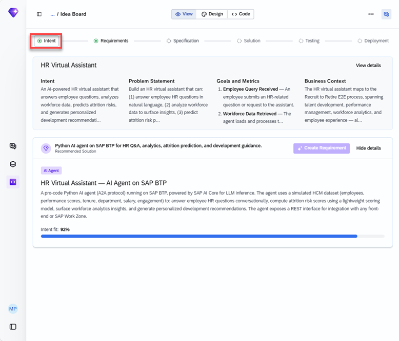


[OPTION END]

[OPTION BEGIN [Ideate and Plan]]

This is where the tool tries to understand your intent and map the challenge to SAP's Reference Business Architecture. It has access to SAP Knowledge Graph, SAP LeanIX, and SAP Domain Models to help it create the intent document. Intent fit indicates how closely the proposed solution corresponds to your requirement.

1. The tool asks you a few clarifying questions generated from your intent statement (the exact questions vary each run). Answer them using your judgement — the more complex your scenario, the longer generation takes.

    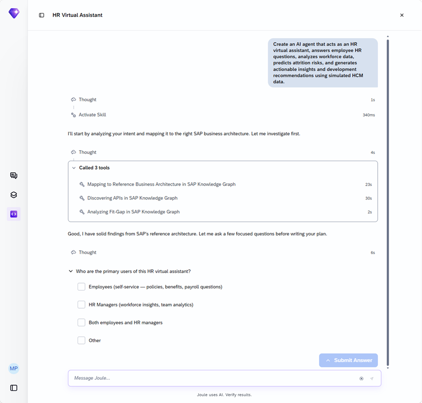

    Once you've answered the questions, the tool generates the intent document with a summary of who it's for, what it does, how it's built, and where it fills gaps in the SAP standard offering.

    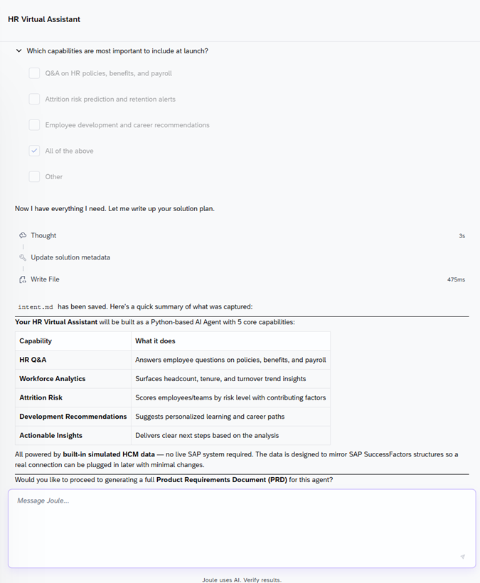

2. Review the intent document. You can explore it in detail on the **Idea Board** on the **Intent** tab.

    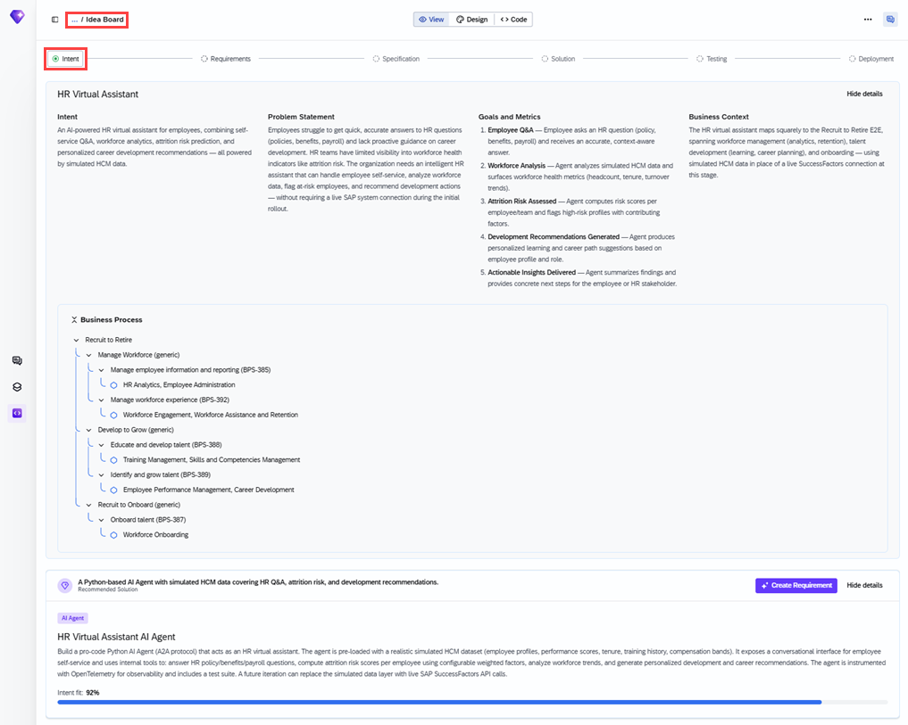

3. If anything doesn't reflect your goal accurately, refine it by continuing the conversation in the chat. Once you're satisfied, proceed to the requirements phase.


[OPTION END]


### Requirements

[OPTION BEGIN [Quick Create]]

When the requirement is ready, you have the opportunity to review and refine it. For this tutorial, you will accept suggested product requirement document without changes. To progress to the next phase, you need to transform the PRD into a technical specification.

Depending on your role in your company, you might be finished at this point and make the PRD available to a different team to take further. However, in this tutorial, you are taking the project forward with the generation of a technical specification. Similar to the previous step, this should  happen automatically if you have selected **Quick Create** at the start.

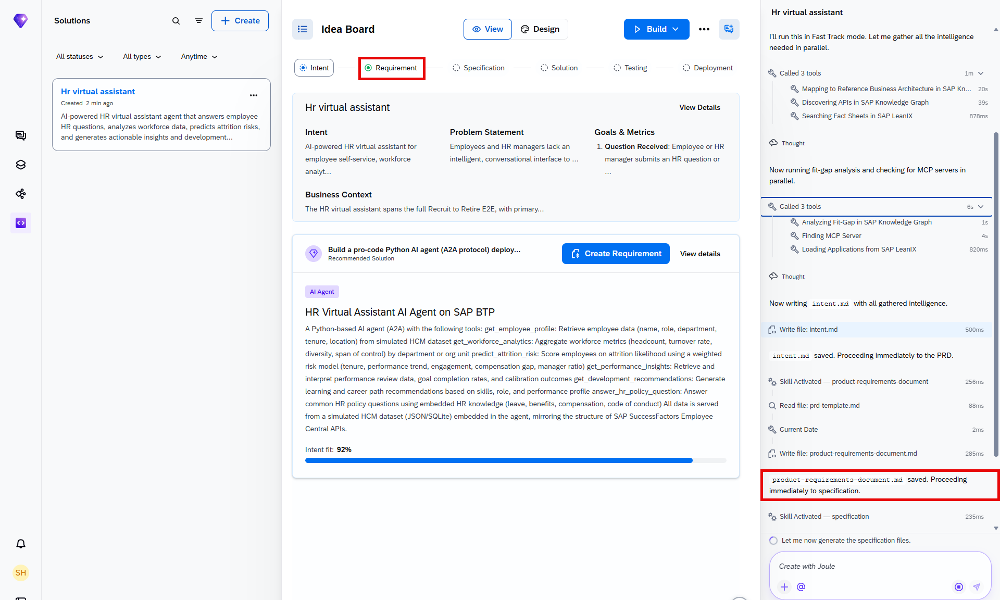

At this stage, you can see the your PDR similar to the one below in markdown format.
If you need to update it manually, you can just proceed clicking on the text in the view or by editing the files in the dedicated code tab.

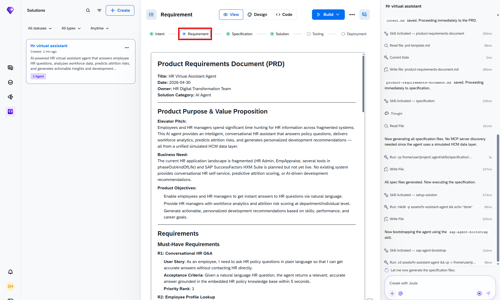

[OPTION END]

[OPTION BEGIN [Ideate and Plan]]

1. After the intent is ready, enter the following in the chat when the tool prompts you:

   ```COPY
   Create requirements
   ```

    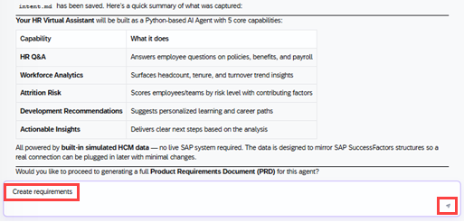

2. When the requirements are ready, review the Product Requirements Document (PRD). If something is missing or incorrect, you can update it directly by clicking the text in the view or editing the file in the **Code** tab. Once you're happy with it, continue to the specification phase.

    

[OPTION END]


### Specification

[OPTION BEGIN [Quick Create]]

When the specification is complete you could pass it on to another team to do the implementation. However, here you are going to get the tool to implement the agent.  This might happen automatically if you have selected **Quick Create** at the start.

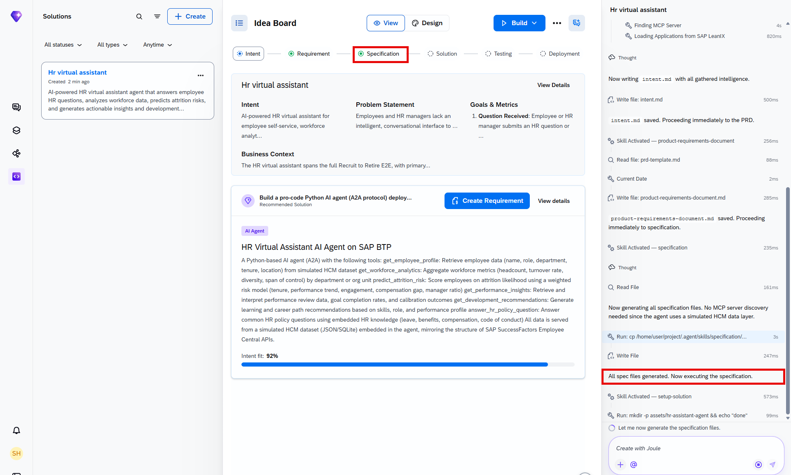

While the solution is being generated, you can explore the specification in the **Code** tab. You will find in the **specification** folder and in sub-folders, **specification.md** files.

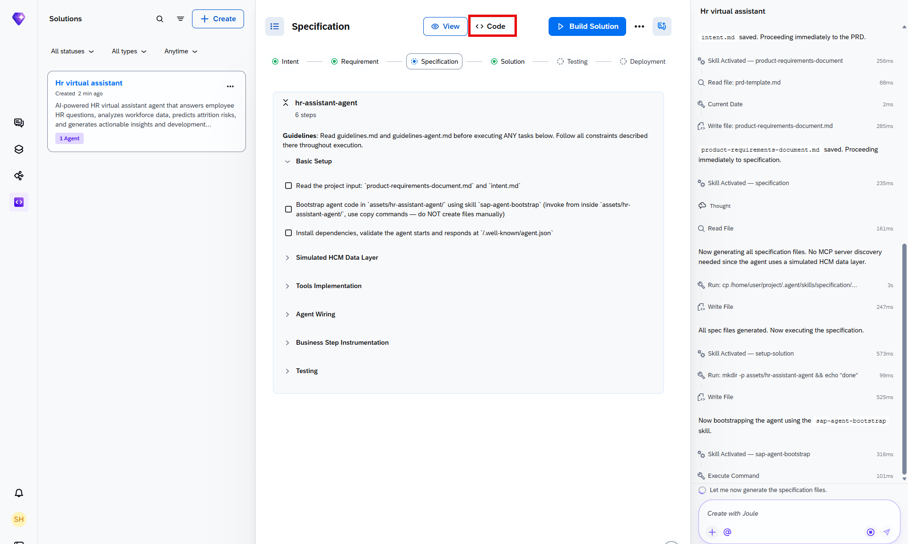


The tool will work through the tasks defined in the specification. When it is finished, it will update the status in the specification to show the tasks have been done.

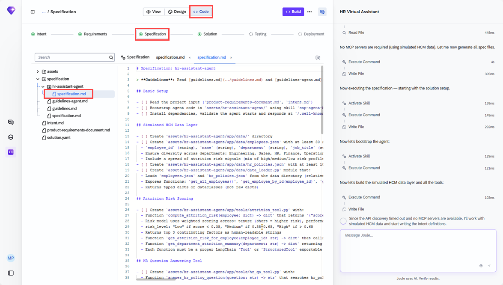

[OPTION END]

[OPTION BEGIN [Ideate and Plan]]

1. After the PRD is ready, enter the following in the chat when the tool prompts you:

   ```COPY
   Create specification
   ```

    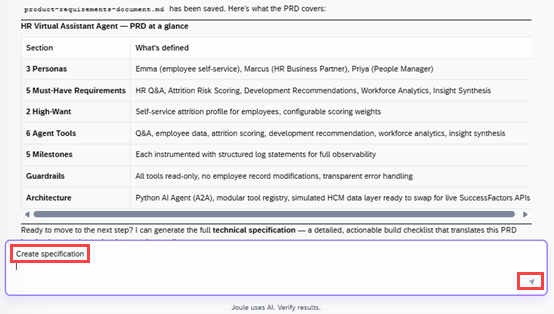

2. Wait until the specification summary is visible on the right.    

    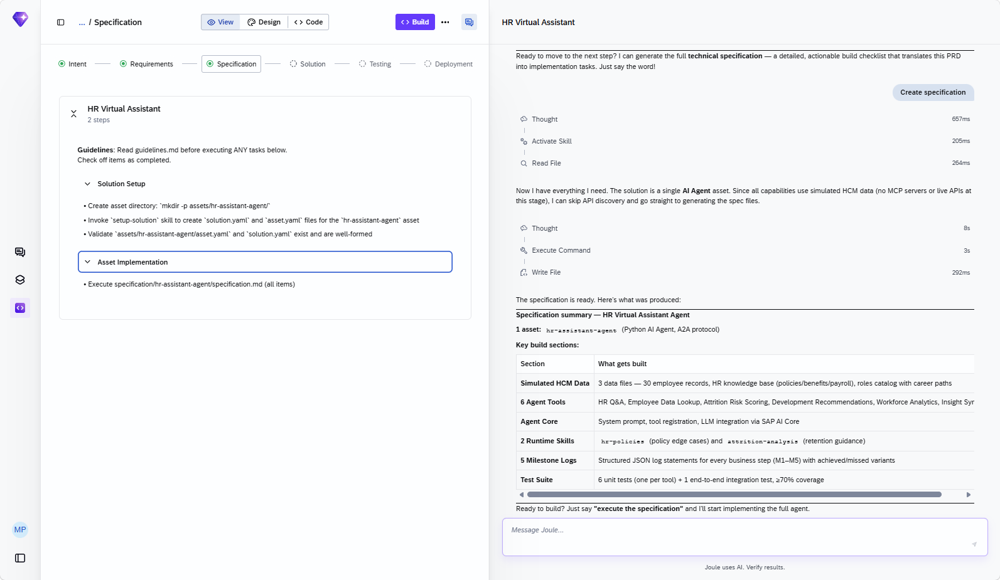

3. When the specification is ready, review it in the **Code** tab. You will find in the **specification** folder and in sub-folders, **specification.md** files. If you'd like to adjust any part of it, you can edit the files directly before moving on. Once you're satisfied, proceed to building the solution.

    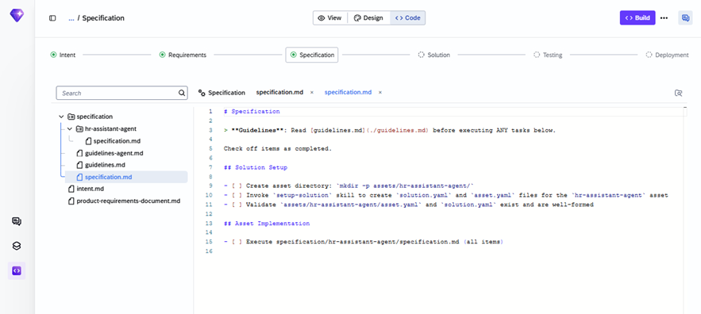

[OPTION END]

### Solution

[OPTION BEGIN [Quick Create]]

1. Wait until the implementation is finished successfully.

    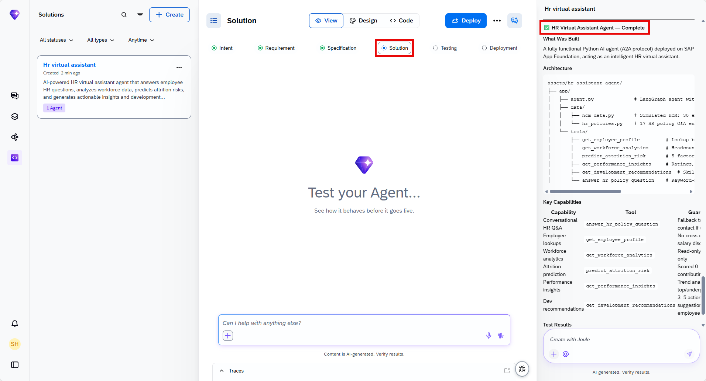

2. You can then explore the code if you need to.

    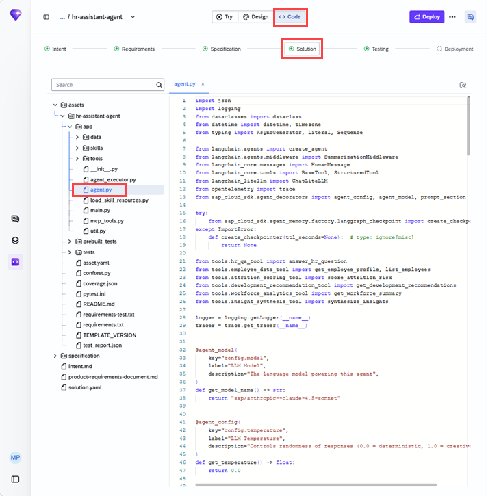

3. Go to the **Try** tab of your solution and try your agent. Enter your prompts where it says "Can I help with anything else".

    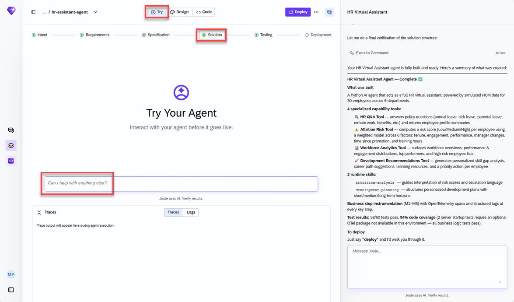

    What you can do will depend on what has been implemented. You could start with a prompt like "How can I test this agent", which should provide some example prompts that you can use. For example, "Show me the profile for employee E0001".

    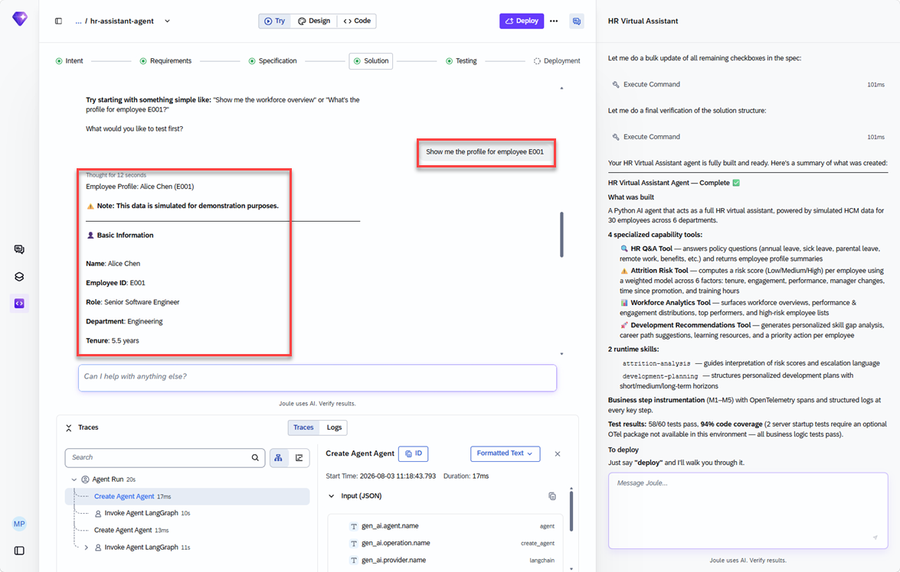


[OPTION END]

[OPTION BEGIN [Ideate and Plan]]

When the specification is complete, you could pass it on to another team to do the implementation. In this tutorial, you'll get the tool to build the agent for you.

1. Choose the **Build** button in the top-right corner, or enter the following in the chat when the tool prompts you:

   ```COPY
   Build solution for this project
   ```

    The tool now builds the solution — setting up the agent, creating the data and tools, and writing the tests. On the right, you can follow along. The exact steps and file names vary each run.

    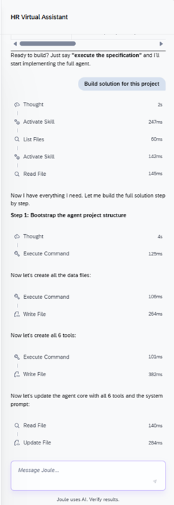

When all tasks are complete, you can review the generated solution.

2. Explore the generated code in the **Code** tab to see how the agent is structured.

    

3. Go to the **Try** tab of your solution and try your agent. Enter your prompts in the chat box where it says "**Can I help with anything else**".

    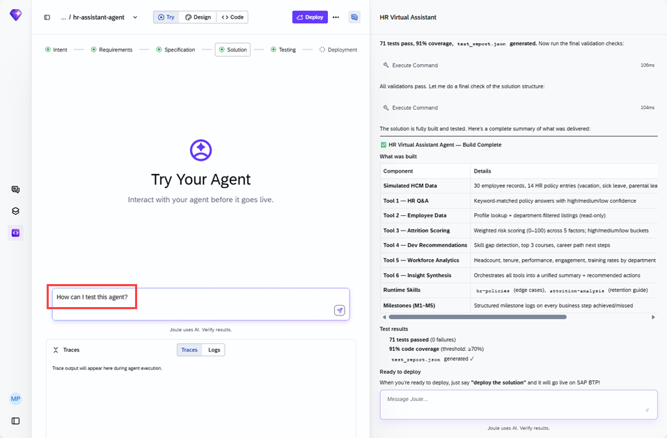

    What you can do will depend on what has been implemented. You could start with a prompt like "**How can I test this agent**", which should provide some example prompts that you can use. For example, "**How many vacation days do I get?**".

    The agent processes your request and responds. What it can do depends on what was implemented — the right-hand panel shows a summary of the agent's capabilities. The **Traces** panel at the bottom shows how the agent handled each request.

    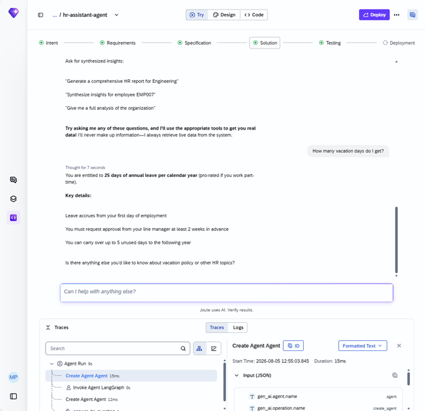

[OPTION END]

### Testing

After the solution is built, Joule Studio automatically runs an automated test suite against the generated agent. You don't need to do anything — the tool executes the tests and shows you the results.

1. Choose the **Testing** tab at the top to see the test overview: total tests, how many passed and failed, code coverage, and an overall score. 

    You can also see per-artifact validation results below.

    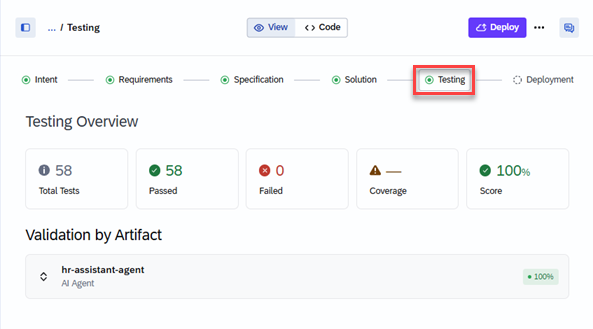


    If all tests pass, the agent is ready to deploy.

### Deployment (optional)

1. When you're ready to deploy, choose **Deploy** button in the top-right corner and then **Deploy**.

    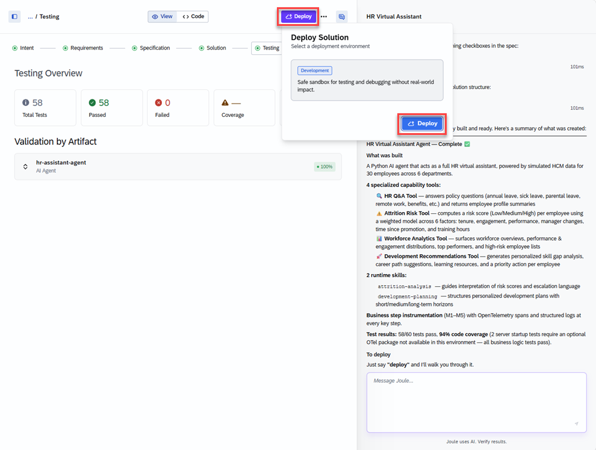

    The tool walks you through deploying the agent to SAP BTP. When the deployment is complete, you can see the deployment record on the **Deployment** tab, along with the agent's status.

    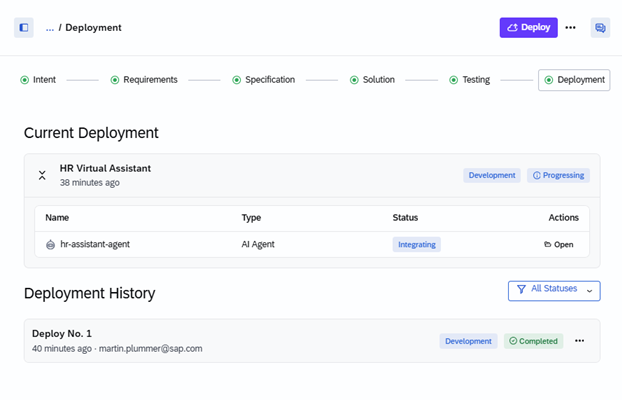

2. Expand the deployment record and choose **Try now** to interact with the deployed agent via the A2A protocol.

    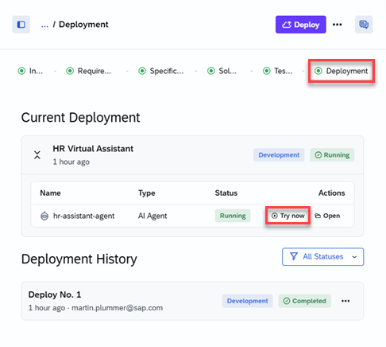

    You will see suggested prompts that you can use to test the agent.

    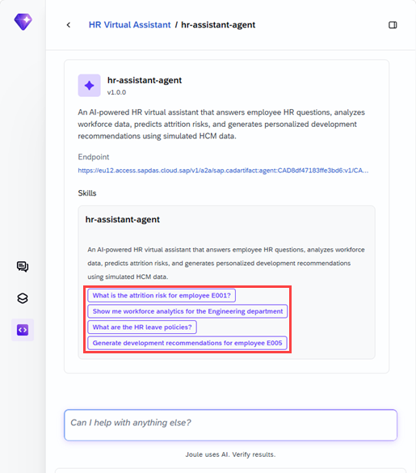