# Use Joule Studio to Create an IT Incident Triage and Auto Routing Agent with N8N, SAP Task Center Node and SAP Agent Node

<!-- description -->Use Joule Studio to create and test an agent for an IT Incident Management and Auto Routing including Human in the Loop via SAP Task Center and triggering other Solution based AI Agents via SAP Agent Node.

## Prerequisites

- Access to Joule Work and Joule Studio in the Agent Lab at SAPPHIRE
- You have been provided with the logon information

## You will learn

- How to use intent-based development to create AI solutions.
- How SAP Domain Models and other resources are levergaed to contextualize the generated solution

## Intro

>**IMPORTANT**
>
>**Welcome to the Agent lab SAPPHIRE 2026!**
>
>You are working with a pre-release version of the Joule Studio. This gives you an early look at our upcoming capabilities. Please keep the following in mind:
>
> - Features are subject to change: The user interface (UI), terminology, and functionalities you see in this lab may differ from the final generally available product (GA).
> - For Educational use only: This environment is designed for learning and experimentation, not for production use.
> - Potential instability: As a preview version, you may encounter occasional instability or minor bugs. The exercises are designed to work with the current state of the platform. If you get stuck, please notify a session instructor.

Using Joule Studio's **intent-based development**, learn to create an intelligent IT Incident Triage and Auto-Routing assistant that supports IT operations teams by automating incident classification, severity assessment, root cause identification, and workflow-based escalation handling. The assistant acts as a virtual IT operations coordinator for support engineers — analyzing incoming incidents from monitoring tools, chat platforms, APIs, and system logs; identifying business impact and probable issue categories; and automatically routing incidents to the correct support teams or n8n workflows in real time. This enables IT teams to reduce manual triage effort, accelerate incident resolution, and shift from reactive support operations toward proactive and intelligent service management.

### Get Started

1. Open Joule Studio and select the **Develop+** area.

2. Select the **N8N Workflow** type and then choose **+ Create**.

    <!-- border -->
    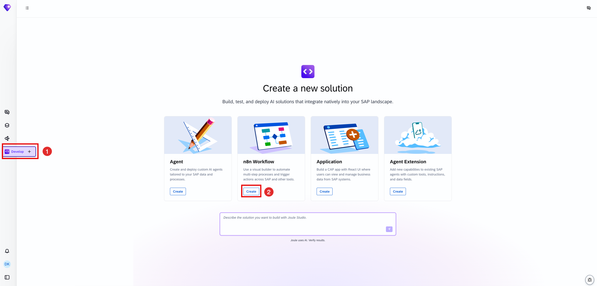

3. Leave the selected **New Solution** unchanged, and fill in the agent details:

    Agent Name: 
    
    ```COPY
    IT Incident Triage + Auto Routing Agent
    ```

    Intent Statement & instructions: 
    
    ```COPY
    You are an IT operations AI agent built using N8N workflows to analyze incoming incident reports from multiple sources
    (webhook payloads, JSON logs) and classify them into severity levels (P1–P4), detect probable root cause category
    (application, infrastructure, integration, user error), and generate a structured incident ticket payload.

    You must:

    - Normalize unstructured incident text into structured JSON
    - Identify urgency and impact based on keywords and patterns
    - Suggest next best action (restart service, escalate, ignore, collect logs)
    - Route output to appropriate n8n workflow nodes (e.g., “high-priority-escalation”, “auto-resolution”, “log-analysis”)
    ```

    Select **Quick create**

    <!-- border -->
    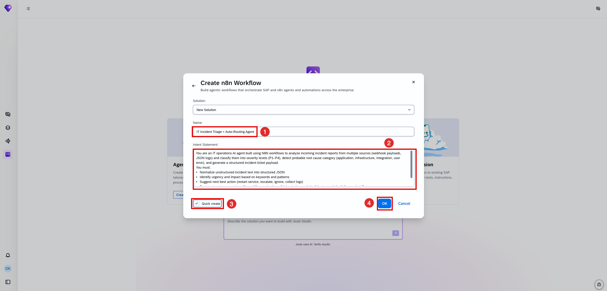

1. Choose **OK** to launch Joule Studio.

### Intent

1. This is where the tool tries to understand your intentions. The tool will attempt to understand your prompt and will likely ask you clarifying questions if you have not chosen quick-create as recommended above. Once it decides it understands enough, it will map the challenge to SAP's Reference Business Architecture and performs a fit-gap analysis. It has access to SAP Knowledge Graph, SAP LeanIX, and SAP Domain Models to help it create the intent document. Intent fit indicates how closely the proposed solution corresponds to your requirement.

    <!-- border -->
    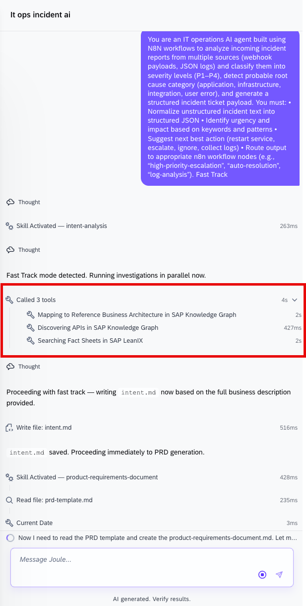

    > Answer the questions set by the tool. The questions that the tool asks cannot be predicted, so you have to use your judgement. Bear in mind that some landscapes such as S/4HANA or Success Factors as backends so tailor your responses accordingly. The more complex you make your scenario, the longer it will take to generate and test the solution.

2. Once the intent document is created, proceed to the next phase, which is requirement generation. This might happen automatically if you have selected quick-create at the start. If processesing is waiting for your input to proceed, enter **Create Requirement** or similar.

3. While the requirements are being generated, you can explore the intent on the **Idea Board**.

    <!-- border -->
    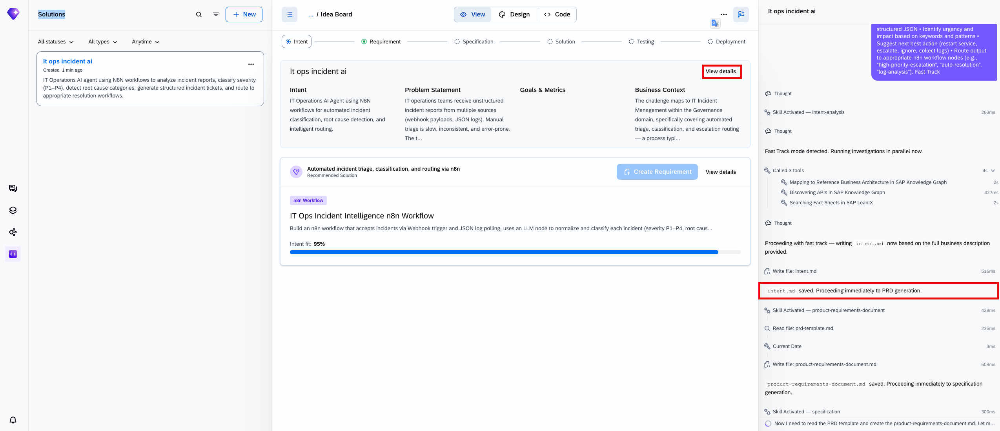

### Requirements

When the requirement is ready, you have the opprotunity to review and refine it. For this tutorial, you will accept suggested product requirement document without changes. To progress to the next phase, you need to transform the PRD into a technical specification.

Depending on your role in your company, you might be finished at this point and make the PRD available to a different team to take further. However, in this tutorial, you are taking the project forward with the generation of a technical specification. Similar to the previous step, this might happen automatically if you have selected quick-create at the start.

<!-- border -->
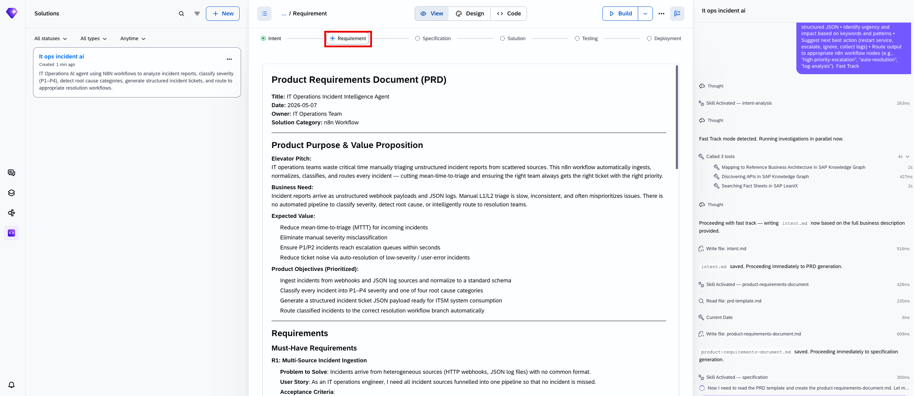

At this stage, you can see the your PRD similar to the one below in markdown format.
If you need to update it manually, you can just proceed clicking on the text in the view or by editing the files in thededicated code tab.

<!-- border -->
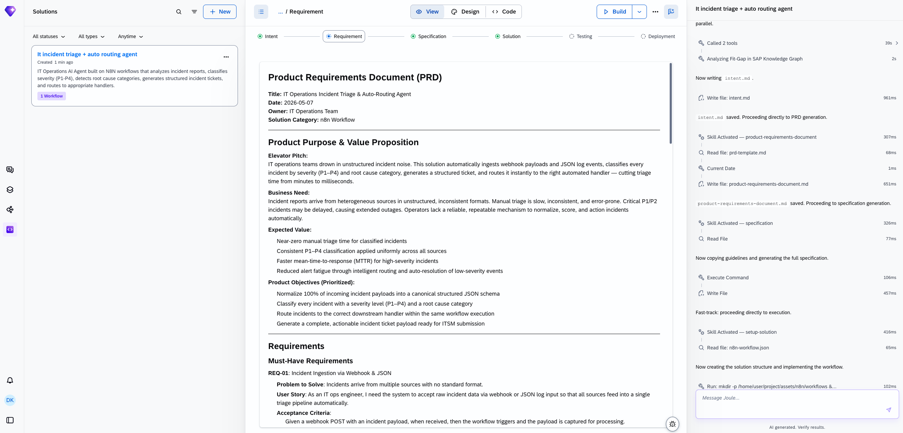

### Specification

When the specification is complete you could pass it on to another team to do the implementation. However, here you are going to get the tool to implement the agent.  This might happen automatically if you have selected quick-create at the start.

<!-- border -->
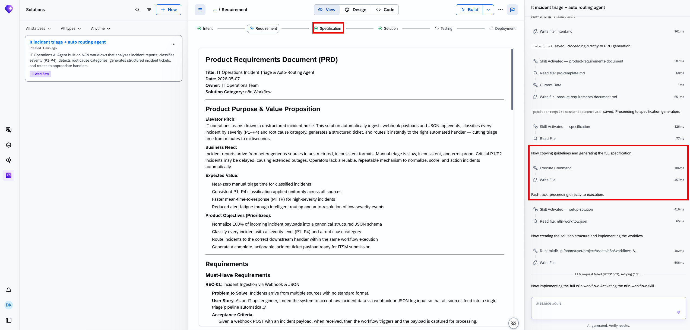

While the solution is being generated, you can explore the specification in the **Code**** tab. You'll find it as **specification/specification.md** and also under n8n/workflows.

<!-- border -->
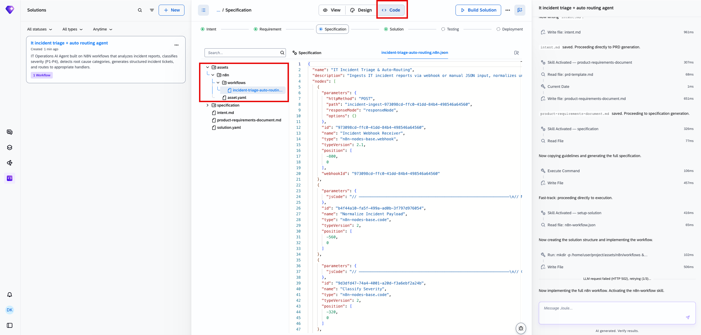

If processing is waiting for your input, enter **Implement the Solution**

   The tool will work through the tasks defined in the specification. When it is finished, it will update the status in the specification to show the tasks have been done.

<!-- border -->
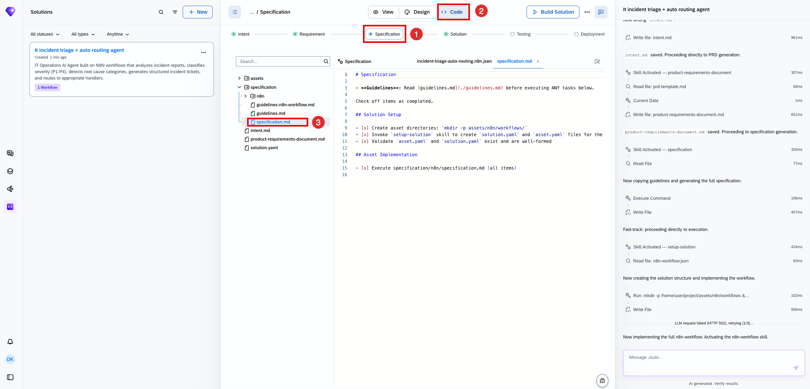

### Solution

1. Wait until the implementation is finished successfully

    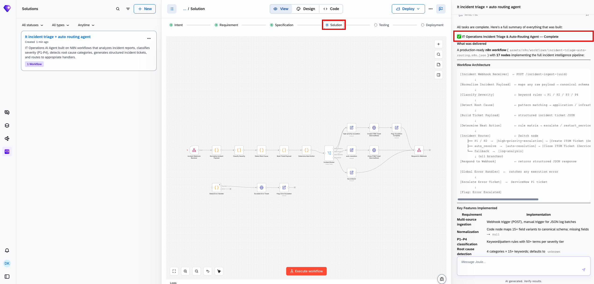

2. You can also modify your existing N8N workflow with intent. Here, let's round off the solution with Human in the Loop, add the following Intent Statement: **`Add an SAP Task Center node within the N8N workflow to send workflow approvals to the manager`** |

    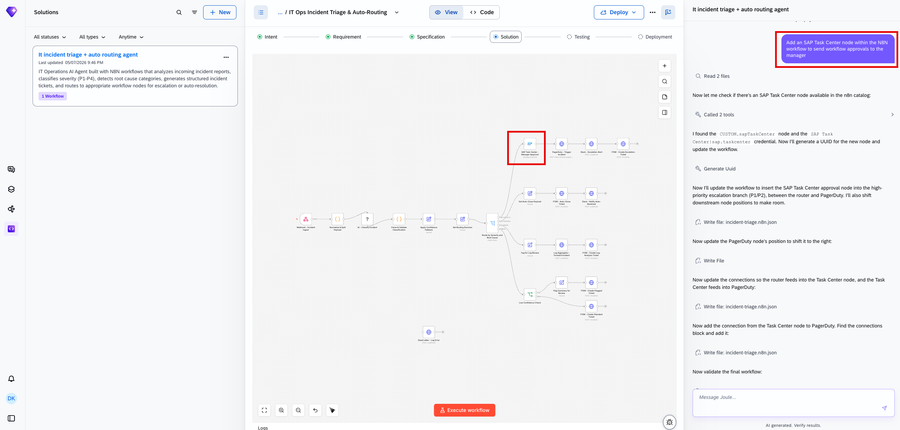

3. Additionally, further steps can be added to the workflow directly. Let's click on the "+" symbol within the n8n workflow and type SAP Agent, then select the SAP Agent node

    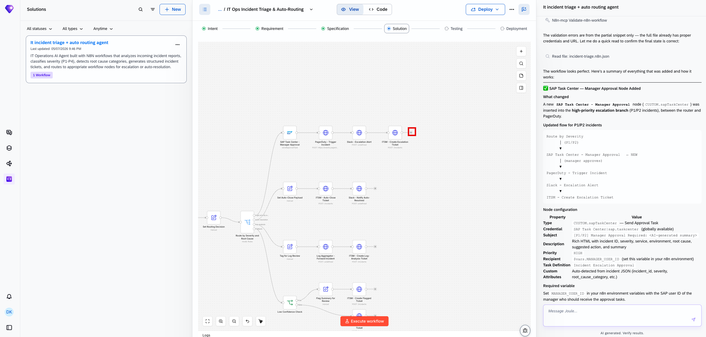
    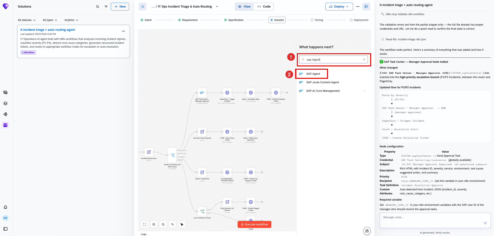

4. SAP Agent node allows you to trigger an AI agent from another Solution

    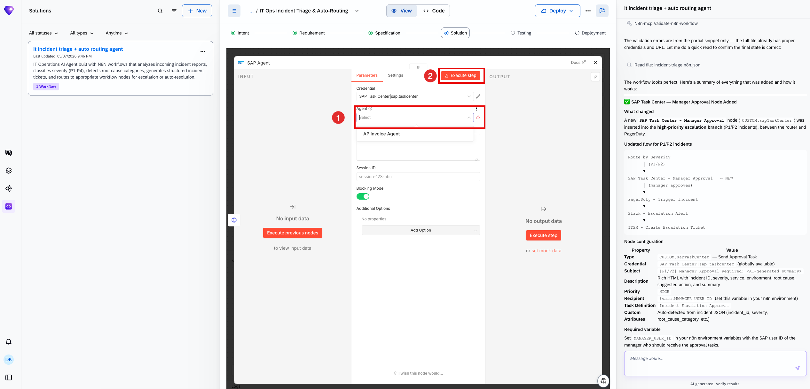

5. Now you can Execute the Workflow and test it out to see what further configuration or prompts are needed to enhance and complete the solution

    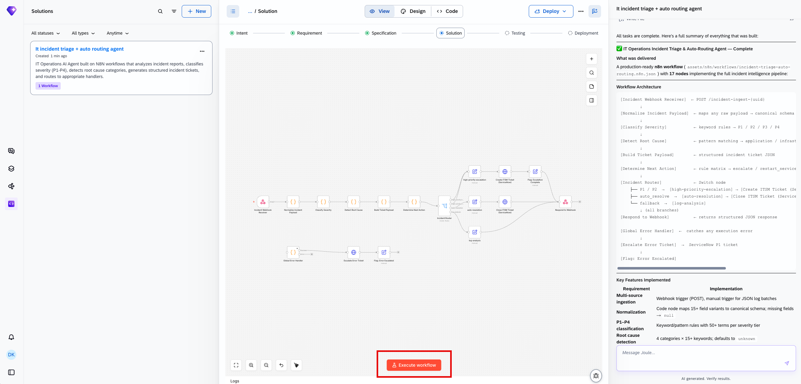

6. Go to the **view** tab of your solution and try your agent. What you can do will depend on what has been implemented

For the Agent Lab at SAPPHIRE, you will not be deploying your agent. However, the code that has been generated follows SAP best practices and would be deployable to the runtime.
