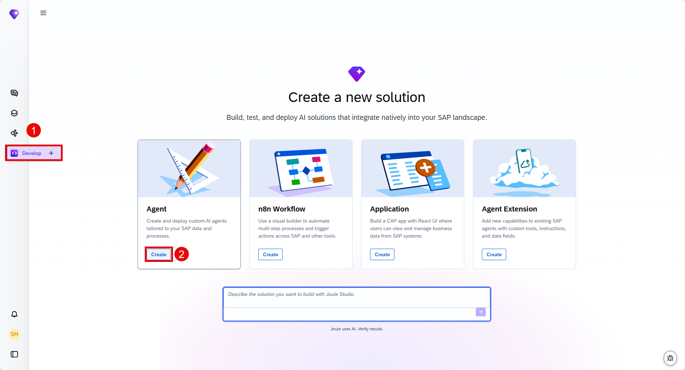
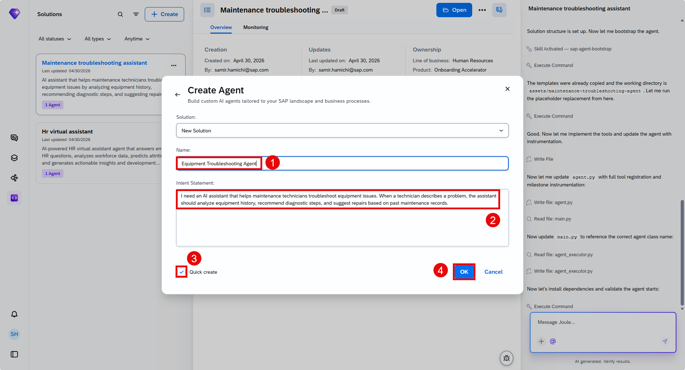
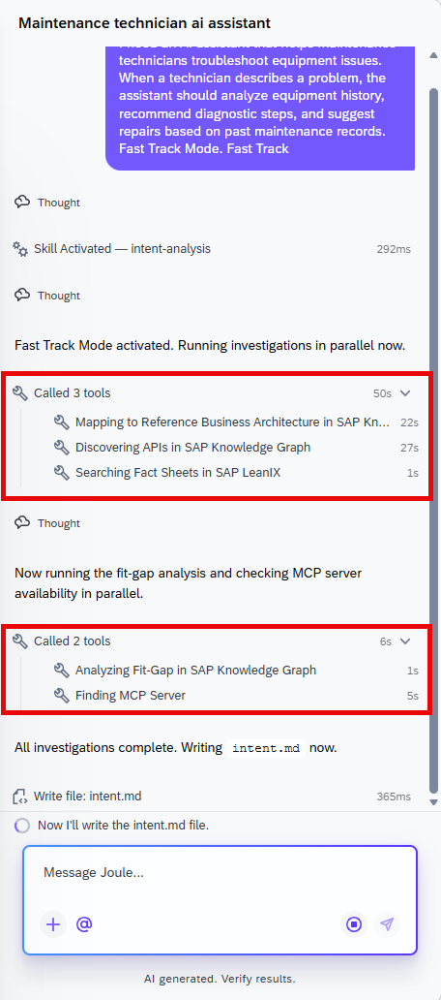
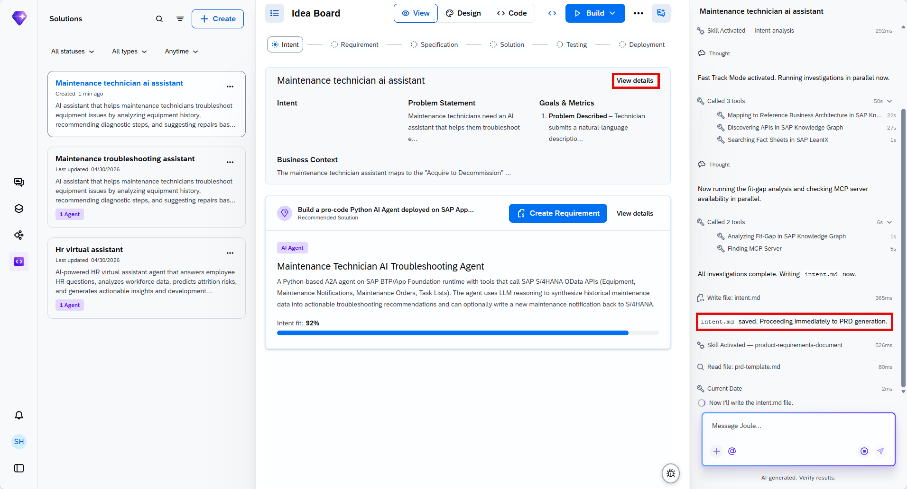
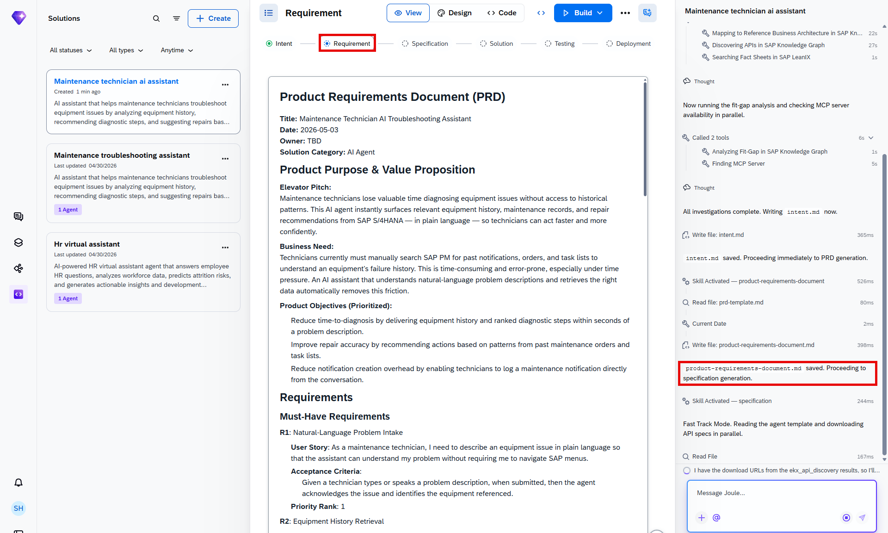
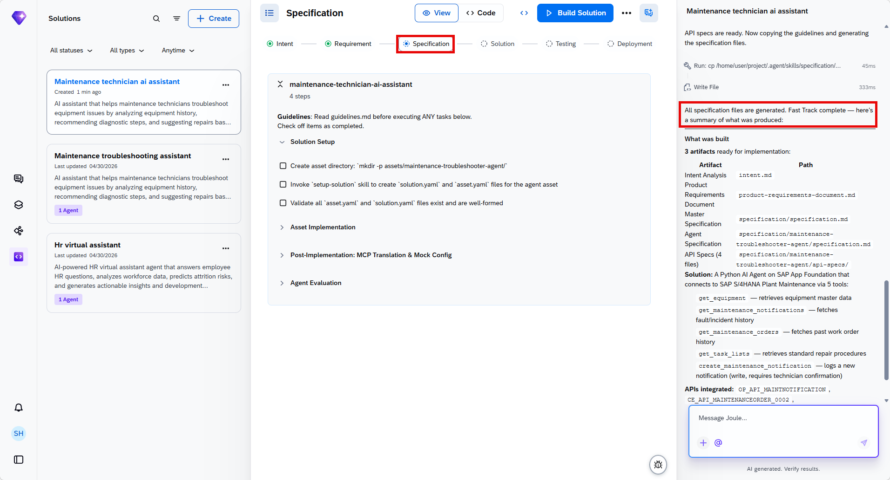
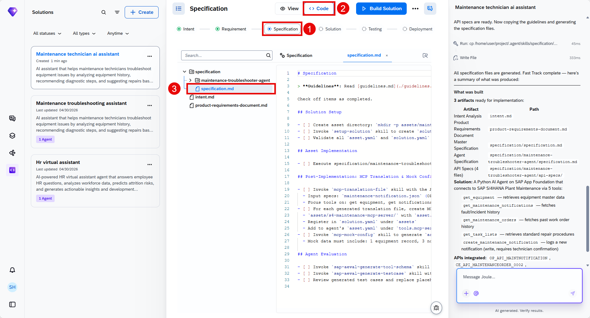
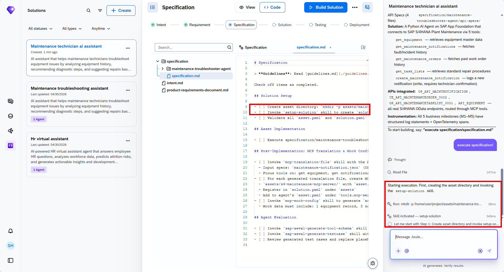
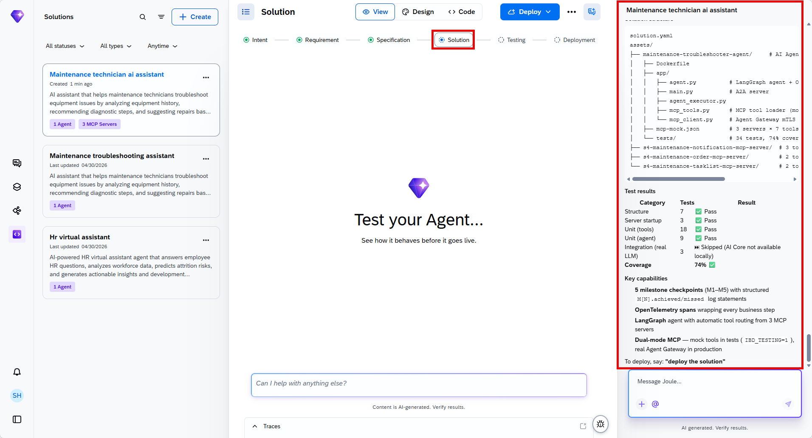
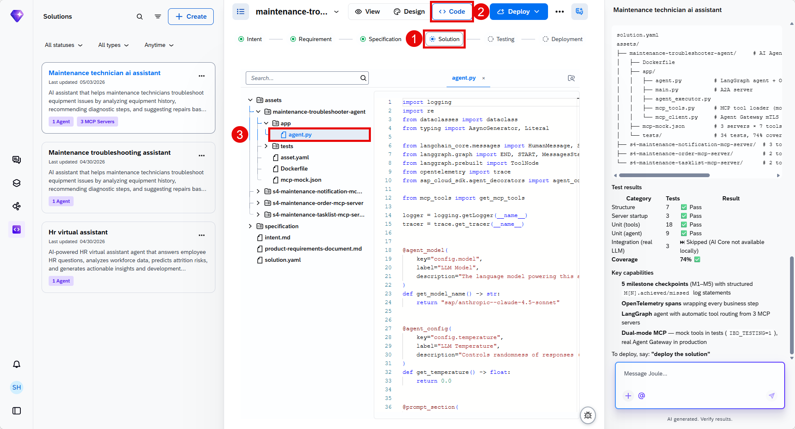

# Use Joule Studio to Create an Assistant for Equipment Troubleshooting

<!-- description -->Use Joule studio to create and test an agent for intellegent maintenance assistance in supply chain management.

## Prerequisites

- Access to Joule Work and Joule Studio in the Agent Lab
- You have been provided with the logon information

## You will learn

- How to use intent-based development to create AI solutions.
- How SAP Domain Models and other resources are levergaed to contextualize the generated solution

## Intro

>**IMPORTANT**
>
>**Welcome to the Agent Lab**
>
>You are working with a pre-release version of the Joule Studio. This gives you an early look at our upcoming capabilities. Please keep the following in mind:
>
> - **Features are subject to change:** The UI, terminology, and functionality you see may differ from the final product.
> - **Educational use only:** This environment is designed for learning and experimentation, not for production use.
> - **Potential instability:** As a preview version, you may encounter occasional instability or unexpected behavior.

Using Joule Studio's **intent-based development**, learn to create an intelligent Supply Chain management (SCM) assistant that helps technicians quickly access equipment history and troubleshooting guidance.

### Get Started

1. Open **Joule Work** and select the **Develop** area.

2. Select the **Agent** tile and then choose **Create**. 
    
    In Joule Studio, you can not only create an agent, but also n8n agentic workflows, applications & extend existing agents or assistants.

    

3. Leave the selected **New Solution** unchanged, and fill in the agent details:

    Agent Name:

   ```COPY
       Equipment Troubleshooting Agent
   ```

    Intent Statement:

   ```COPY
      Create an AI agent that helps maintenance technicians quickly access equipment history and troubleshooting guidance.
   ```

    Select **Quick create**.

    

4. Choose **Create**.

### Intent

1. This is where the tool tries to understand your intentions. The tool will attempt to understand your prompt and will likely ask you clarifying questions if you have not chosen quick-create as recommended above. Once it decides it understands enough, it will map the challenge to SAP's Reference Business Architecture and performs a fit-gap analysis. It has access to SAP Knowledge Graph, SAP LeanIX, and SAP Domain Models to help it create the intent document. Intent fit indicates how closely the proposed solution corresponds to your requirement.

    

    > Answer the questions set by the tool. The questions that the tool asks cannot be predicted, so you have to use your judgement. Bear in mind that some landscapes such as S/4HANA or Success Factors are used as backends so tailor your responses accordingly. The more complex you make your scenario, the longer it will take to generate and test the solution.

2. Once the intent document is created, proceed to the next phase, which is requirement generation. This might happen automatically if you have selected quick-create at the start. If processesing is waiting for your input to proceed, enter **Create Requirement** or similar.

3. While the requirements are being generated, you can explore the intent on the **Idea Board**. Using the “intent-analysis” skill, Joule generates a proposed solution displayed on the **Idea Board**. 
Through its integration with SAP Signavio, Joule can map your intent to the relevant business process. In this tutorial, the identified business process is “Acquire to Decommission.”

    

4. **Intent Fit** indicates how closely the proposed solution corresponds to your requirement.

    

### Requirements

When the requirement is ready, you have the opprotunity to review and refine it. For this tutorial, you will accept suggested product requirement document without changes. To progress to the next phase, you need to transform the PRD into a technical specification.

Depending on your role in your company, you might be finished at this point and make the PRD available to a different team to take further. However, in this tutorial, you are taking the project forward with the generation of a technical specification. Similar to the previous step, this might happen automatically if you have selected quick-create at the start.

At this stage, you can see the your PRD similar to the one below in markdown format.



If you need to update it manually, you can just proceed clicking on the text in the view or by editing the files in the dedicated code tab or even in the chat interface with Joule.


### Specification

When the specification is complete you could pass it on to another team to do the implementation. However, here you are going to get the tool to implement the agent.  This might happen automatically if you have selected quick-create at the start.



While the solution is being generated, you can explore the specification in the **Code**** tab. You'll find it as **specification.md** under the **specification/equipment-troubleshooting-agent/**. 



   The tool will work through the tasks defined in the specification. When it is finished, it will start building the agent.


### Solution

1. Wait until the implementation is finished successfully. That includes the successful automated tests.



1. You can then explore the code if you need to.

    

2. Go to the **view** tab of your solution and try your agent. What you can do will depend on what has been implemented. Ask **How can I test this agent?** if you want to get suggestions for prompts to use.

For this tutorial, you will not be deploying your agent unless your instructor says otherwise. However, the code that has been generated follows SAP best practices and would be deployable to the Joule Studio runtime.
