# Use Joule Studio to Create an Assistant to Monitor Supplier Risk

<!-- description -->Use Joule Studio to create and test an Intelligent Procurement Assistant for Spend Management.

## Prerequisites

- Access to Joule Work and Joule Studio in the Agent Lab
- You have been provided with the logon information

## You will learn

- How to use intent-based development to create AI solutions.
- How SAP Domain Models and other resources are leveraged to contextualize the generated solution

## Intro

>**IMPORTANT**
>
>**Welcome to the Agent Lab**
>
>You are working with a pre-release version of the Joule Studio. This gives you an early look at our upcoming capabilities. Please keep the following in mind:
>
> - **Features are subject to change:** The UI, terminology, and functionality you see may differ from the final product.
> - **Educational use only:** This environment is designed for learning and experimentation, not for production use.
> - **Potential instability:** As a preview version, you may encounter occasional instability or unexpected behavior.

Using Joule Studio's intent-based development, you can create an intelligent agent that continuously monitors supplier performance across critical KPIs in real time. The agent detects early warning patterns, explains the root causes of supplier risk, and proactively recommends pre-qualified alternative suppliers within the same category. By generating executive-ready summaries backed by supporting data, it enables teams to address performance issues before they disrupt production while significantly reducing time spent on manual supplier research and reporting.

Joule Studio supports two development modes. **Quick Create** skips clarifying questions and moves through all phases (intent → requirements → specification → solution) automatically. **Ideate and Plan** asks you clarifying questions before generating the intent, and pauses for your confirmation at each phase. Either mode works for this tutorial - pick a tab below and follow it end-to-end.

### Get Started

[OPTION BEGIN [Quick Create]]

1. Open **Joule Work** and select the **Develop** area.

    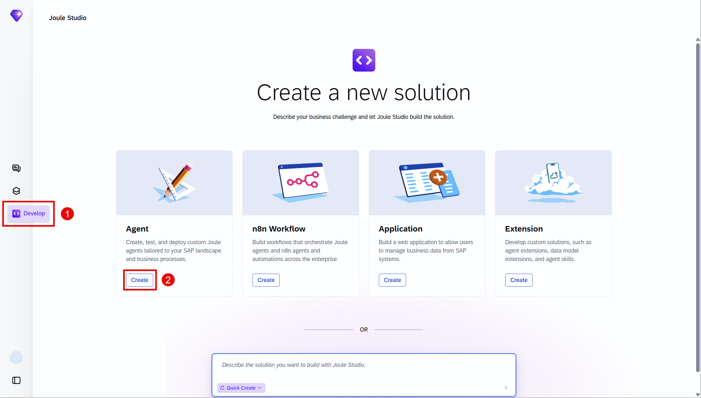

2. On the **Agent** tile, choose **Create**.

3. Keep **New Solution** in the **Solution** dropdown, and fill in the agent details.

    Name:

   ```COPY
   Supplier Performance Assistant
   ```

    Intent Statement:

   ```COPY
   Create an AI agent that monitors supplier performance, identifies at-risk suppliers, and recommends approved alternative suppliers using simulated procurement data.
   ```

    Select the **Quick Create** checkbox below the intent statement. This tells the tool to skip clarifying questions and move through all phases automatically.

    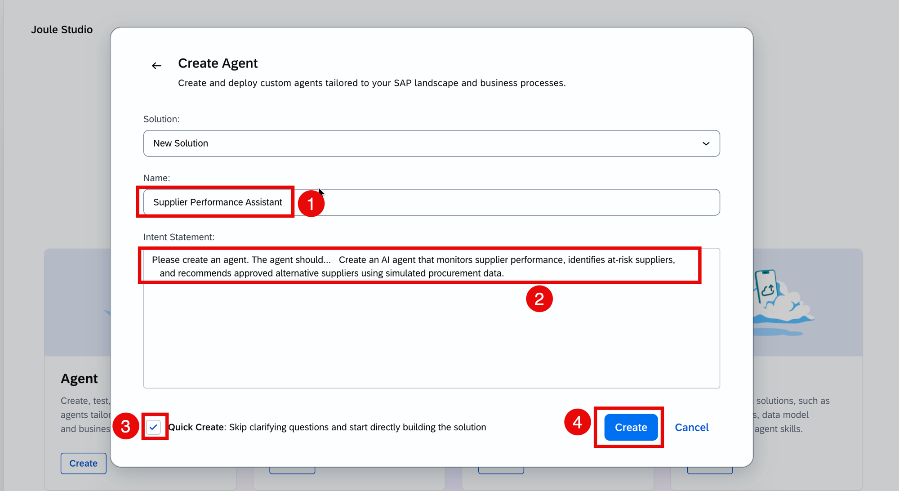

4. Choose **Create**.

[OPTION END]

[OPTION BEGIN [Ideate and Plan]]

1. Open **Joule Work** and select the **Develop +** area.

    

2. On the **Agent** tile, choose **Create**.

3. Keep **New Solution** in the **Solution** dropdown, and fill in the agent details.

    Name:

   ```COPY
   Supplier Performance Assistant
   ```

    Intent Statement:

   ```COPY
   Create an AI agent that monitors supplier performance, identifies at-risk suppliers, 
   and recommends approved alternative suppliers using simulated procurement data.
   ```

    **Leave the Quick Create checkbox unchecked**. This tells the tool to ask you clarifying questions before generating the intent, and to pause for your confirmation at each phase.

    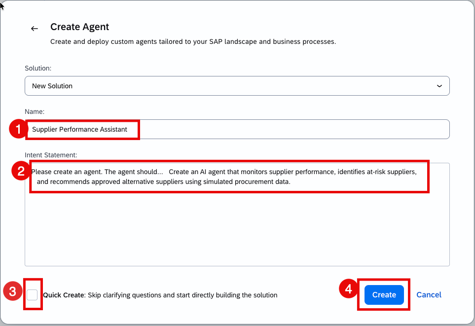

4. Choose **Create**.

[OPTION END]

### Intent

[OPTION BEGIN [Quick Create]]

This is where the tool tries to understand your intent and map the challenge to SAP's Reference Business Architecture. It has access to SAP Knowledge Graph, SAP LeanIX, and SAP Domain Models to help it create the intent document. Intent fit indicates how closely the proposed solution corresponds to your requirement.

In Quick Create mode, the tool skips the clarifying questions and generates the intent document directly.

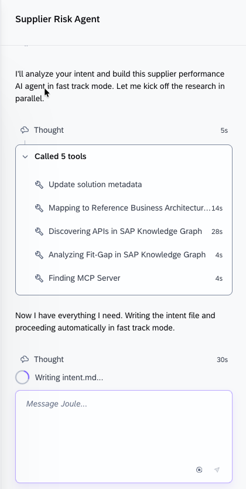

[OPTION END]

[OPTION BEGIN [Ideate and Plan]]

This is where the tool tries to understand your intent and map the challenge to SAP's Reference Business Architecture. It has access to SAP Knowledge Graph, SAP LeanIX, and SAP Domain Models to help it create the intent document. Intent fit indicates how closely the proposed solution corresponds to your requirement.

The tool asks you a few clarifying questions generated from your intent statement (the exact questions vary each run). Answer them using your judgement - the more complex your scenario, the longer generation takes.

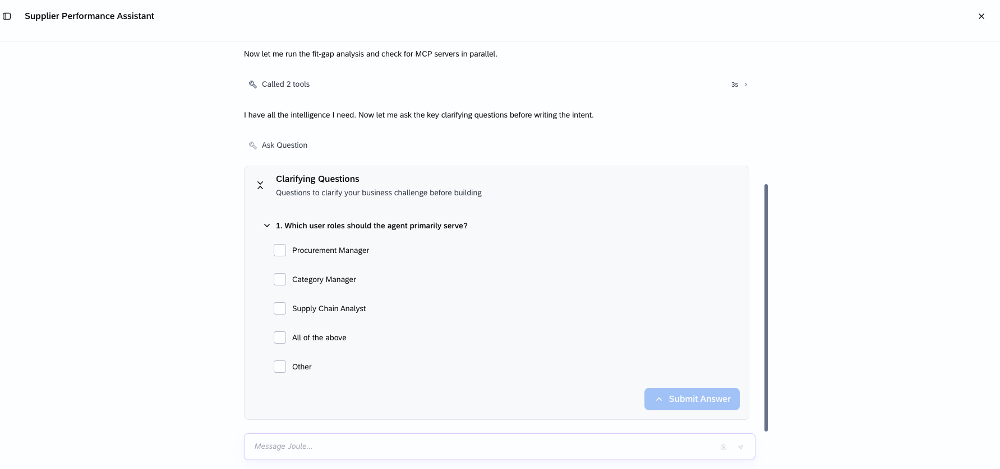

Once you've answered the questions, the tool generates the intent document with a summary of who it's for, what it does, how it's built, and where it fills gaps in the SAP standard offering.

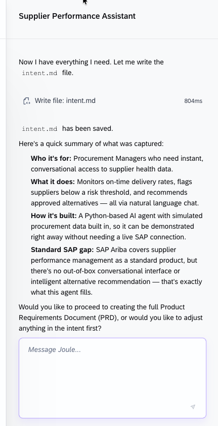

Review the intent document. You can explore it in detail on the **Idea Board** on the **Intent** tab.

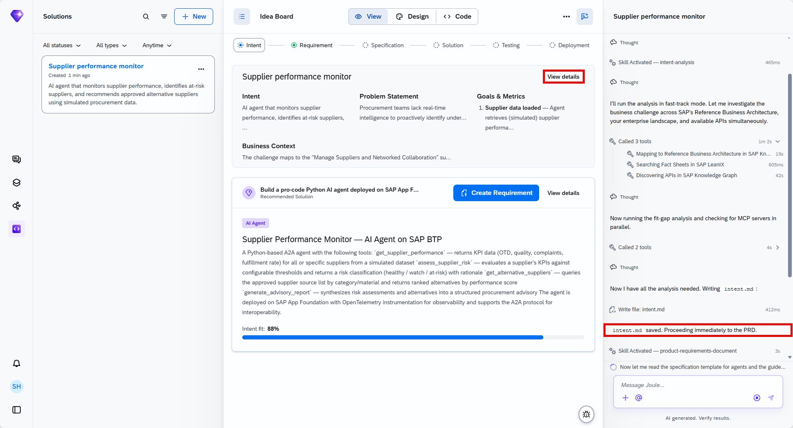

If anything doesn't reflect your goal accurately, refine it by continuing the conversation in the chat. Once you're satisfied, proceed to the requirements phase.

[OPTION END]

### Requirements

[OPTION BEGIN [Quick Create]]

After the intent is ready, the tool automatically moves on to requirements generation.

While the requirements are being generated, you can explore the intent on the **Idea Board** on the **Intent** tab.


When the requirements are ready, you have the opportunity to review and refine the Product Requirements Document (PRD). For this tutorial, accept it as-is and move on.

At this stage, you can see your PRD in markdown format similar to the one below. If you need to update it manually, you can click on the text in the view or edit the file in the dedicated **Code** tab.

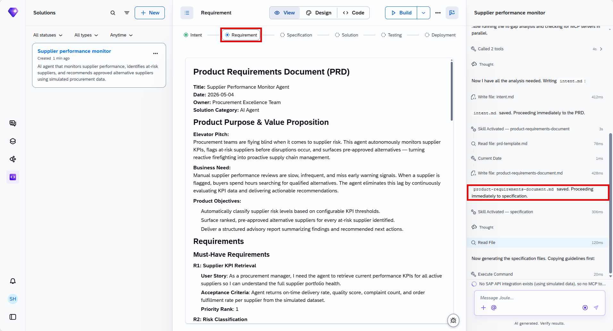

[OPTION END]

[OPTION BEGIN [Ideate and Plan]]

After the intent is ready, enter the following in the chat when the tool prompts you:

```COPY
Create requirements
```

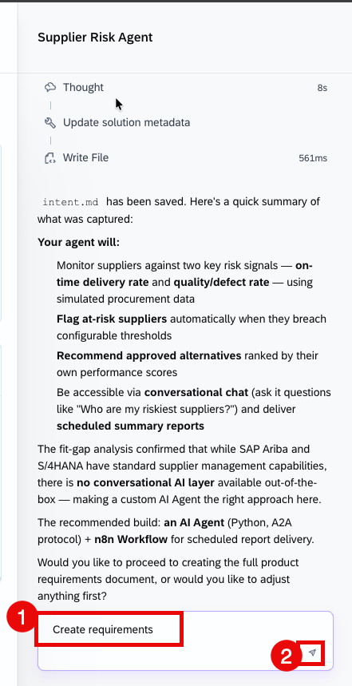

When the requirements are ready, review the Product Requirements Document (PRD). If something is missing or incorrect, you can update it directly by clicking the text in the view or editing the file in the **Code** tab. Once you're happy with it, continue to the specification phase.


[OPTION END]

### Specification

[OPTION BEGIN [Quick Create]]

After the PRD is ready, the tool automatically moves on to the specification phase.

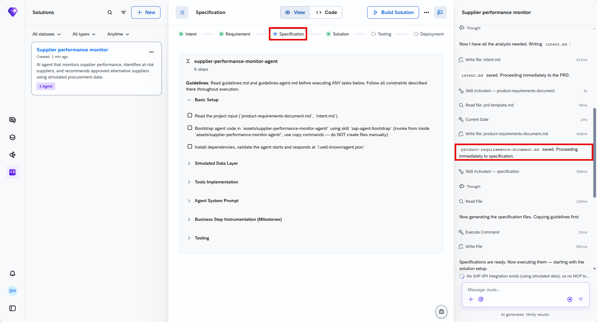

While the specification is being generated, you can explore it in the **Code** tab. You'll find it as **specification/specification.md**.

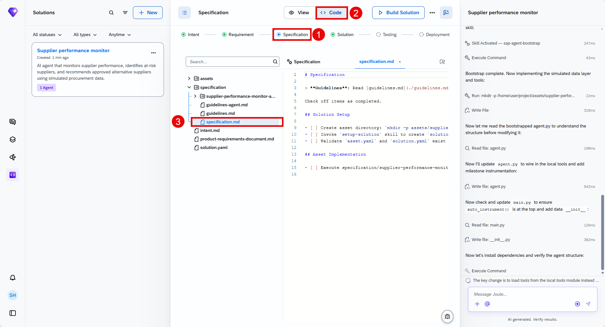

[OPTION END]

[OPTION BEGIN [Ideate and Plan]]

After the PRD is ready, enter the following in the chat when the tool prompts you:

```COPY
Create specification
```

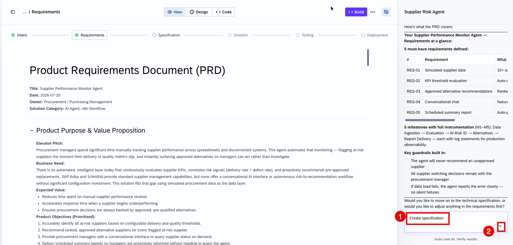


When the specification is ready, review it in the **Code** tab - you'll find it as **specification/specification.md**. If you'd like to adjust any part of it, edit the file directly before moving on. Once you're satisfied, proceed to building the solution.


[OPTION END]

### Solution

[OPTION BEGIN [Quick Create]]

In **Quick Create** mode, the tool automatically starts building the agent for you.

The tool now builds the solution - setting up the agent, creating the data and tools, and writing and running the tests. On the right, you can follow along. The exact steps and file names vary each run.

When all tasks are complete, you can review the generated solution. For this switch to the **Solution** step.

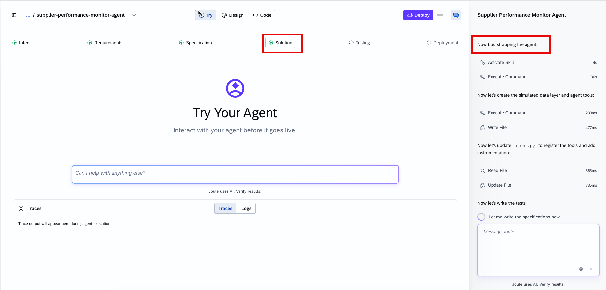

Explore the generated code in the **Code** tab to see how the agent is structured.

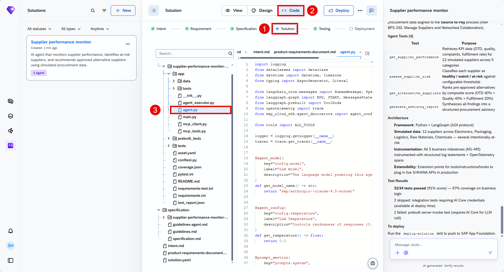

Choose the **Try** tab at the top to interact with the agent in a chat box.

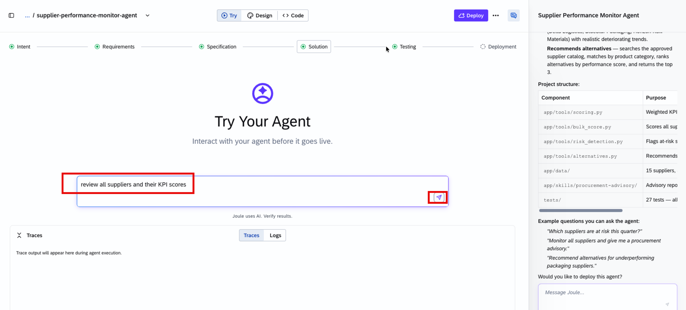

Enter a question to test the agent. For this tutorial, try:

```COPY
review all suppliers and their KPI scores
```

The agent processes your request and responds. What it can do depends on what was implemented - the right-hand panel shows a summary of the agent's capabilities and example questions you can ask. The **Traces** panel at the bottom shows how the agent handled each request.

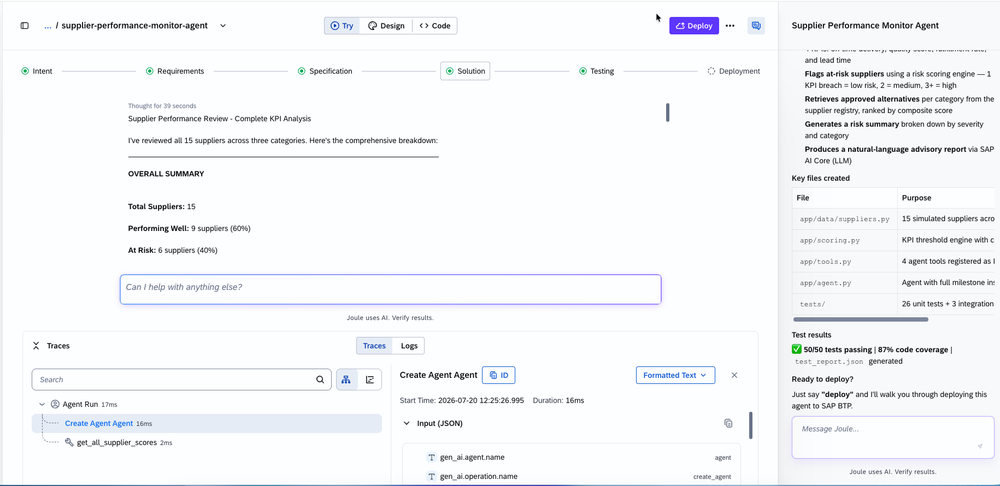

[OPTION END]

[OPTION BEGIN [Ideate and Plan]]

When the specification is complete, you could pass it on to another team to do the implementation. In this tutorial, you'll get the tool to build the agent for you - choose the **Build** button in the top-right corner, or enter **Build the solution** in the chat when the tool prompts you.

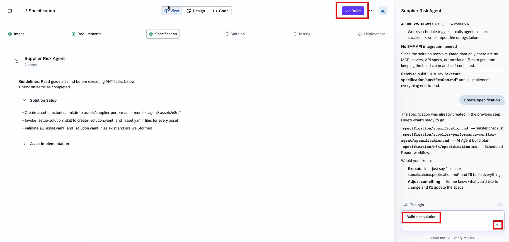

The tool now builds the solution - setting up the agent, creating the data and tools, and writing the tests. On the right, you can follow along. The exact steps and file names vary each run.


When all tasks are complete, you can review the generated solution.

Explore the generated code in the **Code** tab to see how the agent is structured.


Once the solution is ready, choose the **Try** tab at the top to interact with the agent in a chat box.


Enter a question to test the agent. For this tutorial, try:

```COPY
review all suppliers and their KPI scores
```

The agent processes your request and responds. What it can do depends on what was implemented - the right-hand panel shows a summary of the agent's capabilities and example questions you can ask. The **Traces** panel at the bottom shows how the agent handled each request.


[OPTION END]

### Testing

After the solution is built, Joule Studio automatically runs an automated test suite against the generated agent. You don't need to do anything - the tool executes the tests and shows you the results.

Choose the **Testing** tab at the top to see the test overview: total tests, how many passed and failed, code coverage, and an overall score. You can also see per-artifact validation results below.

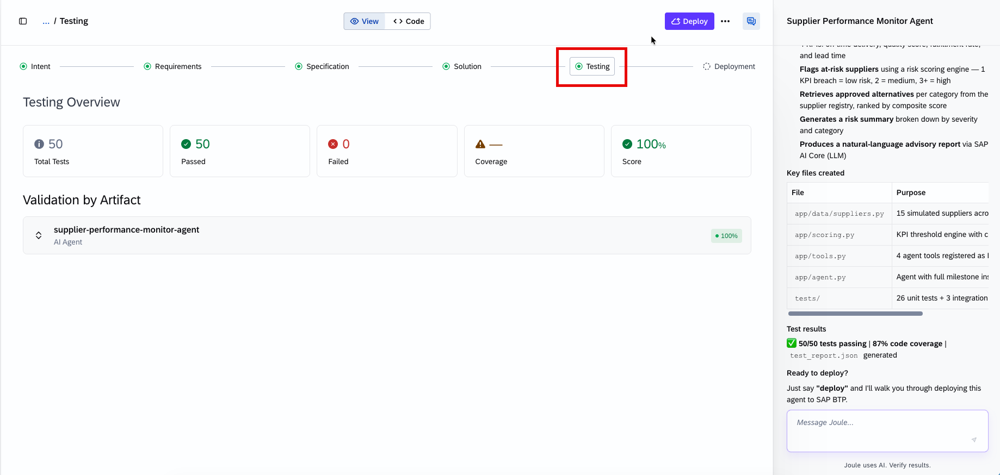

If all tests pass, the agent is ready to deploy.

### Deployment (optional)

When you're ready to deploy, you have two options:

- Choose the **Deploy** button in the top-right corner.
- Or enter **deploy** in the chat.

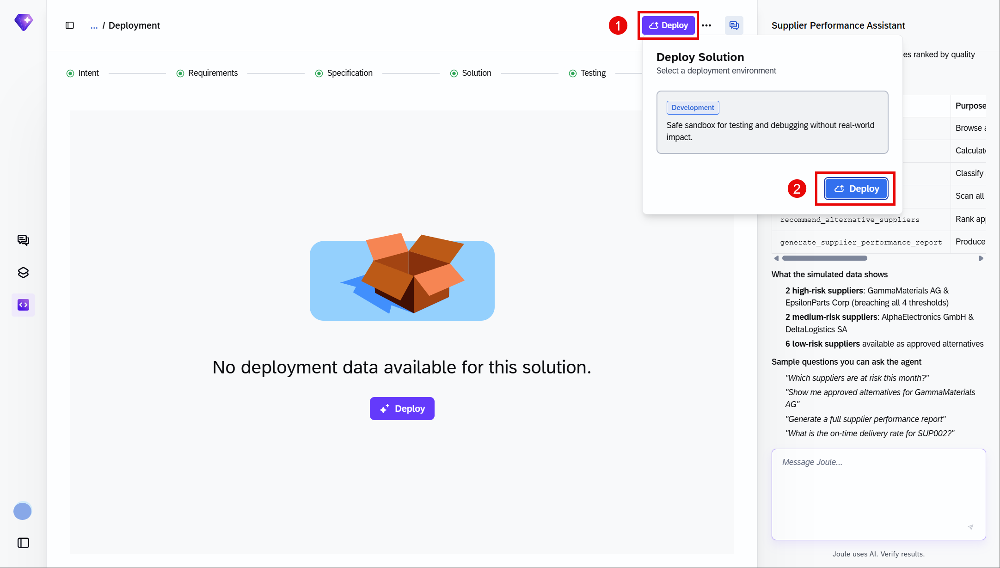

The tool walks you through deploying the agent to SAP BTP. When the deployment is complete, you can see the deployment record on the **Deployment** tab, along with the agent's status, version, and live agent URL.

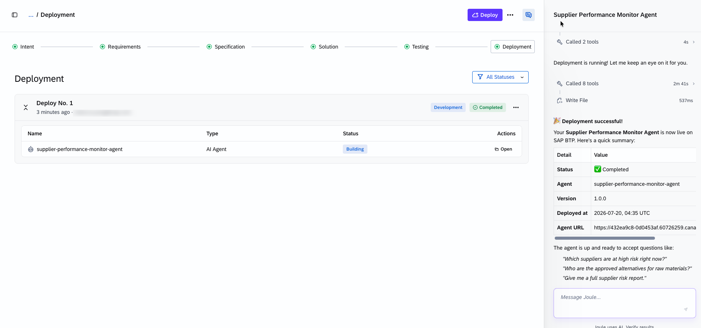

Expand the deployment record and choose **Try now** to interact with the deployed agent via the A2A protocol.

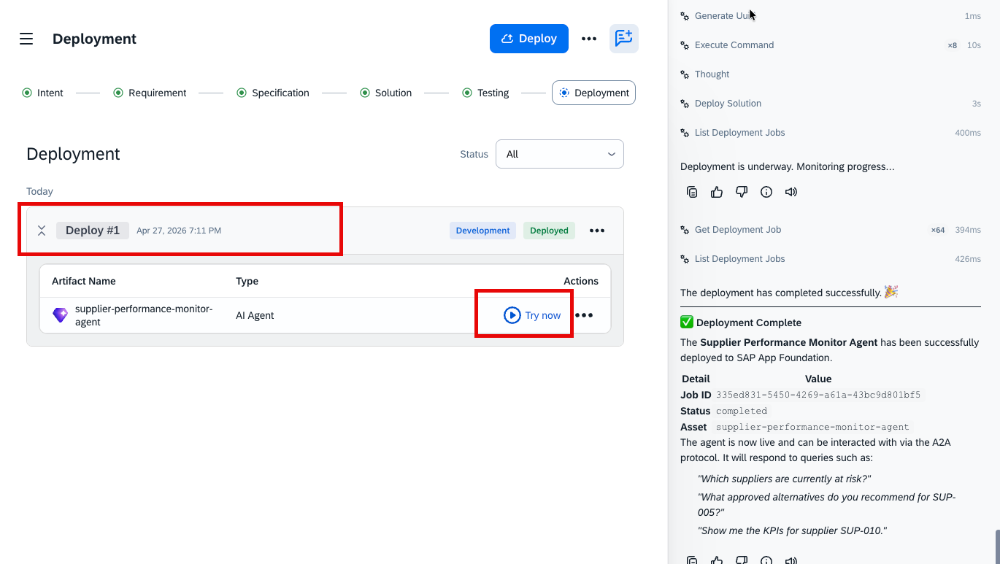

The generated code follows SAP best practices and is deployable as-is.
