# Use Joule Studio to Create an Agent
<!-- description --> Use Joule Studio to create and test an agent.

## Prerequisites

- Joule Studio in SAP Build. See [Discovery Center mission](https://discovery-center.cloud.sap/missiondetail/4651/4940/).
- You understand the tutorial group [Build Your First Joule Skill in Joule Studio](https://developers.sap.com/group.joule-studio-first-skill.html).


## You will learn
  - How to create an agent 
  - How to test the agent in your private environment


## Intro
This scenario simulates a real-world challenge faced by maintenance planners: determining if the necessary materials for maintenance orders are available in stock. Planners currently perform this validation manually, often switching between multiple systems and spreadsheets, which is both inefficient and error prone. You will use a subset of a CAP-based backend service running on SAP BTP, exposed through a configured destination. This tutorial introduces you to the basic features of the new agent building capabilities of Joule Studio. Joule skills are treated as tools and are not explained here - you will import a project with the necessary skills and actions ready for use. Document grounding is excluded here because that requires SAP Core AI and extra configuration. 


### Create a Destination

1. Download the destination file [sample-maintenance-service.json](https://github.com/sap-tutorials/sap-build-process-automation/blob/main/tutorials/joulestudio-agent-create/sample-maintenance-service.json).

2. In the BTP Cockpit, go to **Connectivity** -> **Destinations**.

3. Choose **Create** > **From File** > **Create** and then choose the destination file you downloaded.

4. Choose **OK** to complete the import.

5. Select the imported destination and choose **Check Connection**.

    <!-- border -->
    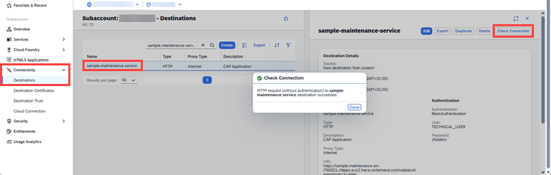

    If the service is not available, or you simply what to run your own, you can [install your own service](https://github.tools.sap/csd-cis-brazil/sample-maintenance-srv) and modify the destination accordingly.

### Create a Private Environment

Joule Studio's dedicated private environments provide safe, isolated spaces for experimenting with Joule agents. They allow you to build, test, and refine your agents and skills without affecting any shared or productive environments.

1. Go to the **Lobby** and choose **Control Tower**, then the tile **Environments**.

2. Choose **Activate Private Environment**.

    <!-- border -->
    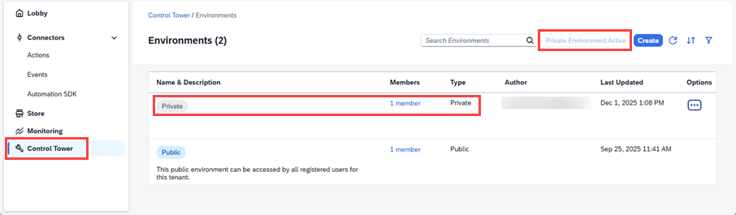

    You should see a new environment called **Private** with your user as author.

3. Go to the **Lobby** and choose **Control Tower**, then the tile **Destinations**.

4. Choose **Add**, select your destination and choose **Next**.

    <!-- border -->
    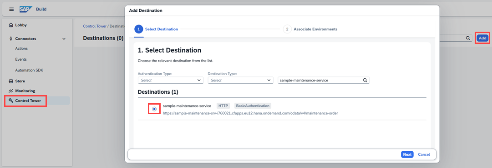

5. Select **All Environments** and choose **Add Destination**.

    <!-- border -->
    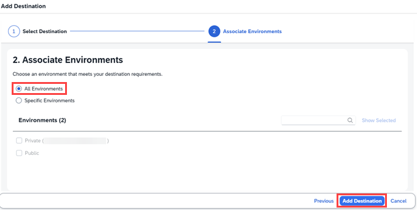

    Choosing all environments is convenient and saves a few clicks when you are learning.

6. Refresh the page if you do not see your destination.

    <!-- border -->
    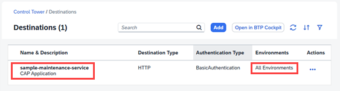


### Import Project with Skills

1. Download the project file [MaintenanceOrder_SKILLS.mtar](https://github.com/sap-tutorials/sap-build-process-automation/blob/main/tutorials/joulestudio-agent-create/MaintenanceOrder_SKILLS.mtar).

2. Go to the **Lobby** and choose **Import**.

3. Upload the file **MaintenanceOrder_SKILLS.mtar**, select it and then choose **Import**.

    <!-- border -->
    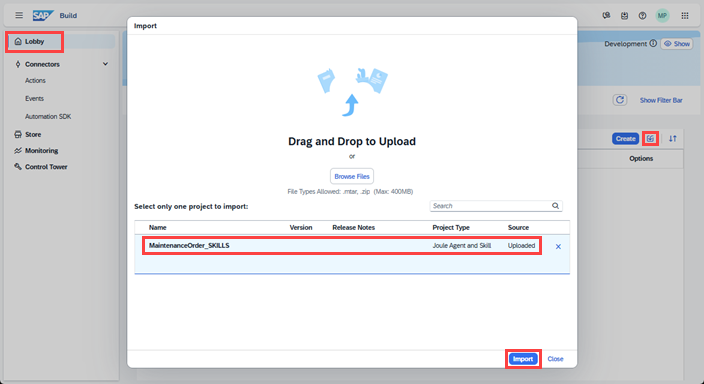

4. Choose **Close**. You should see your project in the Lobby.

    <!-- border -->
    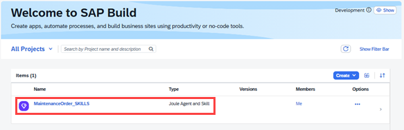

5. Open your project. You should see five Joule skills ready to use.

    <!-- border -->
    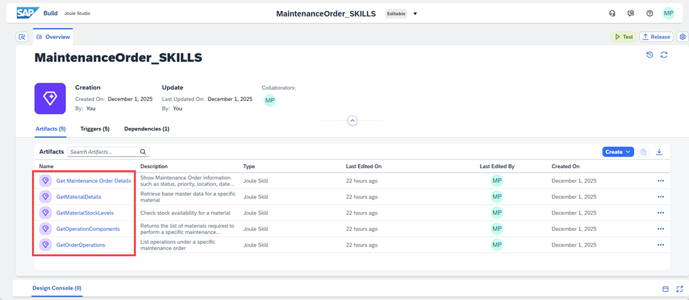

    In addition to the Joule Studio project, an action project has also been imported and is ready to use - if you check under **Connectors** > **Actions** in the **Lobby**, you will find the project and can see that it is published.

### Create an Agent

1. In the overview page of your project, click on the dropdown **Create** > **Joule Agent**.

    <!-- border -->
    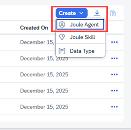


2. Enter the following:

    - Name: **`Maintenance Fulfillment Validator`**
    - Description: **`Agent to check if maintenance orders can proceed based on material stock levels.`**

    > Just like for Joule skills, the description plays a crucial role in how Joule identifies and activates the right agent during runtime. A clear, business-oriented description helps Joule understand when this agent should be called and for which type of user requests. By describing the agent’s purpose precisely you ensure that Joule can automatically match user intents to this specific agent, improving relevance and accuracy across enterprise scenarios.

    <!-- border -->
    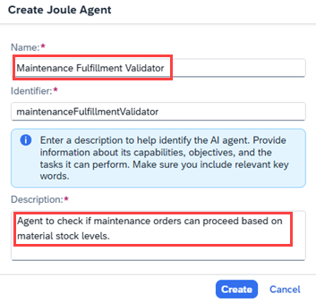

3. Choose **Create**.

    After creation, you will land on the agent editor screen. This is where you will add a clear expertise summary to describe what your agent is good at, and instructions that define how the agent should behave.

    <!-- border -->
    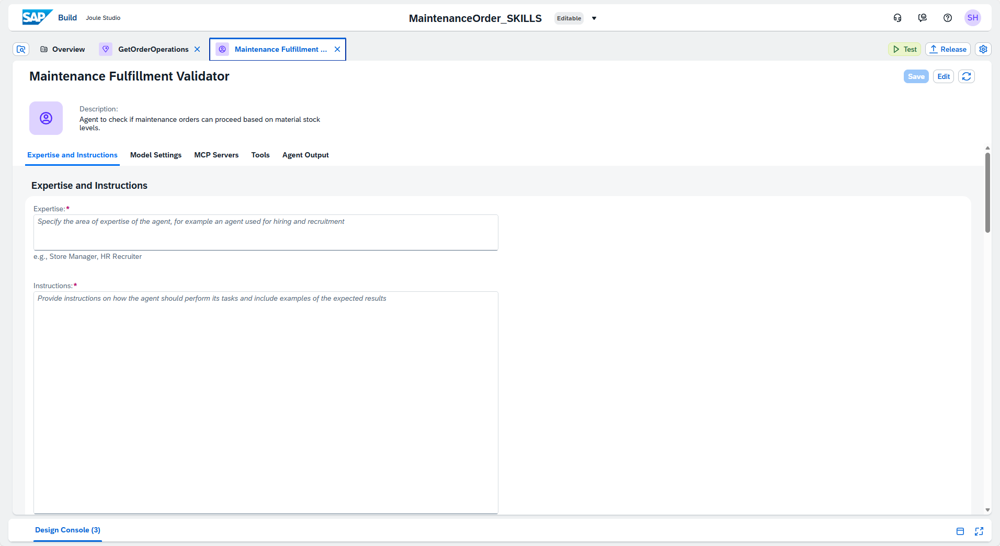


### Configure the Agent Behavior

For the first pass through this tutorial, simply use the texts provided below. Later, when you are experimenting, refer to [Best Practices for Creating Joule Agents](https://help.sap.com/docs/Joule_Studio/45f9d2b8914b4f0ba731570ff9a85313/880eb67d649247cf9c127dd37d168855.html).

1. Add the following text to **Expertise**:

    ```
    Validates maintenance orders, checks material stock, and recommends actions to ensure fulfillment.
    ```

2. Add the following text to **Instructions**:

    ```
    You are responsible for determining whether a given maintenance order can be executed based on the availability of required materials in stock. Your process begins with acquiring the maintenance order ID from the user. Do not proceed until you have received and validated this ID. Once the ID is provided, retrieve the full set of details associated with the maintenance order. This includes general information such as the order type, priority, plant, and scheduling data, but most importantly, you must collect and analyze all operations and their required components. 
    
    For each operation within the order, identify the components necessary to perform the task. Pay attention to material numbers, descriptions, the quantity required, the unit of measure, and the relevant storage locations or plants. You must verify the current stock levels for each component using the latest inventory data. This includes checking on-hand quantities, taking into account any existing reservations, open purchase orders, blocked stock, or batch restrictions. If shelf life, expiration, or quality control status is relevant for any of the materials, you must factor that into your evaluation. 
    
    After reviewing all components across all operations, determine whether each material is fully available in the required quantity. If all components are available and no constraints are identified, you should confirm that the maintenance order is ready for fulfilment. Your confirmation must be clear and final, indicating that there are no material-related delays anticipated and that the maintenance team can proceed as planned. 
    
    If any materials are missing, partially available, or otherwise constrained, you must clearly report which materials are causing the issue. For each such material, indicate the required quantity, the currently available quantity, and any known reasons for the shortage, such as being reserved for another order, not yet delivered, or stuck in quality inspection. Once you have identified the issues, provide practical and actionable recommendations to resolve them. This may include suggesting that procurement be initiated, that an existing purchase order be expedited, or that a stock transfer be requested from another plant or storage location. If the organization permits substitutions, you may suggest an approved alternative material, provided the substitution is equivalent and compliant with operational requirements. 
    
    In cases where the order is blocked due to material shortages, you must explain not only what is missing but also what the potential impact is—whether the entire order is delayed or only specific operations—and what actions should be taken next. If the user has provided a requested execution date, compare it against lead times to determine whether the issue is time-critical, and reflect that urgency in your recommendation. 
    
    You must always conclude your assessment with a clear and concise summary of the outcome. If all materials are available, state that the order is ready for execution. If any materials are missing, summarize which ones, the extent of the shortage, and what steps are recommended to resolve the issue. Optionally, offer to provide additional detail on individual components, operations, or to assist with follow-up actions such as creating a purchase requisition or checking other plants for stock. 
    
    Throughout the process, your tone should remain clear, professional, and helpful. You are not only reporting a status but helping the user take informed action to move the order forward as efficiently as possible. Accuracy, transparency, and practical recommendations are the most important aspects of your task.
    ```

3. Add the following text to **Additional Context**:

    ```
    Please maintain a clear, professional, and supportive tone. This agent is designed to assist maintenance planners and operations teams in evaluating whether a maintenance order can proceed without delays due to missing materials. 
     
    Recommendations should be practical, action-oriented, and phrased respectfully, especially when issues are detected. The agent must avoid vague language. If materials are unavailable, it should state so explicitly and guide the user on next steps such as procurement, stock transfer, or substitution. 
     
    The overall voice should reflect operational reliability, transparency, and collaboration, aligning with values of efficiency, accountability, and continuous improvement.
    ```

    <!-- border -->
    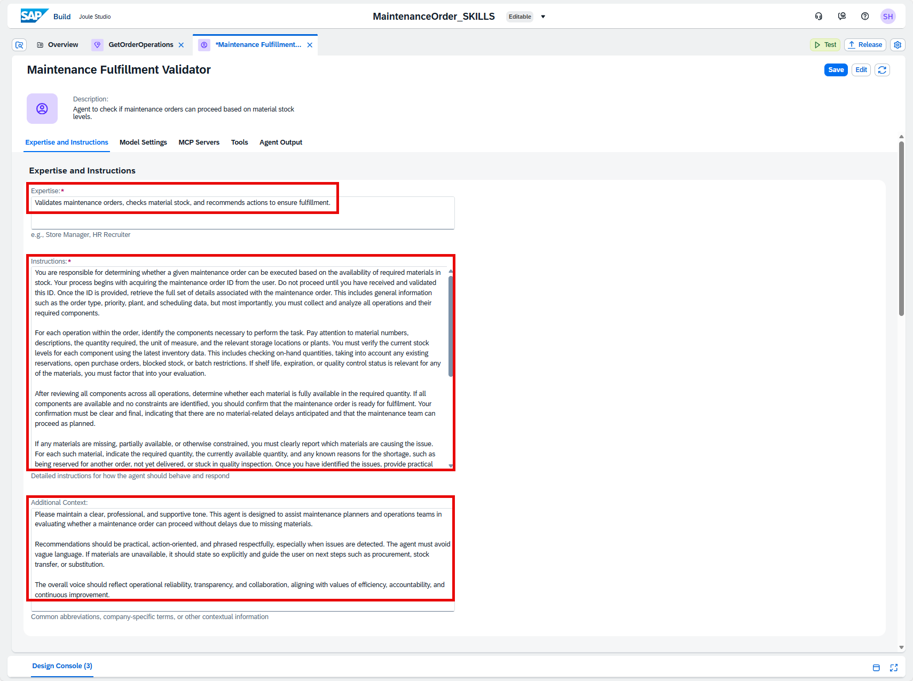

4. Select **Model**.

    You can leave the defaults as they are. You can experiment with these later.

    <!-- border -->
    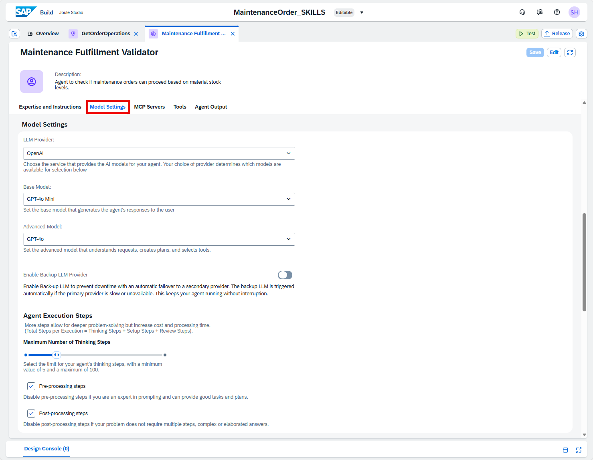

5. In **Advanced Configuration**, leave the check boxes unchecked. You can experiment with these later. 

    <!-- border -->
    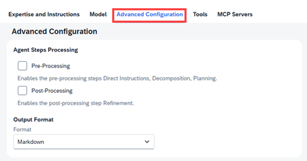

    > The Advanced Configuration allows you to add pre-processing steps and post-processing steps. This forces the agent to decompose the steps to improve planning, reasoning and optimizes the response the agent will output.

6. Scroll down to the **Tools** section, and select **Joule Skill** from the **Add Tool** dropdown.

    <!-- border -->
    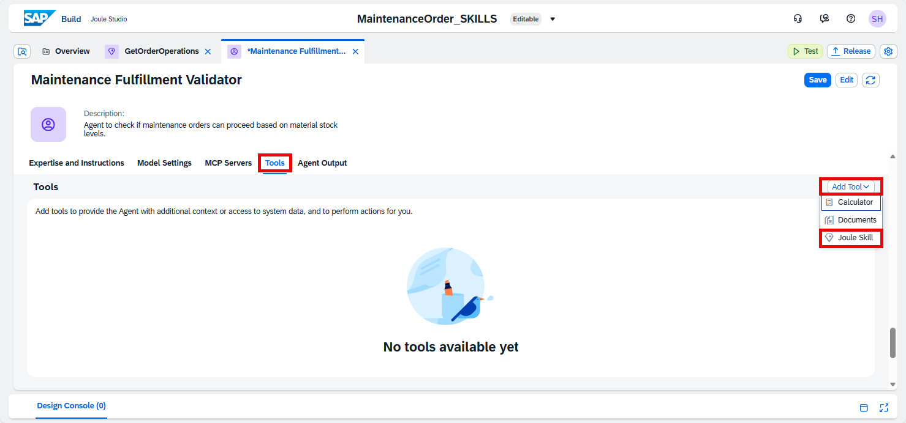

7. Select all the skills and choose **Add**.

    <!-- border -->
    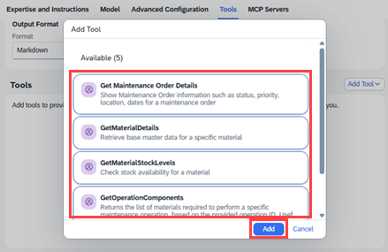

8. Save the agent

    <!-- border -->
    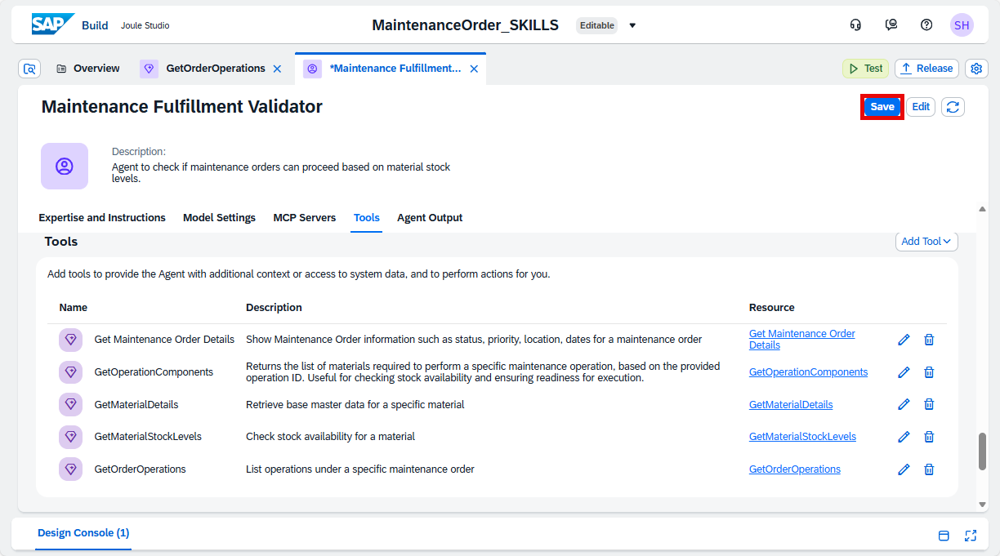

    You have created a Joule agent that can intelligently reason over the provided skills and respond to user queries. This agent will orchestrate the entire stock validation process based on maintenance orders or material-related questions.


### Test in Private Environment

After you have created your Joule agent, you can test its functionalities and workflow to adjust configurations and instructions.

1. Choose **Test** in the agent editor.

    <!-- border -->
    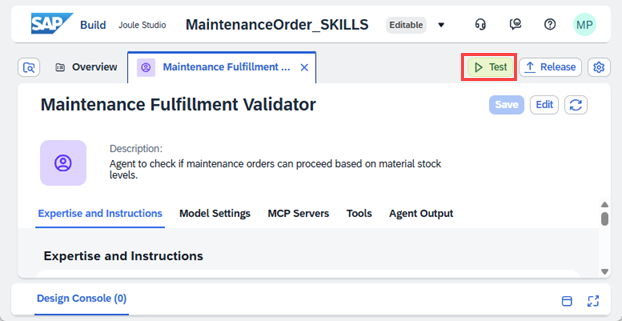

2. Configure the test parameters by selecting your private environment and the destination you configured earlier. Then choose **Continue**.

    <!-- border -->
    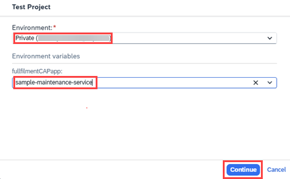

    A test chat is opened to test your Joule agent.

    <!-- border -->
    


3. Enter the prompt: **`Hello, I would like to check whether Maintenance Order 1 can be fulfilled based on current material availability`** and choose **Send**.

    <!-- border -->
    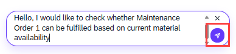

    <!-- border -->
    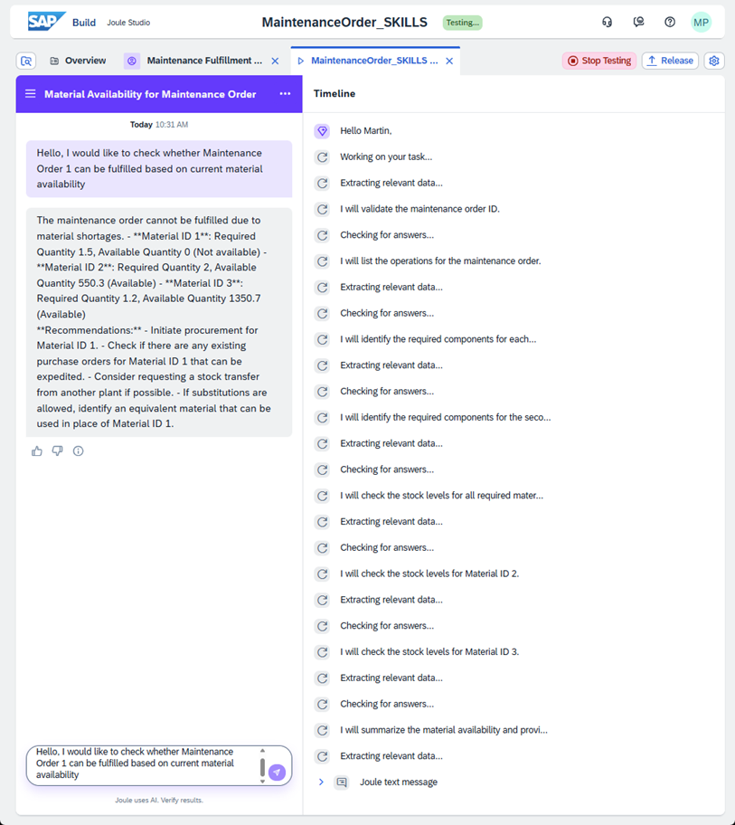

4. Under **Timeline**, expand the nodes and see how Joule processed your request. You can click on the names of the Joule skills to see the inputs and the outputs under **Details**.

    <!-- border -->
    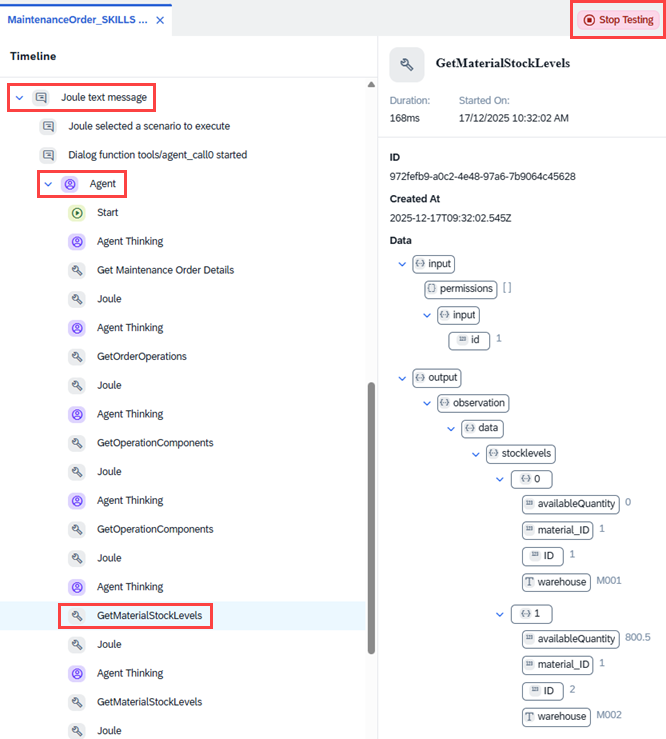

5. Choose **Stop Testing**.

You now know how to quickly create and test an agent in Joule Studio. If you want, try experimenting with the prompts or model choice, for example. Once you are satisfied with testing in your private environment, you can deploy to a shared environment.

### Test yourself


