# Create Action Projects
<!-- description --> Create action projects from live OData services.

## Prerequisites

- Access to an SAP BTP tenant with Joule and Joule Studio
- You have [configured the destinations to the OData services](joulestudio-skill-environment-setup)

## You will learn
  - to adjust actions to fit the needs of your Joule skill
  - to release and publish the actions so that they can be consumed in Joule Studio

## Intro
Actions are used in **SAP Build Process Automation** to connect processes with external systems, be it SAP or non-SAP systems, and to make GET, POST, PATCH and other calls. Actions created here can be consumed directly in a Joule skill created in **Joule Studio**.

In this tutorial, you will create an action project for accessing business partner information from an OData service representing an SAP system. You will also create an action project for creating a badge request via an OData service representing a third-party system.

### Create action project for BusinessPartner service

1. Open **SAP Build Lobby**.

    > The lobby is a central page for creating, accessing, and managing your projects in SAP Build.

2. Under **Connectors**, choose **Actions**, then choose **Create**.

    <!-- border -->
    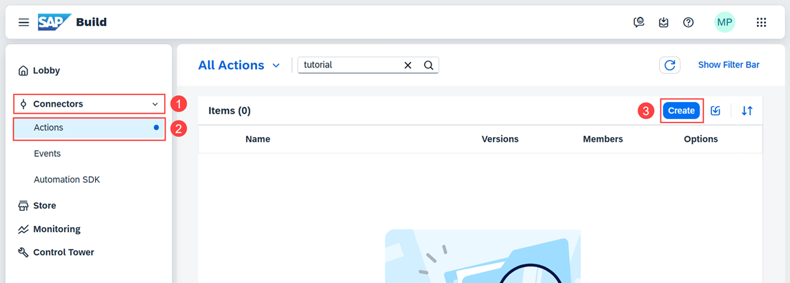

3. In the **Choose an API Source** popup, under **Live API**, choose **OData Destinations**.

    <!-- border -->
    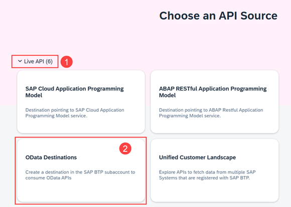

4. In **Browse OData Destinations**, choose the **S4HANA_MOCK** tile.

    <!-- border -->
    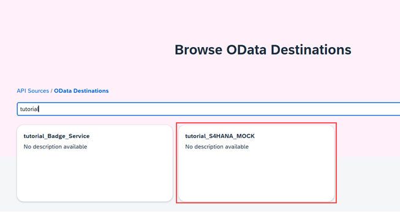

    <!-- border -->
    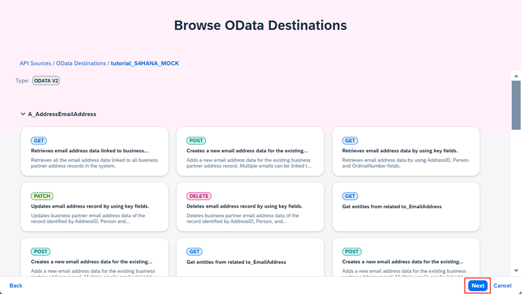

5. Choose **Next**.

6. Enter a name and description, then choose **Create**.

    <!-- border -->
    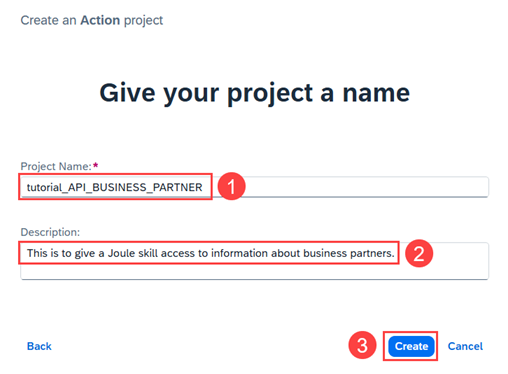

7. Select **`GET /A_BusinessPartner`** and **`GET /A_BusinessPartner('{BusinessPartner}')`**, and then choose **Add**.

    <!-- border -->
    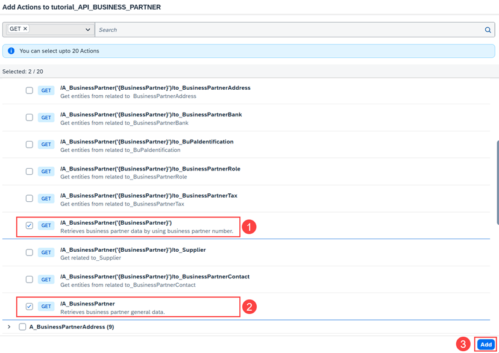

8. Select the action **Retrieves business partner data by using business partner number**.

    <!-- border -->
    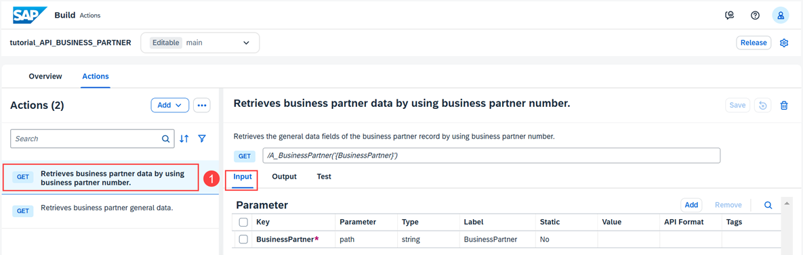

9. Choose **Output**, then remove all the fields except **BusinessPartner**, **FirstName**, and **LastName**.

    <!-- border -->
    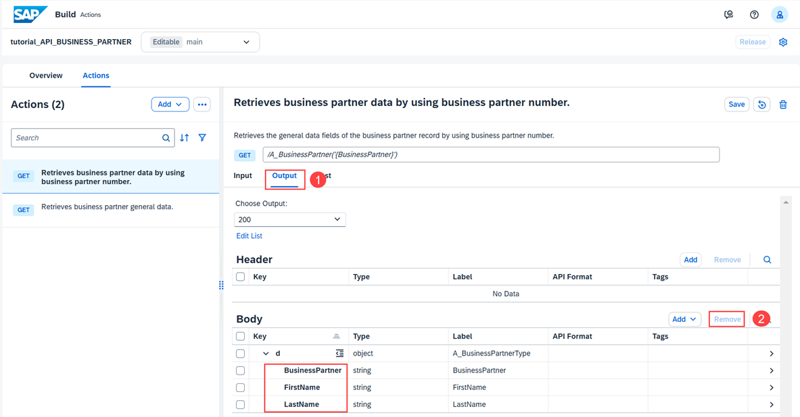

10. Choose the **Test** tab and enter **`1003764`** as the value for **BusinessPartner**.

    <!-- border -->
    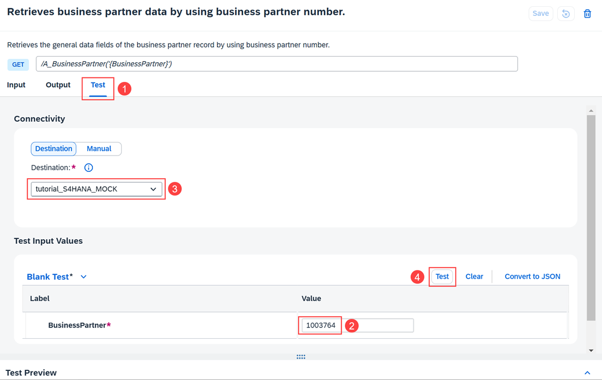

11. Make sure the correct destination has been selected, then choose **Test**.

    <!-- border -->
    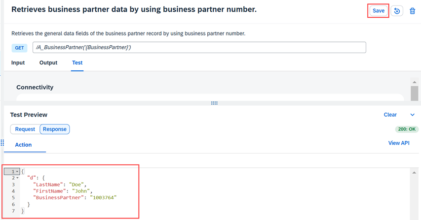

12. Choose **Save**.

13. In an similar manner, adjust the output of the action **Retrieves business partner general data**.

    <!-- border -->
    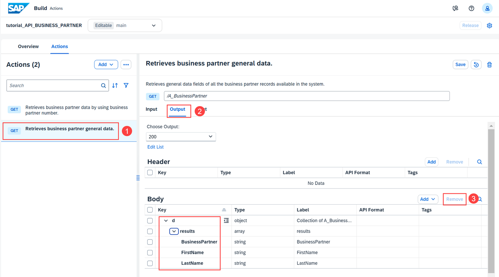

14. Choose the **Test** tab, then choose **Test**.

    <!-- border -->
    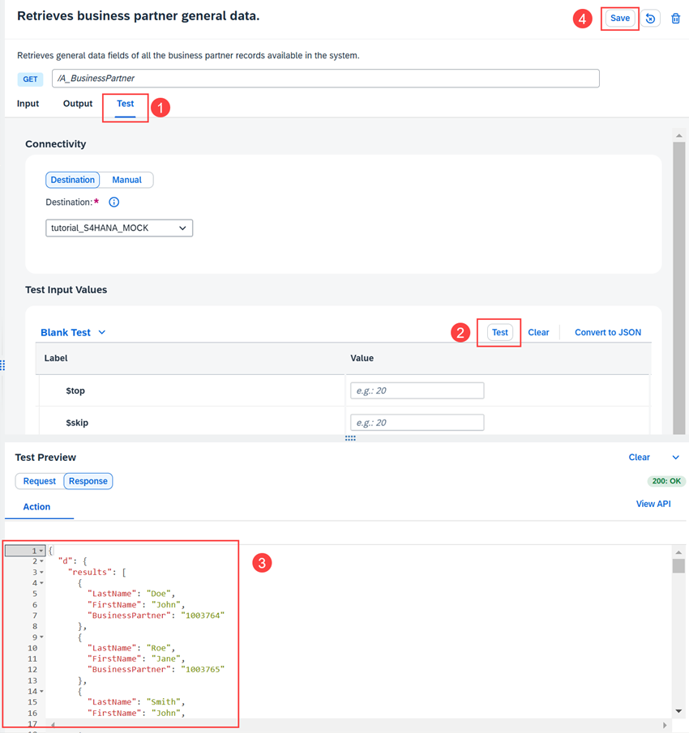

15. Inspect the response and then choose **Save**.

    <!-- border -->
    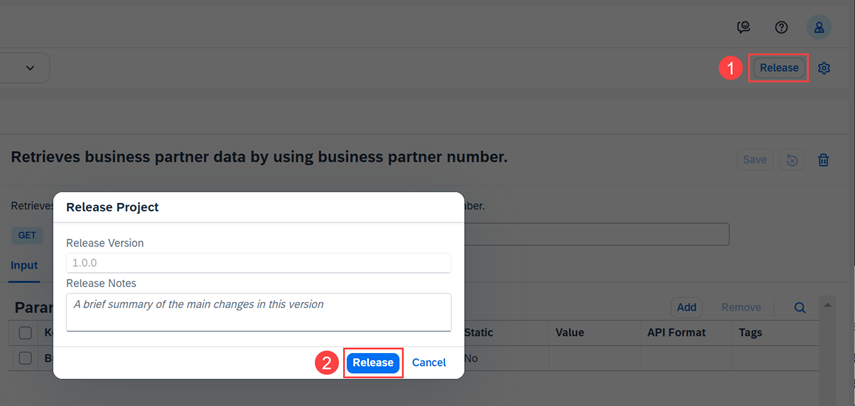

16. Choose **Release**, then in the popup choose **Release**.

    <!-- border -->
    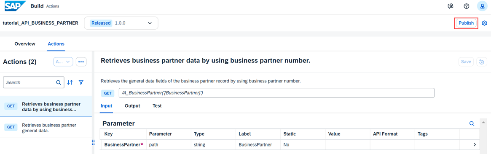

17. Choose **Publish**, and then in the popup choose **Publish**.

### Create action project for Badge Service

1. Open **SAP Build Lobby**.

2. Under **Connectors**, choose **Actions**, then choose **Create**.

3. In the **Choose an API Source** popup, under **Live API**, choose **OData Destinations**.

4. In the **Browse OData Destinations** popup, choose the **Badge_Service** tile.

    <!-- border -->
    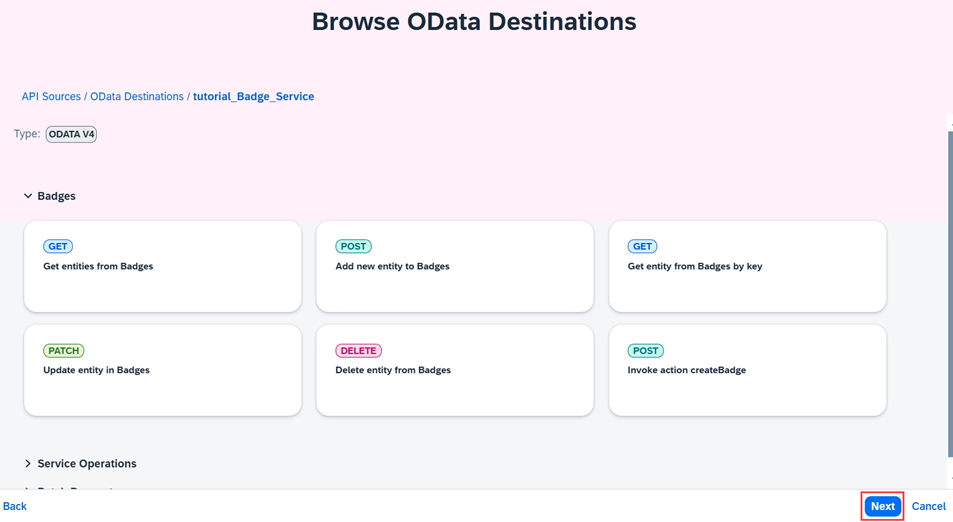

5. Choose **Next**.

    <!-- border -->
    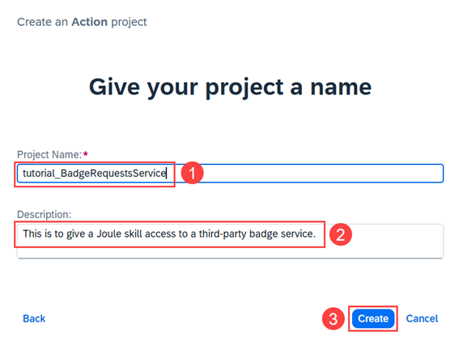

6. Enter a name and description, then choose **Create**.

    <!-- border -->
    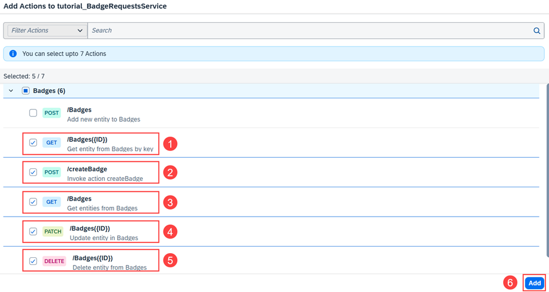

7. Select the five actions shown.

8. Choose **Add**.

9. Choose the action **POST Invoke action createBadge** and then choose the **Output** tab.

10. Change the **Type** of **badgeId** to **number**.

    <!-- border -->
    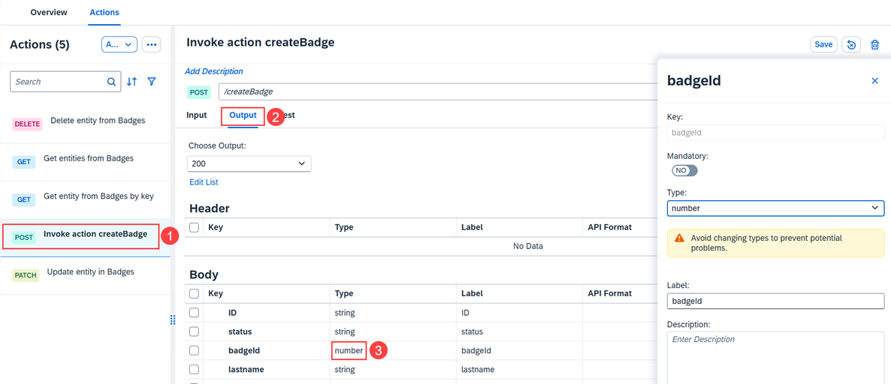

11. On the **Input** tab, remove the **processInstanceId** field by selecting it then choosing **Remove**.

    <!-- border -->
    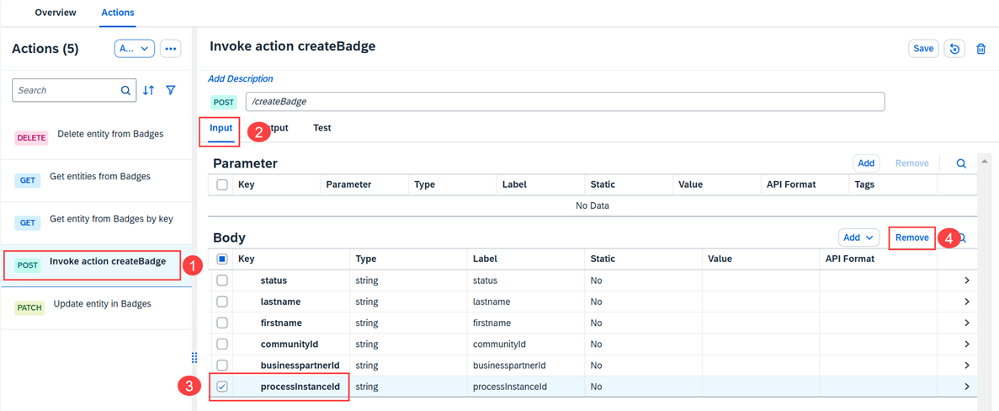

12. Choose **Save**.

13. Choose **Release**.

14. Choose **Publish**, and then in the popup choose **Publish**.

15. Choose action **POST Invoke action createBadge** and then choose the **Test** tab.

    <!-- border -->
    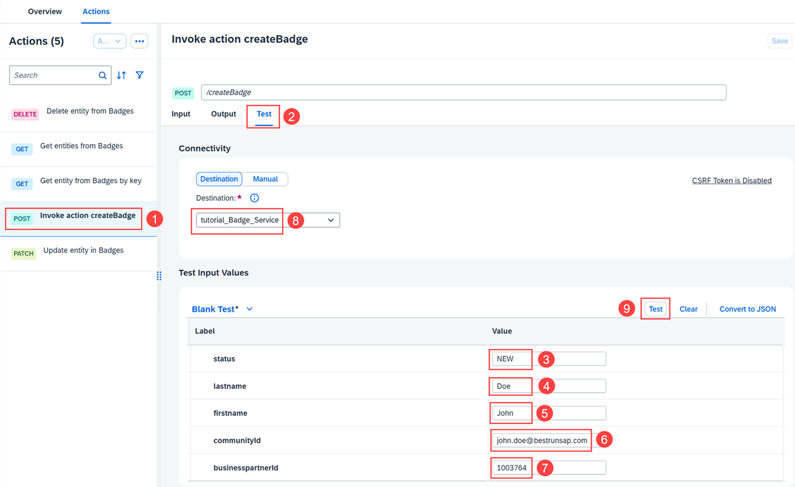

16. Enter the following in the Test Input Values fields.

    |  Name                    | Value         
    |  :-------------          | :-------------      
    |  **`status`**            | **`NEW`**   
    |  **`lastname`**          | **`Doe`**        
    |  **`firstname`**         | **`John`** 
    |  **`communityid`**       | **`john.doe@bestrunsap.com`**
    |  **`businesspartnerid`** | **`1003764`**

17. Make sure the correct destination has been selected, then choose **Test**.

    <!-- border -->
    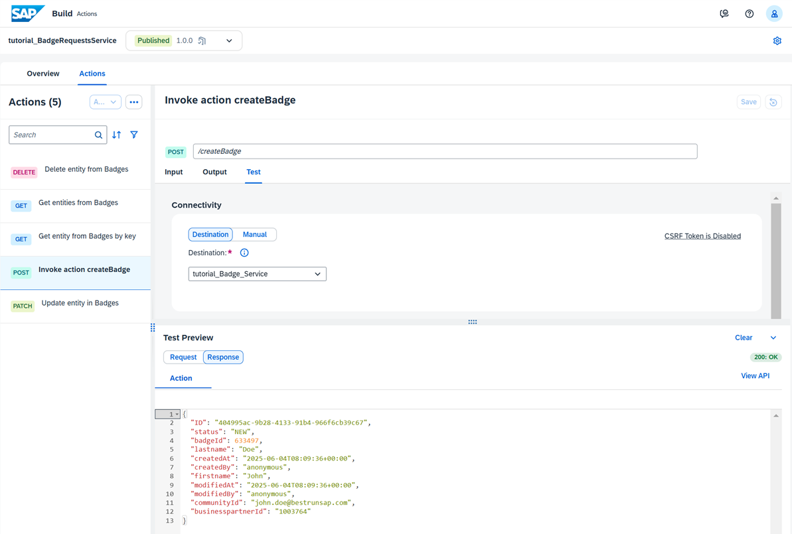

18. Inspect the response.

### Test yourself

