# Setup Environment and Connectivity for Joule Skills
<!-- description --> Setup environment and connectivity for developing and testing Joule Skills.

## Prerequisites

- Access to an SAP BTP tenant configured for Joule and Joule Studio

## You will learn
  - How to create a test environment
  - How to create destinations in SAP BTP Cockpit to connect to backend systems
  - How to configure destinations to be used with actions

### Create an Environment for Testing Joule Skills

1. Open the SAP Build Lobby.

    > The lobby is a central page for creating, accessing, and managing your projects in SAP Build.

2. Choose **Control Tower**, then choose **Environments**.

    <!-- border -->
    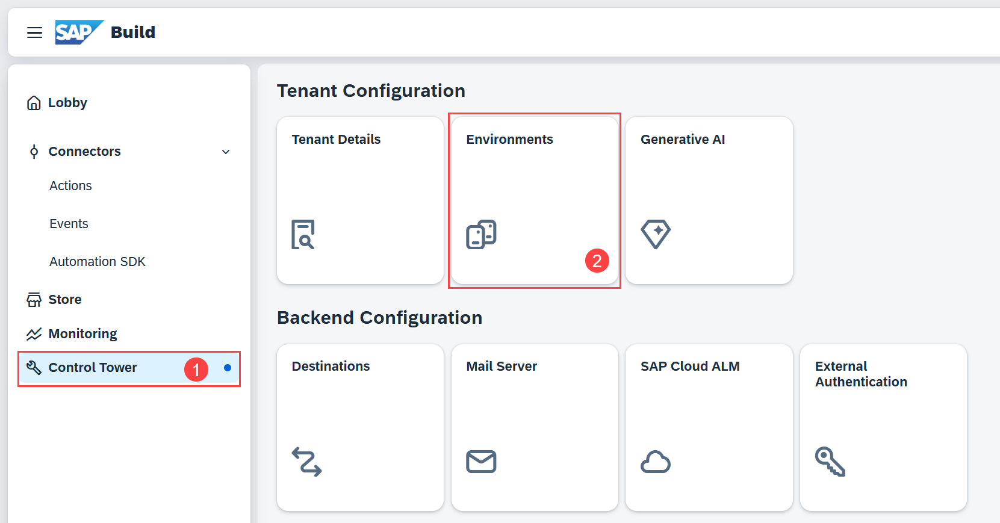

3. Choose **Create**. In the popup, enter a name and description, then choose **Create**.

    <!-- border -->
    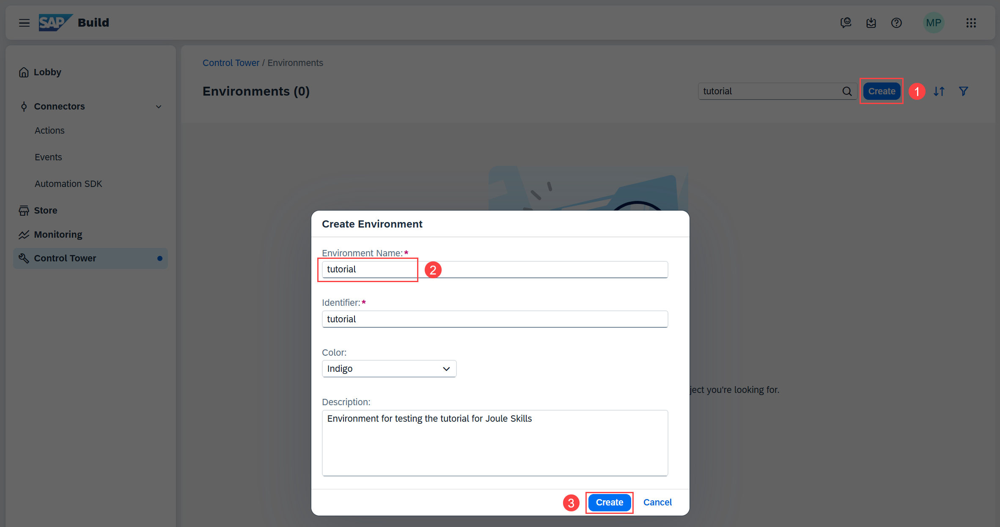

4. Choose your environment, then choose the **Joule** tab.

    <!-- border -->
    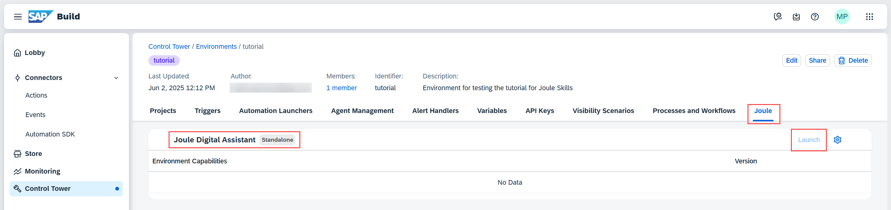

Since this is a new environment and you have not yet deployed a Joule skill, there is no data and you cannot launch the standalone Joule Digital Assistant.

### Create Destinations

1. Open **SAP Cloud Platform Cockpit** and go to **Connectivity > Destinations (New)**.

2. Choose **Create**.

    <!-- border -->
    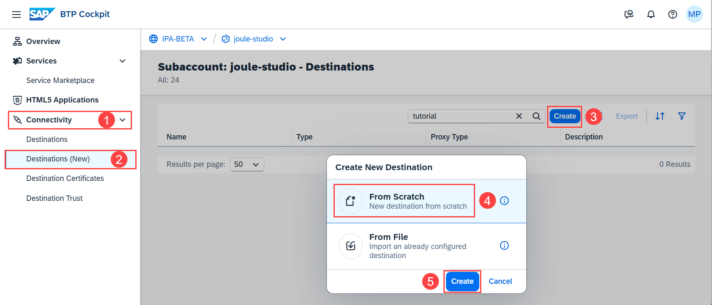

3. Choose **From Scratch** and then **Create**.

4. Enter:

    |  Field Name     | Value
    |  :------------- | :-------------
    |  Name           | **`S4HANA_MOCK`**
    |  URL            | **`https://s4hana-mock.cfapps.eu10.hana.ondemand.com/sap/opu/odata/sap/API_BUSINESS_PARTNER`**

5. Choose **Add Property** three times.

6. Enter the following parameters:

    |  Key     | Value
    |  :------------- | :-------------
    |  **`sap.processautomation.enabled`**                         | **`true`**
    |  **`sap.applicationdevelopment.actions.enabled`**            | **`true`**
    |  **`sap.build.usage`**            | **`odata_gen`**

 

    <!-- border -->
    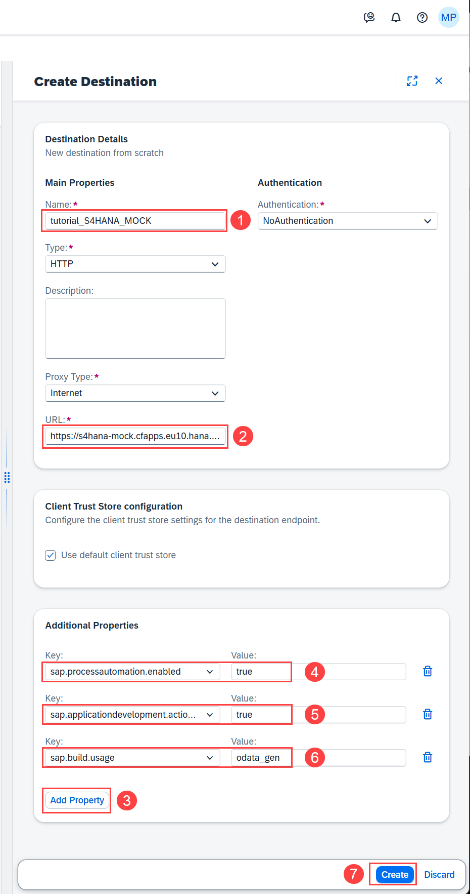

7. Choose **Create**.

8. Choose **Check Connection**.

    <!-- border -->
    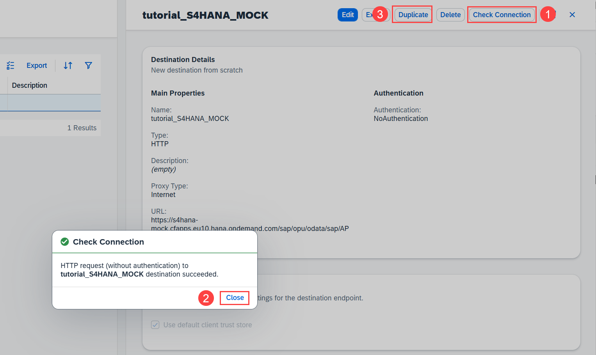

9. Choose **Close**.

10. Choose **Duplicate**.

11. Enter:

    |  Field Name     | Value
    |  :------------- | :-------------
    |  Name           | **`Badge_Service`**
    |  URL            | **`https://badges.cfapps.eu10.hana.ondemand.com/service/BadgeRequests`**

    <!-- border -->
    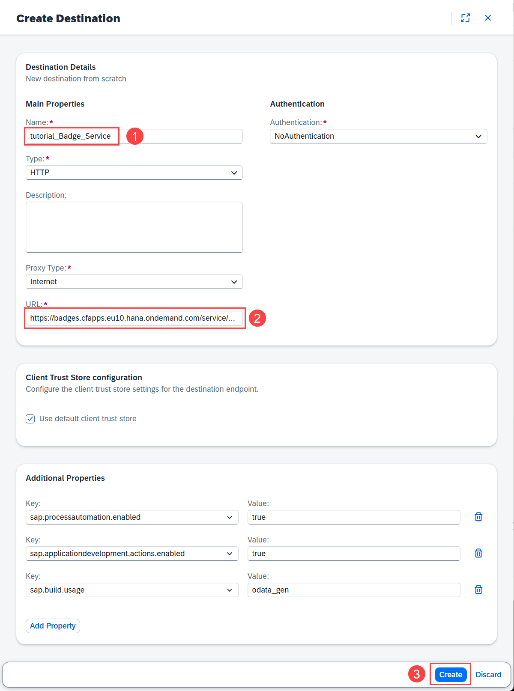

12. Choose **Create**.

13. Choose **Check Connection**.

    <!-- border -->
    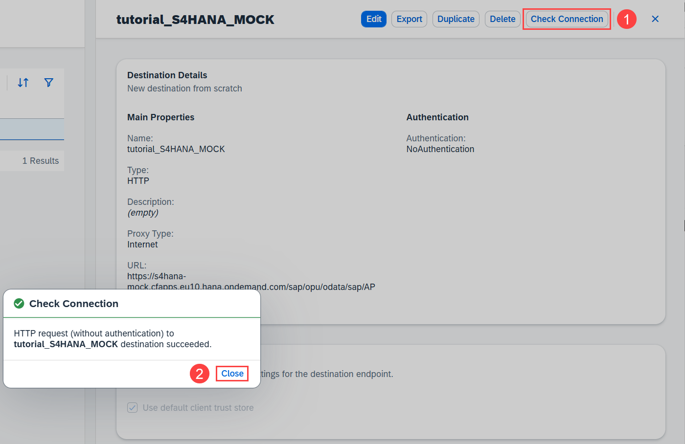

14. Choose **Close**.

### Associate Destinations with Environments

1. Open the SAP Build Lobby.

2. Choose **Control Tower**, then choose **Destinations**.

    <!-- border -->
    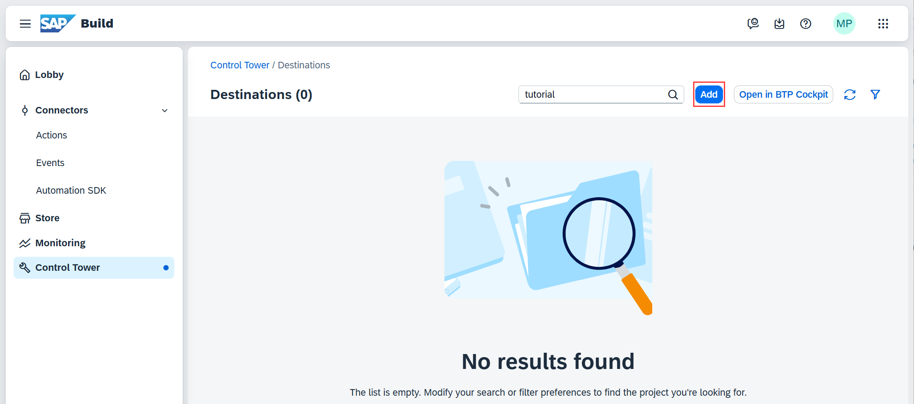

4. Choose **Add**.

5. Select your **Badge_Service** destination and choose **Next**.

    <!-- border -->
    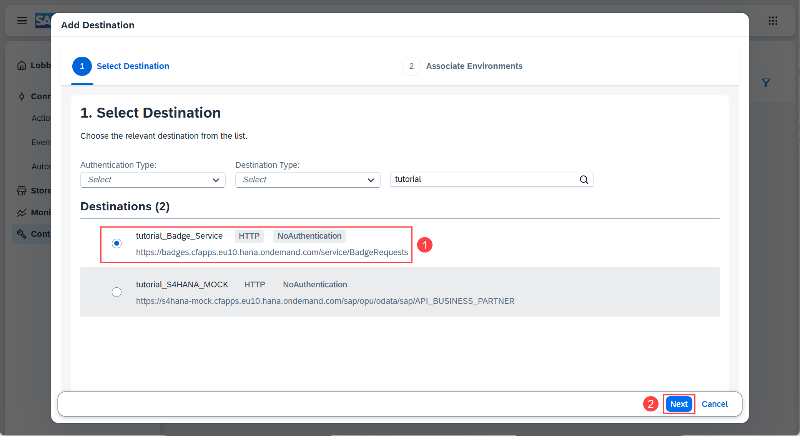

6. Select **Specific Environments** and search for the environment you created earlier.

    <!-- border -->
    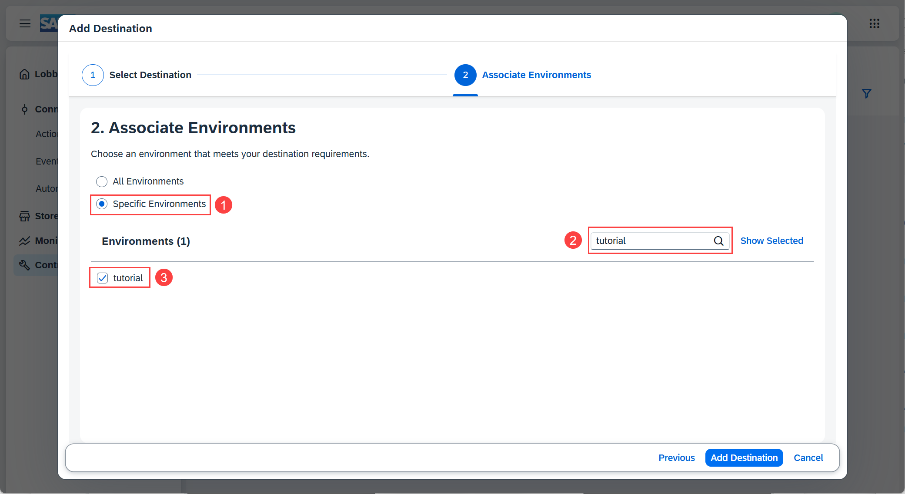

7. Select your environment.

8. Search for the **Public** environment and select that as well. 

9. Choose **Add Destination**.

    <!-- border -->
    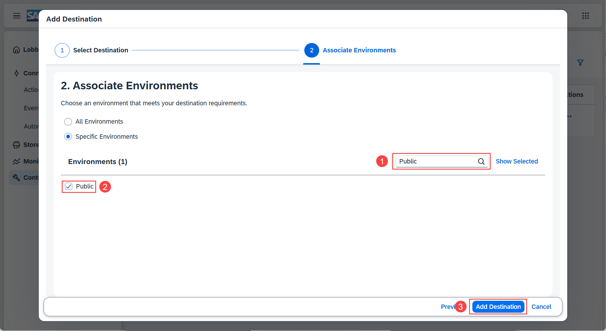

10. Repeat the above steps to add your **S4HANA_MOCK** destination.

11. Check that both destinations have been configured for both the **Public** and your own environments.

    <!-- border -->
    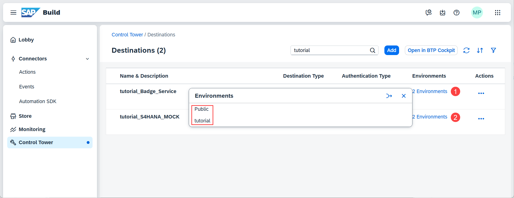

### Test yourself
