# Run the Sales Order Business Process
<!-- description --> Release, deploy and run the business process

## Prerequisites
- Complete [Create a Business Process](spa-academy-salesorder.md) tutorial

## You will learn
  - How to release and deploy the process
  - How to view the Triggers
  - How to trigger the process with API Trigger

---

### Release business process project


To run the process you have to first release and then deploy the business process project.

Releasing a project creates a version or snapshot of the changes and deploying the project makes it available in runtime to be consumed. You can only deploy a released version of the project, and at a given time there can be multiple deployed versions of the same project.

1. In the Process Builder, to release a project, choose the **Release** button on the top-right corner of the screen and provide a description.

    <!-- border -->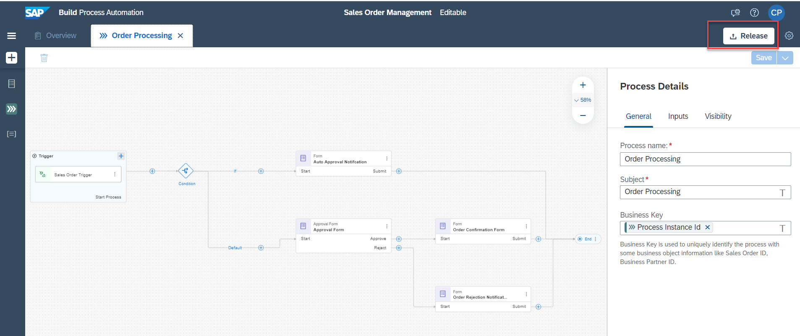

    > Version have x.y.z format where x is a major version number, y is minor and z is the patch number. Every time you release, a new version will be created. Version is incremented automatically based on how you want to store the changes in the repository like major or minor update or just as a patch.

2. If you are releasing for the first time, then the version will start with 1.0.0. Next time you release, the version numbers will be automatically updated.

    <!-- border -->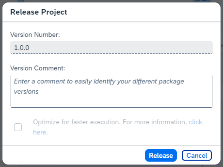


### Deploy released project


1. Once the project is released successfully, you will find a **Deploy** option on the top-right corner of the screen.

    <!-- border -->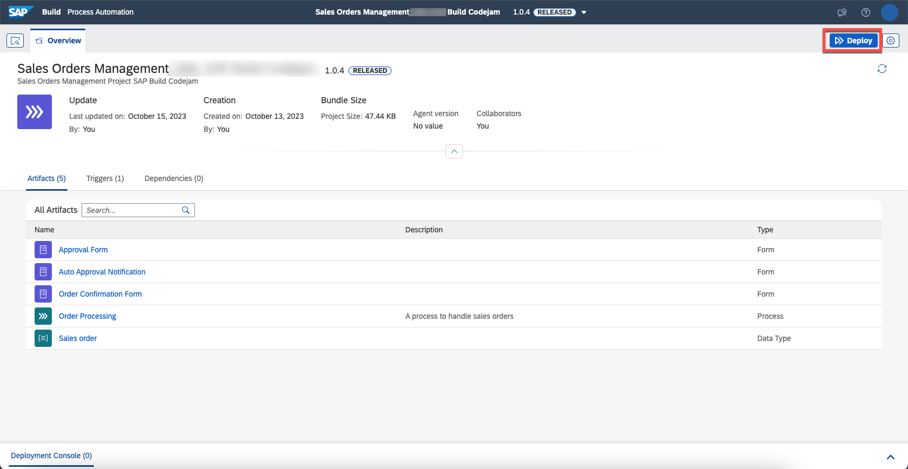

    Click on **Next** for the all the subsequent screens as shown below.

    <!-- border -->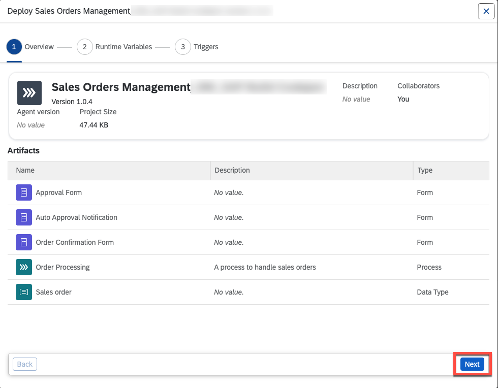

    <!-- border -->

    Since we have created an **API trigger** in our process ,you can see **Sales Order Trigger** in the list of the triggers.

    <!-- border -->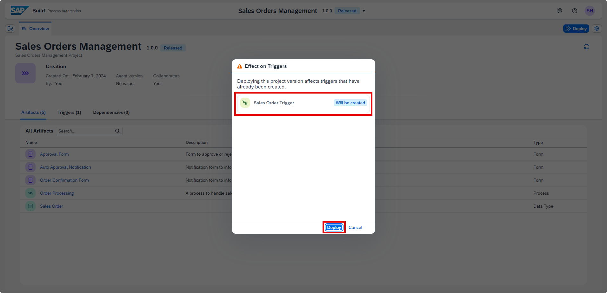

    > Deploy will take a couple of seconds/minutes depending upon how big your project is and how many different artefacts it has. Any errors during the deployment will be shown in the Design Console.

2. Once the deployment is successful, you will see a changed status. You can also see all your deployed and/or released project versions from the project status list next to the project name.

    <!-- border -->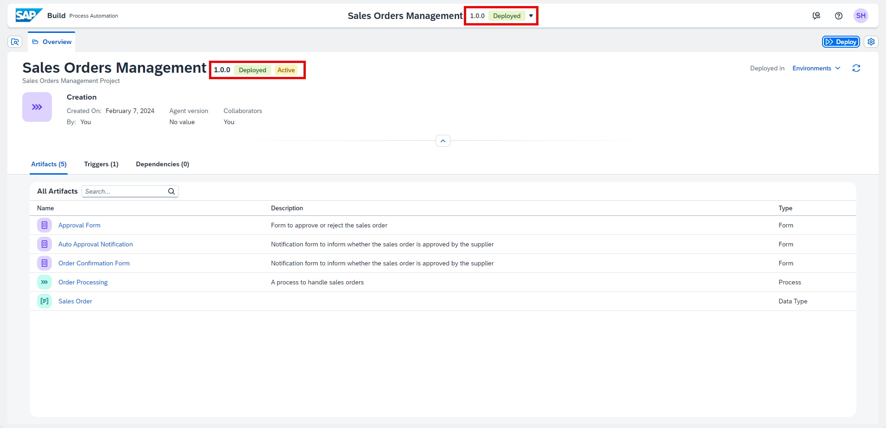

    > You cannot edit released or deployed projects. To continue working on your project, you need to select the Editable option.

    You have successfully deployed your project. It is time to run the process and see the results.

### Run business process

1. Once you have successfully deployed the business process with an API trigger, you can view the API trigger in the Overview section under the    tab Triggers.

    Click View to see context of the workflow API.

    <!-- border -->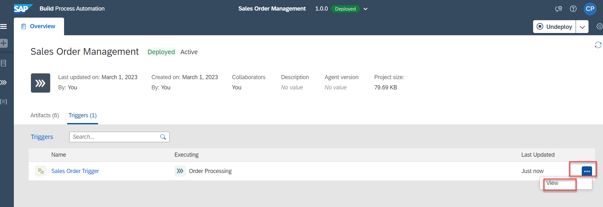

2. You can view the API URL and the payload to start the process.
    Copy the payload which would be used in the later steps .

    Details of the payload:

    |  **Name**    | **Details**
    |  :------------- | :-------------
    |  `definitionId`       | ID of the process after it is deployed
    |  `salesorderdetails`       | Input parameter for the API trigger

    <!-- border -->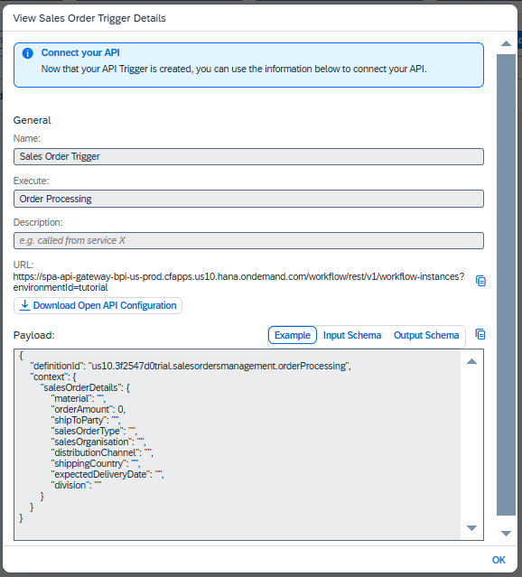

3. Since we have created API Trigger for the Business process ,let's test the process with API Trigger in **Monitor** section before we start the  process from SAP Build Apps.

   - Navigate to **Monitor** ---> **Manage** ---> **Process and Workflow Definitions** .
   - Search for the project **Sales Order Management** that you have created.
   - Click on **Start New Instance**.
   - Paste the payload that you have copied in Step 2.

        >> Don't modify the payload when you integrate with SAP Build Apps.

   Since the Definition ID is already available in the Monitor section , remove the definition ID and context .

   You payload should like below after providing values to the fields.

   

            ```JSON
            {
                    "salesorderdetails": 
                    {
                        "material": "Laptop",
                        "orderAmount": 900000,
                        "shipToParty": "ABCD",
                        "salesOrderType": "01",
                        "salesOrganisation": "01",
                        "distributionChannel": "01",
                        "shippingCountry": "India",
                        "expectedDeliveryDate": "2023-05-08",
                        "division": "01"
                    }
            }    

            ```

  <!-- border -->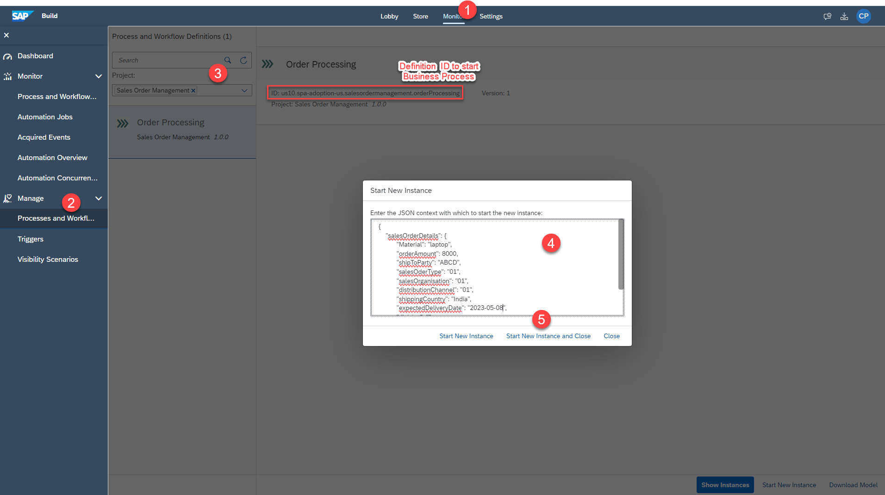

  - Click on **Start New Instance and Close**.

### Monitoring the process flow

Monitoring business process is one of the key aspect of the automated processes. Technical monitoring is an administrator job where a process admin proactively and consistently monitors the process performance, identifies any issues in the process and takes necessary actions to ensure business process continuity.

**SAP Build** provides different applications to monitor and manage different process artefacts. These applications are available under the **Monitor** tab.

1. All deployed processes can be accessed under Processes and Workflows under Manage. To monitor all the running instances of the process, you have to go to **Monitor** then **Process and Workflow Instances**.

    <!-- border -->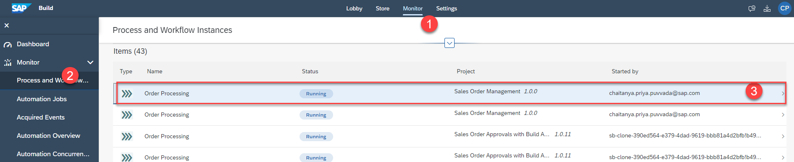

 In there, you will see all the running, erroneous and suspended process instances. Use the filter bar to get a more customized view of the process instances based on different statutes like running, completed, suspended, terminated etc.

2. Choose your process instance that was just triggered above.

    > Explore different process monitoring options. Observe the process instance information, process context which is the actual process data flowing across different activities in the process and the execution logs where you can see entire trace of how the process has been progressing with some basic runtime information of each activity.

    <!-- border -->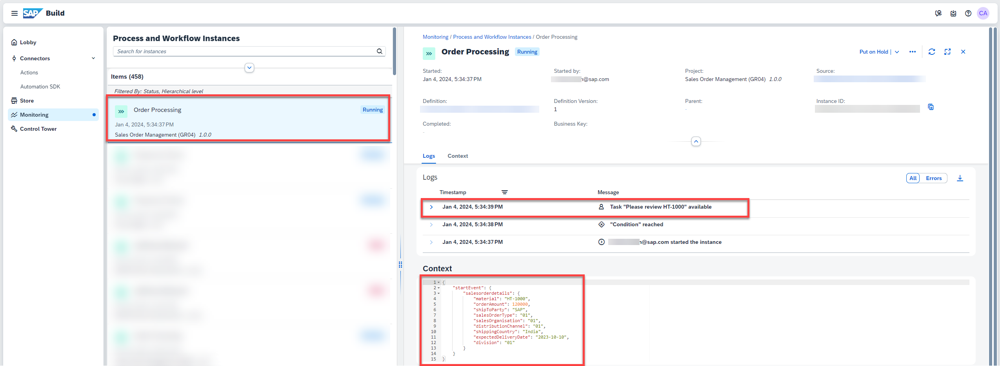

4. As you can see the process is waiting for the task to be completed. These tasks are generated from the forms that are added in the process and can be accessed via the **My Inbox** application.

    <!-- border -->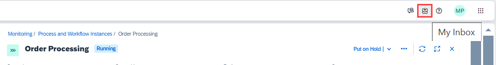

    Notice the **Recipients** list. This is the same as configured in the **General** section of the **Approval Form**. The task will go into the inboxes of all the recipients.

### Accessing the tasks


1. Tasks are the request for the users to participate in an approval or review process. These tasks appear in the **My Inbox** application shipped with **SAP Build**. User can claim, approve and reject the task from their inbox.

    <!-- border -->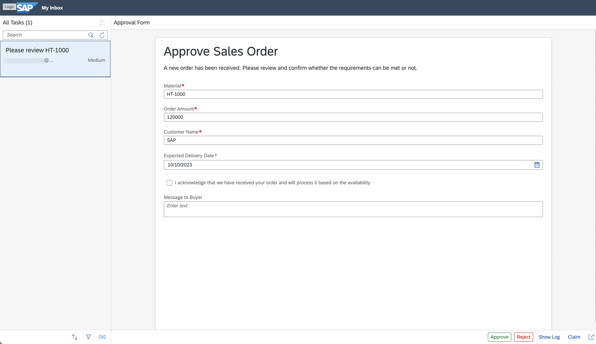

2.  Once you **approve/reject** the approval task, **refresh** the inbox again to get the final notification based on action taken.

    <!-- border -->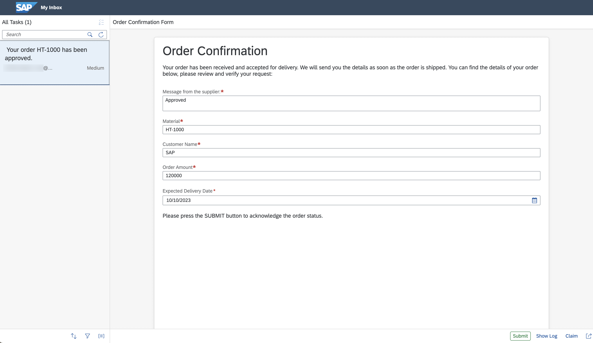

3.  Once you acknowledge the notification sent via the approval process, the process will be completed.

    <!-- border -->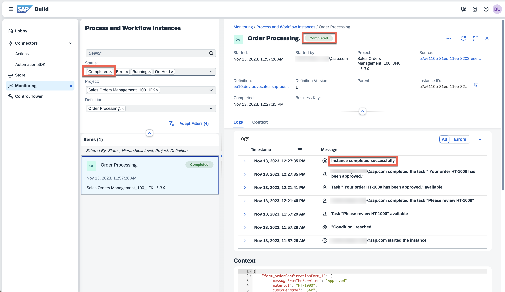


---
