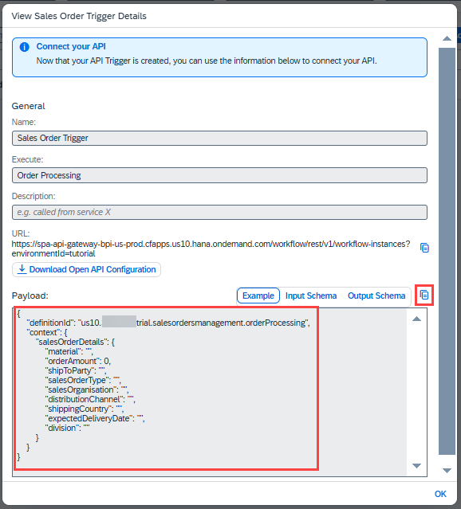
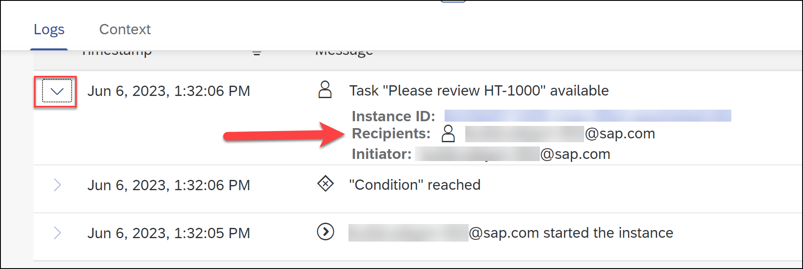

# Run the Sales Order Business Process
<!-- description --> Release, deploy and run the business process

## Prerequisites
  - Complete [Create a Business Process](spa-academy-salesorder) tutorial

## You will learn
  - How to release and deploy the process
  - How to view the Triggers
  - How to trigger the process with API Trigger

---

### Release business process project


To run the process you have to first release and then deploy the business process project.

Releasing a project creates a version or snapshot of the changes and deploying the project makes it available in runtime to be consumed. You can only deploy a released version of the project, and at a given time there can be multiple deployed versions of the same project.

1. In the Process Builder, to release a project, click  **Release** button on the top-right corner of the screen and provide a description in the popup dialog.

    <!-- border -->

    > Versions have x.y.z format where x is a major version number, y is minor and z is the patch number. Every time you release, a new version will be created. The version is incremented automatically based on how you want to store the changes in the repository like major or minor update or just as a patch.

     If you are releasing for the first time, then the version will start with **1.0.0**. Next time you release, the version numbers will be automatically updated.

2. Click **Release**.

    <!-- border -->


### Deploy released project


1. Once the project is released successfully, you will find a **Deploy** option on the top-right corner of the screen.

    <!-- border -->

    On the Overview tab, you will see a list of your artifacts. Click **Next**.

    <!-- border -->

    The Runtime Variables tab is empty as we haven't defined any variables. Click **Next**. 

    <!-- border -->

    Since we have created an **API trigger** in our process, you can see **Sales Order Trigger** in the list of the triggers.

    <!-- border -->

    Click **Deploy**.

    >Deployment will take a couple of seconds/minutes depending upon how big your project is and how many different artifacts it has. Any errors during the deployment will be shown in the Design Console at the bottom of the screen.

2. Once the deployment is successful, you will see a changed status. You can also see all your deployed and/or released project versions from the project status list next to the project name.

    <!-- border -->

    > You cannot edit released or deployed projects. To continue working on your project, you need to select the Editable version of your project (at the top of the page).

    You have successfully deployed your project. It is time to run the process and see the results.


### Run business process

1. Once you have successfully deployed the business process with an API trigger, you can view the API trigger in the **Overview** section by clicking the **Triggers** tab.

    Click **View** to see context of the workflow API.

    <!-- border -->

2. You can view the API URL and the payload that must be sent to start the process. Copy the payload, which will be used in later steps.

    Details of the payload:

    |  **Name**    | **Details**
    |  :------------- | :-------------
    |  `definitionId`       | ID of the process after it is deployed
    |  `context`     | The data to be sent to the process. In ours, we defined the `salesorderdetails` and all its fields.

    <!-- border -->

3. Copy-paste the payload to Notepad or some other editor for future use, by clicking the **Copy** button.

    <!-- border -->

4. Let's test the API Trigger in the **Monitor** tab of the SAP Build lobby.

    - Navigate to **Monitor** > **Manage** > **Process and Workflow Definitions**.
    - Search for the project `<your unique identifier>_Sales Management` that you have created in previous tutorial.
    - Click on **Start New Instance**.

    <!-- border -->

5.  Remove the example payload in the dialog. We need to add the payload we saved earlier, but only part of the payload.
   
    Remove the definition ID and context (since here these are understood) and leave just a JSON object that contains the `salesorderdetails` fields.

    Provide values to the fields as shown below (you can even take the JSON below for yourself). Your text should look something like this.
    
    ```JSON
    {
            "salesorderdetails": 
            {
                "material": "HT-1000",
                "orderAmount": 120000,
                "shipToParty": "SAP",
                "salesOrderType": "01",
                "salesOrganisation": "01",
                "distributionChannel": "01",
                "shippingCountry": "India",
                "expectedDeliveryDate": "2023-10-10",
                "division": "01"
            }
     }    

    ``` 

    >The amount must be entered as a number (no quotes) and dates must be entered in the format above for the expected delivery date.

    Click **Start New Instance and Close**.

    <!-- border -->

    >Don't modify the payload when you integrate with SAP Build Apps.


### Monitoring the process flow

Monitoring business process is one of the key aspect of the automated processes. Technical monitoring is an administrator job where a process admin proactively and consistently monitors the process performance, identifies any issues in the process and takes necessary actions to ensure business process continuity.

**SAP Build** provides different applications to monitor and manage different process artifacts. These applications are available under the **Monitor** tab.

1. Earlier, we accessed **Processes and Workflows** under the **Manage** section to see all the deployed processes.
   
    To monitor all the running instances of the process, you must go to **Process and Workflow Instances** under the **Monitor** section.

    <!-- border -->

    In there, you will see all the running, erroneous and suspended process instances. Use the filter bar to get a more customized view of the process instances based on different statutes like running, completed, suspended, terminated and so forth.

    The best way to find your process is to search for your user number or initials, depending on how you named it.

2. Choose your process instance that was just triggered above.

    >Explore different process monitoring options. Observe the process instance information, process context which is the actual process data flowing across different activities in the process and the execution logs where you can see entire trace of how the process has been progressing with some basic runtime information of each activity.

    Since the order amount is greater 100000, the process requires an approval.

    <!-- border -->

3. As you can see the process is waiting for the task to be completed. These tasks are generated from the forms that are added in the process and can be accessed via the **My Inbox** application.

    <!-- border -->

    In the **Logs** section, expand the top activity. Notice the **Recipients** list. This is the same as configured in the **General** section of the **Approval Form**. The task will go into the inboxes of all the recipients.

    

    We will open the **My Inbox** in the next step.


### Accessing the tasks
Tasks are the request for the users to participate in an approval or review process. These tasks appear in the **My Inbox** application shipped with **SAP Build**. Users can claim, approve and reject the task from their inbox.

Access the **My Inbox** by going to the SAP Build lobby, and clicking the icon in the upper right.


1.  Open the **My Inbox**, and find the task for the process you just triggered.

2. Click **Approve** .

    <!-- border -->

2.  Once you **approve/reject** the approval task, **refresh** the inbox again to get the final notification based on action taken.
   
    Click on **Submit** to complete the process.

    <!-- border -->

3.  Once you acknowledge the notification sent via the approval process, the process will be completed.

    <!-- border -->

Repeat the testing above twice more:

- Amount above 100000 and reject the request. You should get an email.
- Amount below 100000. This should send the auto-approve form to the **My Inbox**.


---
