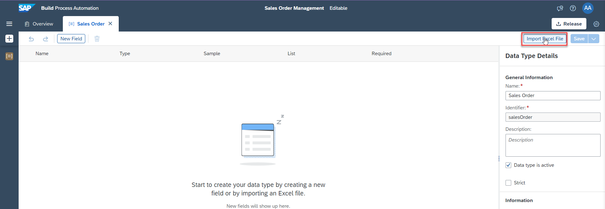
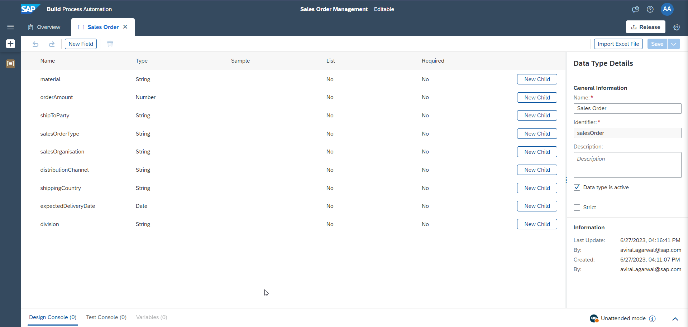
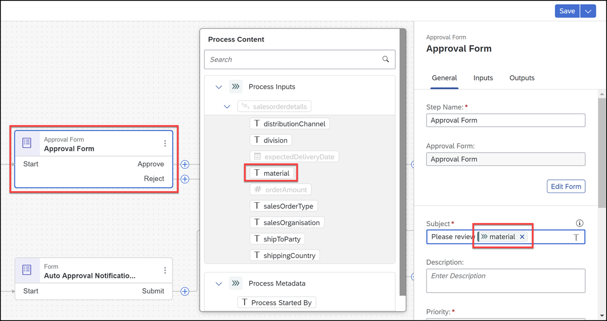

# Create a Business Process
<!-- description --> Create a Business Project and Process to build and extend business processes

## Prerequisites
  - [Trial account](https://blogs.sap.com/2022/09/09/sap-process-automation-now-available-in-your-trail-account/) with the SAP Build Process Automation enabled **OR**
  - A regular account with [SAP BTP Free Tier](spa-subscribe-booster) service plan for SAP Build Process Automation

## You will learn
  - How to create a SAP Build Process Automation project
  - How to create a process that automates sales order creation and approval

---

## Intro
With the new citizen automation user experience, you will get access to a new scope of opportunities for running your day-to-day workflows. In this tutorial, you will learn how a low-code and no-code tool can help you build the apps you need at the speed your business demands, using visual drag and drop tools for application development.

There are many use cases where you can make a difference using SAP Build Process Automation. During this tutorial, you will see how the Sales Order Approval process can be built using forms where a sales order is a document which confirms a sale that is generated by the seller after receiving a purchase order from the buyer. These sale order requests have to be reviewed and approved by the supplier to ensure that the sales orders are delivered on time. Once approved or rejected, the requester will be notified.

---

### Create a business process project

1. In the **Lobby**, choose **Create**.

    > The lobby is a central page for creating, accessing, and managing your projects in SAP Build. You can access business application processes, company configured templates, and other resources for your end-to-end business process.

    <!-- border -->

2. Pick **Build an Automated Process**.

    <!-- border -->

3. Select **Business Process**.

    > Business Process Projects are a collection of skills in SAP Build Process Automation. Projects are part of the internal business processes of a company and are defined based on business scenarios. A project can contain a set of processes, forms, automations and decisions, which are reusable artifacts.

    <!-- border -->

4. In the **Create a Business Process** dialog box, do the following:
    - Enter a **Project Name**: Sales Orders Management.
    - Enter a **Short Description**: Sales Orders Management Project.
    - Choose **Create**.

    <!-- border -->

### Create a business process

1.   A new tabs opens with the newly created project.

2. In the **Create Process** dialog box, provide the following:
    - Enter a **Name**: Order Processing.
    - Enter a **Description** for your process: A process to handle sales orders.
    - Choose **Create**.

    > Inside a project, you can create a process. This process is equivalent to a workflow in any business scenario. You can create this process from different skills such as forms, decisions, automations.

    <!-- border -->

    > The form **Identifier** field is auto-filled.

---
### Create an Data Type

1.  Click on **+**->**Create**-->**DataType** .

    <!-- border -->

2.  Create a datatype **Sales Order**.

    <!-- border -->

3. Click on **New Field** to add new fields to the datatype **Sales Order**.

    <!-- border -->

4.  Repeat the  process to add all the fields of the type as shown below.

    |  Field Name   | Type
    |  :------------- | :-------------
    |  material   | String  |
    |  orderAmount     | Number |
    |  shipToParty    | String|
    |  salesOrderType    | String|
    |  salesOrganisation    | String|
    |  distributionChannel  | String|
    |  shippingCountry    | String|
    |  expectedDeliveryDate   | Date|
    |  division  | String |

Your final data type looks as below.

<!-- border -->

### Create and Configure API trigger

1.  Click on **+**--> **API** --> **New API Trigger** .

    <!-- border -->

2.  Enter the name as **Sales Order Trigger**.

    <!-- border -->

3.  Choose **Inputs**. Then choose **Configure** to configure inputs.

    <!-- border -->

4.  In the **Configure Process Inputs** window, choose **Add Input** to add parameters.

    Add the following parameter:

    |  **Name**    | **Type**
    |  :------------- | :-------------
    |  `salesorderdetails`       | `SalesOrder`

    **Apply** changes.

    <!-- border -->

5. **Save**  the project.

### Create and Configure Approval form

1. Click on **+**--> **Approval**--> **New Approval Form**.

    <!-- border -->

2. Enter the name as **Approval Form**.

    <!-- border -->

3. Click on **Edit form**.

    <!-- border -->

4. Design the form by dragging and dropping the corresponding form elements as shown below.

    |  **Form Fields**    | **Field Settings with Label** | **Configuration(Read Only)**
    |  :------------- | :-------------
    | Approve Sales Order   | HeadLine1 | |
    | A new order has been received. Please review and confirm whether the requirements can be met or not.| Paragraph |
    | Material | Text | X |
    | Order Amount | Number | X|
    | Expected Delivery Date | Date | X|
    | I acknowledge that we have received your order and will process it based on the availability | Checkbox |
    | Message to Buyer | Text Area | X

    <!-- border -->

5. **Save** the form.

6. Click on the **Approval Form**  and configure the **Subject** and **Recipients**.

      In the **Subject** section

    - Enter **Please review**
    - Select **Material** from the sales order details

    Enter your login credentials(emailID) in the **Recipients** section.

    <!-- border -->

7. Configure the inputs of **Approval Form**.Navigate to Inputs and map the fields accordingly.

    <!-- border -->

### Create and Configure Order Approval Notification form

1.  Click on **+**-->**Forms**-->**New Form**.

    <!-- border -->

2.  Enter the name as **Order Confirmation Form**.

    <!-- border -->

3.  Click on **Edit form**.

    <!-- border -->

4.  Design the form by dragging and dropping the corresponding Form elements as shown below.

    |  **Form Fields**    | **Field Settings with Label** | **Configuration(Read Only)**
    |  :------------- | :-------------
    | Headline 1 | Order Confirmation |
    | Paragraph  |Your order has been received and accepted for delivery. We will send you the details as soon as the order is shipped. You can find the details of your order below, please review and verify your request: |
    | Text Area  | Message from the supplier: | X
    | Text | Material Name | X
    | Number | Order Amount | X
    | Date | Expected Delivery Date | X
    | Paragraph | Please press the SUBMIT button to acknowledge the order status.|

    <!-- border -->

5. **Save** the form.

6. Click on the **Order Approval Form**  and configure the **Subject** and **Recipients**.

    In the **Subject** section

    - Enter **Your Order**
    - Select **Material** from the sales order details
    - Enter **has been approved**

    Enter your login credentials(emailID) in the **Recipients** section.

    <!-- border -->

7. Configure the inputs of **Order Approval Form**.Navigate to Inputs and map the fields accordingly.

    <!-- border -->

### Create and configure Order Rejection Notification Form

1. To add the new rejection form, you will use the **Duplicate** feature. Select the **Overview**.

    - Find **Order Confirmation Form** under the Artifacts section and select three dots (**...**).
    - Choose **Duplicate**.

    <!-- border -->

2. In the duplicate artifact pop-up window change the name to **Order Rejection Notification** and select **Duplicate**.

    <!-- border -->

3. The form is automatically opened in the form builder. Change the order rejection form in the form builder to reflect the data for rejection case.

    | **Form Fields** | **Field Settings with Label**
    |  :------------- | :-------------
    | Headline 1 | Order Rejection
    | Paragraph  | We are sorry to inform you that your order cannot be accepted. Any inconvenience caused due to the refusal of the order is regretted. You can find the reason of the rejection and the details of your order below, please confirm the request:

    <!-- border -->

4. **Save** the form.

5. Go back to the process builder and add the order rejection notification form to the process. Select **Approval Form** and choose **+** option for the **Reject**. Choose **Forms** and select **Order Rejection Form**.

    <!-- border -->

6.	Configure the order rejection form. In the General section configure in the **Subject** box:
    - Enter **Your order**
    - Select **Order Number** from the Order Processing Form
    - Enter **is rejected by the supplier**

7. Under Recipients Enter your login credentials(emailID)

    <!-- border -->

8. Configure the **Inputs** section.

    |  **Form Input Fields**  | **Process Content Entry**
    |  :------------- | :-------------
    | Expected Delivery Date | Expected Delivery Date
    | Message from the supplier | Message to buyer
    | Order Amount | Order Amount
    | Material Name| Material Name

    <!-- border -->

9.	Finally, connect the outgoing flow of the order rejection form to the **End** activity.

    <!-- border -->

10. **Save** your work.

    With this you have completed the process design of your business process. You have experienced building a process in a completely no-code environment and with no technical know-how. You used the process builder to create a one-step approval process with the API trigger , approval form and notification forms.

### Create and Configure Process Condition

Once the process with forms is designed, define which process flow should run based on if/else condition criteria.  

1. To add a condition to a process open the **Process Builder**. Choose **+** next to the Trigger. Select **Controls** then **Condition**.

    <!-- border -->

2. To configure the condition, choose **Open Condition Editor**.

    <!-- border -->

    > Process content will contain a list of attributes that have been defined in previous skills. For example: in the screenshot, you can see attributes from the API trigger . You will use this process content to configure different skills during business process modelling.

3. Edit your branch condition:
    - Set **Order Amount** from the process content
    - Select **is less than**
    - Enter **100000** as the value
    - Choose **Apply**

    <!-- border -->

    You have configured your **if** branch to: **if Order Amount is less than 100000**.

4. Link your **Default** branch to **Approval Form**.

    <!-- border -->

    With this process condition, only the sales order above a specific amount will be sent for approval and the rest will be auto-approved.    

5.	Decide the process flow if the condition criteria is met. First, you have to remove the connection from If-route to Approval Form and then create a new form to notify the requester of the auto-approval.

    <!-- border -->

### Create and Configure Auto Approval Notification    

1. To create the new form, add the **New Form** from the **If-route**.

    <!-- border -->

2. In the Create Form window:

    - Enter the Name: **Auto Approval Notification**.
    - Enter a Description: **Notification form to inform auto approval of the sales order**.
    - Choose **Create**.

    <!-- border -->

3. Edit the form  using **Edit Form** Button .Design the notification form, the same way as in the previous steps, to send another notification to the  requester about auto-approval.
Add **Layout fields**:

    | **Form Fields** | **Field Settings with Label** | **Configuration(Read Only)**
    |  :------------- | :-------------
    | Headline 1 | Automatic Order Confirmation | |
    | Paragraph  | Your order has been received and we will send you the details as soon as the order is shipped. You can find the details of your order below, please review and verify your request:| |
    | Paragraph  | Your Sale's Order Details: | |
    |text |  Material Name  | X
    | Number | Order Amount | X
    | Date | Expected Delivery Date | X
    | Paragraph | Please press the SUBMIT button to acknowledge the order status|

    <!-- border -->

4. **Save** your work.

5. Go back to the process builder and configure the auto approval form.

6. Configure the **General** section.
   Under Subject:
    - Enter: Your order
    - Choose: **Order Number** from Order Processing Form
    - Enter: has been successfully received

      Under **Recipients** Enter your login credentials(emailID)

      <!-- border -->

7. Configure the **Inputs** section.

    | Form Input Fields| Process Content Entry
    |  :------------- | :-------------
    | Material Name| Material Name
    | Order Amount | Order Amount
    | Expected Delivery Date | Expected Delivery Date

    <!-- border -->

8. Connect the outgoing flow of the auto-approval form to the **End** activity.

    <!-- border -->

### Save the Project    

 **Save** your work.

 This completes the process design with condition criteria that will decide what process flow is executed and whether there
     will be an auto-approval or a one-step approval route.
