# Add Links to Forms
<!-- description --> Learn how to add links in the forms of SAP Build Process Automation.

## Prerequisites
- [Subscribe to SAP Build Process Automation](https://developers.sap.com/tutorials/spa-subscribe-booster.html)

## You will learn
  - How to add interactive forms to the process.
  - How to design a form with a layout and add links using a drag-and-drop approach.

---

## Intro
Interactive forms with links can be used as a training and learning tool. These kind of forms offer several benefits, including easy access to relevant training information and the ability to organize links to guide users through various job-related topics, thereby speeding up the training process.

---

### Create a business process project

After completing the prerequisites, you will create a project.

1. In **SAP Build** lobby, choose **Create**.

    <!-- border -->

2. Pick **Build an Automated Process**.

    <!-- border -->

3. Select **Business Process**.

    <!-- border -->

4. In the **Create a Business Process project** dialog box, do the following:
    - Enter a **Project Name** such as Tutorials Learning Path.
    - Choose **Create**.

    <!-- border -->

5. In the **Create Process** dialog box, provide the following:
    - Enter a **Name** such as Learning Path.
    - Choose **Create**.

    <!-- border -->

### Create a form to trigger the business process

    You will create a trigger form that will start the process. Open your process in the process builder:

1. Choose **Add a Trigger** in the Trigger settings.
   
    <!-- border -->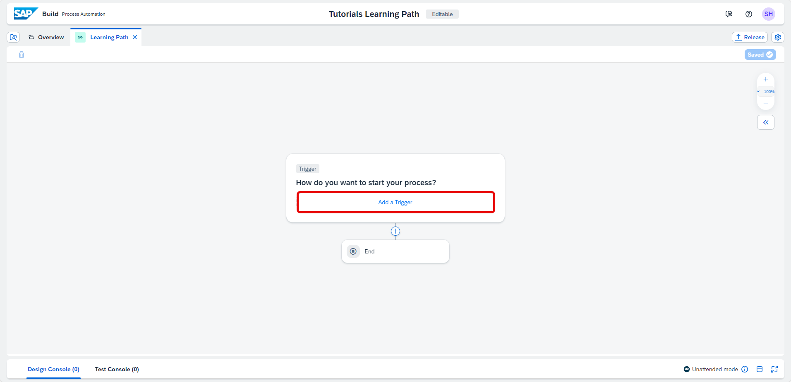

2. Choose **Submit a Form**.
   
    <!-- border -->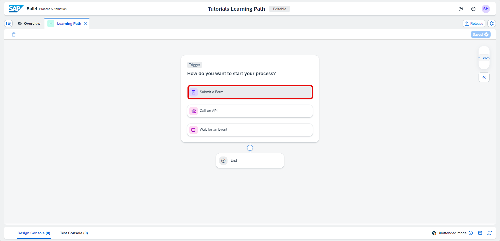

3. Choose **Blank form**.

    <!-- border -->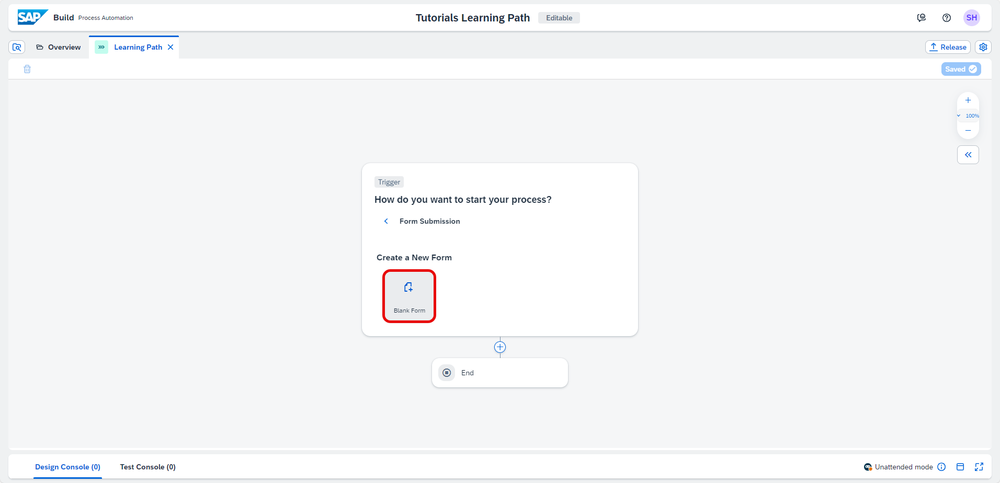

4. In the **Create Form** pop-up window, enter:
    - **Name**: Registration Form.
    - A description to describe the task of the form.
    - Choose **Create**.

    <!-- border -->

5. Choose the three dots and select **Open Editor**.

    <!-- border -->

6. Now, you will edit the form by using the available layout and input field options. Start by dragging and dropping the form layout fields, then enter the given names and field settings as shown in the example below:

    |  **Form Fields**    | **Field Settings with Label**
    |  :------------------| :------------------------------------------------------------------------------------------------------------------------
    |  Headline 1         | Welcome to your SAP Build Process Automation online training
    |  Paragraph          | This training has been designed to assist you in completing specific courses that are necessary for your job. It contains links to online training tutorials that will guide you through the different steps of the automation process using SAP Build Process Automation. We hope that this training will be useful for you in understanding the benefits of SAP Build Process Automation and how to use it to improve the efficiency of our company.
    
    <!-- border -->

7. Customize the **Submit** button.

    > To configure the form buttons, you can follow the tutorial [Customize the Titles of Buttons in Forms](https://developers.sap.com/tutorials/spa-customize-title-button-form.html). 
    
    For example, here the button of the trigger form has been set to **Start**.

    <!-- border -->

8. Save the form using the **Save** button on the top-right corner of the screen.

### Create the first mission form

1. Go to your **Learning Path** process. Select **+** next to the Trigger.

    <!-- border -->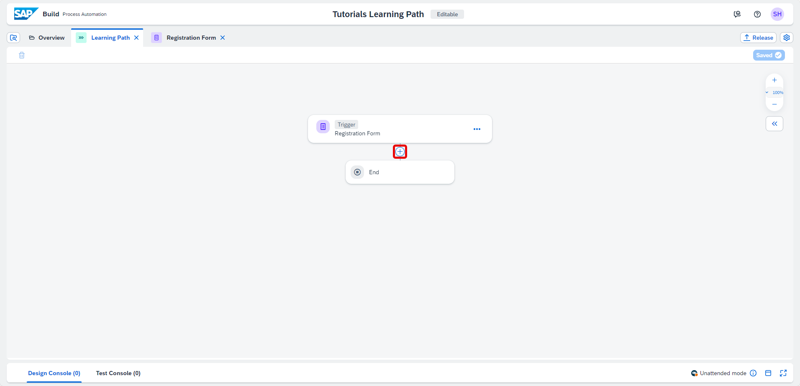

2. Choose **Form**.

    <!-- border -->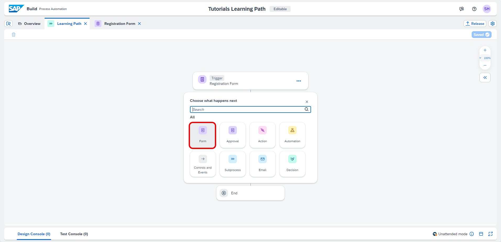

3. Choose **Blank Form**.

    <!-- border -->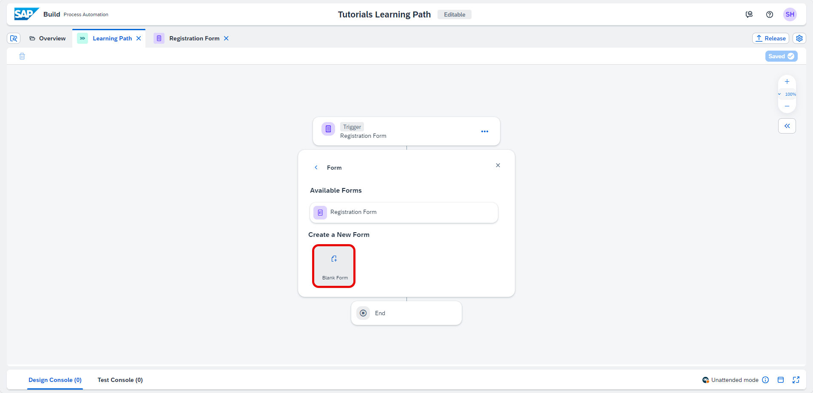

4. In the pop-up window for **Create form**: 
    - Enter the name of your mission: **Build Your First Business Process**.
    - Enter a description to describe the task of the form.
    - Choose **Create**.

    <!-- border -->

5. A new form is added to the process. Choose **Open Editor**. 

    <!-- border -->

6. Design the **Build Your First Business Process** form in the form builder by dragging-and-dropping fields into the form editor and configuring respective field settings, as shown in the example below:

    |  **Form Fields**    | **Field Settings with Label** | **Configuration**
    |  :------------- | :------------- | :------------
    | Headline 1 | First Mission: Build your First Business Process | X
    | Headline 2 | Time:  1 hr. 15 min | X
    | Paragraph  | *Enter the description of your mission here*. | X
    | Checkbox    | I have completed the first mission! | Required

    For the purpose of this tutorial, you may use as a description: 

    In this training, you will learn how to use SAP Build Process Automation's intuitive low-code and no-code capabilities to create, develop, deploy, and run your first business process. You will discover how this tool can help you build the apps you need at the speed demanded by your business, using visual drag-and-drop tools for application development. 
    
    You will also learn: 
    
     - How to enable SAP Build Process Automation in SAP BTP Free Tier account.                                                                               
     - How to create interactive forms that can be used as triggers for processes or as approval steps within a business process.

    <!-- border -->

7.  Now insert a **Link** field before the **Checkbox** field and configure the field settings. For example, in this tutorial, you will link the form to the **Build Your First Business Process with SAP Build Process Automation** mission.

    |  :------------- | :------------- 
    | Link | <https://developers.sap.com/mission.sap-process-automation.html>
    | Link Text | Start First Mission

    <!-- border -->

    > You can choose any link and put it here, depending on your project.

8. Customize the **Submit** button.

    > To configure the form buttons, you can follow the tutorial [Customize the Titles of Buttons in Forms](https://developers.sap.com/tutorials/spa-customize-title-button-form.html). 
    
    Here, the button has been set to **Next**.

    <!-- border -->

9. **Save** the form.

### Configure the first mission form

1. Go back to the process builder to map the process content with the form input fields. Select the **Build Your First Business Process** form.

2. Configure the **General** information section:
    - In the **Subject** section, enter **First Learning Mission**.
    - In the **Recipients** section, under **Users**, select **Process Started By** from Process Metadata.

    <!-- border -->

    > The subject configuration will be displayed when the form appears as a task in the recipient's `MyInbox`.
    
3. In the **Due Date** section:
    - Select **Static Duration** as **type of due date**.
    - Enter **3 Days** as the duration.

    <!-- border -->

4. **Save** the process.

### Create the second mission form

1. To add the second mission form to the process, select **+** next to the **Build Your First Business Process** form. 
   
    <!-- border -->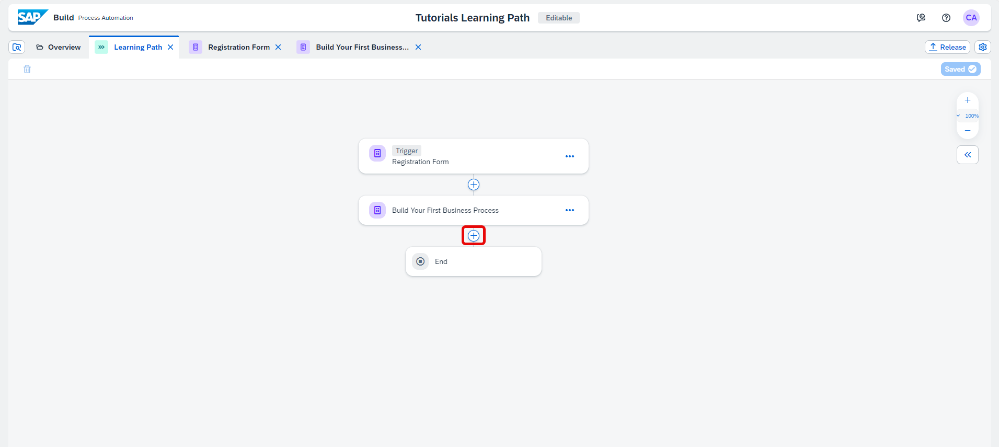

2. Choose **Form**. 

    <!-- border -->

3. Choose **Blank Form**.

    <!-- border -->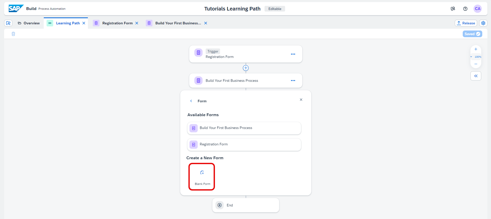

4. In the **Create Form** dialog box, do the following.  
    - Enter the name of your mission: **Boost Your Business Process with Automation**.
    - Enter a description to describe the task of the form.
    - Choose **Create**.
 
    <!-- border -->

5. Choose the three dots of the new form and select **Open Editor**. 

    <!-- border -->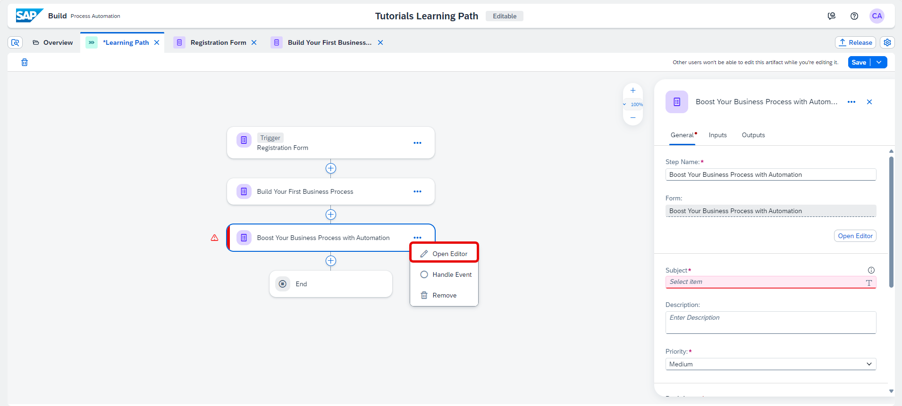

6. Design the **Boost Your Business Process with Automation** form in the form builder.

    |  **Form Fields**    | **Field Settings with Label** | **Configuration**
    |  :------------- | :-------------  | :------------
    | Headline 1 | Second Mission: Boost your Business Process with Automation, Decision and Process Visibility | X
    | Headline 2 | Time:  2 hr. 5 min | X
    | Paragraph  | *Enter the description of your second mission here*. | X
    | Checkbox    | I have completed the second mission! | Required

    
    For the purpose of this tutorial, you may use as a description: 

    In this training, you will learn how to automate repetitive processes by integrating decision logic with business rules and configuring SAP Process Visibility. You will go through several stages of learning, which include:  

     - Creating an automation to extract and read sales order details from an Excel file "25min"                                                                                 
     - Creating a decision to determine authorized approvers. "20 min"                     
     - Creating a visibility scenario for your business process. "15 min"                  
     - Configuring SAP Build Work Zone, standard edition for the visibility scenario. "30min"                                                                                      
     - Configuring a form trigger in the SAP Business Site to run a business process. "35min"

    <!-- border -->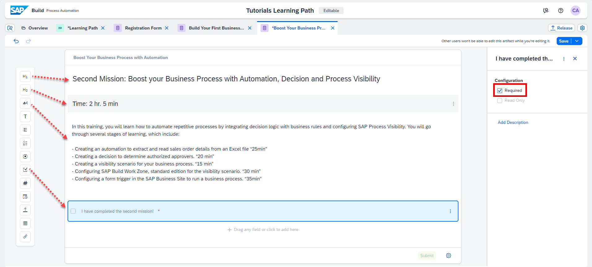

7.  Now insert a **Link** field before the **Checkbox** field and configure the field settings. For example, in this tutorial, you will link the form to the **Boost your Business Process with Automation, Decision and Process Visibility** mission.

    |  :------------- | :-------------
    | Link | <https://developers.sap.com/mission.sap-process-automation-boost.html>
    | Link Text | Start Second Mission 

    <!-- border -->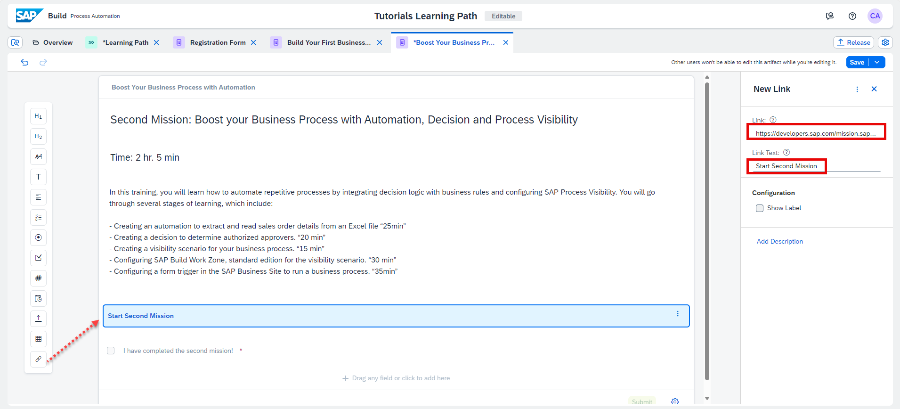

8. Customize the **Submit** button.

    > To configure the form buttons, you can follow the tutorial [Customize the Titles of Buttons in Forms](https://developers.sap.com/tutorials/spa-customize-title-button-form.html). 
    
    Similarly, here for the second mission, the button has been set to **Next**.

    <!-- border -->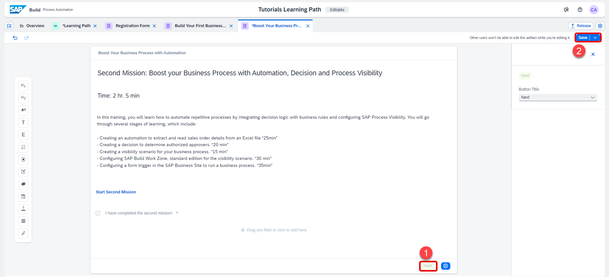

8. **Save** the form.

### Configure the second mission form

1. Go back to the process builder to map the process content with the form input fields. Select the **Boost Your Business Process with Automation** form.

2. Configure the **General** information section:
    - In the **Subject** section, enter **Second Learning Mission**.
    - In the **Recipients** section, under **Users**, select **Process Started By** from Process Metadata.
  
    <!-- border -->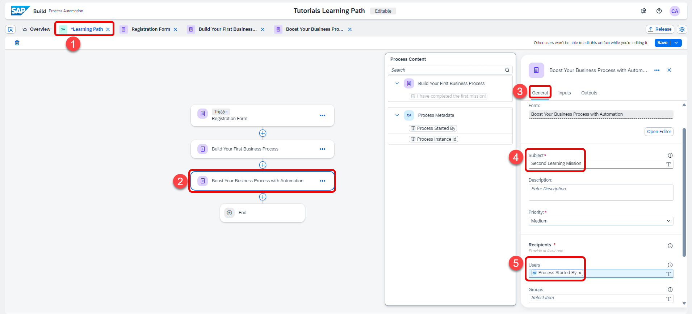

3. In the **Due Date** section:
    - Select **Static Duration** as **type of due date**.
    - Enter **3 Days** as the duration.

    <!-- border -->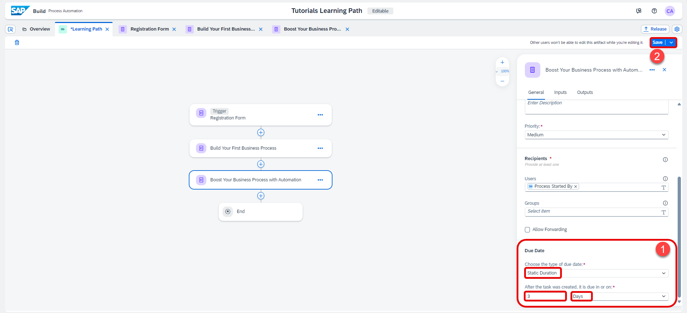

4. **Save** the process.

### Create the third mission form

1. Similarly, select **+** next to the **Boost Your Business Process with Automation** form. 

    <!-- border -->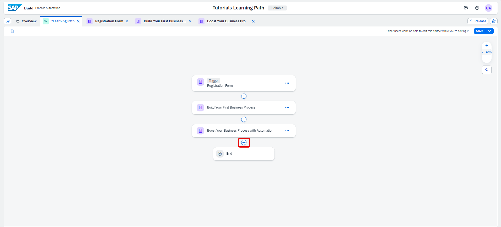

2. Choose **Form**.
   
    <!-- border -->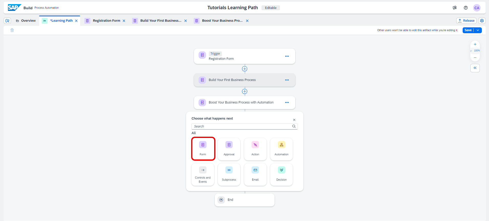
   
3. Choose **Blank Form**.

    <!-- border -->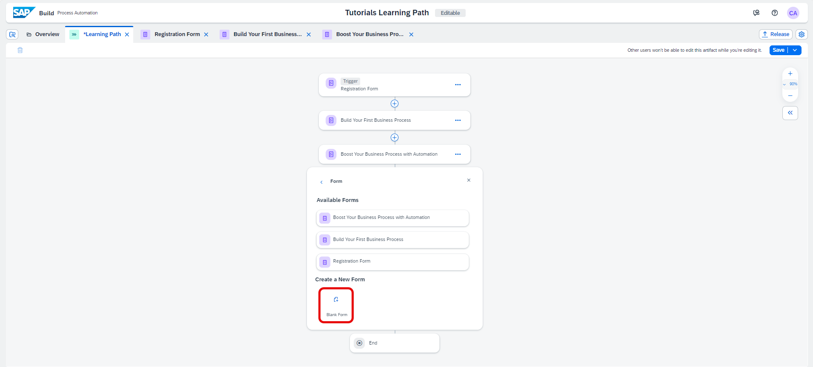

4. In the **Create Form** dialog box, do the following: 
    - Enter the name of your mission: **Create Tables in the Form**.
    - Enter a description to describe the task of the form.
    - Choose **Create**.

    <!-- border -->

5. Choose the three dots of the new form and select **Open Editor**. 

    <!-- border -->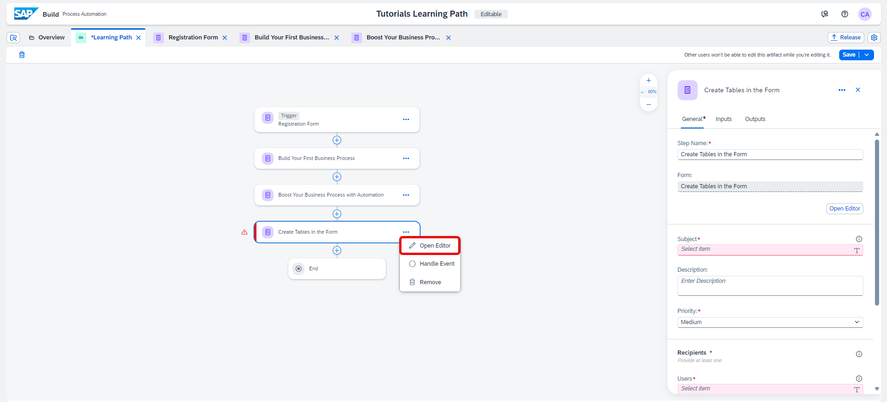

6. Design the **Create Tables in the Form** form in the form builder.

    |  **Form Fields**    | **Field Settings with Label** | Configuration
    |  :------------- | :------------- | :-----------
    | Headline 1 | Third Mission: Create Tables in the Form | X
    | Headline 2 | Time:  25 min | X
    | Paragraph  | *Enter the description of your third mission here*. | X
    | Checkbox    | I have completed the third mission! | Required
      
    For the purpose of this tutorial, you may use as a description:

    In this training, you will learn how to create a table in a form, validate the order details extracted from the automation, and display any error details in the table.

    <!-- border -->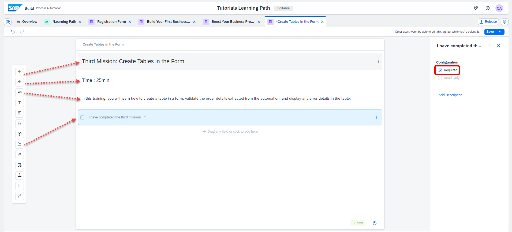

7. Similarly insert a **Link** field before the **Checkbox** field and configure the field settings. For example, in this tutorial, you will link the form to the **Create Tables in the Form** tutorial.

    |  :------------- | :-------------
    | Link | <https://developers.sap.com/tutorials/spa-forms-table.html>
    | Link Text | Start Third Mission

    <!-- border -->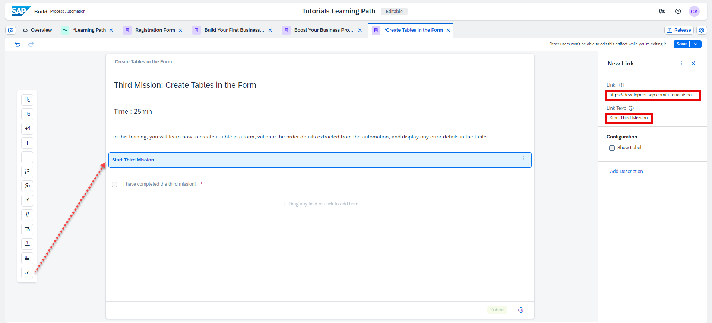

8. Customize the **Submit** button.
   
    > To configure the form buttons, you can follow the tutorial [Customize the Titles of Buttons in Forms](https://developers.sap.com/tutorials/spa-customize-title-button-form.html). 
    
    Here for the last mission, the button has been set to **Done**.

    <!-- border -->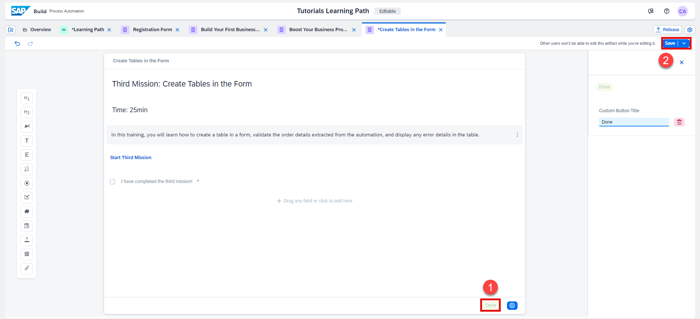

9.  **Save** the form.

### Configure the third mission form

1. Go back to the process builder to map the process content with the form input fields. Select the **Create Tables in the Form** form.

2. Configure the **General** information section:
    - In the **Subject** section, enter **Third Learning Mission**.
    - In the **Recipients** section, under **Users**, select **Process Started By** from Process Metadata.

    <!-- border -->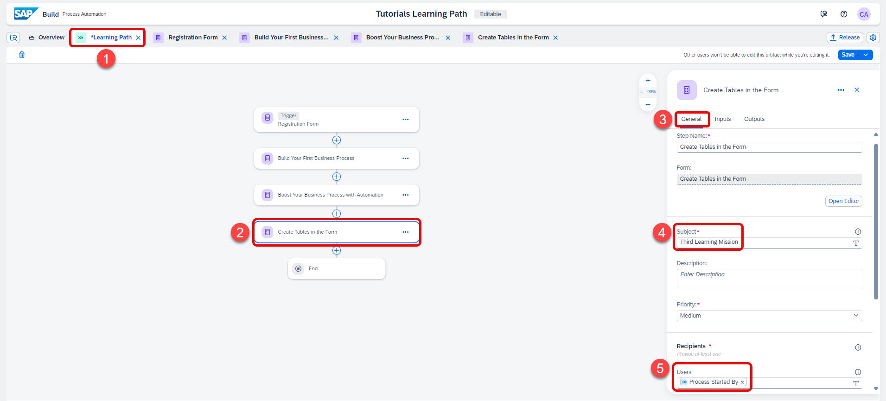

3. In the **Due Date** section:
    - Select **Static Duration** as **type of due date**.
    - Enter **3 Days** as the duration.

    <!-- border -->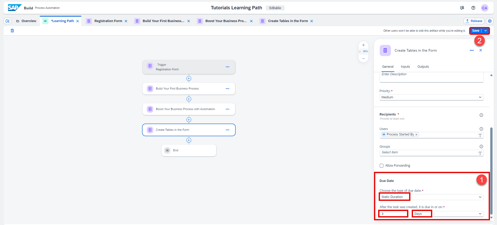

4. **Save** the process.

### Release and deploy
    
   - Please refer to step 1 and 2 of the tutorial on how to release and deploy a process [Run the Business Process](https://developers.sap.com/tutorials/spa-run-process.html). 

### Test the process 

1. Open the process builder of the deployed version and choose **Registration Form**, select the **Copy Link** icon next to **Form Link**.

    <!-- border -->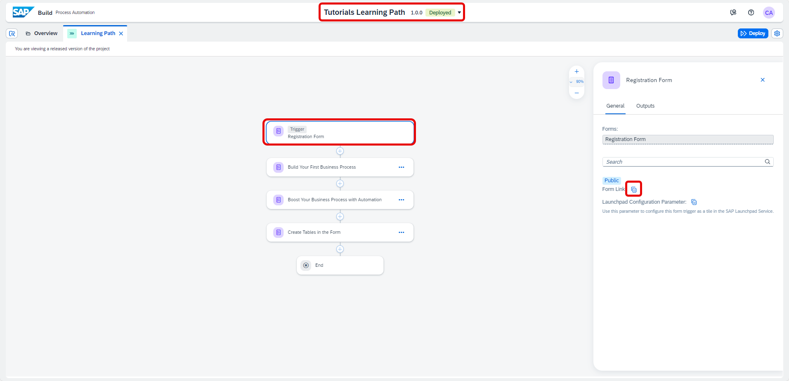

2. When you open the form in the browser, you will have the course presentation fields that you defined in the process trigger form. Click on **Start**.    

    <!-- border -->

3. In the **SAP Build** lobby, choose **My Inbox** icon.

    <!-- border -->

4. You will see the first task **First Learning Mission** appear in the My Inbox application that ships with SAP Build. The task will have the description of the training to be followed and the link to the tutorial. After finishing the mission, click on **Next**.

    <!-- border -->

5. Refresh the inbox again to get the second notification for the second mission. Now you can see task **Second Learning Mission** appear in My Inbox. After finishing the mission, click on **Next**.

    <!-- border -->

6. Similarly, refresh the inbox again to get the third mission. Once the mission is completed, click on **Done**.

    <!-- border -->