# Use List as an Input/Output for Decision Artifact in SAP Build Process Automation
 
<!-- description --> Use a list as an input to your decision artifact, process the data and extract the details to a table in a form

## Prerequisites
  - Either complete the tutorial [Create Tables in the Form](spa-forms-table) **OR**
  - Retrieve the sample project **Sales Order Management (MI05)** from the store
  - Setup the desktop agent to run automation as explained in [this tutorial](spa-run-agent-settings).
  - Download the [Orders.xlsx](https://github.com/sap-tutorials/sap-build-process-automation/blob/main/tutorials/spa-add-list-input-decision/Orders.xlsx) in your local machine. 

## You will learn
  - How to use a list as an input/output to your decision.
  - How to use reusable text rules. 
  - How to bind list in decision to table in form.

## Intro

In this tutorial, you will automate the process where the sales executive is notified about the erroneous or error-free orders through a task in the inbox of SAP Build Process Automation.

The process is designed to have the following artifacts:

- A form where the sales executive would provide the path of sales order excel maintained in his system.
- Automation to read the sales order details.
- Decision artifact to process the details of a list of orders extracted from excel. Based on the rules created in the decision, it would determine whether the order details are error-prone or error-free.
- Notification form to the sales executive which displays the erroneous or error-free sales orders in a table format.

The process looks as below:

   <!-- border -->

---

### Create a new process 

After completing the prerequisites, you will create a new process.

1. Navigate to the **Overview** tab, from the editable version of your project, click the **Create** dropdown and choose **Process**.

    <!-- border -->

2. In the **Create Process** dialog box, do the following:

    - Enter a **Process Name** such as Order Processing Error Table
    - Choose **Create**

    <!-- border -->

    Your new process opens in the process builder. You will now create a trigger form that will start the process. 

3. Choose **Add a Trigger**.
   
    <!-- border -->

4. Select **Submit a Form**.

    <!-- border -->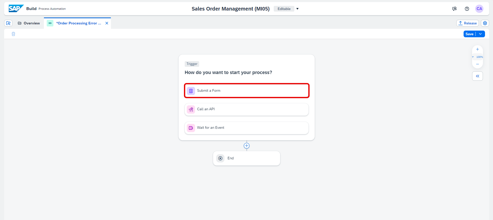

5. Choose **Blank Form**.

    <!-- border -->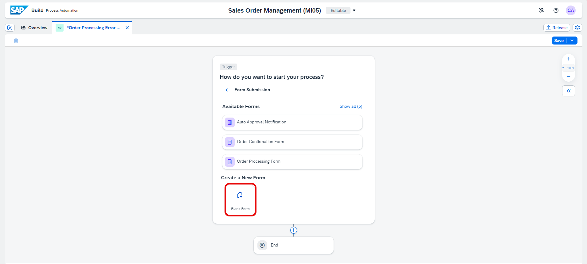

6. In the **Create Form** dialog box, do the following:

    - Enter a **Form Name** such as Order File Path Form
    - Choose **Create**

    <!-- border -->

7. Choose the three dots and select **Open Editor**.

    <!-- border -->

8. Now, you will edit the form by using the available layout and input field options. Start by dragging and dropping the form layout fields, then enter the given names and field settings as shown in the example below:

    |  **Form Fields**    | **Field Settings with Label**
    |  :------------- | :-------------
    |  Headline 1         | Order File Path Form
    |  Paragraph          | Please provide the full file path for the Excel file and submit. 
    |  Text               | File Path

9. For the input label **Text** select the **Required** checkbox, and **Save**. 

    <!-- border -->

### Create a new automation

1. Navigate to the **Overview** tab, from the editable version of your project, search for **Get Order Details** automation. Choose the three dots and select **Duplicate**.

    <!-- border -->

2. In the **Duplicate Artifact** dialog box, enter an **Automation Name** such as Get Order Details For Error.

    <!-- border -->

    Your new automation opens in the automation editor.

3. Now, select all activities from **Create Sales Order variable** to **End** as shown in the image below, pressing Ctrl and selecting the requested activities.

    <!-- border -->

4. Right-click and select **Delete** from the context menu.
   
    <!-- border -->

5. In the **Automation Details** section on the right, select **Input/Output**, and in the inputs section rename `OrderNumber` to `FilePath`. In the output parameter section rename `SelectedOrder` to `SalesOrderDetails` and select **List**.

    <!-- border -->

6. Select **Excel Cloud Link**, in the details on the right side, choose the **Edit Activity** button.

    <!-- border -->

7. In the Workbook Path field, select `FilePath`.

    <!-- border -->

8. Select **End**, in the configuration screen on the right, under the Output Parameters, in the `SalesOrderDetails` field enter ` Orders`.

    <!-- border -->

9.  **Save** your automation.

10. Navigate to **Order Processing Error Table** process. 
    
11. Choose **+** below the **Trigger** form.

    <!-- border -->

12. Select **Automation**.

    <!-- border -->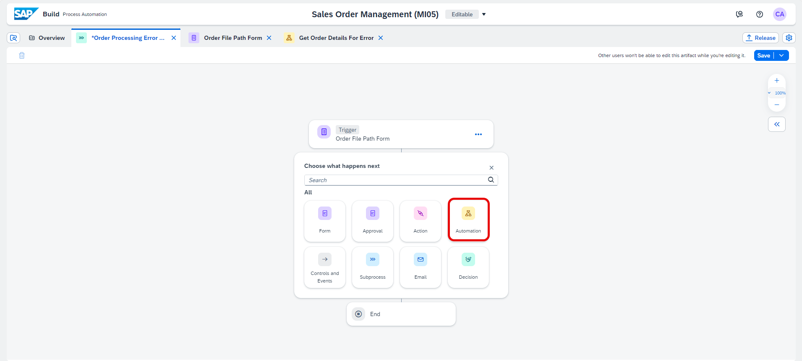

13. Choose **Get Order Details For Error** automation from **Available Automations**.

    <!-- border -->

14. Map the input parameter `FilePath` of the automation with the **File Path** of Order File Path Trigger Form.

    <!-- border -->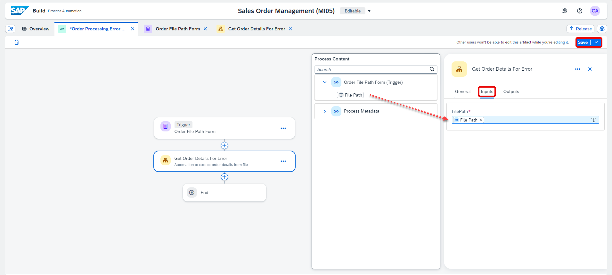

15. **Save** your process.

### Create data types

1. Go back to the **Overview** tab, select **Error Output** data type.

    <!-- border -->

2. In the **Error Output** data type screen, choose **New Field** to add a new attribute to the data object.

    <!-- border -->

3. In the Field Details section on the right, in the **Name** field enter **Order Number**. Keep the type as **String**.

    <!-- border -->

4. **Save** your work.
   

### Update the Order Validity Check decision

Since you have updated the **Error Output** data type with a new field **Order Number**, you will have to update the decision table to take into account this change.

1. Navigate back to the **Overview** tab.
   
2. Choose **Order Validity Check** decision.
   
    <!-- border -->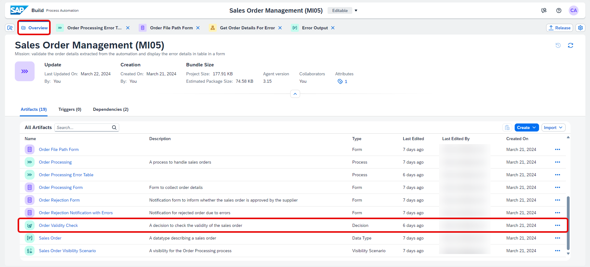

3. Select **Rules** and choose **Error Check**.

    <!-- border -->

4. Select the pencil icon on the top right to re-configure the rule.

    <!-- border -->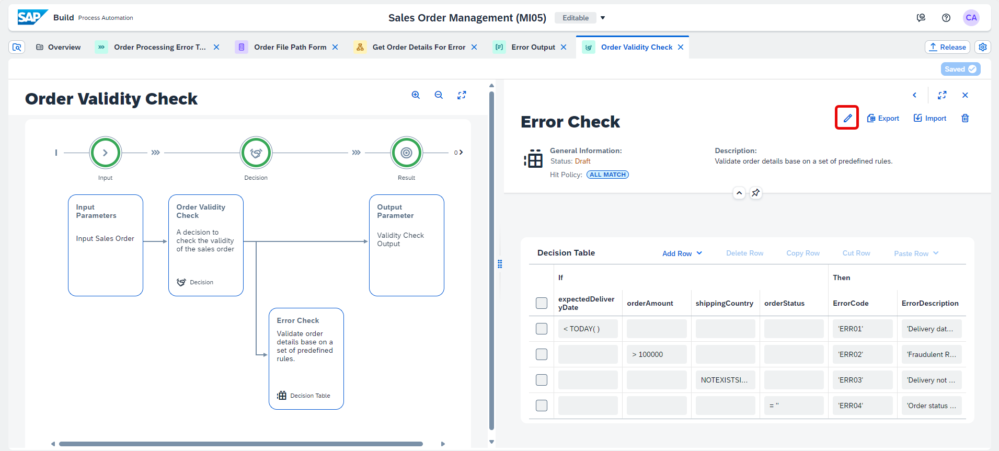

5. Choose **Next Step** until **Configure Result** section.

    <!-- border -->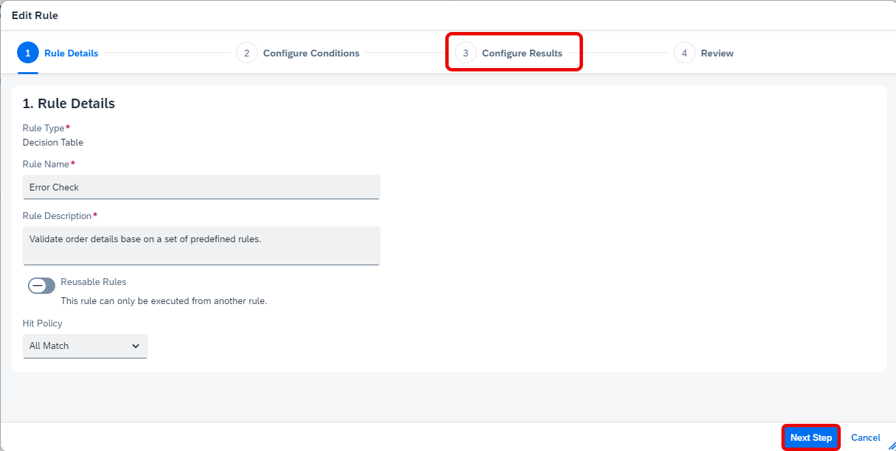

6. In the **Configure Results** section, click on **Validity Check Output** to update the outputs to add `OrderNumber`.
   
7. Choose **Next Step**.
   
    <!-- border -->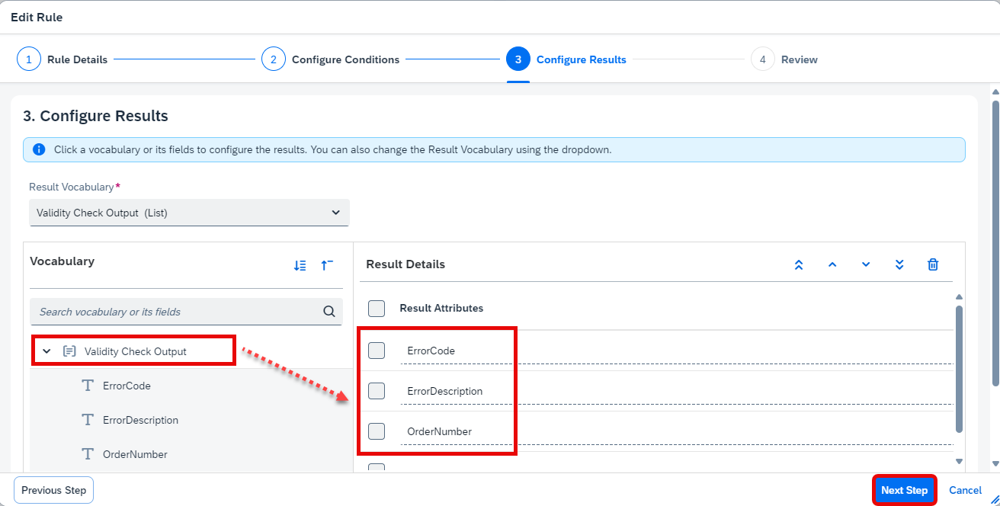

8. Choose **finish** to update the decision table.

    <!-- border -->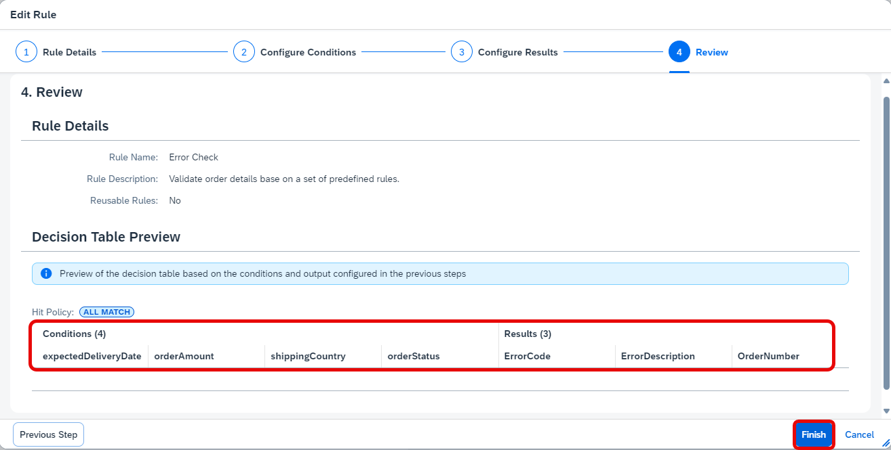

9. Choose **Save** and close the window.

    <!-- border -->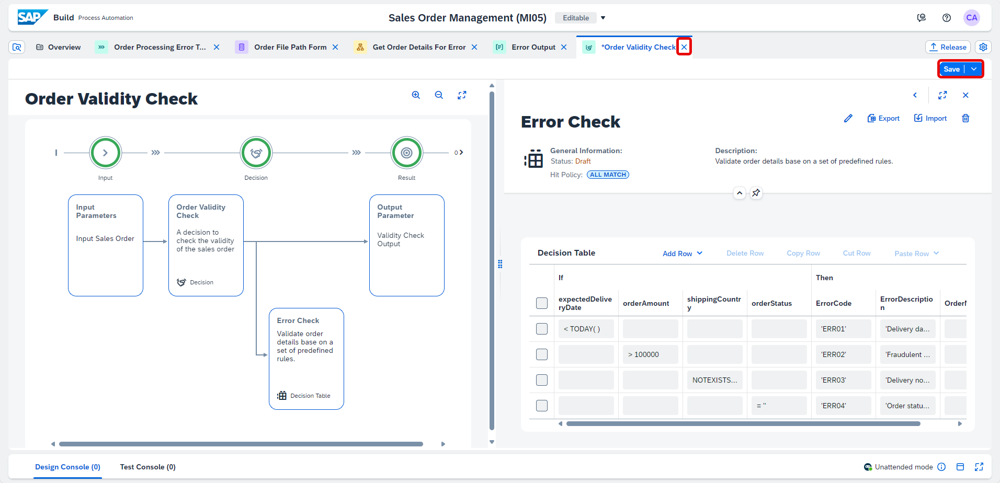

### Create a new decision

1. Navigate to the **Order Processing Error Table** process. Choose **+** below the automation.

    <!-- border -->

2. Select **Decision**.
   
    <!-- border -->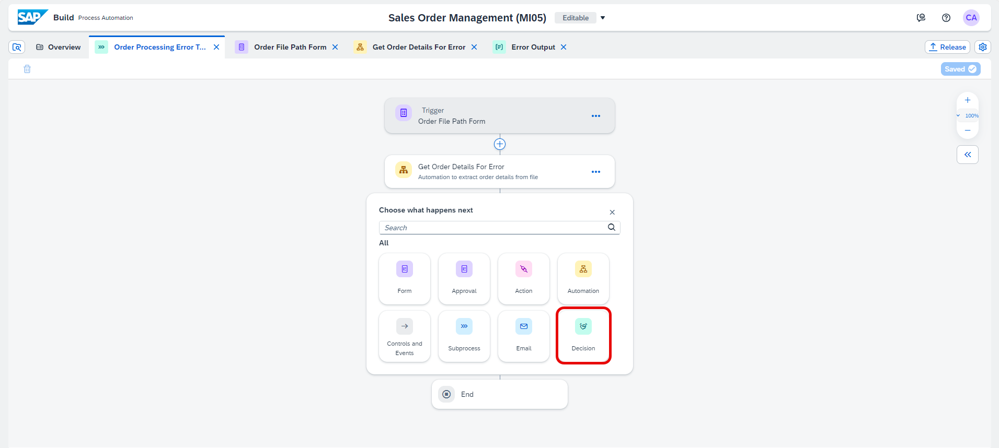

3. Choose **Blank Decision**.

    <!-- border -->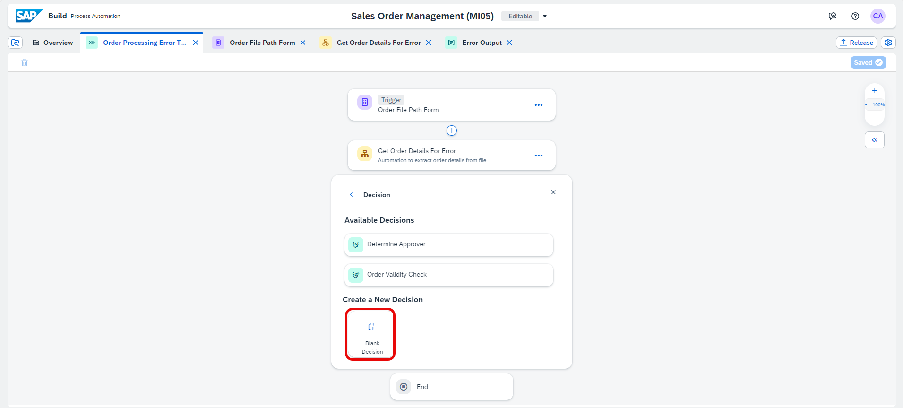

4. In the **Create Decision** window, enter a **Decision Name** such as **Order Error Checking** and choose **Create** button.

    <!-- border -->

    The decision editor will open where you can start modeling the decision. 
   
    <!-- border -->

### Configure input/output of decision

You will select **Add Input Parameter** button and **Add Output Parameter** button to configure input and output parameters.

<!-- border -->

1. Configure Input Parameter:

    - In Name enter: **Order List Input**
    - In Description enter: **Order List Input**
    - In Type choose: **Sales Order**, and select **List**

    <!-- border -->

2. Configure Output Parameter:

    - In Name enter: **Order Error List**
    - In Description enter: **Order Error List**
    - In Type choose: **Error Output** and select **List**

    <!-- border -->

3. **Save** your decision.

### Configure variables of decision

1. Now, you will add intermediate variables that you will use to store the results of the rules. Select **Variables** and choose **Add Variable**.

    <!-- border -->

2. In the Decision Variable window:
    
    - In the Name enter **Order Input**
    - In the Description enter **Intermediate variable to store Order Details**
    - Under Type select **Sales Order**
    - Choose **Save**

    <!-- border -->

    > Here, you will use an intermediate variable to store the inputs, which can be utilized later in reusable text rules, thus avoiding overwriting the original inputs.

3. Similarly, for the second variable select **Add Variable**.

    <!-- border -->

4. In the **Decision Variable** window:
    
    - In the Name enter **Error Output**
    - In the Description enter **Intermediate variable to store the error details of the Orders**
    - Under Type select **Error Output**
    - Choose **Save**

    <!-- border -->

    > This intermediate variable will serve to temporarily store the outputs of the text rules for each error test, without overwriting the results of the initial tests. Additionally, it allows appending the result of each test to the variable, preserving the information from previous tests.

5. **Save** your decision.

    <!-- border -->

### Configure text rules of decision

1. Now, you are going to add reusable text rules, which are validation or error detection rules. Therefore, you will create a reusable rule for each error search in the command. Select **Rules** and choose **Add Rule**.

    <!-- border -->

2. The first text rule you will create is a test for the delivery date of the order. In the **Create Rule** window: 

    - In the Rule Type select **Text Rule**
    - In the Rule Name enter **Date Error test**
    - In the Rule Description enter **check order delivery date**
    - Active **Reusable Rule**
    - Choose **Next Step** button

    <!-- border -->

3. Configure the output or result of the decision table. Under **Result Vocabulary**:

    - Select **Error Output** data type
    - In the Vocabulary section choose **Error Output** to add the Result Attributes
    - Choose **Next Step** button
  
    <!-- border -->

4. Review and choose **Create** button to create the rule.

    <!-- border -->

5. In the newly created **Text Rule**, add values to condition and result columns:

    - in the If condition: Order Input.expectedDeliveryDate < TODAY( )  
    - In `OrderNumber` enter : Order Input.orderNumber 
    - In `ErrorDescription` enter : 'Delivery date is before current date' 
    - In `ErrorCode` enter : 'ERR01'

    > Do not copy and paste the values, use the suggestions pop up (Ctrl+Space) as shown in the picture below. When entering the error code and its description, please remember to put two singles quotes first and then type the code and description inside them.

    <!-- border -->

    Once you have successfully entered the values, your rule looks as below.

6. **Save** your work.

    <!-- border -->

7. Go back to **Rules**, click on **Back Button**.

    <!-- border -->

8. Click on the three dots next to **Date Error Test** rule and choose **Duplicate**.

    <!-- border -->

9. The second text rule you will create is a test for the order amount. In the Duplicate Rule window: 

    - In the Rule Name enter **Order Amount Error test**
    - In the Rule Description enter **Test the order amount**
    - Choose **OK** button

    <!-- border -->

10. Click on the **Order Amount Error test** rule.

    <!-- border -->

11. In the newly created **Text Rule**, change the values to condition and result columns:

    - in the If condition: Order Input.orderAmount > 100000 
    - In `OrderNumber` enter : Order Input.orderNumber 
    - In `ErrorDescription` enter : 'Fraudulent Request'  
    - In `ErrorCode` enter : 'ERR02'

    <!-- border -->

12. **Save** your rule.

13. Go back to **Rules**, click on **Back Button**.

    <!-- border --> 

14. Now, you will create three more text rules to perform three additional tests. To do this, repeat the same steps: click on the three dots next to text rule and select **Duplicate** to create the three new text rules.

    <!-- border --> 

15. The third text rule you will create is a test for shipping country. So similarly **Duplicate** a new text rule and in the Duplicate Rule window: 

    - In the Rule Name enter **Shipping Country Error Test**
    - In the Rule Description enter **check the Shipping Country**
    - Choose **OK** button

    <!-- border -->

16. Click on the newly created **Text Rule** and change values to condition and result columns:

    - in the If condition: Order Input.shippingCountry NOTEXISTSIN [ 'India' , 'United Kingdom' ]  
    - In `OrderNumber` enter : Order Input.orderNumber 
    - In `ErrorDescription` enter : 'Delivery not supported in this country'   
    - In `ErrorCode` enter : 'ERR03'
    - **Save** your rule and click on **Back Button**.

    <!-- border -->

17. The same goes for the fourth text rule, what you will create is a test for the order status. **Duplicate** a new text rule and in the Duplicate Rule window: 

    - In the Rule Name enter **Order Status Error Test**
    - In the Rule Description enter **test order status**
    - Choose **OK** button

    <!-- border -->

18. Click on the newly created **Text Rule**, change values to condition and result columns:

    - in the If condition: Order Input.orderStatus = '' 
    - In `OrderNumber` enter : Order Input.orderNumber 
    - In `ErrorDescription` enter : 'Order status is not set'   
    - In `ErrorCode` enter : 'ERR04'
    - **Save** your rule and click on **Back Button**.

    <!-- border -->

19. Similarly for the final text rule, you will verify if the order has no errors. In the **Duplicate Rule** window: 

    - In the Rule Name enter **No Error Test**
    - In the Rule Description enter **test if the order has no errors**
    - Choose **OK** button

    <!-- border --> 

20. Click on the newly created **Text Rule**, change values to condition and result columns:

    - in the If condition: Order Input.expectedDeliveryDate >= TODAY( ) AND Order Input.orderAmount < 1000000 AND Order Input.shippingCountry EXISTSIN [ 'India' , 'United Kingdom' ] AND Order Input.orderStatus != '' 
    - In `OrderNumber` enter : Order Input.orderNumber 
    - In `ErrorDescription` enter : 'No Error'   
    - **Save** your rule and click on **Back Button**.

    <!-- border -->

### Configure main rule of decision

    Now, you will create a rule that will execute and utilize all the reusable text rules you created before in a loop for each order. The results will be sent to an error table stored in the previously created variable.

1. Go back to **Rules** and click on **Add Rule**.

    <!-- border -->

2. In the Create Rule window: 

    - In the Rule Type select **Text Rule**
    - In the Rule Name enter **Main Rule**
    - In the Rule Description enter **A rule that executes all error-testing rules in a loop for each order**
    - Choose **Next Step** button

    <!-- border -->

3. In the **Configure Results** step, under **Result Vocabulary** choose `No Result` and click on **Next Step** button.

    <!-- border -->

4. Review and choose **Create** button to create the rule.

    <!-- border -->

5. In the newly created **Text Rule**, in the **If** statement, assign `true` to represent the absence of any specific condition.

    <!-- border -->

6. In the **Then** statement, press **Ctrl+Space** on your keyboard and select **Loop Functions**.

    <!-- border -->

7. A window for configuring loop functions opens. Configure the function as follows: 

    - In the Vocabulary select `Order_List_Input`.
    - In the Current Item select **Order Input**. 
    - In the Expression statement enter: APPEND (Order Error List, Date Error test)

8. Click on **Apply**.

    <!-- border --> 

    > With this function, you iterate through each element, which represents each order, and perform the delivery date test. Then, it appends the test output to the **Order Error List**.  So, the objective is to repeat the same process for each reusable text error rule that you have previously created and gradually add the collected errors for each order to the **Order Error List**.

9. Click on the **Then** expression.

    <!-- border -->
    
10. In the **Configure Loop Functions** window, select **+** to add a new expression box and enter : APPEND (Order Error List, Order Amount Error Error test)

    <!-- border -->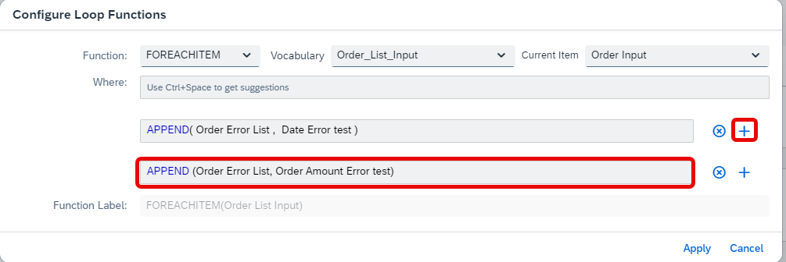

11. Similarly, add three more expression box and enter the following in each box: 

    - First box: APPEND (Order Error List, Shipping Country Error Test)
    - Second box: APPEND (Order Error List, Order Status Error Test)
    - Third box: APPEND (Order Error List, No Error Test)
    - Choose **Apply** button.

    <!-- border -->

    > So, here you will iterate through all the reusable text error rules that you have created earlier, one by one, for each order. The result obtained from each rule, whether there is an error or not, will be added to the **Order Error List** without overwriting the previous results. That is why you have used an intermediate variable.

12. **Save** your work. 
    
13. Navigate back.

    <!-- border -->

### Configure decision in process builder

1. Navigate to the **Order Processing Error Table** process, select **Order Error Checking** decision and do the following:
    
    - Choose **Inputs** tab, under the select list click on the `List - SalesOrderDetails` to bind the properties for `SalesOrderDetails` list.

    <!-- border -->

2. **Save** the process.
   

### Create order error table form

1. Go back to the **Overview** tab and under the **Artifacts**, search for **Order Rejection Notification with Errors** form. Choose the three dots and select **Duplicate**.

    <!-- border -->

2. In the **Duplicate Artifact** dialog box, enter a **Form Name** such as  **Order Error Table Form** and click on **Duplicate**.

    <!-- border -->

    Your new form opens in the form editor.

    <!-- border -->

3. Click on the three buttons next to **Customer Name** and next to **Order Number**, then choose **Delete** to remove them.

    <!-- border -->
    <!-- border -->

4. Now, change the **Headline** and the **Paragraph** following the table below..

    |  **Form Fields**    | **Field Settings with Label**
    |  :------------- | :-------------
    | Headline 1 | Order Error Summary Table
    | Paragraph  | The table below represents your processed order list with details of the errors found. 

    <!-- border -->

5. Modify the table to add a cell for the **Order Number**. Click on the **+** icon beside Error Output field and select **Text** and enter **Order Number** as field name.

    <!-- border -->
    <!-- border -->

6. Click on the three dots next to **Order Number** and choose **Move Left** to shift the cell to the left, and repeat the operation to move the cell all the way to the left of the table.

    <!-- border -->
    <!-- border -->

7. Finally, change the name of **Error Output** field to **Error Description**.

7. **Save** your form.

    <!-- border -->

8. Navigate to the **Order Processing Error Table** process.

9. Choose **+** below the decision.

    <!-- border -->
  
10. Select **Form**.
    
    <!-- border -->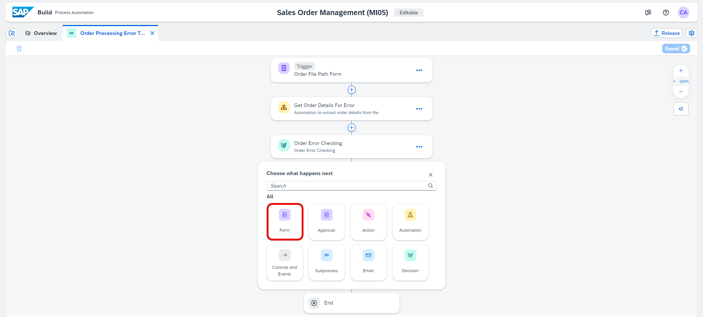

11. Choose **Order Error Table** from **Available Forms**.
   
    <!-- border -->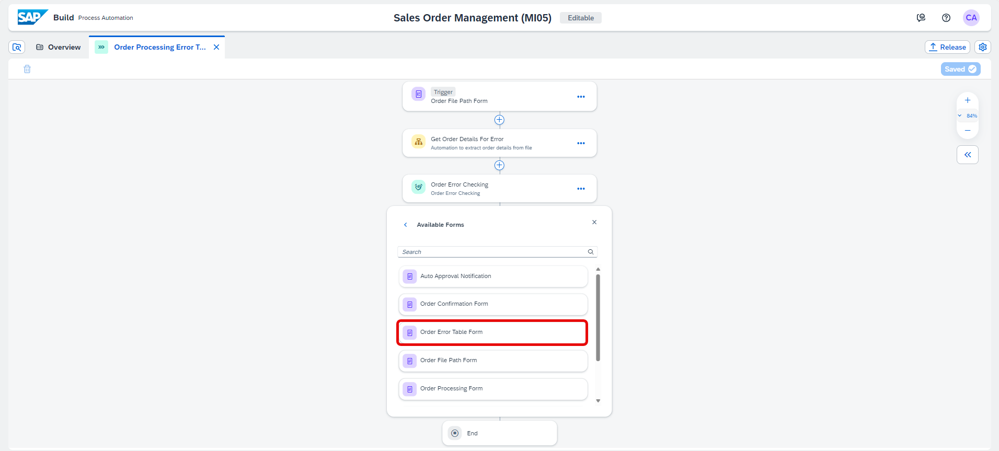

12. Configure the **General** information section:

    - In the **Subject** section, enter **Order Error**
    - In the **Recipients** section, under Users, select **Process Started By** from Process Metadata

    <!-- border -->

13. Now, configure the **Inputs** information section. In the select list field, choose `List - Order Error List`.

    <!-- border -->

14. **Save** the process.

    <!-- border -->

### Release and deploy

> **CAUTION:** Please complete the [following tutorial](spa-run-agent-settings), mentioned in Pre-requisites before you release and deploy the process.

1. In the **Order Processing Error Table** process, choose the **Release** button on the top right corner

    <!-- border -->

2. In the **Release Project** popup, select **Release**.

    <!-- border -->

3. In the **Overview** section that appears, choose **Deploy**.

    <!-- border -->

4. Select an **Environment** and choose **Deploy**.

    <!-- border -->

5. In the **Define Variables** section, choose **Deploy**. You will enter the `orderFilePath` as you would provide the path of excel in the trigger form which is explained in **Step 13: Test the process**.

    <!-- border -->

    Your project successfully deployed.

    <!-- border -->

    > **CAUTION:** Before executing the process, make sure your desktop agent is in unattended mode.

    <!-- border -->
  

### Test the process

1. Open the **Order Processing Error Table** process of the deployed version and choose **Order File Path Form**, select the **Copy Link** icon next to the **Form Link**.

    <!-- border -->

2. In a new tab in your browser, paste the form link and enter your file path and select **Submit**.

    <!-- border -->

    Once the form is submitted successfully, the BOT opens the **Sales Order Excel** file which is stored in your system, reads the data, and passes the data to the decision. The Business Rules are executed and the list of orders with/without errors are displayed in the tables in the form. You can follow the steps of execution in the **Monitoring** section.

3. Navigate back to **SAP Build** Lobby and select **Monitoring** tab. Then choose **Process and Workflow Instances** under **Monitor**.

    <!-- border -->

3. Now, select the **Order Processing Error Table** process. The process indicates that the **Order Error** task is available in **My Inbox**.

    <!-- border -->

4. In the **SAP Build** lobby, choose **My Inbox** icon.

    <!-- border -->

5. You will receive a notification with the error details in a table.
   
6. Choose **Submit** to complete the process.

    <!-- border -->

7. You can navigate back to **Monitoring > Process and Workflow Instances**.

    Your process completed successfully.

    <!-- border -->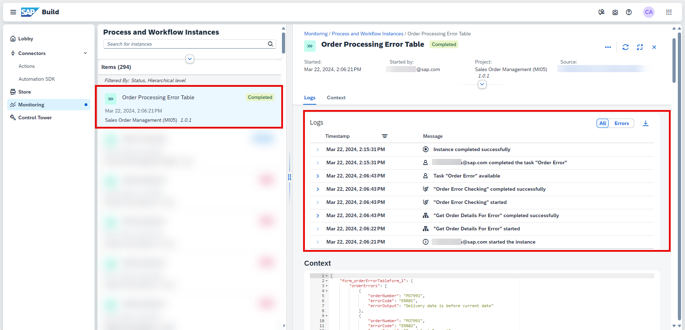

    Congratulations! You have successfully completed the tutorial. With this process, sales executive is notified of erroneous and error free orders.

