# Using a multi input in a decision.
 
<!-- description --> In this tutorial, you will learn how to use an input list in the form of a table within a decision to process the data from the table and extract various order errors found in the table.

## Prerequisites
  - Either complete the mission [Build Your First Business Process with SAP Build Process Automation](https://developers.sap.com/tutorials/spa-forms-table.html).
  - Acquire the necessary Sales Order Approval project in the store using this tutorial [Acquire a Template Project from the Store](https://developers.sap.com/tutorials/spa-acquire-businessprocess-store.html).

## You will learn
  - How to use a list of input in a decision.
  - How to use a reusabl text rules. 
  - How to bind List in Decision to Table in Form.

## Intro

In this tutorial, you will create a decision to process the details of a list of orders extracted from Excel. Whether the order details contain errors or not, they will be displayed in a table within a form.

---

### Create a new process 

After completing the prerequisites, you will create a new process.

1. Navigate to the **Overview** tab, from the editable version of your project, click the **Create** dropdown and choose **Process**.

    <!-- border -->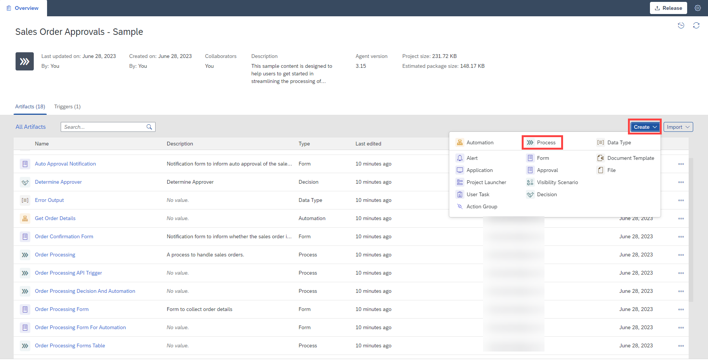

2. In the **Create Process** dialog box, do the following:

    - Enter a **Process Name** such as Order Processin Error Table.
    - Choose **Create**.

    <!-- border -->

    Your new process opens in the process builder. You will now create a trigger form that will start the process. 

3. Choose **+** in the **Trigger** settings, then select **Forms** and choose **New Form**.

    <!-- border -->

4. In the **Create Form** dialog box, do the following:

    - Enter a **Process Name** such as Order File Path Form.
    - Choose **Create**.

    <!-- border -->

5. Choose the three dots and select **Open Editor**.

    <!-- border -->

6. Now, you will edit the form by using the available layout and input field options. Start by dragging and dropping the form layout fields, then enter the given names and field settings as shown in the example below:

    |  **Form Fields**    | **Field Settings with Label**
    |  :------------- | :-------------
    |  Headline 1         | Order File Path Form
    |  Paragraph          | Please provide the full file path for the Excel file and submit. 
    |  Text               | File Path.

    <!-- border -->

  For the input label **Text** select the **Read Only** checkbox, and **Save**. 

<!-- border -->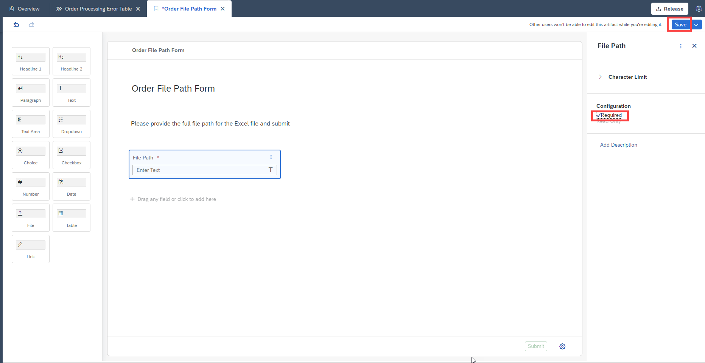

### Create a new automation

1. Navigate to the **Overview** tab, from the editable version of your project, search for **Get Order Automtion**. Choose the three dots and select **Duplicate**.

    <!-- border -->

2. In the **Duplicate Artifact** dialog box, enter a **Automation Name** such as Get Order Details For Error.

    <!-- border -->

   Your new automation opens in the process builder.

3. Now, Select all activities from **Create Sales Order** to **End** as shown in the photo below. Right-click and select **Delete** from the context menu.

    <!-- border -->
    <!-- border -->

4. In the Automation Details section on the right, select **Input/Output** and change the inputs to **FilePath**.

    <!-- border -->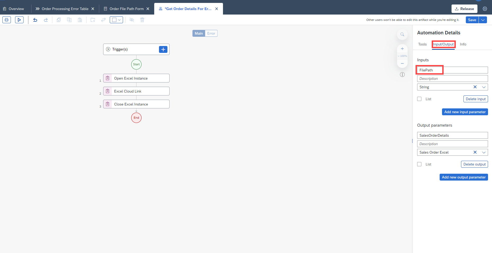

5. Select **End**, in the configuration screen on the right, under the Output Parameter, in the `SelectedOrderDetails` field enter ` Orders`.

    <!-- border -->

6. Select **Order Processing Error Table** Process. Choose **+**, Select **Automation** and choose **Get Order Details For Error**.

    <!-- border -->

7. Choose **Get Order Details For Error** automation in the process and map the input parameter `FilePath` of the automation with the **File Path** of Order File Path Form.

    <!-- border -->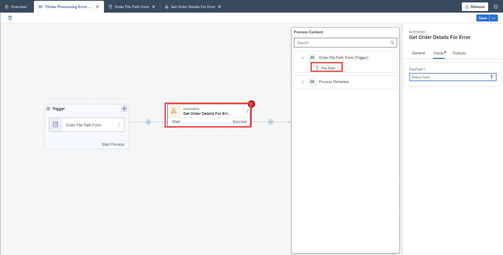

8. Select the three dots next to **Get Order Details For Error** automation, choose **Open Editor**.

9. Select Excel Cloud Link, in the details on the right side, choose the **Edit activity** button.

    <!-- border -->

10. In the Workbook Path field enter the Environment Variable as `FilePath`.

    <!-- border -->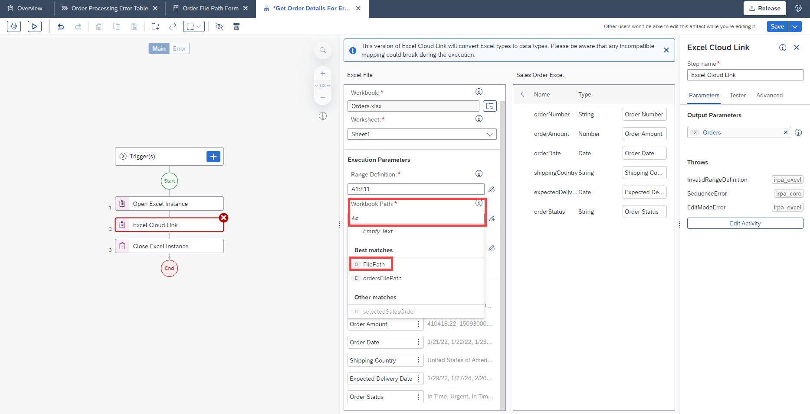

### Create a new decision

1. Navigate to the **Order Processing Error Table** process. Choose **+**, Select **Decision** then **New Decision**.

    <!-- border -->

2. In the Create Decision window, enter a **Decision Name** such as **Order Error Checking**. And Choose **Create** button.

    <!-- border -->

3. Now you have to model the decision. For that, choose the 3 dots next to **Order Error Checking** decision and choose **Open Editor**.

    <!-- border -->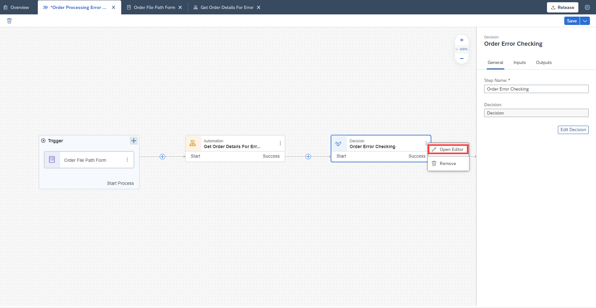

### Create Data Types

1. Go back to the **Overview** tab, choose **Create** and select **Data Type**.

    <!-- border -->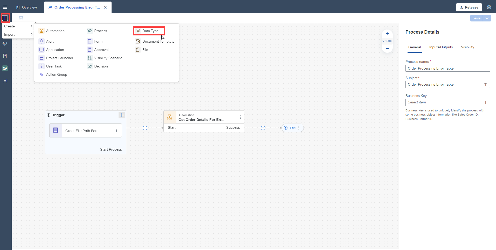

2. In the Create Data Type window, enter a **Data Type Name** such as **Order Error**. And Choose **Create** button.

    <!-- border -->

3. In the *Order Error** data type screen, choose **New Field** to add a new attribute to the data object.

    <!-- border -->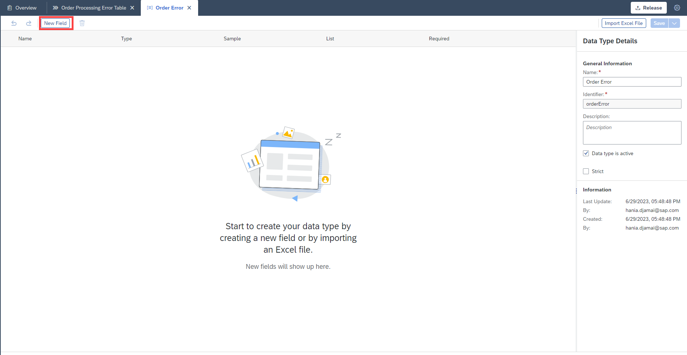

4. In the Field Details section on the right, in the **Name** field enter **Order Number**. Keep the Type as **String**.

    <!-- border -->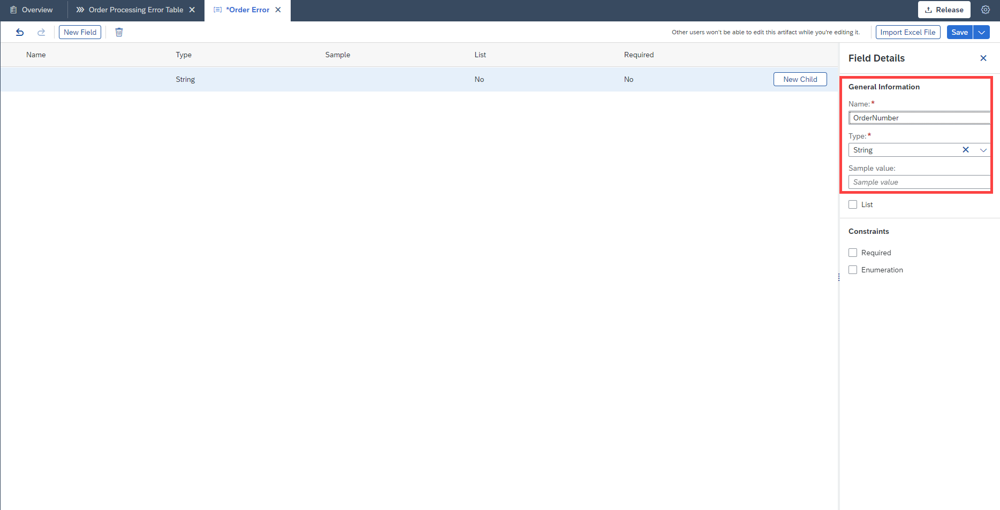

5. Similarly, add two more attributes of type String to the data type `Error Code` and `Error description`.

    <!-- border -->

6. **Save** your work.

### Configure Decision

1. Go back to **Order Error Checking** decision tab. In the Determine Approver section, select **Add Input Parameter**  button and **Add Output Parameter** button to configure input and output parameters.

    <!-- border -->

2. Configure Input Parameter:

    - In Name enter: **Order List Input**,
    - In Description enter: **Order List Input**,
    - In Type choose: **Sales Order Excel**, and select **List**.

    <!-- border -->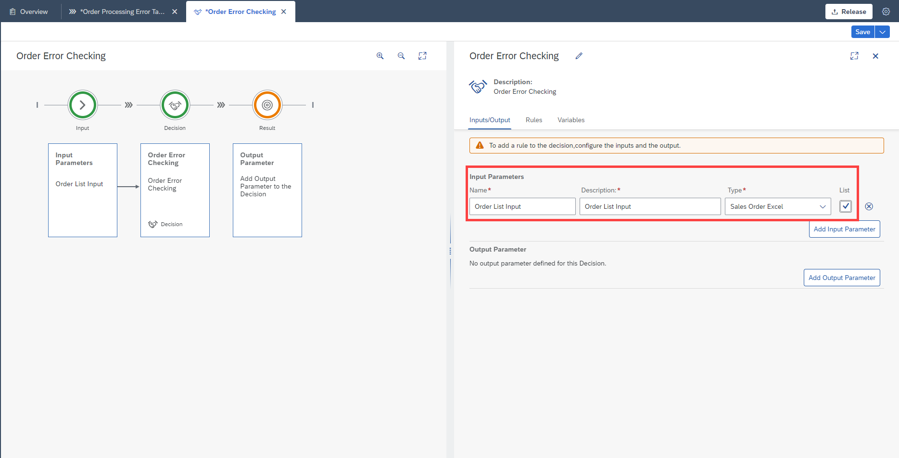

3. Configure Output Parameter:

    - In Name enter: **Order Error List**,
    - In Description enter: **Order Error List**,
    - In Type choose: **Order Error**, and select **List**.

    <!-- border -->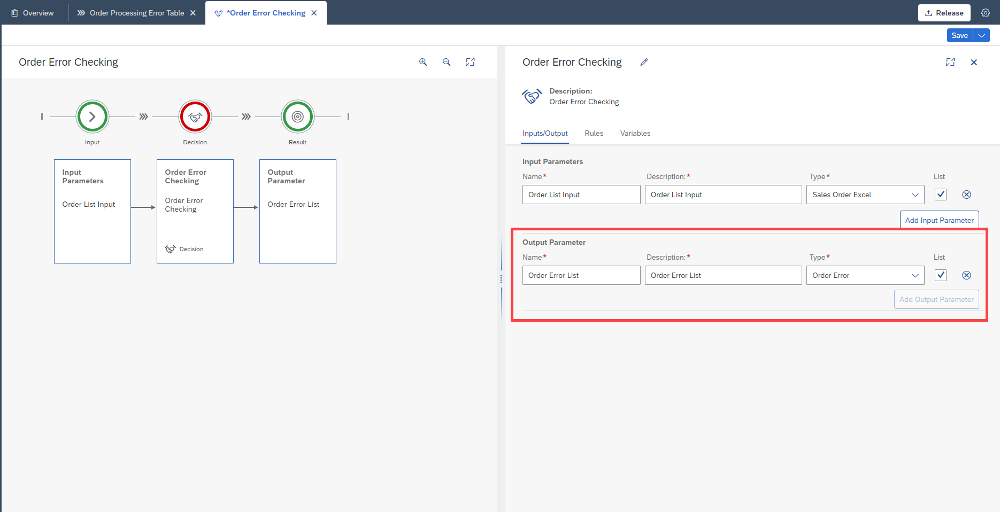

4. Now, we will add intermediate variables that we will use to store the results of the rules. Select **Variables** and choose **Add Variable**.

    <!-- border -->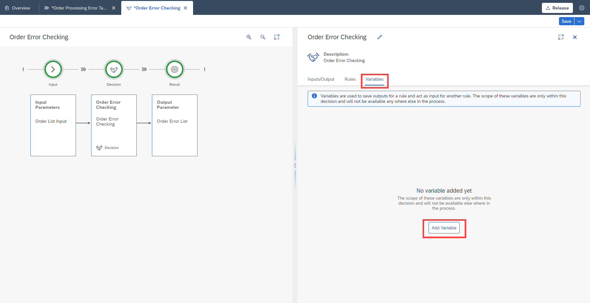

5. In the Decision Variable window:
    
    - In the Name enter **Order Input**.
    - In the Description enter **Order Input**.
    - Under Type select **Sales Order Excel**.

    <!-- border -->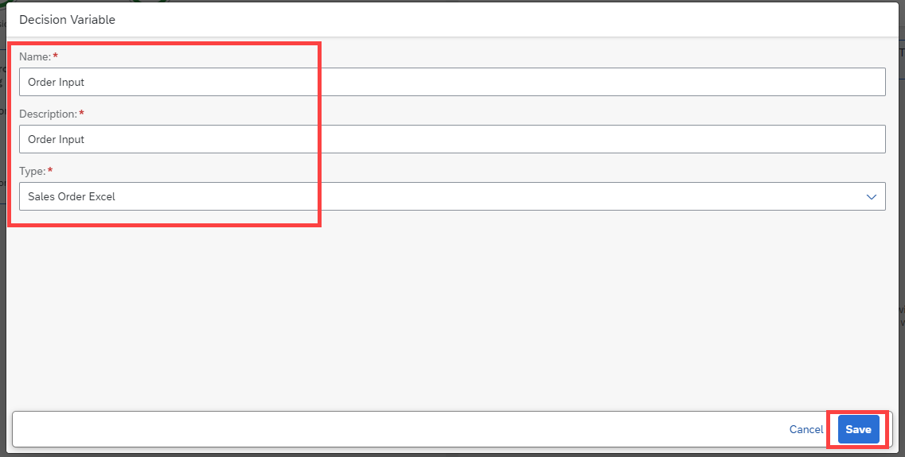

6. Similarly, for the second variable select **Add Variable**.

    <!-- border -->

7. In the Decision Variable window:
    
    - In the Name enter **Error Output**.
    - In the Description enter **Error Output**.
    - Under Type select **Order Error**.

    <!-- border -->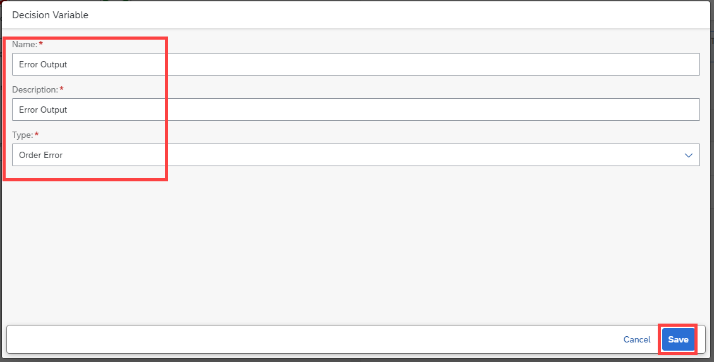

8. Now, we are going to add reusable text rules, which are validation or error detection rules. Therefore, we will create a reusable rule for each error search in the command. Select **Rules** and choose **Add Rule**.

    <!-- border -->

9. The first text rule we will create is a test for the delivery date of the order. In the Create Rule window: 

    - In the Rule Type select **Text Rule**.
    - In the Rule Name enter **Date Error test**.
    - In the Rule Description enter **check order delivery date**.
    - Active **Reusable Rule**.
    - Choose **Next Step** button.

    <!-- border -->

10. Configure the output or result of the decision table. Under **Result Vocabulary**:

    - Select **Error Output** data type,
    - In the Vocabulary section choose **Error Output** to add the Result Atributes.
    - Choose **Next Step** button.

    <!-- border -->
    <!-- border -->

11. Review and choose **Create** button to create the rule.

    <!-- border -->

12. In the newly created **Text Rule**, add values to condition and result columns:

    - in the If condition: Order Input.expectedDeliveryDate > TODAY( )  
    - In `OrderNumber` enter : Order Input.orderNumber 
    - In `ErrorDescription` enter : 'Delivery date is after current date' 
    - In `ErrorCode` enter : 'ERR1'

    <!-- border -->

13. Go back to **Rules** and click on **Add Rule**.

    <!-- border -->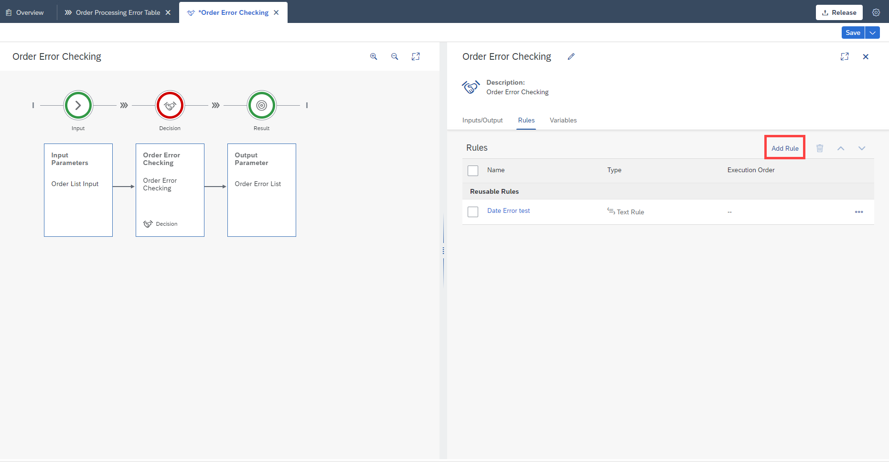

14. The second text rule we will create is a test for the order amount. In the Create Rule window: 

    - In the Rule Type select **Text Rule**.
    - In the Rule Name enter **Order Amount Error test**.
    - In the Rule Description enter **Order Amount Error test**.
    - Active **Reusable Rule**.
    - Choose **Next Step** button.

    <!-- border -->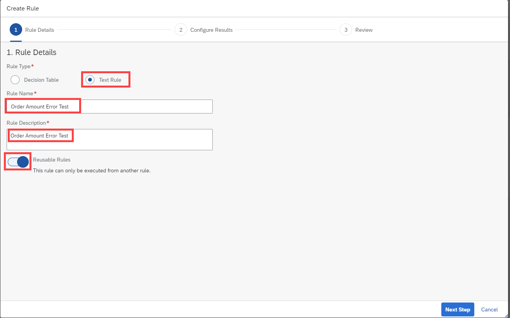

15. Configure the output or result of the decision table. Under **Result Vocabulary**:

    - Select **Error Output** data type,
    - In the Vocabulary section choose **Error Output** to add the Result Atributes.
    - Choose **Next Step** button.

    <!-- border -->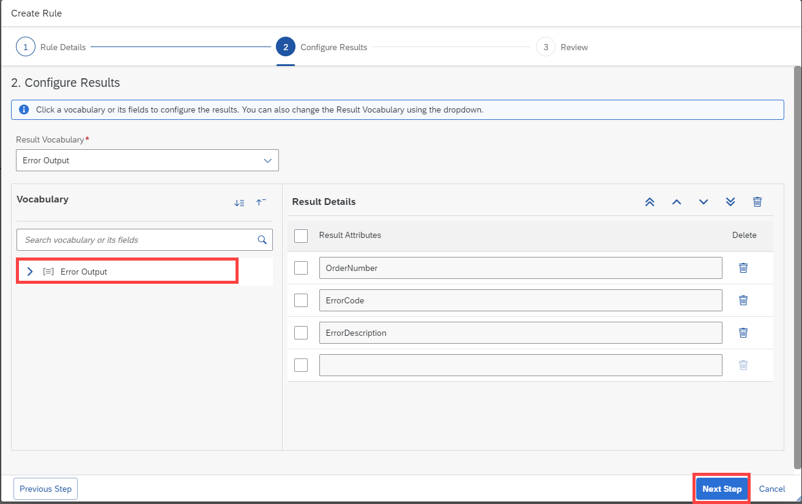

16. Review and choose **Create** button to create the rule.

    <!-- border -->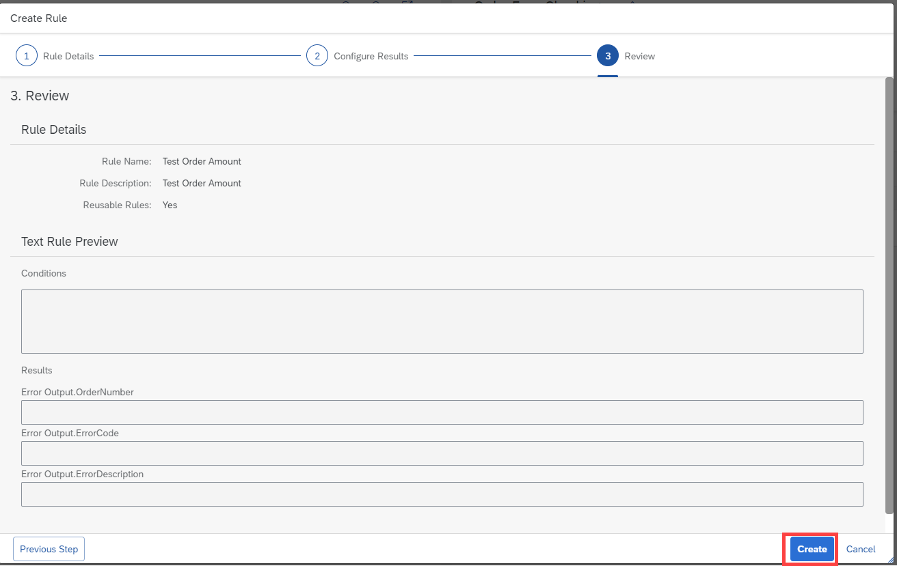

17. In the newly created **Rule Text**, add values to condition and result columns:

    - in the If condition: Order Input.orderAmount > 1000000 
    - In `OrderNumber` enter : Order Input.orderNumber 
    - In `ErrorDescription` enter : 'Fraudulent Request'  
    - In `ErrorCode` enter : 'ERR2'

    <!-- border -->

18. Go back to **Rules** and click on **Add Rule**.

    <!-- border -->

19. The third text rule we will create is a test for shipping country. In the Create Rule window: 

    - In the Rule Type select **Text Rule**.
    - In the Rule Name enter **Shipping Country Error Test**.
    - In the Rule Description enter **Shipping Country Error Test**.
    - Active **Reusable Rule**.
    - Choose **Next Step** button.

    <!-- border -->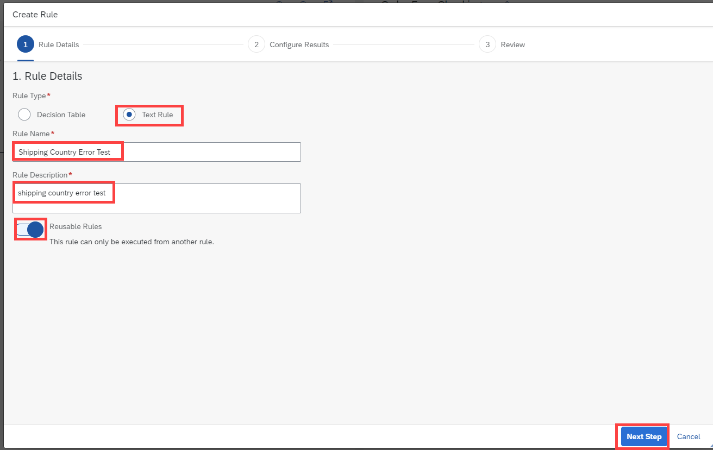

20. Configure the output or result of the decision table. Under **Result Vocabulary**:

    - Select **Error Output** data type,
    - In the Vocabulary section choose **Error Output** to add the Result Atributes.
    - Choose **Next Step** button.

    <!-- border -->

21. Review and choose **Create** button to create the rule.

    <!-- border -->

22. In the newly created **Text Rule**, add values to condition and result columns:

    - in the If condition: Order Input.shippingCountry NOTEXISTSIN [ 'India' , 'United Kingdom' ]  
    - In `OrderNumber` enter : Order Input.orderNumber 
    - In `ErrorDescription` enter : 'Delivery not supported in this country'   
    - In `ErrorCode` enter : 'ERR3'

    <!-- border -->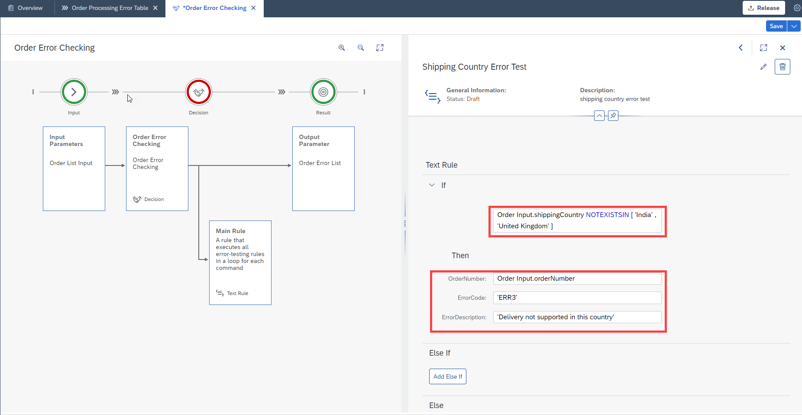

23. Go back to **Rules** and click on **Add Rule**.

    <!-- border -->

24. The fourth text rule we will create is a test for the order status. In the Create Rule window: 

    - In the Rule Type select **Text Rule**.
    - In the Rule Name enter **Order Status Error Test**.
    - In the Rule Description enter **Order Status Error Test**.
    - Active **Reusable Rule**.
    - Choose **Next Step** button.

    <!-- border -->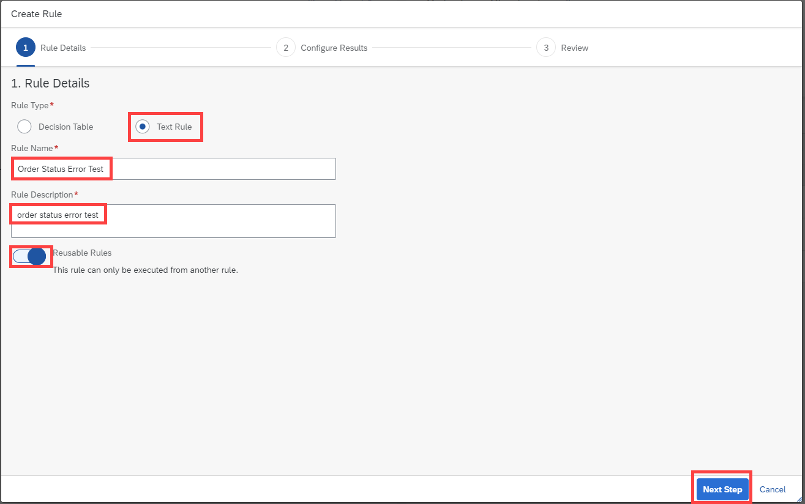

25. Configure the output or result of the decision table. Under **Result Vocabulary**:

    - Select **Error Output** data type,
    - In the Vocabulary section choose **Error Output** to add the Result Atributes.
    - Choose **Next Step** button.

    <!-- border -->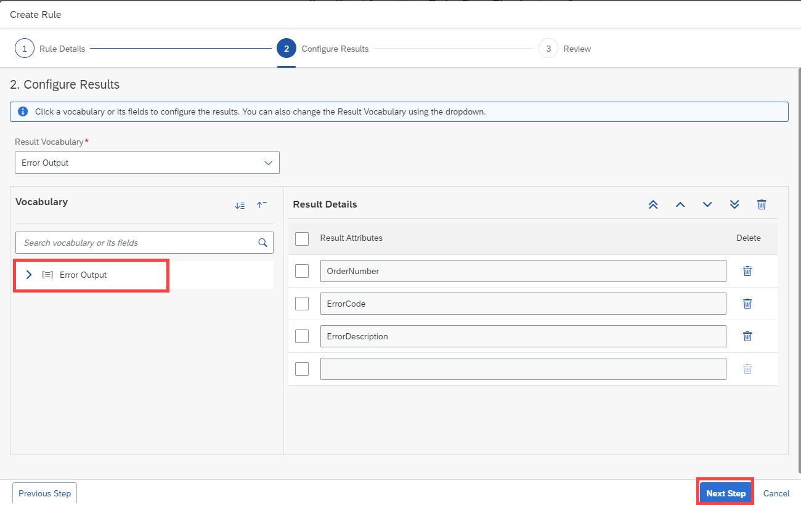

26. Review and choose **Create** button to create the rule.

    <!-- border -->

27. In the newly created **Text Rule**, add values to condition and result columns:

    - in the If condition: Order Input.orderStatus = '' 
    - In `OrderNumber` enter : Order Input.orderNumber 
    - In `ErrorDescription` enter : 'Order status is not set'   
    - In `ErrorCode` enter : 'ERR4'

    <!-- border -->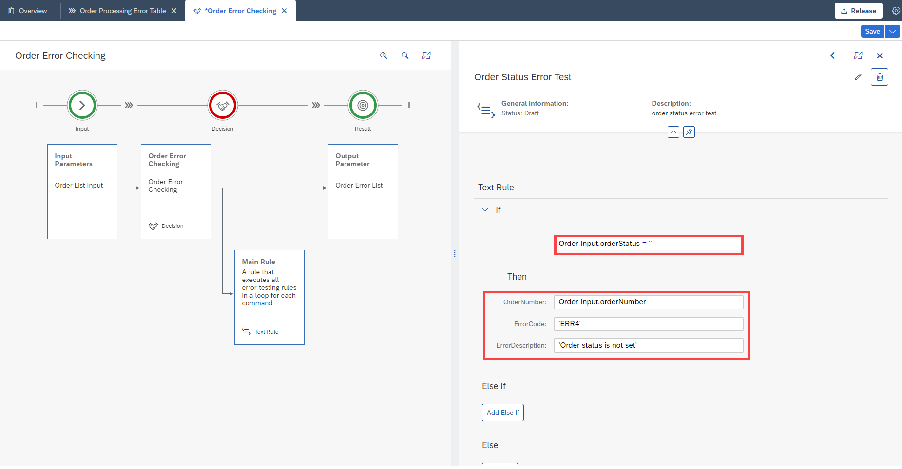

28. Go back to **Rules** and click on **Add Rule**.

    <!-- border -->

29. For the final text rule, we will verify if the order has no errors. In the Create Rule window: 

    - In the Rule Type select **Text Rule**.
    - In the Rule Name enter **No Error Test**.
    - In the Rule Description enter **No Error Test**.
    - Active **Reusable Rule**.
    - Choose **Next Step** button.

    <!-- border -->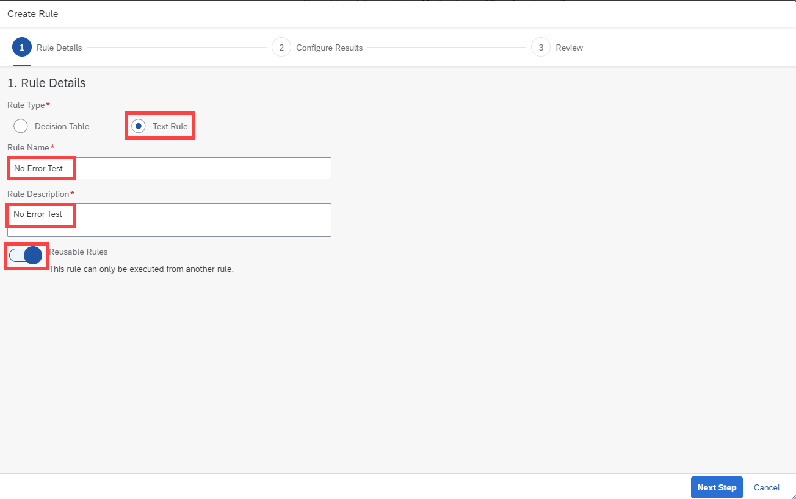

30. Configure the output or result of the decision table. Under **Result Vocabulary**:

    - Select **Error Output** data type,
    - In the Vocabulary section choose **Error Output** to add the Result Atributes.
    - Choose **Next Step** button.

    <!-- border -->

31. Review and choose **Create** button to create the rule.

    <!-- border -->

32. In the newly created **Text Rule**, add values to condition and result columns:

    - in the If condition: Order Input.orderDate <= TODAY( ) AND Order Input.orderAmount < 1000000 AND Order Input.shippingCountry EXISTSIN [ 'India' , 'United Kingdom' ] AND Order Input.orderStatus != '' 
    - In `OrderNumber` enter : Order Input.orderNumber 
    - In `ErrorDescription` enter : 'No Error'   

    <!-- border -->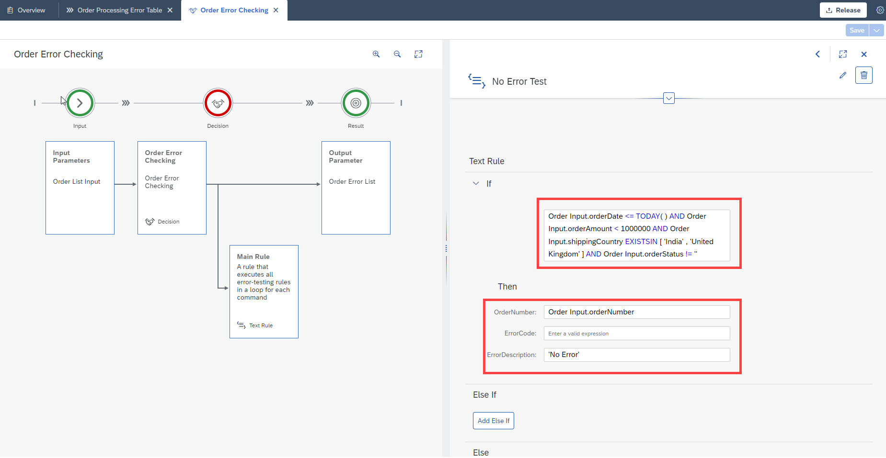

33. **Save** your work.

    Now, we will create a rule that will execute and utilize all the reusable text rules we created before in a loop for each order. The results will be sent to an error table stored in the previously created variable.

34. Go back to **Rules** and click on **Add Rule**.

35. In the Create Rule window: 

    - In the Rule Type select **Text Rule**.
    - In the Rule Name enter **Main Rule**.
    - In the Rule Description enter **A rule that executes all error-testing rules in a loop for each order**.
    - Choose **Next Step** button.

    <!-- border -->

36. In the **Configure Results** step, under **Result Vocabulary** choose `No Result` and click on **Next Step** button.

    <!-- border -->
    <!-- border -->

37. Review and choose **Create** button to create the rule.

    <!-- border -->

38. In the newly created **Text Rule**, In the **If** statement, assign `true` to represent the absence of any specific condition.

    <!-- border -->

39. In the **Then** statement, press **Ctrl+Enter** on your keyboard and select **Loop Functions**.

    <!-- border -->

40. A window for configuring loop functions opens. Configure the function as follows: 

    - In the Vocabulary select **Order List Input**.
    - In the Current Item select **Order Input**.
    - In the Expression statement enter: APPEND( Order Error List ,  Date Error test )

    <!-- border -->

    > In this function, what we have done is iterate through each element, which represents each order, and perform the delivery date test. Then, we append the test output to the **Order Error List**.  

    So, the objective is to repeat the same process for each reusable text error rule that we have previously created and gradually add the collected errors for each order to the **Order Error List**.

41. Click on the **+** to add a new expression box and enter : APPEND( Order Error List ,  Order Amount Error Test )

    <!-- border -->

42. Similarly, add three more expression box and enter the following in each box: 

    - First box : APPEND( Order Error List ,  Shipping Country Error Test  )
    - Second box : APPEND( Order Error List ,  Order Status Error Test )
    - Third box : APPEND( Order Error List ,  No Error Test )
    - Choose **Apply** button.

    <!-- border -->

    > So, here we will iterate through all the reusable text error rules that we have created earlier, one by one, for each order. The result obtained from each rule, whether there is an error or not, will be added to the **Order Error List** list without overwriting the previous results. That's why we have used an intermediate variable.

43. **Save** your work. 

    <!-- border -->
    <!-- border -->

### Configure Decision in Process Builder

1. Navigate to the **Order Processing Error Table** process, choose **Order Error Checking** decision and do the following. Choose **Inputs** tab, under the select list click on the `List SalesOrderDetails`.

    <!-- border -->
    <!-- border -->

2. **Save** the process.

### Create Order Error Table Form

1. In the **Order Processing Error Table** process:
    - choose **+** next to the decision.
    - Select **Forms** then **New Form**.

    <!-- border -->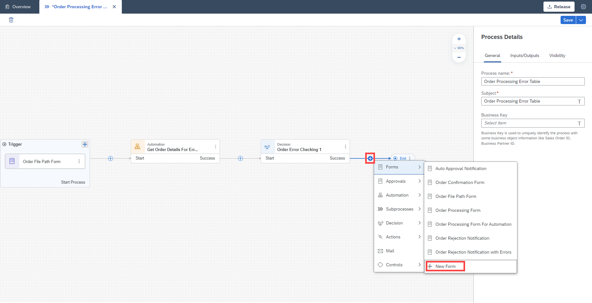

2. In the **Create Form** popup, enter the form name as **Order Error Table Form** and choose **Create**.

    <!-- border -->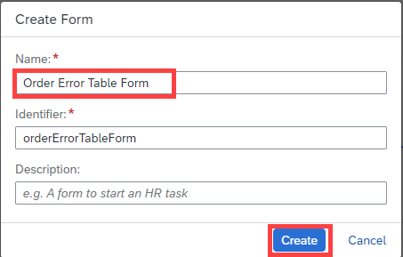

3. A new form is added to the process. Choose the three dots of the new form and select **Open Editor**.

    <!-- border -->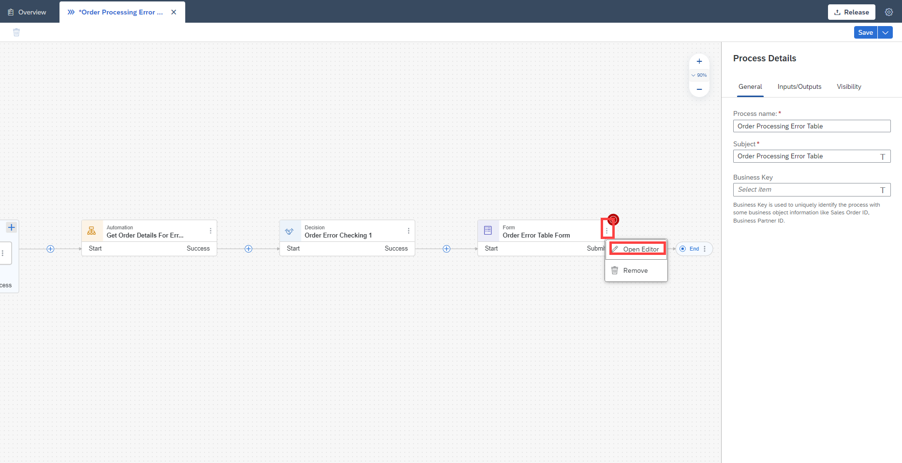

4. Design the **Order Error Table Form** form in the form builder.

    |  **Form Fields**    | **Field Settings with Label**
    |  :------------- | :-------------
    | Headline 1 | Order Error Summary Table. 
    | Paragraph  | The table below represents your processed order list with details of the errors found. 
    | Table      | Order Errors.

    <!-- border -->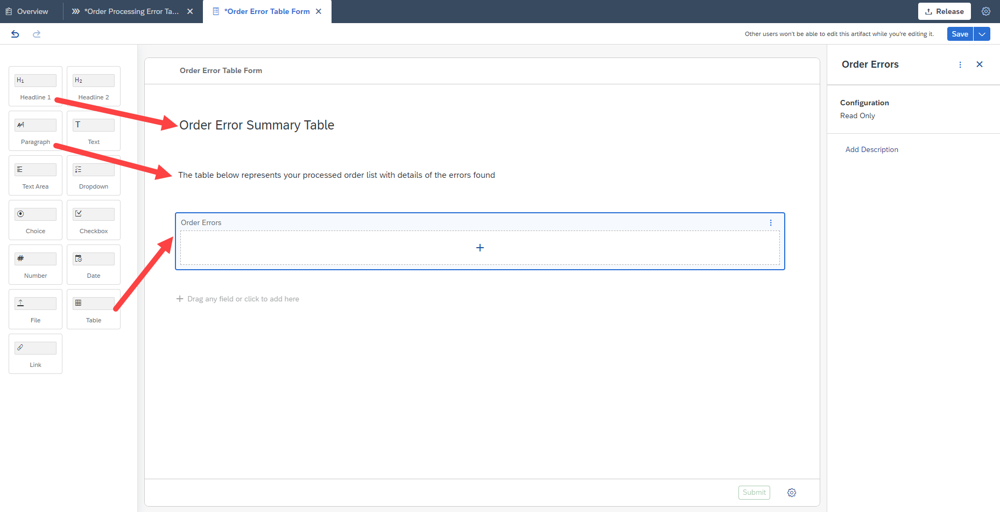

5. Choose the + icon in table and select **Text**. Enter **Order Number** as field name.

    <!-- border -->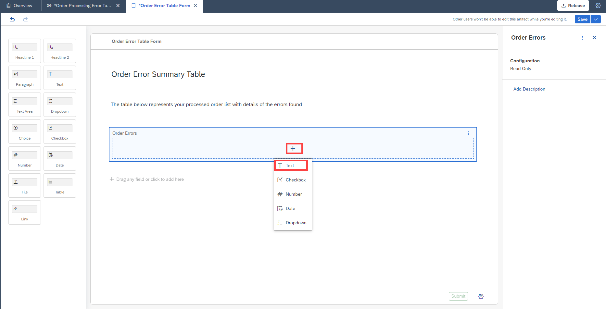
    <!-- border -->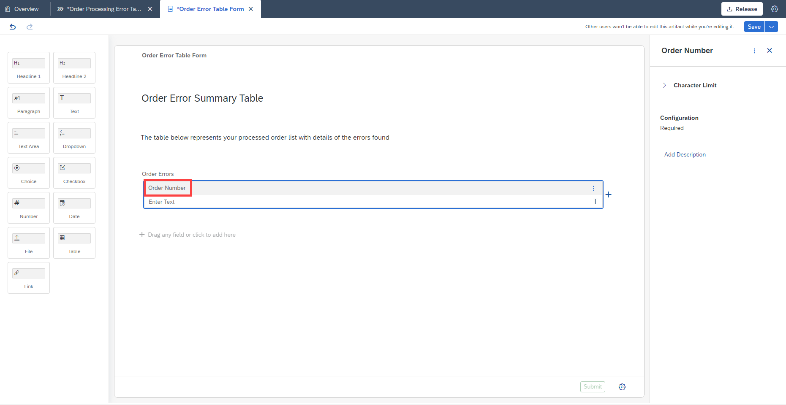

6. Choose the + icons beside Error Code field and select **Text**. Enter **Error Code** as field name.

    <!-- border -->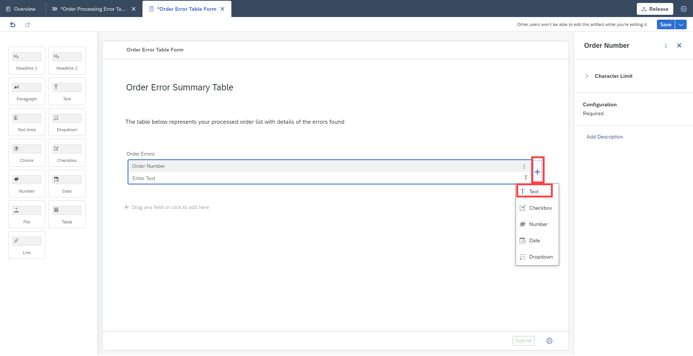
    <!-- border -->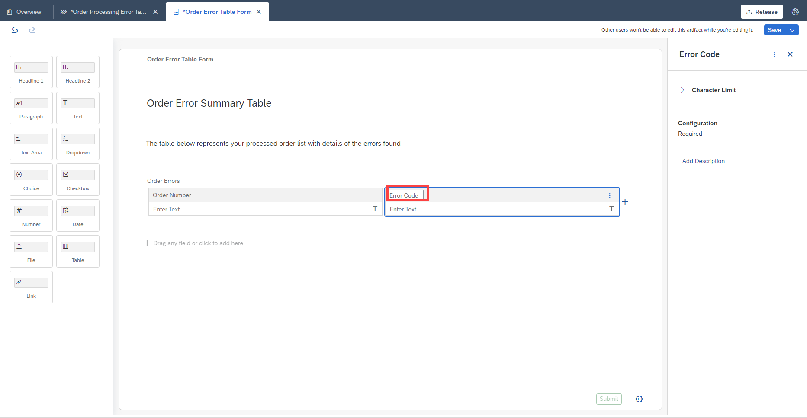

7. Once again choose the **+** icons beside Error Code field and select **Text**. Enter **Error Description** as field name. Mark the table as **Read Only**.

    <!-- border -->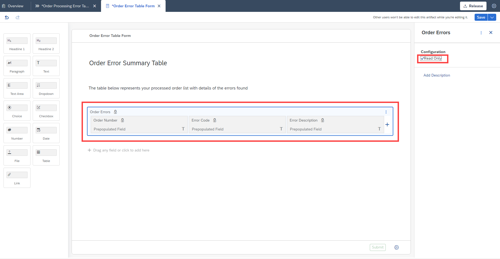

8. **Save** the form.

9. Go back to the process builder to map the process content with the form input fields. Select the. **Order Error Table Form** form.

10. Configure the **General** information section: 

    - In the **Subject section**, enter **Order Error**.
    - In the **Recipients** section, under Users, select **Process Started By** from Process Metadata.

    <!-- border -->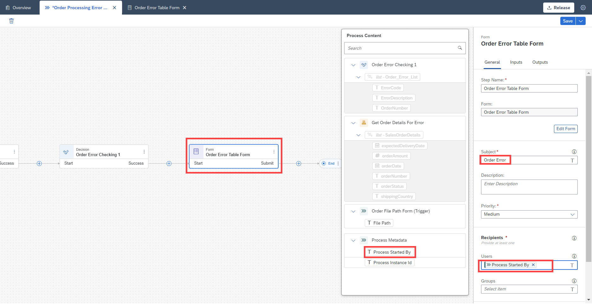

11. Now, configure the **Input** information section. In the select list choose `List Order_Error_List`.

    <!-- border -->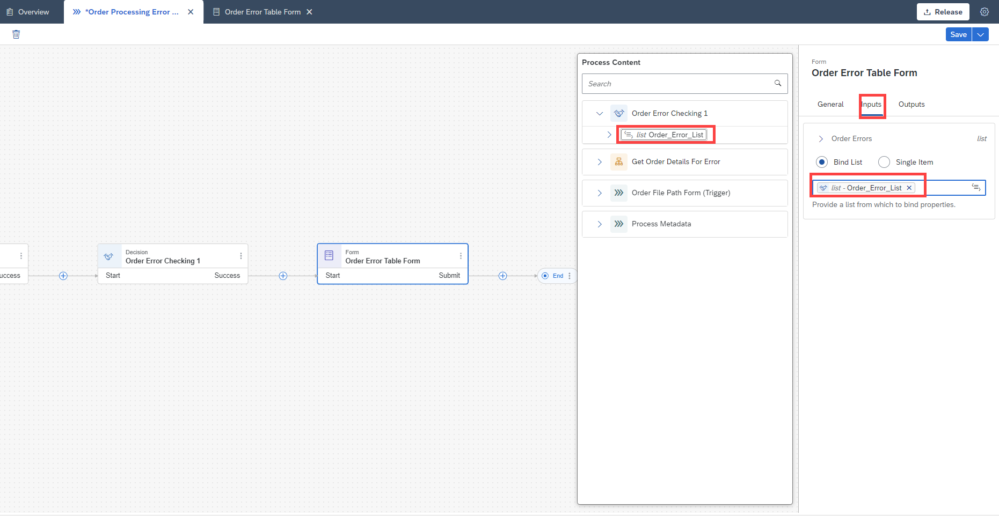

12. **Save** the process.

### Release and deploy

    - Please refer to step 1 and 2 of the tutorial on how to release and deploy a process [Run the Business Process](https://developers.sap.com/tutorials/spa-run-process.html).

### Test the process

1. Open the process builder of the deployed version and choose **Order File Path Form**, select the **Copy Link** icon under **Form Link**.

    <!-- border -->

2. In a new tab in your browser, enter your file path and select **Submit**.

    <!-- border -->

3. In the **SAP Build** lobby, choose **My Inbox** icon.

    <!-- border -->

4. You will get a notification with the error details in a table.

    <!-- border -->

