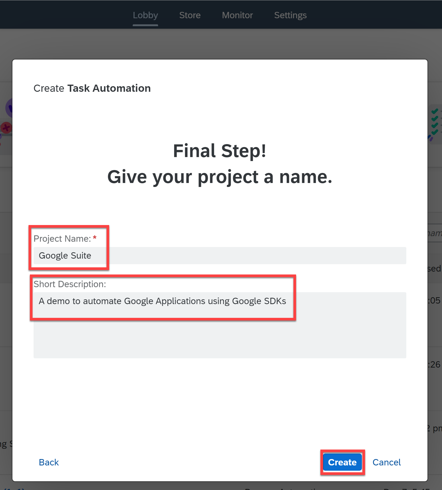
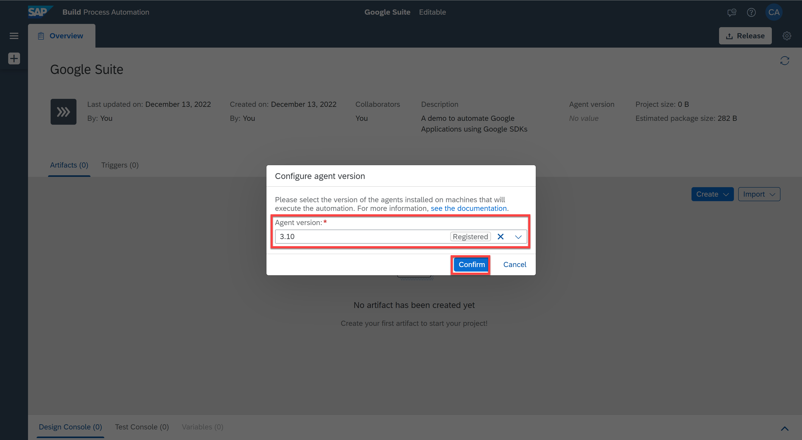
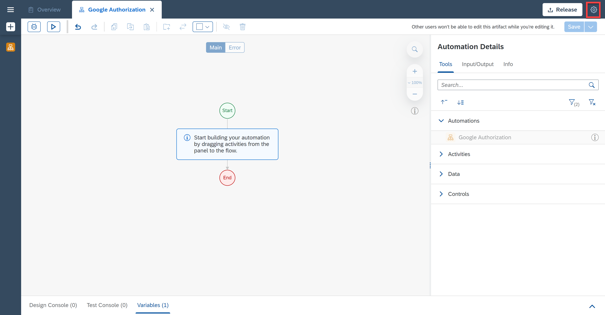
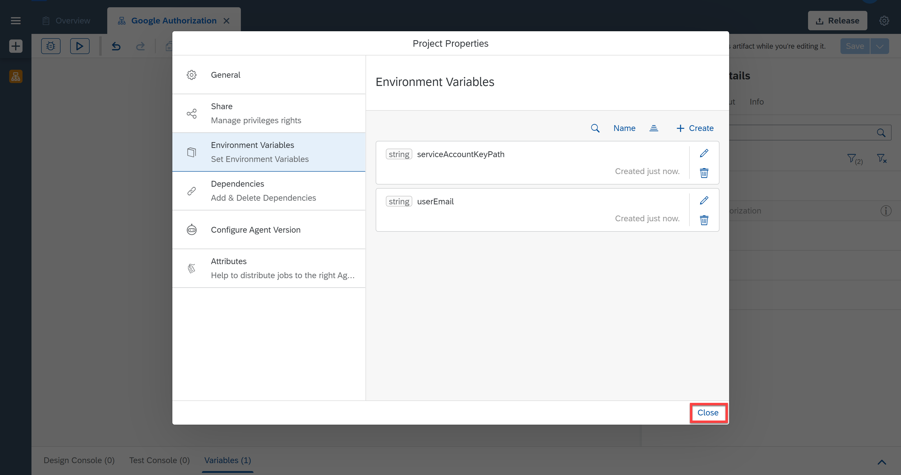
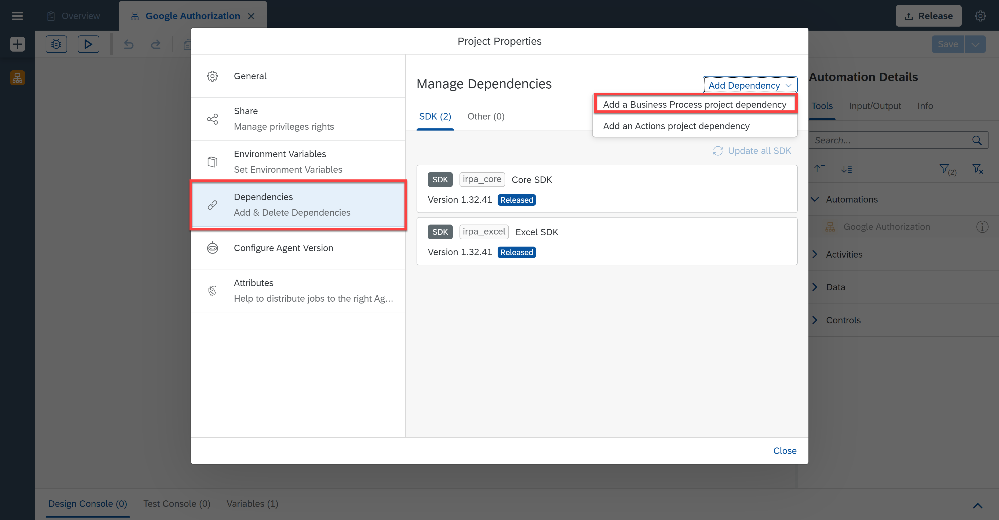

# Authorize SAP Build Process Automation with Google Authorization SDK
<!-- description --> Authorize SAP Build Process Automation to automate Google Applications with Google Authorization SDK

## Prerequisites
 - A [SAP BTP Free Tier Account](spa-subscribe-booster) with SAP Build Process Automation booster
 - [Configure Service Account in Google Cloud Platform](https://help.sap.com/docs/IRPA/1154f48dd7ab430ea52badeb4359e4b4/40baf1a31fad4e86892795f7fe59d971.html)
 - Install and set up the [Desktop Agent 3](spa-setup-desktop-3-0-agent) to run the automation

## You will learn
 - How to use the authorization mechanisms supported by the Google Authorization SDK

## Intro
SAP Build Process Automation enables users to automate Google Workspace products such as Gmail, Google Drive, Google Sheets, Google Docs, Google Calendar and other services such as Google Cloud Storage, Document AI and Vision AI. In order to automate Google workspace products, you have to be authorized. There are three authorization mechanisms that Google supports:

- Service Account
- oAuth
- Workflow Identity Federation

SAP Build Process Automation supports Service Account and oAuth In this tutorial, you will authorize using Service Account.

> What is a Service Account ?

> Service account differs from user accounts and it will be used by a software application to make authorized API calls. The service account can also be authorized to access data on behalf of users in a domain without their consent by enabling Domain-wide delegation. The service accounts should be created and configured through Google Cloud Console before using the activity in SAP Build Process Automation. Refer to pre-requisites to **Setup Service Account**

---

### Create an automation to authorize Google applications

Before you can authorize Google applications, you will need to create an automation.

1. From the **Lobby**, choose **Create**.

    <!-- border -->

2. In the pop-up, select **Build an Automated Process**.

    <!-- border -->

3. Select **Task Automation**.

    <!-- border -->

4. In the **Create Task Automation** window, enter the name: **Google Suite**  and as a description: **A demo to automate Google Applications using Google SDK**.

5. Choose **Create**.

    <!-- border -->

    You will be asked to configure your agent version.

6. Select the agent version that is registered on your system.

    <!-- border -->

    A pop-up window will prompt you to create an automation.

7. In the name field enter **Google Authorization**.

8. In the description field enter **An automation to authorize Google**.

9. Choose **Create**.

    <!-- border -->

    A new automation named **Google Authorization** will be successfully created. You will be navigated to the automation editor where you can start building your automation.

    <!-- border -->

### Create environment variables

Environment Variables allow you to reuse certain information for a given environment. You use environment variables to pass parameters to automations. In this case, you will need to maintain two environment variables that will contain the file full path of the service account key file as well as the user email used in the automation.

1. Select **Settings**.

    <!-- border -->

2. In the Project Properties window, select **Environment Variables**, then **+ Create**.

    <!-- border -->

3. In the create an environment variable screen:

    - Under Identifier enter: `serviceAccountKeyPath`,
    - Under description: Fully-qualified path of the downloaded JSON file,
    - Under Type select **String**,
    - Choose the **Create** button.

    <!-- border -->

4. In the same way, you will create a second variable named `userEmail` also of type **String**. Choose **+ Create**.

    <!-- border -->

5. After the Environment Variables are created successfully, **close** the project properties window.

    <!-- border -->

### Add the Google authorization SDK

The Google Authorization SDK is a collection of activities allowing you to acquire authorization with Google to perform activities in the Google Workspace and the Google Document AI SDK. It is mandatory for authorizing SAP Build Process Automation to Google Applications. It contains activities to support authorization mechanisms such as Service Account and OAuth. The Authorize activity must be used before any Google SDK Activity and the Disconnect activity must be used at the end of the automation.

1. Select Settings.

    <!-- border -->

2. In the **Project Properties** window, select **Dependencies**.

    >In the **Manage Dependencies** section, you can see that the Core and Excel SDK were added automatically when the automation was created.

3. Choose **Add Dependency** and select **Add a Business Process project dependency**.

    <!-- border -->

4. Under **Package**, select **Google Authorization SDK** and choose a version.

5. Choose **Add**.

    <!-- border -->

    The Google Authorization SDK has been added successfully.

6. You may close the **Project Properties** window.

    <!-- border -->

7. In the **Automation Details** panel, under **Tools**, search for Google.

    The Google Authorization activities will be displayed.

    <!-- border -->

### Authorize Google using service account
After successful completion of setting the Service Account as mentioned in the pre-requisites, you would have downloaded the  Service Account Key in JSON format and saved it safely on your local machine to avoid credential leakage, which is a major risk when using the service account approach.

### Use the service account activity

The Authorize Google (Service Account) activity is used to authorize using service account and the same activity is supported on Desktop Agent 2.0 and Desktop Agent 3.0. Once the activity executes successfully, the bot is authorized to execute any subsequent google activities.

The Bot using Service Account Authorization doesn't require any human intervention such as providing the user consent or credentials. Hence this will be a suitable choice for unattended scenarios.

To perform actions on behalf of the user, Domain Wide Delegation must be enabled for the service account, and the user's email address is mandatory. For instance, the user's email is required in order to send emails or schedule events on the Google calendar. However, neither the user's email address nor Domain Wide Delegation are required for services like Google Document AI and Vision AI.

1. In the **Automation Details** panel, under **Tools**, search for **Authorize Google (Service Account)**.

2. Drag and drop the activity into the workflow.

    <!-- border -->

3. Choose the activity.

4. Under **Input Parameters**, for `serviceAccountKeyPath` field enter the environment variable `E serviceAccountKeyPath` previously created.

    <!-- border -->

5. Choose the field of the input parameter **Scopes** and select **Create Custom Data**.

    <!-- border -->

    Select `GmailScope` and `GoogleDriveScope` if the automation contains Gmail and Drive Activities for instance.

    <!-- border -->

    `userEmail` is the user's email address to perform actions on behalf of them. Domain-wide delegation is mandatory if user's email is provided.

6.  For `userEmail` field enter the environment variable `userEmail` previously created.

7. Choose **Save**.

    <!-- border -->

### Test Google authorization

You can test if the Google Authorization has been set up correctly.

1. Choose **Test**.

2. Fill in the **Environment Variables**:
    - For `userEmail`: your user email
    - For `serviceAccountKeyPath`: the full path to the json file

3. Choose **Test**.

    <!-- border -->

    The testing was successful.

    <!-- border -->

    Now that you have set the Authorize activity, you may add Google Workspace SDK to automate google applications such as google drive, Gmail and google sheet. Once you are done building your automation, you may use the Disconnect activity at the end of the automation.
