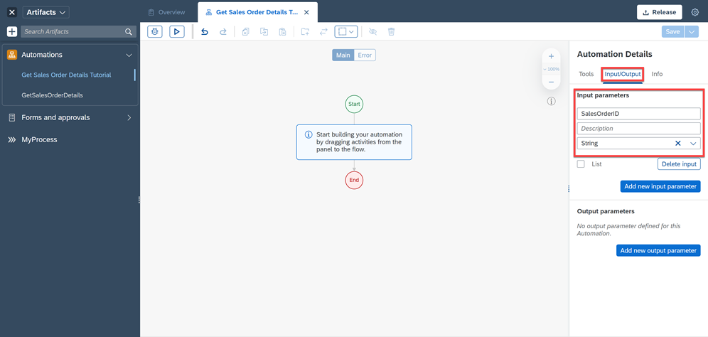
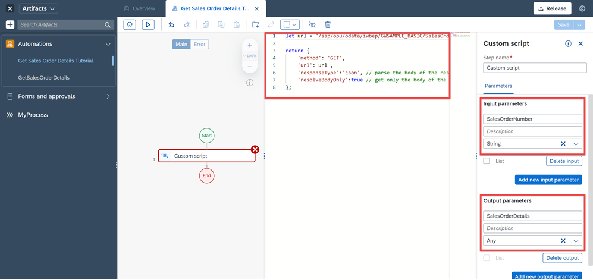
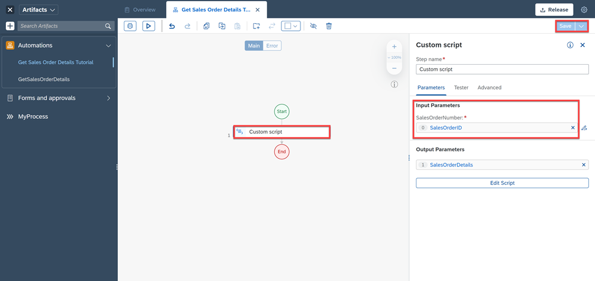
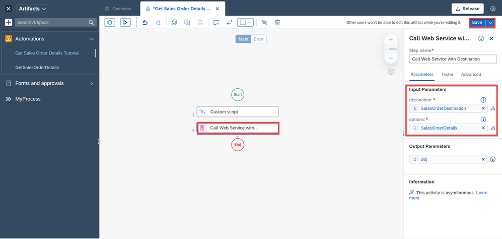
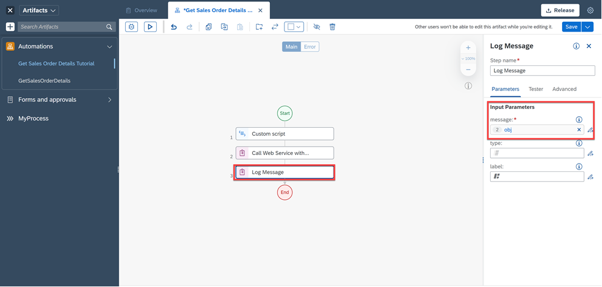
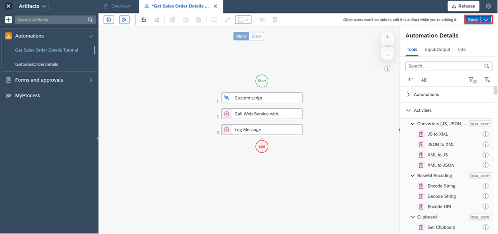
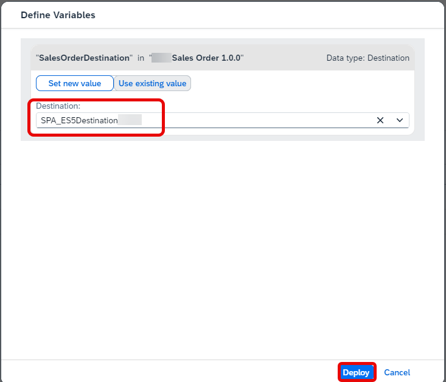
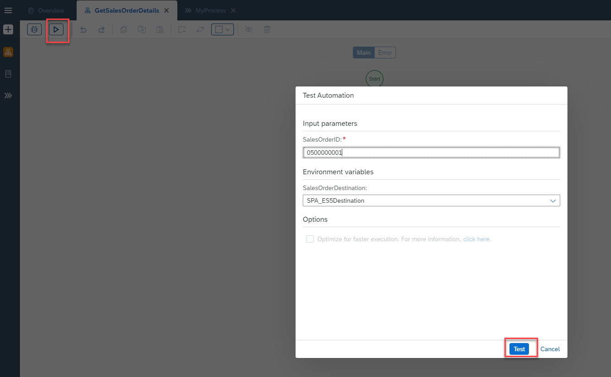
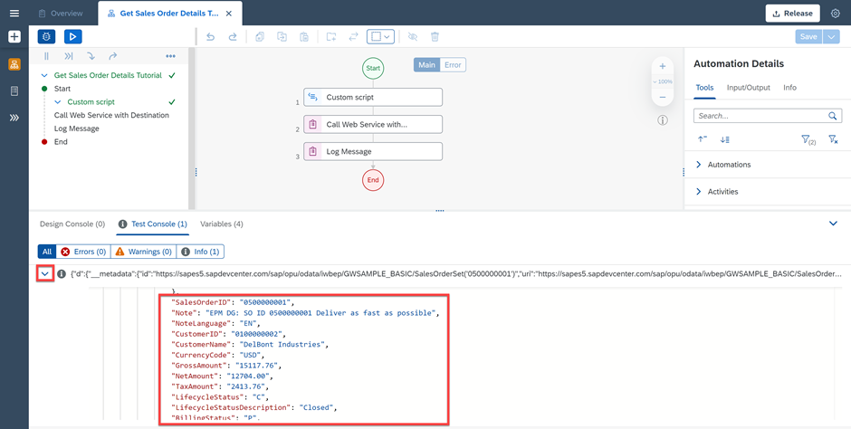

# Call Web Services using Destinations in SAP Build Process Automation
<!-- description --> Call Web Services using Destinations to retrieve sales order details from SAP S/4HANA

## Prerequisites
 - [Configure BTP Destinations in SAP Build Process Automation](spa-create-destination)
 - Basic understanding of SAP Build Process Automation

## You will learn
  - How to call Web services using Destinations

## Intro
In this tutorial, you will retrieve sales order details for a particular Sales Order from SAP S/4HANA.

---

### Create a user on the public gateway system


You need to get access to the public gateway system. Please [Create an Account on the SAP Gateway Demo System.] (https://developers.sap.com/tutorials/gateway-demo-signup.html)


### Create destinations in BTP and SAP Build Process Automation


Once you have successfully created an account in the SAP gateway demo system, use the credentials and configure the destination in SAP BTP account. Refer to the prerequisites to [Configure BTP Destinations in SAP Build Process Automation](spa-create-destination)


### Create business process and automation


1.  Create a **Business Process** named **Sales Order**.

2.  Create an **Automation** named **Get Sales Order Details**.


### Build an automation


You will now build an automation to retrieve sales order details from SAP backend using Destinations configured in SAP BTP.

1. Under the **Automation Details** panel, create an **Input parameter** called **Sales Order ID** of type **String**.

    <!-- border -->

2. Now drag and drop the activity **Custom script**.

2. Choose **Edit Script**.

3. Add input and output parameters for the Custom script as shown below.

    |  Parameter Name   | Type of parameter  |Data type
    |  :------------- | :------------- | :-------------
    |    `SalesOrderNumber`     | Input| String
    |    `SalesOrderDetails`    | Output |Any

4. Add the code to retrieve the sales order details for a particular sales order.

    ```
    let url = "/sap/opu/odata/iwbep/GWSAMPLE_BASIC/SalesOrderSet('" + SalesOrderNumber + "')";

    return {
      'method': 'GET',
      'url': url ,
      'responseType':'json', // parse the body of the result as a JSON object
      'resolveBodyOnly':true // get only the body of the response
    };
    ```
    <!-- border -->

5. Now link the **Input parameter** of the automation **Sales Order ID** to the **Input parameter** of the Custom script **Sales Order Number**.

    <!-- border -->

4. Drag and drop the activity **Call Web Service with Destination**.

5. Map the parameters as shown below.

    > The value of for destination parameter can be maintained after successful completion of the tutorial Create Destination as mentioned in Prerequisites  

6. Choose **Save**.

    <!-- border -->

7. Now add an activity **Log Message**.

8. Link the **Input parameter** message of the **Log Message** activity to the **Output parameter** of the **Call Web Service with Destination** activity to see the results.

    <!-- border -->

9. **Save** the automation. The final automation looks as below.

    <!-- border -->


### Release and Deploy the Business Process


1. Refer to the tutorial on how to release and deploy the Process.
2.  When you deploy the Process, enter the value for the Destination.

    > The value for the destination parameter would appear only after successful completion of the tutorial [Configure BTP Destinations in SAP Build Process Automation](spa-create-destination) as mentioned in Prerequisites.

3. Enter the values as shown below.

<!-- border -->


### Test the automation


1. Test the automation with the below input data.

    <!-- border -->

2. You can see the results of the testing with the sales order details of the sales order you selected.

    <!-- border -->

    Now the automation is ready and can be added to your process by adding Output parameters for the automation.


---
