# Create Business Partner Action Project in SAP Build Actions
<!-- description --> Create an action project from Open API specification

## Prerequisites
- Access to a [SAP BTP tenant with SAP Build Process Automation](spa-subscribe-booster)
- Complete the tutorial [Setup Environment for S/4HANA Business Partner API](spa-dropdown-value-help-filtering-setupenv)
- S/4HANA Cloud system where Business Partner module is available
- A communication user to access S/4HANA Business Partner inbound services based on `SAP_COM_0008` communication scenario ID

## You will learn
- to discover APIs in SAP Business Accelerator Hub
- to download Open API specification
- to create action project based on the API specification
- to configure API methods to update input and output fields
- to test API using destination option
- to release and publish action project to be consumed in the business process modelling

## Intro
Action is a feature in **SAP Build Process Automation** to connect processes with external systems, be it SAP or non-SAP systems. This is an important piece of the puzzle especially if you want to automate or extend your business processes for any available LoB processes like S/4HANA, `Ariba`, SuccessFactors etc. These extensions can be easily build using SAP Build Process Automation, and using actions you can connect to your given S/4HANA, `Ariba` or other SAP LoB systems for any kind of GET, POST, PATCH and other calls.

In this tutorial, you will create an action project based on Business Partner API. The [Business Partner (A2X)](https://api.sap.com/api/API_BUSINESS_PARTNER/overview) API is already available in Business Accelerator Hub. For this workshop you will leverage **Customer - GET API** which will be used to fetch the customer details from S/4HANA Cloud System.

### Download open API specification

1.  [Download and extract](https://www.sap.com/registration/trial.f47300f6-63b8-4f22-b189-dbadd3c903d6.html?id=0055000000004992023) **Open API Specification** zip file for **Business Partner (A2X)** API in your local file system.

> Open API specification of 2.x or 3.x or higher is needed for creating action project. For APIs that are available in [SAP Business Accelerator Hub](https://api.sap.com), you can directly download the specification from the API overview section. For example: The API specification that will be used for fetching customer details in this exercise is downloaded from [here](https://api.sap.com/api/API_BUSINESS_PARTNER/overview).

### Create action project

1.	Open **SAP Build** lobby with your username and password, then do the following

    - Under **Connectors**, select **Actions**.

    <!-- border -->

2. Choose **Create**.

    <!-- border -->

3. In the **Choose an API Source** popup, under **API Specification**, select **Upload API Specification**.

    <!-- border -->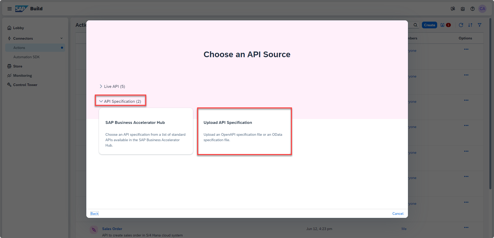

4. Drag and drop or click **Browse Files** to upload open specification file downloaded in step above.
   
5. Choose **Next**.

    <!-- border -->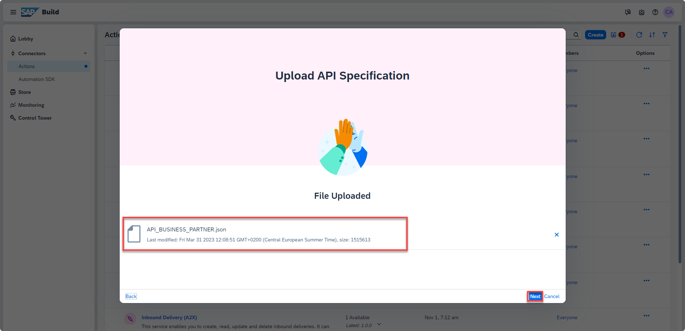

6. In the **Create an Action project** popup, do the following:
   
    - Enter the **Project Name** as **Business Partner**.
    - Enter the **Description** as **Fetch customer details from the Business Partner API**.
    - Click **Create**.

    <!-- border -->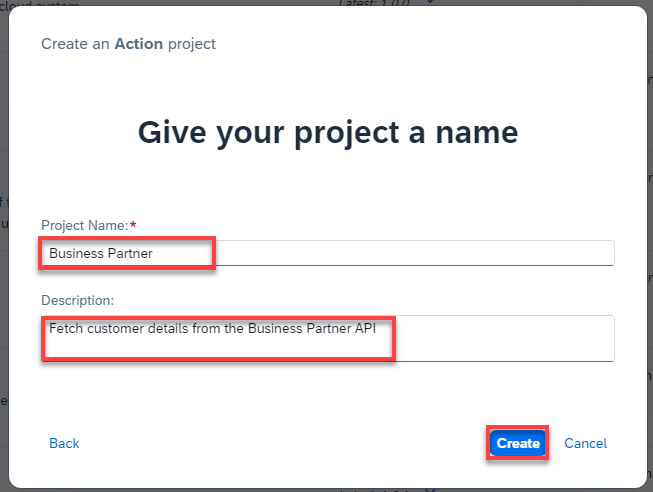

7. Wait until the action project gets created.

    <!-- border -->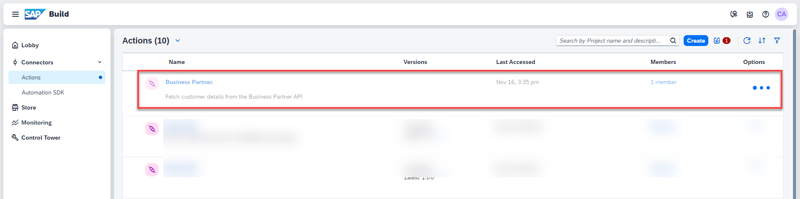
    
    As soon as the **Business Partner** Action gets created, SAP Build Actions will automatically open and the **Add Actions From Business Partner** pop up will appear.

    <!-- border -->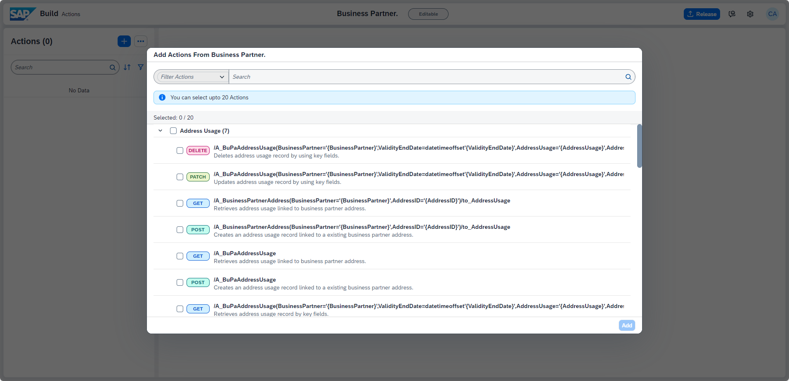

### Configure action project

1. In the popup, you have to select *GET* method of `/A_Customer` API. You can either directly search from the given list of APIs or follow the steps below:

    - Select **filter** option.

    <!-- border -->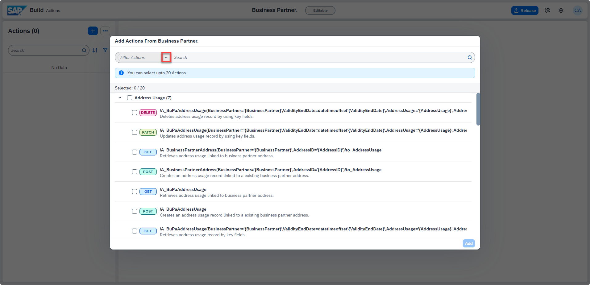

    - Select **GET**.

    <!-- border size:540px -->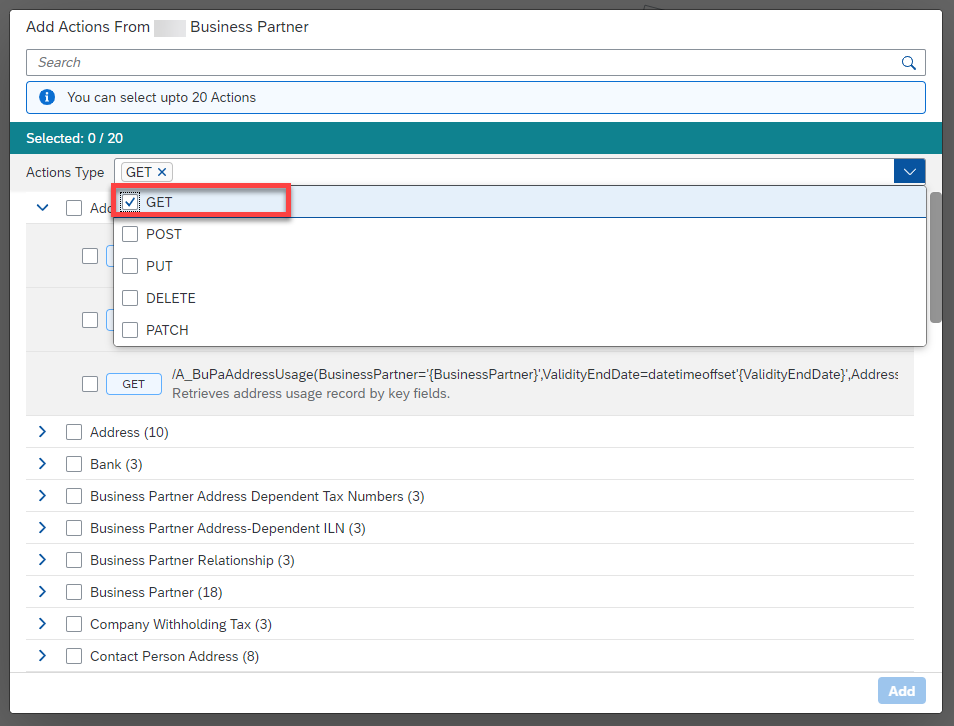

    - From the filtered list of APIs, choose **Customer** and select **GET** option for `/A_Customer` API.

    - Click **Add**.

    <!-- border -->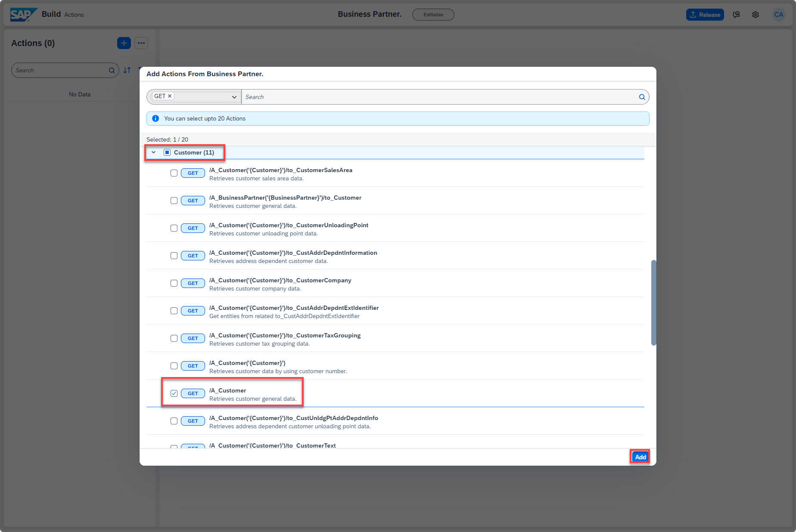

    SAP Build Actions will open with the selected APIs which can be further configured based on the requirements.

2. The Action supports JSON files and the file size is limited to 5 MB, you need to fetch a specific number of records from your data source. This can be done using the `$top` input parameter. For this use case, you will be setting the parameter to 150. This will enable us to fetch the first 150 records and display their details. 

    - Select the **$top** parameter.
    - In the side panel, toggle the **Static** option to **YES**.
    - Enter **150** in the **Value** field.
    - Select **Save**.

    <!-- border -->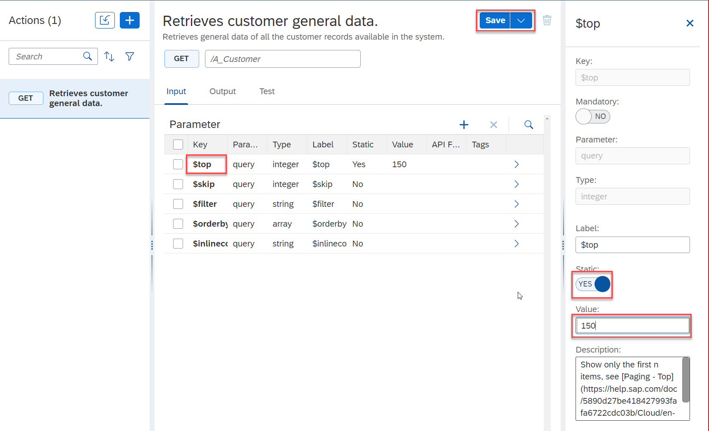

    With this you have configured the action project name and API input fields.

3. Similarly, configure the output fields. Do the following:

    - Click **Output** tab.
    - Expand the output key **d**.
    - Select the **results** key.
    - In the side menu, select the **Tags** dropdown and choose **Main Output Array**.
    - Choose **Save**.

    > ### What is going on?
    > If this array is not marked as Main Output Array, the Actions Project will not be visible in the Form Editor as a data source.

    <!-- border -->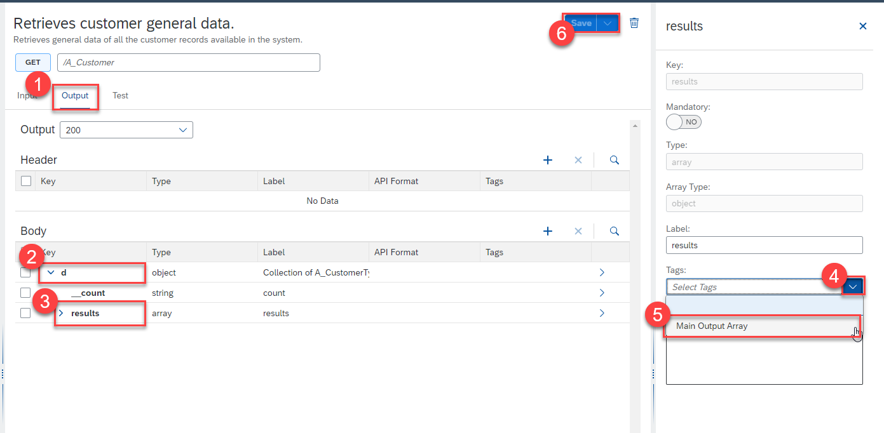

### Test action project

1. Once the action project is configured and saved, it is time to test the changes and output. To test the API, do the following:

    - Click **Test** tab.
    - Select **Destination** option under **Connectivity**.
    - Select `S4_Business_Partner` from the dropdown options.

    > The destinations are fetched from the SAP Business Technology Platform. The selected destination is already created in the account configured for this tutorial.

    > Notice that the input value is already picked from the default value entered while configuring the action project.

    - Click **Test**.

    <!-- border -->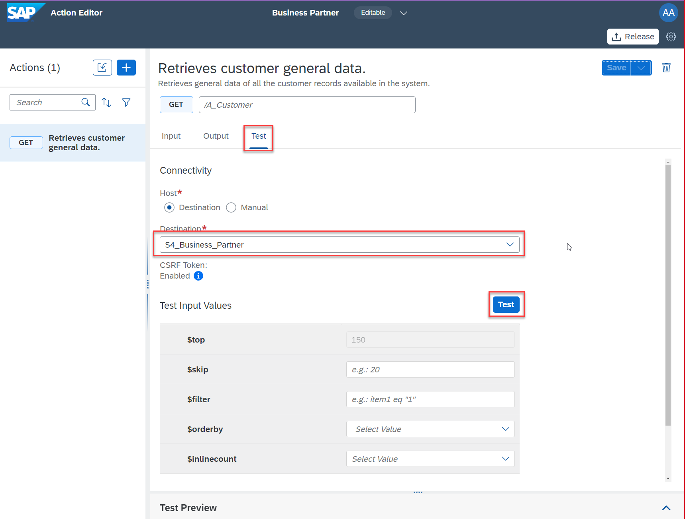

    - Once the execution is successful, you see **200 OK** response with the details of the customers in the backend S/4HANA Cloud system.

    <!-- border -->

    The action gives a response which, in this use case, returns the customer details and related details. You need to display the customer names which are in an array of objects.

### Release action project

You will now release the action project to create version(s) and then publish a selected version in the action repository. It is then these published actions that can be used in different processes and applications to connect to external systems.

- To release a version of the action project, click **Release** from top-right corner.

<!-- border -->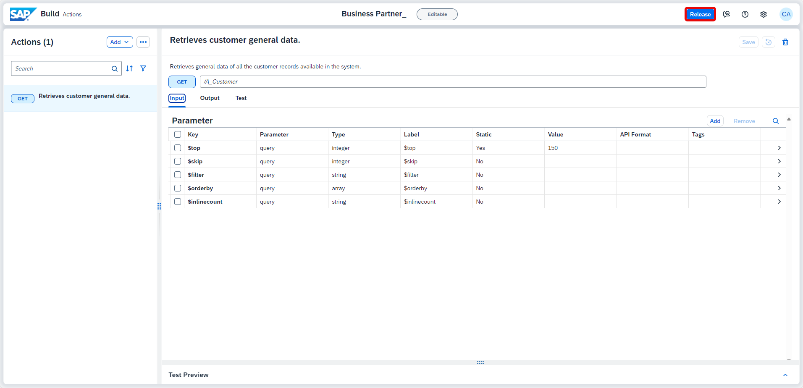

- In the release popup, enter the **Release Notes** of your choice and click **Release**.

> Notice the version of the project. It is in `majorVersionNumber.minorVersionNumber.patchNumber` format.

<!-- border -->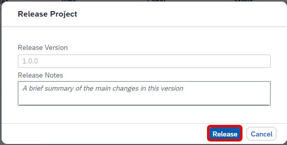

### Publish action project

Once the action project is released, you can then publish any released version of the action by clicking **Publish to Library** from top-right corner.

<!-- border -->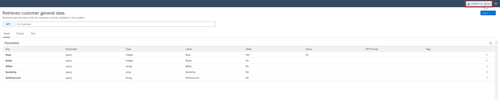

With this you have successfully completed creating, configuring, releasing and publishing of action project. Now you will use this published action to get data for the dropdown in Form.
