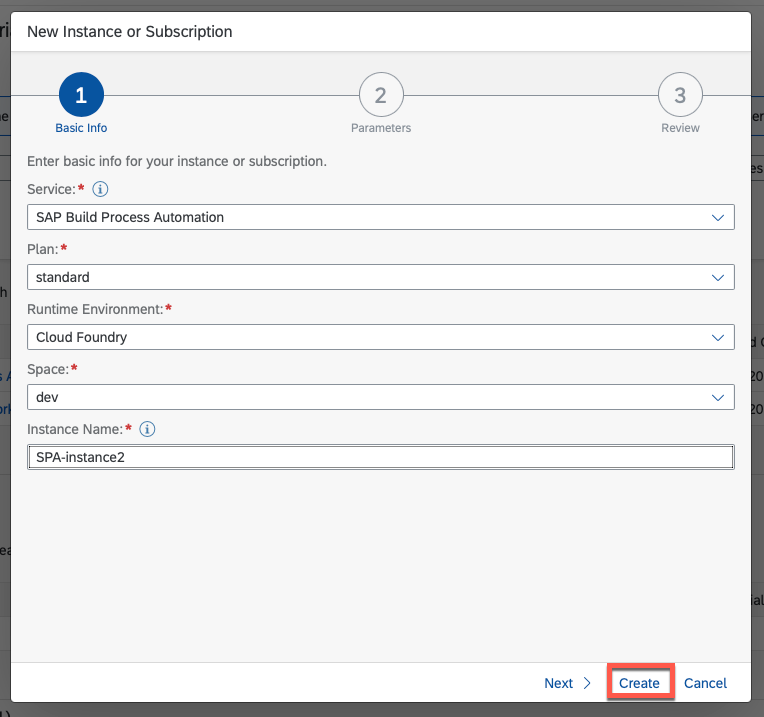
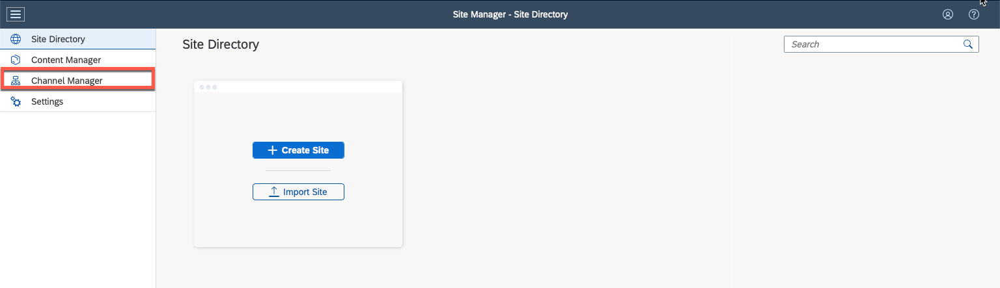
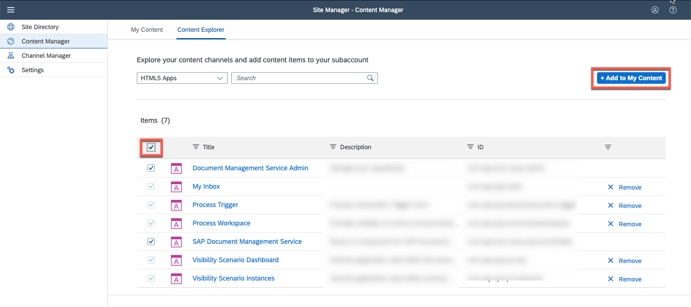
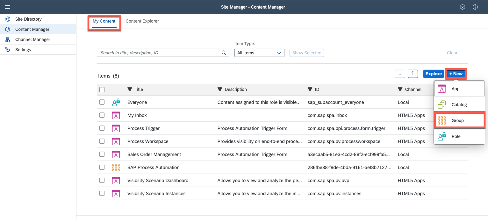
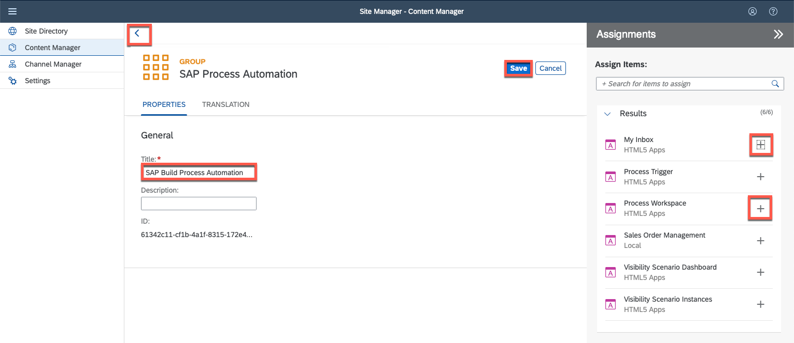
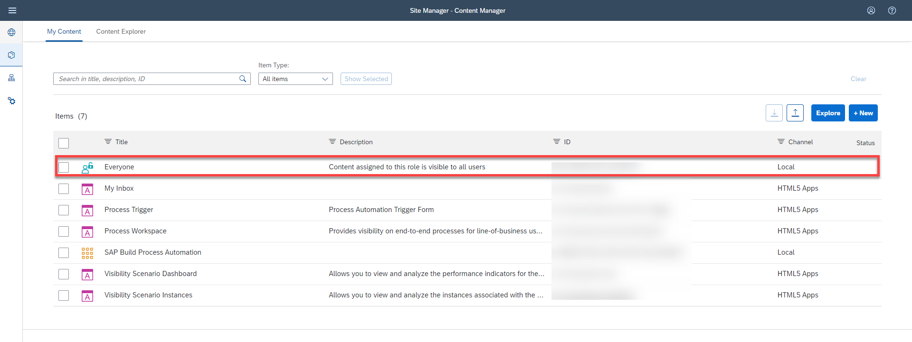
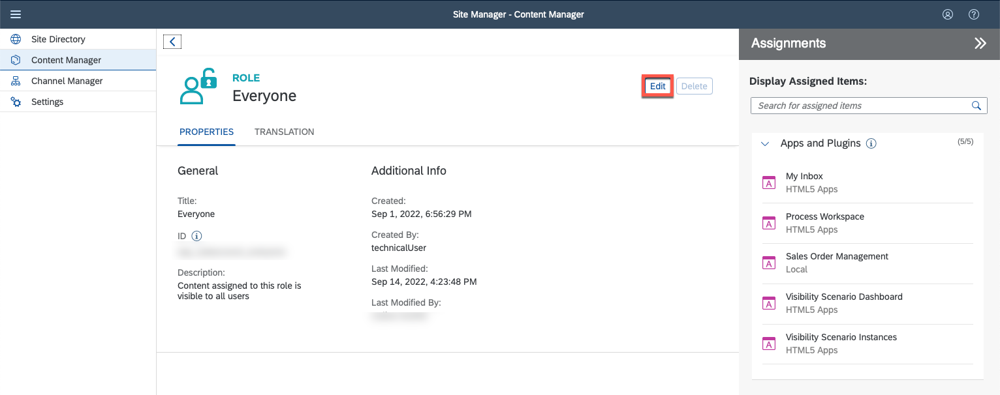
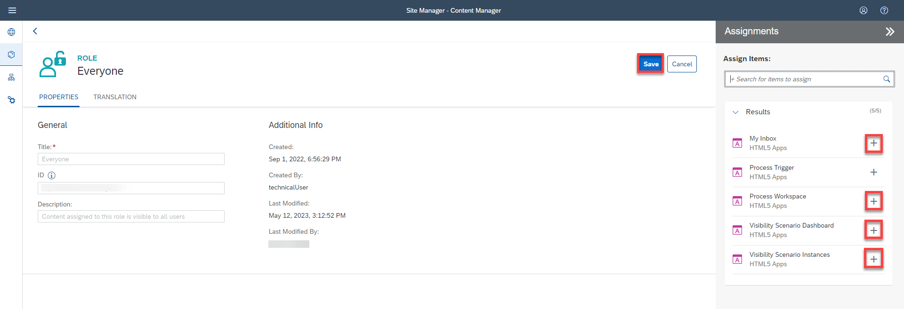

# Configure SAP Build Work Zone, standard edition
<!-- description --> Configure SAP Build Work Zone, standard edition for visibility scenario

## Prerequisites
 - Space in BTP Cockpit subaccount created
 - [Trial account](https://blogs.sap.com/2022/09/09/sap-process-automation-now-available-in-your-trail-account/) with the SAP Build Process Automation enabled **OR**
 - A regular account with [SAP BTP Free Tier](spa-subscribe-booster) service plan for SAP Build Process Automation

## You will learn
  - How to configure SAP Build Work Zone, standard edition in **SAP BTP Cockpit** to gain visibility in your dashboard

## Intro
In this tutorial, you will configure everything needed for the creation of a SAP Build Work Zone, standard edition dashboard in **SAP BTP Cockpit** to gain visibility of your processes.

---

### Subscribe to the SAP Build Work Zone, standard edition

1.  Navigate to **SAP BTP Cockpit** subaccount and select **Instances and Subscription** under Services. Choose **Create**.

    <!-- border -->

2. For the new subscription:
    - Under Service select **SAP Build Work Zone, standard edition**.
    - Under Plan select **standard** as subscription.
    - Choose **Create**.

    <!-- border -->

3. The subscription is created.
   
    <!-- border -->   

### Assign roles for SAP Build Work Zone, standard edition

1. Navigate to **SAP BTP Cockpit** subaccount > **Security** > **Users**.

    <!-- border -->

2.  Select the user to whom you will give the roles then on **Enter Full-Screen Mode** .

    <!-- border -->

3.  Choose **Assign Role Collection**.

    <!-- border -->

4.  Select **Launchpad Admin** and **Launchpad External User** then choose **Assign Role Collection**. 

    > **Launchpad Admin** is the role for whom is going to design the launchpad in the launchpad editor. Launchpad Admin should not be given to all users for security purposes.
    
    > **Launchpad external** user is the role for whom accesses the final launchpad. 

    <!-- border -->

    The roles are assigned.

    <!-- border -->
  

### Create SAP Build Process Automation instance

1.  Navigate to **SAP BTP Cockpit** subaccount. Select **Services** > **Instances and subscriptions**. Choose **Create**.

    <!-- border -->  

2.  For the new instance:
    -  Select **SAP Build Process Automation** as a **Service**.
    -  Select **standard** plan from the **Plan** list.
    -  Select **Cloud Foundry** as **Runtime Environment**.
    -  Select a space from **Space** list.
    -  Set **Instance Name** as **SPA-instance**.
    -  Choose **Create**. 

    <!-- border -->

3. The instance was added.

    <!-- border -->

### Create a new destination

1.  Navigate to **SAP BTP Cockpit** subaccount > **Connectivity** > **Destinations**.

2.  To create a new destination:
    -  Choose **New Destination**.
    -  Select **Service Instance**.
    -  Set **Service Instance** to **SPA-instance** that was created in the previous step.
    -  Set **Name** to **spa-launchpad**.
    -  Choose **Next**.

    <!-- border --> 

3.  Choose **Save**. 

    <!-- border --> 

4. The new destination was created.

    <!-- border --> 

### Open and manage SAP Build Work Zone Application

1.  Navigate back to **SAP BTP Cockpit** subaccount. Choose **Services** then **Instances and Subscriptions**. Choose **Go to Application** next to **SAP Build Work Zone**.

    <!-- border --> 

2. The Site Manager is now ready to use. Select **Channel Manager**.

    <!-- border -->

3.  Choose **Update Content**.

    <!-- border -->
    
    > The content updates and the status changes to Activated.

4.  Select **Content Manager**. On the top tabs select **Content Explorer** and then select **HTML5 Apps**.

    <!-- border -->

5.  Select all items and click **+ Add to My Content**.

    <!-- border -->

6.  Navigate to **My Content**. Choose **New** and select **Group**.

    <!-- border -->

7.  Manage the Group:
    - Set **Title** to **SAP Build Process Automation**.
    - Click on the search field to display item results.
    - Assign **My Inbox** and **Process Workspace** to the group.
    - Choose **Save**.
    - Go back. 

    <!-- border -->

8.   Select **Everyone** item to edit it.

    <!-- border -->

9.   Select **Edit** to edit role.

10. Click on the search field to display item results.

    <!-- border -->

10.  Manage changes:

    - Assign **My Inbox**, **Process Workspace**, **Visibility Scenario Dashboard** and **Visibility Scenario Instances** to **Everyone** role.
    - Choose **Save**.

    <!-- border -->

---
