# Configure OAuth in Google Cloud Platform
<!-- description --> Configure OAuth Client ID in Google Cloud Platform

## Prerequisites
- a Google Cloud account

## You will learn
 - How to configure a OAuth Client ID in Google Cloud Platform

## Intro
> **IMPORTANT:** Please refer to sample **How to use Google Workspace** in the SAP Build Store if you face any issues while following the tutorials. To retrieve the sample refer to **step 4** of [Use Google Workspace to create Google Slides](spa-use-google-workspace-slides).

OAuth 2.0 is an industry standard, token-based user authorization mechanism. The client must be registered through Google cloud console and the JSON credential file which contains Client ID and Client secret should be downloaded to a safe location. 

In this tutorial, you will configure OAuth Client ID credentials in Google Cloud Platform and enable the Google APIs to automate all the Google Applications in SAP Build Process Automation.

---

### Create a project in Google Cloud Platform

Google Cloud projects form the basis for creating, enabling and using all Google Cloud services including managing APIs, enabling billing, adding, and removing collaborators, and managing permissions for Google Cloud resources.

1. Go to the [Manage resources page](https://console.cloud.google.com/cloud-resource-manager?walkthrough_id=resource-manager--create-project&start_index=1&_ga=2.21640123.1819912150.1682583128-628197328.1670227849#step_index=1) in Google Cloud console.

2. On the Select organization drop-down list at the top of the page, select the organization resource in which you want to create a project. If you are a free trial user, skip this step, as this list does not appear.

3. Click Create Project.

    <!-- border -->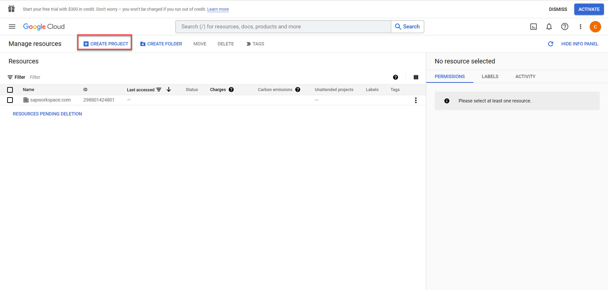

4. In the **New Project** window that appears, enter a project name and select a billing account as applicable. A project name can contain only letters, numbers, single quotes, hyphens, spaces, or exclamation points, and must be between 4 and 30 characters.

5. Select an **Organisation**. If No organization is an option, you can select it to create your new project as the top level of its own resource hierarchy.

5. Enter the parent organization or folder resource in the **Location** box. That resource will be the hierarchical parent of the new project. 

6. When you're finished entering new project details, click **Create**.

    <!-- border -->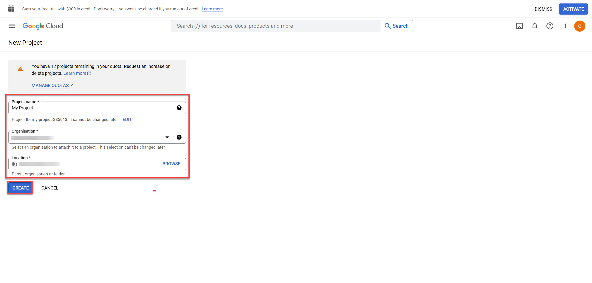

### Enabling Google APIs in API library

In Google Cloud Platform (GCP), it is mandatory to enable the Google services which will be automated by SBPA. Services such as Google Drive, Gmail, and Google Sheets must be enabled in GCP.

1. Go to the [Google Cloud console API Library page](https://console.cloud.google.com/project/_/apis/library?_ga=2.56326955.1819912150.1682583128-628197328.1670227849).

2. Select the Cloud project where you want to enable an API by performing one of the following:

    - Click on the Cloud project under **Select a recent project**.

    <!-- border -->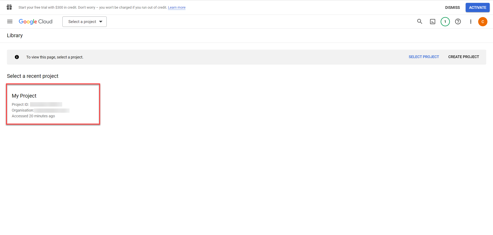

    - Use the Cloud project browser by performing the following steps:

        - Click **Select a project** to open the Cloud project browser.
        - Find your project and then click on the Cloud project name.
        - Click **Open** to open the project.

    <!-- border -->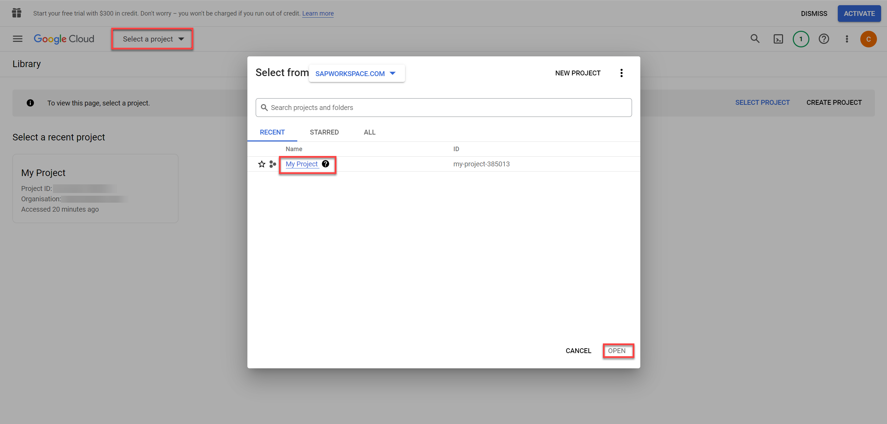     

3. Click the API you want to enable. If you need help finding the API, use the Search for APIs & Services box near the top of the page. A page describing the API appears.

    For the purpose of this tutorial, you will enable Google Drive API, Gmail API and Google Calendar API.

4. Search for **Google Drive API** and hit enter.

    <!-- border -->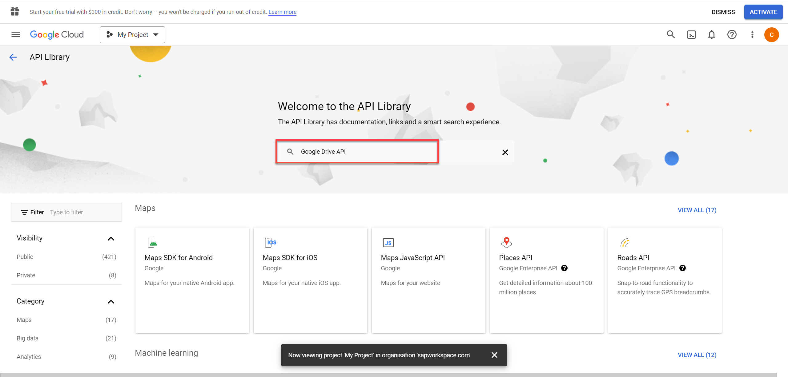  

5. Select **Google Drive API**.

    <!-- border -->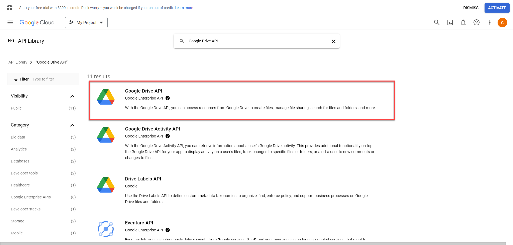  

5. Click the **Enable** button.

    <!-- border -->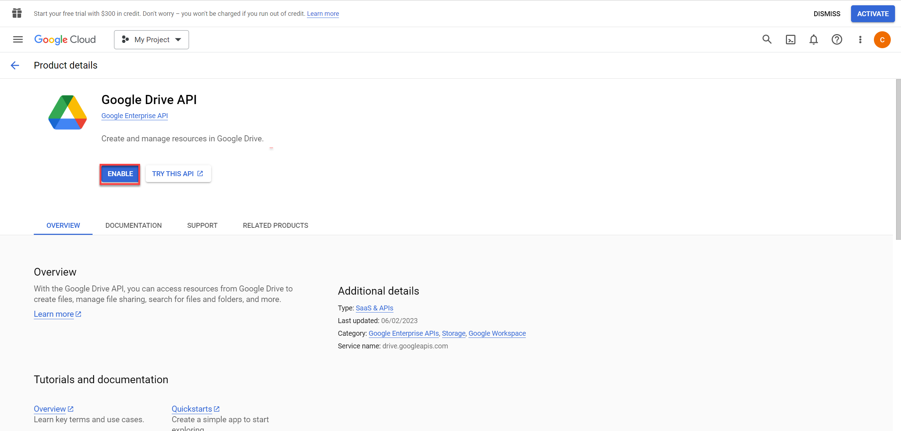 

    Once the API is enabled, you may add other APIs as required.

6. Choose **Library**.

    <!-- border -->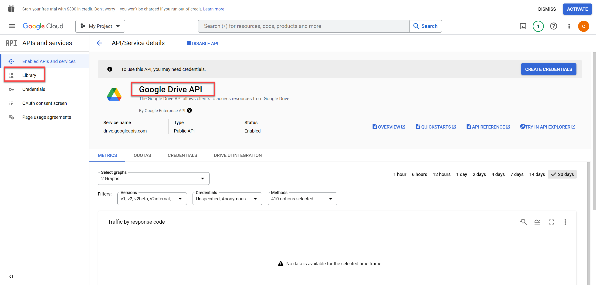 

7. Repeat the above steps to enable Gmail API and Google Calendar API. You may also enable Google Sheets API, Google Slides API, Google Docs API depending on your use case.

### Configuring the OAuth Consent Screen

To configure the OAuth consent screen, refer to the following steps:

1. Select **OAuth consent screen**.

2. Choose the **User Type** as **Internal** if your app is to be used by only the users within your organization. 

    In this mode, it will be limited to Google Workspace users within your organization. You will not need to submit your app for verification.

3. Choose **Create**.

    <!-- border -->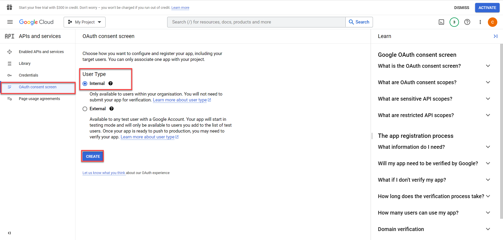 

    > **CAUTION**: On the other hand, if you are a free trial user, please select **External** as **User Type**. 

    In this mode, the app will be available to any user with a Google Account. Your app will start in testing mode and will only be available to users you add to the list of test users. Once your app is ready to push to production, you may need to verify your app. 

    <!-- border -->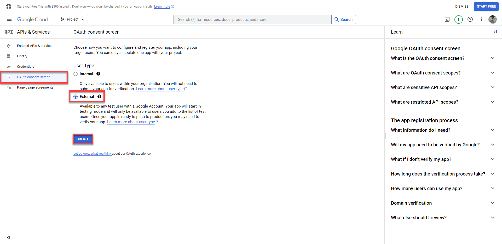 

4. Setup OAuth consent screen with information like app name, user support email, app logo, app domain, and developer contact info.

    <!-- border -->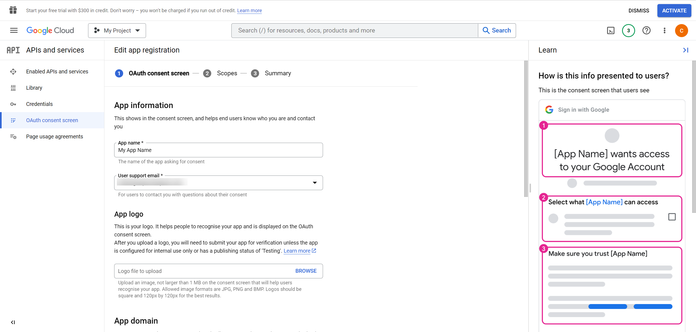 

5. Once you are done, choose **Save and Continue**.

6. You may specify the Gmail scopes here.

7. Choose **Save and Continue**.

    <!-- border -->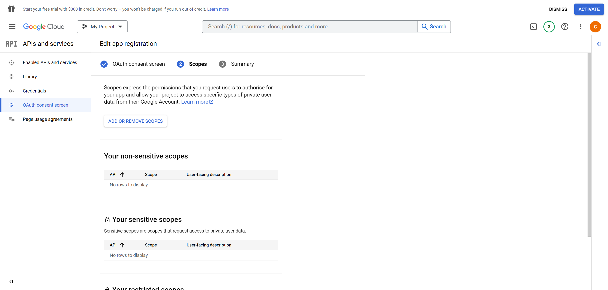 

8. If you are an **External User**, please add here the list of test users that will be able to access your app. 

9. Once you are done adding the test users, click on **Save and Continue**.

    <!-- border -->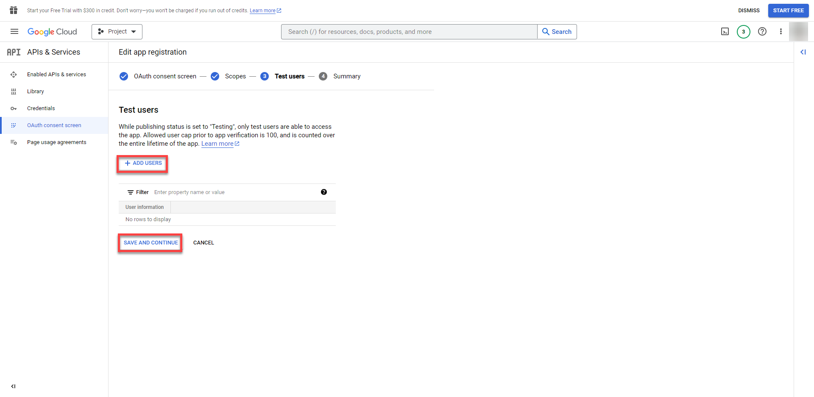 

### Configuring the OAuth Client ID Credentials

To create OAuth client ID credentials, refer to the following steps:

1. Select **Credentials**.

2. Choose **+ Create Credentials** and select **OAuth client ID**.

    <!-- border -->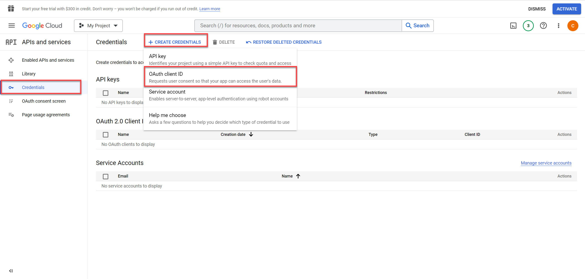 

3. Select **Application type** as **Desktop app** as SBPA Desktop Agent is the client here.

    <!-- border --> 

4. Provide the desired name.

5. Choose **Create**.

    <!-- border -->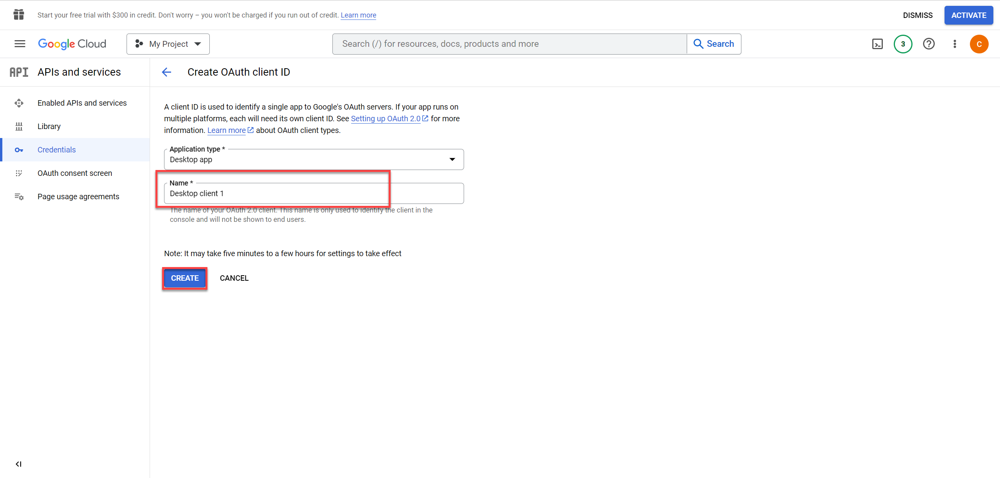 

6. Download the JSON file. For SBPA, the path to the JSON file with the OAuth client ID details should be provided as input to **Authorize Google (OAuth Client ID)** activity.

    <!-- border -->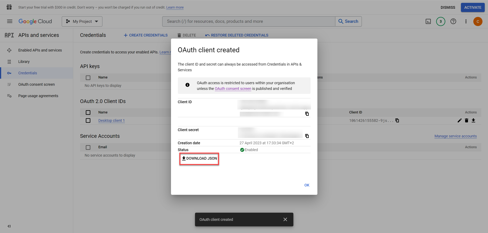 

    With this you have completed setting up OAuth Client ID and you may use the Authorize Google (OAuth Client ID) activity in SAP Build Process Automation.

   

 

