# Configure SAP Build Work Zone, Standard Edition
<!-- description --> Configure SAP Build Work Zone, standard edition for visibility scenario

## Prerequisites
 - Space in BTP Cockpit subaccount created (with a Free Tier and a Free Trial account, space is automatically created)
 - [A SAP BTP Free Trial or Free Tier account](spa-subscribe-booster) with SAP Build Process Automation enabled

## You will learn
- How to configure SAP Build Work Zone, standard edition in **SAP BTP Cockpit** to gain visibility in your dashboard

## Intro
In this tutorial, you will configure everything needed for the creation of a SAP Build Work Zone, standard edition in **SAP BTP Cockpit** to gain visibility of your processes.

---

### Subscribe to SAP Build Work Zone, standard edition

[OPTION BEGIN [Free Trial]]

1.  Navigate to **SAP BTP Cockpit** subaccount and select **Service Marketplace** under Services.
   
2.  Search for **SAP Build Work Zone, standard edition** and click on the tile.
    
    <!-- border -->

3.  Choose **Create**.

    <!-- border -->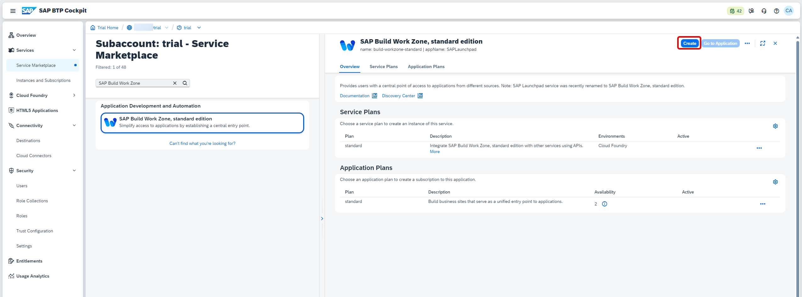

4. For the new subscription:
    - Under Plan, select **standard** as subscription.
    - Choose **Create**.

    <!-- border -->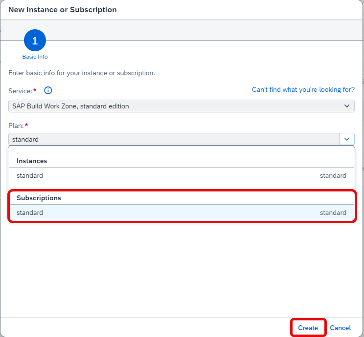

5. The subscription is created.
   
    <!-- border -->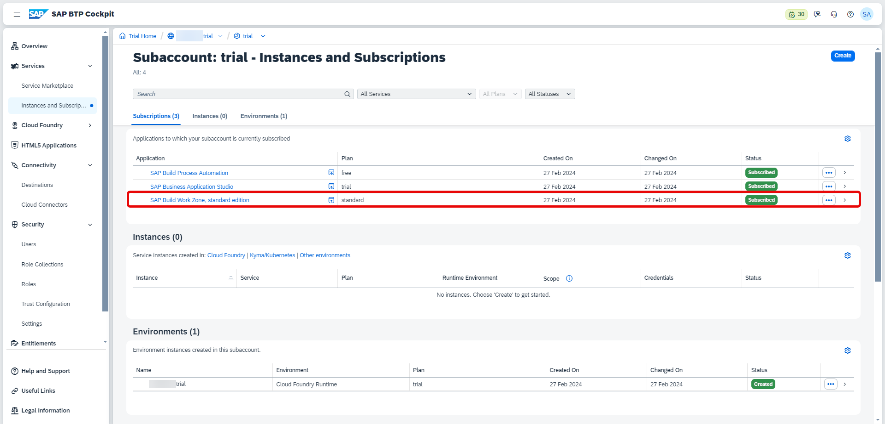 

[OPTION END]

[OPTION BEGIN [Free Tier]]

When you subscribe to SAP Build Process Automation with Free tier, SAP Build Work Zone, standard edition is not available in **Service Marketplace** by default unlike the Trial account.

Hence you need to manually add SAP Build Work Zone, standard edition entitlement to your subaccount.

1. Navigate to **SAP BTP Cockpit** subaccount and select **Entitlements**. Choose **Edit**.

    <!-- border -->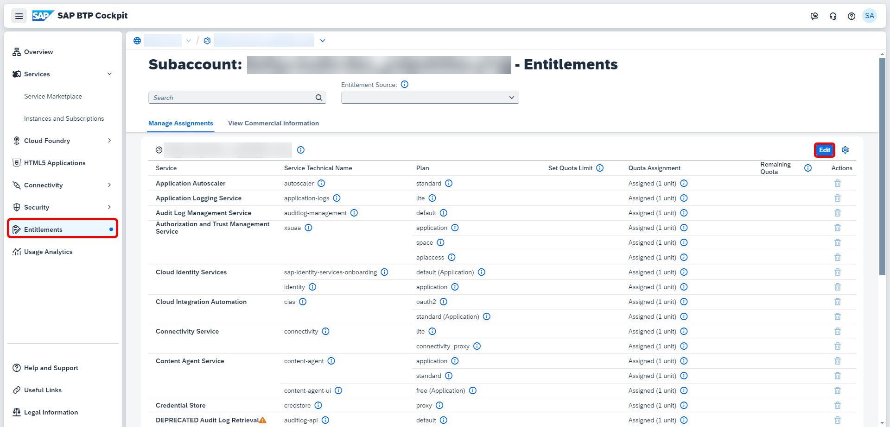

2. Choose **Add Service Plans**.

    <!-- border -->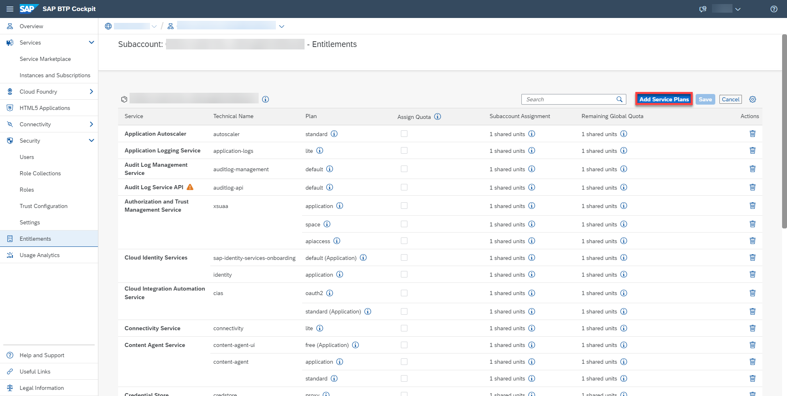

3. Search and select **SAP Build Work Zone, standard edition**.

4. Choose **free (Application)**.

5. Click on **Add 1 Service Plan**.

    <!-- border -->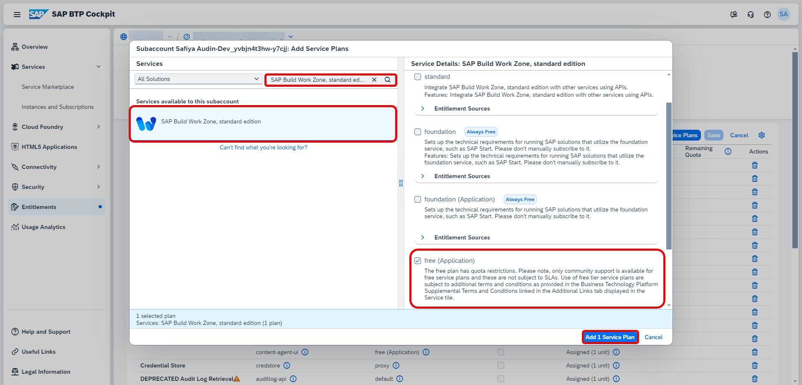

6. Choose **Save**.

    <!-- border -->

7. Select **Instances and Subscriptions** under Services. Choose **Create**.

    <!-- border -->

8. For the new subscription:

    - Under Service, select **SAP Build Work Zone, standard edition**.
    
    > You will notice under Plan that the subscription is **free**.

    - Choose **Create**.

    <!-- border -->

9.  The subscription is created.
   
    <!-- border --> 

[OPTION END]

### Create SAP Build Process Automation Instance

> **CAUTION**: If you are using a Free Tier account and subscribed to SAP Build Process Automation through Booster, please skip this step. The instance is automatically created through the Booster.
 
<!-- border --> 

However, if you are using a Free Tier account and subscribed to SAP Build Process Automation manually, please follow this step as the instance is not created automatically.

Since there are two products for SAP Build Work Zone, make sure to mention standard edition without fail.

After creating a subscription for SAP Build Work Zone, standard edition in your subaccount, you must now create an SAP BTP service instance for SAP Build Work Zone, standard edition to run in.

1.  Navigate to **SAP BTP Cockpit** subaccount. Select **Services > Instances and Subscriptions**. Choose **Create**.

    <!-- border -->  

2.  For the new instance:
    -  Select **SAP Build Process Automation** as a **Service**.
    -  Select **standard** plan from the **Plan** list.
    -  Select **Cloud Foundry** as **Runtime Environment**.
    -  Select a space from **Space** list.
    -  Set **Instance Name** as **SPA-instance**.
    -  Choose **Create**. 

    <!-- border -->

3. The instance was added.

    <!-- border -->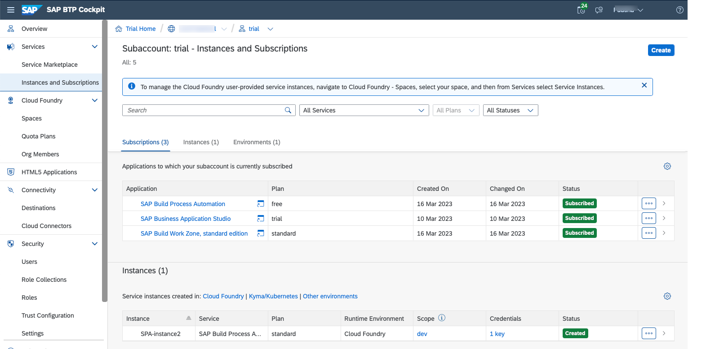

### Create a Service Key for the SAP Build Process Automation Instance

You can use service keys to generate credentials to communicate directly with a service instance. Once you configure them for your service, local clients, apps in other spaces, or entities outside your deployment can access your service with these keys.

> **CAUTION**: If you are using a Free Tier account, please skip this step. The service Key is automatically created.
  
<!-- border --> 

1. In your SAP BTP subaccount, under **Services > Instances and Subscriptions**, select the instance that you created above.

    <!-- border -->

2. On the details screen that opens, choose **Service Keys > Create**.

    <!-- border -->

3. On the creation screen, enter any name for your service key.

4. Optional. Upload a JSON file.

5. Choose **Create**.

    <!-- border -->

    The service key is created and you can view the credentials. 

    <!-- border -->

6. Once you open it, download the json file.

    > You will need these credentials to configure destinations.

    <!-- border -->

### Configure SAP Build Process Automation Destination

[OPTION BEGIN [Free Trial]]

Before developing with SAP Build Process Automation or for configuring SAP Build Work, standard edition for use with SAP Build Process Automation, you must create an SAP BTP destination for your subaccount.

> You have created a service instance and service key for SAP Build Process Automation and noted down the service key credentials for configuring this destination.

1. Choose **Connectivity > Destinations > Create Destination**.

    <!-- border -->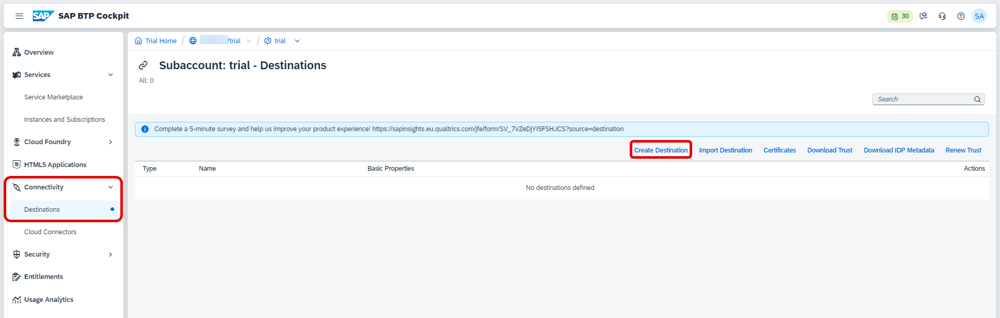

2. Choose **Blank Template**, and enter the following details from the downloaded json file:

    > **CAUTION:** When copying the values for URL, Client ID, Client Secret and Token Service URL, please select the values without the quotes and paste them in the destination template. 

    |  **Field**    | **Value**
    |  :------------- | :-------------
    | Name      |  `sap_process_automation_service`
    | Type       | HTTP
    | Proxy Type       | Internet
    | Authentication      | `OAuth2ClientCredentials`
    | URL      |    `<"endpoints"."api">`
    | Client ID       | `<"uaa"."clientid">`
    | Client Secret | `<"uaa"."clientsecret">`
    | Token Service URL | `<"uaa"."url">` add /`oauth`/token
    
    For your values, please refer to screenshot below:

    <!-- border -->

3. Add additional properties copied from the service key:

    > **CAUTION:** When copying the values for`saasregistryenabled`, `sap.cloud.service` and `sap.cloud.service.alias`, please select the values without the quotes.

    |  **Field**    | **Value**
    |  :------------- | :-------------
    |  `endpoints`        | `endpoints` copy the whole JSON structure including `{` and `}`
    |  `html5-apps-repo`       | `html5-apps-repo` copy the whole JSON structure including `{` and `}`
    |  `saasregistryenabled`        | `saasregistryenabled`
    |  `sap.cloud.service`        | `sap.cloud.service`
    |  `sap.cloud.service.alias`        | `sap.cloud.service.alias`

    For your values, please refer to the screenshot below:

    <!-- border -->

4. **Save** your changes.

    <!-- border -->

5. Test the destination by selecting **Check Connection**.

    <!-- border -->

[OPTION END]

[OPTION BEGIN [Free Tier]]

With a Free Tier account, if you have subscribed with SAP Build Process automation using Booster, the destination needed is automatically created.

1. Choose **Connectivity > Destinations**.

2. Select the destination called `sap_process_automation_service`. This destination authenticates with `OAuth2ClientCredentials`.

3. Check the connection.

    <!-- border -->

[OPTION END]

### Assign roles for SAP Build Work Zone, standard edition

Once you have created a destination, you must now assign roles to any user who needs access to that destination (including your own user account).

1. Navigate to **SAP BTP Cockpit** subaccount > **Security** > **Users**.

    <!-- border -->

2.  Select the user to whom you will give the roles then on **Enter Full-Screen Mode** .

    <!-- border -->

3.  Choose **Assign Role Collection**.

    <!-- border -->

4.  Select **Launchpad Admin** and **Launchpad External User** then choose **Assign Role Collection**. 

    > **Launchpad Admin** is the role for whom is going to design the Business Site in the Business Site editor. Launchpad Admin should not be given to all users for security purposes.
    
    > **Launchpad external user** is the role for whom accesses the final Business Site. 

    <!-- border -->

    The roles are assigned. 

    <!-- border -->

### Open and manage SAP Build Work Zone Application

1.  Navigate back to **SAP BTP Cockpit** subaccount. Choose **Services** then **Instances and Subscriptions**. Choose **Go to Application** next to **SAP Build Work Zone, standard edition**.

    <!-- border --> 

2. In the Site Directory, click the **+ Create Site** button.
   
3. Enter a site name of your liking such as **SPA Launchpad**.

    <!-- border -->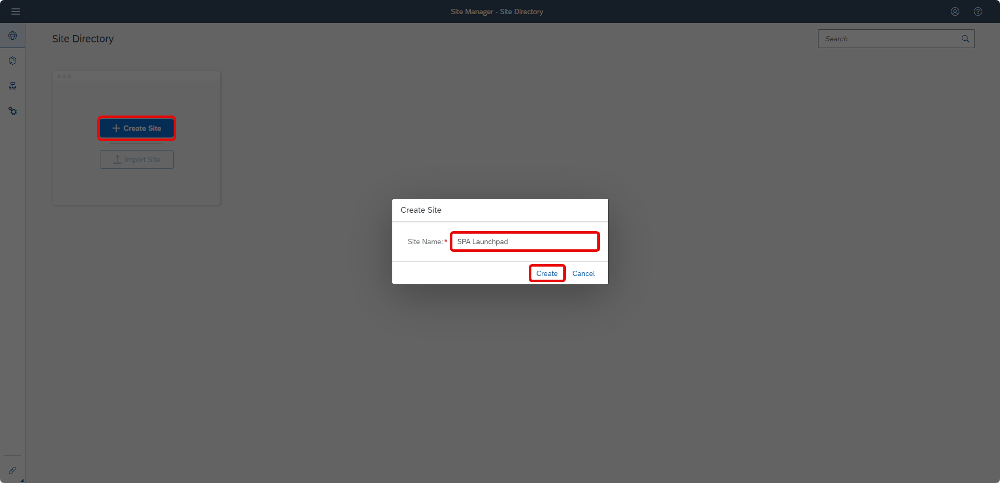 
   
4. The Site Editor opens. Navigate back to **Settings**.

    <!-- border -->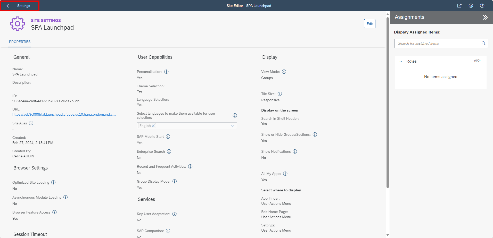 
   
5. Your site gets created in the Site Directory.
   
6. The Site Manager is now ready to use. Select **Channel Manager**.

    <!-- border -->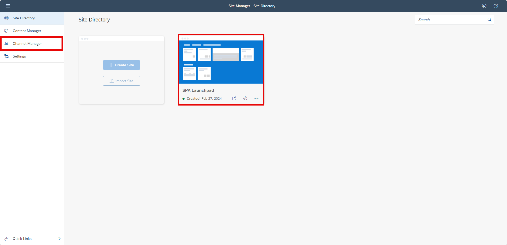

7.  Choose **Update Content**.

    <!-- border -->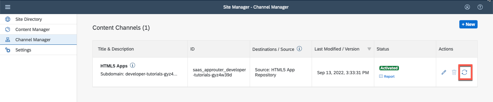
    
    > The content updates and the status changes to Updated.

8.  Select **Content Manager**. On the top tabs select **Content Explorer** and then select **HTML5 Apps**.

    <!-- border -->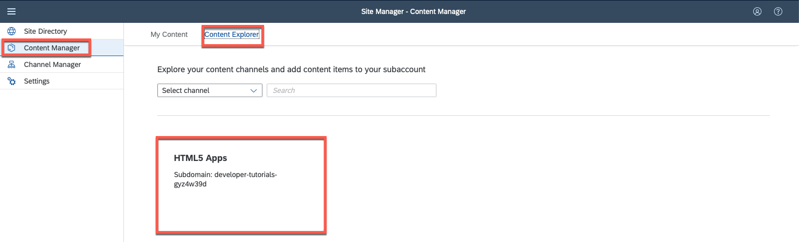
    
    <!-- border -->

9.  Select all items and choose **Add**.

    <!-- border -->

10. Navigate to **Content Manager**. Choose **Create** and select **Group**.

    <!-- border -->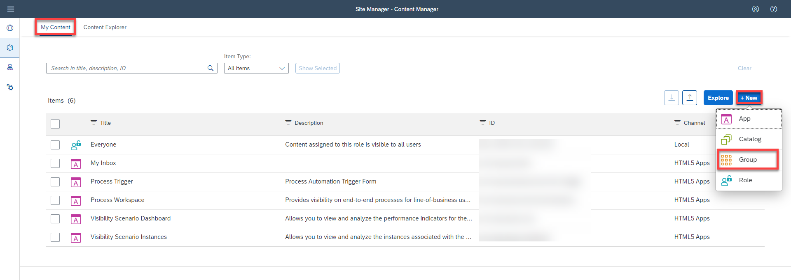
    
    <!-- border -->

11. Manage the Group:
    - Set **Title** to **SAP Build Process Automation**.
    - Assign **My Inbox** and **Process Workspace** to the group.
    - Choose **Save**.
    - Go back to **Content Manager**. 

    <!-- border -->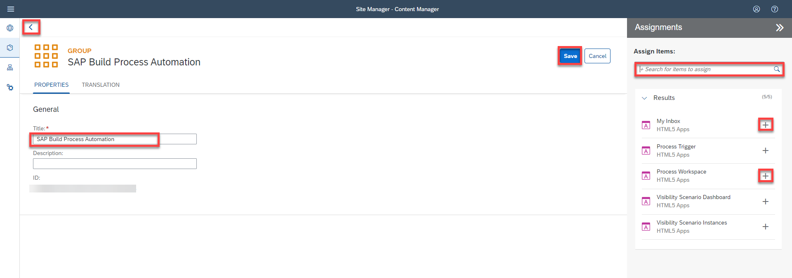

12. Select **Everyone** item to edit it. Select **Edit** to edit role.

    <!-- border -->

    <!-- border -->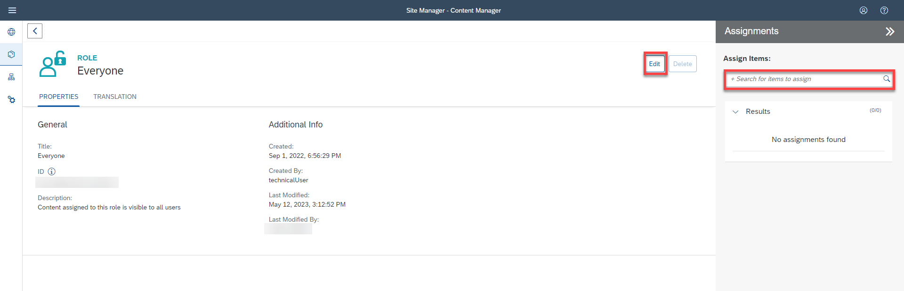

13. Manage changes:

    - Assign **My Inbox**, **Process Workspace**, **Visibility Scenario Dashboard** and **Visibility Scenario Instances** to **Everyone** role.
    - Choose **Save**.

    <!-- border -->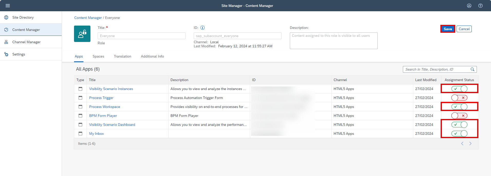

---
