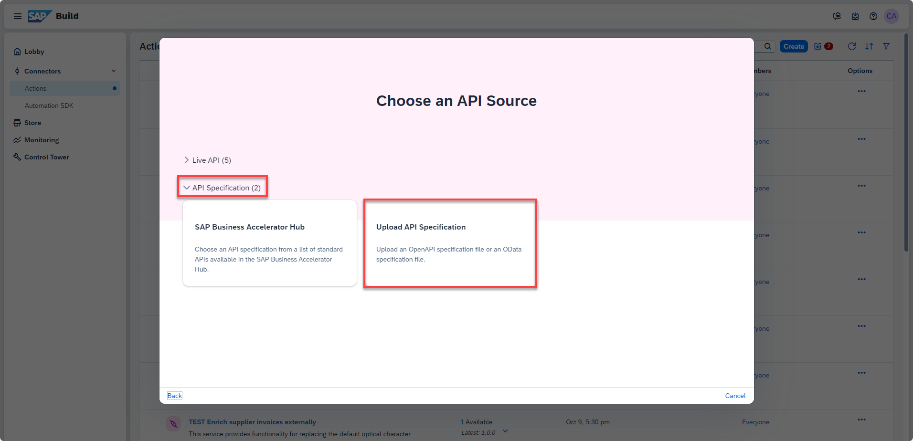
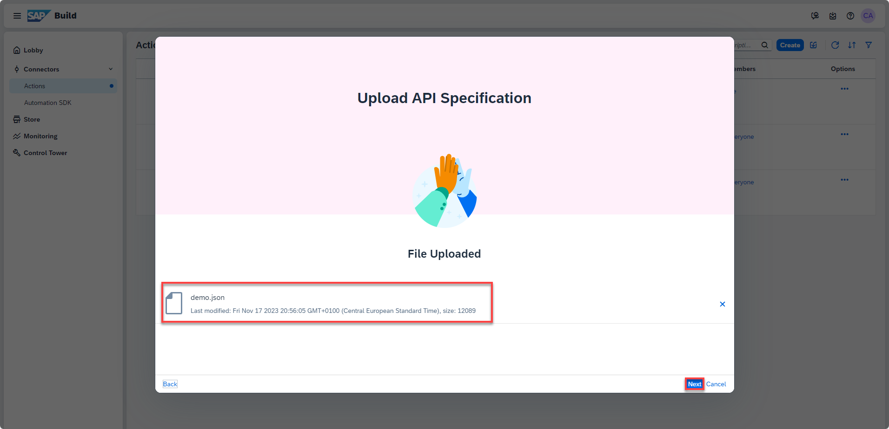

# Create Action Project for simple CAP Service in SAP Build Actions
<!-- description --> Create an action project using the OpenAPI specification of a simple CAP Service

## You will learn
  - to modify the generated OpenAPI specification of a CAP Service
  - to create an action project based on the API specification
  - to test API using a BTP destination 
  - to release and publish the action project to be consumed in a process of SAP Build Process Automation
  
## Prerequisites
- Access to a [SAP BTP tenant with SAP Build Process Automation](spa-subscribe-booster)

---
### Generate the OpenAPI specification

You will generate the openAPI specification for the service used to create the Action project in SAP Build.

1. Navigate back to the Business Application Studio. Open your CAP project and run the following command in the Terminal window:

    ```Shell / Bash
    cds compile srv --service all -o docs --to openapi
    ```

2. In the subfolder `docs` folder, open the file `sap_build_cap_sample_library.openapi3.json`.

    <!-- border -->


### Adjust the OpenAPI specification

 The generated OpenAPI specification needs some manual changes.

1. Update the following **paths** definitions (just replace the lines in the generated file):

    ```JSON
    "/addQuotes(value='{value}')": {    
      "get": {
        "summary": "addQuotes",
        "tags": [
          "Service Operations"
        ],
        "parameters": [
          {
            "required": true,
            "in": "path",
            "name": "value",
            "description": "String value needs to be enclosed in single quotes",
            "schema": {
              "type": "string",
              "default": ""
            }
          }
        ],
        "responses": {
    ```


    ```JSON
    "/getListOfTodos()": { 
    ```


    ```JSON
    "/toInteger(value='{value}')": {    
      "get": {
        "summary": "toInteger",
        "tags": [
          "Service Operations"
        ],
        "parameters": [
          {
            "required": true,
            "in": "path",
            "name": "value",
            "description": "String value needs to be enclosed in single quotes",
            "schema": {
              "type": "string",
              "default": ""
            }
          }
        ],
        "responses": {
    ```

    ```JSON
    "/toNumber(value='{value}')": {    
      "get": {
        "summary": "toNumber",
        "tags": [
          "Service Operations"
        ],
        "parameters": [
          {
            "required": true,
            "in": "path",
            "name": "value",
            "description": "String value needs to be enclosed in single quotes",
            "schema": {
              "type": "string",
              "default": ""
            }
          }
        ],
        "responses": {
    ```

    ```JSON
    "/toStr(value={value})": {
      "get": {
        "summary": "toString",
        "tags": [
          "Service Operations"
        ],
        "parameters": [
          {
            "required": true,
            "in": "path",
            "name": "value",
            "schema": {
              "anyOf": [
                {
                  "type": "number",
                  "format": "double,null"
                },
                {
                  "type": "string"
                }
              ],
              "example": 3.14,
              "nullable": true,
              "default": ""
            }
          }
        ],
        "responses": {
    ```

2. Add **required: true** for **components/schemas** schema definition of **DataListArray**.

    ```JSON
        "sap_build_cap_sample_library.DataListArray": {
        "title": "DataListArray",
        "type": "object",
        "properties": {
            "responseArray": {
            "type": "array",
            "required": true,
            "items": {
                "$ref": "#/components/schemas/sap_build_cap_sample_library.DataList"
            }
    ```

3. Select the file content **Ctrl-a** in the editor and copy to your clipboard **Ctrl-c**.

4. Create a new file called **demo.json** in a local folder of your desktop.

5. Open the file, paste the content and save the file. You will use the file later to create the Action Project.

    Here below, a screenshot with parts how the file will look like:

    <!-- border --><div>&nbsp;</div>


### Create action project

1. Open **SAP Build** Lobby, under **Connectors**, select **Actions**.

    <!-- border -->

2. Choose **Create**.

    <!-- border -->

3. In the **Choose an API Source** popup, under API Specification, select **Upload API Specification**.

    <!-- border -->

4. Drag and drop or click **Browse Files** to upload open specification file downloaded in step above.
   
5. Choose **Next**.

    <!-- border -->

6. In the **Create an Action project** popup:
   
    - Specify the name **`CAP Sample Actions`**
    - Click **Create**

    <!-- border -->

7. Once the action project is created, the action editor will automatically open. In the popup select all actions from the list, click **Add**.

    <!-- border -->

    Your Action Project will contain the actions for the CAP service.

    <!-- border --><div>&nbsp;</div>


### Test actions

You can test the execution of your action in the Action Editor.

1. Select `listToString` from the list, the action has input parameters

2. Select Tab **Test**
  
       - Choose Destination **Demo_CAP_Sample_Library**

       - enter **id** **`1`**

       - enter **title** **`task1`**

       - enter **field** **`id`** 

       - Click **Test** 

    <!-- border -->

    >In the Test you can specify only one value for a list. In the Response View you can see that the values are converted to a string (with more than one value they will be comma separated). You can also try **title** as field and check the result.

3. Select `get list of Todos` from the list, click **Output** tab to check that the array is marked as required with `red asterix`

    <!-- border -->

4. Select **Test** tab and click **Test**

    <!-- border -->

5. You can test the other actions (optional)

       - Select **toInteger** from the list, enter value **`10`** and click **Test**

       - Select **toNumber** from the list, enter value **`10.9`** and click **Test**

       - Select **addQuotes** from the list, enter value **`abc`** and click **Test**


### Release and Publish to the Library

To be able to use the Actions in a Process, you have to release and publish the Action Project.

1. Click **Release**

    <!-- border -->

2. Enter release information, click **Release**

    <!-- border -->

3. Click **Publish to Library**

    <!-- border -->

---


