# Create Action Project for simple CAP Service in Lobby
<!-- description --> Create an action project from the Lobby using the OpenAPI specification of a simple CAP Service

## You will learn
  - to modify the generated Open API specification of a CAP Service
  - to create an action project based on the API specification
  - to test API using a BTP destination 
  - to release and publish the action project to be consumed in a process of SAP Build Process Automation
  
## Prerequisites
- [SAP BTP Free Trial Account](https://blogs.sap.com/2022/09/09/sap-process-automation-now-available-in-your-trail-account/)  **OR**
  [SAP BTP Free Tier Account](spa-subscribe-booster) with the SAP Build Process Automation enabled

---
### Adjust the OpenAPI specification

The openAPI spec was generated as part of the previous tutorial [Create simple CAP Service with Node.js using the SAP Business Application Studio](sap-consume-actions-cap-nodejs-service). This definition will be used to create the Action Project in SAP Build and needs some manual changes.

1. In the subfolder **`docs`** folder, open the file **`sap_build_cap_sample_library.openapi3.json`**

    <!-- border -->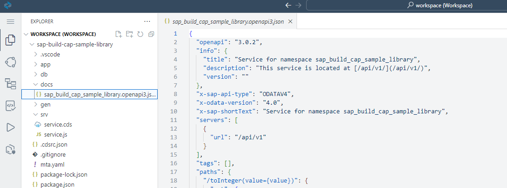

2. Update the following **paths** definitions, add the missing quotes (just replace the lines in the generated file)

    ```JSON
    "/toInteger(value='{value}')": {
    ```
    ```JSON
    "/toNumber(value='{value}')": {
    ```
    ```JSON
    "/addQuotes(value='{value}')": {    
    ```

3. Update the **paths** and **schema** definition for **getListOfTodos** (just replace the lines in the generated file)

    >The output for this action must be set as required, this needs two modifications

       - remove **allOf** for the **paths** definition
  
        ```JSON
        "/getListOfTodos()": {
        "get": {
            "summary": "get list of Todos",
            "tags": [
            "Service Operations"
            ],
            "parameters": [],
            "responses": {
            "200": {
                "description": "Success",
                "content": {
                "application/json": {
                    "schema": {
                        "$ref": "#/components/schemas/sap_build_cap_sample_library.DataListArray"
                    }
                }
                }
            },
            "4XX": {
        ```

       - add **required: true** for **components/schemas** schema definition of **DataListArray**
  
        ```JSON
        "sap_build_cap_sample_library.DataListArray": {
        "title": "DataListArray",
        "type": "object",
        "properties": {
            "responseArray": {
            "type": "array",
            "required": true,
            "items": {
                "$ref": "#/components/schemas/sap_build_cap_sample_library.DataList"
            }
        ```

4. Update the **responses** > **schema** definition
   
    >To get correct output information for the actions just replace the lines in the generated file in each of the following sections

       - **“/toInteger(value='{value}’)”: {**

        ```JSON
        "200": {
        "description": "Success",
        "content": {
            "application/json": {
            "schema": {
                    "$ref": "#/components/schemas/sap_build_cap_sample_library.DataInteger"
            }
            }
        }
        },
        "4XX": {    
        ```

       - **“/toNumber(value='{value}’)”: {**

        ```JSON
        "200": {
        "description": "Success",
        "content": {
            "application/json": {
            "schema": {
                    "$ref": "#/components/schemas/sap_build_cap_sample_library.DataNumber"
            }
            }
        }
        },
        "4XX": {    
        ```

       - **“/toStr(value={value})”: {** and
  
       -  **“/addQuotes(value='{value}’)”: {** and
  
       -  **“/listToString”: {**

        ```JSON
        "200": {
        "description": "Success",
        "content": {
            "application/json": {
            "schema": {
                    "$ref": "#/components/schemas/sap_build_cap_sample_library.DataString"
            }
            }
        }
        },
        "4XX": {
        ```


5. Select the file content **Ctrl-a** in the editor and copy to your clipboard **Ctrl-c**

6. Create a new file called **demo.json** in a local folder of your desktop

7. Open the file, paste the content and save the file. You will use the file later to create the Action Project.


    >Here a screenshot with parts how the file will look like:

    ><!-- border -->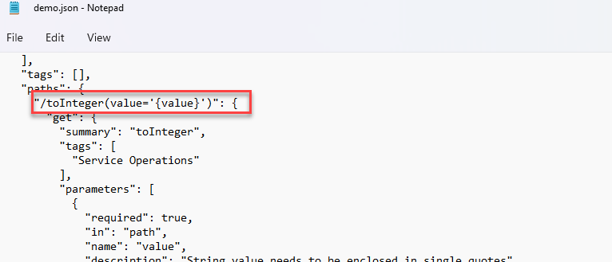<div>&nbsp;</div>


### Create action project

1. From the Lobby of SAP Build click **Create**

    <!-- border -->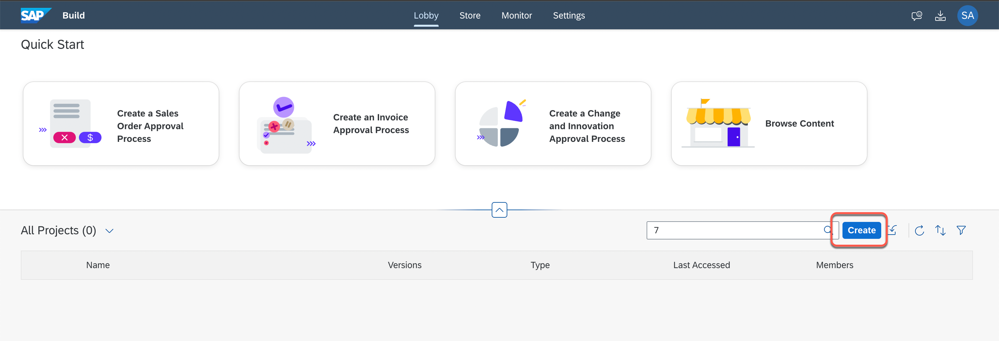

2. In the popup, choose **Build an Automated Process** and then select type **Actions**.

    <!-- border -->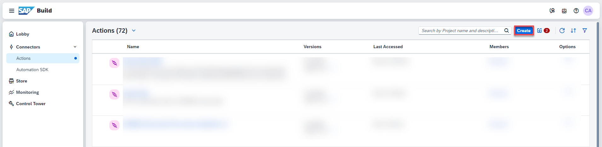

3. Specify the name **`CAP Sample Actions`** and upload the API spec **demo.json**, click **Create**

    <!-- border -->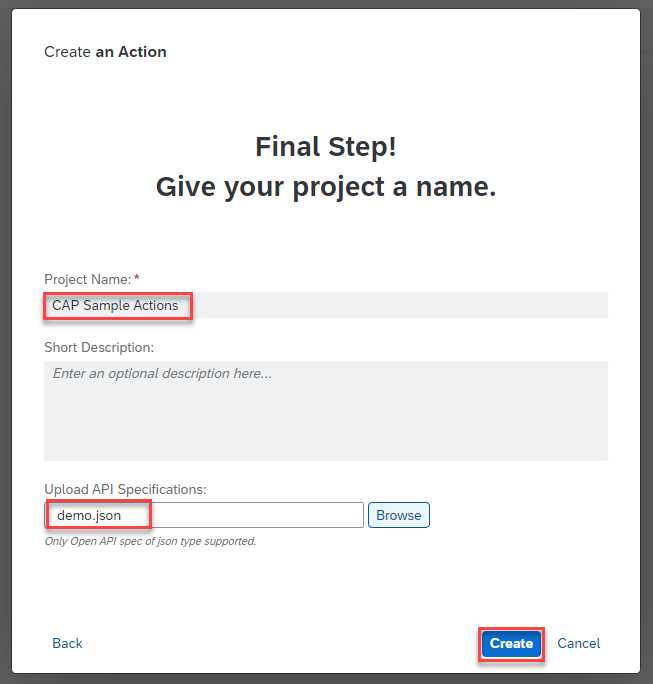

4. Once the action project is created, the action editor will automatically open. In the popup select all actions from the list, click **Add**

    <!-- border -->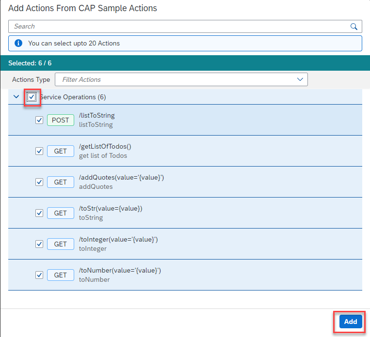

>Your Action Project will contain the actions for the CAP service

><!-- border -->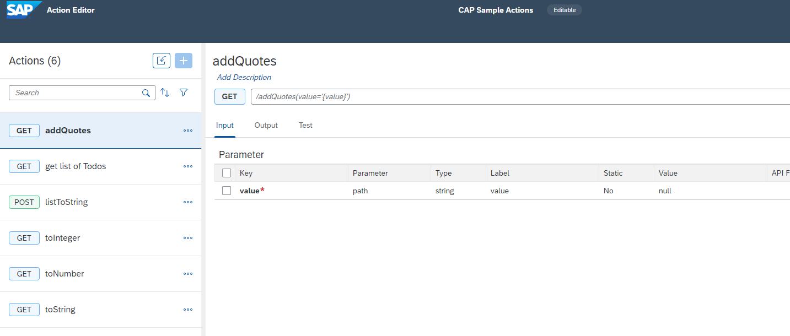<div>&nbsp;</div>


### Test actions

You can test the execution of your action in the Action Editor.

1. Select **listToString** from the list, the action has input parameters

2. Select Tab **Test**
  
       - Choose Destination **Demo_CAP_Sample_Library**

       - enter **id** **`1`**

       - enter **title** **`task1`**

       - enter **field** **`id`** 

       - Click **Test** 

    <!-- border -->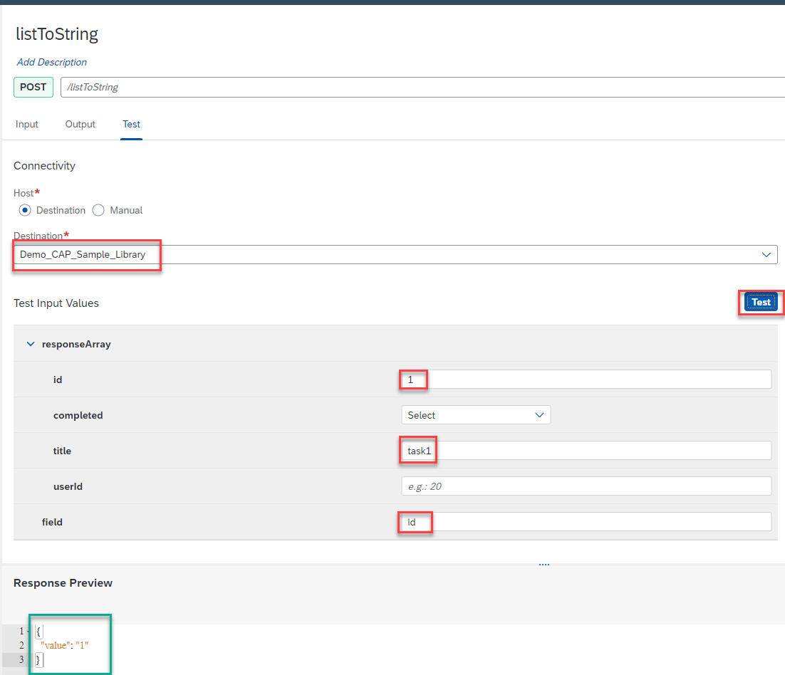

    >In the Test you can specify only one value for a list. In the Response View you can see that the values are converted to a string (with more than one value they will be comma separated). You can also try **title** as field and check the result.

3. Select **get list of Todos** from the list, click **Output** tab to check that the array is marked as required with **red asterix**

    <!-- border -->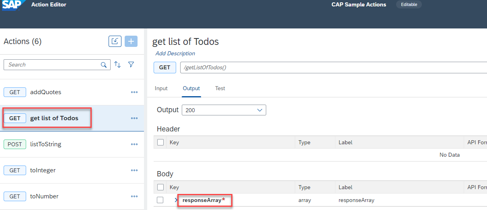

4. Select **Test** tab and click **Test**

    <!-- border -->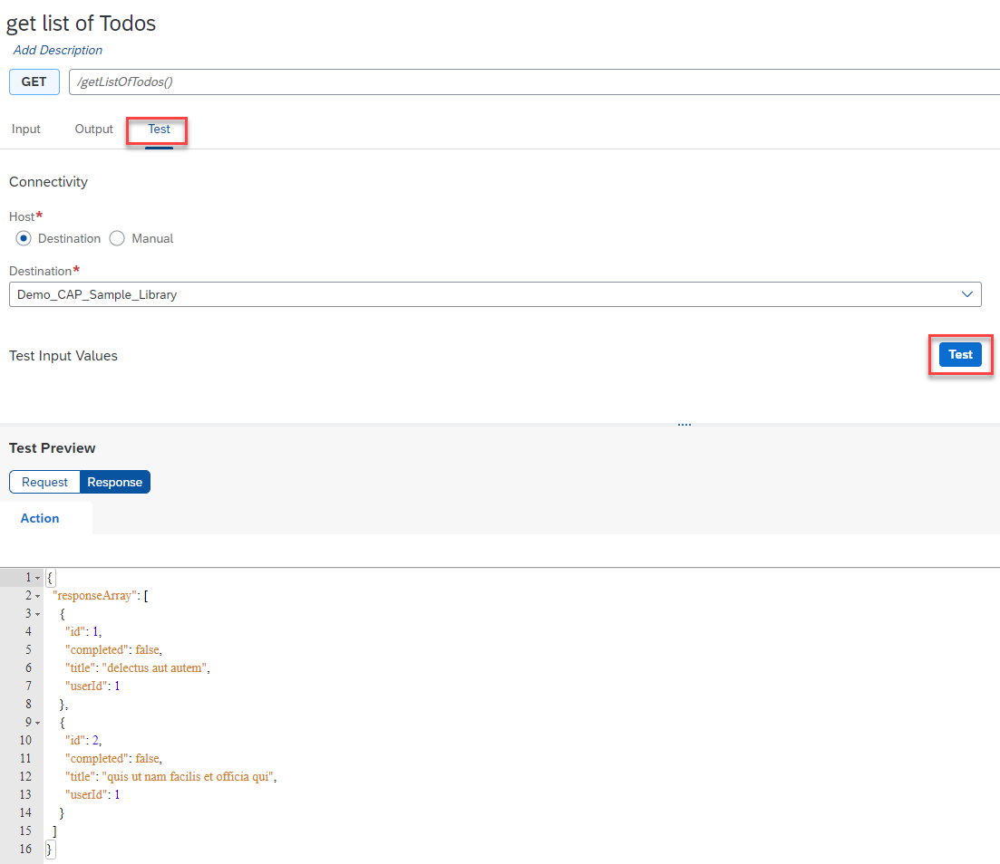

5. You can test the other actions (optional)

       - Select **toInteger** from the list, enter value **`10`** and click **Test**

       - Select **toNumber** from the list, enter value **`10.9`** and click **Test**

       - Select **adQuotes** from the list, enter value **`abc`** and click **Test**


### Release and Publish to the Library

To be able to use the Actions in a Process, you have to release and publish the Action Project.

1. Click **Release**

    <!-- border -->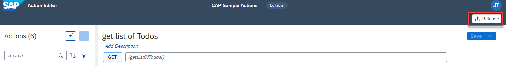

2. Enter release information, click **Release**

    <!-- border -->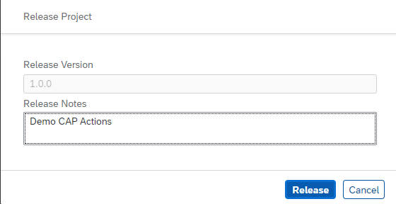

3. Click **Publish to Library**

    <!-- border -->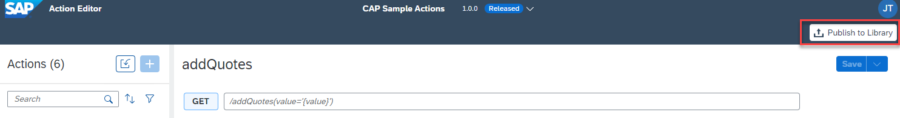


