# Use Action in Business Process
<!-- description --> Learn how to connect to CAP services using Actions in SAP Build Process Automation. Customize or extend standard business processes with additional functionality powered by CAP.

## You will learn
  - How to create and configure a business process
  - How to discover actions from the library
  - How to configure the action for the business process
  - How to release and deploy a business process with actions
  - How to test the process
  

---
### Create Business Process

1. From the Lobby select **Create**

2. Select **Build an Automated Process**, on next screen click **Business Process**

3. Enter Project Name **`CAP Sample`** and click **Create**

4. On the **Create Process Dialog**, enter the Process Name **`myCAP Sample`** and click **Create**, the canvas will be shown

6. Click the canvas to display the **Process Details**

       - Click **Inputs** to define the process inputs

       - Click **Configure** to define to open popup **Configure Process Inputs** 
  
       - Click **Add Input**

       - Enter **`field`** as **Name**, Identifier will be auto filled and **Type** should be **`String`**

       - Click **Apply**

    <!-- border -->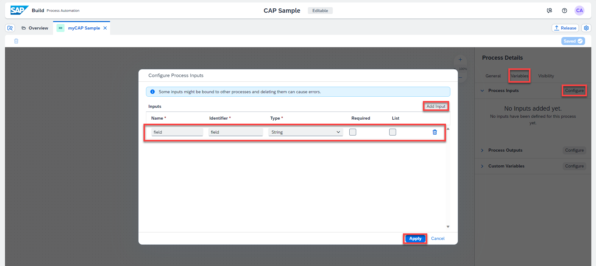

### Add Trigger

1. Click **+** to add a new API trigger to your process

    <!-- border -->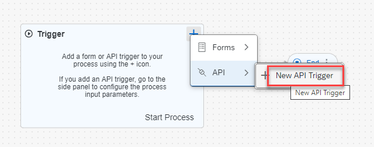

2. Enter Trigger Name **`myCAP Trigger`** and click **Create**

    <!-- border -->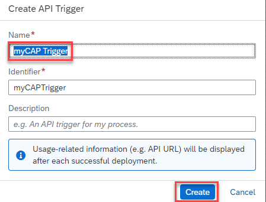

### Add Actions

1. Click **+** to add a step to your process, from the context menu select **Actions** > **Browse Library**

    <!-- border -->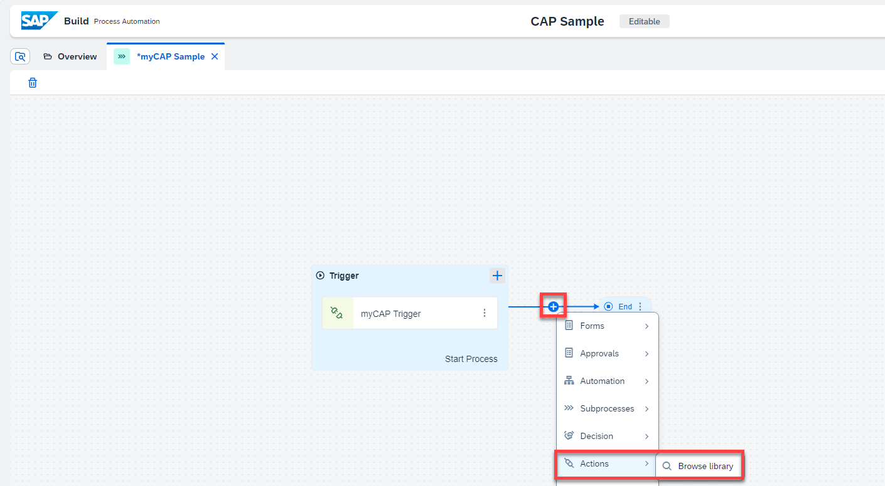

2. From **Browse Library**
   
    - Filter on project **CAP Sample Actions** 
  
    - Click **Add** on the action **`get list of Todos`** 
  
    <!-- border -->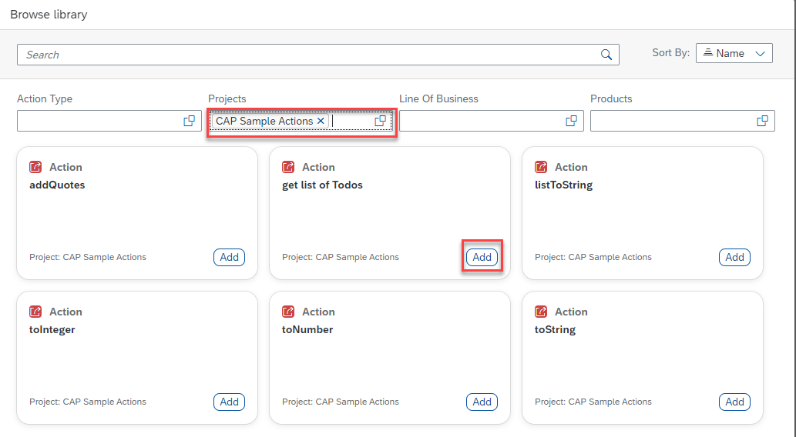

3. Click **+** next to **End** and repeat the **Actions** > **Browse Library** steps to add the action **`listToString`**

4.  Select **`get list of Todos`** in the canvas and create Destination variable **`capService`**
   
    <!-- border -->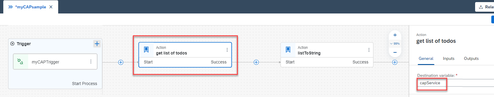
   
5. Select **`listToString`** in the canvas and select Destination variable **`capService`**
   
    <!-- border -->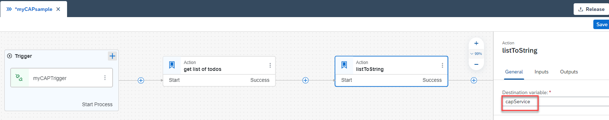

6. Select **Inputs** to define the input values for the action

    - Click **Select Item** next to **field**

    -  Select **field** from **Process Start Inputs**
  
    <!-- border -->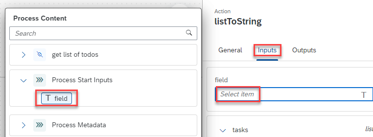

    - Click **Select list** next to **Bind List**

    -  Select **`list responseArray`** from **`get list of Todos`**
  
    <!-- border -->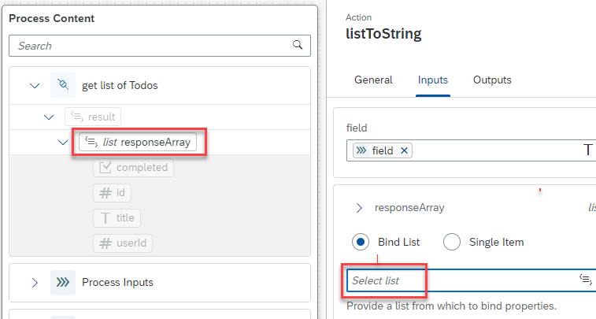

>The **Inputs** for **`listToString`** should show the following values

><!-- border -->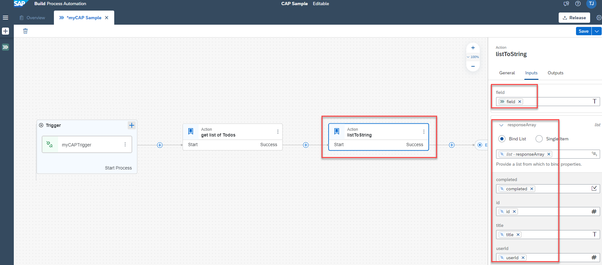<div>&nbsp;</div>


### Release and Deploy

1. **Save** the process **`myCAP Sample`**, click **Release**

2. On popup **Release Project**, click **Release**
    
3. Click **Deploy**

    - On **1 - Overview**, click **Next** 
     
    <!-- border -->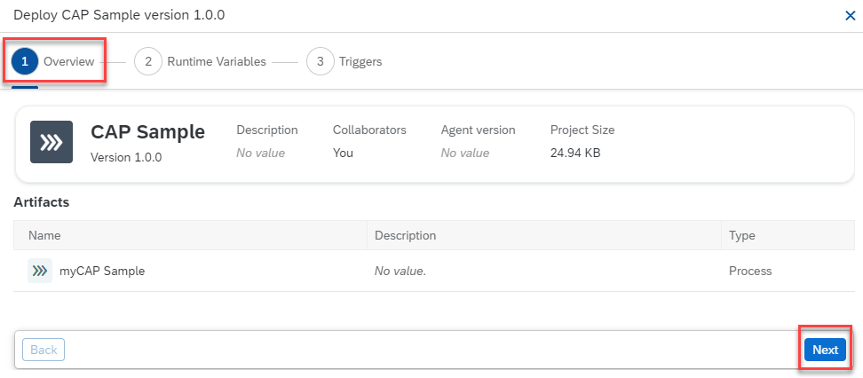

    - On **2 - Runtime Variables**, for **`capService`** select Destination **`Demo_CAP_Sample_Library`**, click **Next** 

    <!-- border -->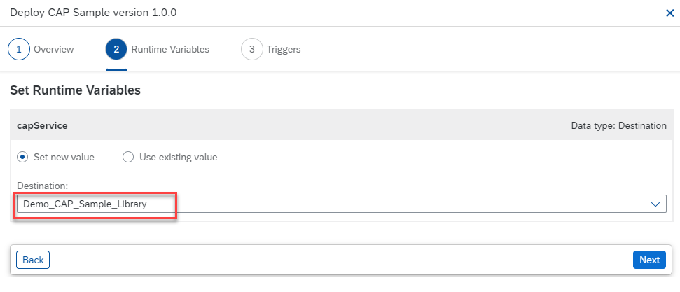

    - On **3 - Triggers**, you can see your trigger in the list, click **Deploy** 

    <!-- border -->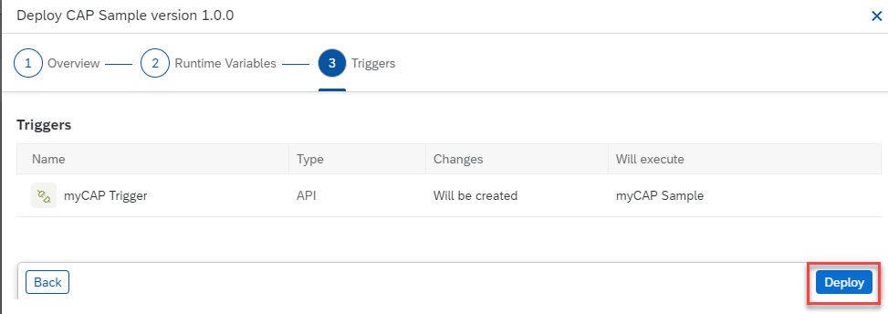


### Test Business Process

1. From **SAP Build**, click **Monitor**

2. Select **Manage** > **Process and Workflow Definitions**
   
3. Click **`myCAPSample`**

    <!-- border -->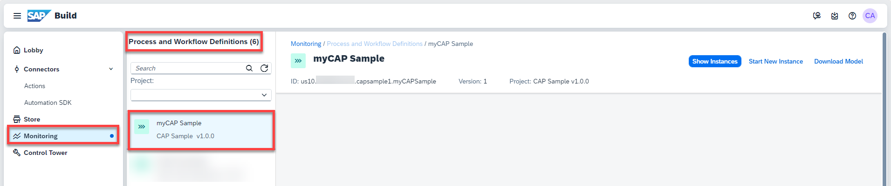

4. Click **Start New Instance** 
   
    - Enter the JSON as input parameter values
    ```JSON
    { "field" : "id" }    
    ```

    - Click **Start New Instance and Close**

    <!-- border -->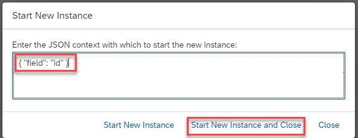

5. Select **Monitor** > **Process and Workflow Instances**, make sure your instance is in the list, **clear** all filters

    <!-- border -->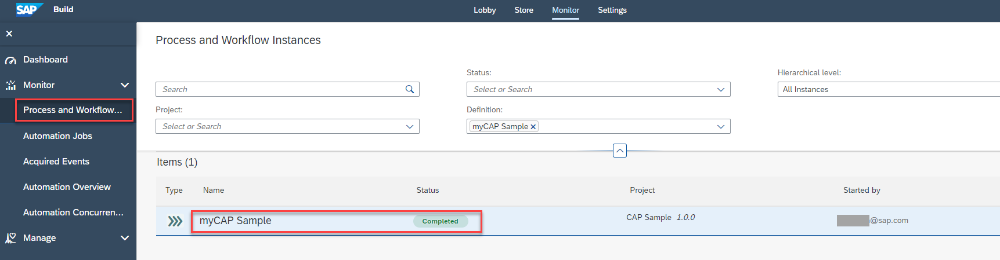

6. Click the line to display the details of the instance

    >The result of the action `listToString` is shown as comma separated value string    

    <!-- border -->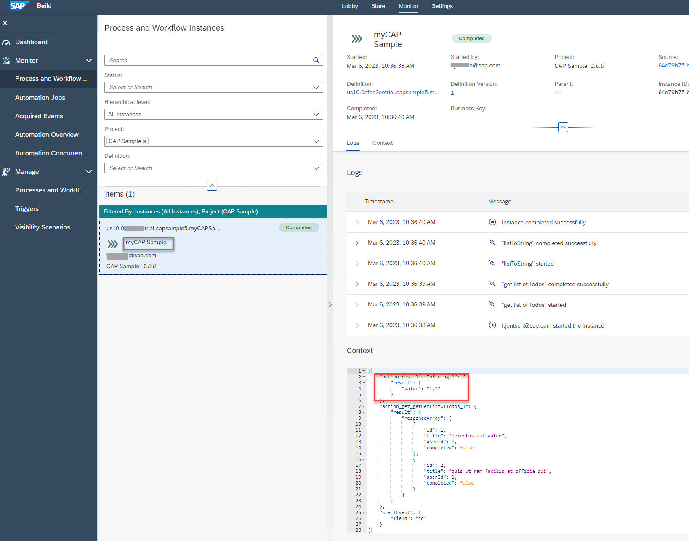

