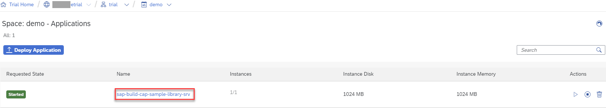
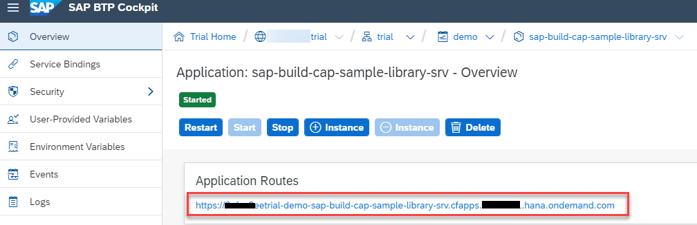
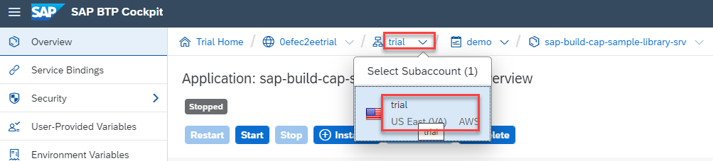
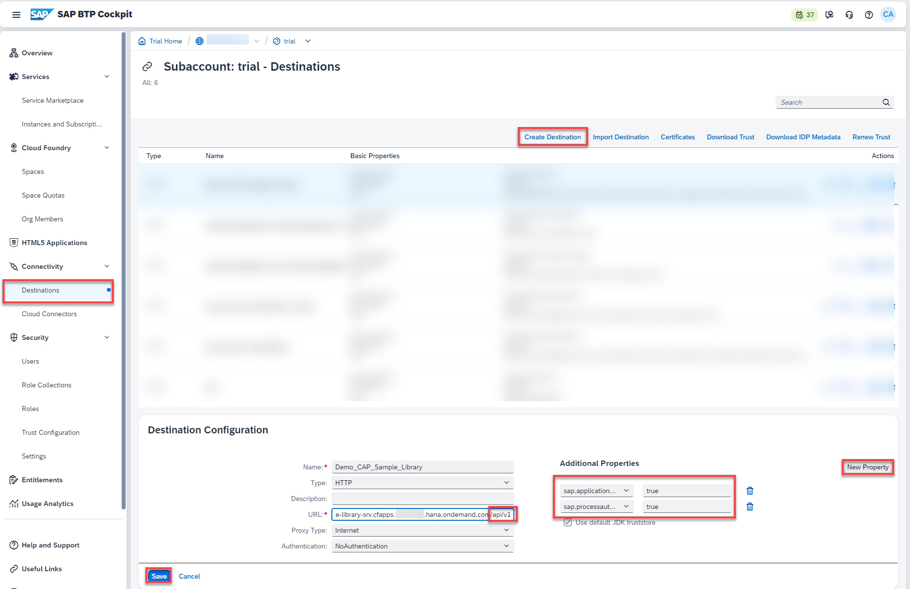
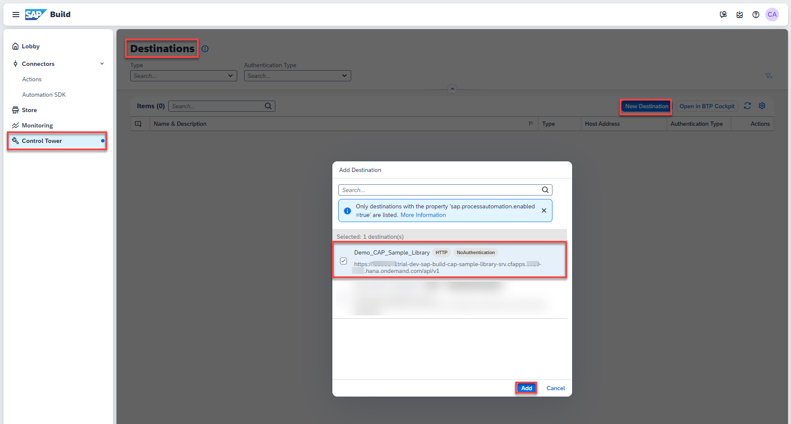
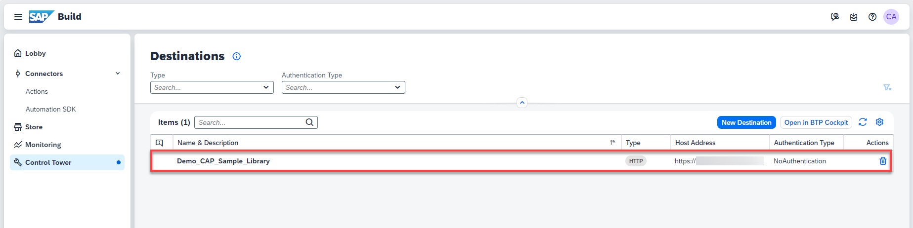

# Setup Connectivity to CAP Service
<!-- description --> Create a BTP destination and add the destination to SAP Build Process Automation to access the CAP Service.

## You will learn
  - How to create destination in SAP BTP Cockpit to connect to CAP service
  - How to add the destination to SAP Build Process Automation
  
## Prerequisites
- [SAP BTP Free Trial Account](https://blogs.sap.com/2022/09/09/sap-process-automation-now-available-in-your-trail-account/)  **OR**
  [SAP BTP Free Tier Account](spa-subscribe-booster) with the SAP Build Process Automation enabled

---
### Create Destination in SAP BTP Cockpit

In the SAP BTP Cockpit, you will create a destination that will be used in the Action Editor to test the Action and later also in the Process execution.

1. Goto **BTP Cockpit**

2. Get the Application Routes URL from the service which is running in your Cloud Foundry space, click on the Name

    <!-- border -->

3. Copy the URL into the clipboard to use it in the Destination definition (next item)

    <!-- border -->

4. Navigate back to your Subaccount - Overview

    <!-- border -->

5. Click **Destinations** to show the available Destinations

     - Click **New Destination** 
  
     - enter **URL** **`<Application Routes url>/api/v1`** (paste Routes url from the clipboard)

     - enter **Name** **`Demo_CAP_Sample_Library`**
  
     - enter **Additional properties** **`sap.applicationdevelopment.actions.enabled`** **`true`**

     - enter **Additional properties** **`sap.processautomation.enabled `** **`true`**

     - click **Save**

    <!-- border -->

### Add Destination in SAP Build Process Automation

1. Goto **SAP Build Process Automation**

2. Click **Settings**

     - Click **Destinations** 

     - Click **New Destination** 

     - From the popup, select **Demo_CAP_Sample_Library**

     - Click **Add** 

    <!-- border -->

    >Destination is added to the list and can be used in SAP Build Process Automation

    ><!-- border -->
    

### Test yourself
