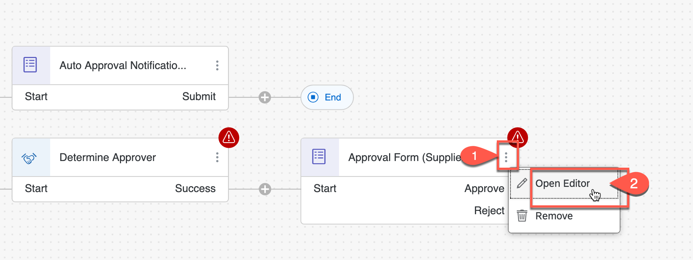
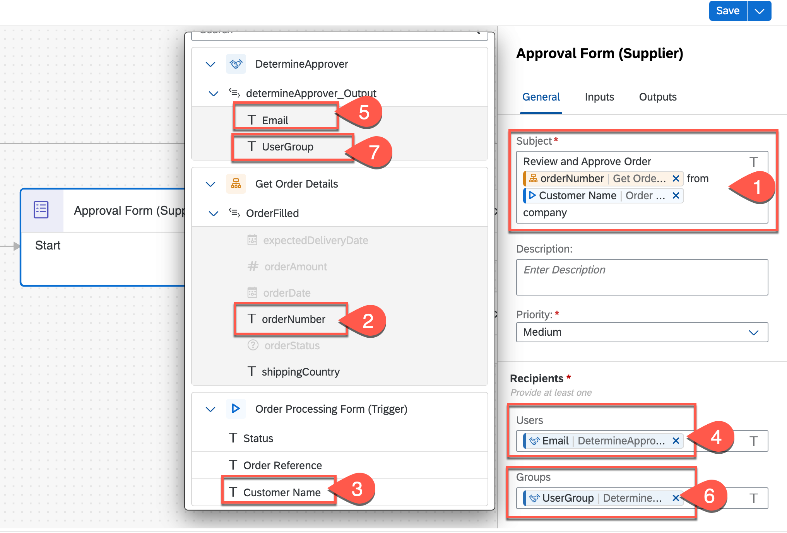

# Create and configure an approval and notification form
<!-- description --> Create an approval form for user approval and a notification form to send notifications in the business process

## Prerequisites
 - Access to a **SPA Tenant**.

## You will learn
  - How to create a **Supplier Approval Form** which will be sent to the approvers determined by the decision table for their approval.
  - How to create a **Notification Form** to inform the requester whether their sales order is approved or rejected by the supplier.

---

### Create and Configure an Approval Form

1. In the process builder, choose **+** of the **Determine Approver** conditional flow and select **Form > New Approval Form**.

    <!-- border -->

2. In the **Create Form** dialog box, do the following:
    - Enter **Approval Form (Supplier)** in the **Name** field.
    - Enter **Supplier will approve or reject the purchase order** in the **Description** field.
    - Choose **Create**.

    <!-- border -->

3. Now you have to model the form. For that, select the *three-vertical-dots* on **Approval Form (Supplier)** form to open the menu and choose **Open Editor**.

    <!-- border -->

4. In the **Form Editor**, choose or drag-and-drop the following layout and input fields in the given sequence on the form editor:

  | Sequence| Layout   | Text |
  | ---- |----------|---|
  | 1 | Headline1  |Approve Sales Order|
  | 2 | Headline2  |Customer has requested your approval for the new order. Please review and confirm whether the requirements can be met or not. |
  | 3 | Paragraph |Sales Order Details: |

  | Sequence | Input Field   | Field Settings |
  | ---- |----------|---|
  | 4 | Text   | Name: Customer Name   Read Only : checked|
  | 5 | Text   | Name: Order Number   Read Only : checked |
  | 6 | Number | Name: Order Amount   Read Only : checked |
  | 7 | Date | Name: Delivery Date   Read Only : checked |

    <!-- border -->

  | Sequence| Layout   | Text |
  | ---- |----------|---|
  | 8 | Paragraph  |Supplier Acknowledgment|

  | Sequence | Input Field   | Field Settings |
  | ---- |----------|---|
  | 9 | Checkbox   | Name: I acknowledge that we have received your purchase order and will deliver on or before scheduled date|
  | 10 | Text Area  | Name: Message to buyer: |

    <!-- border -->

5. Once done, choose **Save**.

6. Go back to the process builder, select **Approval Form (Supplier)** form.

7. Select the **General** tab, and do the following:

    > You will use dynamic value from process content to define the subject.

8. In the **Subject** box, enter **Review and Approve Order**.

9. Then select `selectedOrder>orderNumber` from the process content.

10. Again enter **from**, then select **Order Processing Form > Customer Name** from the process content.

11. Select `determineApprover_Output>Email`from process content as **Users** in **Recipients**.

12. Select `determineApprover_Output>UserGroup`from process content as **Groups** in **Recipients**.

    > note: the recipients are determined by the decision and the output after the decision execution is collected in the `determineApprover_Output` data type

    <!-- border -->  

13. Select the **Inputs** tab.

14. Map the following decision table input with the process content:

    | Form Input Field | Process Content |
    |---|---|
    | Delivery Date | `selectedOrder` > `expectedDeliveryDate` |
    | Customer Name | `Order Processing Form` > `Customer Name` |
    | Order Amount | `selectedOrder` > `orderAmount` |
    | Order Number | `selectedOrder` > `orderNumber` |

    <!-- border -->  

15. Once completed, choose **Save** to save the process.

    <!-- border -->

### Create and Configure a Notification Form

1. In the process builder, choose **+** of the **Approve** conditional flow of **Approval Form (Supplier)** and select **Form > New Form**.

    <!-- border -->

2. In the **Create Form** dialog box, do the following:
    - Enter **Sales Order Notification (Approved)** in the **Name** field.
    - Enter **Notification form to inform customer of the sales order approval by the supplier** in the **Description** field.
    - Choose **Create**.

    <!-- border -->

3. Now you have to model the form. For that, select the *three-vertical-dots* on **Sales Order Notification (Approved)** form to open the menu and choose **Open Editor**.

    <!-- border -->

4. In the **Form Editor**, choose or drag-and-drop the following layout and input fields in the given sequence on the form editor:

  | Sequence| Layout   | Text |
  | ---- |----------|---|
  | 1 | Headline1  |Order Confirmation|
  | 2 | Paragraph  |We are happy to let you know that your order has been received and accepted for delivery. We will inform you as soon as your order has been shipped.  You can find the details of your order below, please review and verify the request:|

  | Sequence | Input Field   | Field Settings |
  | ---- |----------|---|
  | 3 | Text Area   | Name: Message from the supplier:   Read Only : checked|

  | Sequence| Layout   | Text |
  | ---- |----------|---|
  | 4 | Paragraph  |Your Sales Order Details:|

    <!-- border -->

  | Sequence | Input Field   | Field Settings |
  | ---- |----------|---|
  | 5 | Text   | Name: Order Number   Read Only : checked |
  | 6 | Number | Name: Order Amount   Read Only : checked |
  | 7 | Date | Name: Order Delivery Date   Read Only : checked |
  | 8 | Text | Name: Order Status   Read Only : checked |

  | Sequence| Layout   | Text |
  | ---- |----------|---|
  | 9 | Paragraph  |Please press the SUBMIT button, so that the process can be finalized.|

    <!-- border -->

5. Once done, choose **Save**.

6. Go back to the process builder, select **Sales Order Notification (Approved)** form.

7. Select the **General** tab, and do the following:

    > You will use dynamic value from process content to define the subject.

8. In the **Subject** box, enter **Your Order**.

9. Then select `selectedOrder > orderNumber` from the process content.

10. Again enter **is confirmed by the supplier**/

11. Select **Process Metadata >> Process Started By** from process content as **Users** in **Recipients**.

      <!-- border -->  

12. Select the  **Inputs** tab.

13. Map the following decision table input with the process content:

    | Form Input Field | Process Content |
    |---|---|
    | Order  Number | `selectedOrder > orderNumber`  |
    | Order Delivery Date | `selectedOrder > expectedDeliveryDate` |
    | Message from supplier | `Approval Form > Message to buyer` |
    | Order Amount | `selectedOrder > Order Amount` |
    | Order Status | Order Processing Form > Order Status |

      <!-- border -->

14. Drag and drop the connection flow from **Submit** action to **End** step in the process.

      <!-- border -->

15. Once completed, choose **Save** to save the process.

Repeat the above steps to create one more notification form to inform the requester about the rejection of the sales order.  

1. In the process builder, choose **+** of the **Reject** conditional flow of **Approval Form (Supplier)** and select **Form > New Form**.

      <!-- border -->

2. In the **Create Form** dialog box, do the following:
        - Enter **Sales Order Notification (Rejected)** in the **Name** box.
        - Enter **Notification form to inform that the sales order is rejected by the supplier** in the **Description** box.
        - Click **Create**.

      <!-- border -->

3. Now you have to model the form. For that, select the *three-vertical-dots* on **Sales Order Notification (Rejected)** form to open the menu and choose **Open Editor**.

4. In the Form Editor, choose or drag-and-drop the following layout and input fields in the given sequence on the form editor:

      | Sequence| Layout   | Text |
      | ---- |----------|---|
      | 1 | Headline1  |Order Rejection|
      | 2 | Paragraph  |We are sorry to inform you that your order cannot not be accepted. Any inconvenience caused due to refusal of order is regretted. You can find the reason of rejection and the details of your order below, please confirm the request:|

      | Sequence | Input Field   | Field Settings |
      | ---- |----------|---|
      | 3 | Text Area   | Name: Message from the supplier:   Read Only : checked|

      | Sequence| Layout   | Text |
      | ---- |----------|---|
      | 4 | Paragraph  |Your Sales Order Details:|

      <!-- border -->

      | Sequence | Input Field   | Field Settings |
      | ---- |----------|---|
      | 5 | Text   | Name: Order Number   Read Only : checked |
      | 6 | Number | Name: Order Amount   Read Only : checked |
      | 7 | Date | Name: Order Delivery Date   Read Only : checked |
      | 8 | Text | Name: Order Status   Read Only : checked |

      | Sequence| Layout   | Text |
      | ---- |----------|---|
      | 9 | Paragraph  |please press the SUBMIT button, so that the process can be finalized.|

      <!-- border -->

5. Once done, choose **Save**.

6. Go back to the process builder, select **Sales Order Notification (Rejected)** form.

7. Select the **General** tab.

      > You will use dynamic value from process content to define the subject.

8. In the **Subject** box, enter **Your Order**.

9. Then select `selectedOrder > orderNumber` from the process content.

10. Again enter **is rejected by the supplier**.

11. Change the **Priority** to **High**.

12. Select **Process Metadata >> Process Started By** from process content as **Users** in **Recipients**.

        <!-- border -->  

13. Select the **Inputs** tab.

14. Map the following decision table input with the process content:

        | Form Input Field | Process Content |
        |---|---|
        | Order Status | Order Processing Form > Order Status |
        | Order Amount | selectedOrder > orderAmount |
        | Order  Number | selectedOrder > orderNumber  |
        | Order Delivery Date | selectedOrder > expectedDeliveryDate |
        | Message from supplier | Approval Form > Message to buyer |

        <!-- border -->

15. Drag and drop the connection flow from **Submit** action to **End** step in the process.

16. Once completed, choose **Save** to save the process.

        <!-- border -->

---
