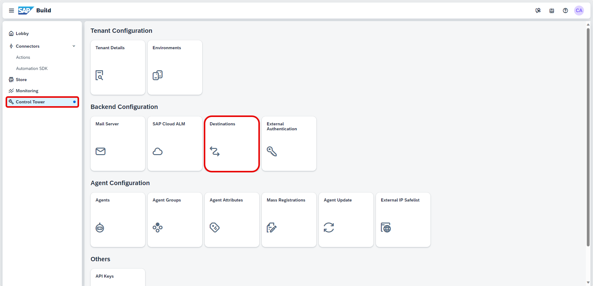
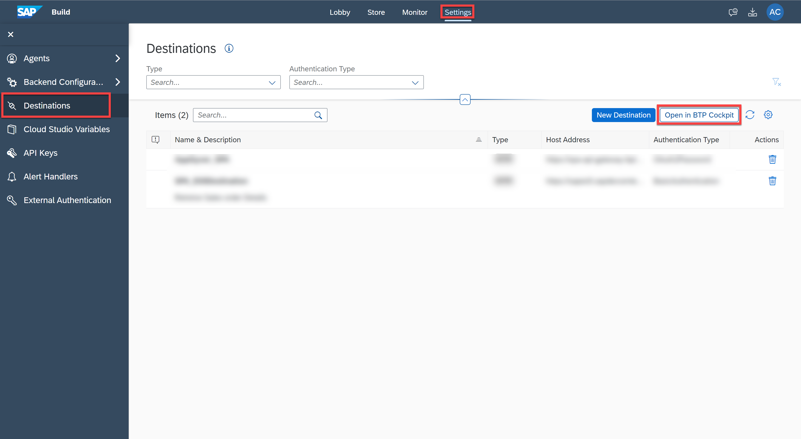
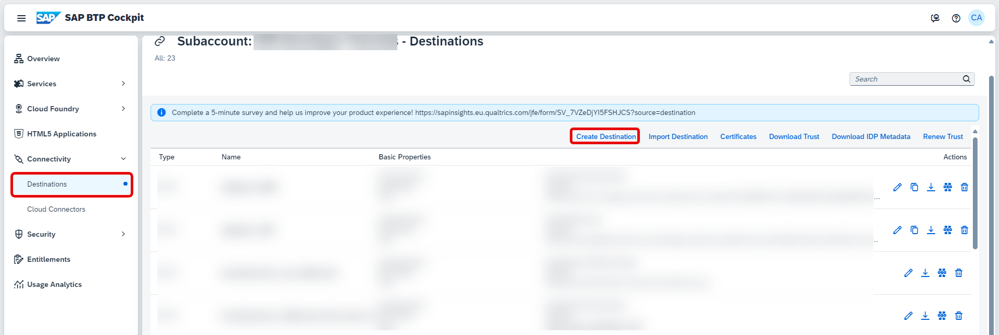
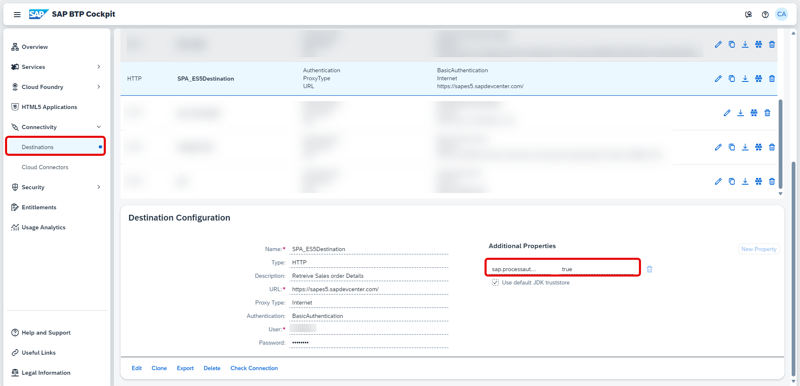
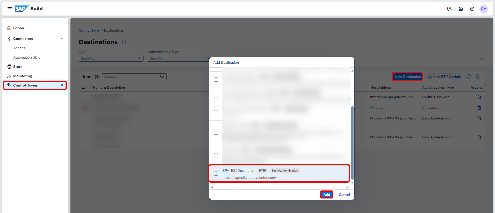
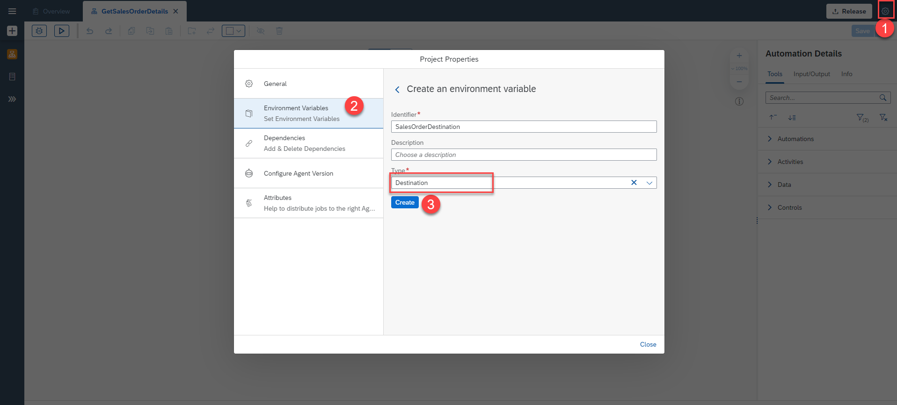

# Configure BTP Destinations in SAP Build Process Automation
<!-- description --> Configure BTP Destinations in SAP Build Process Automation to securely store sensitive information.

## Prerequisites
 - Subaccount Administrator role to create Destinations in SAP Business Technology platform.

## You will learn
  - How to create Destinations in BTP for SAP Build Process Automation
  - Add Destinations to Process Automation

---
Destinations are predefined endpoints used in the Business Technology Platform (or BTP). Destinations allow you to securely store sensitive information used to connect to a system, such as client credentials, keys, or certificates in the BTP.

### Create a destination in SAP Business Technology Platform

1.  In **SAP Build**, navigate to **Control Tower > Destinations**.

    <!-- border -->

2.  Choose **Open in BTP Cockpit**.

    >This Button is visible if you have a Process Automation Admin role.

    <!-- border -->

    You will be navigated to the **Destinations** page of SAP Business Technology Platform.

3.  Choose **Create Destination**.
   
    <!-- border -->

4.  Enter the details for the Destination. Refer to [Managing Destinations](https://help.sap.com/docs/CP_CONNECTIVITY/cca91383641e40ffbe03bdc78f00f681/84e45e071c7646c88027fffc6a7bb787.html) for more information.

5.  Add the property **sap.processautomation.enabled** as **true** to view the destination in the SAP Build Process Automation tenant.    

    <!-- border -->

### Create a destination in SAP Build Process Automation tenant

1.  Navigate to **Control Tower > Destinations > New Destination**.

2.  Select the name of the destination that you created in **Step 1** and choose **Add**.

    <!-- border -->

    The Destination is successfully added to SAP Build Process Automation Tenant.

    <!-- border -->

### Access destination in the Business Process

The destination can be accessed in the **Business Process** project  by creating an Environment variable of the type Destination.

Create a **Business Process** from the Lobby. After creating the Business Process, create the Environment variable of type Destination.

1.  Navigate to **Manage the project properties > Environment Variables**.

2.  Create an Environment Variable of type **Destination**.

    <!-- border -->

    The Destination can be accessed successfully in your Business Process Project.

---
