# Build Your First Automation Using Excel SDK of SAP Build Process Automation
<!-- description --> In this tutorial, you will be developing basic automations using Excel SDK. After completing this tutorial, you will be able to read Excel data for a given range using Excel Cloud Link, or by using a traditional approach. In this tutorial, you will also learn, how you can apply filters on the Excel data, copy the filtered data onto a new Excel sheet and save the file with a new name.

## Prerequisites
- Complete the tutorial: [Subscribe to SAP Build Process Automation Using Booster in SAP BTP Free Tier](spa-subscribe-booster)
- [Install and Setup the Desktop Agent](spa-setup-desktop-3-0-agent)
- Basic understanding of SAP Build Process Automation

## You will learn
  - How to use Excel SDK of SAP Build Process Automation to read and process data in an Excel.

## Intro
  SAP Build Process Automation has native integration to several Microsoft Office products including Outlook, Excel SDK. In this tutorial, you will explore how to use Excel SDK in your automations.

---

### About Excel SDK

The Excel SDK is a collection of activities allowing you to create automations using Microsoft Excel. It comes with a rich set of functionalities such as:

- Create new Excel Workbook
- Create new Excel Worksheet
- Read and write data from an Excel sheet, for a given data range
- Apply Filter on a column
- etc

To design your automation, you will need an Excel file filled with the sales orders data. You have the possibility to create it yourself using the below sample data:

| Order Number| Order Amount | Order Date | Shipping Country         | Expected Delivery Date | Order Status
|  :----------| :------------|:-----------| :------------------------|:-----------------------|:-----------
|  PO7991     | 410418.22    | 1/21/2022	| United States of America | 1/29/2022	            | In Time
|  PO7918     | 150935.13	   | 1/22/2022	| United Kingdom           | 1/27/2022	            | Urgent
|  PO7375     | 313977.82	   | 1/23/2022	| United Kingdom	         | 2/20/2022              | In Time
|  PO7311     | 755055.4	   | 1/24/2022	| United Kingdom	         | 3/30/2022              | In Time
|  PO6858     | 429358.4     | 1/25/2022	| United Kingdom	         | 2/20/2022	            | In Time
|  PO6368     | 43739.82	   | 1/26/2022	| United Kingdom	         | 3/25/2022	            | In Time
|  PO6189     | 483574.12	   | 1/27/2022	| Germany	                 | 2/5/2022	              | In Time
|  PO3115     | 2739956	     | 1/28/2022	| Germany	                 | 3/10/2022	            | In Time
|  PO2686     | 220887.56	   | 1/29/2022	| Germany	                 | 3/5/2022	              | In Time
|  PO8282     | 436955.64	   | 1/30/2022	| United States of America | 3/30/2022	            | In Time

You can also use an Excel sample of your choice.

### Use Excel Link in your Excel automations

1.  From the SAP Build Process Automation Lobby, create a new automation.
2.  Provide an appropriate name to your project and relevant automation.
3.  Select your active desktop agent version to be used during design and development of your automation.
4.  By default Excel and Core SDK are added to the automations and your automation opens in a new browser tab. You have a couple of ways to read Excel data:
      - Using the activity **Excel Cloud Link** to achieve Excel Data Mapping.
      - Traditional step by step approach to read / write Excel data.

      In this tutorial, you will explore both ways.

    >**What is Excel Data Mapping?**

    > Excel Data Mapping allows you to transform columns-based data from an Excel sheet into datatype that can be used in your automation. The data from the Excel sheet stays the same but the structure becomes a data type structure, making it possible to use throughout your project.

5.  As a first step, locate and add **Open Excel Instance** activity to the automation flow.

    <!-- border -->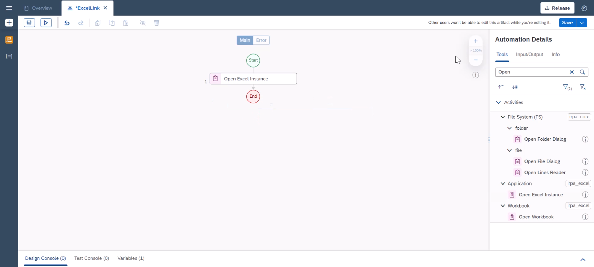

6.  Similarly locate and add **Excel Cloud Link** from the activity pane.

    <!-- border -->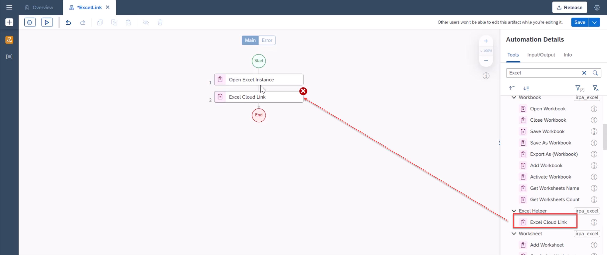

7.  Now edit the properties of **Excel Cloud Link** activity. In the flow chart, select the **Excel Cloud Link** activity, on the right side menu, choose **Edit Activity** button.

    <!-- border -->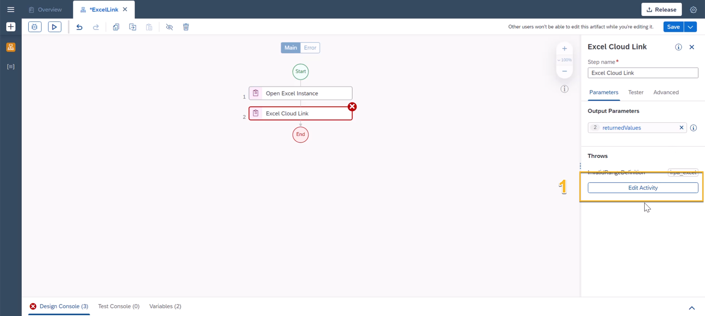

8.  Within the edit activity screen, you can either use the file picker or drag and drop your test Excel.

    <!-- border -->

9.  As you can see, with the Excel cloud link capabilities, it already pre-selects the first sheet, it groups data by column names, it also finds out in few seconds the complete range of the Excel.

    <!-- border -->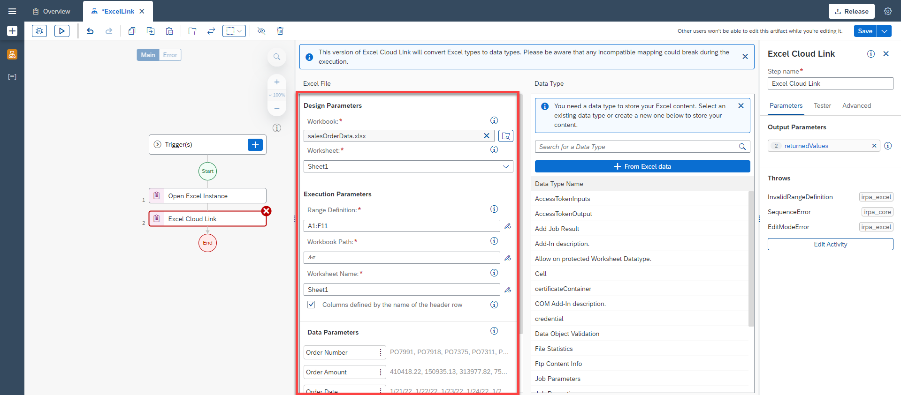

    While Excel cloud link is great in processing the data, it still needs for runtime reference, the path of your Excel. Typically, you need the full path of the Excel.
    
10. Under **Workbook Path**, provide the path of the workbook that will be used during the automation execution.

    <!-- border -->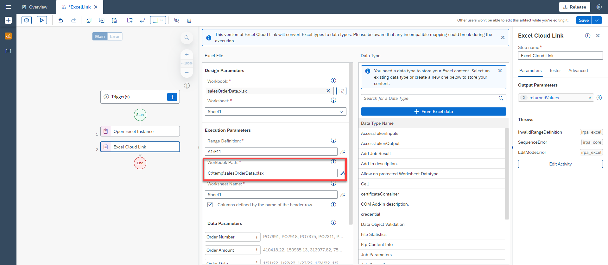

11. SAP Build Process Automation has data type functionality to logically group and process your data. You can create a data type out of the added Excel by using the Excel data structure.

    <!-- border -->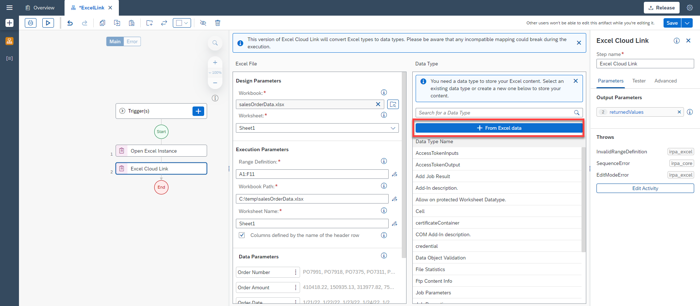

12. Provide a data type name such as Sales Orders and choose **Create**.

    <!-- border -->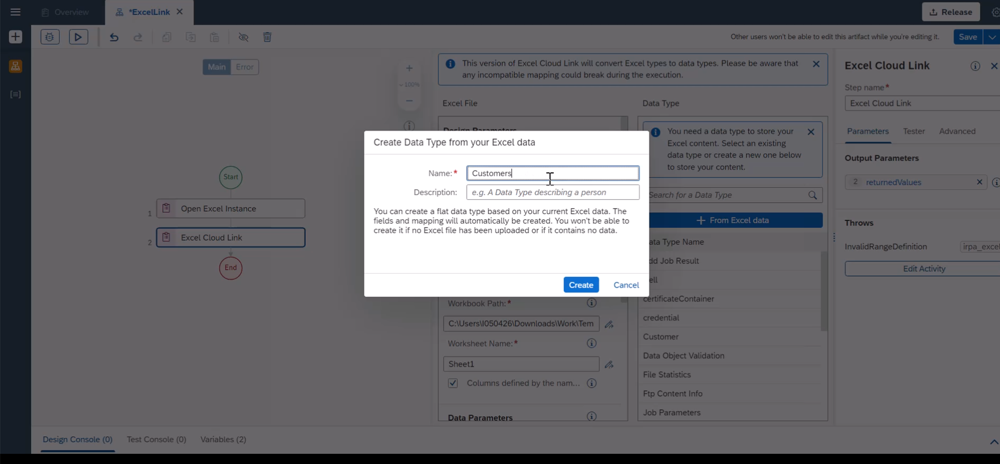

    **Excel Cloud Link** will identify field names using the first row of each column in your Excel and will determine the field type based on the type of data present in each column below the first row.

    The activity is also a helper function to read a given range of data in your Excel. This will be returned through the **Output Parameter**. 
    
13. If you wish, you may edit the output parameter name on the right side to `salesOrders`. 

14. Save and close the activity screen.

    <!-- border -->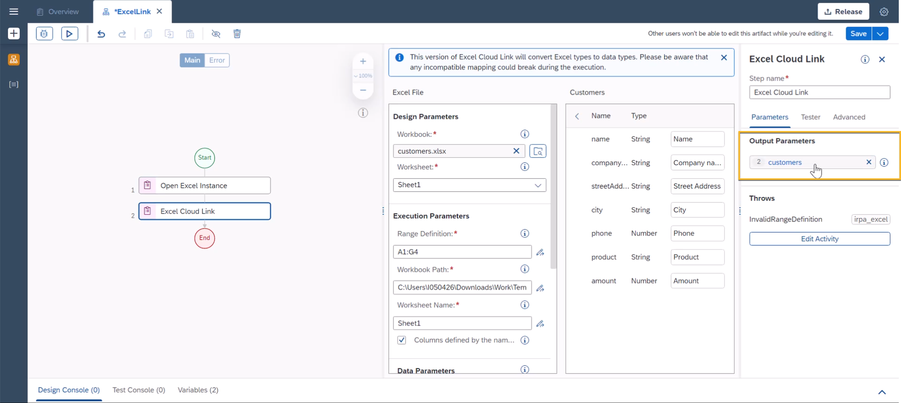

15. Now you will see the benefit of using Excel cloud link by printing output parameters. For this you will use a loop activity **For Each**. 

    <!-- border -->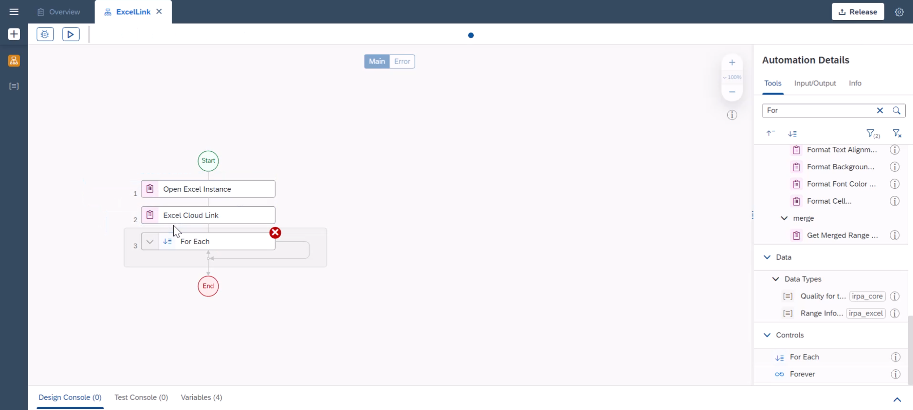

16. As a loop variable, add the **Output Parameter** `salesOrders` from the **Excel Cloud Link** activity.

    <!-- border -->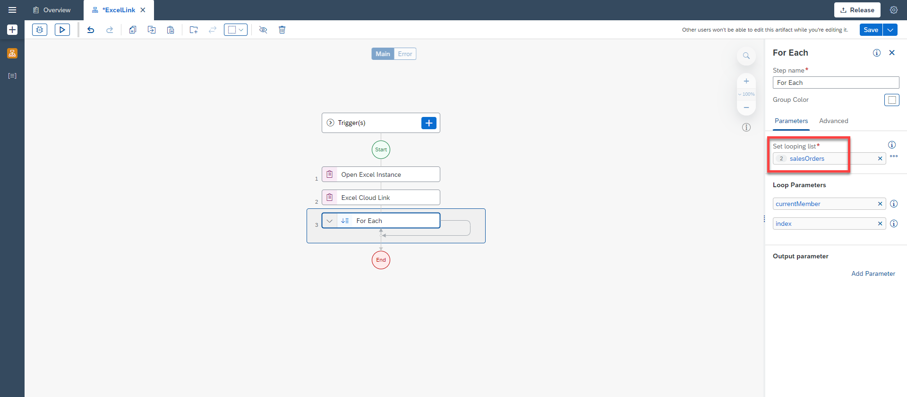

    If you are using the sample data provided in this tutorial you can print **Order Number**.  
    
17. Drag and drop a **Log Message** activity into the workflow.

    <!-- border -->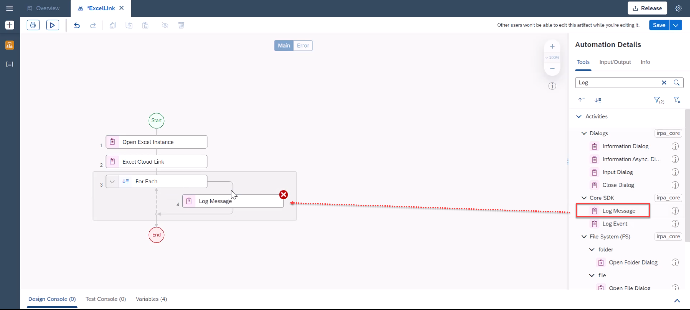

18. Select the **Log Message** activity and change the **Step name** to **Log Order Number**.

19. Under the **message** input parameter, choose the **Open the expression editor** icon.

20. In the **Edit Expression** window, type: `"Order Number is " + `

21. Then select `currentMember`>`orderNumber` from the list of Variables.

22. Choose **Save Expression**.

    <!-- border -->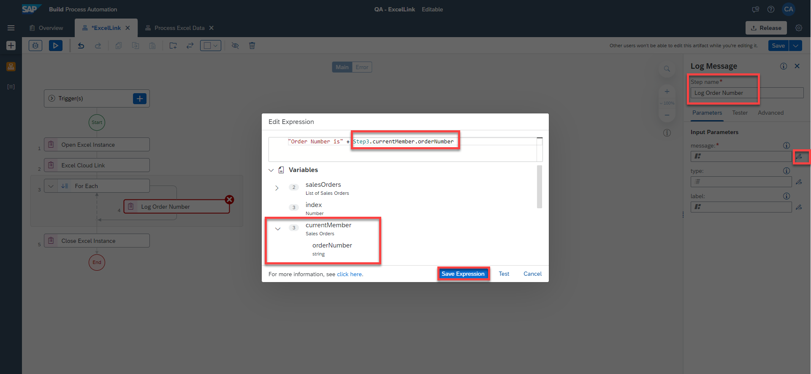

23. Add **Close Excel Instance** after the **For Each** loop as you added **Open Excel Instance** in the first step.

24. Choose **Save** to save your project.

    <!-- border -->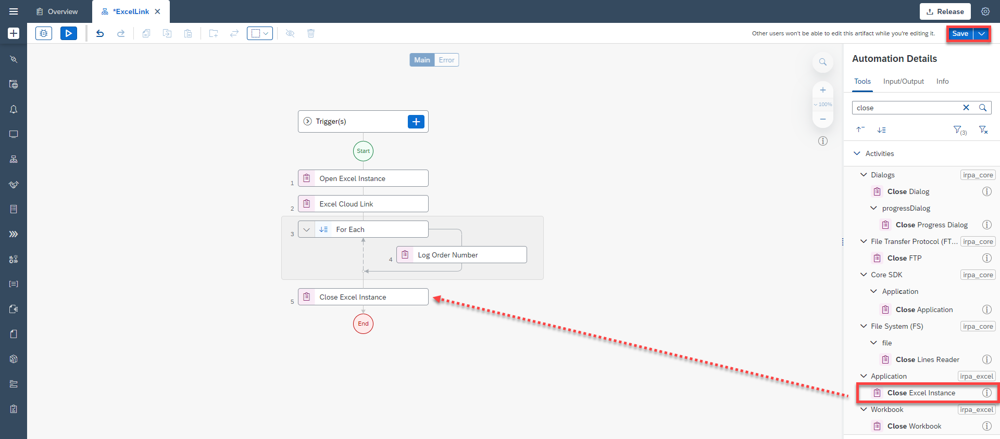

25. Now you can test the output.

    <!-- border -->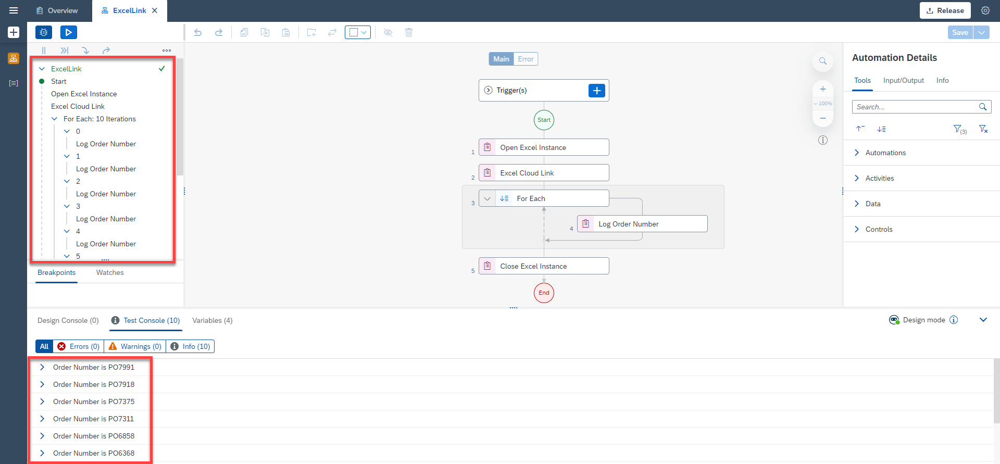

> - SAP Help Documentation [IRPA SDK V2] (https://help.sap.com/doc/b8b5c9bbac3846a0a57aedab3f412880/Cloud/en-US/modules/helper.html) on Excel Cloud Link
> - Excel Cloud Link [How to use the Excel Cloud Link activity helper](https://www.vimeo.com/458204726?embedded=true&source=video_title&owner=122956519)
> - Community [Quick automation with SAP Intelligent RPA – Excel SDK | SAP Blogs](https://blogs.sap.com/2021/05/31/quick-automation-with-irpa-Excel-sdk/) on Excel SDK

In the next step, you will take a more traditional approach to process the Excel data.

### Process Excel data

1. Start by adding a new automation to the project and add **Open Excel Instance** to the flow.

    <!-- border -->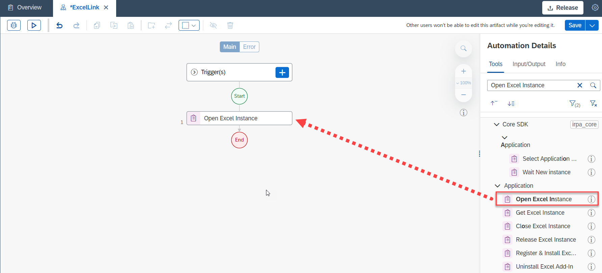

2. You will create two string variables. Search for **String** and drag and drop it into the flow twice.

    <!-- border -->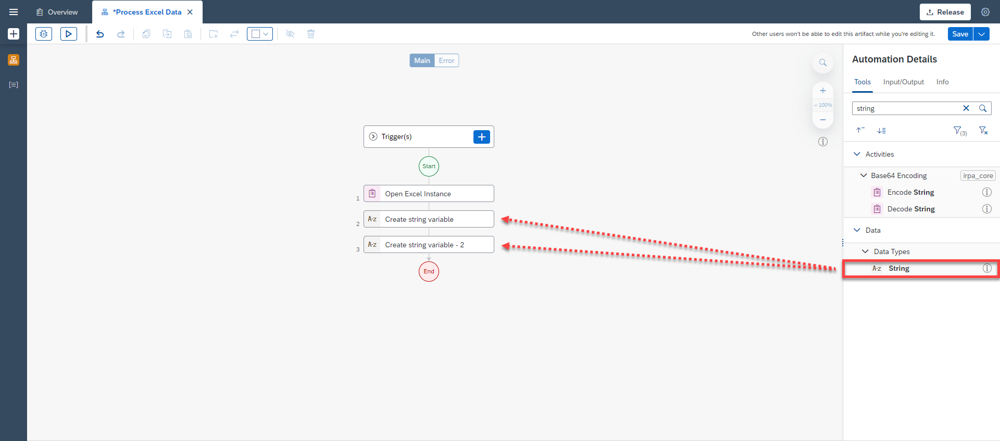

3. Select the first **Create String Variable** and change the **Step name** to **Create Workbook Path Variable**.

4. Under **Input Parameters** as value, enter the full path to the workbook.

5. Under **Output Parameters**, change the name to `WorkbookPath`.

    <!-- border -->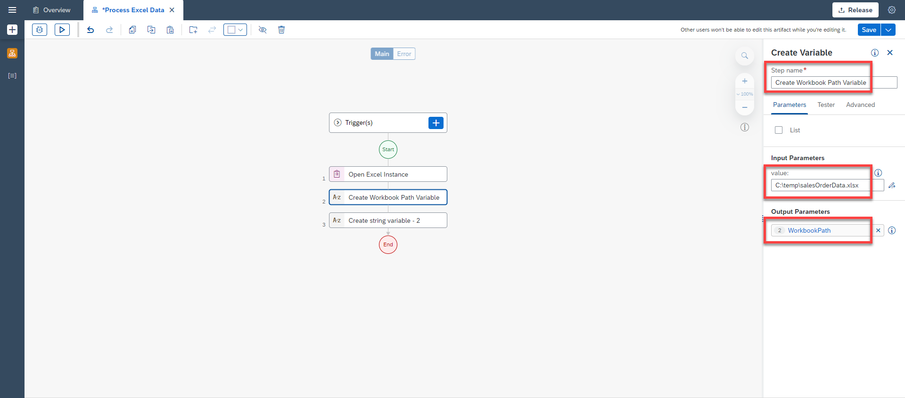

6. Select the second **Create String Variable** and change the **Step name** to **Create Excel File Name Variable**.

7. Under **Input Parameters** as value, enter the name of the excel file.

8. Under **Output Parameters**, change the name to `FileName`.

    <!-- border -->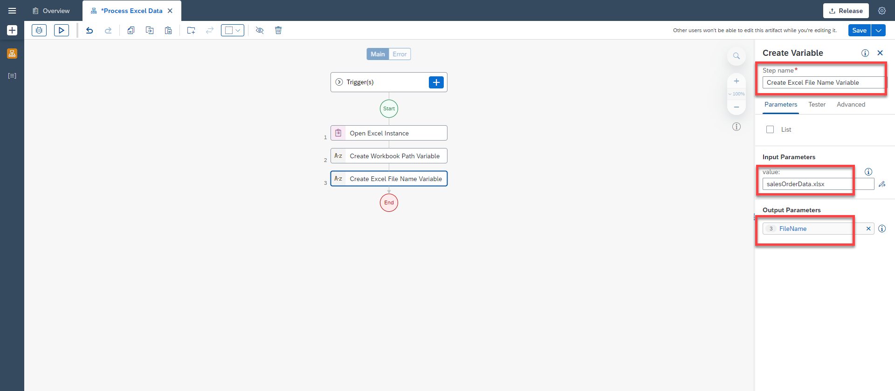

    > Creating the variable in this form, helps to use them in subsequent activity types.

9. Now add an **Open Workbook** activity.

    <!-- border -->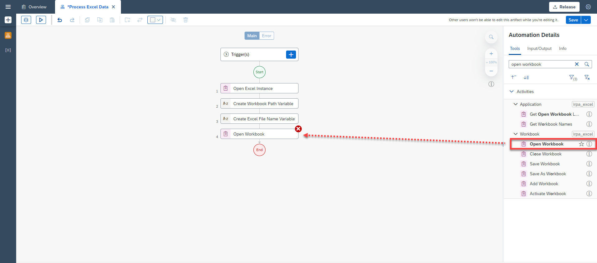

10. Under `workbookPath` input parameter, select the full path `2 WorkbookPath` of the Excel file. This will open the specific Excel file.

    <!-- border -->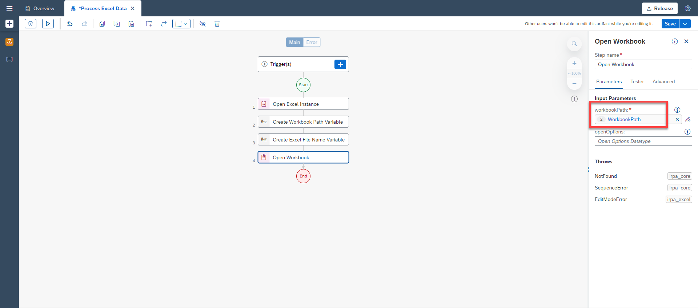

11. To activate the workbook and the first worksheet, do the following:
   
    -  In the **Automation Details** panel, search for the activities **Activate Workbook** and **Activate Worksheet**.
    -  Drag and drop the activities into the canvas.

    <!-- border -->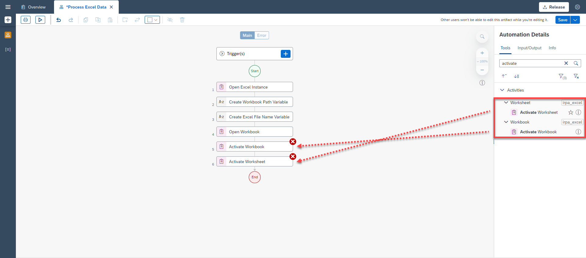 

    -  Under `workbookName` input parameter, select `3 FileName`.
 
    <!-- border -->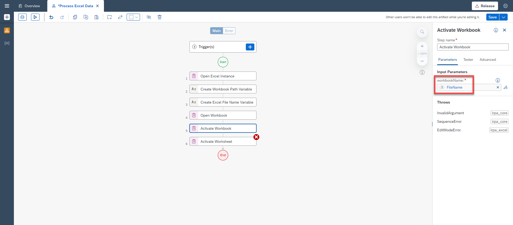

    -  Under `worksheetName` input parameter, enter `sheet1`.

    - Save your work.

    <!-- border -->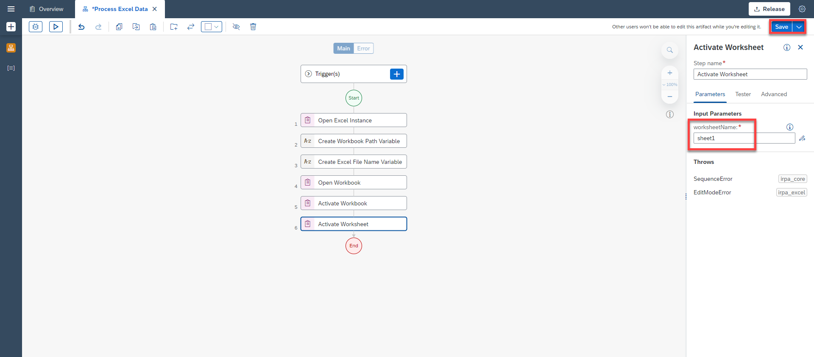

    > You can use variables or hard coded values for now. If you are trying a different Excel, use these values appropriately.
 
    Now that Excel sheet is open, you can apply filters, hide columns or get values from a range of cells or add a new sheet and copy a range of values to the newly created sheet.

12. Drag and drop a **Filter Range** activity into the workflow.

    <!-- border -->

13. Select the **Filter Range** activity. 

14. Under **Input Parameters**, specify:

    - the data range, where the filter needs to be applied such as `A1:E11`.
    
    - the column on which the filter needs to be applied such as column `B`.
    
    - a filter condition such as `<1000000`

    <!-- border -->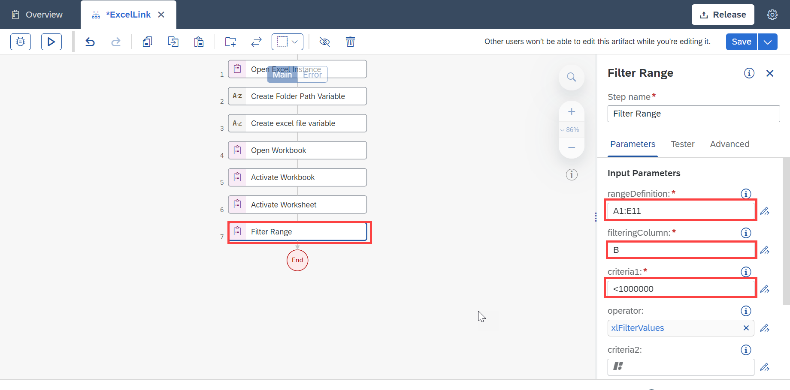

    > You add a new Excel sheet to your workbook and copy this filtered data onto that, just for demonstration purpose.

15. Subsequently add a **Hide column** activity to hide a specific column in the result.

    <!-- border -->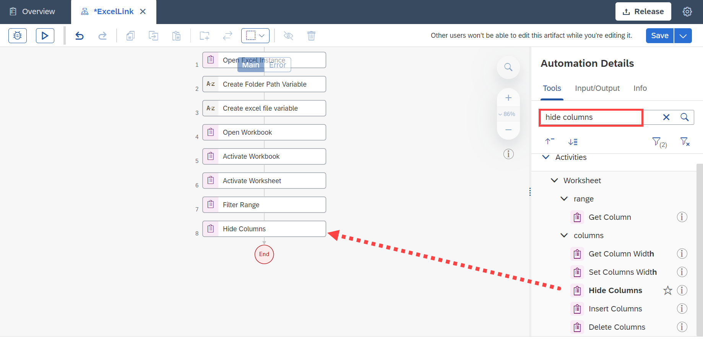

16. Select the activity and under `rangeReference` input parameter, enter `C1`.

    <!-- border -->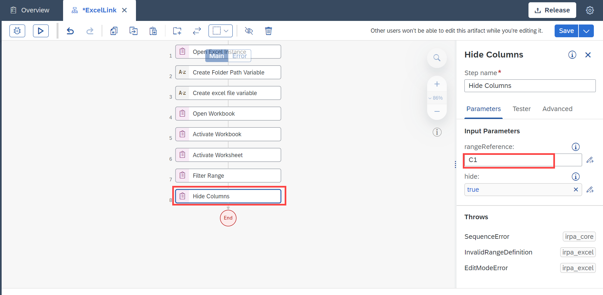

    You will then copy the result of filter to a new sheet. For this you add a sheet through **Add Worksheet** activity.

17. Drag and drop a **Add Worksheet** activity into the workflow.
   
    <!-- border -->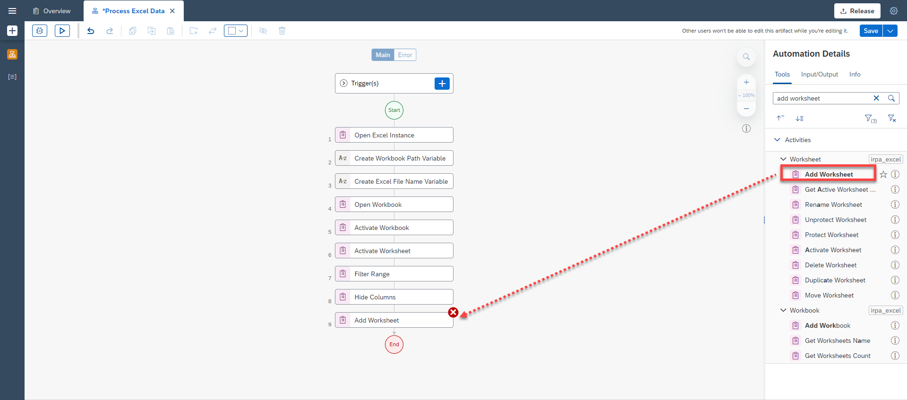

18. Under `worksheetName` input parameter, enter the name **Result**.

    <!-- border -->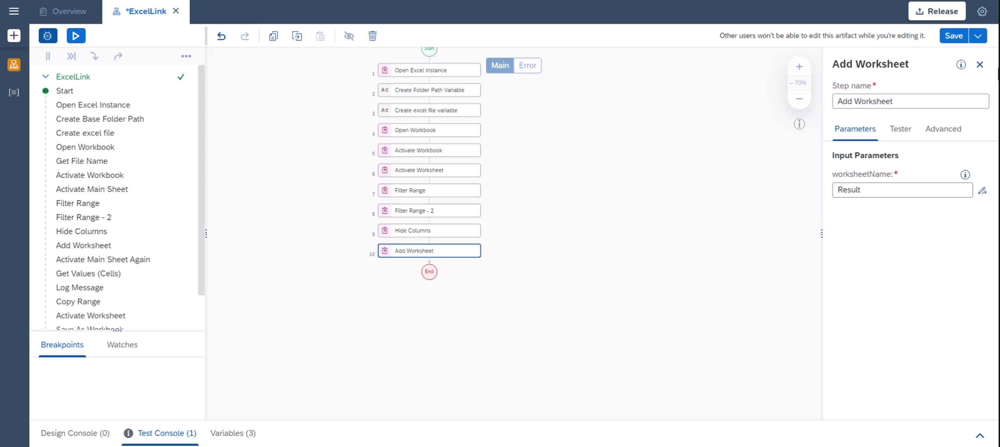

19. Add **Activate Worksheet** activity to activate the new worksheet.

20. Select the activity and under `worksheetName` input parameter, enter the name of the first sheet of your original excel file such as `Shee1`.

    <!-- border -->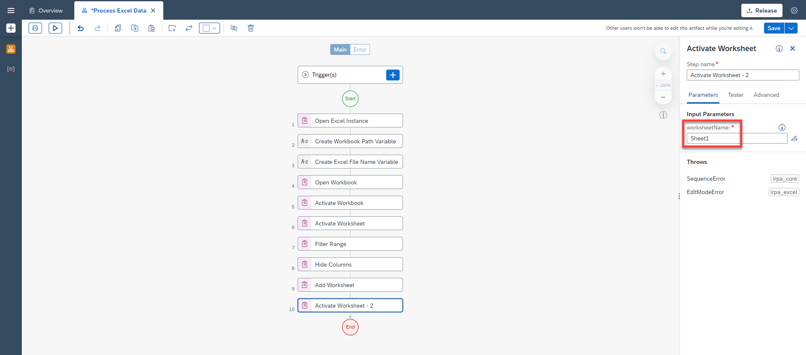

21. Add a **Copy Range** activity, select the activity and provide the following input parameters:

    - the `rangeDefinition` as `A1:A11`.
    
    - the `destinationRange` as `A1`.

    - the `destinationWorksheet` as `Result`.
    
    - the `destinationWorkbook` as `3 FileName`.

    <!-- border -->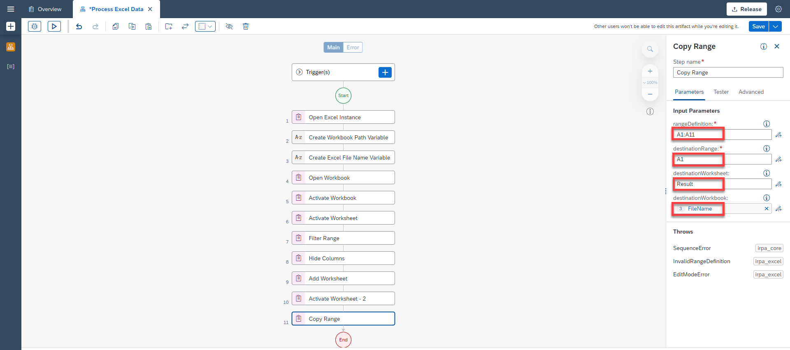

22. Now add **Save As Workbook** activity to save the new sheet as another file. 

    You have the option to save workbook as an Excel file or a CSV file. In order to save as a new CSV file, you will need a file path to store this CSV file. This will be of the format `folderName` + `fileName` without extension where it needs to be saved.

    <!-- border -->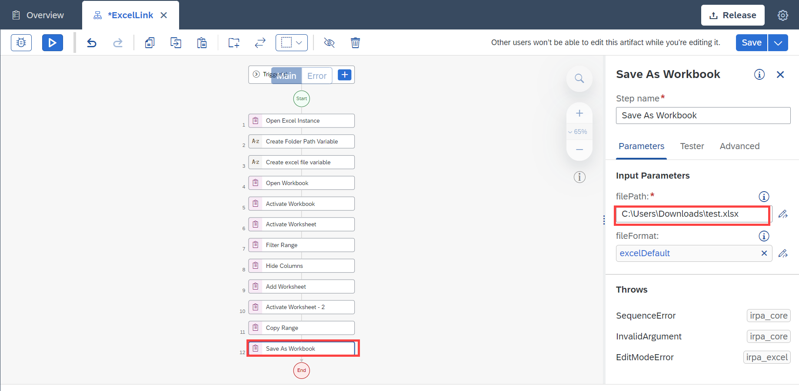

23. Finally, you need to include **Close Excel Instance** to conclude the step.

    <!-- border -->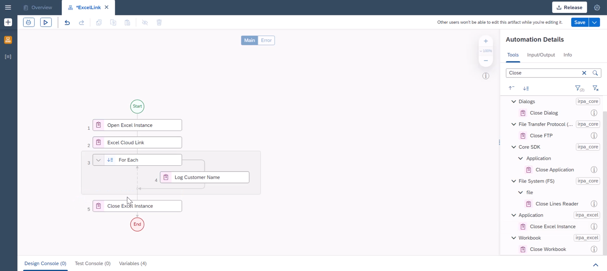

24. Save the project and test it to validate the result.

    <!-- border -->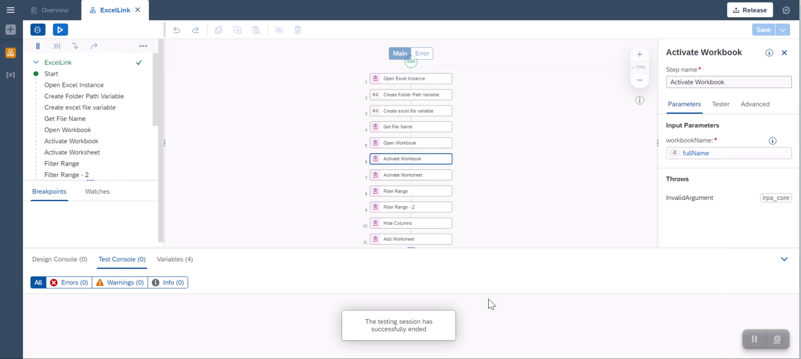

25. At the end, when this tutorial will be tested, for example the below source data will be used:

    <!-- border -->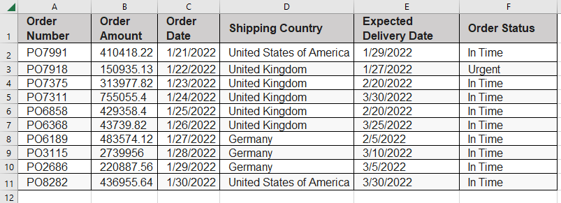

26. After the automaton is executed, it has filtered the data, hidden a column (Column C) and resultant Excel will look like this.

    <!-- border -->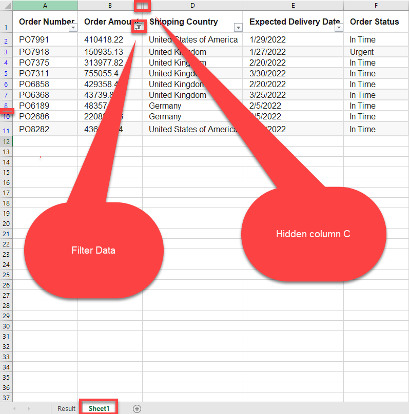

    A new worksheet named Result will be created:

    <!-- border -->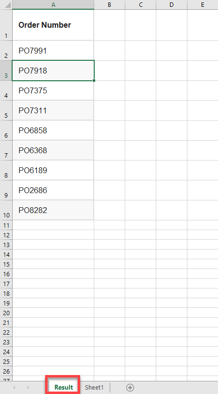

    Excel SDK of SAP Build Process Automation offers a wide variety of activities you can consider for business processes.

    > Review the below resources:

    > - Microsoft Excel Best Practices from the SAP Build Process Automation [documentation](https://help.sap.com/docs/IRPA/8e71b41b9ea043c8bccee01a10d6ba72/76d8129ef8984e4184294ae02b30ed58.html)

    > - Excel Email Best Practices Automation from the [SAP Build Process Automation Store](https://irpa.store.sap.com/#/package/d4c960f9-30ba-4f20-b641-7de878f6f5d5)
