# Create An API Trigger For The  Process
<!-- description --> Create an API trigger for the process

## Prerequisites
 - Complete [Acquire A Template Project From The Store](spa-acquire-businessprocess-store). **OR**
 - Complete the mission [Build Your First Business Process with SAP Build Process Automation](mission.sap-process-automation)

## You will learn
  - How to create an API trigger for the business process to start the instance from my any service like SAP Build Apps.

##Intro
A business process is started by defining a trigger, an event that indicates to your SAP Build Process Automation tenant to start a process instance.
Process triggers can be either a form, such as a request form, or an API call, where an external system starts the process.
You can start an instance of your process using an API call , with the inputs for the call configured from the process builder. These inputs can then be used as input fields in your process.

### Create an API trigger for the process

Once you have completed the tutorial [Acquire A Template Project From The Store](spa-acquire-businessprocess-store), your process looks as below.

<!-- border -->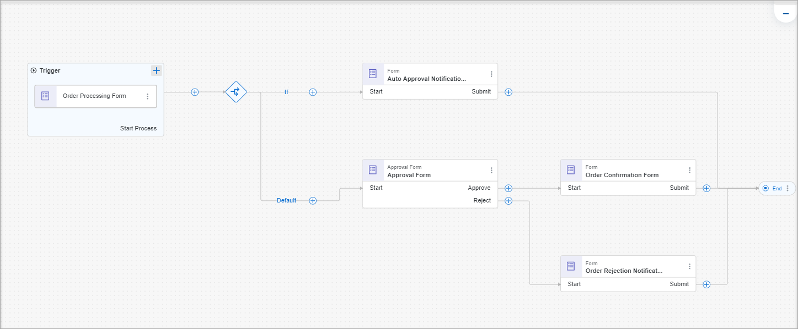

1. Open the process **Order Processing**.

    <!-- border -->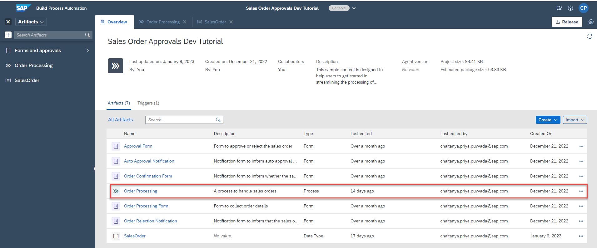

2. From the **Editable** version of the **Sales Order Dev Tutorial** project, choose the three dots of the **Order Processing Form** and select **Remove** to delete the form.

    <!-- border -->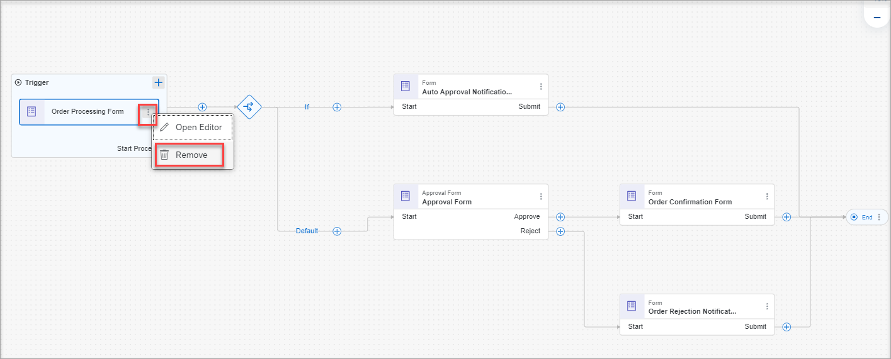

    A warning message will inform you that the related bindings will be removed. Choose **OK**.

    <!-- border -->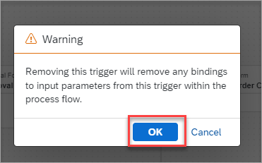

    **Save** the project.

3.  To add an API trigger for the process, click on the **+** > **API** > **New API Trigger**.

    >Since the bindings are lost, all the artifacts are in error state. Once the API trigger is created, the bindings will be updated.  

    <!-- border -->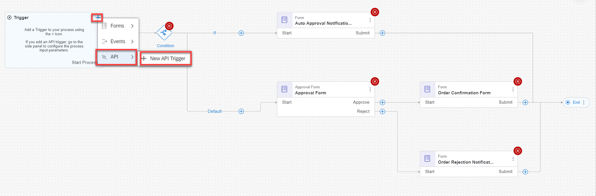

4.  Enter the name of the trigger as **Sales Order Trigger**. Choose **Create**.

    <!-- border -->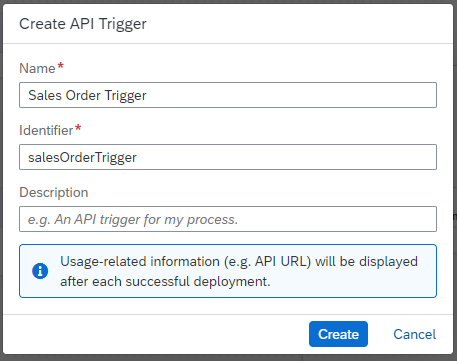

### Create the inputs for an API trigger

1. Select **Sales Order Trigger**, click on the **Canvas**, and choose **Inputs**. Then choose **Configure** to configure inputs.

    <!-- border -->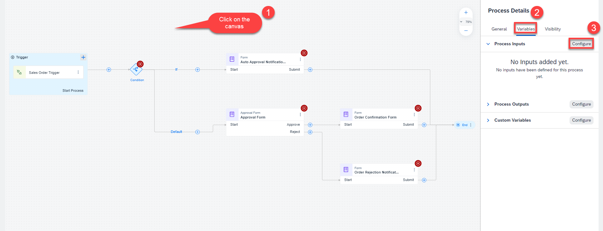

2. In the **Configure Process Inputs** window, choose **Add Input** to add parameters.

    Add the following parameter:

    |  **Name**    | **Type**
    |  :------------- | :-------------
    |  `salesOrderDetails`       | `SalesOrder`

    **Apply** changes.

    <!-- border -->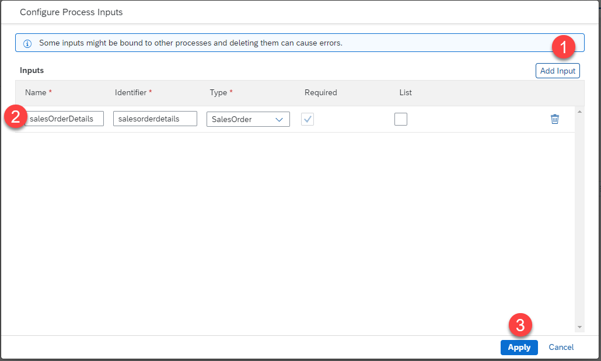

3. Once the trigger is created successfully, you can view the trigger under the **Triggers**  section in the **Overview** page.

    <!-- border -->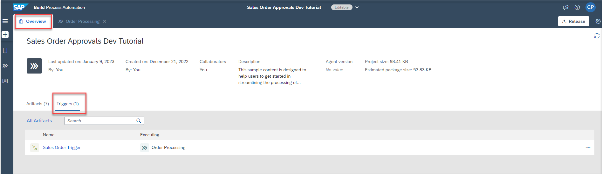  

    >You can edit, deactivate, or delete the API trigger properties from Triggers tab in the respective process builder overview.
    >
    >- Deactivate means that while the trigger exists in design-time, you cannot consume it in runtime.
    >
    >- Delete will permanently delete the trigger from design-time, but for already deployed processes the trigger will still exist at runtime.
    >
    >In general, any changes in the trigger will be affective only when the process is released and deployed.
    >
    >**Note:** All the API triggers that are created in that project will be shown.

**Save** the project.

### Modify the process

Since you have created an API trigger, the bindings were lost as mentioned in **Step1**. Let's adjust the process with the new inputs configured for the API trigger.

1. Choose the condition artifact and click on **Open Condition Editor**.

    <!-- border -->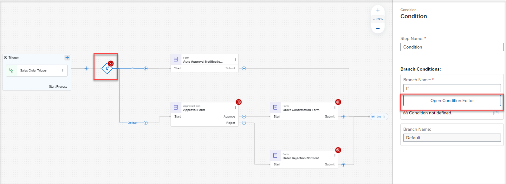

    Enter the condition for the `orderAmount`.

    <!-- border -->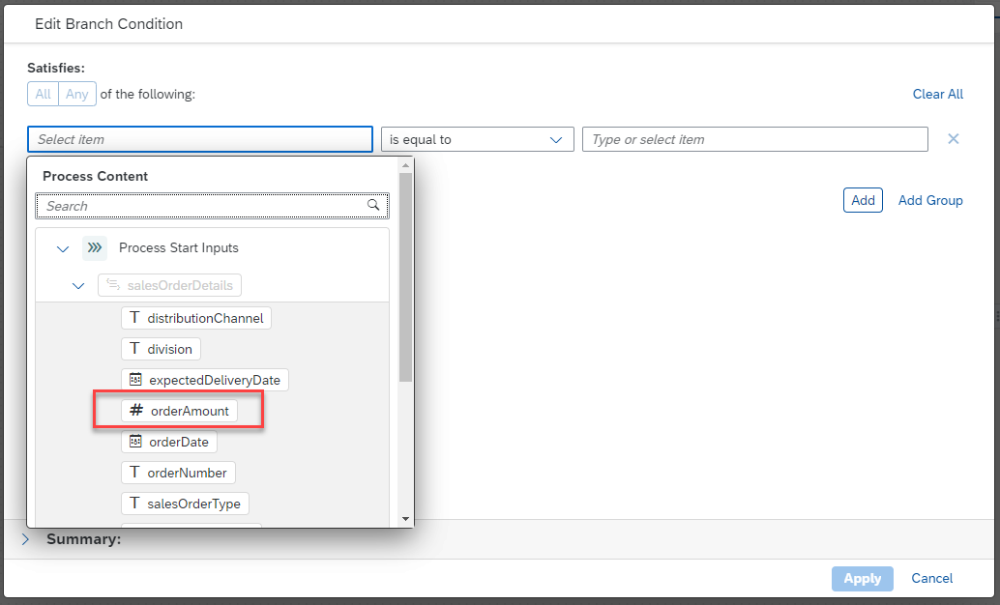

    <!-- border -->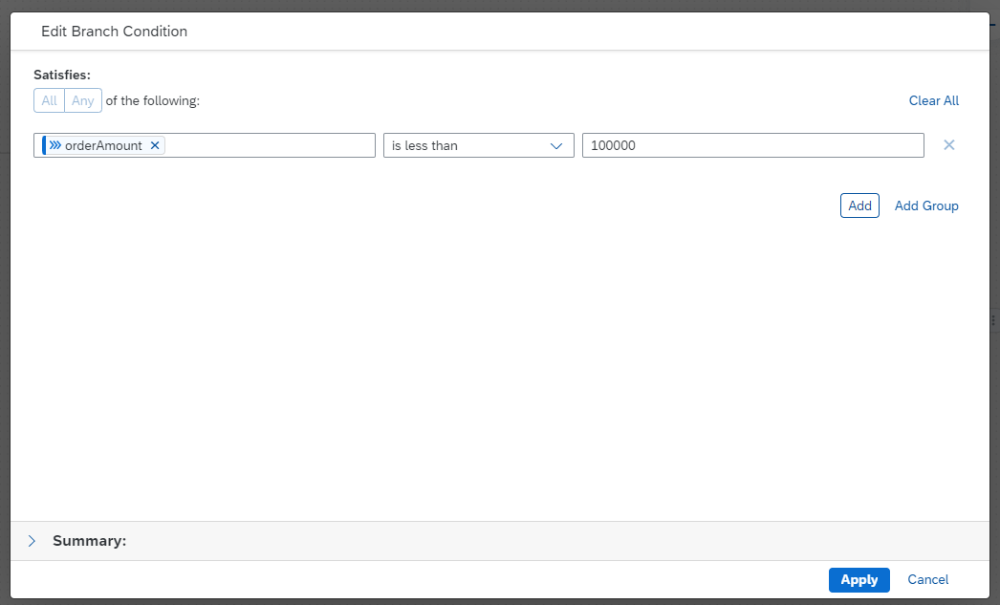

    Click on **Apply**.

2. Choose **Approval Form** to adjust the bindings.

    Modify the **General** section. Since the process would be started through an API, remove the Users **Process Started by** and enter your `EmailID` that was configured for the tenant.

    <!-- border -->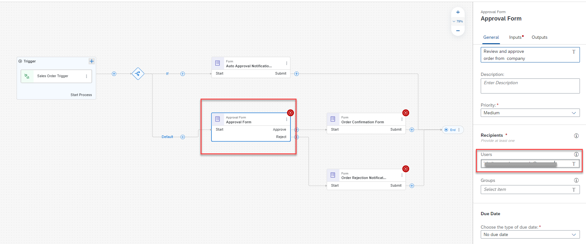

    Modify the **Inputs** section.

    <!-- border -->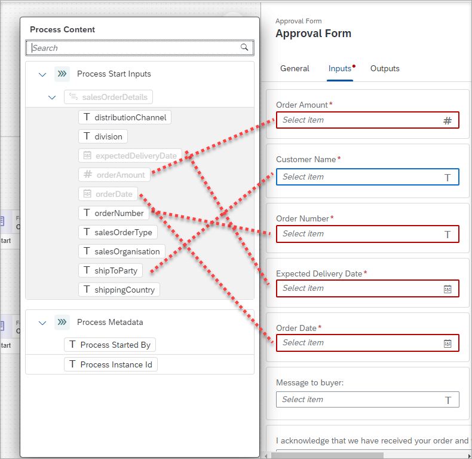

3. Choose **Order Confirmation Form** to adjust the bindings.

    Modify the **General** section. Since the process would be started through an API, remove the Users **Process Started by** and enter your `EmailID` that was configured for the tenant.

    <!-- border -->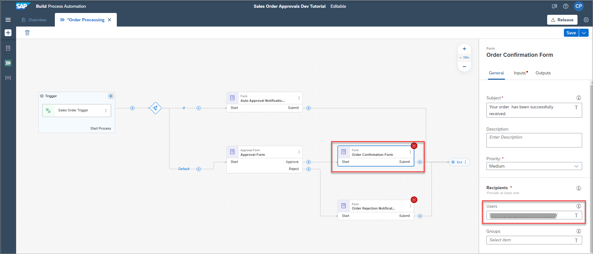

    Modify the **Inputs** section.

    <!-- border -->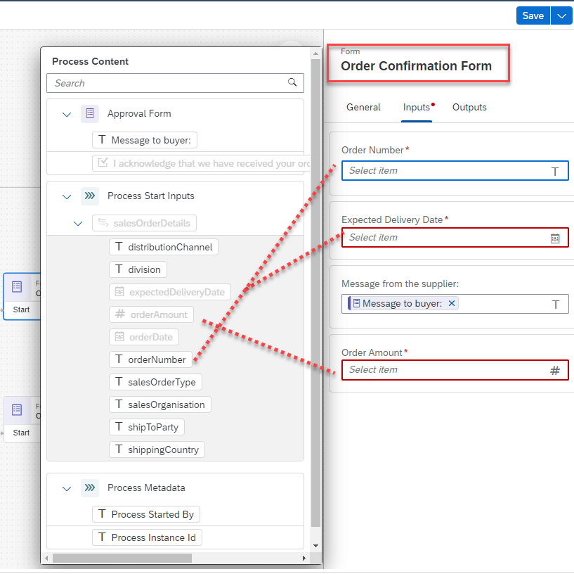

4. Choose **Order Rejection Notification Form** to adjust the bindings.

    Modify the **General** Section. Since the process would be started through an API, remove the Users **Process Stared by** and enter your `EmailID` that was configured for the tenant.

    <!-- border -->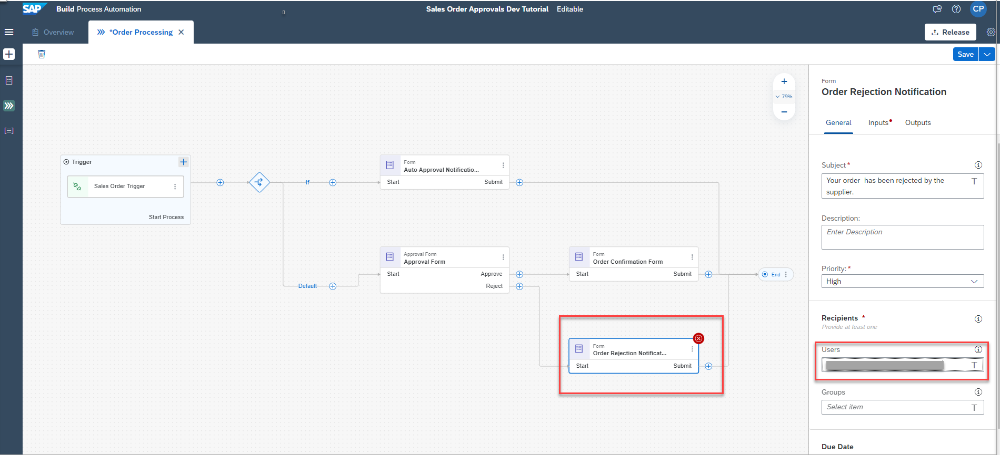

    Modify **Inputs** section.

    <!-- border -->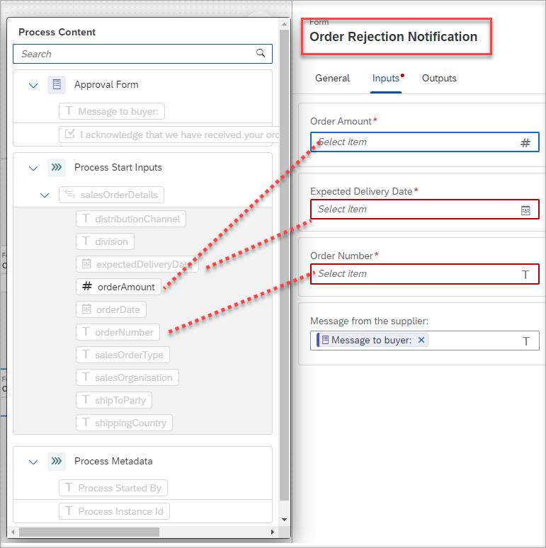

5. Choose **Auto Approval Notification Form** to adjust the bindings.

    Modify the **General** section. Since the process would be started through an API, remove the Users **Process Started by** and enter your `EmailID` that was configured for the tenant.
    <!-- border -->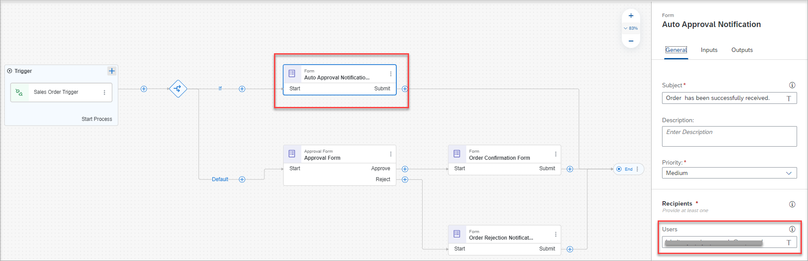

    Modify the **Inputs** section.

    <!-- border -->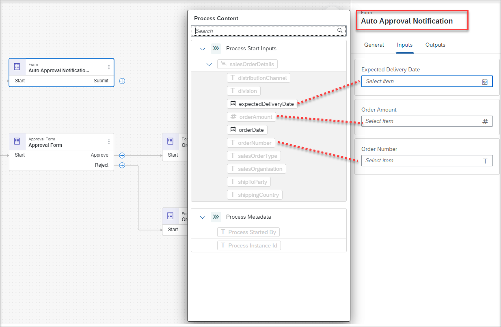

5. **Save** your project.

### Release and deploy the process with an API trigger

1. **Release** the project.

    <!-- border -->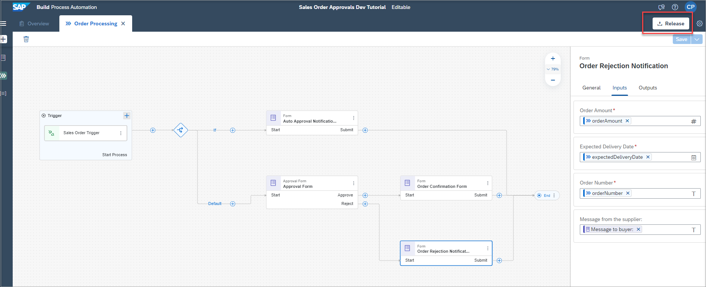

2. After successful release of the project, **deploy** the project.

    <!-- border -->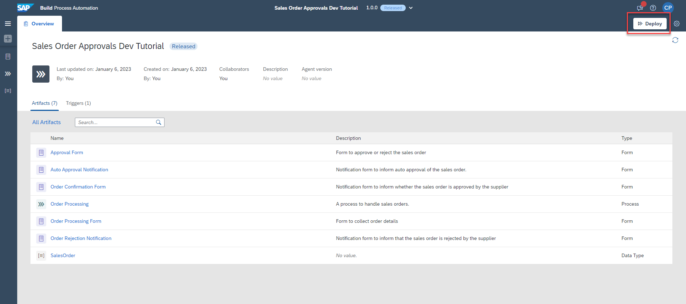

You have successfully released and deployed the process and it is ready to consume via APIs.

---
