# Create a Process Condition
<!-- description --> Create a process condition to route the process based on business criteria

## Prerequisites
- Complete [Create and Configure Forms](spa-create-forms) tutorial

## You will learn
  - How to create and configure a process condition
  - How to define different process flows for each conditional criteria

---

## Intro
In this unit, you will learn how to use process condition in a business process to get rid of unnecessary approvals when the process is routed for auto-approval or one-step-approval flow based on the sales order criteria.

A process condition routes the business process based on certain criteria. These conditions apply an **If or Else** rule to the process content and respond according to the rules defined as settings in the process builder.

### Create process condition

Once the process with forms is designed, define which process flow should run based on if/else condition criteria.  

1. To add a condition to a process open the **Process Builder**. Choose **+** next to the Trigger. Select **Controls** then **Condition**.

    <!-- border -->

2. To configure the condition, choose **Open Condition Editor**.

    <!-- border -->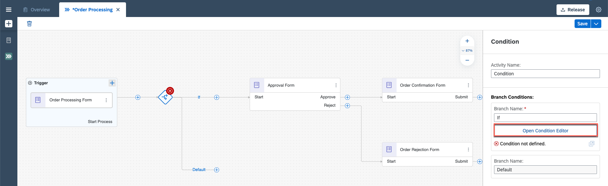

    > Process content will contain a list of attributes that have been defined in previous skills. For example: in the screenshot, you can see attributes from the trigger form. You will use this process content to configure different skills during business process modelling.

3. Edit your branch condition:
   
    - Set **Order Amount** from the process content
    - Select **is less than**
    - Enter **100000** as the value
    - Choose **Apply**

    <!-- border -->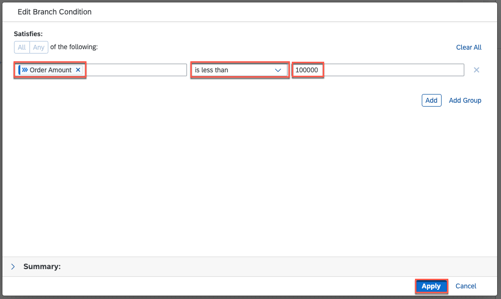

    You have configured your **if** branch to: **if Order Amount is less than 100000**.

4. Similarly, add one more condition. Select  **Add Group**.

    <!-- border -->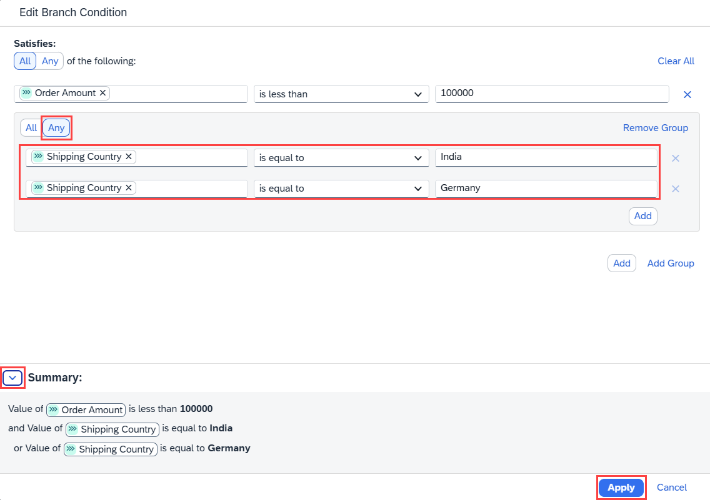

5. In the group section select **Any** to make it **OR** conditional group. Select conditions:

    | **Item** | **Condition** | **Value**
    |  :------------- | :------------- | :-------------
    | Shipping Country | is equal to | India
    | Shipping Country | is equal to| Germany

    Choose **Apply** to add the condition to the business process.

    > You can expand the Summary section to see how the process conditions are designed

    <!-- border -->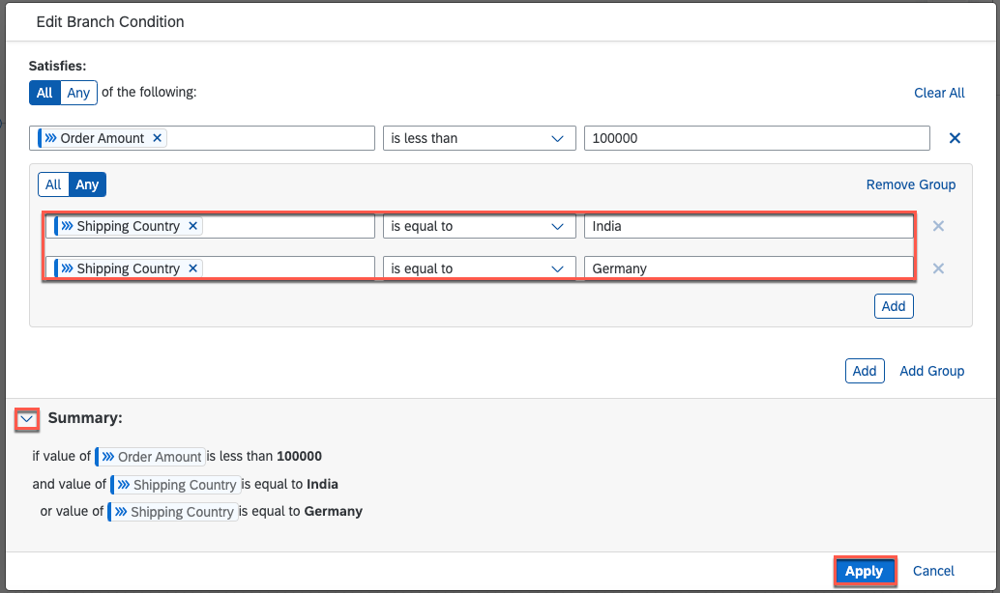

6. Link your **Default** branch to **Approval Form**.

    <!-- border -->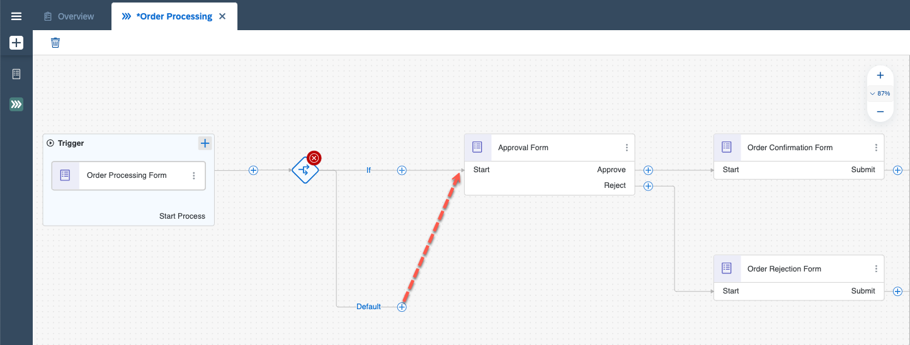

    With this process condition, only the sales order above a specific amount will be sent for approval and the rest will be auto-approved.    

7.	Decide the process flow if the condition criteria is met. First, you have to remove the connection from If-route to Approval Form and then create a new form to notify the requester of the auto-approval.

    <!-- border -->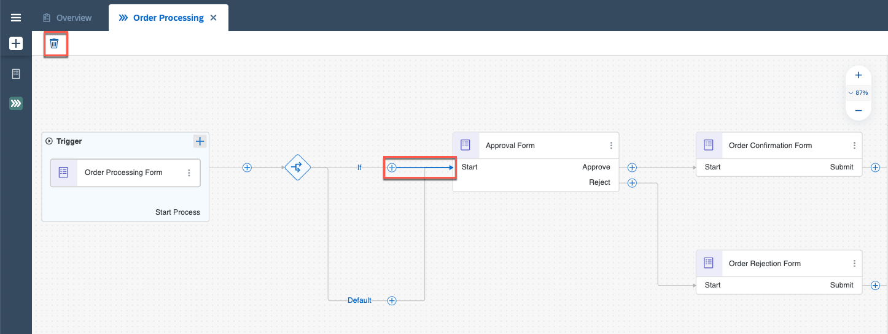

8. To create the new form, add the **New Form** from the **If-route**.

    <!-- border -->

9. In the Create Form window:

    - Enter the Name: **Auto Approval Notification**
    - Enter a Description: **Notification form to inform auto approval of the sales order**.
    - Choose **Create**.

    <!-- border -->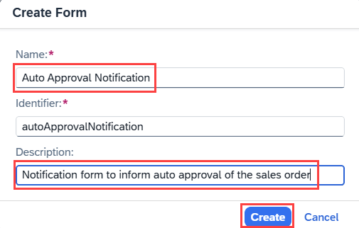

10. **Open Editor** of the form.

11. Design the notification form, the same way as in the previous chapter, to send another notification to the requester about auto-approval. Add **Layout fields**:

    | **Form Fields** | **Field Settings with Label**
    |  :------------- | :-------------
    | Headline 1 | Automatic Order Confirmation
    | Paragraph  | Your order has been received and we will send you the details as soon as the order is shipped. You can find the details of your order below, please review and verify your request:
    | Paragraph  | Your Sale's Order Details:

12. For all below **Input Fields** enter the labels and select the **Read Only** checkbox.

    | **Form Fields**| **Field Settings with Label**
    |  :------------- | :-------------
    | Text | Order Number
    | Number | Order Amount
    | Date | Expected Delivery Date

13. Add **Layout field**:

    | **Form Fields** | **Field Settings with Label**
    |  :------------- | :-------------
    | Paragraph | Please press the SUBMIT button to acknowledge the order status.

    <!-- border -->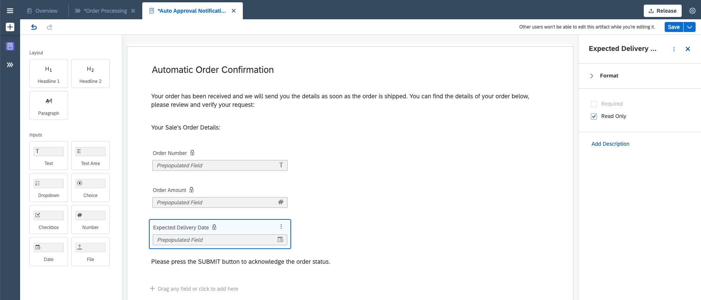

14. **Save** your work.

### Configure auto-approval form

1. Go back to the process builder and configure the auto approval form.

2. Configure the **General** section.

3. Under Subject:
    - Enter: **Your order**
    - Choose: **Order Number** from Order Processing Form
    - Enter: **has been successfully received**

4. Under Recipients select **Process Started By**.

    <!-- border -->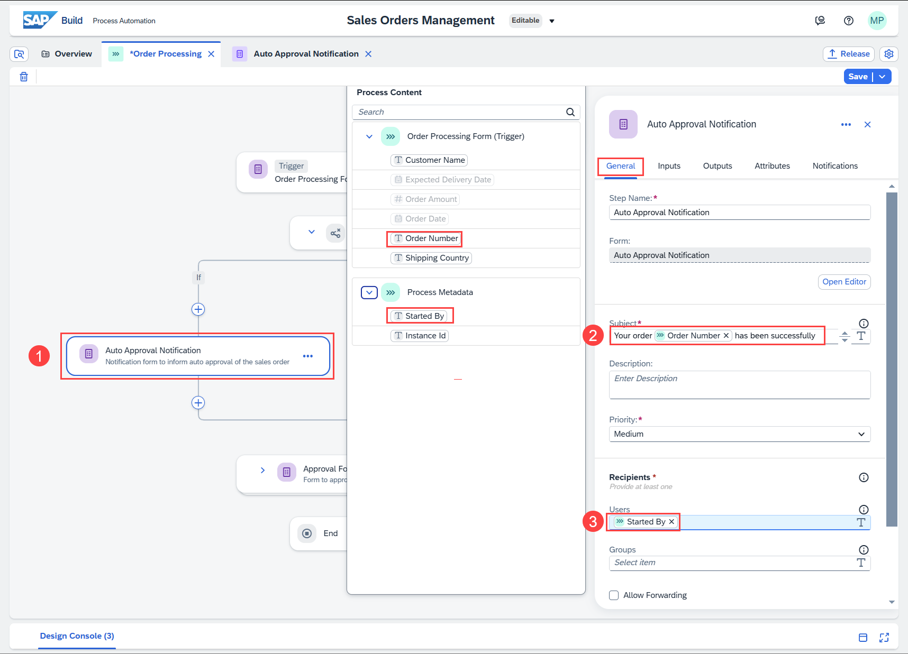

3. Configure the **Inputs** section.

    | Form Input Fields| Process Content Entry
    |  :------------- | :-------------
    | Order Number | Order Number
    | Order Amount | Order Amount
    | Expected Delivery Date | Expected Delivery Date

    <!-- border -->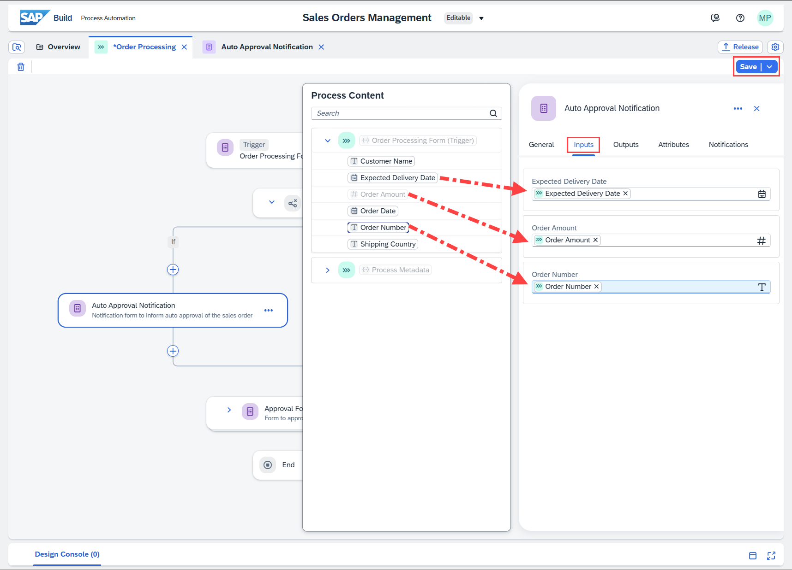

16. Connect the outgoing flow of the auto-approval form to the **End** activity.

    <!-- border -->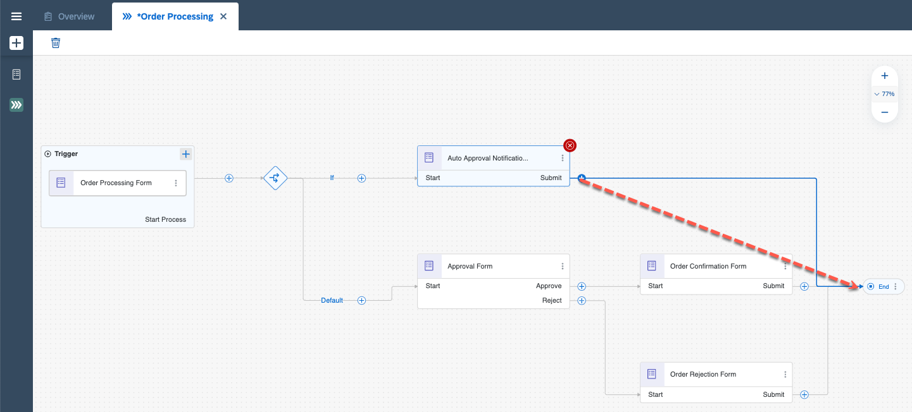

17. **Save** your work.

    This completes the process design with condition criteria that will decide what process flow is executed and whether there will be an auto-approval or a one-step approval route.

---
