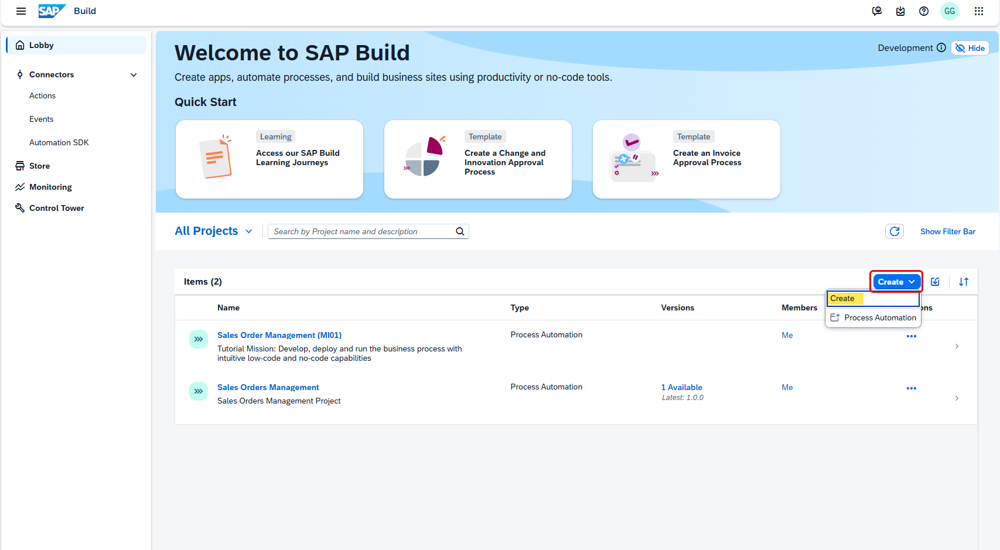
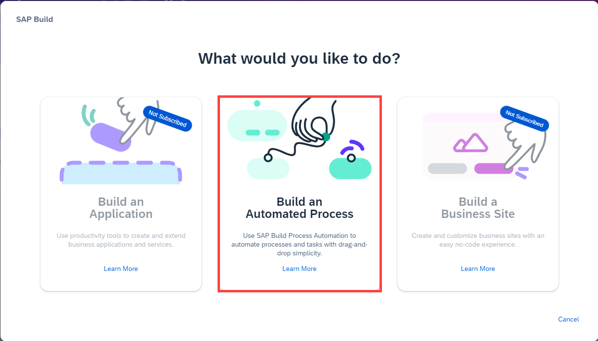
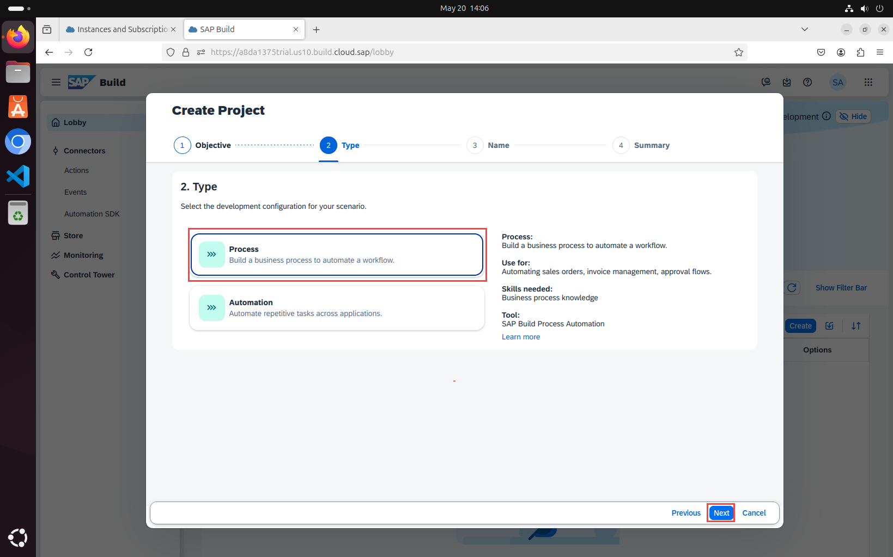
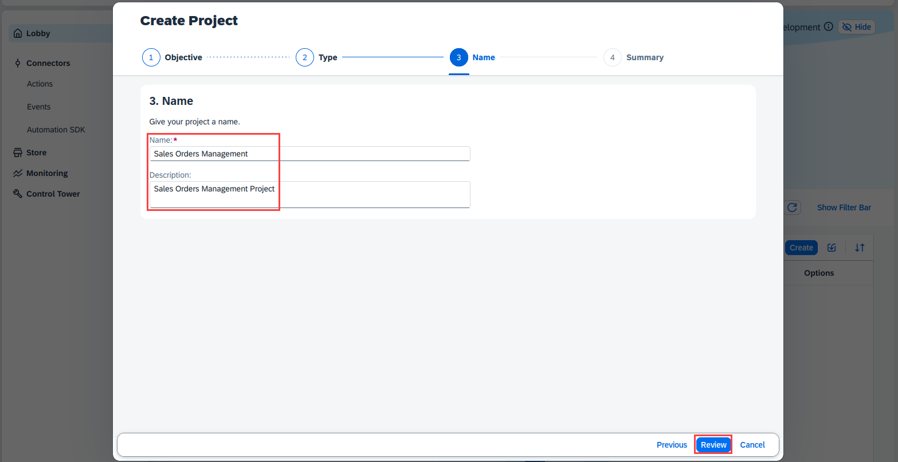
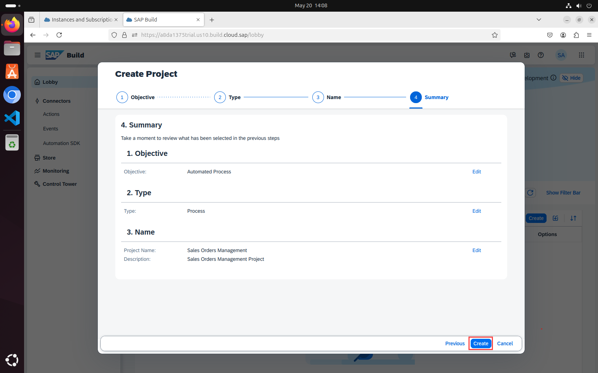
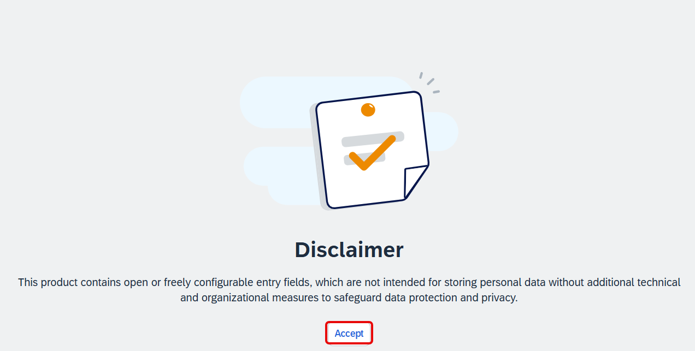
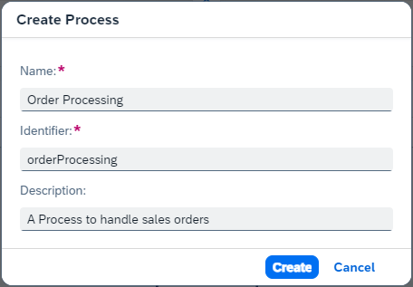

# Create a Business Process
<!-- description --> Create a Business Project and Process to build and extend business processes

## Prerequisites
 - Access to a [SAP BTP tenant with SAP Build Process Automation](spa-subscribe-booster)

## You will learn
  - How to create a SAP Build Process Automation project
  - How to create a process that automates sales order creation and approval

---

## Intro
> **IMPORTANT:** Please refer to sample **Sales Order Management (MI01)** in the SAP Build Store if you face any issues while following the tutorials. To retrieve the sample refer to **step 6** of [Run the Business Process](spa-run-process).

With the new citizen automation user experience, you will get access to a new scope of opportunities for running your day-to-day workflows. In this tutorial, you will learn how a low-code and no-code tool can help you build the apps you need at the speed your business demands, using visual drag and drop tools for application development.

There are many use cases where you can make a difference using SAP Build Process Automation. During this tutorial, you will see how the Sales Order Approval process can be built using forms where a sales order is a document which confirms a sale that is generated by the seller after receiving a purchase order from the buyer. These sale order requests have to be reviewed and approved by the supplier to ensure that the sales orders are delivered on time. Once approved or rejected, the requester will be notified.

---

### Create a business process project

1. In the **Lobby**, click on **Create**. Then choose **Create**.

    > The lobby is a central page for creating, accessing, and managing your projects in SAP Build. You can access business application processes, company configured templates, and other resources for your end-to-end business process.

    <!-- border -->
    

2. Pick **Automated Process**, then choose **Next**.

    <!-- border -->
    

3. Select **Process**, and then choose **Next**.

    > Business Process Projects are a collection of skills in SAP Build Process Automation. Projects are part of the internal business processes of a company and are defined based on business scenarios. A project can contain a set of processes, forms, automations and decisions, which are reusable artifacts.

    <!-- border -->
    

4. In the **Create Project** dialog box, do the following:
   
    - Enter a **Project Name**: Sales Orders Management
    - Enter a **Short Description**: Sales Orders Management Project
    - Choose **Review**

    <!-- border -->
    

5. In the **Create Project** dialog box, choose **Create**:

    <!-- border -->
      

6. If a **Disclaimer** page appears after the project is created, click on **Accept**.  

     <!-- border -->  
     

### Create a business process

1. A new tabs opens with the newly created project.

2. In the **Create Process** dialog box, provide the following:
   
    - Enter a **Name**: Order Processing
    - Enter a **Description** for your process: A process to handle sales orders
    - Choose **Create**

    > Inside a project, you can create a process. This process is equivalent to a workflow in any business scenario. You can create this process from different skills such as forms, decisions, automations.

    <!-- border -->
    

    > Note that the form **Identifier** field is auto-filled.

---
