# Automate Windows Clock Application Using the Recorder
<!-- description --> Automate the creation of alarms in the windows clock application with set and get activities

## Prerequisites
 - A [SAP BTP Free Tier Account](spa-subscribe-booster) with SAP Build Process Automation booster
 - Install and set up the [Desktop Agent 3](spa-setup-desktop-3-0-agent) to run the automation
 - Basic understanding of how to record applications in SAP Build Process Automation

## You will learn
  - How to use the Recorder with the desktop clock application
  - How to read the value of an element during recording
  - How to set the value of an element during recording
  - How to automate the application
  

## Intro
The Recorder allows you to record desktop applications. It enables users to speed up the bot design process. Using the Recorder, actions on the provider application can be recorded, metadata of the screen can be captured and the artifacts can be exported to SAP Build Process Automation. In this tutorial, you will discover two new features of the recorder: 

- Now the Recorder can read the value of an element though the get mode. 
- The recording widget is further enhanced to support the editing of input to the **Set** activity. Once the **Set** activity is generated, you can change the value of the input.
---

### Open the application

Open the clock application on your desktop.

<!-- border -->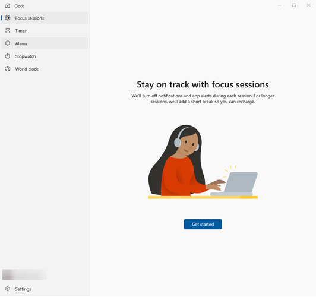

### Create your project

You will create a new project in **SAP Build Process Automation** application.

1. Navigate to **SAP Build** application and create a project by choosing **Create**.

    <!-- border -->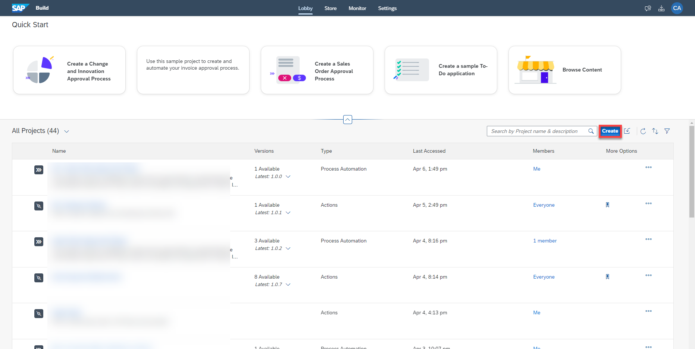

2. Select **Build an Automated Process**.

    <!-- border -->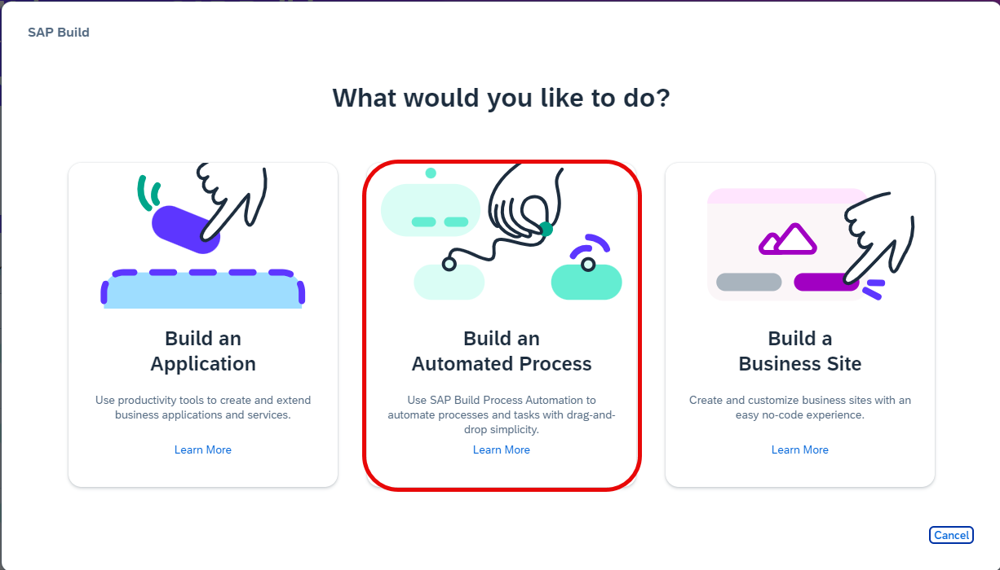

3. Select **Task Automation**.

    <!-- border -->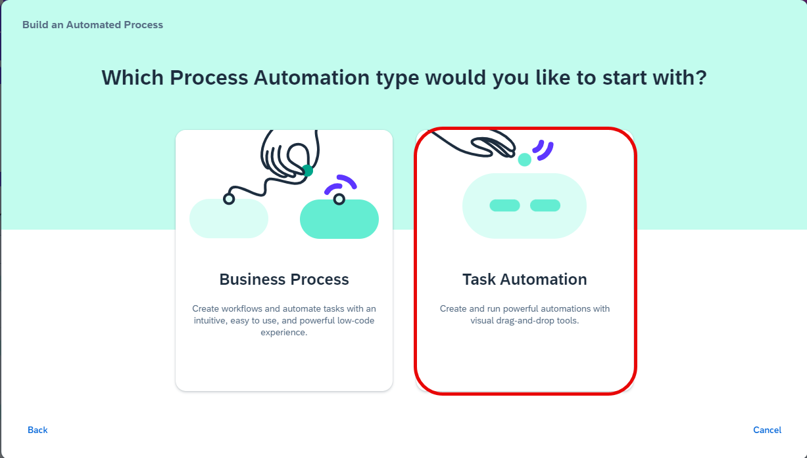

4. In the **Create a Task Automation project** window, please give the project the name: **Create Alarms** and the description: **Automate alarms creation in the desktop clock** and choose **Create**.

    <!-- border -->

5. Once the project is created, a new tab will open. You will need to configure your agent version. Select the version of the agent installed on your machine and choose **Confirm**.

    <!-- border -->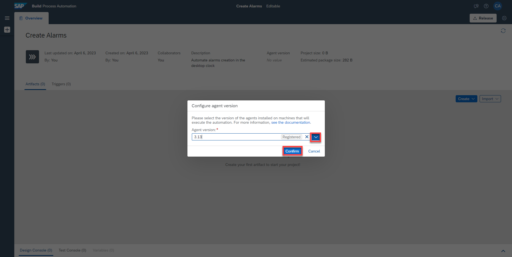

6. A pop-up window asking you to create an automation will appear, please choose **Cancel**.

    <!-- border -->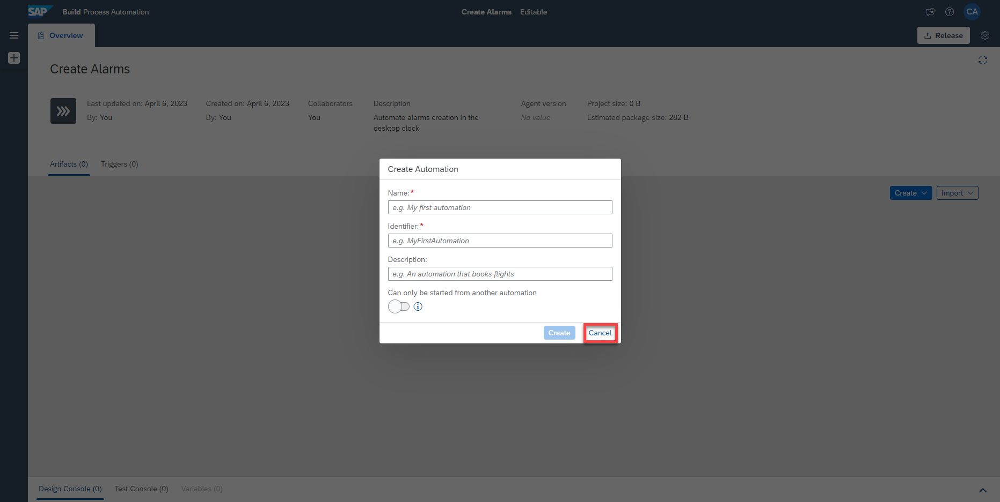

    > ### What is going on?
    > As you will be using the recorder feature, you do not need to create an automation but an application.

    The next step would be to create your application within your project.

### Create and capture your application

1. In the **Overview** tab of your **Create Alarms** project, choose **Create**, then choose **Application**.

    <!-- border -->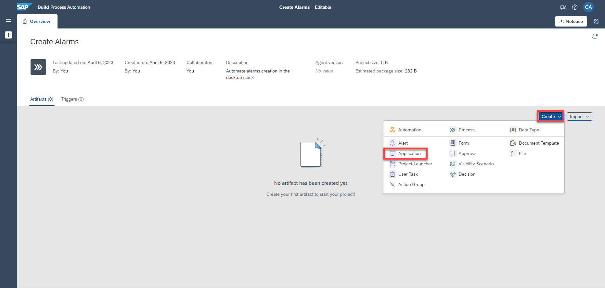

2. In the **Create Application** window, name your application: **Create Alarms** and choose **Create**.

    <!-- border -->

3. From the list of open applications, under UI Automation, select **Clock** application and choose **Next**.

    > ### What is going on?
    > **SAP Build Process Automation** starts detecting the applications and their screens currently running on your local machine. When it's done, you'll see a list of screens in the picker panel on the left.
 
    <!-- border -->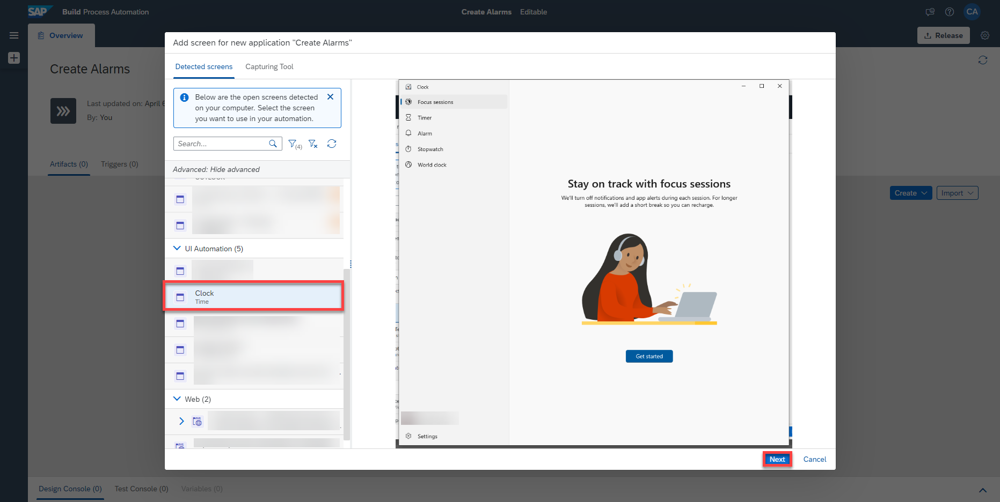

    > You have the option to select either **Recorder** type or **Manual Capture** type. This tutorial will show you how to use the **Recorder**.

4. Select **Recorder** as type and choose **Record**.

    <!-- border -->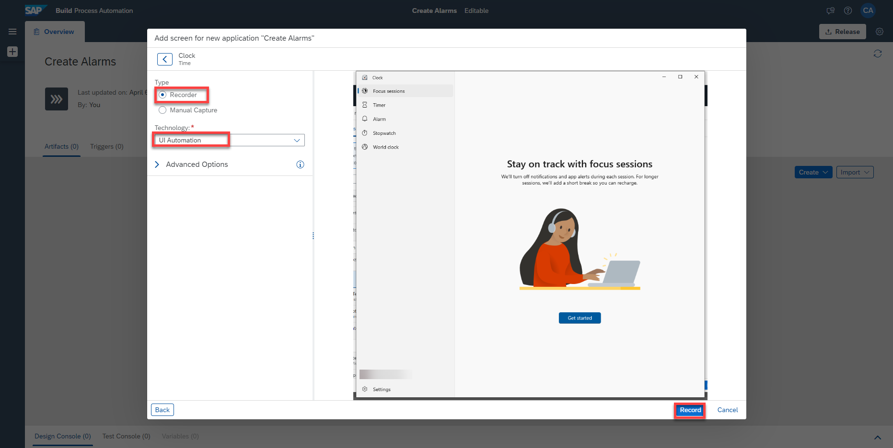

    > Please note that the technology that you will be recording is **UI Automation**.

5. You will notice 2 pop-ups for recording in progress and SAP Intelligent RPA Recorder.

    <!-- border -->  

### Record your application 

> The Recorder records the steps you perform across the screens of an application.

1. Click the **Record** <!-- border --> button to start recording in the recorder widget. A green border around the **Clock** screen appears. This means that the screen is being recorded.

2. Select **Alarm**.

3. Click on **+** to add a new alarm.

    <!-- border -->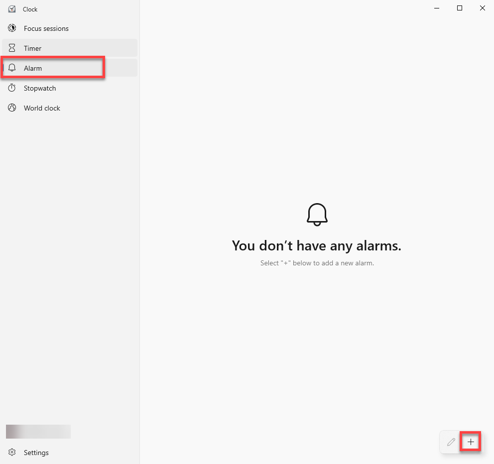

    The recorder detects a change of screen and starts recording this new screen. Please wait until the screen is fully captured.

4. In the **Alarm Name** field enter: **Morning Alarm** and hit enter. This will create a **Set** activity.

5. Choose **Save**.

    <!-- border -->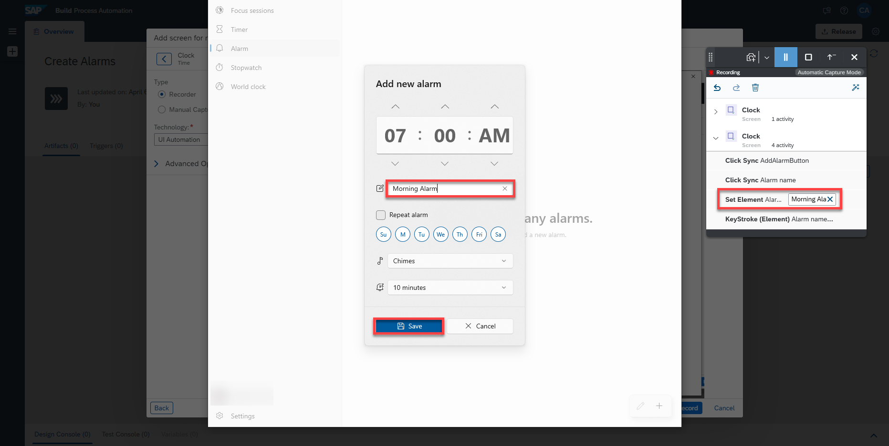

    Now, the recording widget is enhanced to support the editing of input to the **Set** activity. Once the **Set** activity is generated, you can change the value of the input if required.

    The input can be of three types. You can provide:

    - hard coded value which is shown inside double quotes.
    - create and assign new variable which is shown with a prefixed '+' symbol.
    - select an input from a list of pre-existing variables.
   
    <!-- border -->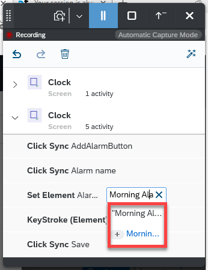

6. Create and assign a new variable by choosing the value with the prefixed '+' symbol.
       
    <!-- border -->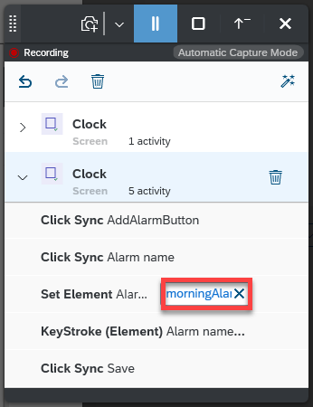

7. You need to capture this new screen. Choose the **New Screen Capture** <!-- border --> button.

8. Wait until the screen is fully captured.

    <!-- border -->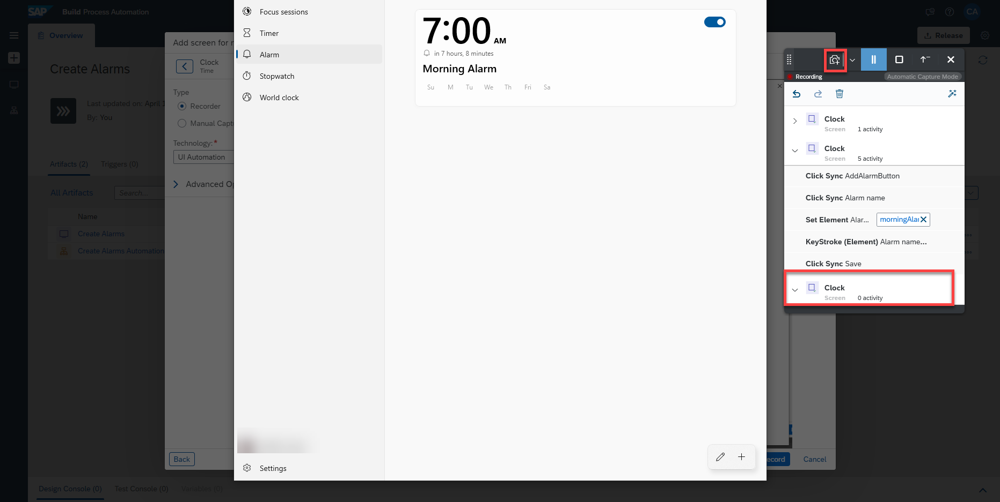

    You will now get the value of the alarm name element. You can read the value of an element during the recording steps only in enabled **Get** mode.

9. Click the **Get Activity Mode** icon. 

    <!-- border -->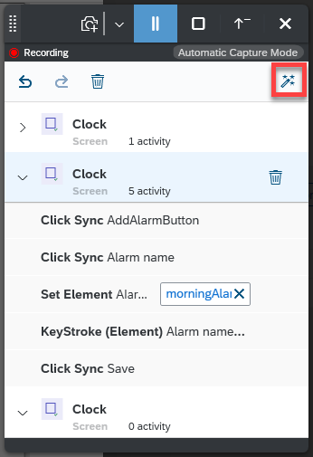

    This will enable the **Get** mode. Once the mode is enabled, the icon is highlighted as shown in the following screenshot and a hint message is displayed at the bottom of the recording widget.

    <!-- border -->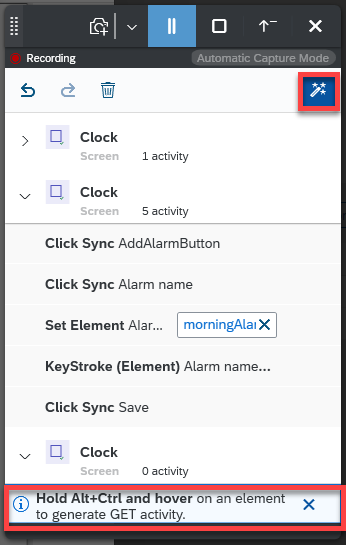

    > To generate the **Get** activity, place the cursor at the targeted element (Morning Alarm) and the selection is highlighted with the green bounding rectangle. 
    
10. If the bounding rectangle targets the correct element, press the keyboard shortcut Alt + Ctrl to generate the activity, otherwise, move the cursor further for the correct selection.

    The **Get** activity is generated with the output variable as shown in the following screenshot. You can further utilize this output variable according to your use case.

    <!-- border -->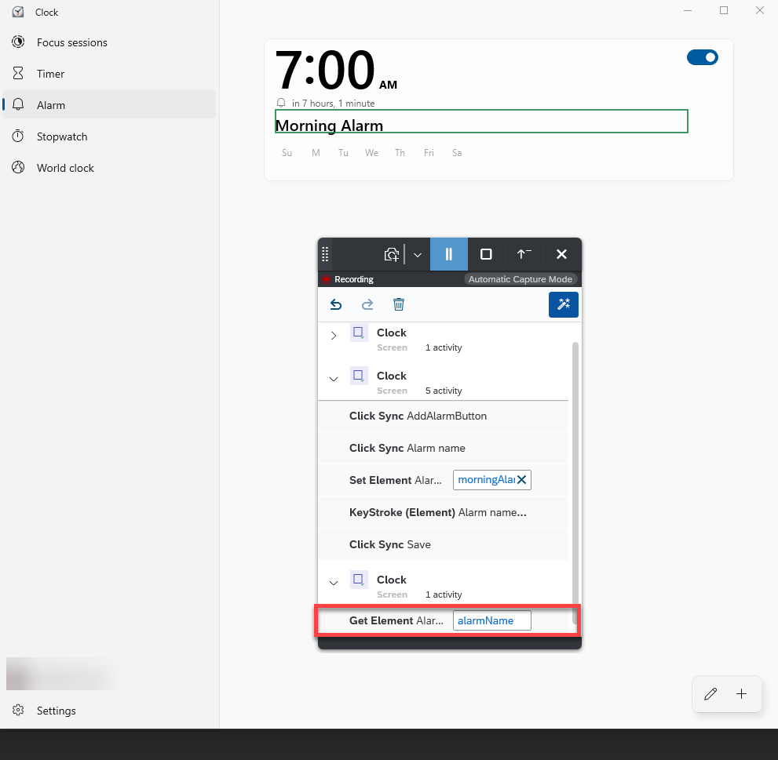

11. Stop the **Get Activity Mode** by clicking on <!-- border -->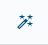 icon.

12. Now you will create a new alarm. Click on **+**.

13. Click on the Alarm Name field to change the name.

    The recorder detects a change in screen. Wait until the screen is fully captured.

14. Change the name to **Evening Alarm** and hit enter.

15. Select the picker, set it to **PM** and hit enter.

    > Please note that for each element that is set, you may change the input value as you wish.

16. Choose **Save**.

    <!-- border -->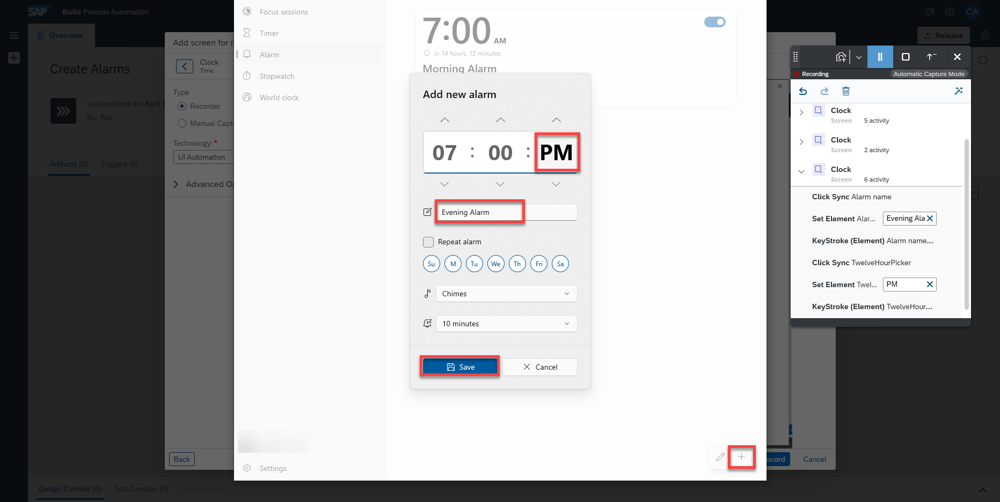

17. Click on the Alarm Name **Set Element**. You will assign and create an **Evening Alarm** variable.

18. Select the value with a prefixed '+' symbol.

    <!-- border -->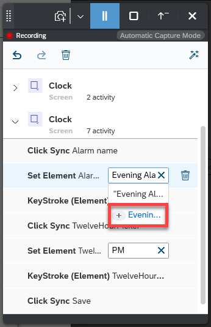

    The new variable `eveningAlarm` has been created.

    <!-- border -->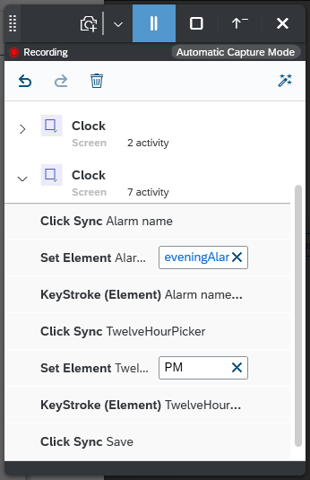

19. You need to capture this new screen. Choose the **New Screen Capture** <!-- border --> button.

20. Wait until the screen is fully captured.

    <!-- border -->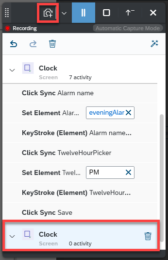

21. Now you can create another alarm, click on **+**.

22. Select the Alarm Name field.
  
    The recorder detects a change in screen. Wait until the screen is fully captured.

23. Change the name to **My Alarm** and hit enter.

24. Select the hour picker, set it to **09** and hit enter.

25. Choose **Save**.

    <!-- border -->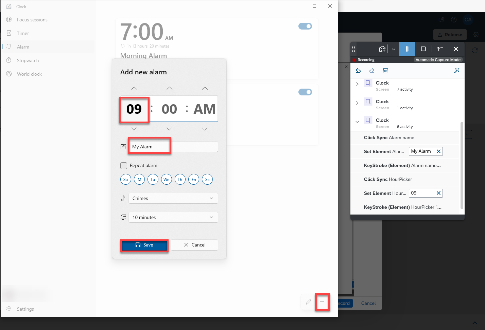

26. Create a `myAlarm` variable by selecting the value with a prefixed '+' symbol.

    <!-- border -->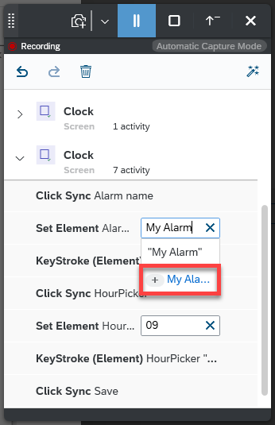

27. Clear the variable by selecting the **x**.

    <!-- border -->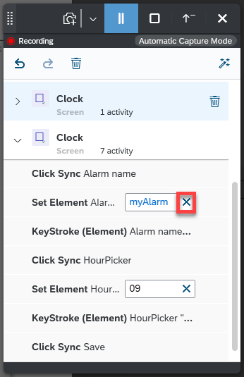 

28. Click on the empty **Set Element** field and you may see the list of variables that you created.
        
    <!-- border -->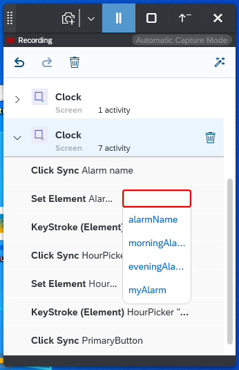 

29. Select the `alarmName` variable.

    > ### What is going on?
    > This will set the name of the alarm to the value of the `alarmName` element that was generated through the **Get** mode.

### Export your recording

1. Choose <!-- border --> button to stop the recording.

2. Select **Export** to move the recording to **SAP Build Process Automation**.

    <!-- border -->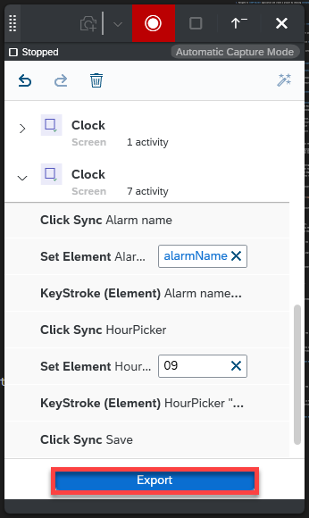

3. Reset and close the Clock application.

### Review your automation

> Once all the artifacts are moved to **SAP Build Process Automation**, the automation can be executed to replay the recorded steps. It can also be modified and then executed.

You can see that a **Create Alarms** application was created.

<!-- border -->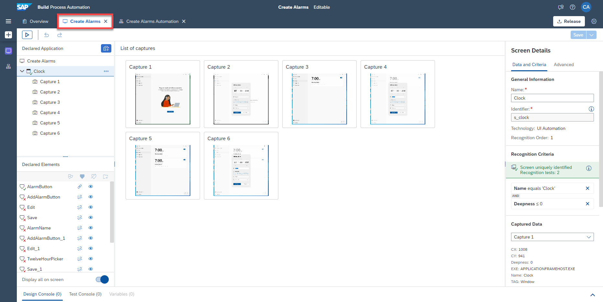

As well as a **Create Alarms Automation**.

Under **Input/Output**, you may see that the created variables `morningAlarm` and `eveningAlarm` will be displayed.

<!-- border -->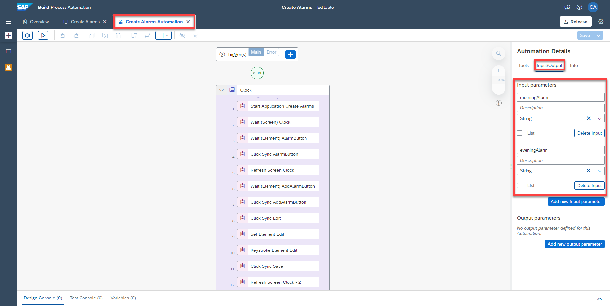

You may select the **Get Element** activity and notice the same output parameter as shown during the time of recording in the recording widget.

<!-- border -->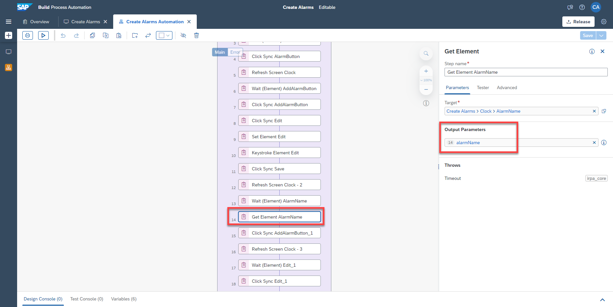

### Test your automation

1. Click **Test** to test the automation.

2. Fill in the the input parameters as you wish, such as:

    - `morningAlarm`: Prepare team meeting
    - `eveningAlarm`: Training session

    > ### What is going on?
    > These are the two variables that got created during the recording stage and are now displayed as input parameters. You now have the choice to set the alarm names to any name of your liking through these input parameters.

3. Choose **Test**.

    <!-- border -->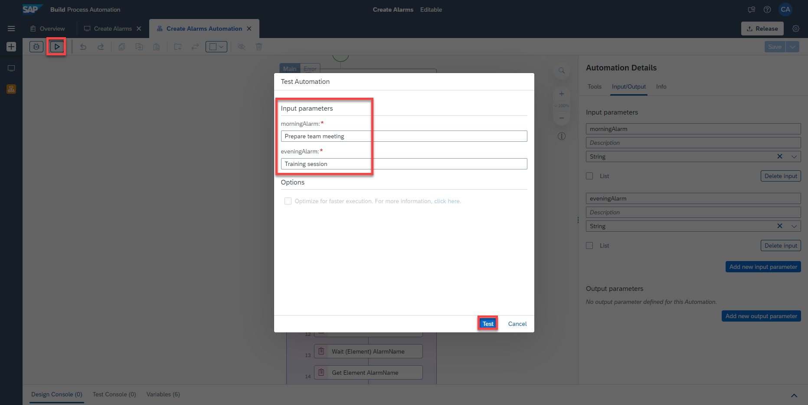

    The automation creates three alarms:

    - **Prepare team meeting** alarm for 7am
    - **Training session** alarm for 7pm and
    - another **Prepare team meeting** alarm for 9am (This alarm sets the name to the value retrieved from the `alarmName` element (from your first alarm))
    
    <!-- border -->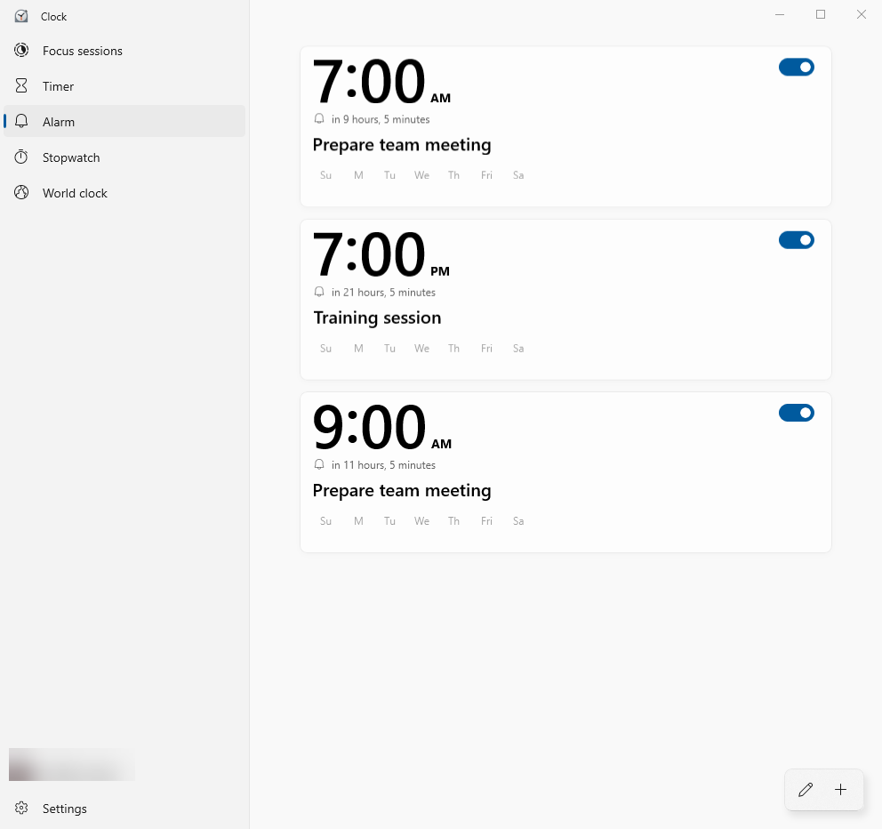

