# Automate SAP S/4 HANA Cloud Applications using Recorder
<!-- description --> Automate the process of creating a purchase order in Manage Purchase Orders application in SAP S/4 HANA Cloud.

## Prerequisites
 - A [SAP BTP Free Tier Account](spa-subscribe-booster) with SAP Build Process Automation booster
 - Install and set up the [Desktop Agent 3](spa-setup-desktop-3-0-agent) to run the automation
 - Register to [SAP S/4 HANA Cloud Trial](https://www.sap.com/products/erp/s4hana/trial.html) account
 - Manage Purchase Orders application must run in the background

## You will learn
  - How to automate applications in SAP S/4 HANA Cloud
  - How to re record applications

### Search for Manage Purchase Orders Application

1.  Once you have successfully created S/4 HANA Cloud Trial account as mentioned in pre-requisites, navigate to **SAP S/4 HANA Cloud Trial account.**

2.  Search for **Manage Purchase Orders**.

    <!-- border -->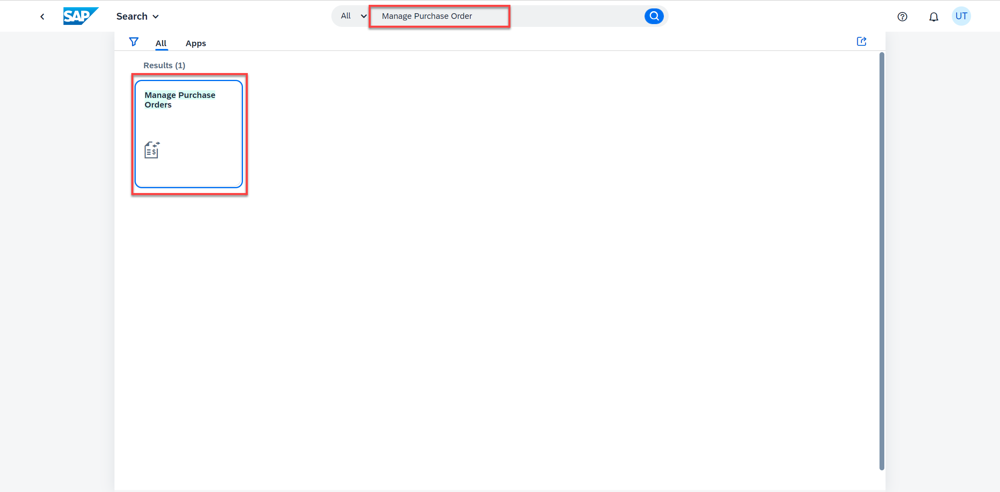

### Create your project

You will create a new project in SAP Build Process Automation application.

1. Navigate to **SAP Build** application and create a project by choosing **Create**.

    <!-- border -->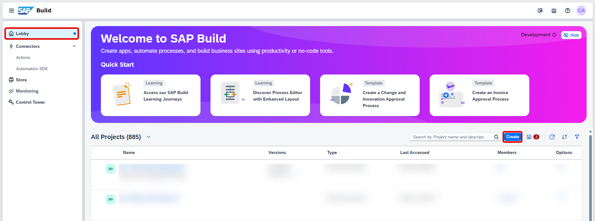

2. Select **Build an Automated Process**.

    <!-- border -->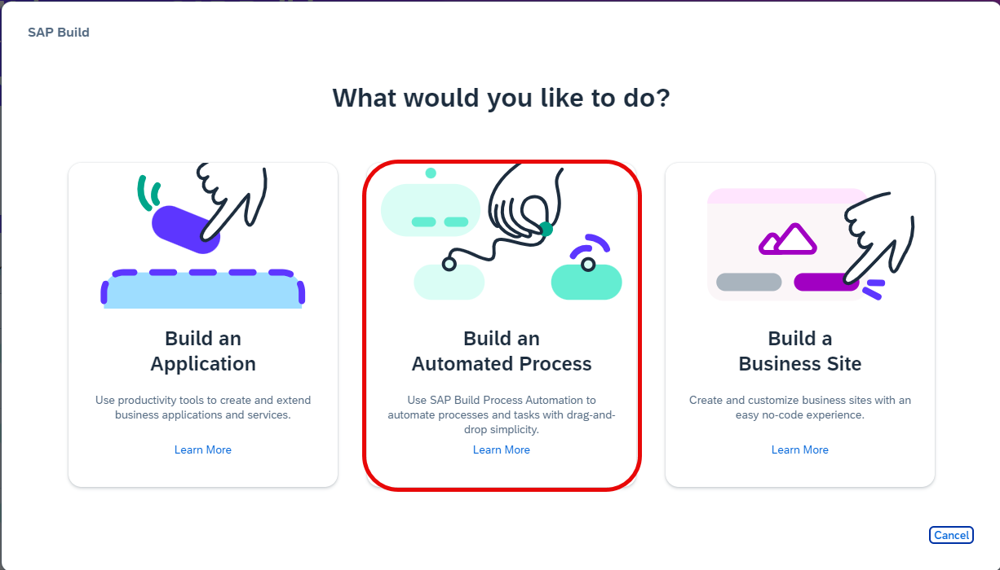

3. Select **Task Automation**.

    <!-- border -->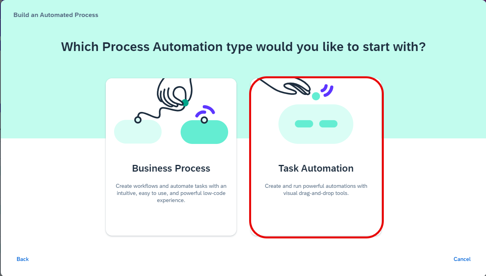

4. In the **Create Task Automation** window, please give the project the name: **Upload Purchase Order** and choose **Create**.

    <!-- border -->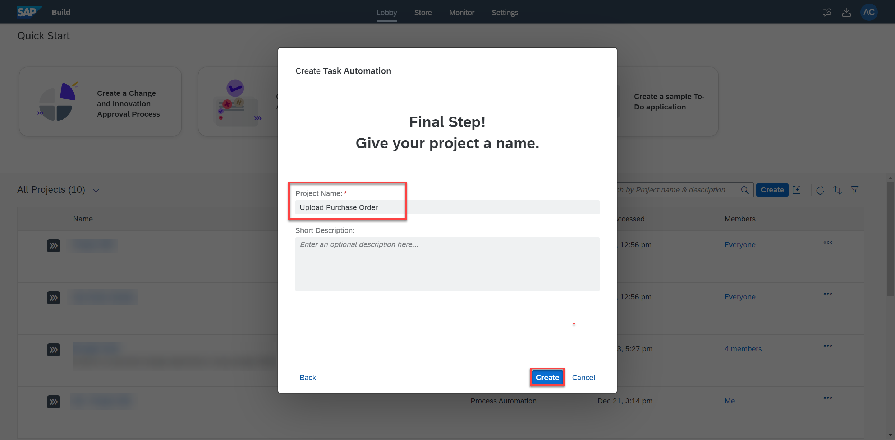

5.  Once the project is created, a new tab will open. You will need to configure your agent version. Select the version of the agent installed on your machine and choose **Confirm**.

    <!-- border -->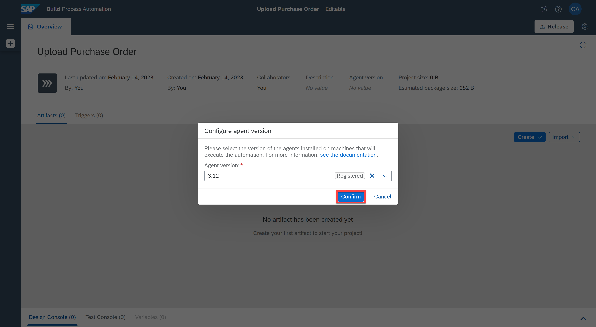

6. A pop-up window asking you to create an automation will appear, please choose **Cancel**.

    <!-- border -->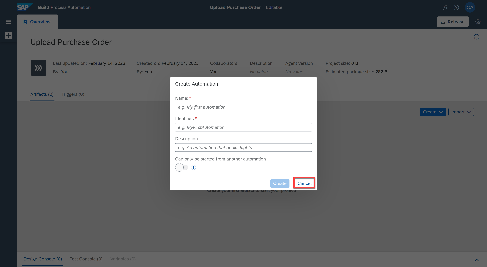

    > ### What is going on?
    > As you will be using the recorder feature, you do not need to create an automation but an application.

    The next step would be to create your application within your project.

### Create your application

Before recording the steps of a workflow, ensure that the Manage Purchase Orders application and the SAP Build Process Automation application are running in a Chrome browser in two separate windows.

1. Open the **Manage Purchase Orders** application in your SAP S/4 HANA Cloud Trial account.

2.  In the **Overview** tab of your **Upload Purchase Order** project, choose **Create**, then choose **Application**.

    <!-- border -->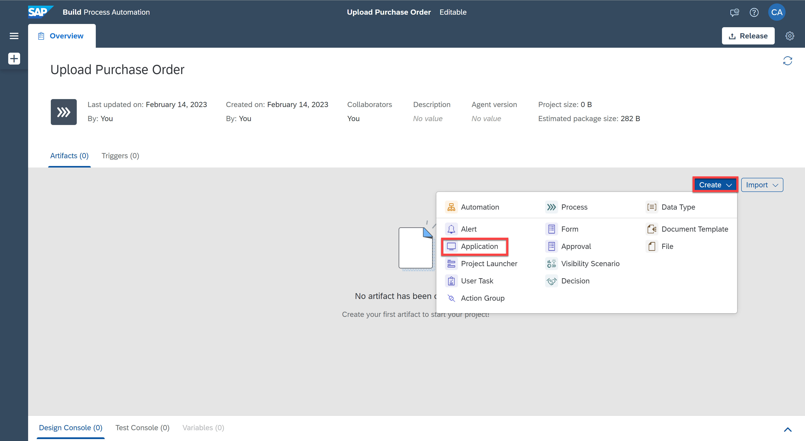

3. In the **Create Application** window, type **Manage Purchase Orders** as an application name and choose **Create**.

    <!-- border -->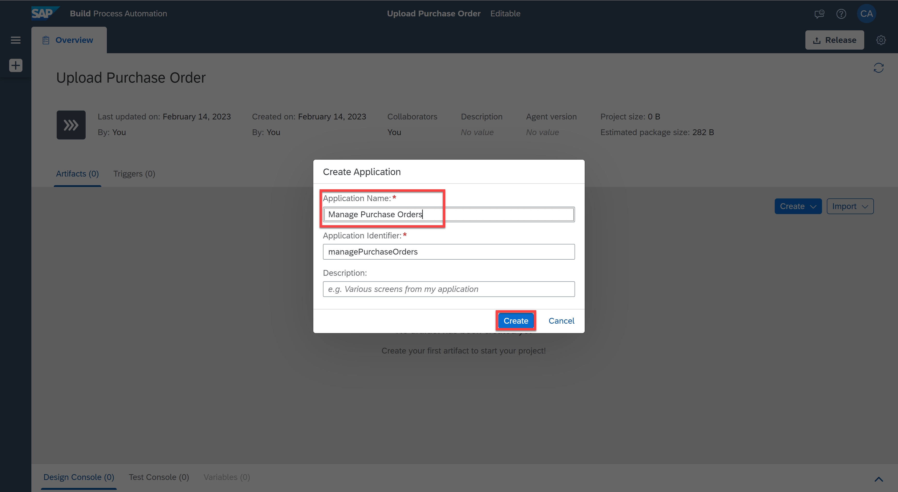

    > ### What is going on?
    > SAP Build Process Automation starts detecting the applications and their screens currently running on your local machine. When it's done, you'll see a list of screens in the picker panel on the left.

4.  Select the **Manage Purchase Orders** screen and choose **Next**.

    <!-- border -->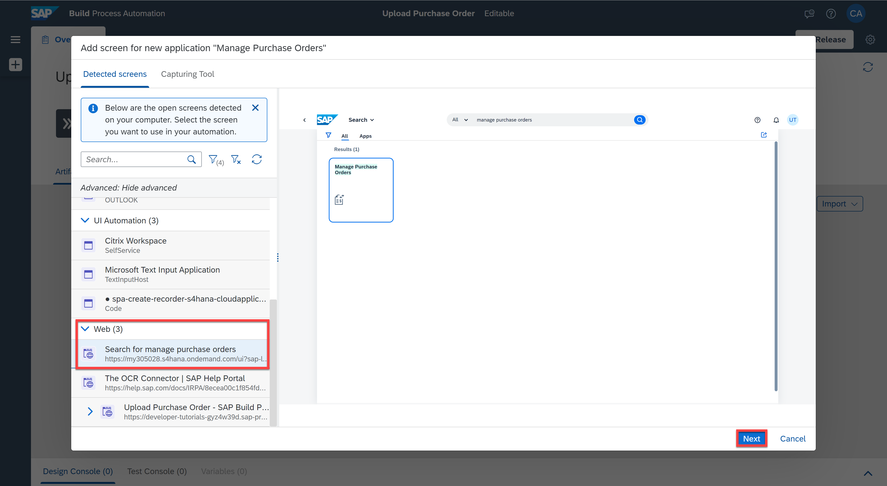

    > You have the option to select either **Recorder** type or **Manual Capture** type. This tutorial will show you how to use the **Recorder**.

5. Select **Recorder** as type and choose **Record**.

    <!-- border -->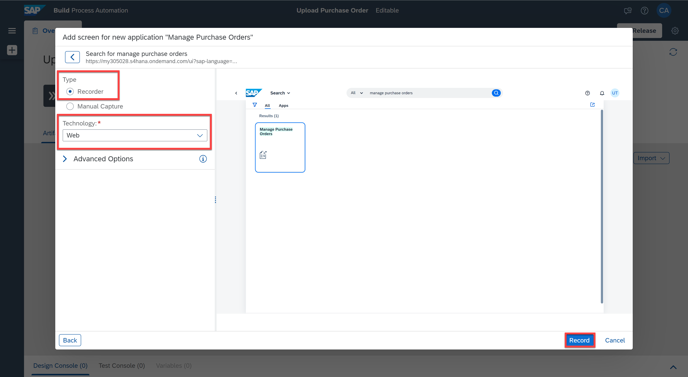

    > Please note that the technology that you will be recording is **Web**.

### Record your application

After the dependencies have been successfully added, **SAP Build Process Automation** application is locked and you will be directed to the S/4 HANA application you want to record.

The Recorder widget will appear. In this tutorial, you will learn how to use a new feature in the Recorder **Automatic Capture Mode**.  

In earlier versions of the Recorder, when the screen changed in the application, the recorder showed a capture hint. This reminded the user to capture the screen where you had to click on the camera icon to capture the screen. Now, the recorder is enhanced such that, as soon as any screen changes are detected, it automatically initiates the capture and captures the screen.

1. Choose **Record** to start recording.

    <!-- border -->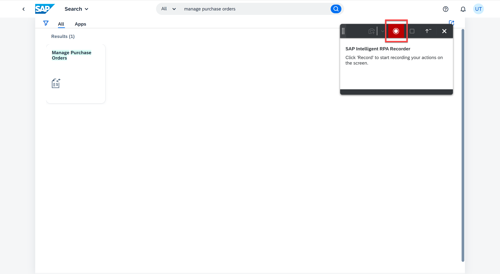

    You can see the **Automatic Capture Mode** is on.

    <!-- border -->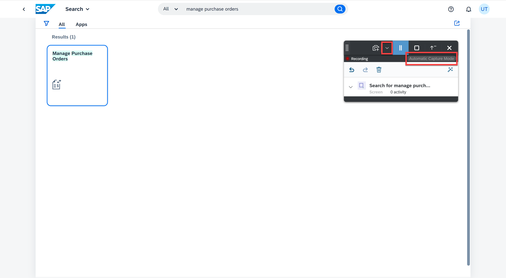

    You can select the drop down menu to view the different available capture modes such as:

    - Automatic Capture Mode
    - Manual Capture Mode
    - Capture on Hover

    <!-- border -->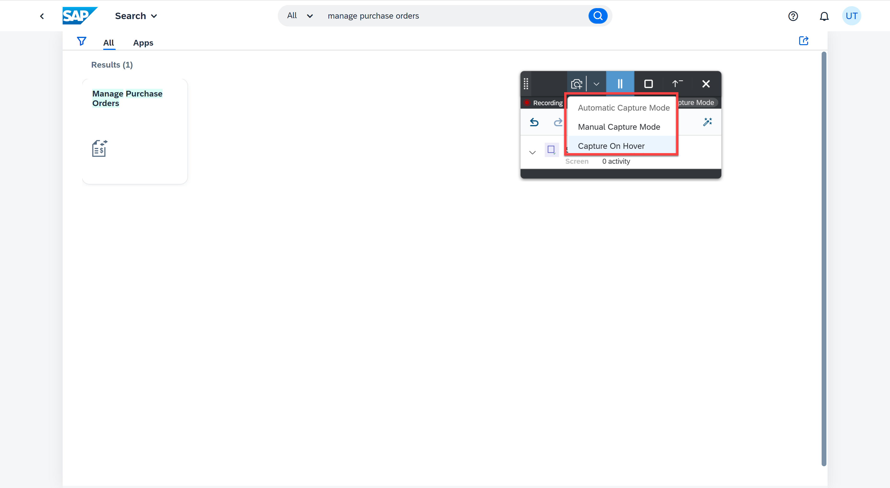

    This step involves recording the setting of the values for  **Supplier**, **Purchasing Organization** and **Purchasing Group**.

    |  Field Name     | Value
    |  :------------- | :-------------
    |  Supplier           | **`USSU-TRL04`**
    |  Purchasing Organization           | **`1710`**
    |  Purchasing Group    | **`Z10`**

    Once you choose **Record**, the Recorder will capture the screen.

2.  Now choose **Manage Purchase Orders** tile on the page.

    <!-- border -->

    You can see that the activity is added.

    Once a new screen appears, the recorder detects the screen change and initiates the screen capture immediately. First, the recorder waits for the screen to load. Once the screen loads completely, the recorder starts capturing the screen data with green border around the application and capture progress in the recorder.

    > **CAUTION:** Please wait until the page is fully recorded.

3. On the **Manage Purchase Orders** application, choose **Create**.

    <!-- border -->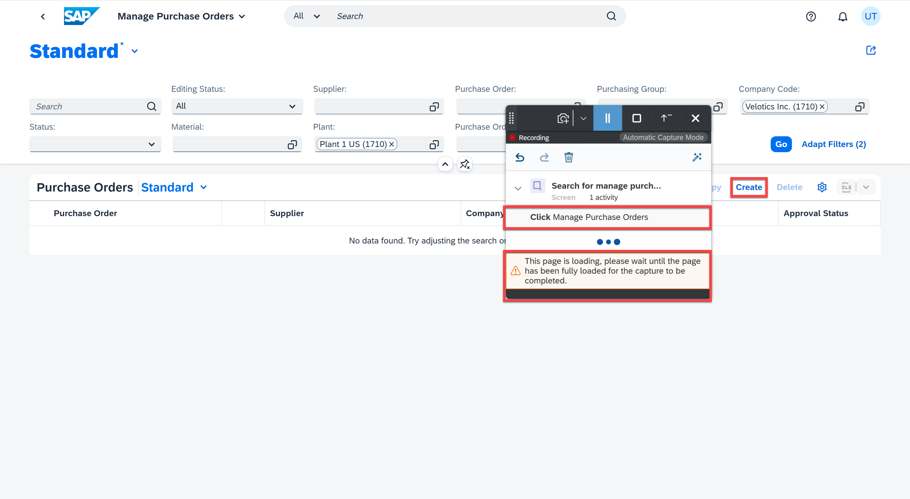

    The recorder will add the new screen with the new purchase order that needs to be created. Now you need to set the values for **Supplier**, **Purchasing Organization** and **Purchasing Group**.

5.  In the **Supplier** input field, choose the **Show Value Help** icon.

    <!-- border -->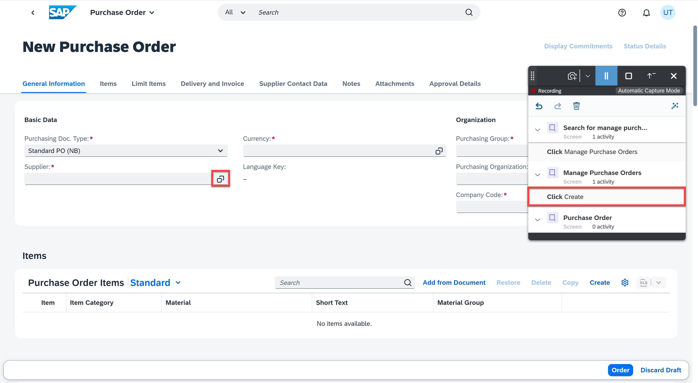

    >**CAUTION:** Please wait until the page is fully recorded.

    <!-- border -->

6.  Search for the **Supplier**: `USSU-TRL04` in the search field and choose **Go**.

    <!-- border -->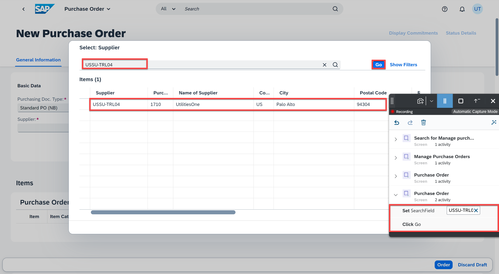

7.  Select the **Supplier**: `USSU-TRL04`.

    <!-- border -->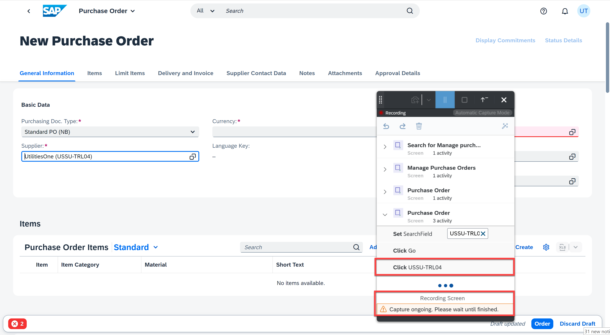

    >**CAUTION:** Please wait until the page is fully recorded.

8.  Upon selecting the **Supplier**, the **Purchasing Organization** input fills itself with the correct value automatically.

    <!-- border -->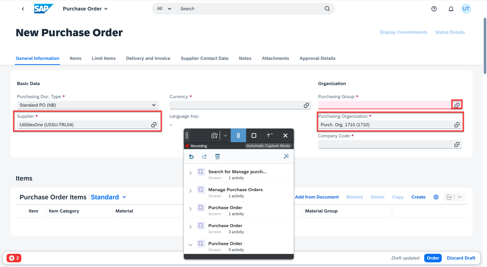

9.  Now you can repeat the above steps for **Purchasing Group**: `Z90`.

### Record your application - Material Details

This step involves recording the setting of the values for  **Material Details** in a table.

|  Field Name     | Value
|  :------------- | :-------------
|  Material          | **`MZ-FG-M525`**
|  Order Quantity          | **`200`**
|  Order Price    | **`9000`**

1.  Choose **Create**.

    > **CAUTION:** Please wait until the page is fully recorded.

    <!-- border -->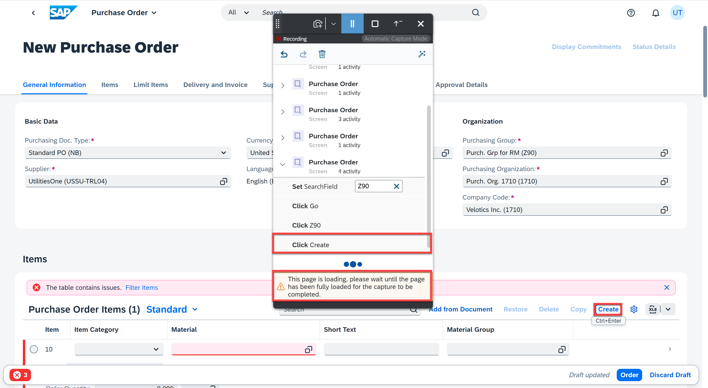

    A new empty table row is created.

3.  In the **Material** input field, choose the **Show Value Help** icon.

    >**CAUTION:** Please wait until the page is fully recorded.

    <!-- border -->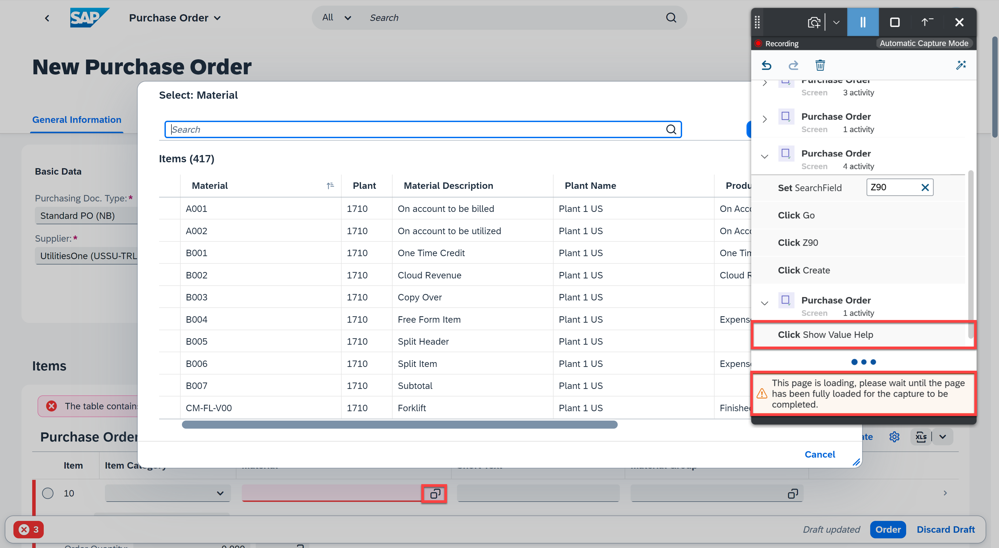

4.  Search for the **Material**: `MZ-FG-M525` in the search field and choose **Go**.

5.  Select the **Material**: `MZ-FG-M525`.

    <!-- border -->

6.  Set **Order Quantity** to `200`.

7.  Set **Net Order Price** to `9000`.

    >**CAUTION:** Please wait until the page is fully recorded.

8. Choose **Order**.

    <!-- border -->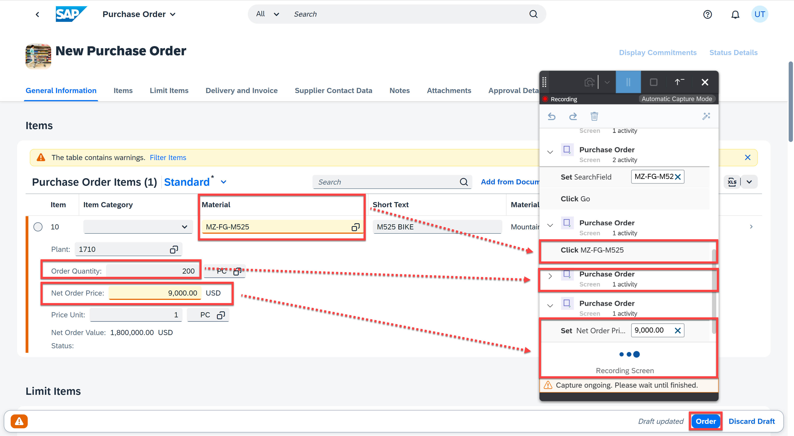

    The new purchase order is created.

    <!-- border -->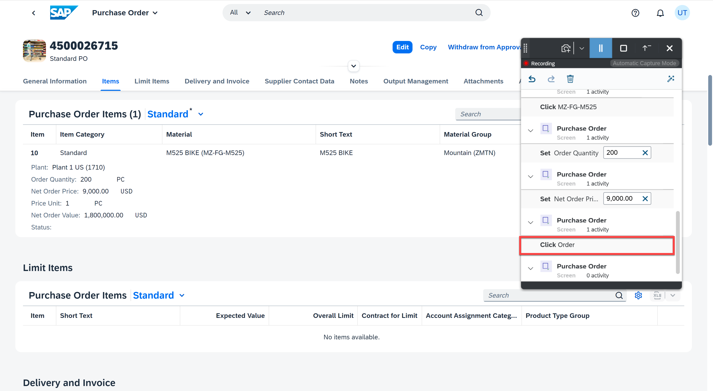

### Export the recording

Once you have completed entering the data in the application screens, you can stop recording. Choose the button to stop the recording. After you stop the recording, by default, the **Export** button is displayed.

1.  Choose the stop button to stop the recording.

2.  To export the recorded steps to **SAP Build Process Automation**, choose the **Export** button.

    <!-- border -->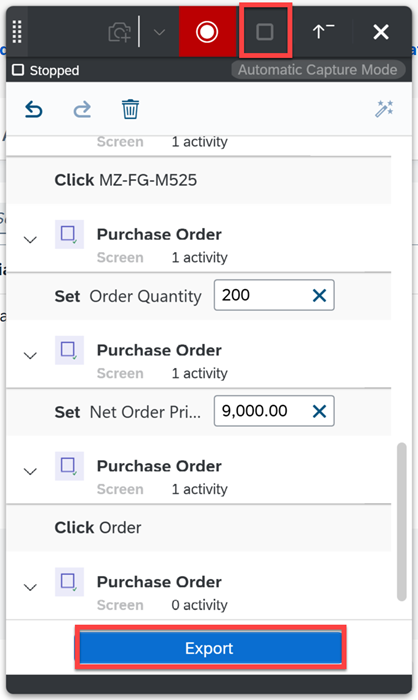

    >**CAUTION:** Before you start exporting the recording to SAP Build Process Automation, check if your session has not timed out. If it has timed out, you must re-login (do not refresh) and then export the recording.

### Review the application and the automation

After successful processing, the recorder widget will be closed. You will be redirected to SAP Build Process Automation application and the confirmation message, **Recording successfully exported** is displayed.

The application **Manage Purchase Orders** and the automation **Manage Purchase Orders** are successfully exported.

<!-- border -->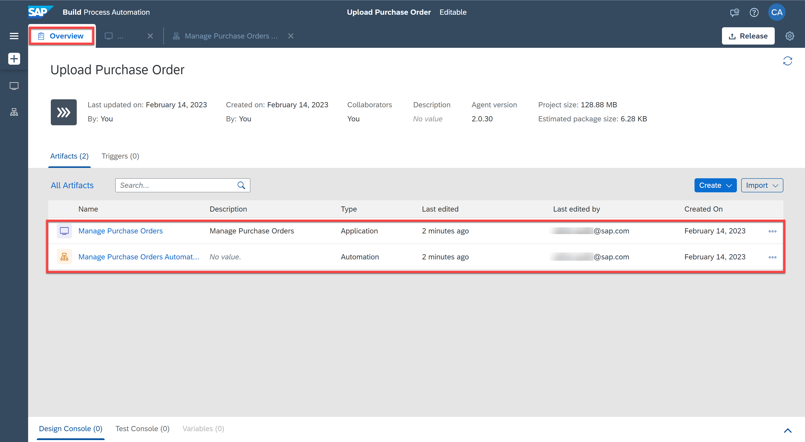

You will find the Declared Application in **Manage Purchase Orders** application. You can view the recorded screens under **Declared Application** and the recorded elements under **Declared Elements**. If required, you can manually edit the screens to add or remove objects.

<!-- border -->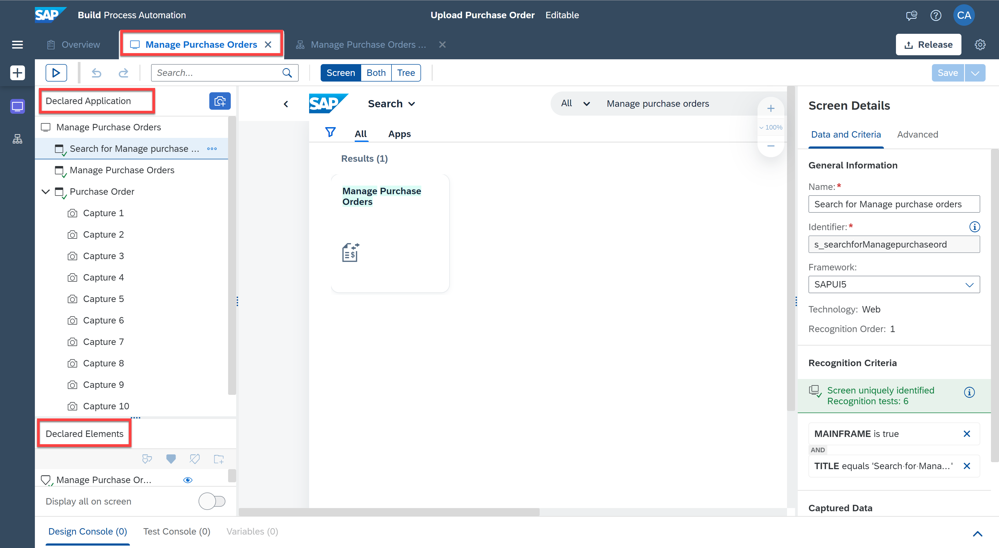

All the recorded steps will be displayed in the automation designer of **Manage Purchase Orders** automation. You can then edit the automation to update the Step Details.

<!-- border -->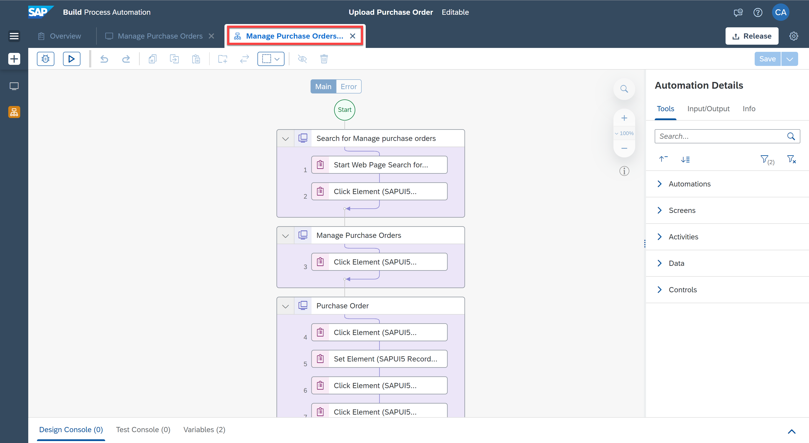

### Test your automation

To test your automation, choose **Test**.

<!-- border -->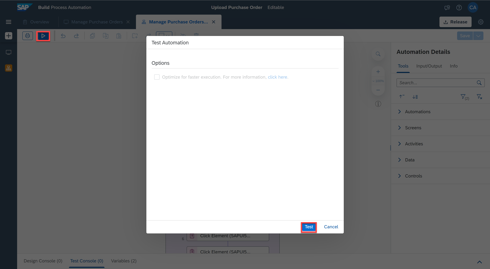

**Manage Purchase Orders** application is opened in a browser window and creates the purchase order with values provided in the steps of the automation.

<!-- border -->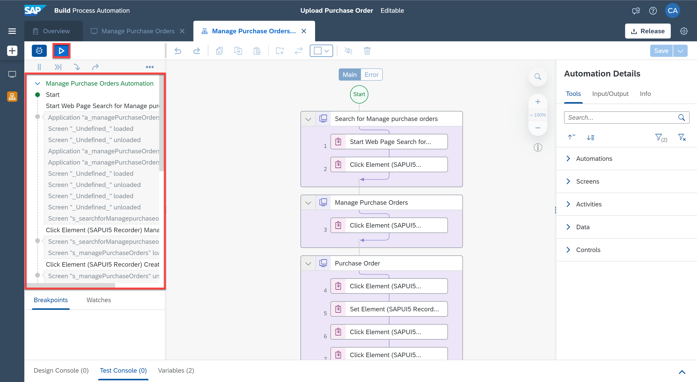

### Re-recording an application

When you record an application, you always create a new application and automation at the end of the recording. The Re-recording of application feature allows you to re-record or update an existing application and enhance the existing automation by merging newly recorded artifacts with it.

1. Navigate to the **Overview** tab of your **Upload Purchase Order** project.

2. Choose **Create** and then select **Application**. The **Create Application** popup window is displayed.

    <!-- border -->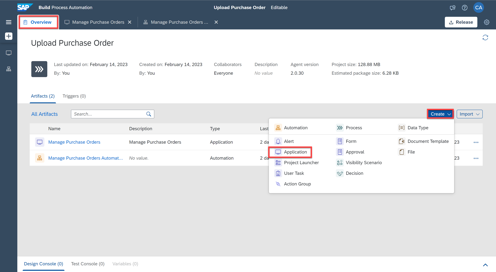

3. In the **Create Application** popup window, enter the following:

    - Enter the name in the **Application Name** field: Home
    - Optional: edit the **Application Identifier** field without using a space.
    - Enter a short description in the **Description** field: Add home screen

4. Choose **Create**.

    <!-- border -->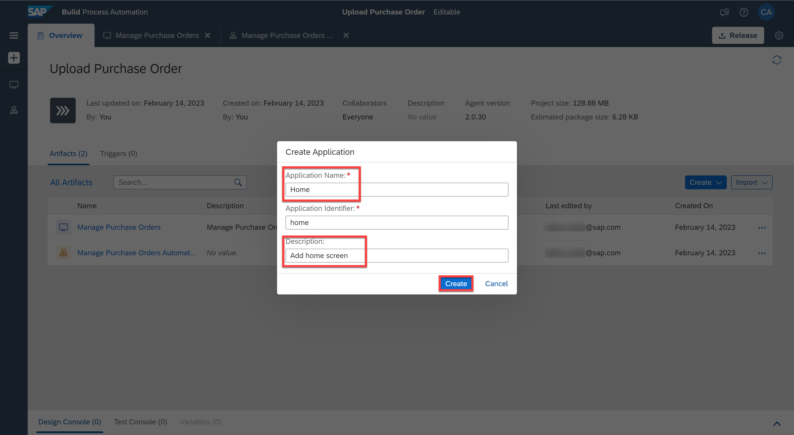

    A new tab labeled to the name of the captured application is displayed. The system starts detecting the applications and their screens currently running on your local machine. When it's done, a list of screens is displayed in the picker panel on the left.

5. Select the application you want to record from the list of screens. A preview of the screen is displayed in the capture area.

6. Choose **Next**. This redirects you to the application that you want to record.

    <!-- border -->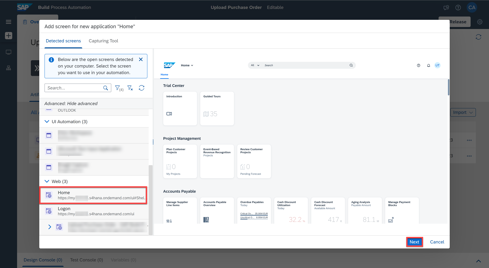

7. To start the recorder, choose **Record**.

    <!-- border -->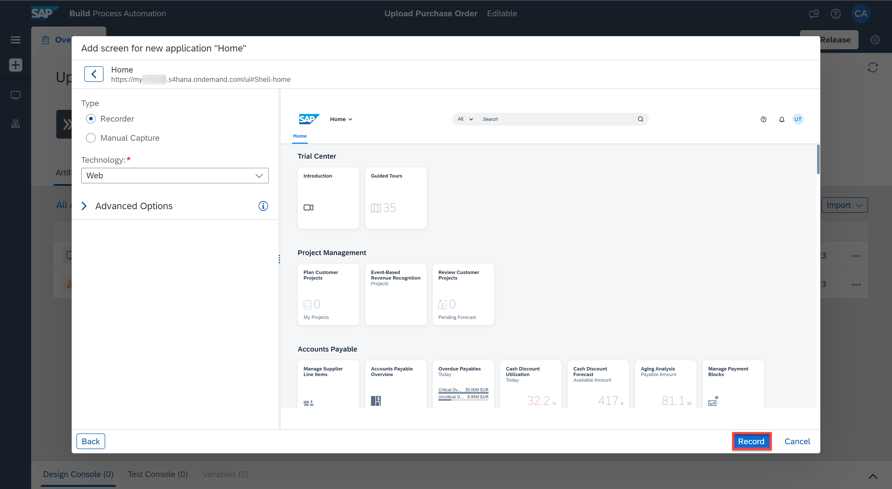

8. To initiate the recording, choose the Record button. The Cloud Studio is locked and the selected application is recorded.

    <!-- border -->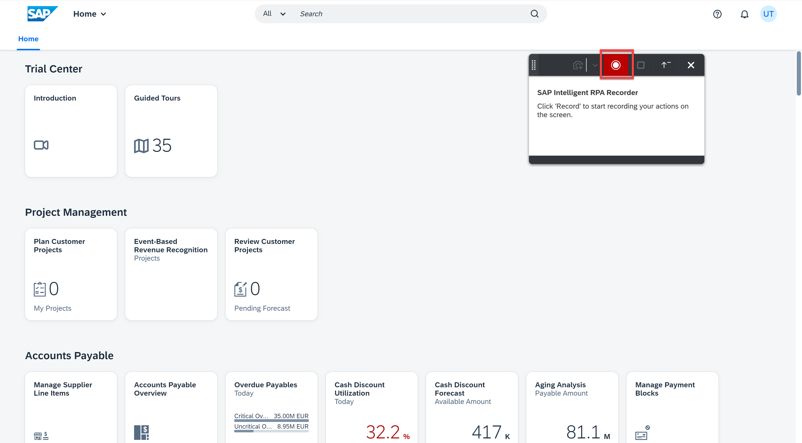

9. In the search field, type **Manage Purchase Order** and hit enter.

    <!-- border -->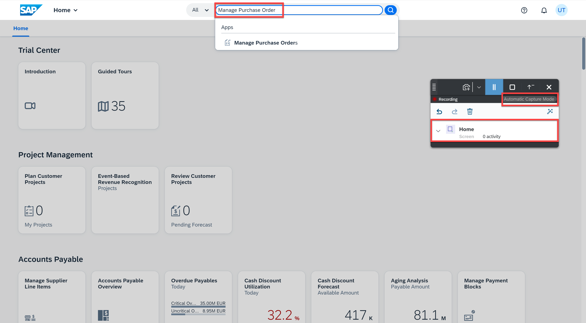

    > Note that the recorder is in Automating Capture Mode. You may change the mode to your liking.

10. You may now stop the recording, choose the stop button and then the **Export** button.

    <!-- border -->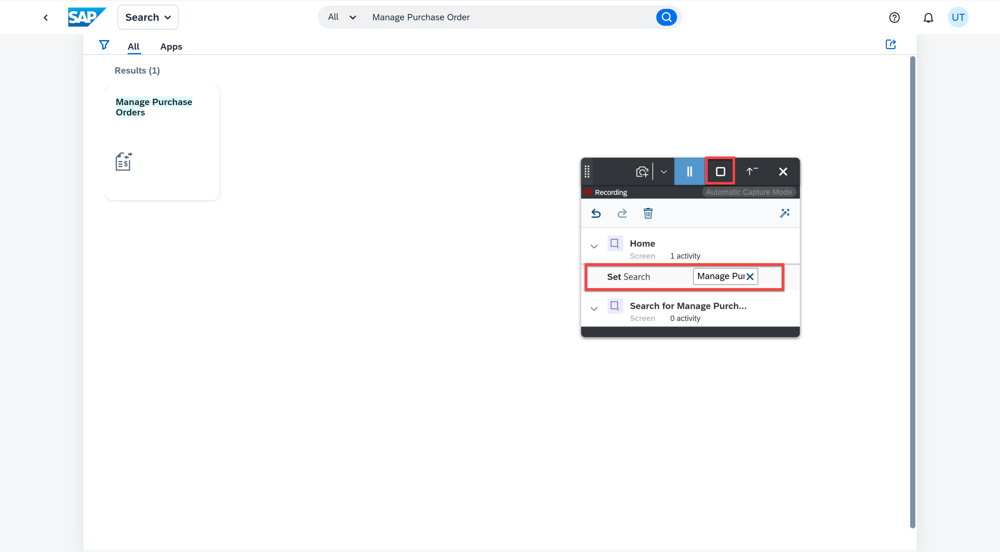

11. In the **Export Recording** popup window, select **Update an existing automation** and choose **Next**.

    > ### What is going on?
    > If you select this option, the existing automation is displayed. If you select the **Create a new automation** option and choose Next, the **Successfully created the automation** confirmation message is displayed and you are redirected to the Cloud Studio.

    <!-- border -->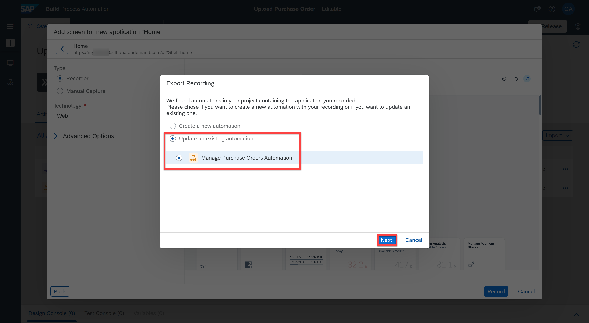

12. In the **Insert Recording** popup window, select **Start of current automation** to add the new recording at the beginning of your automation.

13. To insert the steps into your existing automation, choose **Insert**.

    <!-- border -->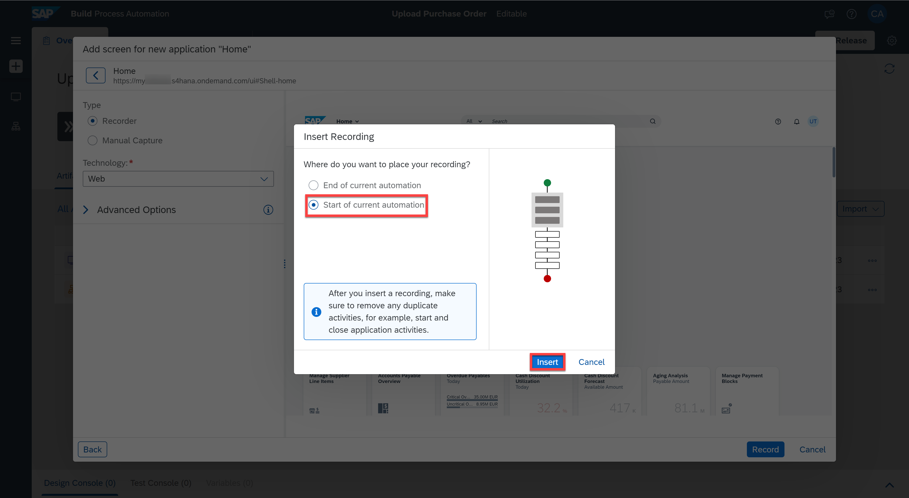

    The **Successfully saved the automation** confirmation message is displayed, and you are redirected to the Cloud Studio.

    > You can see that your new application **Home** has been added.

    <!-- border -->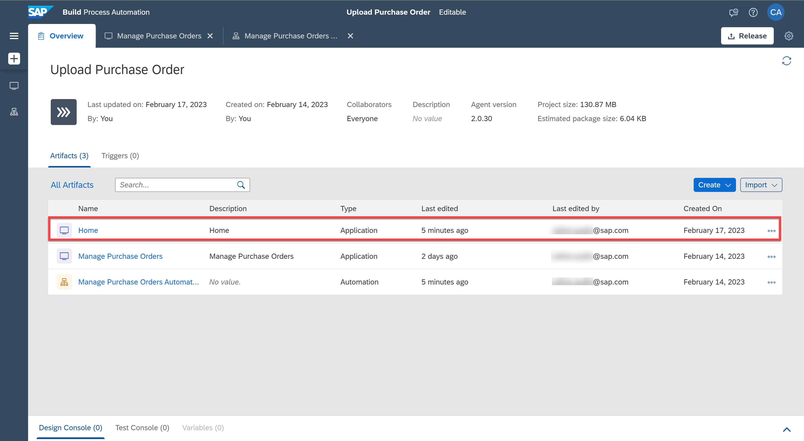

    Now you need to remove the duplicate Start and Close application activities from your automation.

14. Navigate back to your **Manage Purchase Orders** automation.

15. You can delete step 3 and 4 as they are duplicate activities.

    <!-- border -->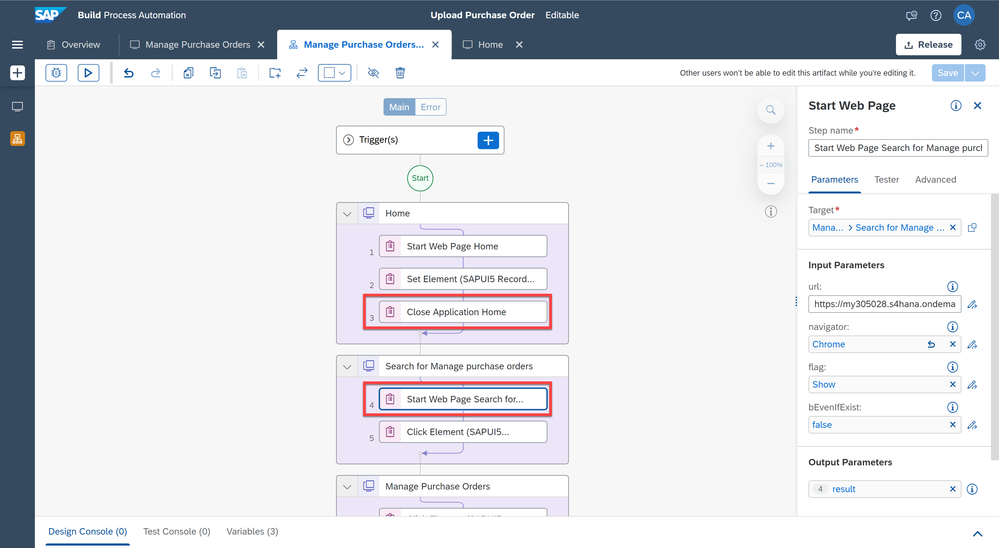

16. You may test your automation. Now **Home** application is opened in a browser window and creates the purchase order with values provided in the steps of the automation.

---
