# Automate SAP GUI for Windows Application Using the Recorder
<!-- description --> Automate sales order creation in SAP GUI for Windows

## Prerequisites
  - A [SAP BTP Free Tier Account](spa-subscribe-booster) with SAP Build Process Automation booster
  - Install and set up the [Desktop Agent 3](spa-setup-desktop-3-0-agent) to run the automation
  - [Scripting enabled for SAP GUI for Windows](https://help.sap.com/viewer/8e71b41b9ea043c8bccee01a10d6ba72/Cloud/en-US/f0fe92f292c946bca1269f826cd682b3.html) on the Client and the Server
  - Only use 32-bit SAP GUI for Windows Application
  - SAP GUI for Windows must run in the background

## You will learn
  - How to use the Recorder in SAP GUI for Windows
  - How to automate applications in SAP GUI for Windows
  - How to use automatic capture mode

---
### Prepare the recording

What is the Recorder?

You can automate complex workflows easily using the **Recorder** in **SAP Build Process Automation** application. It automatically captures applications and designs automations accurately at the same time. The **Recorder** records the steps you perform across the screens of an application. Then you can export the recording in the automation designer of the **SAP Build Process Automation** application where a workflow is built.

Make sure your screen display settings (Scale and layout) are set to 100%.

1.  Switch to your desktop, right-click and select **Display Settings**.

    <!-- border -->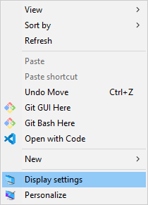

2.  Select **100%** in **Scale and layout**.

    <!-- border -->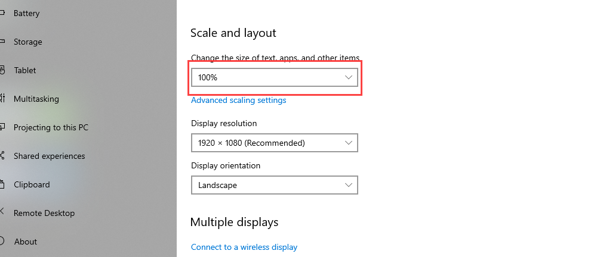

    Create a project and use **Recorder** to record a **SAP GUI for Windows** application.

### Create your project 

1. Navigate to **SAP Build** application and create a project by choosing **Create**.

    <!-- border -->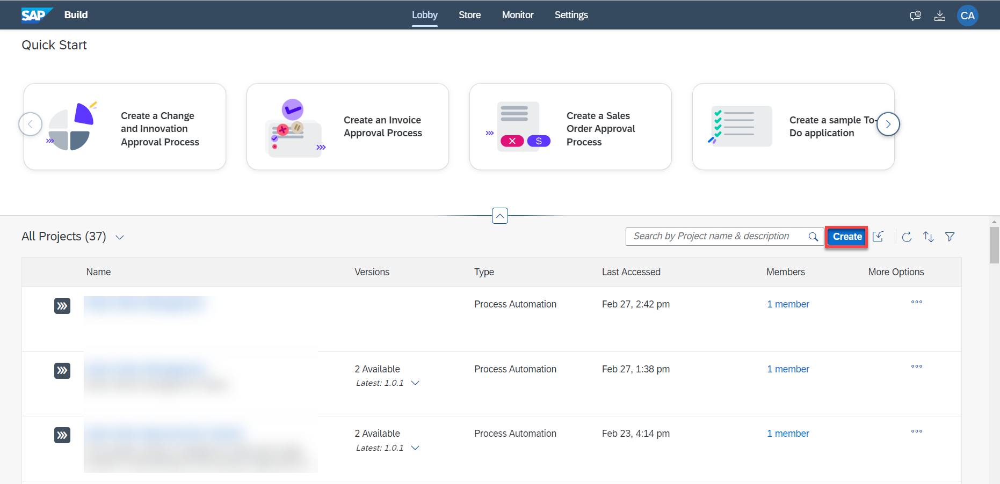

2. Select **Build an Automated Process**.

    <!-- border -->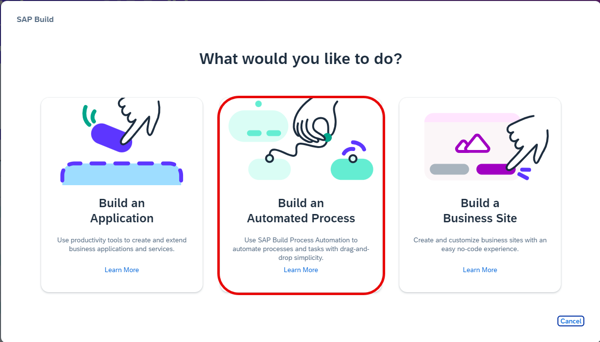

3. Select **Task Automation**.

    <!-- border -->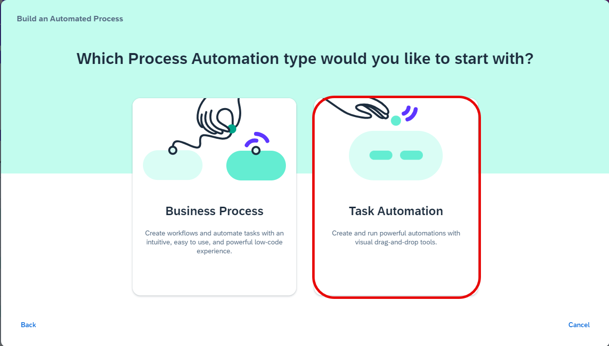

4. In the **Create Task Automation** window, please give the project the name: **Create Sales Order** and the description: **Automate sales order creation in SAP GUI for Windows** and choose **Create**.

    <!-- border -->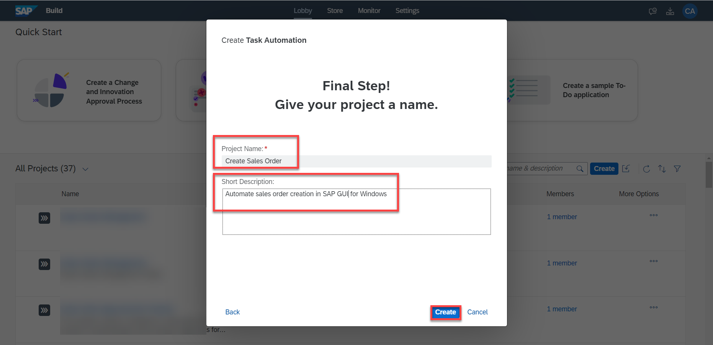

    You will be directed to the newly created project.

5. Please select the version of the agent installed on machines that will execute the automation and choose **Confirm**.

    <!-- border -->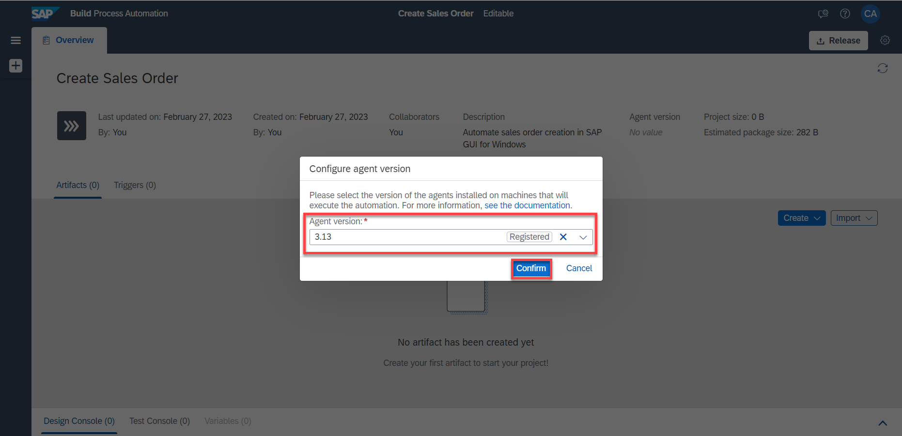

6. A pop-up window asking you to create an automation will appear, please choose **Cancel**.

    > ### What is going on?
    > As you will be using the **Recorder** feature, you do not need to create an automation but an application.
    
    The next step would be to create your application within your project.

### Create your application

Before recording the steps of a workflow, please open the SAP GUI for Windows application without minimizing the screen.

1. In the **Overview** tab of your **Create Sales Order** project, choose **Create**, then choose **Application**.

    <!-- border -->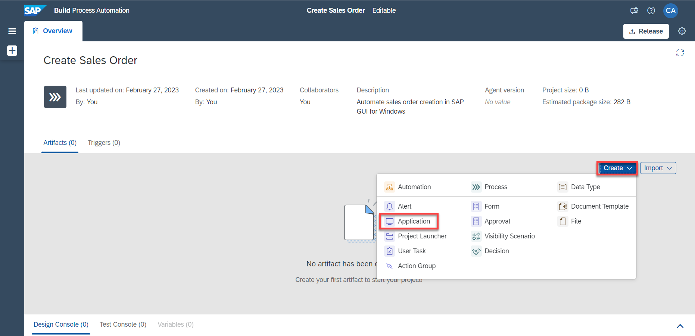

2. In the **Create Application** window, name your application: **Create Sales Order** and choose **Create**.

    <!-- border -->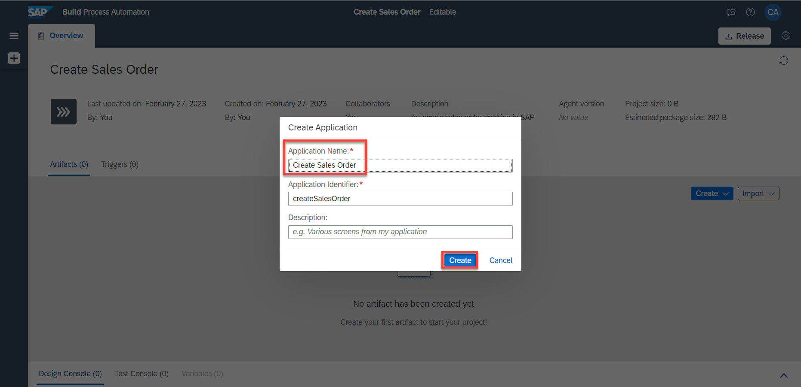

3. Select the **SAP GUI** screen to record and choose **Next**.

    > ### What is going on?
    > **SAP Build Process Automation** starts detecting the applications and their screens currently running on your local machine. When it's done, you'll see a list of screens in the picker panel on the left.

    <!-- border -->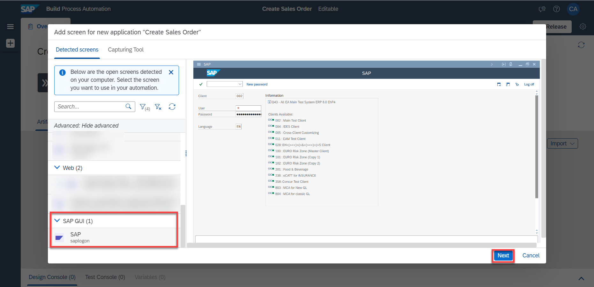

    > You have the option to select either **Recorder** type or **Manual Capture** type. This tutorial will show you how to use the **Recorder**.

4. Select **Recorder** as type and choose **Record**.

    <!-- border -->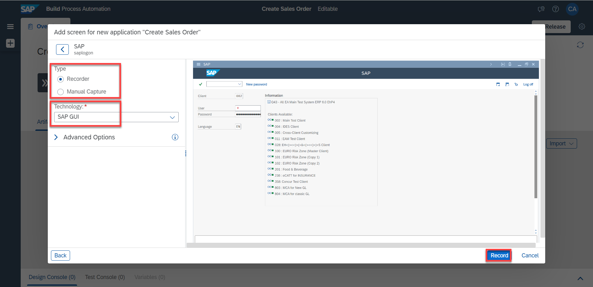

    > Please note that the technology that you will be recording is **SAP GUI**.

### Record your application

After the dependencies have been successfully added, **SAP Build Process Automation** application is locked and you will be directed to the SAP GUI for Windows application you want to record. 

The **Recorder** widget will appear. In this tutorial, you will learn how to use a new feature in the **Recorder**: **Automatic Capture Mode**.  

In earlier versions of the **Recorder**, when the screen changed in the application, the **Recorder** showed a capture hint. This reminded the user to capture the screen where you had to click on the camera icon to capture the screen. Now, the **Recorder** is enhanced such that, as soon as any screen changes are detected, it automatically initiates the capture and captures the screen.

1. **Capture SAP login page**

    - Choose **Record**  to initiate the recording. 

    You can see the **Automatic Capture Mode** is on.

    <!-- border -->

    You can select the drop down menu to view the different available capture modes such as:

    - Automatic Capture Mode
    - Manual Capture Mode
    - Capture on Hover

    <!-- border -->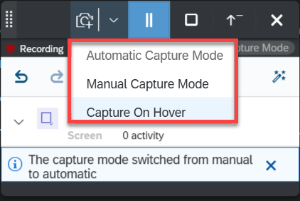

    This step involves recording the setting of the login values.

    - Select **Client** and enter your credentials.

    - Choose **Enter** 

    <!-- border -->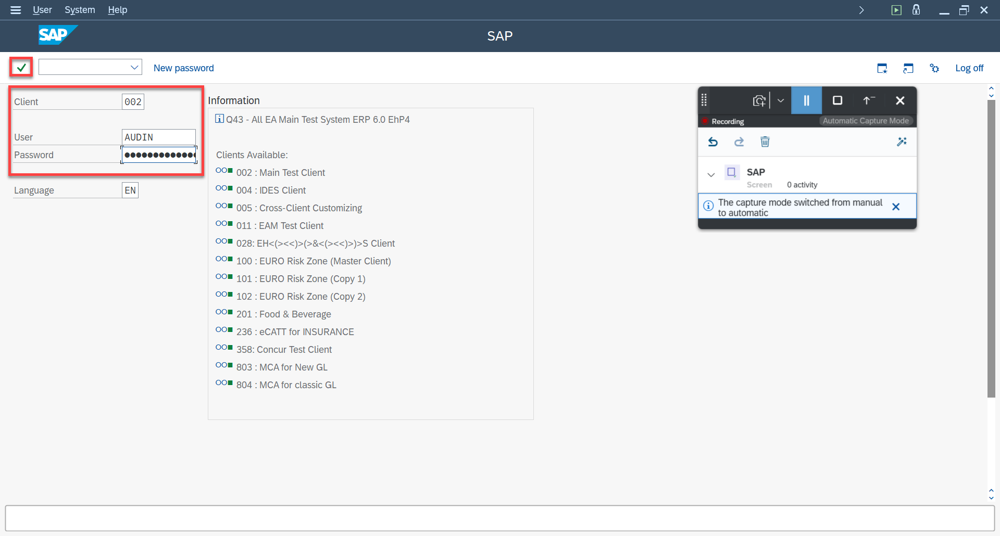

2. **Capture: SAP Easy Access**

    Once a new screen appears, the **Recorder** detects the screen change and initiates the screen capture immediately. First, the **Recorder** waits for the screen to load. Once the screen loads completely, the **Recorder** starts capturing the screen data with green border around the application and capture progress in the **Recorder**. 

    > **CAUTION:** Please wait until the new screen is fully captured and the **Recorder** loads the new screen's elements. Once the new screen is captured, it will appear in the **Recorder**.

    - Enter the Sales Order transaction ID: **VA01**.

    - Choose **Enter** 

    <!-- border -->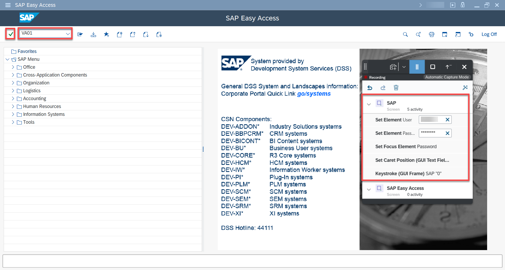
  
    > You can notice that the **Recorder** generates the corresponding activities from the previous screen.

3. **Capture: Create Sales Order: Initial Screen**

    - Fill the following values for order type:

    |  Field Name           | Value
    |  :------------------- | :-------------
    |  Order Type           | AVC
    |  Sales Organization   | 0001
    |  Distribution Channel | 01
    |  Division             | 01

    - Choose **Enter** 

    <!-- border -->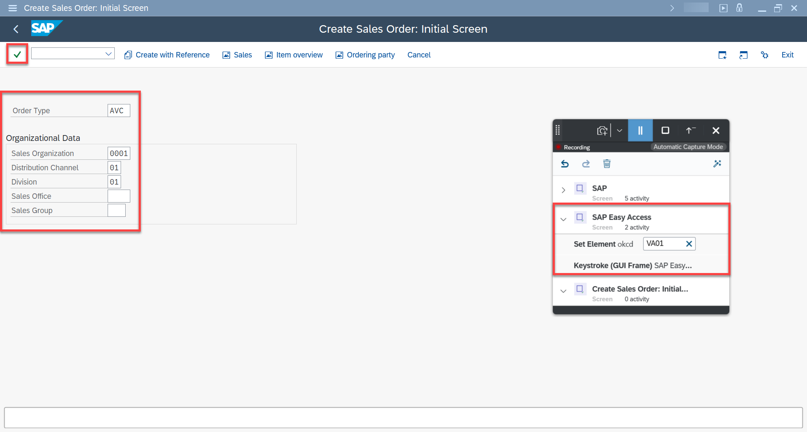

    > You can notice that the **Recorder** generates the corresponding activities from the previous screen.

3. **Capture: Create Standard Order: Overview**

    - Now you will set the order detail values:

    |  Field Name           | Value
    |  :------------------- | :-------------
    |  Sold To Party        | ITAG01
    |  PO Number            | 42
    |  Material             | HW-1761
    |  Order Quantity       | 10
    |  Customer Group       | Industry
    |  Price Group          | Bulk Buyer
    |  Price List           | Retail
    |  Storage Location     | 0001

    <!-- border -->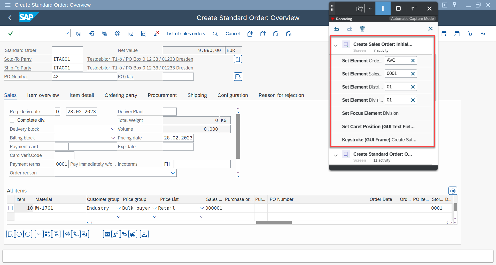

    > You can notice that the **Recorder** generates the corresponding activities from the previous screen.
    
    - Choose **Enter** 

    <!-- border -->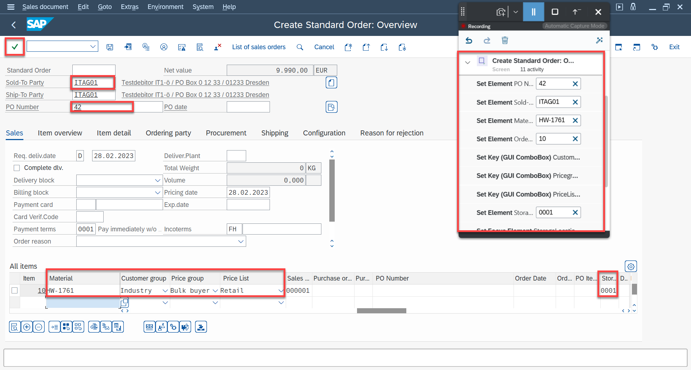

    - Choose **Save** to complete the process of recording the sales order application.

    <!-- border -->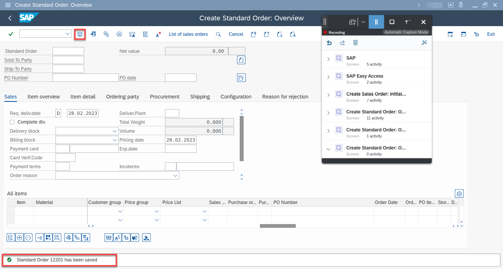

    - Choose **Stop** to stop the recording.

    <!-- border -->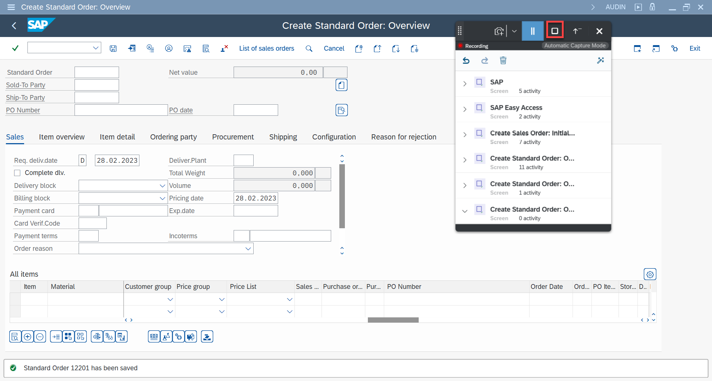

### Export your recording

Select **Export** to export the recording to your project.

<!-- border -->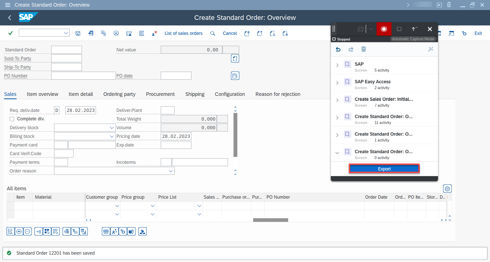

As a result of your recording:

- A **screen** is captured in **SAP Build Process Automation**.
- An **automation** is generated in the **SAP Build Process Automation**.

Your Project now consists of an application named *Create Sales Order* and an automation named *Create Sales Order Automation*.

<!-- border -->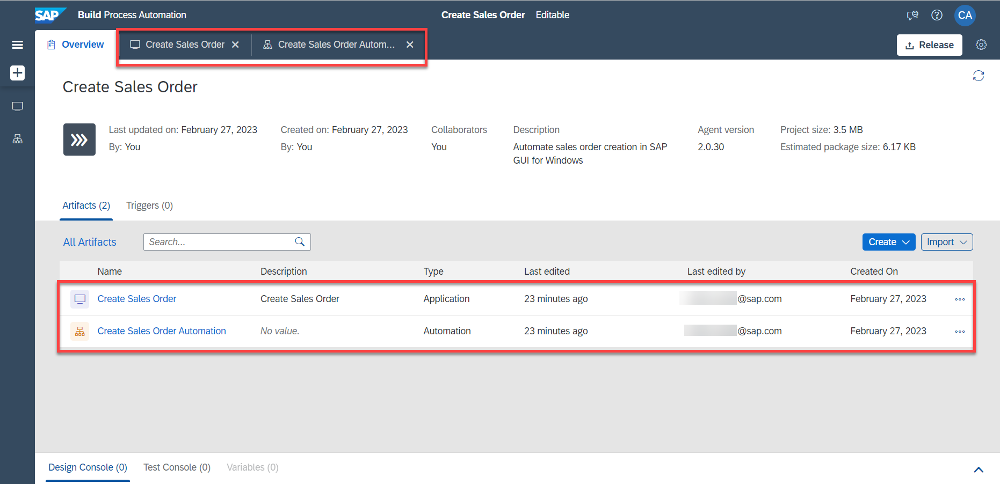

In the automation you will have the choice to customize your automation as per your requirements.

The password is recorded as **asterisks**. You need to change its value to the real password.

1. Find and select the activity **Set Element Password** that sets the password value.

2. Change the value to the real password and select the text in quotes.

3. Save your automation.

<!-- border -->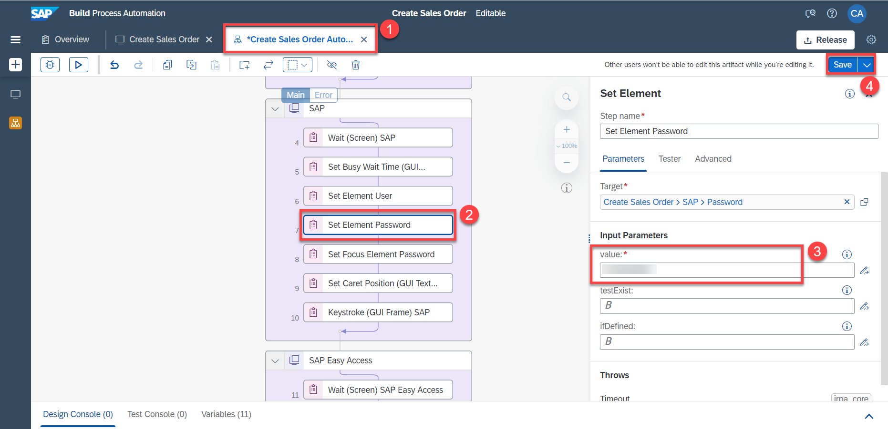

>**CAUTION:** Please note that the best practice would be to create an environment variable of type password and map it to the value field. How to do this will be covered in the next [tutorial](spa-customize-win-gui-recorder-automation).

The automation is ready to be tested.

### Test your automation

Before testing, please log off from your SAP GUI application. To test your automation, choose **Test**.

<!-- border -->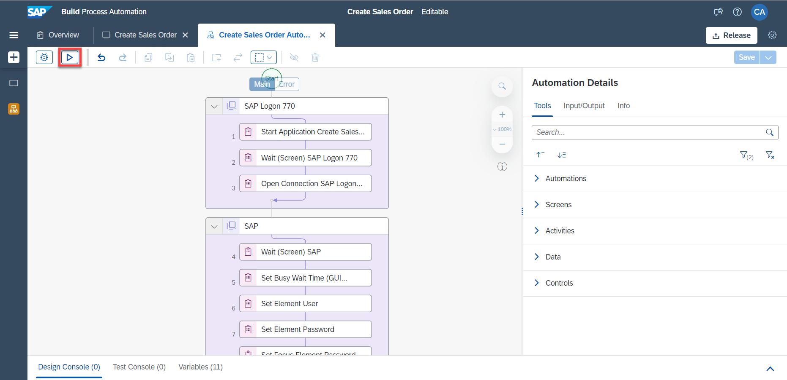

**SAP Build Process Automation** starts the automation by calling the **Desktop Agent** using the **SAP Build Process Automation Extension**.

The process operates as follows:

1.  SAP ERP system is opened, enters the credentials and navigates to sales order transaction to create a sales order.

2.  The **Desktop Agent** fills all the details in the screen.

3.  Information is validated to move to the next detected screen.

4.  These steps are repeated for all the screens that were captured.

5.  The sales order is created successfully.

---
