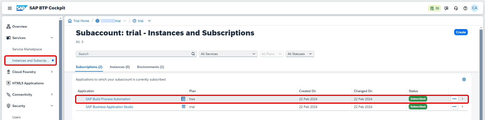
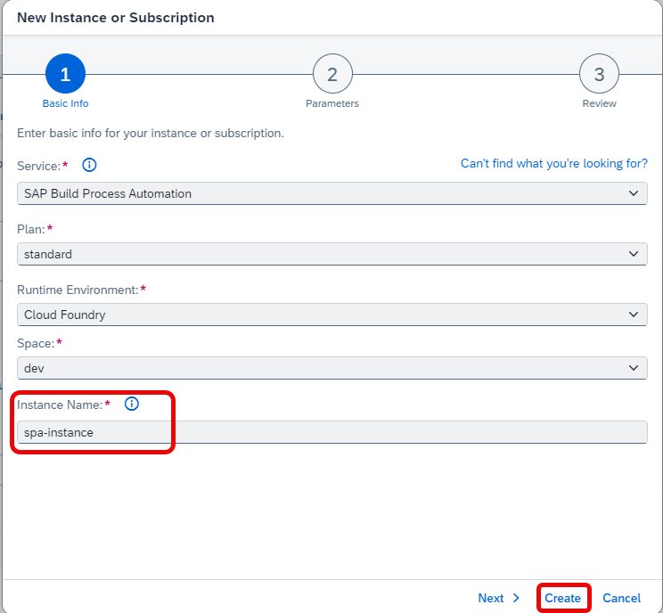
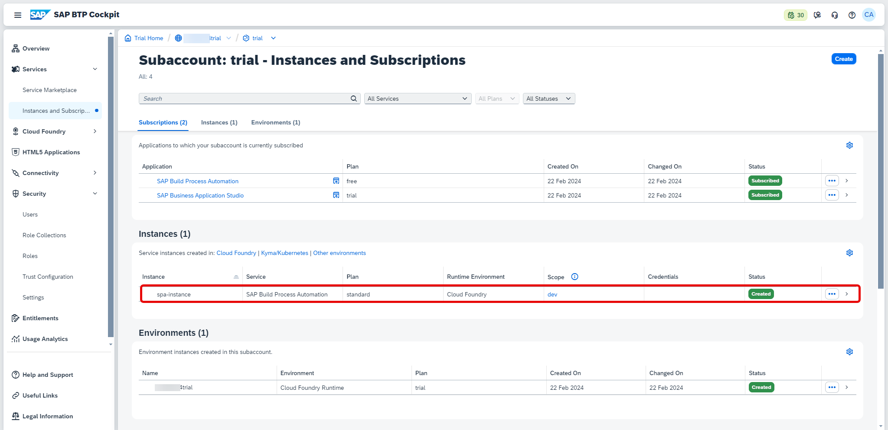
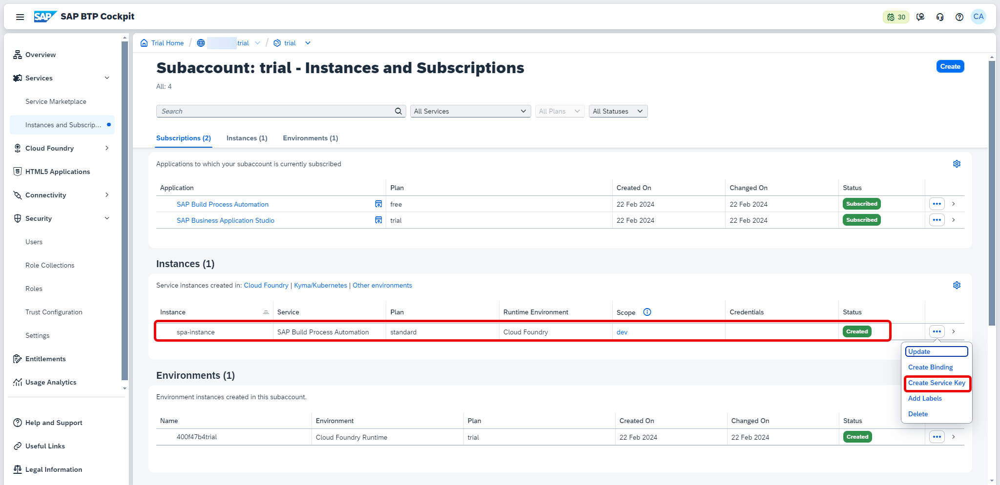
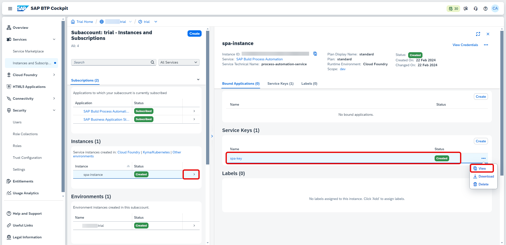
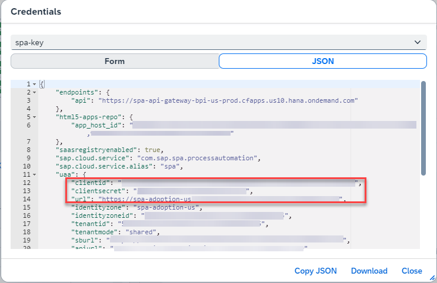
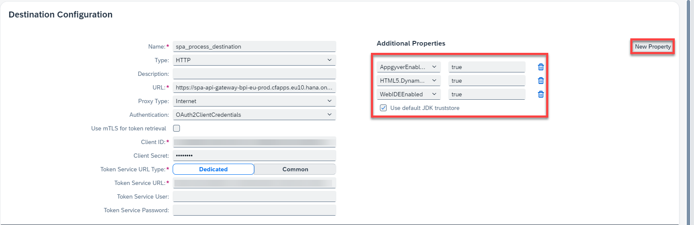

# Create Destination To Trigger Process From Any Service
<!-- description --> Learn how to create a destination to trigger process by creating an instance and service key of SAP Build Process Automation.

## Prerequisites
- Account on [SAP BTP](btp-free-tier-account) to try out Free Tier service plans
- Subscribe to [SAP Build Process Automation](spa-subscribe-booster) using booster in SAP BTP Free Tier
- Proper roles to create service instance, service key and destinations in SAP BTP Cockpit

## You will learn
- How to create destination in SAP BTP Cockpit to start the business process from SAP Build Apps
- How to create an instance and service key for SAP Build Process Automation

## Intro
In this tutorial, you will create a service instance and service key for SAP Build Process Automation. You would consume the credentials of the service key of Build Process Automation to create a destination that would trigger business process from SAP Build Apps.

---

### Create an instance for SAP Build Process Automation

Once you have successfully subscribed to SAP Build Process Automation in SAP BTP Cockpit, you can find the Subscription in  your subaccount view, under **Instances and Subscriptions**.

<!-- border --> 

1. Let's create an **Instance** for SAP Build Process Automation. Choose **Create**.

2. Select the Service as **SAP Build Process Automation** and plan as **standard instance**. Choose **Next**.

    <!-- border --> 

3. Enter the values for other fields as shown below and give an instance name as **spa-adoption-us**. Choose **Create**.

    | Field|Value
    | --- | :---
    | Service | SAP Build Process Automation
    | Plan | standard - Instance
    | Runtime Environment | Cloud Foundry
    | Space | dev
    | Instance Name | any name   (spa-adoption-us)

    <!-- border -->   

4. Once the instance is created successfully, you can find it in **Instances** section.

    <!-- border -->   

### Create a service key for the instance of SAP Build Process Automation  

1. Once you have successfully created the instance, select **...** > **Create Service Key**.

    <!-- border -->   

2. Enter the name for Service Key as **spa-key** and choose **Create**.

    <!-- border -->   

3. The service key is created and you can view the credentials.

    <!-- border -->   

4. After the key is provisioned, open it and take note of the following fields:

    - `clientid`
    - `clientsecret`
    - `url`

    These values are needed later in the **Destination Configuration** section.

    <!-- border -->   

### Create a destination to trigger process

1. Navigate to **Destinations** > **Create Destination**. Enter the destination name as `spa_process_destination`.

    <!-- border --> 

2. Enter the details as below.

    | Field|Value
    | --- | :---
    | Name | any name (`spa_process_destination`)
    | Type | HTTP
    | Description | any description
    | URL | `https://spa-api-gateway-bpi-eu-prod.cfapps.eu10.hana.ondemand.com/public/workflow/rest/v1/workflow-instances`
    | Proxy Type | Internet
    | Authentication |  OAuth2ClientCredentials
    | Use `mTLS` for token retrieval |  Off
    | Client ID | Paste the clientid noted previously in step2
    | Client Secret | Paste the client secret noted previously in step2
    | Token Service URL Type | Dedicated
    | Token Service URL|  `url/oauth/token`, where `url` is noted previously in step2
    | Token Service User| Blank
    | Token Service Password| Blank

    > Additionally, enable the following Properties when you would like to integrate with SAP Build Apps.

    - `AppgyverEnabled`
    - `HTML5.DynamicDestination`
    - `WebIDEEnabled`  

    <!-- border -->     

    You have successfully created a destination and you can trigger your business process from any service like SAP Build Apps.
