# Use Custom Variables for the global process
<!-- description --> Add, modify and use custom variables in the process. 

## Prerequisites
  - A [SAP BTP Free Tier Account](spa-subscribe-booster) with SAP Build Process Automation booster **OR**
  - A [SAP BTP Trial account](spa-subscribe-free-trial) 
 

## You will learn
  - How to create and use Custom Variables with Data types

## Intro

By using custom variables, you can make any information available at the global level at any stage in the process. The outputs of any step that you add to your process can be consumed as inputs for the subsequent steps in a process. In addition, you can create custom variables on a project level that are not bound to a particular step.

---

### Process description 

For your company, you need to design the process to submit innovation ideas by the employees. The process should by triggered by the employee who fill out the form. Then CFO would like it to be divided to `CAPEX` and `OPEX` categories, so two different councils can process the ideas and decide whether to provide an approval. If the innovation idea requires additional information, the council will send it back to the requester. In case the process will be approved by the council, the CFO will received the case for the final approval. The requester must receive an email with the council or CFO decision. 

### Create the project

1. In the SAP Build **Lobby** select **Create** button.

    <!-- border -->

2. Select **Build an Automated Process**.

    <!-- border -->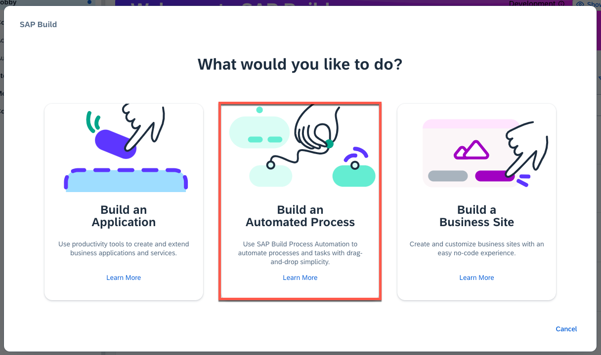

3. Select **Business Process**.

    <!-- border -->

4. Name the Project **Innovation Idea Process**, and confirm with **Create** button.

    <!-- border -->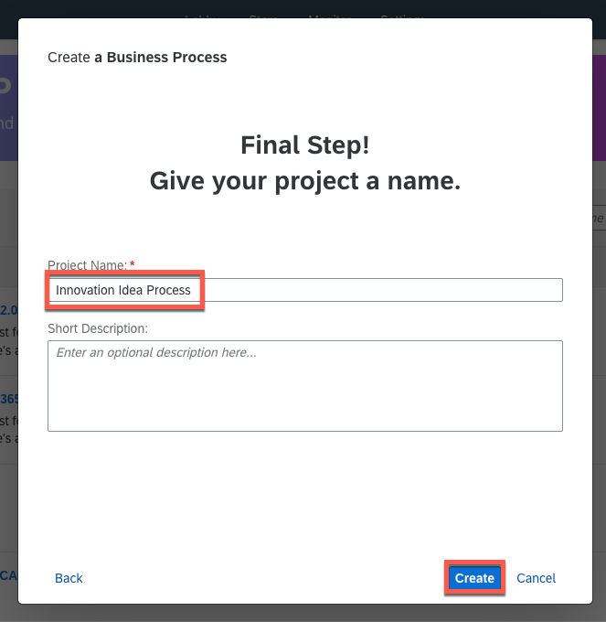

5. Create the process by providing the Name **Innovation Idea Global Process**.

    <!-- border -->

### Create Custom Variables

In this step we will create data types that will be used for custom variables.

1. Select **Create** button and then **Data Type**.

    <!-- border -->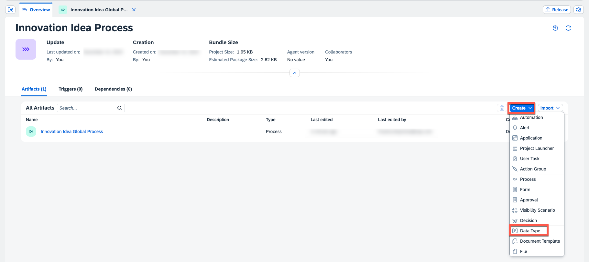

2. Name data types: `customvariables`.

    <!-- border -->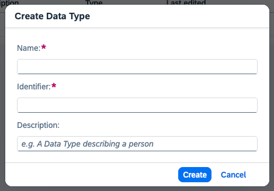

3. Add **New Fields** and **save**.
   
    | **Name**    | **Type** | 
    | -------- | ------- |
    | `Rework` | Boolean |
    | `globalCost` | number |
    | `globalDescription` | string |
    | `globalIdeaName` | string |
    | `globalCouncilComments` | string |
    | `category` | string |

    <!-- border -->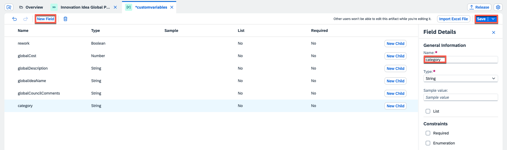

    > In case you have more data types to create, you can use the Excel file import option. The link to the document is [here.](x)

4. Close the tab.

### Set custom variables at the process level

1. Select **Process Details**.

    <!-- border -->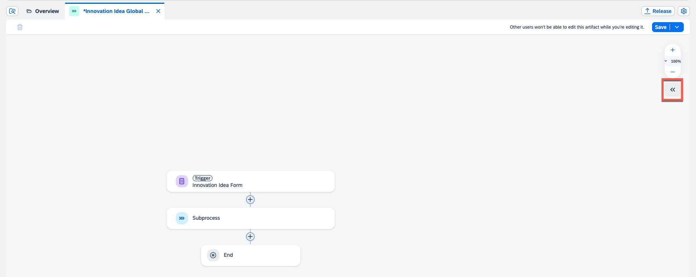

2. Choose **Variables > Custom Variables > Configure**.

    <!-- border -->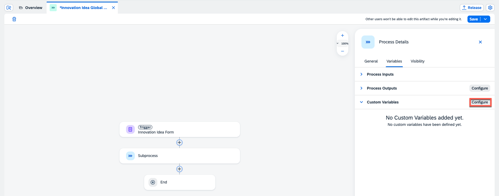   

3. Configure the following Variables. To fo that select **Add Variables** button. Name it **Innovation**, as type choose data type `customvariables` created in the previous step. You will find it under Current Project.

    <!-- border -->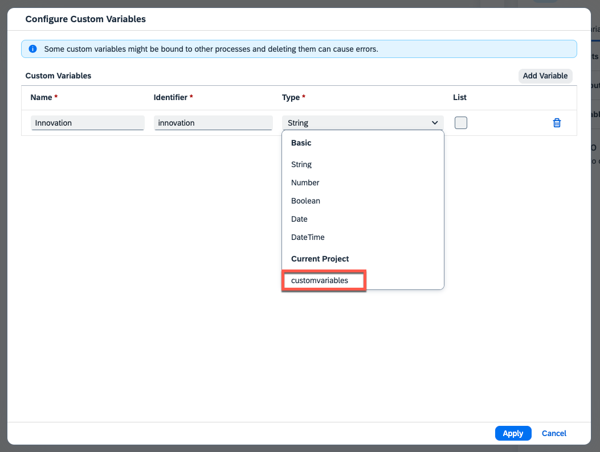   

4. Select **Apply** and **save** the process.

### Add Subprocess

> Due to product limitations, we need to add a subprocess. Please note that this step will not be necessary, once the custom variables will be available as Output in Trigger form. 

1. Select **+** > **Subprocess** > **Blank Subprocess**.
   
    <!-- border -->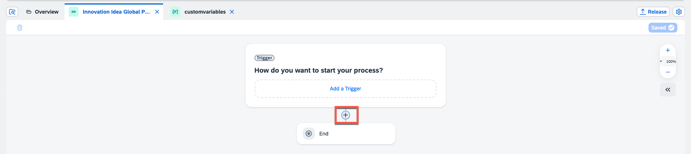 
    <!-- border -->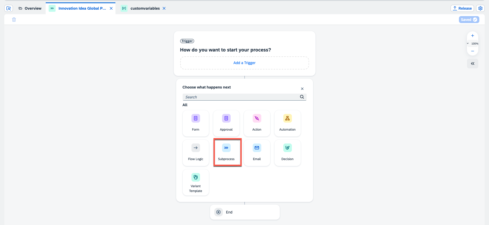 
    <!-- border -->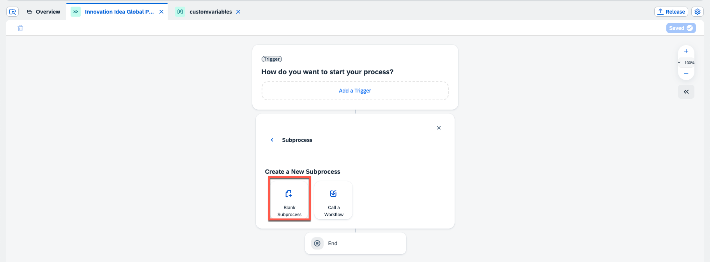 

2. Name it **Subprocess** and choose **Create**.

    <!-- border -->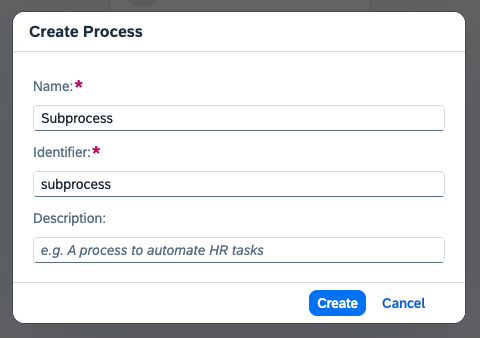 

3. **Open Editor** of the Subprocess to configure Inputs and Outputs.
   
    <!-- border -->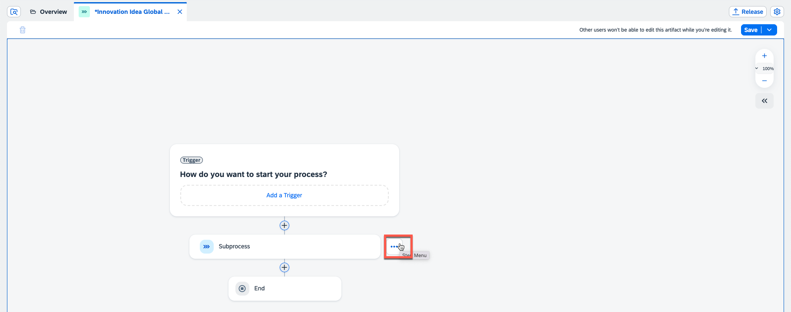 

4. Select **Process Details > Variables > Process Inputs > Configure**.

    <!-- border -->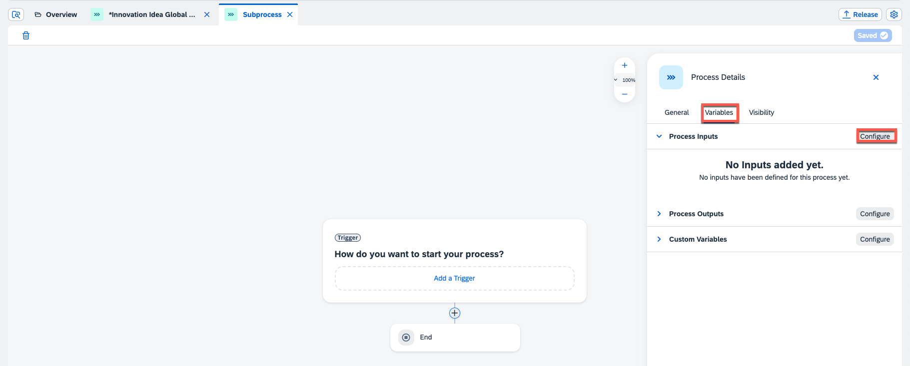 

5. Select `Customvariables` and name it `subInputs` and select **Apply**.

    <!-- border -->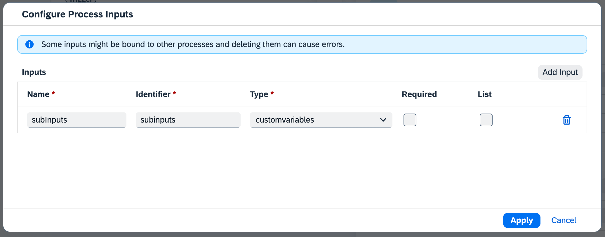 

6. Select **Configure** next to Process Outputs and configure custom variables same way as in the previous step.

    <!-- border -->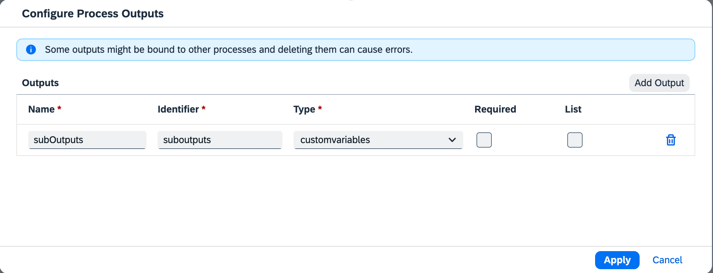 

7. **Save** changes and close the subprocess tab.

### Create the trigger form

1. Create the trigger form for the requester. To do that select **Add trigger > Submit a Form > Blank Form**. 

    <!-- border -->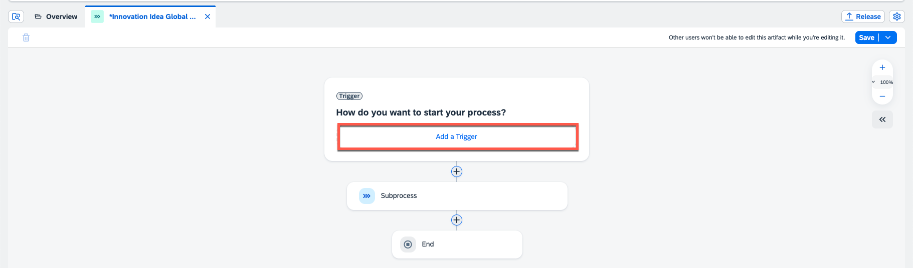
    <!-- border -->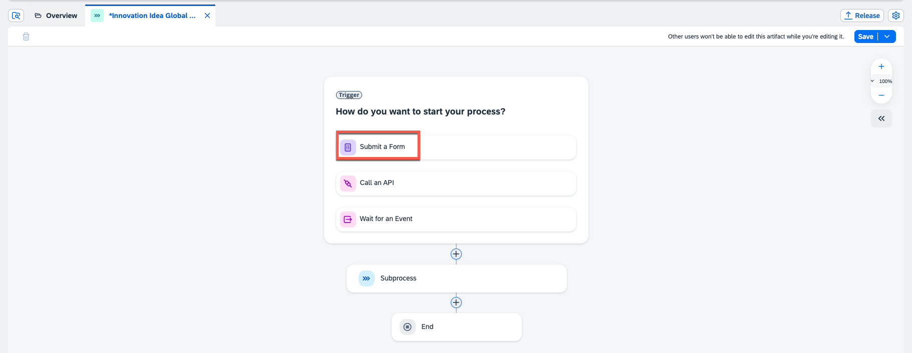
    <!-- border -->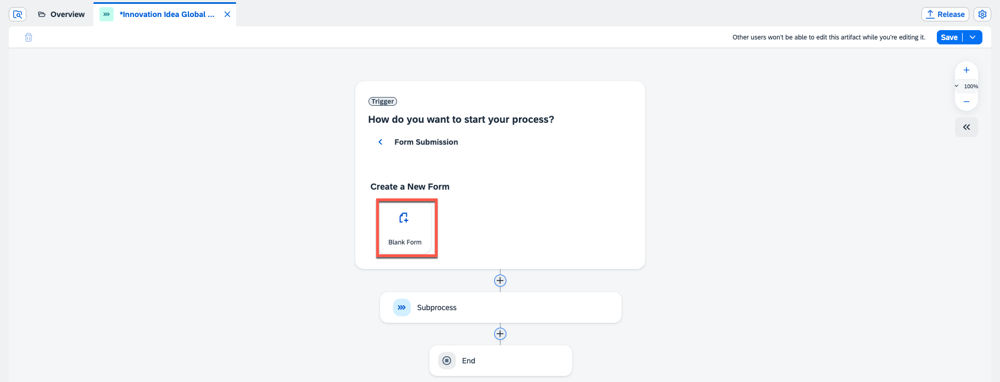

2. Name it **Innovation Idea Form**. Select **Create**.

    <!-- border -->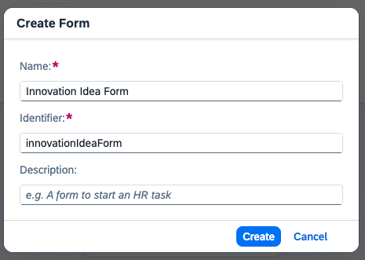

3. Choose **Open Editor** of the form. 

    <!-- border -->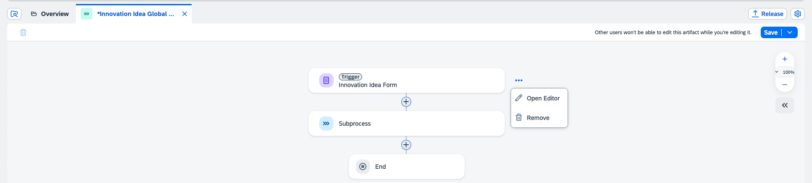

4. Add Form Input Fields by clicking on the Fields or using drag and drop option.

    | **Form Field**    | **Value** | **Option** |
    | -------- | ------- | ------- |
    | Headline 2  | Innovation Ideas Form    |  |
    | Paragraph | Please fill out the form with your innovation ideas. Once the form will be processed, you will be informed about the Council or CFO decision via email.     | |
    | Text    | Name of the idea     |Required |
    | Text Area | Idea Description | Required |
    | Number | Estimated Cost of the Innovation | Required |
    | Dropdown  | Select the category | Required |

    <!-- border -->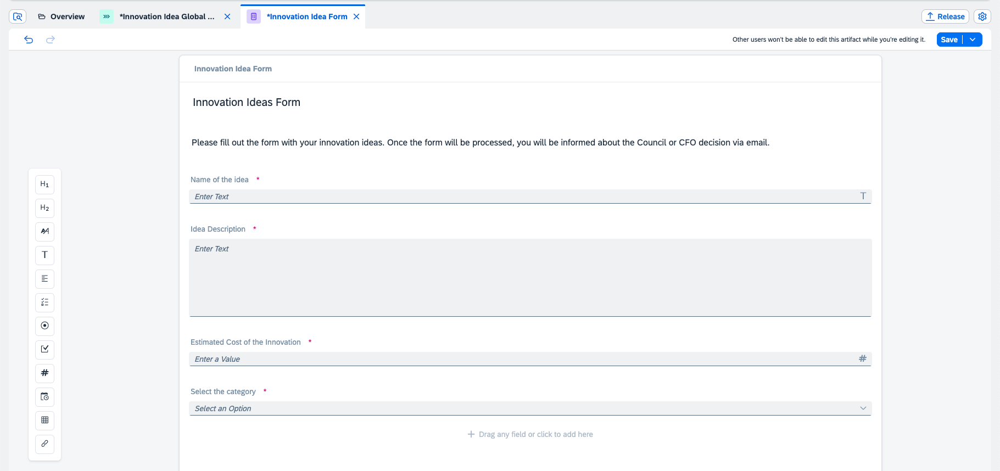

5. For the Drop-down Fields provide two Values: `OPEX` and `CAPEX`. 
   
    <!-- border -->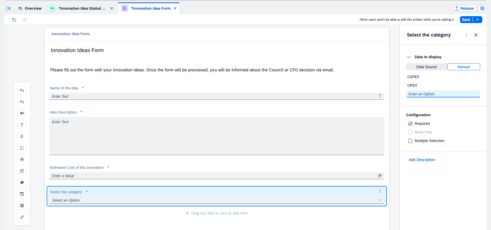

    > Note: In case you would like to add an attachment to the form, please use [Configure SMTP Destination](https://help.sap.com/docs/build-process-automation/sap-build-process-automation/configuring-smtp-mail-destination).

6. **Save** the form and close the tab.

### Map  Subprocess Inputs and Outputs

1. In the Process Overview tab select subprocess and go to the Inputs section. select **single Properties**. Map the following from Trigger Form Outputs:

    | **Subprocess**    | **Form** |
    | -------- | ------- |
    | `category`  | Select the category  |
    | `globalCost`  | Estimated Cost of the Innovation  |
    | `globalDescription`  | Idea Description |
    | `globalIdeaName`  |  Name of the idea  |

    <!-- border -->

2. **Save** the process.

### Create Approval Forms and Conditions

1. Create an approval form. Select **+** below subprocess **> Approvals > Blank Approval**.

    <!-- border -->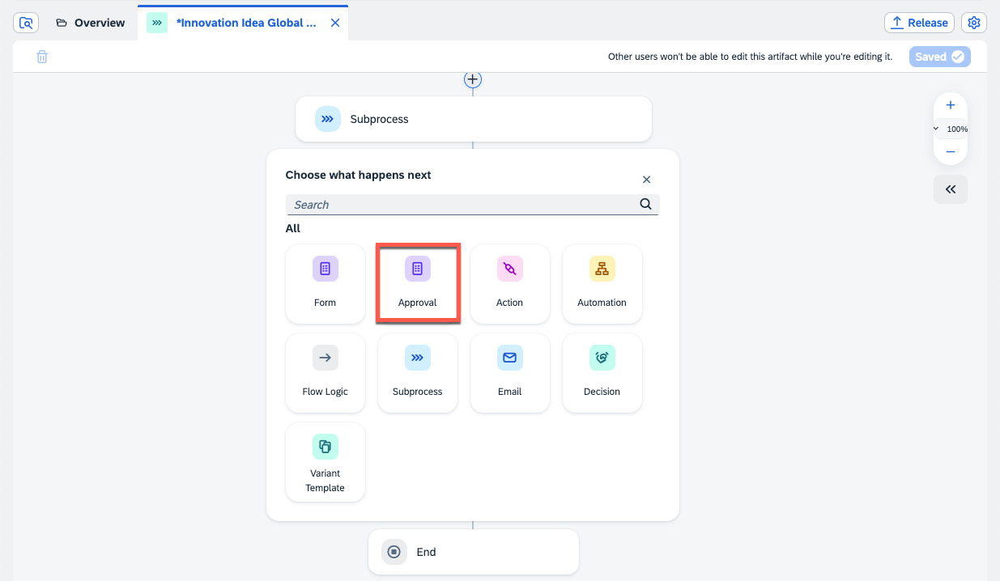
    <!-- border -->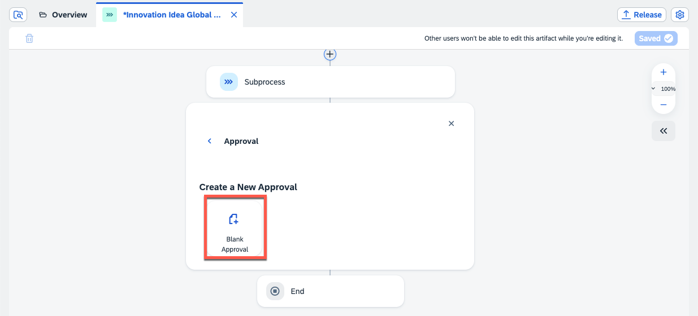

2. Name it **`CAPEX` Council Approval** and make sure to mark the checkbox **Based on a form** and select the trigger form from the list.
   
    <!-- border -->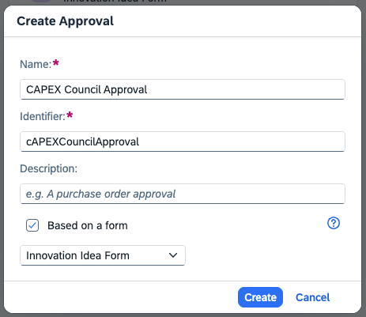

3. Select **Open Editor** of the `CAPEX` form. Make changes in the form:
    - change the Headline to **`CAPEX` Approval for Innovation Idea**
    - at the end of the form add additional Input fields:

    | **Form Field**    | **Value** | **Option** |
    | -------- | ------- | ------- |
    | Paragraph | In case you need more information from the requester, please check the inbox below to send the form back to requester and reject the approval.    | |
    | Checkbox    | Rework needed!     |  |
    | Text Area | Council comment| Required |

    <!-- border -->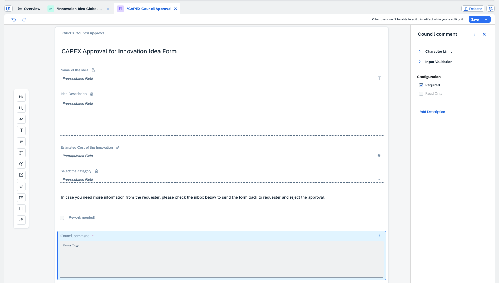

4. **Save** the `CAPEX` approval form, and close the tab.

5. In the Process Tab choose `CAPEX` Approval form. In the General Section:
    - Under **Subject** enter: `CAPEX` Council Approval
    - Under **Users** enter: email of the `CAPEX` Council

    <!-- border -->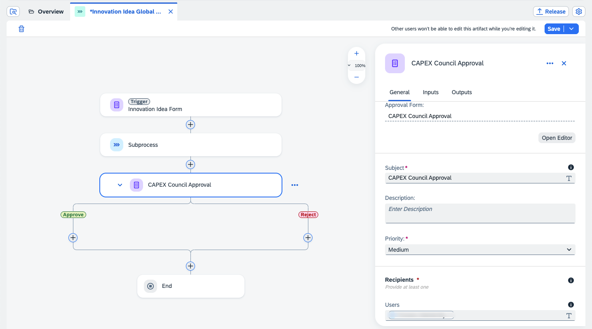

6. In the **Inputs** section map the content:

    | **Custom Variables (Data type)** | **`CAPEX` Council Form**     |
    | -------- | ------- |
    | `category`  | Select the category  |
    | `globalCost`  | Estimated Cost of the Innovation  |
    | `globalDescription`  | Idea Description |
    | `globalIdeaName`  |  Name of the idea  |

    <!-- border -->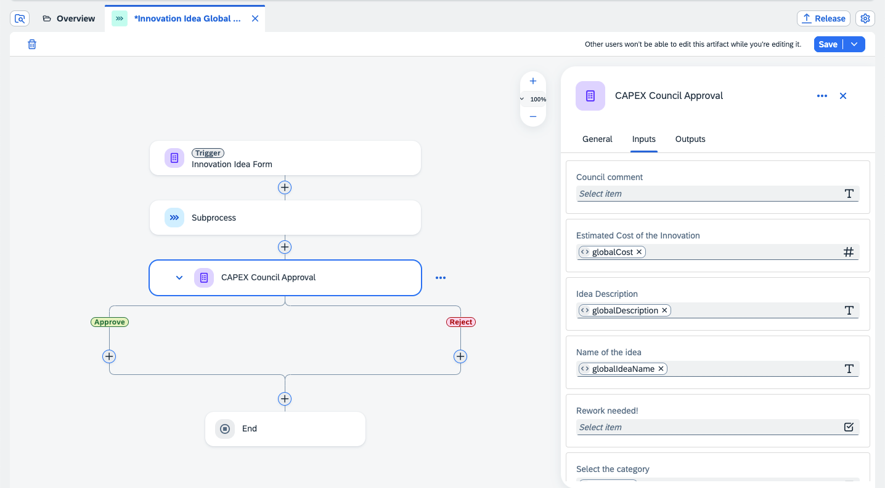

8.  Before `CAPEX` form add a condition which will distribute the form to `CAPEX` or `OPEX` council. Select **+** > **Flow Logic** > **Condition**. 

    <!-- border -->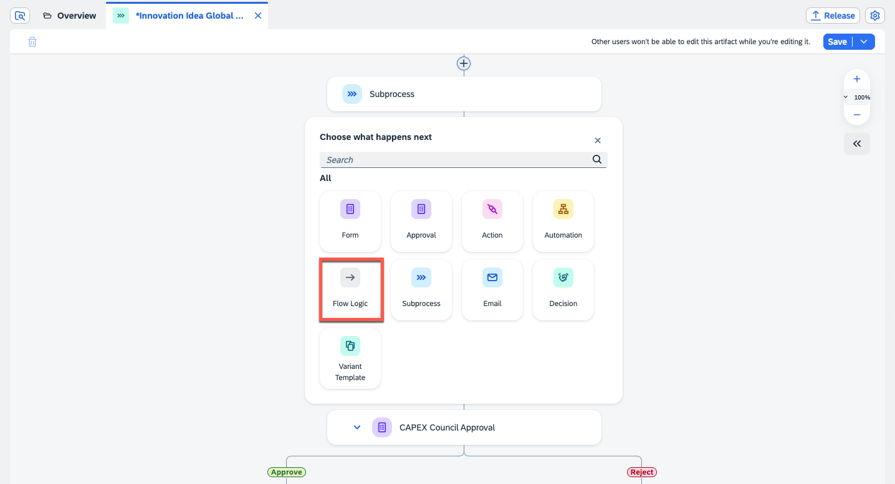
    <!-- border -->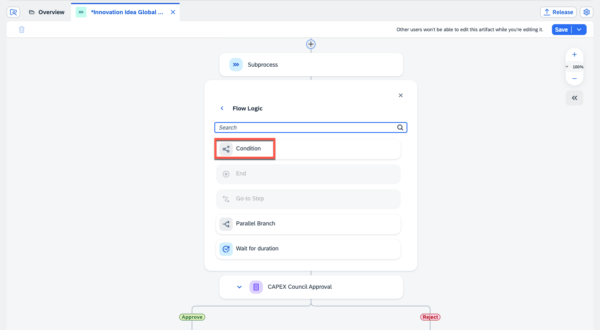

9.  Define the condition panel:
    - Provide the step Name: **Condition `OPEX`/`CAPEX`** 
    - Name the Branch: **If `CAPEX`**
  
    <!-- border -->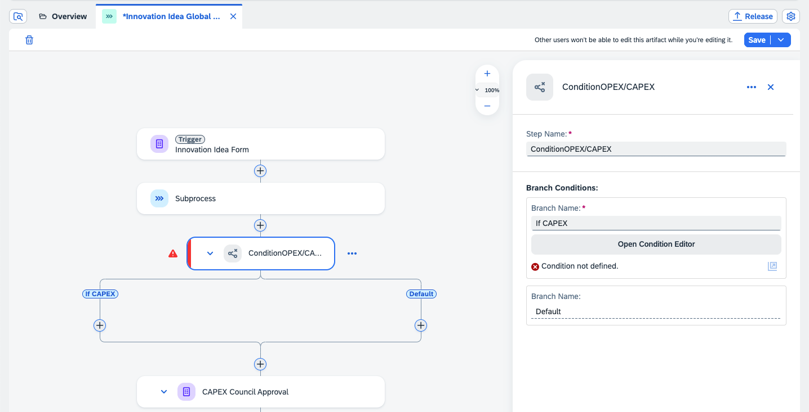

10. Open Condition Editor and define the condition:
    - For item select **category**
    - For Value type **`CAPEX`** and select **apply**
  
    <!-- border -->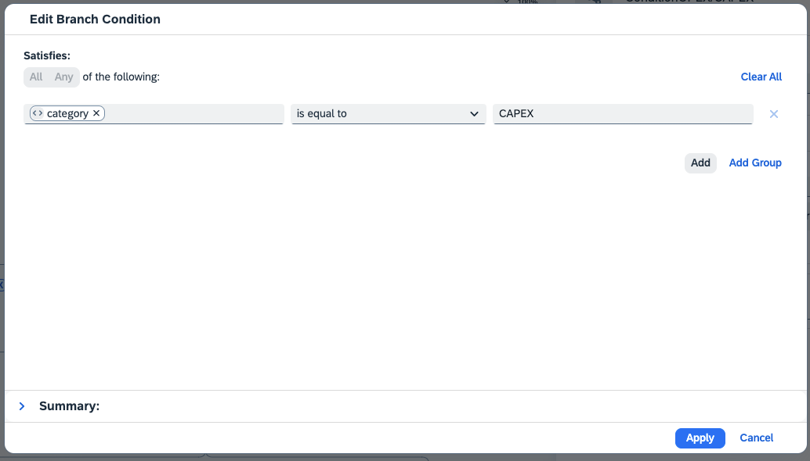

11. In the **Overview** tab, create a duplicate of `CAPEX` form.

    <!-- border -->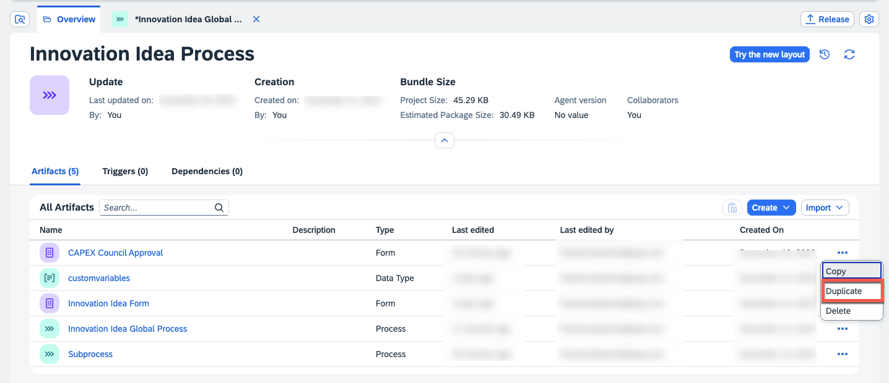

12. Name it **`OPEX` Council Approval**.
   
    <!-- border -->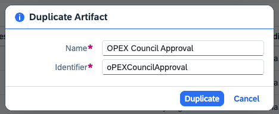

13. Change the Headline to **`OPEX` Approval for Innovation Idea** and **Save**. Close the tab.
    
    <!-- border -->

13.  In the Process tab move **CAPEX Approval** under **If CAPEX condition**. Use the drag and drop option.

    <!-- border -->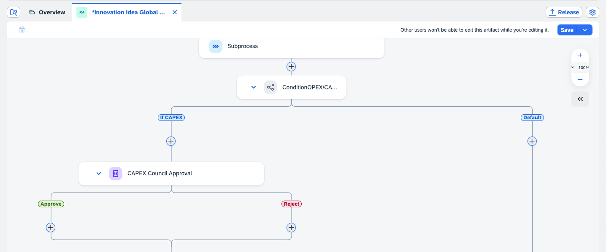

14. Add the `OPEX` form after **Default Condition Branch**.

    <!-- border -->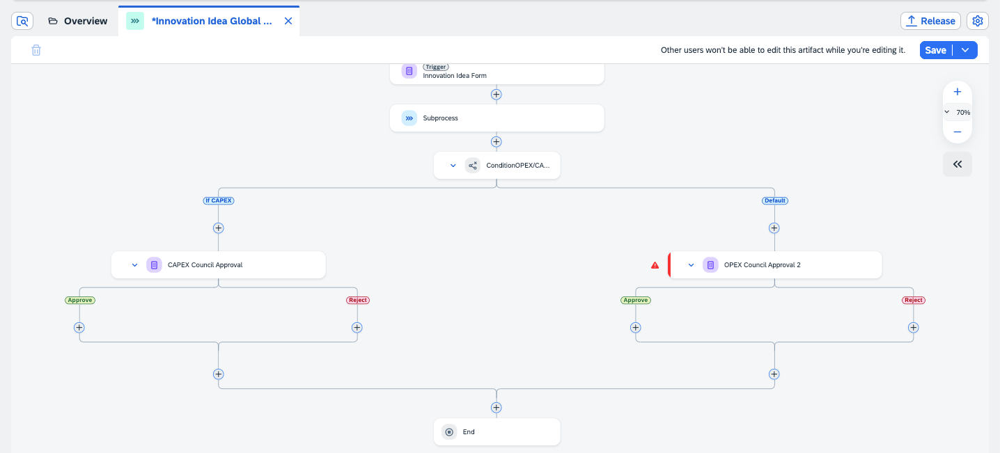

15. In the General Section of the `OPEX` Council Approval:
    - **Subject** enter: `OPEX` Council Approval
    - **Users** enter: email of the `OPEX` Council

    <!-- border -->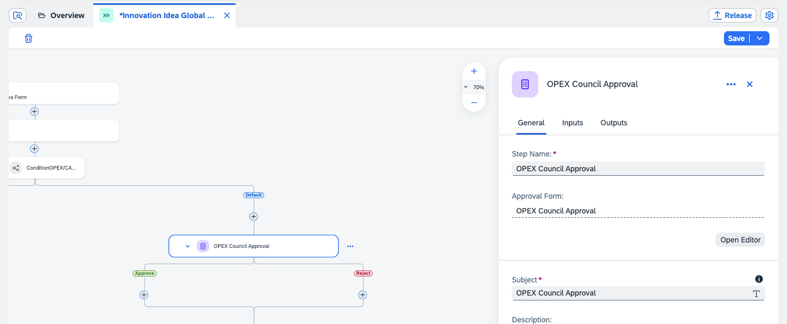

16. In the **Inputs** section map the content:

    | **Custom Variables (Data type)** | **`OPEX` Council Form**     |
    | -------- | ------- |
    | `category`  | Select the category  |
    | `globalCost`  | Estimated Cost of the Innovation  |
    | `globalDescription`  | Idea Description |
    | `globalIdeaName`  |  Name of the idea  |

17. Create a new **CFO Approval Form** after the process would be Approved by the `CAPEX` Council. Select **+** > **Approvals** > **New Approval Form**.

    <!-- border -->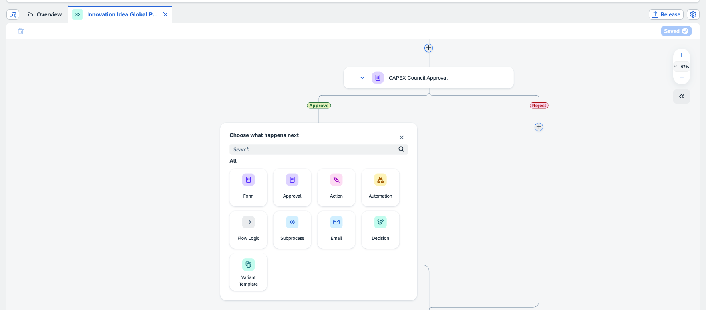

18. Name it as a **CFO Approval**, and make sure to mark the checkbox **Based on a form** and select the **`CAPEX` Council Approval** form from the list.
   
    <!-- border -->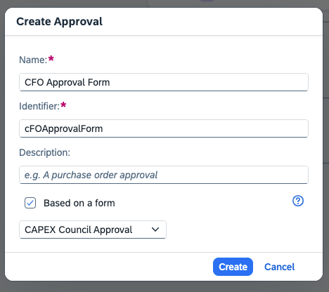

19. Open the Approval form. Edit it as follows:
    - Rename the Headline to **Final CFO Approval - Innovation Idea**.
    - Remove the checkbox Input ''Rework needed''
    - Add in the end a paragraph: **Please provide your final decision for the Innovation Idea:**
    - Add a Text Area Input named **CFO Decision**, and mark it as required 

    <!-- border -->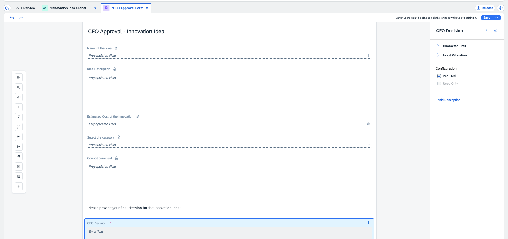

20. **Save** the form and close the tab.

21. In the process tab, select CFO Approval Form and in General Section enter:
    - Under Subject: **CFO Approval**
    - Under Recipient: Email of the CFO

22. In the Inputs map the content:

    | **Custom Variables (Data type)** | ** CFO Council Form**     |
    | -------- | ------- |
    | `globalCouncilComments`  |  Council comment  |
    | `globalCost`  | Estimated Cost of the Innovation  |
    | `globalDescription`  | Idea Description |
    | `globalIdeaName`  |  Name of the idea  |
    | `category`  | Select the category  |

    <!-- border -->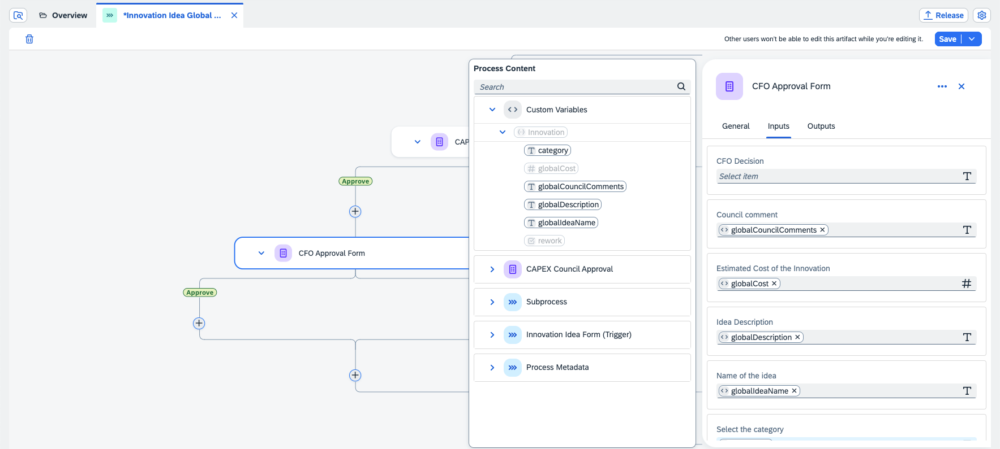

23. **Save** the process.

### Create the Rework Form and Conditions

1. Now, we will create a form for a requester, in case the changes will be necessary. In the Overview tab **duplicate** the **Innovation Idea** form.

    <!-- border -->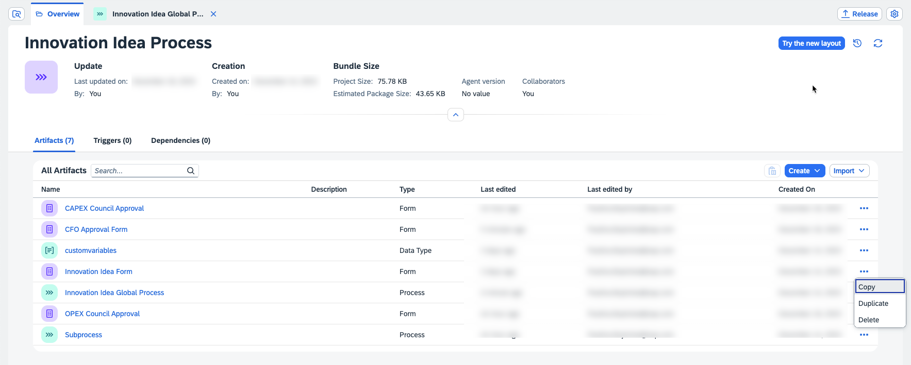

2. Name it **Innovation Idea Form - Rework**.

3. Provide changes in the form:
    - Change the Headline to: **Innovation Ideas Form: Modify you form**
    - Change the Paragraph to: **Please make changes to the form based on the comments from the Council below:**
    - Add **Text Area** Input, name it **Comments from the Approval Council**, and select Read only
    - Add a **Headline 2** input, named **Data from Your Initial Innovation Form**
    - For the Inputs: Name of the idea, Idea Description, Estimated Cost of the Innovation, Select the category select **Read only** configuration

    <!-- border -->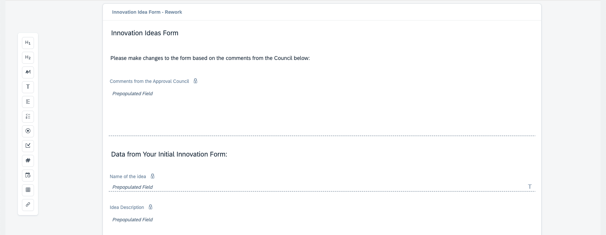
    
4. Add additional inputs in the end:

    | **Form Field**    | **Value** | **Option** |
    | -------- | ------- | ------- |
    | Paragraph | Please modify your form below, based on the comments from the Council and your initial form. After that submit the form.   | |
    | Text    |  Name of the idea - Edited     | Required |
    | Number | Estimated Cost of the Innovation - Edited | Required |
    | Text Area | Idea description - Edited | Required |
    | Dropdown | Select the category - Edited | Required |

5. In the drop down list add **`OPEX`** and **`CAPEX`** as Data to display.

    <!-- border -->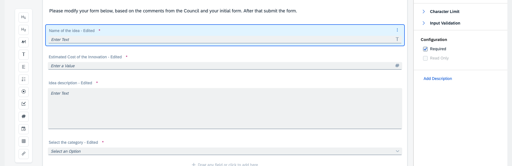

6. **Save** the form. Close the form tab.

7.  Add the form after **`CAPEX` Reject**.

8. Select the form and in the General Section:
    - Name the Subject: **Innovation Idea Form - Rework**
    - Select in Users: **Process Started by**

     <!-- border -->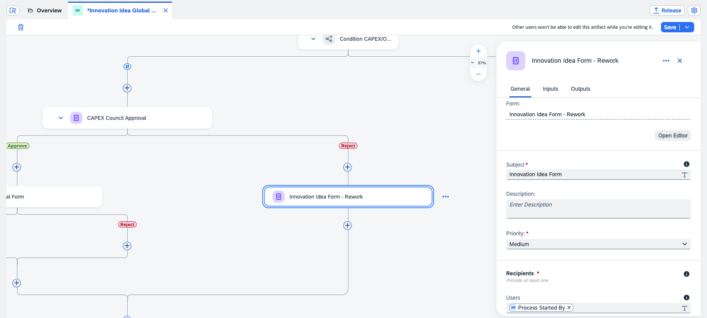

9.  Map the Inputs:
    - **Comments from the Approval Council** with **global council comments**
    - **Estimated Cost of the Innovation** with **global cost**
    - **Idea Description** with **global description**
    - **Name of the idea** with **global idea name**
    - **Select the category** with **category `OPEX`/`CAPEX`**

    <!-- border -->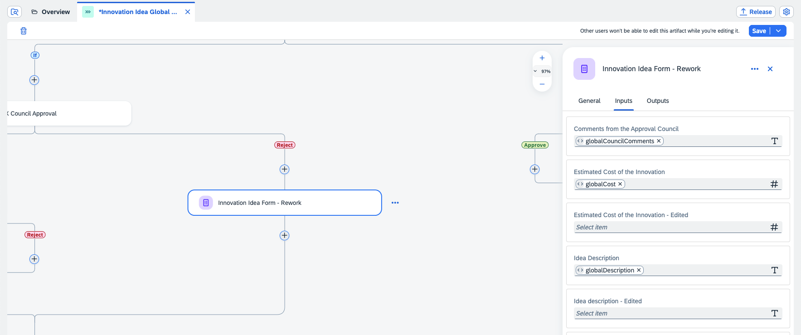

10. Add a condition after **CAPEX Reject** branch. Name it Rework required.

    <!-- border -->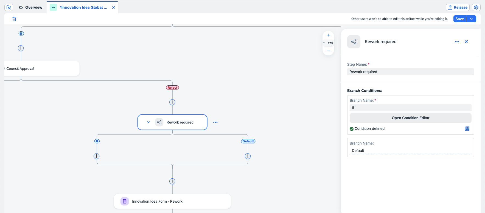

11. In the Condition Editor under item select **rework** and in the value select true.

    <!-- border -->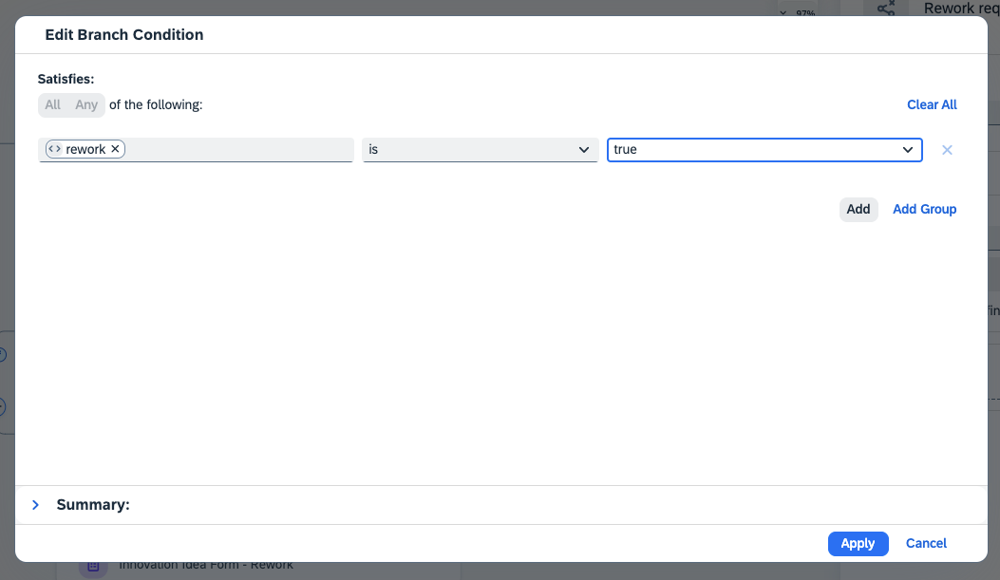

12. Under **Rework required > Default** select **+ > Flow logic > Go-to step > End**. 

    <!-- border -->

13. After **Innovation Idea Form - rework** add **Go-to step > Condition OPEX/CAPEX**

    <!-- border -->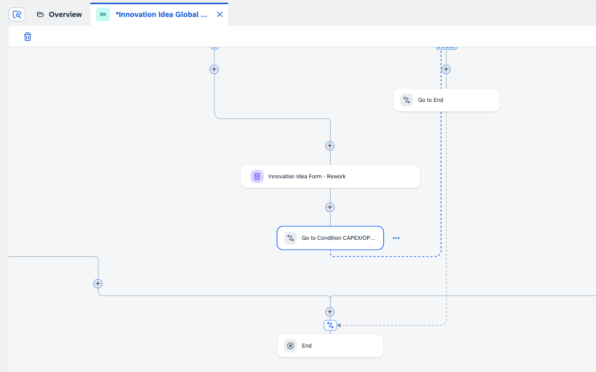

14. Under **OPEX Council Approval > Approve** add **Go-to step > CFO Approval Form**.

    <!-- border -->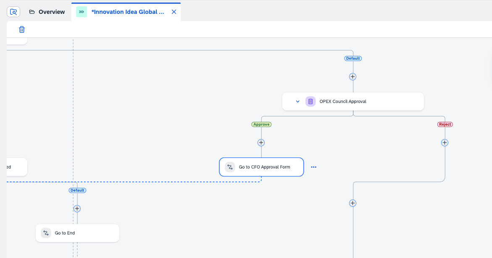

15. Under **OPEX Council Approval > Reject** add **Condition Rework required 2**. In the editor select under item **rework** variable and under value **true**.

    <!-- border -->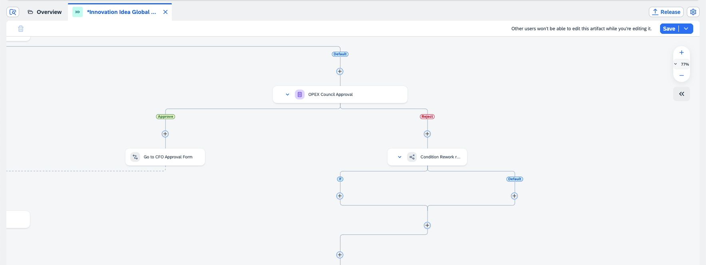

16. Under **If** select **Go-to step > Innovation idea Form - rework**.

16. **Save** the process.

    <!-- border -->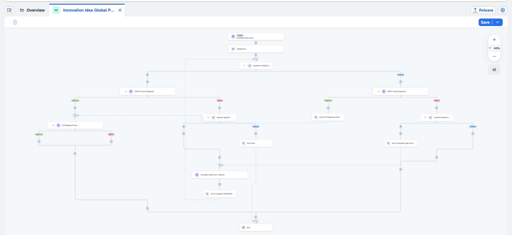    

### Add Mail Artifacts

1. After the CFO Approval select **+** and **Email**. Edit the Artifact details:
    - Change the step name to **Approval Email**.
    - In Email Header **To** enter: **Process Started by**
    - In Email Header **Subject** enter: **Innovation Idea was approved**

    <!-- border -->    

2. Select **Open Mail Body Editor**. Provide the body email and select Apply:

    > Dear `Process Started by`,
    >  Thank you for you idea. We have carefully evaluated it.
    >  The CFO decision is to proceed with the idea.
    >  Please find the CFO's comment below:
    >  `CFO Decision`

    <!-- border -->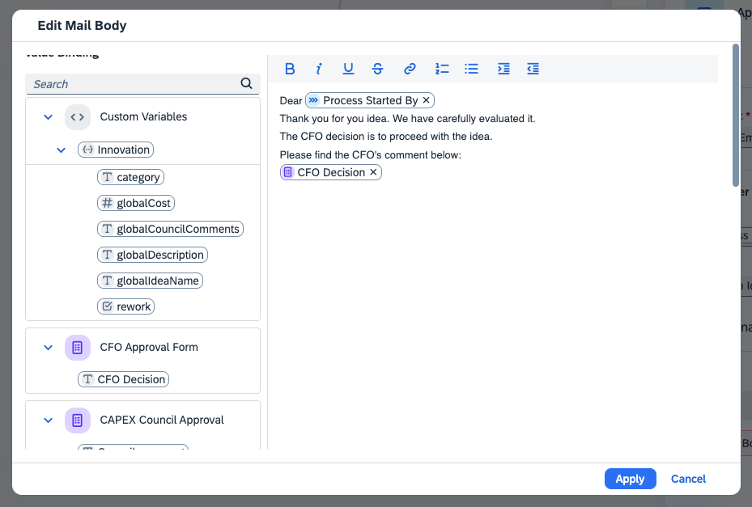    

3. Now, add the same way the rejection email: 
    - Change the step name to **Rejection Email**.
    - In Email Header **Subject** enter: **Innovation Idea was rejected**
    - Email Body:
    > Dear `Process Started by`,
    >  Thank you for you idea. We have carefully evaluated it.
    >  The CFO decision is to not proceed with the idea.
    >  Please find the CFO's comment below:
    >  `CFO Decision`

    <!-- border -->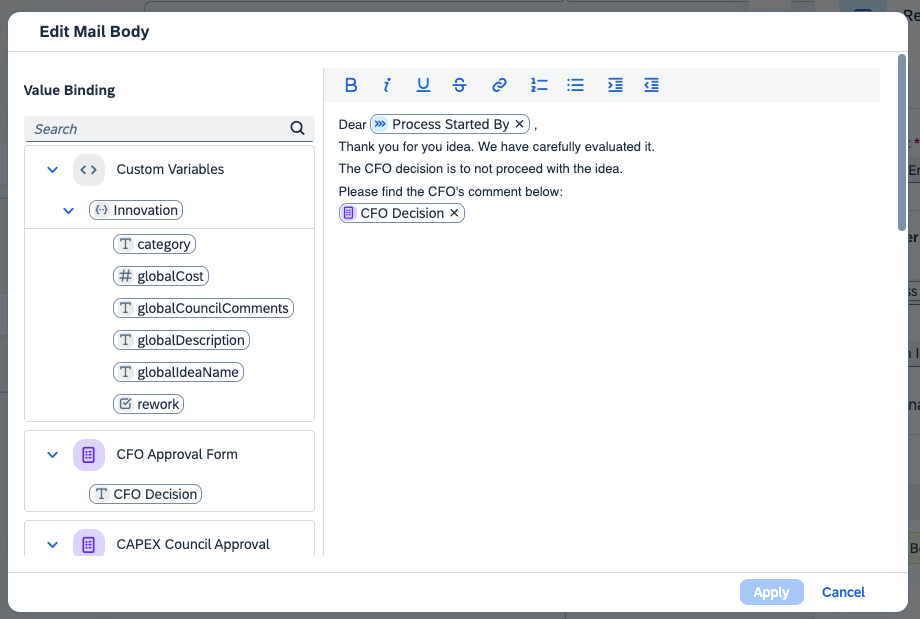    
    <!-- border -->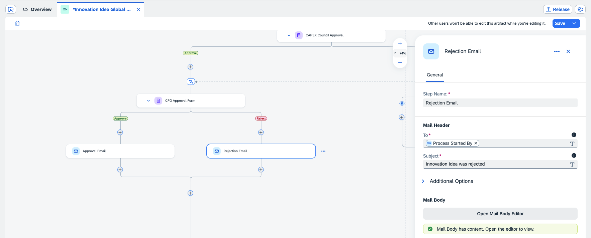    

4. Add CAPEX/OPEX rejection Email. Go to the **Condition Rework Required**, after **default** add an email:
    - Step name: **Rejection Mail `OPEX`/`CAPEX`**
    - To: Process Started by
    - Subject: **Innovation Idea was rejected**
  
     <!-- border -->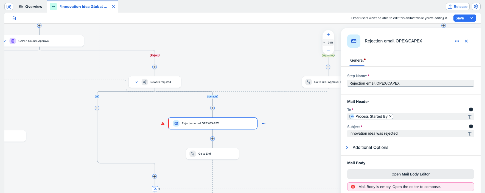     

5. Edit the Email Body:
    > Dear `Process Started by`,
    >  Thank you for you idea. We have carefully evaluated it.
    >  The Council decision is to not proceed with the idea:
    >  `global council comments`

    <!-- border -->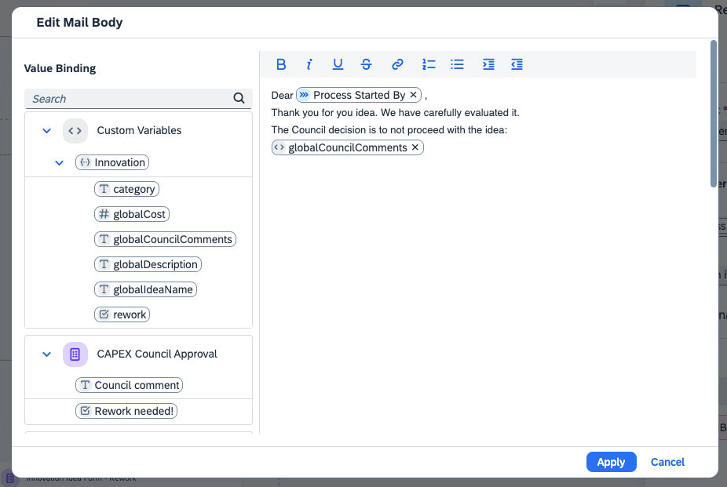    

6. Repeat the same under **Condition Rework required 2**.

    <!-- border -->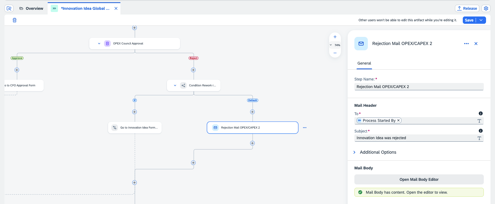    

7.  **Save** the process.

### Release and deploy the process

1. Release the process.
   
    <!-- border -->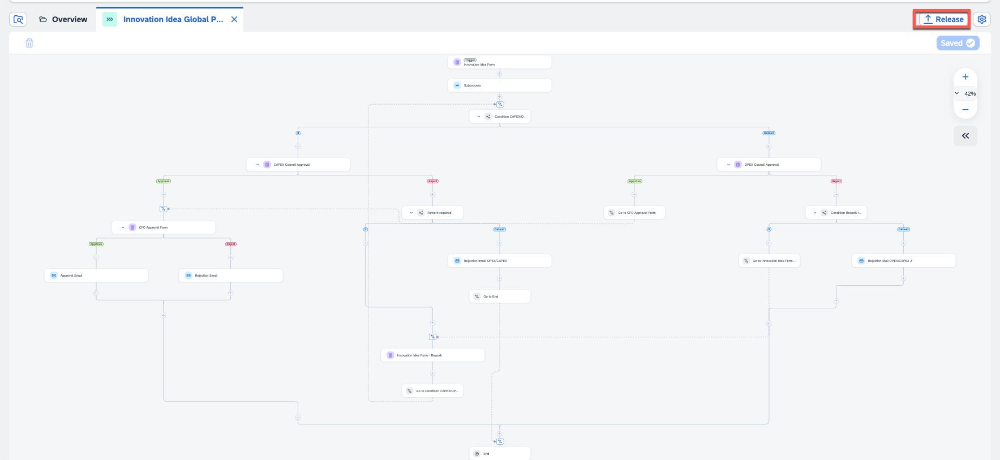    

2. Deploy the process.

    <!-- border -->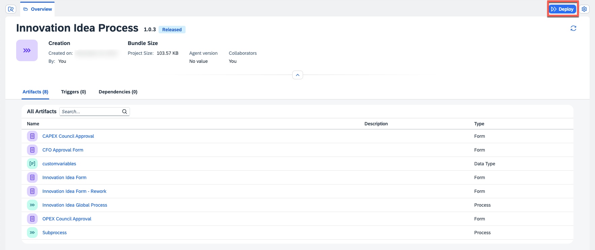   

### Test the process 

3. Open the main process. Select the trigger Form. Copy the Trigger Form link and open in the new tab.

    <!-- border -->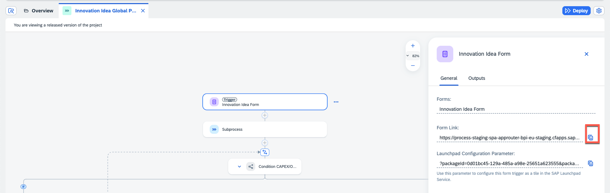   

4. Run the process, by providing the values in the Innovation Form.

    <!-- border -->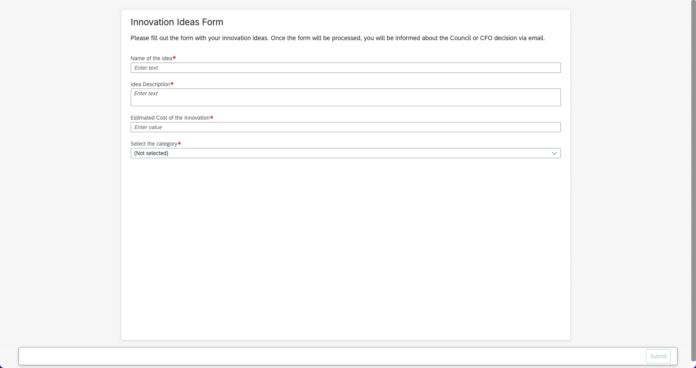   

5. To approve the form as `CAPEX`/`OPEX` Council or CFO open the **Inbox** in the Lobby. 

    <!-- border -->   
    
---
