# Customize the Titles of Buttons in Forms 
<!-- description --> Customize and change the labels of buttons within forms in your business process.

## Prerequisites
  - Either complete the mission [Build Your First Business Process with SAP Build Process Automation](mission.sap-process-automation) or
  - Acquire the sample project **Sales Order Management (MI01)** from the Store using this tutorial [Acquire a Template Project from the Store](spa-acquire-businessprocess-store).

## You will learn
  - How to customize the title of your form button.

---

## Intro
In this tutorial, you will learn how to customize the titles of buttons in your forms. You can choose from an existing list of options or create a custom title according to your preferences.

---

### Change the button title

After completing the prerequisites, your process will look like this:

<!-- border -->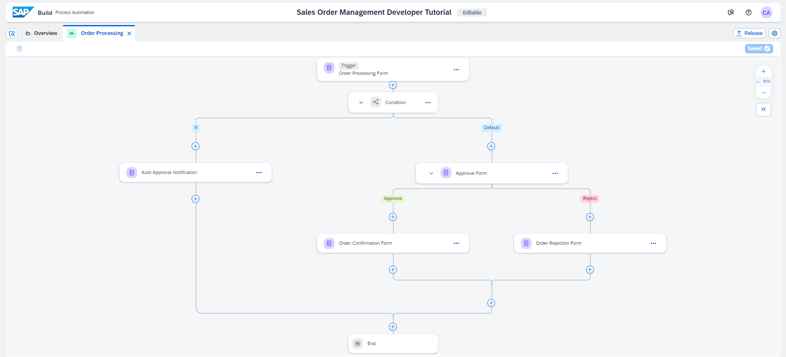

1. In the Order Processing process, select the **Order Processing Form**.

2. Click on the three dots and select **Open Editor**.

    <!-- border -->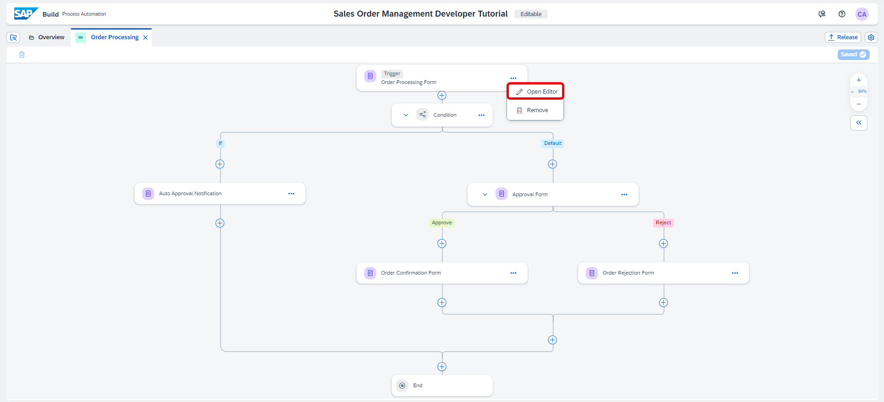

3. In the form builder scroll down the page. You can see the button is initially configured to **Submit**.

4. Choose **Button Settings**.

    <!-- border -->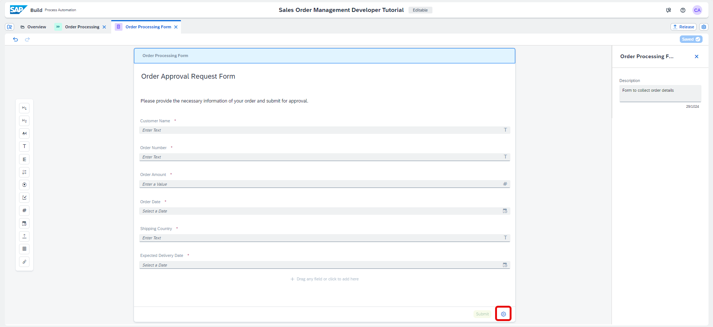

5. In the **Button Settings**, you can choose a different title for your Button. Select the title **Send**.

    <!-- border -->

    Now your button is configured to **Send**.

    <!-- border -->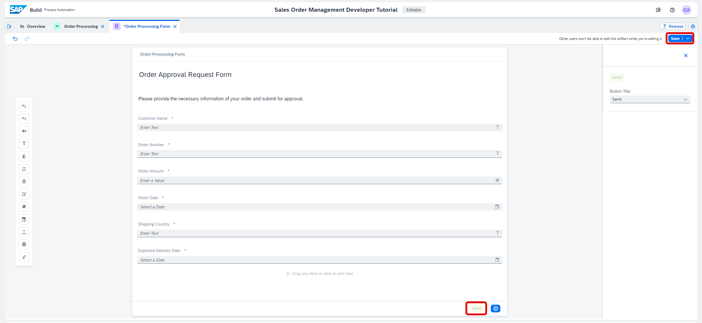

6. Save the form.

### Customize the titles of the buttons

1. Navigate back to the Order Processing process, select the **Approval Form**. 

2. Choose **Open Editor** to edit your Approval Form.

    <!-- border -->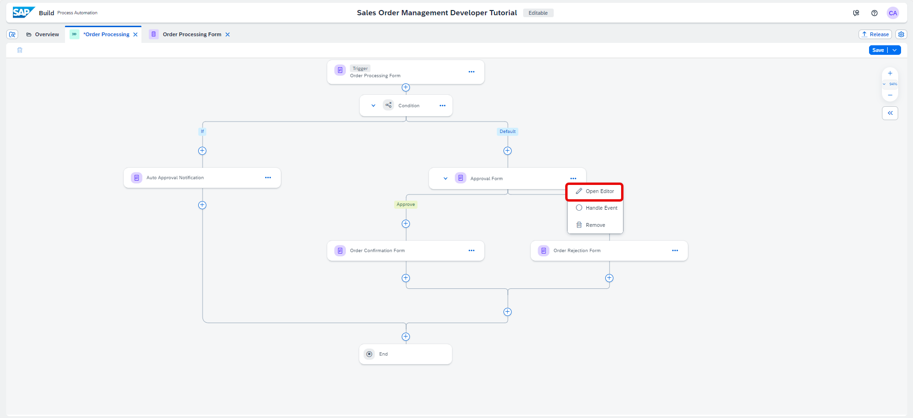

3. In the form builder, scroll down the page and choose **Button Settings**.

    <!-- border -->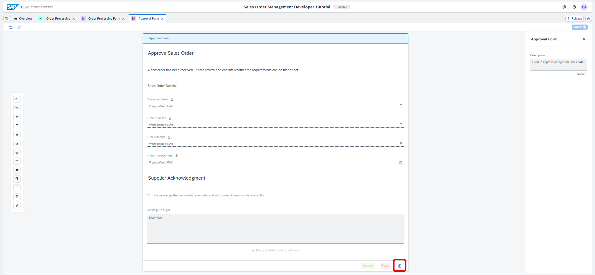

4. In the **Button Settings**, you can choose a different title for your buttons.

    <!-- border -->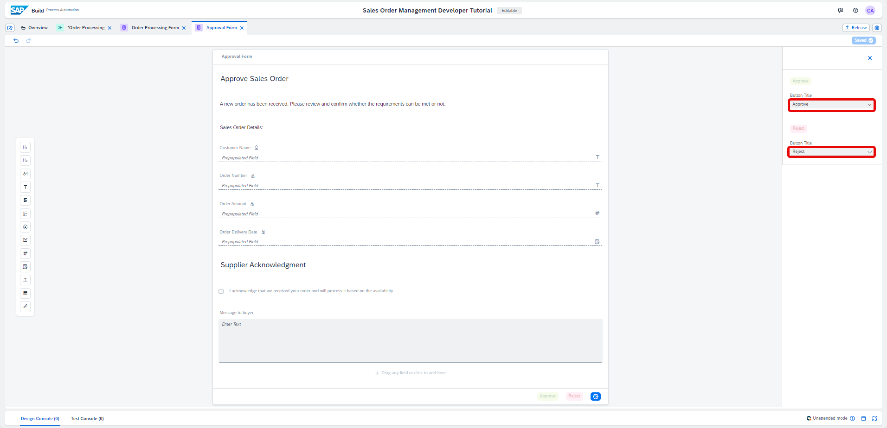

5. To customize your button, select the list of buttons and choose **Custom**.

    <!-- border -->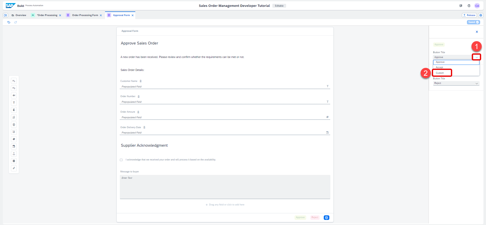

6. In the **Custom Button Title** section, enter your custom title, for example **Validate**.

    <!-- border -->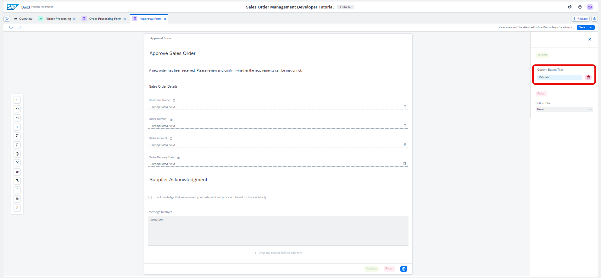

7. Similarly, for your second button, select the list of buttons and choose **Custom**.

    <!-- border -->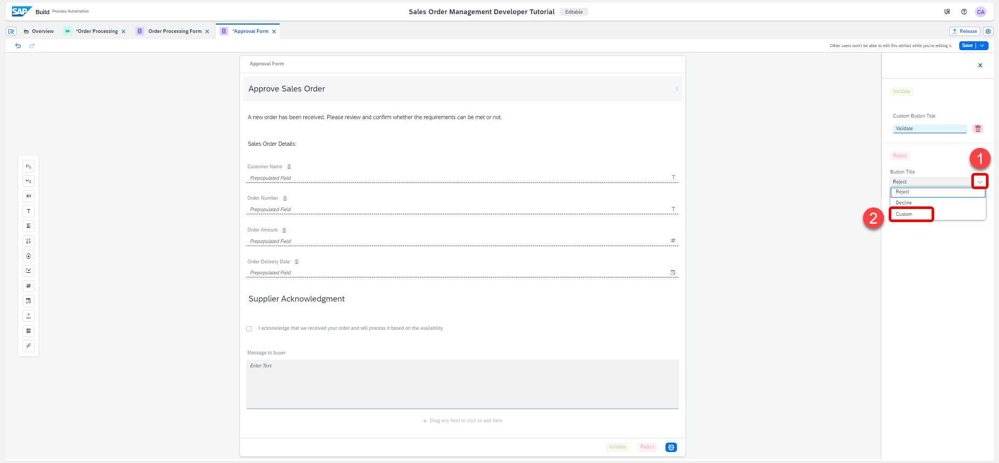

8. In the **Custom Button Title** section, enter your custom title, for example **Refute**.

    <!-- border -->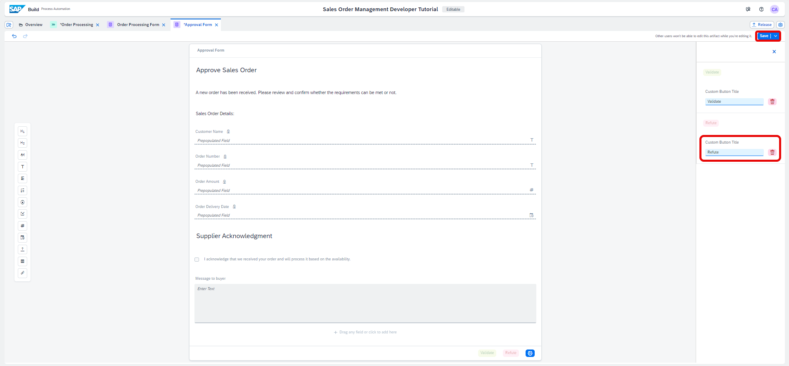

9. Save the form.

    > You may configure all form buttons as per your requirements.

### Release and deploy
    
   - Refer to the tutorial on how to release and deploy the Process [Run the Business Process](https://developers.sap.com/tutorials/spa-run-process.html).

### Test the process 

1. Open the process builder of the deployed version and choose **Order Processing Form**, select the **Copy Link** icon next to the **Form Link** field.

    <!-- border -->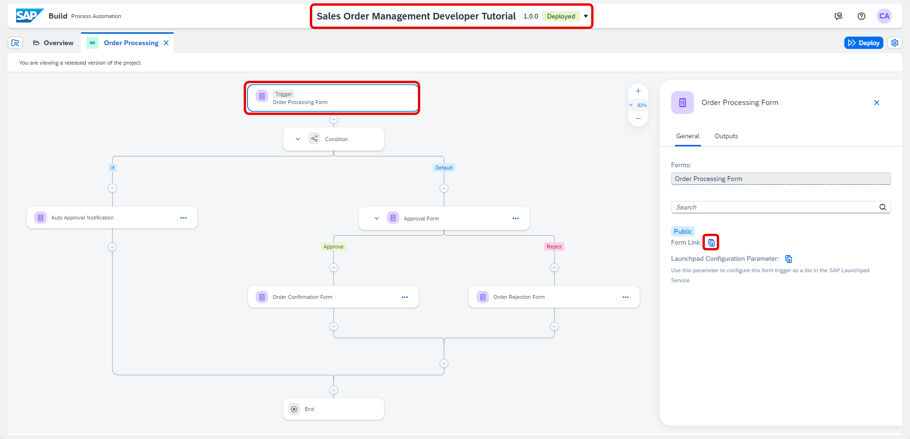

2. When you open the form in the browser, you will have all the input fields as you have defined in the process trigger form and the new **Send** button. 
   Enter the details required in the form and choose **Send**.

    <!-- border -->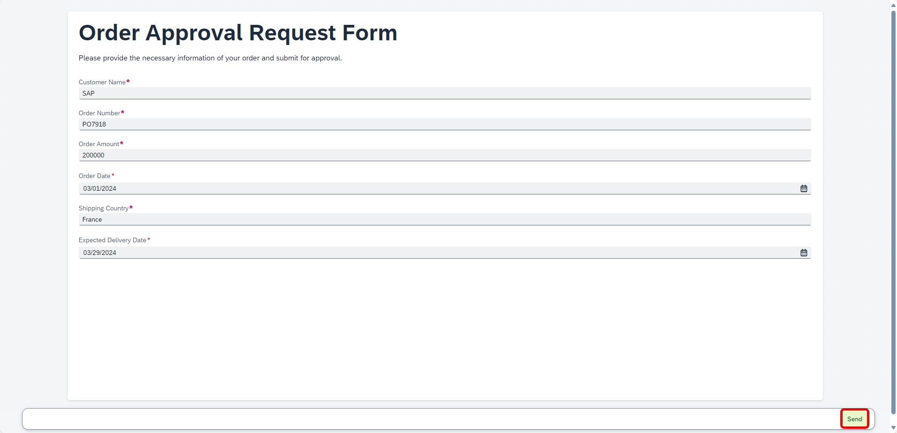

3. In the **SAP Build** Lobby, choose **My Inbox** icon.

    <!-- border -->

4. You can see tasks appear in the My Inbox application that ships with SAP Build. With the new buttons you can  either **Validate** or **Refute** the approval task.

    <!-- border -->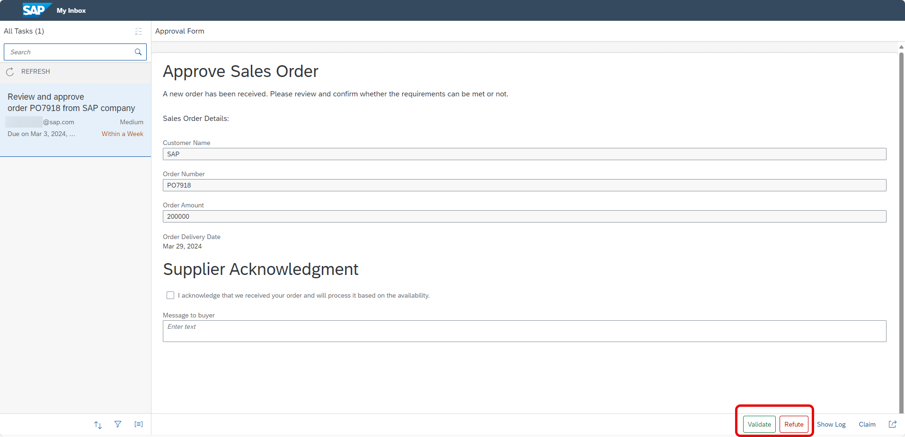

5. Once you **Validate/Refute** the approval task, you may refresh the inbox again to get the final notification.

    <!-- border -->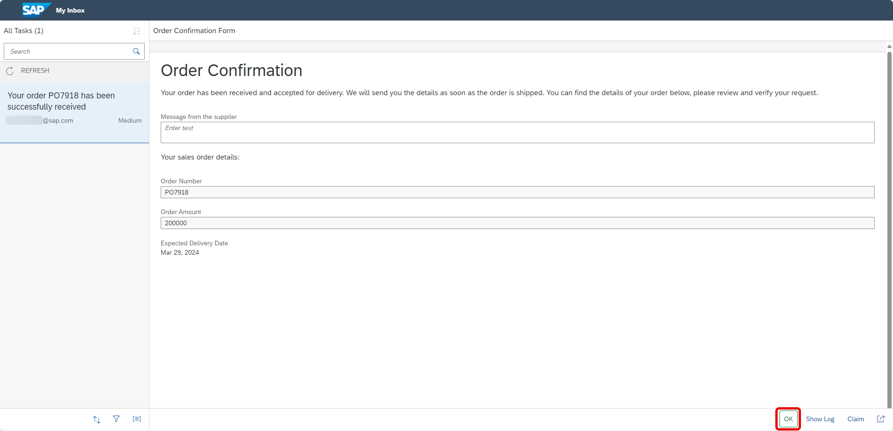

