# Customize automation generated through Recorder
<!-- description --> Customize sales orders creation (SAP GUI for Windows) bot which is generated using Recorder

## Prerequisites
  - Complete [Automate SAP GUI for Windows application using recorder](spa-create-recorder-win-gui)

## You will learn
  - How to customize a recorder generated automation
  - How to use environment variables

## Intro
In this tutorial, you will use the sales order project you created in the previous [tutorial](spa-create-recorder-win-gui) with the Recorder. You will customize the Create Sales Order automation and application to retrieve sales order data from an excel file that holds 20 entries and create a new sales order in SAP GUI for Windows.

---
### Customize the application

    In **SAP Build Process Automation**, open your **Create Sales Order** project where you recorded the application using the **Recorder**.

1. Select the **Create Sales Order** application.

    <!-- border -->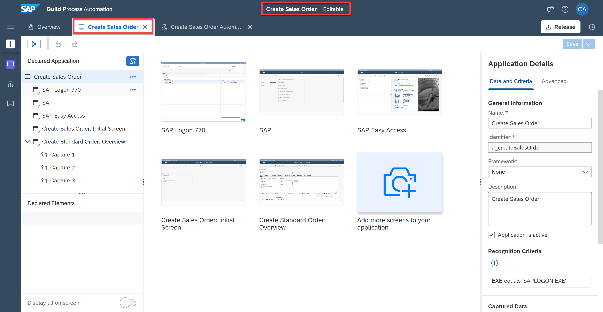

2.  Select the capture containing the order details.

3.  Select the field containing *Material*.

4.  Rename the material field to **Material Field**.

5.  Select **Remove** the **Id** **Criteria**.

    <!-- border -->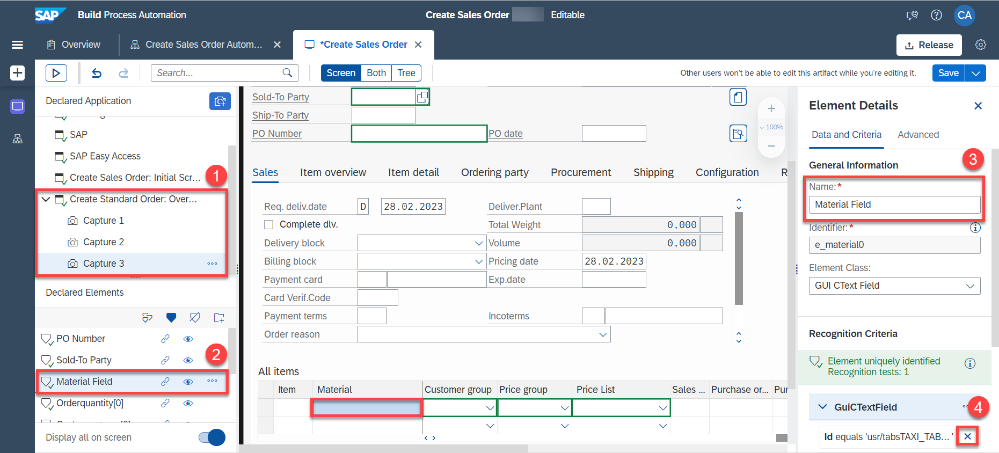

6.  Select **Name** to add it as a **Criteria**.

7.  Select **Is a collection**.

    <!-- border -->

    >**Is a collection** is used to declare a field as a column containing multiple fields rather than just one field.

    <!-- border -->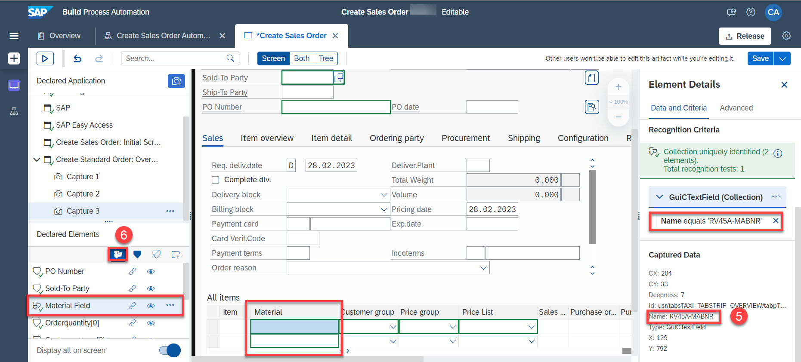

8. Repeat the steps 3-7 for the remaining five fields *Order Quantity Field*, *Customer Group Field*, *Price Group Field*, *Price List Field* and *Storage Location Field*.

    The application now recognizes *Material*, *Order Quantity*, *Customer Group Field*, *Price Group Field*, *Price List Field* and *Storage Location Field* as columns and not as fields.

    <!-- border -->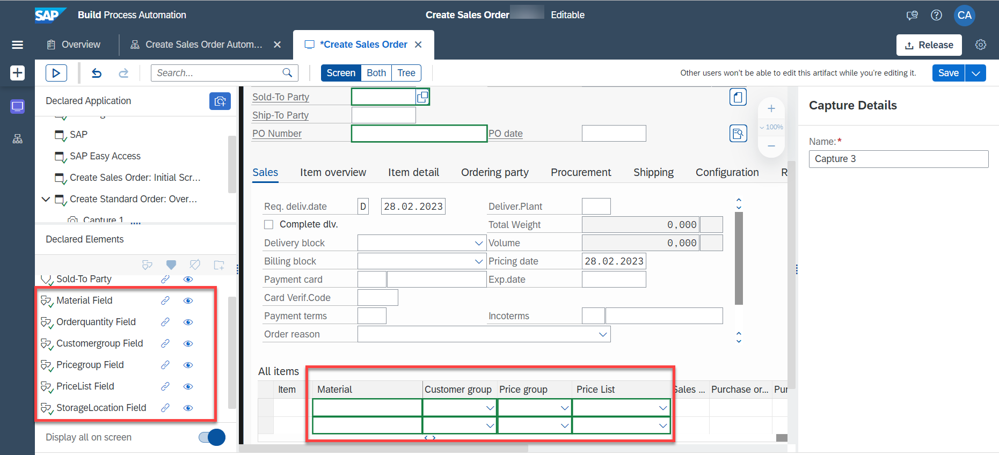

9. Now select on capture 3 the GUI table and choose **Declare Element**.

    <!-- border -->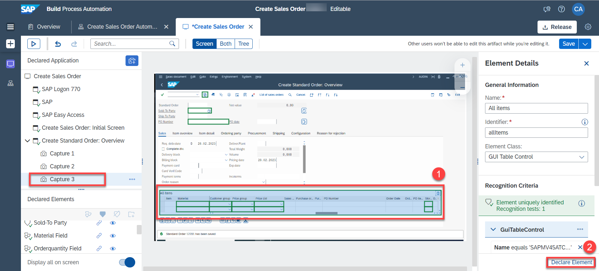

    The GUI table is declared and can be used to access certain activities necessary to customize your automation such as **Get visible row count**.
 
    <!-- border -->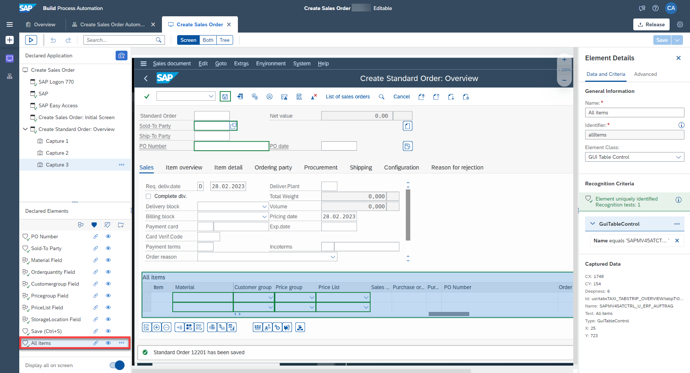

10. Now select on the capture the **Create Item** button and choose **Declare Element**.

    <!-- border -->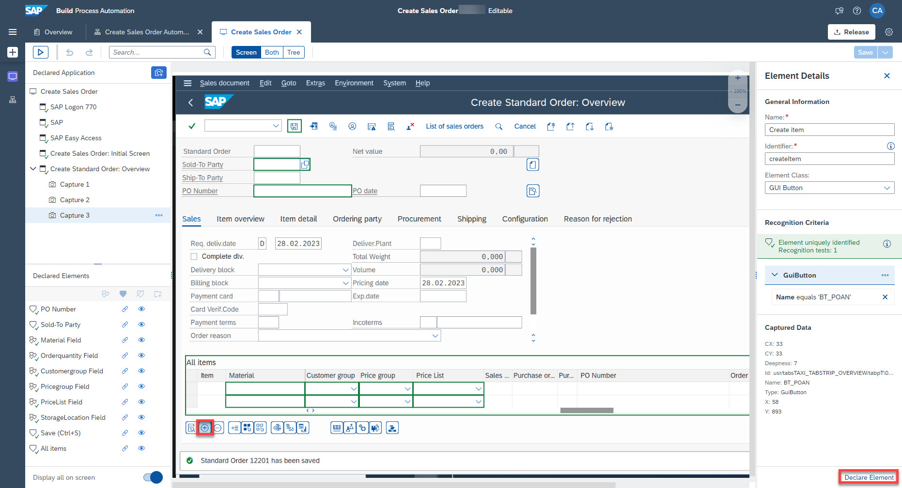

    The **Create Item** button is declared and can be used in your customized automation.
  
    <!-- border -->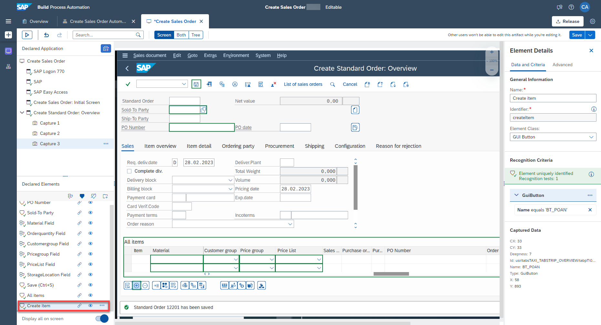

11. Finally, select the **Standard Order xxx has been saved** status bar, change the name to **Saved standard order number** and choose **Declare Element**.

    <!-- border -->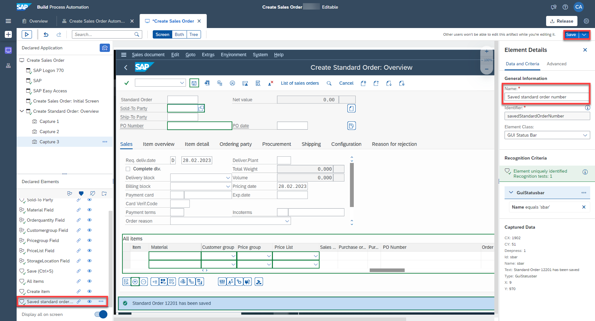

12. Choose **Save** to save your work.

    You have completed declaring the elements necessary to customize your automation.

### Create environment variables

**Environment variables** allow you to reuse certain information for a given environment.

You use **environment variables** to pass parameters to automations. You can create environment variables for which you can later set values across specified environments.

You will create two **environment variables** (Password and Excel file path).

1.  Select **Manage the project properties**.

2.  Select **Environment Variables**.

3.  Select **Create**.

    <!-- border -->

4.  Fill in the *password* environment variable's **Identifier**, **Description** (optional) and **Type** then select **Create**.

5.  Repeat step 4 for *excel_ file_ path* environment variable.

    > Type of environment variables depends on the use case. It can be a **String**, **Password**, **Number**, **Date**, etc...
    > **Environment variables**' identifier can not contain spaces. Replace spaces with *underscores*.

    |  Identifier      | Description (Optional)               | Type
    |  :-------------- | :----------------------------------- | :-----------
    |  password        | SAP Logon password                   | **Password**
    |  excel_ file_ path | Excel file Path for Excel Cloud Link | **String**

    The two **environment variables** are created.

    <!-- border -->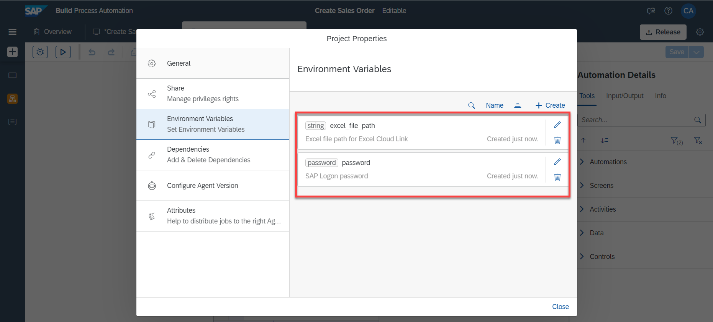

### Customize the automation

1. Select **Create Sales Order** automation in the project.

2. **Setting your password**:

    - Select **Set Element** of password activity in the automation.

    - Under **Input Parameters** for value, select the *password* **environment variable**.

    > **Environment Variables** have the letter **E** on the left side to distinguish them. <!-- border -->

    <!-- border -->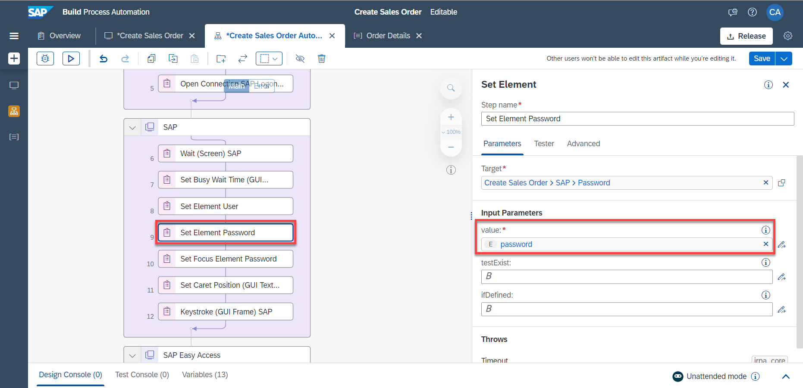

3. **Create an Excel file with the order details**:

    You may download the excel file used in this tutorial [here](https://github.com/sap-tutorials/sap-build-process-automation-Contribution/blob/main/tutorials/spa-customize-win-gui-recorder-automation/SalesOrder.xlsx).

    > This data is used to create the **Sales order** in SAP ERP. You may change this data according to your **SAP ERP** system.

4.  **Adding the required activities to the automation**:

    - Add **Open Excel Instance** activity before the **SAP Logon 770** screen.

    - Add **Excel Cloud Link** activity after the **Open Excel Instance** activity.

    - Add **Close Excel Instance** activity before the **Terminate Application Create Sales Order** activity.

5.  **Configure Excel Cloud Link activity**:

    -  Select the activity.

    -  Select **Edit Activity**.

    -  Choose browse and select the Excel file.

    <!-- border -->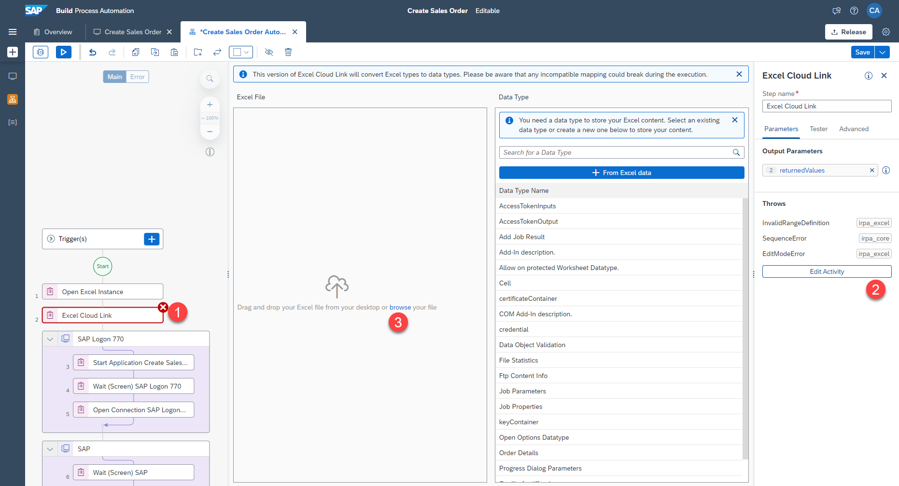

    The file is loaded to the activity.

    -  Under **Workbook path** select the *excel_ file_ path* **environment variable**.

    -  Select **+ From Excel Data** to create the Order details **Data Type**.

    <!-- border -->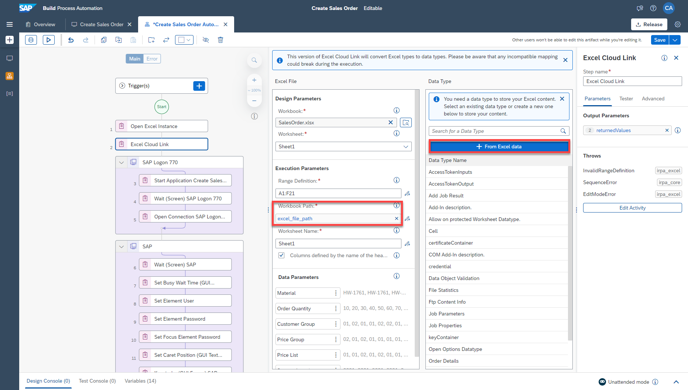

    A pop-up window opens.

    - Set a name and a description for the **Data Type**.

    <!-- border -->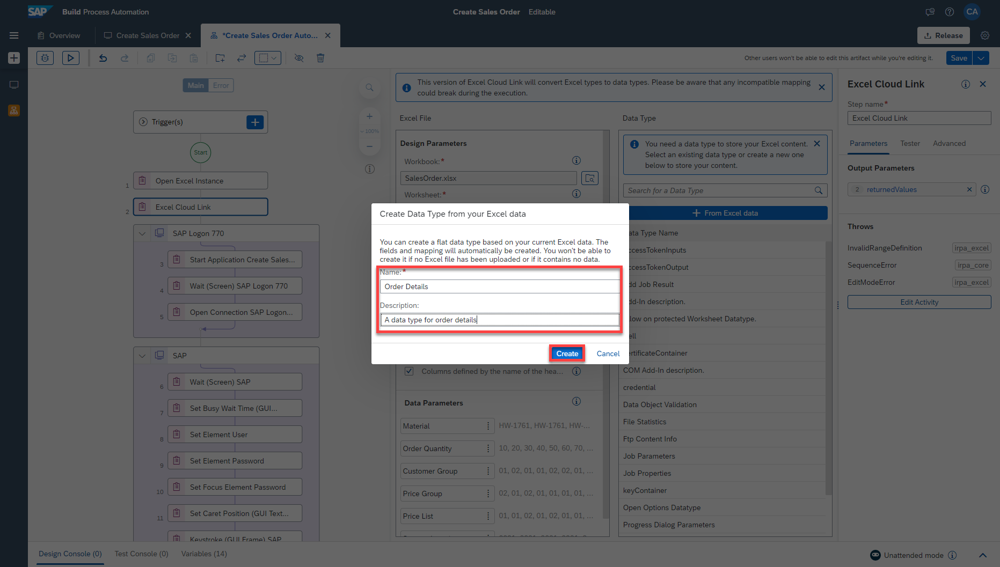

    The Data Type Order Details has been created.

    <!-- border -->

    You may go to **Overview** tab and see that a new Data Type artifact has been created.

    <!-- border -->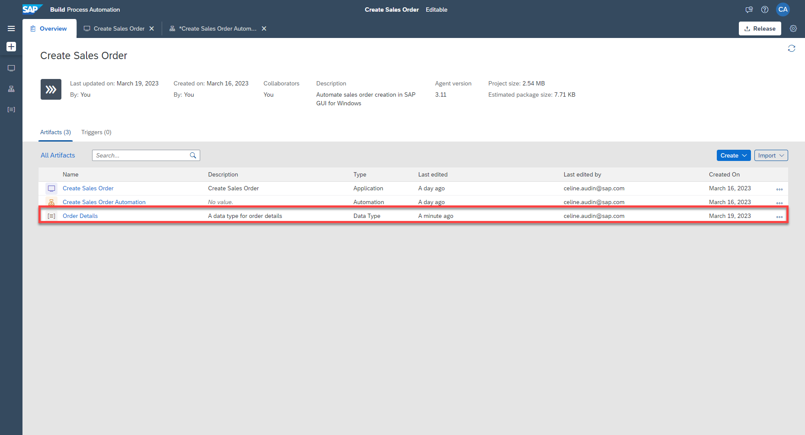

6. **Get the visible rows count of your GUI table**:

    - Double click on the screen **Create Standard Order: Overview**.

    - Search for the activity **Get Visible Rows Count (GUI Table)**.

    - On the capture, double click on the table you previously declared and drag and drop the activity on the selected table.

    <!-- border -->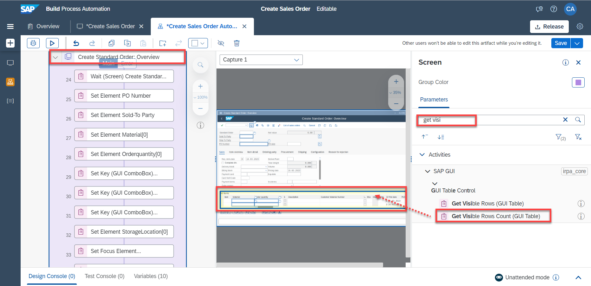

    The activity will get added at the bottom of **Create Standard Order: Overview** screen.

    - In the automation, drag and drop the activity just below **Set Element Sold-To-Party**.

    <!-- border -->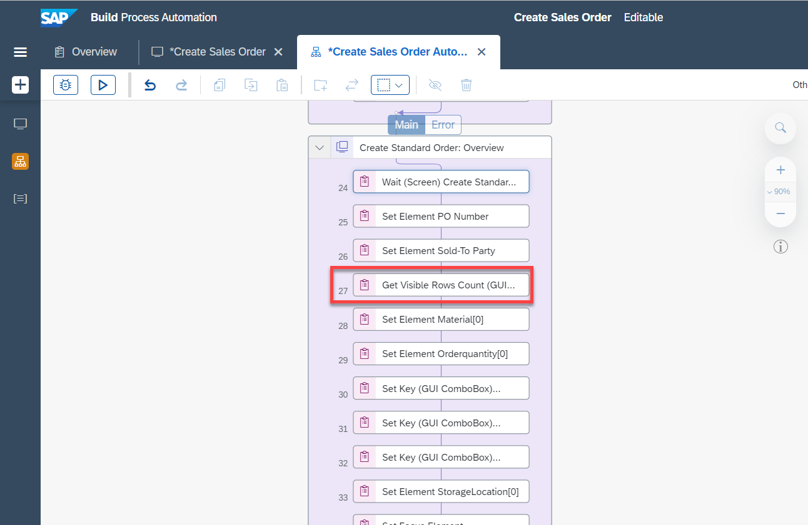
  
    > ### What is going on?
    > **Get visible rows count** activity retrieves the number of visible rows in a SAP GUI table. Depending on your display, the number of visible rows of your table may vary.

7. **Create a number variable**:

    - Under **Data Types**, drag a **Number** data type and drop it below the **Get Visible Rows Count (GUI Table)**.

    <!-- border -->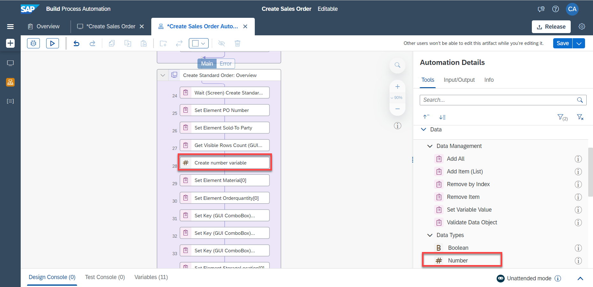

8. Select the activity and under **Input Parameters** as a value enter 0.

    <!-- border -->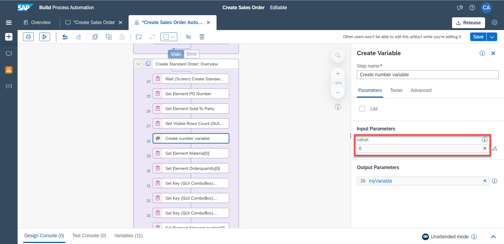

    > ### What is going on?
    > You have created a variable of type number that has a starting count value of 0. 

    Now to add all the rows from the Excel file, you require adding a **For each** activity.

    > The **For each** activity is used for *looping* through Data.

9.  **Looping through your excel data**:

     - Search for the **For each** control and drag and drop it below the **Create number variable** just above the fields that need to be included in the repetitive process ( *Material*, *Order Quantity*, *Customer Group*, *Price Group*, *Price* and *Storage Location* ).

    <!-- border -->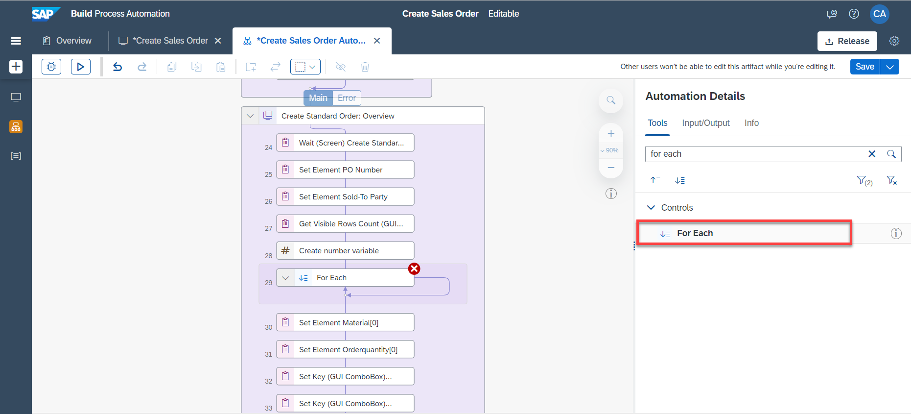

    - Drag and drop the three **Set Element - X** activities as well as the three **Set Key (GUI Combo Box)** activities inside the **For each** activity.

    - Select **For each** activity.

    - Select **returned Values** option on **Set looping list**.

    > **returned Values** references the data returned from the **Excel Cloud link** activity.

    <!-- border -->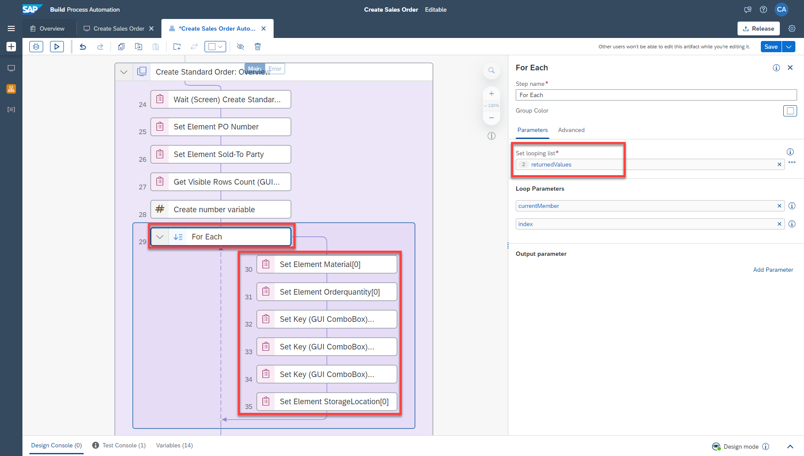

    Map the excel data of the current row to the corresponding field.

    -  Select the first field (Corresponding to *Material*).

    -  Set the value as **current Member** and select **currentMember.material** from the drop down menu that shows up.

    > **current Member** references the excel row used in the iteration of the **For each** loop.

    <!-- border -->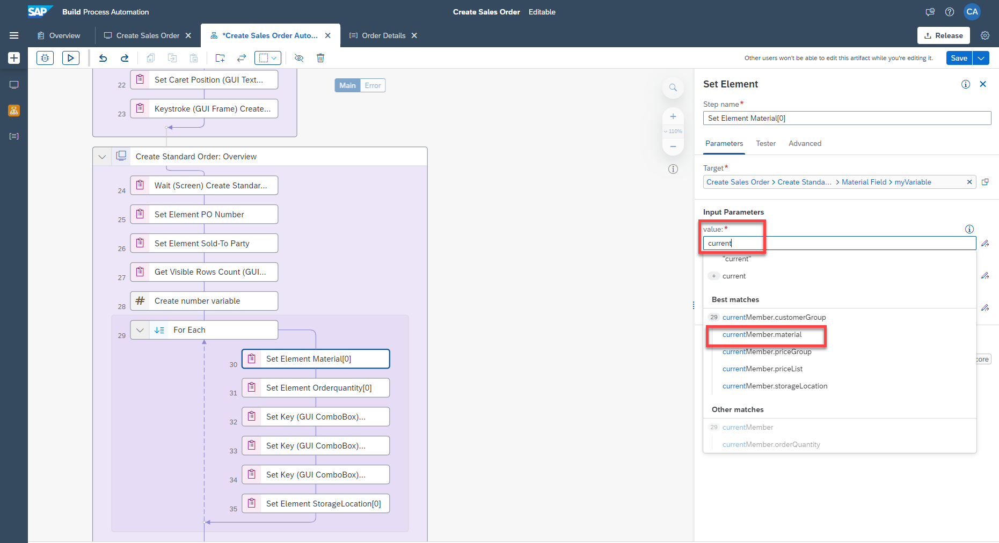

    -  Select **Open the target editor**.

    -  Select **Material Field**.

    -  Set **Index of the Element** to **my variable**.

    -  Select **Confirm**.

    <!-- border -->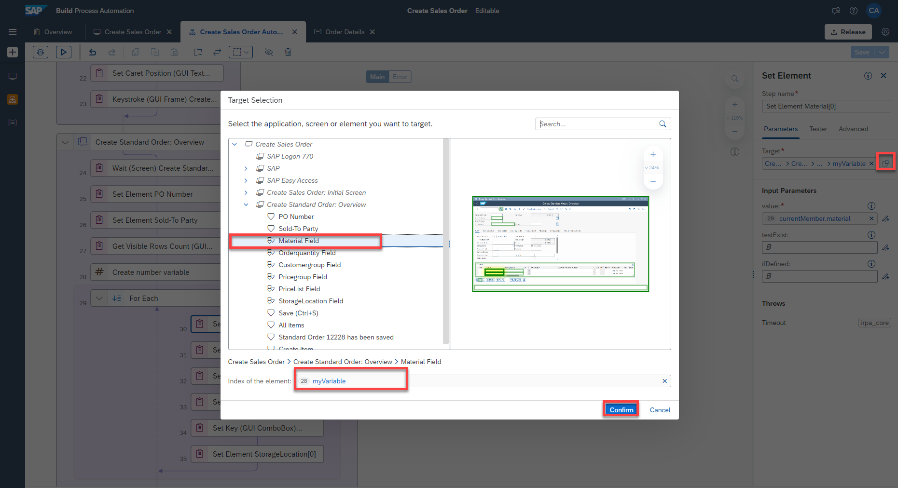

    Some fields are stored as numbers in excel such as **Order Quantity**. Convert them to strings (succession of characters).

    -  Select the second field (Corresponding to *Order Quantity*).

    -  Select **Open expression editor**.

    -  Enter `Step29.currentMember.orderQuantity.toString()`.

    -  Choose **Save Expression**.

    > *Step29* references the **For each** **activity**.

      <!-- border -->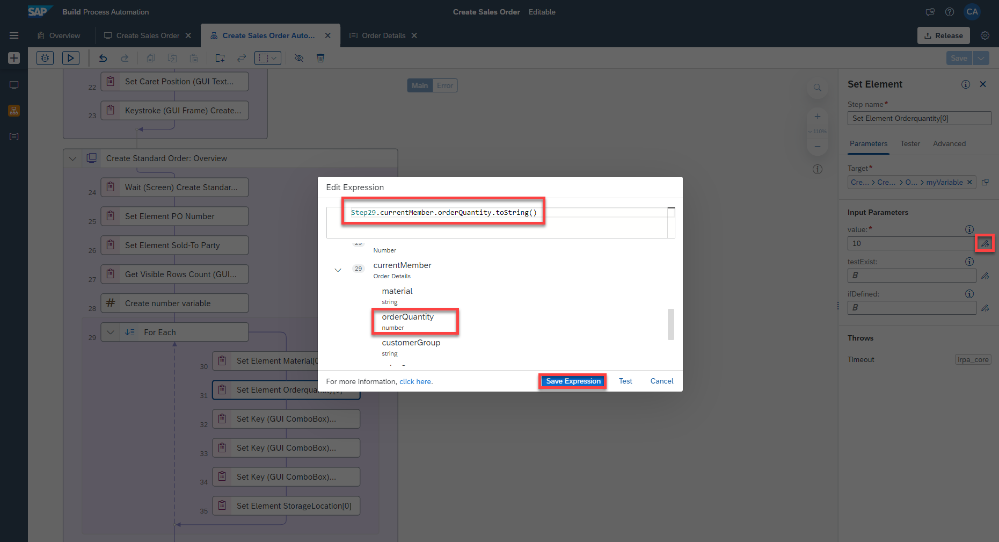

    -  Select **Open the target editor**.

    -  Select **Order Quantity Field**.

    -  Set **Index of the Element** to **my Variable**.

    -  Choose **Confirm**.

    <!-- border -->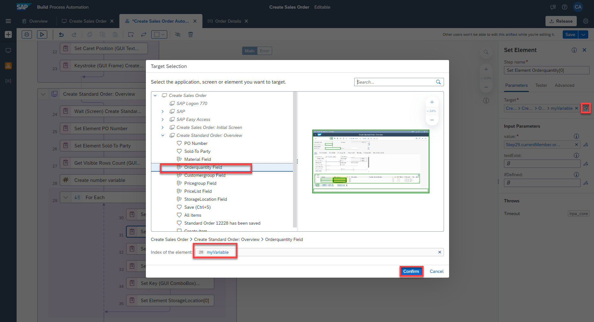  

    > Repeat the same steps for *Customer Group*, *Price Group*, *Price List* and *Storage Location* fields as for the *Material* field in the previous steps.

    So far, you have retrieved the number of visible rows in your SAP GUI table. You have created a loop that loops through the data in your excel file. This means that the rows contained in your excel file will be correctly set in your GUI table up to the rows that are visible on your table but not for those rows that are not visible. If the rows in your excel file are **greater** than the visible rows of your table, you will have to add a condition in order for the automation to add all the rows from your excel file.
    
10. **Adding a condition**:

    - Search for the **Condition** control and drag and drop it below the **Set Element Storage Location** activity within the **For Each** loop.

    - Select the control and choose the three dots. From the dropdown, select **Edit Formula**.

    <!-- border -->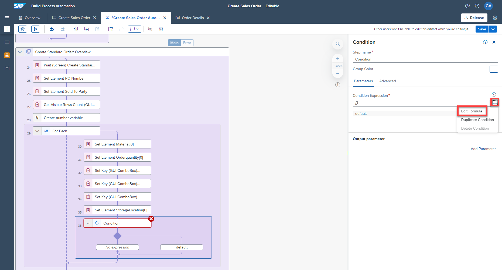  

    - In the Expression Editor, enter : `Step28.myVariable == Step27.count - 1`

    - Choose **Save Expression**.
    
    <!-- border -->  

    > ### What is going on?
    > The my variable you created starts at 0. This means that the For Each loop will loop through the excel data from 0 to 19. (the Sales Order excel file, you are using for this exercise has 20 rows) The first visible row of a SAP GUI table starts at 0. So you need to subtract 1 to the count of visible rows. Hence, the formula reads: *If my variable is equal to the number of visible rows in the GUI table - 1*

    - Search for **Set Variable Value** and drag and drop it in the condition below the first branch.

    <!-- border -->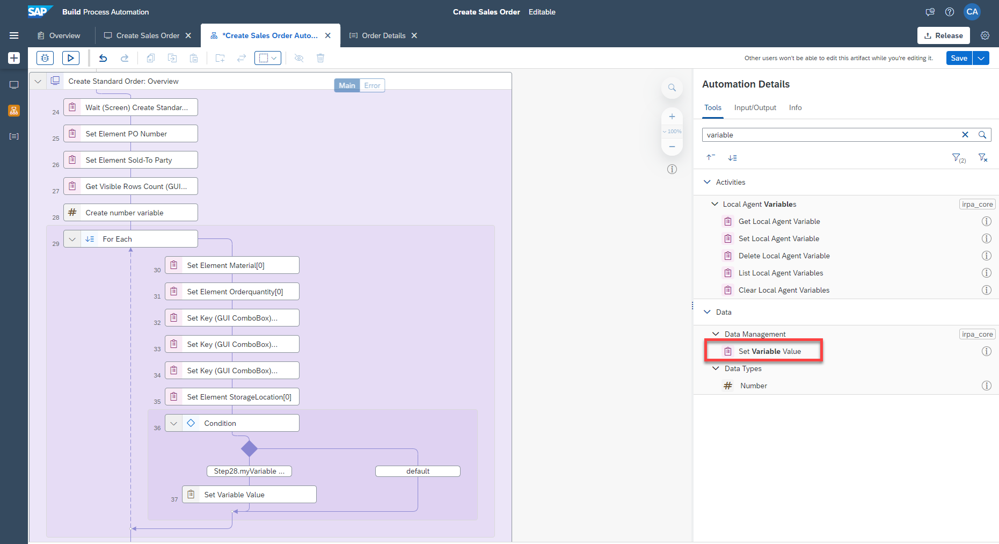  

    - Select the activity under the condition branch.

    - Set the **Input Parameters** as such:

        - variable: my Variable
        - value: 1

    <!-- border -->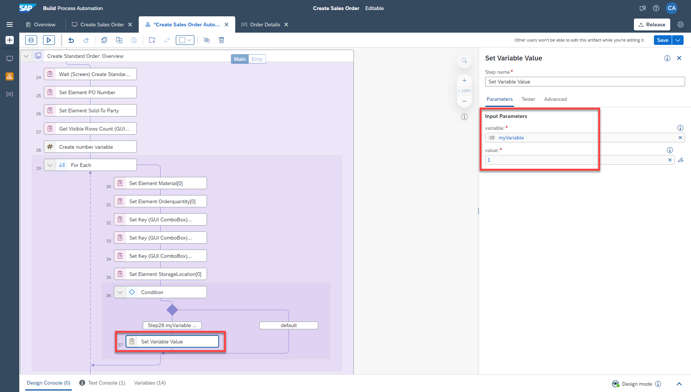  
    
    - Double click on the **Create Standard Order: Overview** screen. 
    
    - Choose the **Create Item** element on capture 3. 
    
    - Search for the **Click Sync (GUI Button)** activity and drag and drop it on the **Create Item** element.
    
    <!-- border -->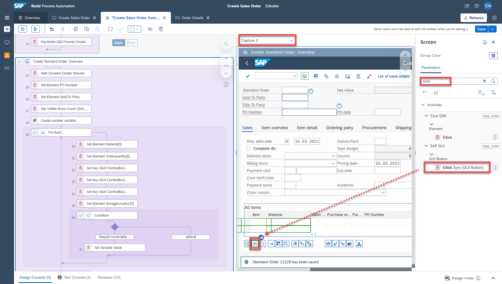  

    - Drag the **Click Sync (GUI Button)** activity and drop it below **Set Variable Value**.

    <!-- border -->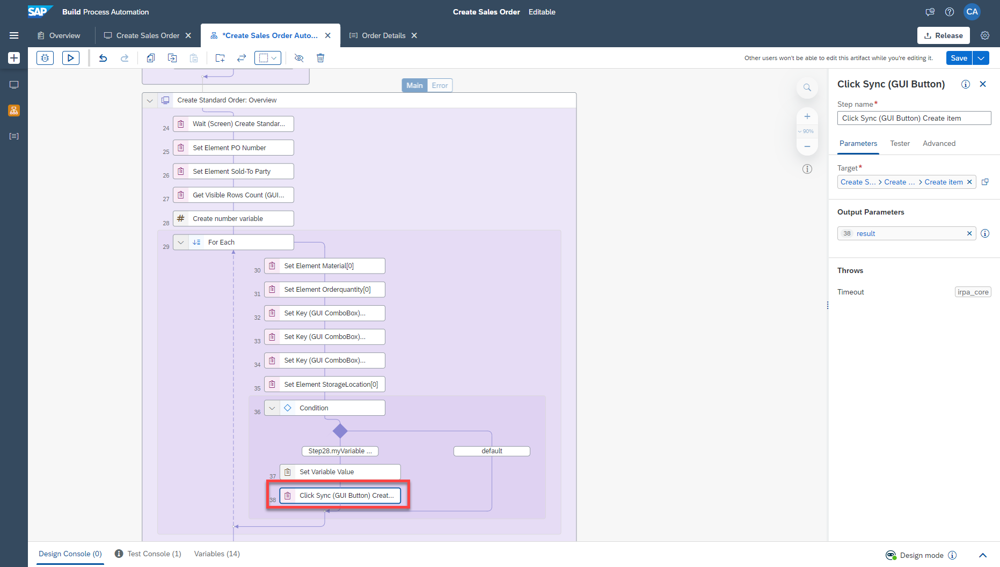 

    > ### What is going on?
    > If the value of my variable is equal to the number of visible rows in the GUI table -1, a new row needs to be created in order to add the other rows from the excel data. However, when a new row is created, GUI table registers the previous row created hence the value needs to start at 1. 0 being the previously recorded row.

    - Close the screen and and search for **Set Variable Value** and drag and drop it below the default condition.

    - Select the activity and set the **Input Parameters**:

        - variable: my Variable

        - For value, open the expression editor and enter: `Step28.myVariable + 1`

    <!-- border -->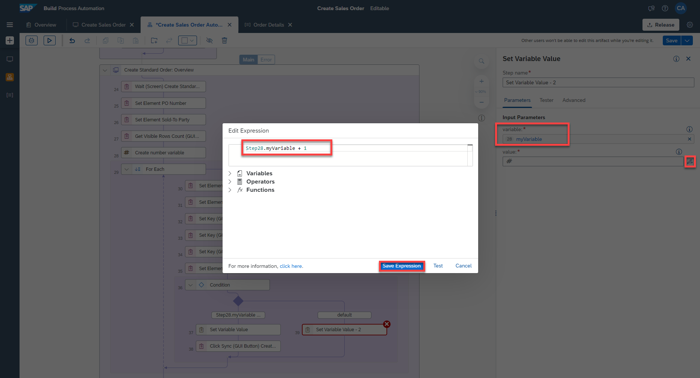 

    > ### What is going on?
    > If the value of my variable is not equal to the number of visible rows in the GUI table - 1, meaning the data from excel can be set on the visible rows of the GUI table then the value of my variable is set from 0 until 19.

    You may delete unnecessary activities such as **Set Focus Element Storage Location** and **Set Caret Position (GUI Text Field) Storage Location**.

    <!-- border -->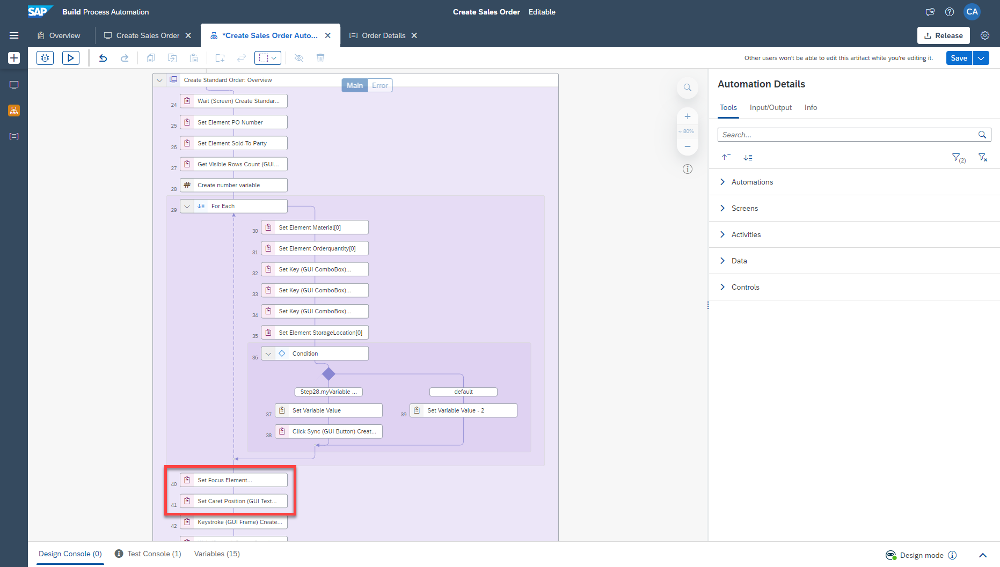

11. **Retrieving the sale's order number**:

    - Double click on the **Create Standard Order: Overview** screen.

    - Choose the status bar element on capture 3.

    - Search for the **Get Element** activity and drag and drop it on the status bar element.

    <!-- border -->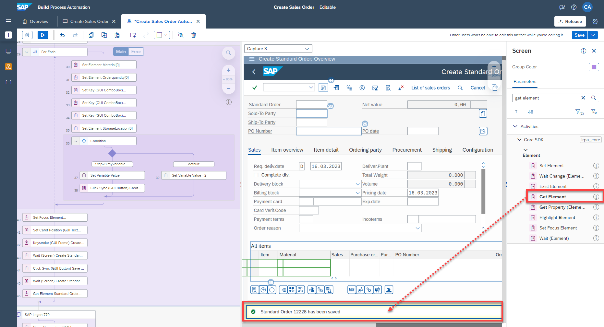

    - Close the screen and search for a **Log Message** activity.

    - Drag and drop the activity just below the **Get Element** activity in the automation.

    - Select the **Log Message** activity.

    - Under **Input Parameters**, from the drop down menu, as message, select **text**.

    - Save your automation.

    <!-- border -->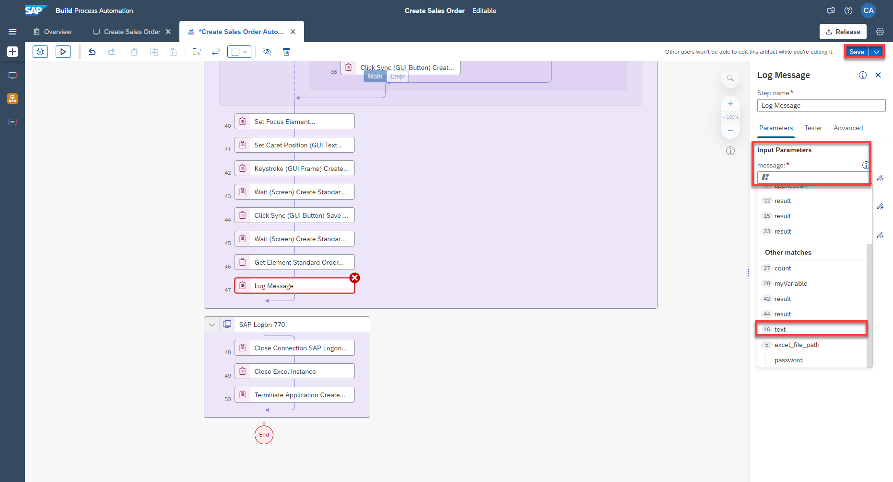

### Test your automation

Choose **Test** and you will be prompted to put in values for the **environment variables**.

<!-- border -->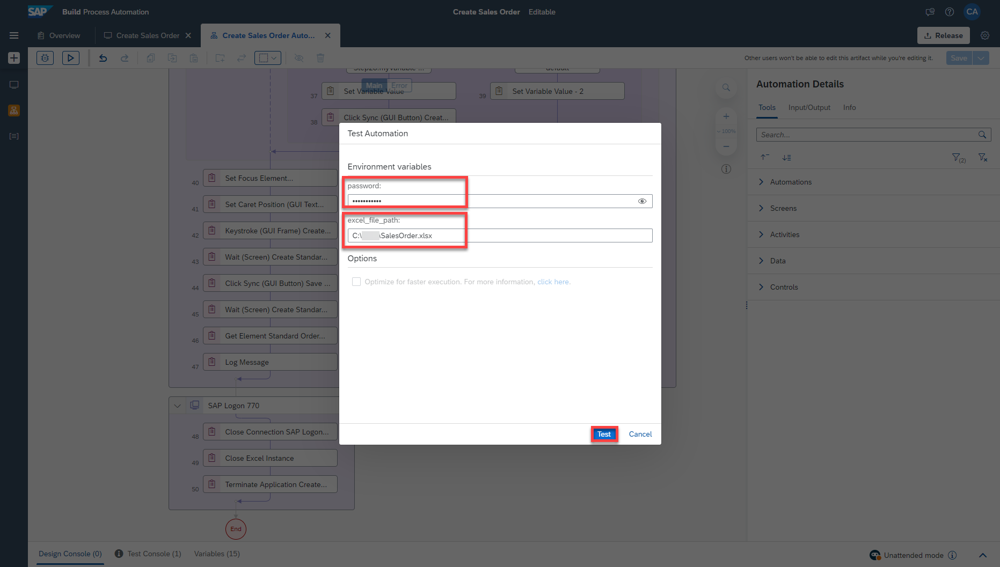

The process operates as follows:

1.  SAP ERP system is opened, enters the credentials and navigates to Sales order Transaction.

2.  The Excel file which is stored on your local machine containing Sales order details is opened.

3.  The **Desktop Agent** fills all the details in the screen.

4.  Information is validated to move to the next detected screen.

5.  These steps are repeated for all the screens that were captured.

6.  The Sales order is created successfully with data in the Excel.

---
