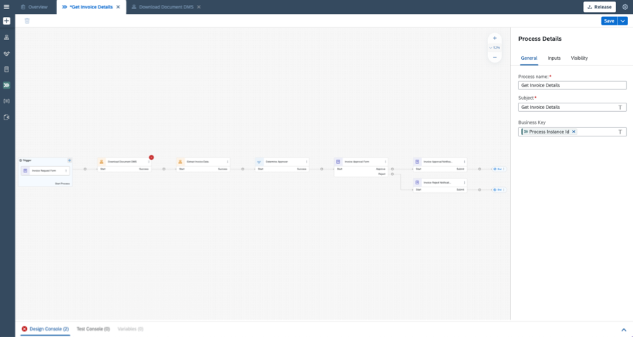
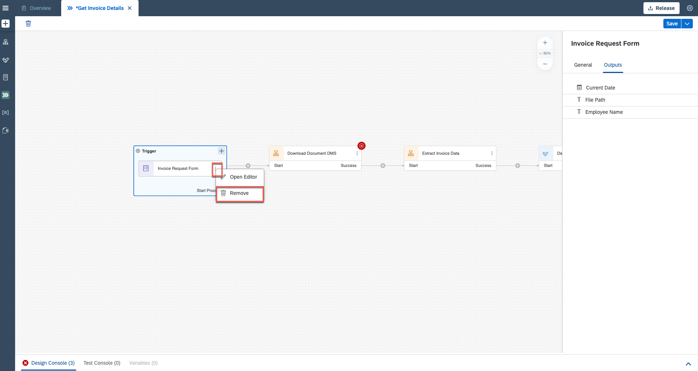
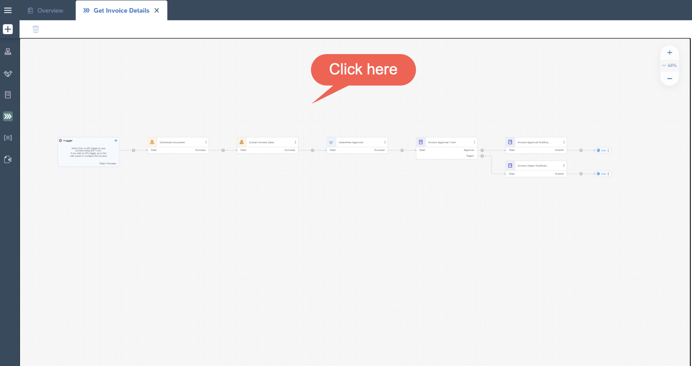
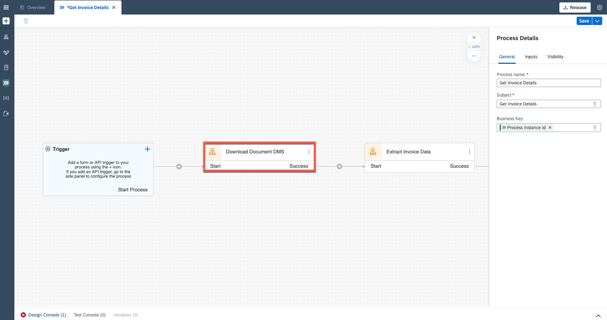
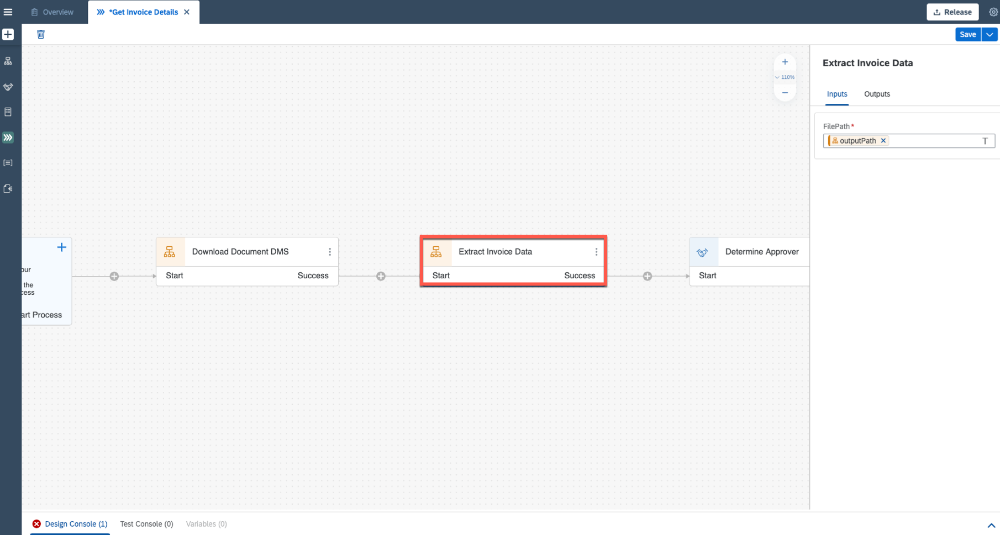
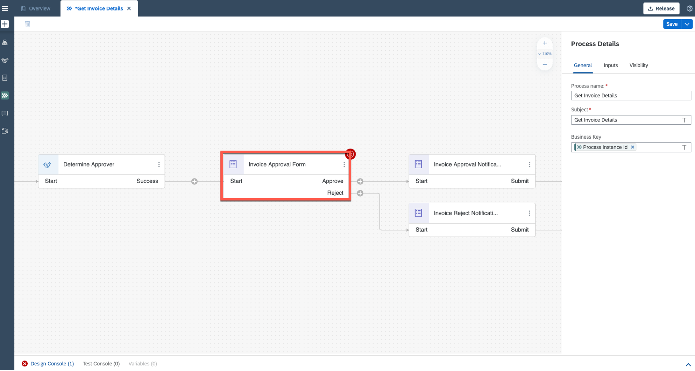

# Create an API Trigger for the Business Process
<!-- description --> Trigger business process from other services.

## Prerequisites
 - Complete [Automate to Access Documents from Document Management Repository](spa-dox-create-process-api-automation)

## You will learn
  - How to trigger business process through an API

---

### Configure Inputs for API Trigger

Once you have completed the [Automate to Access Documents from Document Management Repository](spa-dox-create-process-api-automation), your process looks like this:

<!-- border -->

1. From the **Editable** version of the **Invoice Approval** project, choose the three dots of the **Invoice Request Form** and **Remove** to delete the form.

    <!-- border -->

2. Click on the **Canvas** in the background.

    <!-- border -->

3. Choose **Configure Inputs** in **Inputs** to configure inputs.

    <!-- border -->

3. In **Configure Process Inputs** window choose **Add Input** to add parameters.

    <!-- border -->

4. Configure three inputs. Enter the names and choose types.

    |  **Name**    | **Type**
    |  :------------- | :-------------
    |  `fileName`       | string
    |  `folderName`     | string
    |  `employeeName`   | string

    **Apply** changes.

    <!-- border -->

### Binding Input and Output Parameters

1. Choose **Download Document DMS** automation.

    <!-- border -->

    - Configure **Inputs** section. Select the text box and map corresponding content.

    |  **Form Input Fields**    | **Process Content Entry**
    |  :------------- | :-------------
    |  `folderName`    | `folderName`
    |  `uploadedFileName`     | `fileName`

    <!-- border -->

2. Choose **Extract Invoice Data** automation.

    <!-- border -->

    - Configure **Inputs** section. Select the text box and map corresponding content.

    |  **Form Input Fields**    | **Process Content Entry**
    |  :------------- | :-------------
    |  `FilePath`    | `outputPath`

    <!-- border -->

3. Select **Invoice Approval Form**.

    <!-- border -->

    - Configure **General** section. Select the text box and map corresponding content.

    |  **Form General Fields**    | **Process Content Entry**
    |  :------------- | :-------------
    |  Recipients > Users  | `eMail`

    <!-- border -->

    - Configure **Inputs** section. Select the text box and map corresponding content.

    |  **Form Inputs Fields**    | **Process Content Entry**
    |  :------------- | :-------------
    |  Employee Name  | `employeeName`

    <!-- border -->

4. **Save** your work.

---
