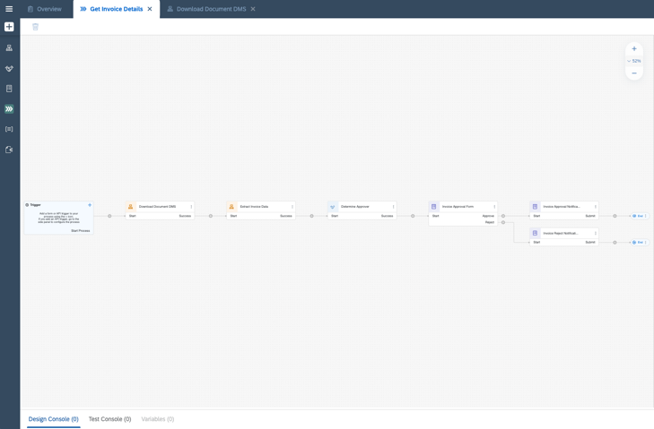
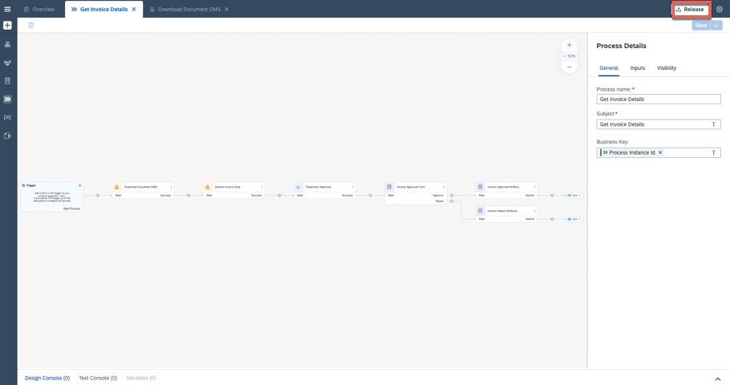
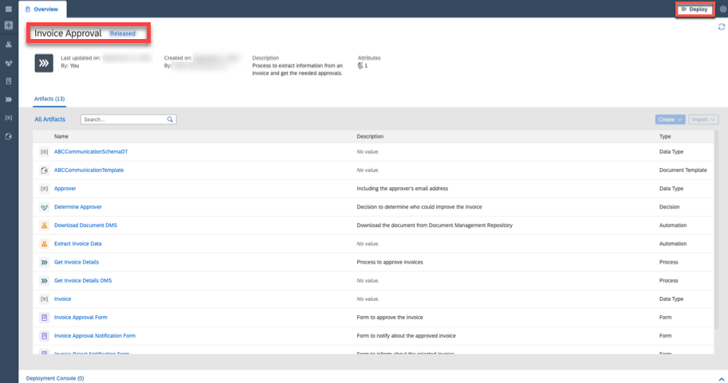

# Run an API Trigger for the Business Process
<!-- description --> Run business process from other services.

## Prerequisites
 - Complete [Create an API Trigger for the Business Process](spa-dox-create-process-api-trigger) mission
 - Complete [Configure Document Management Repository and Destination in SAP BTP Cockpit] (https://help.sap.com/docs/PROCESS_AUTOMATION/a331c4ef0a9d48a89c779fd449c022e7/3da3846d0da94d96a4f38688cd2e936a.html?locale=en-US&version=Cloud)

## You will learn
  - Learn how deploy and release Business Process

---

### Release and Deploy Project

Once you have completed the [Create an API Trigger for the Business Process](spa-dox-create-process-api-trigger) mission, your process looks like this:

<!-- border -->

1. **Release** the project.

    <!-- border -->

2. Choose the **Version** and confirm **Release**.

    <!-- border -->

3. Choose **Deploy** the project.

    <!-- border -->

4. Once you have successfully [configured Document Management Repository and Destination in SAP BTP Cockpit] (https://help.sap.com/docs/PROCESS_AUTOMATION/a331c4ef0a9d48a89c779fd449c022e7/3da3846d0da94d96a4f38688cd2e936a.html?locale=en-US&version=Cloud) in the **Deploy a project** window:

    - Under Set Variables choose **No trigger creation**,
    - Under Destination choose `SPA_DMS`,
    - **Confirm** and **Deploy** a project.

    <!-- border -->

---
