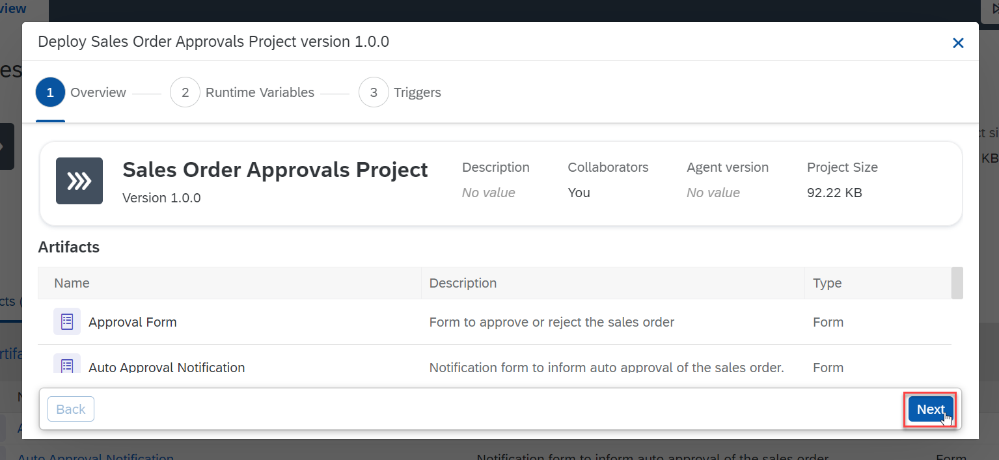

# Deploy and test the project
<!-- description --> Deploy the project and test the dropdown filtering.

## Prerequisites
- Complete the tutorial [Create a Project and add a Dropdown](spa-dropdown-value-help-filtering)

## You will learn
- to release and deploy the project
- to filter data in a dropdown

## Intro
In this tutorial, you will release and deploy the project created in the previous tutorial and test the dropdown filtering in the form.

### Release and deploy the project

1. In the project overview tab, select the **Release** option.

    <!-- border -->

1.  In the Release Project popup, select **Release**.

    <!-- border -->

1.  Select the **Deploy** option in the top-right corner.

    <!-- border -->

1.  In the deploy popup, select **Next**.

    <!-- border -->

1.  Select the destination variable `S4_Business_Partner` and select **Next**.

    <!-- border -->

1.  Select the **Deploy** option.

    <!-- border -->

### Test the dropdown filtering in the form

1. From the artifacts list in the left menu, select **Order Processing** process.

    <!-- border -->

2. Select the **Order Processing Form** artifact and copy the deployed form link.

    <!-- border -->

3. Paste the link into a new browser tab/window to open it.

4. Select the dropdown button for the **Customer Name** field. You can see all the customer names fetched by the action project from the S4/HANA database.

    <!-- border -->

5. In the **Customer Name** field, if you enter anything, the records will get filtered accordingly.

    <!-- border -->

    You have successfully completed releasing and deploying your project and tested the dropdown filtering in the Order Processing form.
