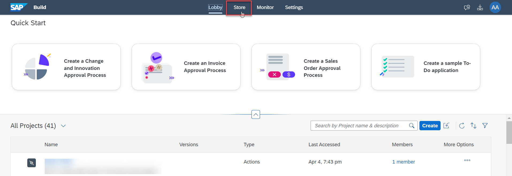
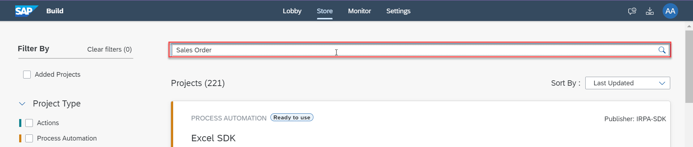
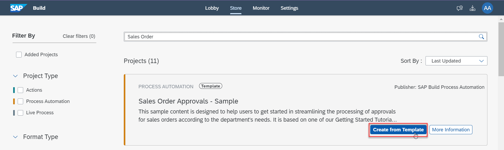
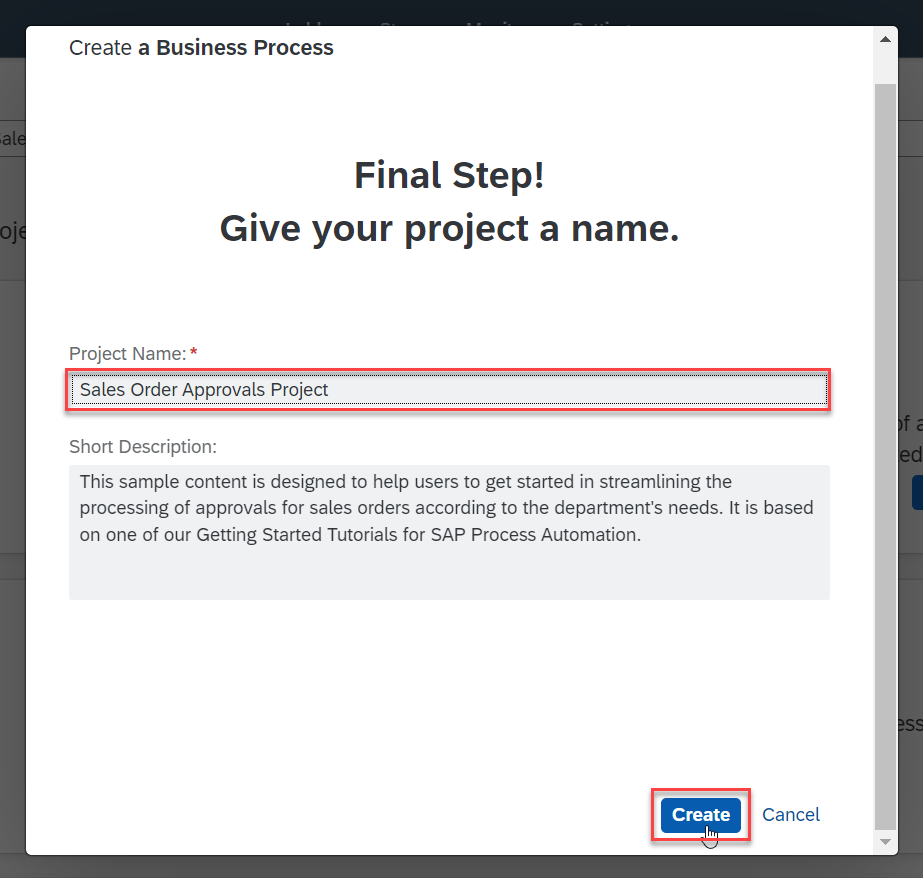

# Add Action to a Dropdown in a Form
<!-- description --> Add action to a dropdown in the trigger form to connect to the backend system

## Prerequisites
- Complete the tutorial [Create Action Project in Lobby](spa-business-partner-action-create)

## You will learn
- to import a sample process from the store
- to implement action in the project
- to create a destination environment variable 
- to create a dropdown in trigger form with action response as the data source
- to add destination based environment variable in trigger form 

## Intro
In this tutorial, you will create a project using a template from the store. You will edit the trigger form and create a dropdown to populate it with action response as options.

### Import sample process as template

1.  In **SAP Build**, select the **Store** tab.

    <!-- border -->

1.  Search for **Sales Order** in the search bar.

    <!-- border -->

1.  In the search results, select the **Create From Template** option for the **Sales Order Approvals - Sample** project.

    <!-- border -->

1.  Enter the name of your choice in the Project Name text box and select **Create**.

    <!-- border -->

### Create a dropdown in order processing form

1.	Once the project is created, select the **Order Processing Form** from the side menu of artifacts.

    <!-- border -->

2. Select the menu for the **Customer Name** text field and select **Delete**.

    <!-- border -->

3. Drag and drop the **Dropdown** artifact in the form and enter the name as **Customer Name**.

    <!-- border -->

### Add environment variable to access destination

4. Select the **Settings** icon at the top-right corner.

    <!-- border -->

4. In the **Environment Variables** tab select **Create**.

    <!-- border -->

4. In the popup that appears, enter the following details.

    - Enter `S4_Business_Partner` as identifier.
    - Enter **Description** of your choice.
    - Select the **Type** as **Destination**.
    - Choose **Create**.

    <!-- border -->

4. Once the environment variable is created, close the popup.

    <!-- border -->

### Add action project to dropdown

1. For the **Customer Name** dropdown, choose **From data set** and select the value-helper for the **Data Source**.

    <!-- border -->

1. In the **Browse Library** popup, choose **GET** as **Action Type**. Select the **Add** option for the action project you created earlier.

    <!-- border -->

1. Select the `S4_Business_Partner` as the **Destination Variable** and select the value-help option for **Available Data** field.

    <!-- border -->

1. Choose the **Customer Name** option from the dropdown.

    <!-- border -->

1. **Save** the form.

    <!-- border -->
