# Connect Action Project to Dropdown in Form
<!-- description --> Use and add a data source to the form dropdown field in order to display information from external systems

## Prerequisites
- Complete the tutorial [Create Business Partner Action Project in SAP Build Actions](spa-business-partner-action-create)

## You will learn
- How to use action project to retrieve data from data source and show in dropdown in form

## Intro
In this tutorial, you will create a project using a template from the store and edit the trigger form to create a dropdown and populate it with the values from the action project.

### Import sample process as template

1.  From the **SAP Build** lobby, select the **Store** tab.

    <!-- border -->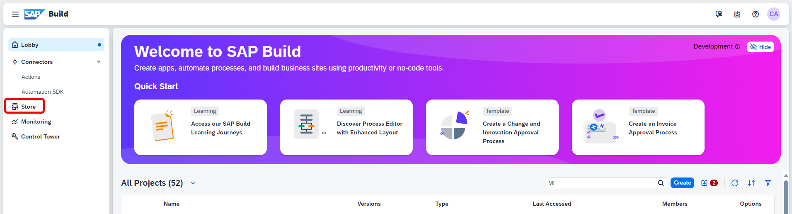

2. On the **Store** page, search for **Sales Order Management (MI01)** and once it loads, click **Create from Template**.

    <!-- border -->

3. In the **Project Name** field, enter **Sales Order Approvals Project**.
   
    > You can keep the default description or enter the description of your choice

    - Click **Create**.

    <!-- border -->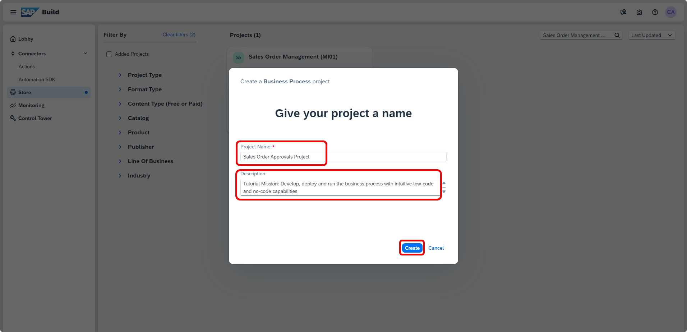

4. Open **Lobby** and you will see your project created.
   
5. Click on the **Sales Order Approvals Project** to open it.

    <!-- border -->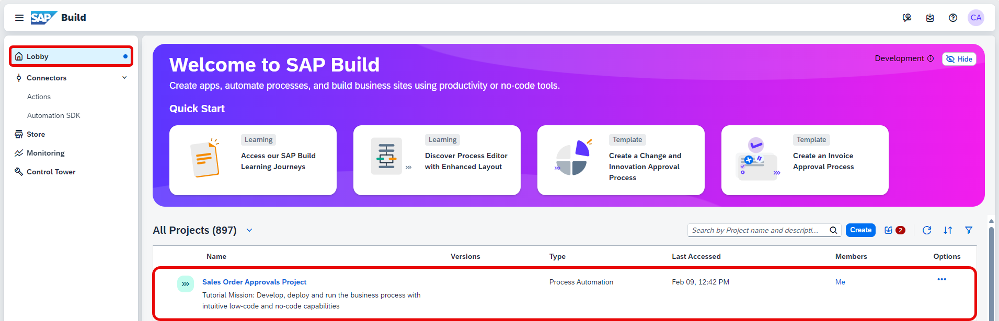

### Create a dropdown in order processing form

1.  Select the **Order Processing Form**.

    <!-- border -->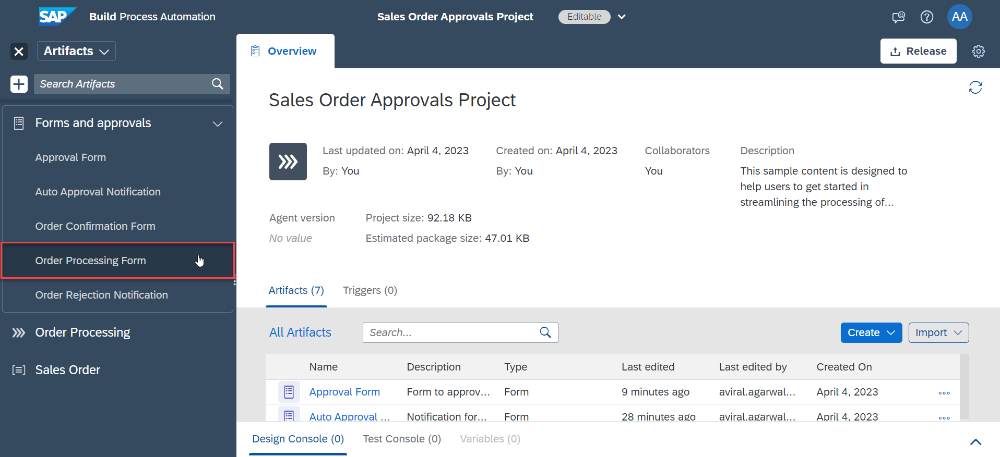

2. Select the menu for the **Customer Name** text field and select **Delete**.

    <!-- border -->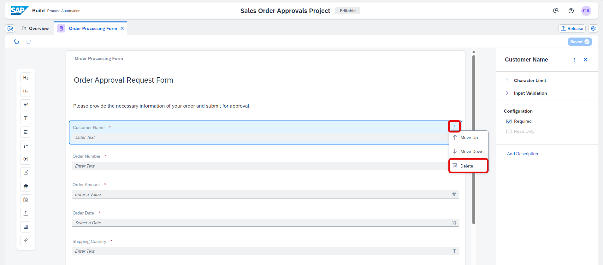

    You will now replace the text field with a dropdown field.

3. Drag and drop a **Dropdown** field in the form and enter the name as **Customer Name**.
   
4. Check the required box on the right side panel.
   
5. Choose **save**.

    <!-- border -->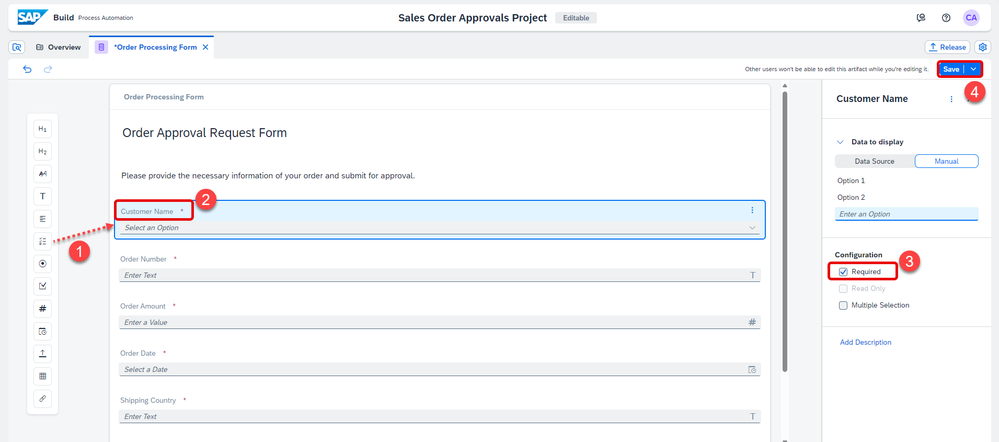

### Add environment variable to access destination

1. Select the **Settings** icon at the top-right corner.

    <!-- border -->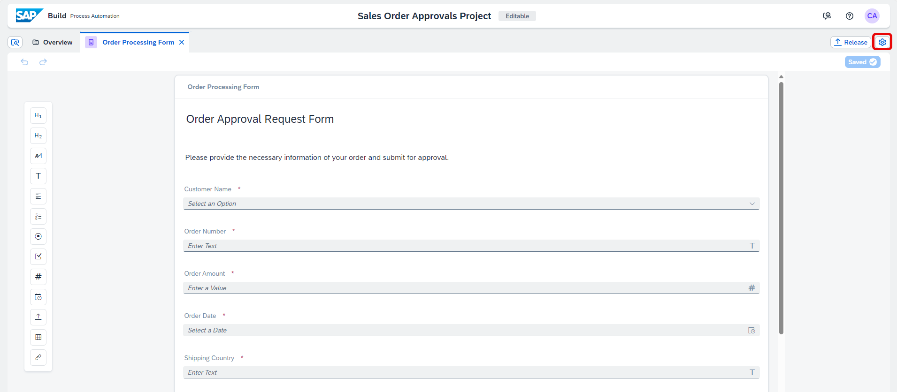

2. In the **Project Properties** pop-up, select **Environment Variables** and choose **+ Create**.

    <!-- border -->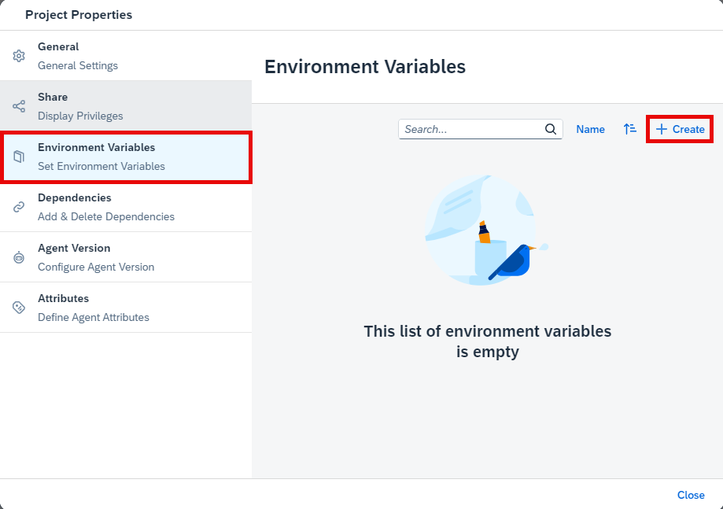

3. Fill in the information:

    - Enter `S4_Business_Partner` as identifier.
    - Enter **Description** of your choice.
    - Select the **Type** as **Destination**.
    - Choose **Create**.

    <!-- border -->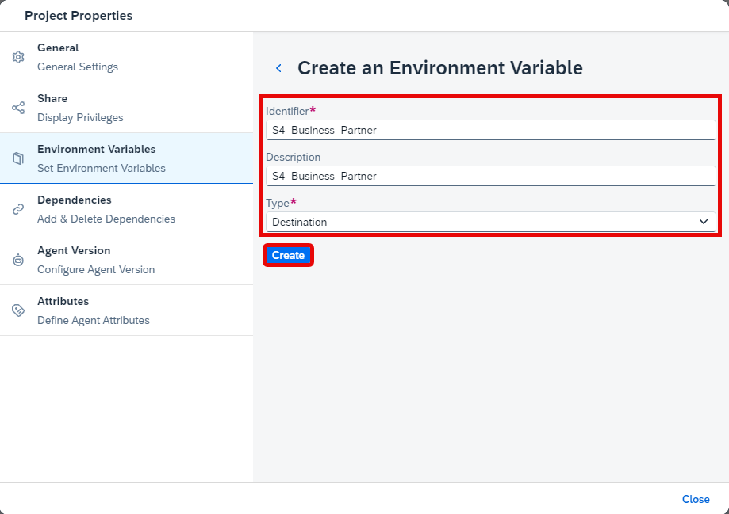

4. Once the environment variable is created, close the pop-up.

    <!-- border -->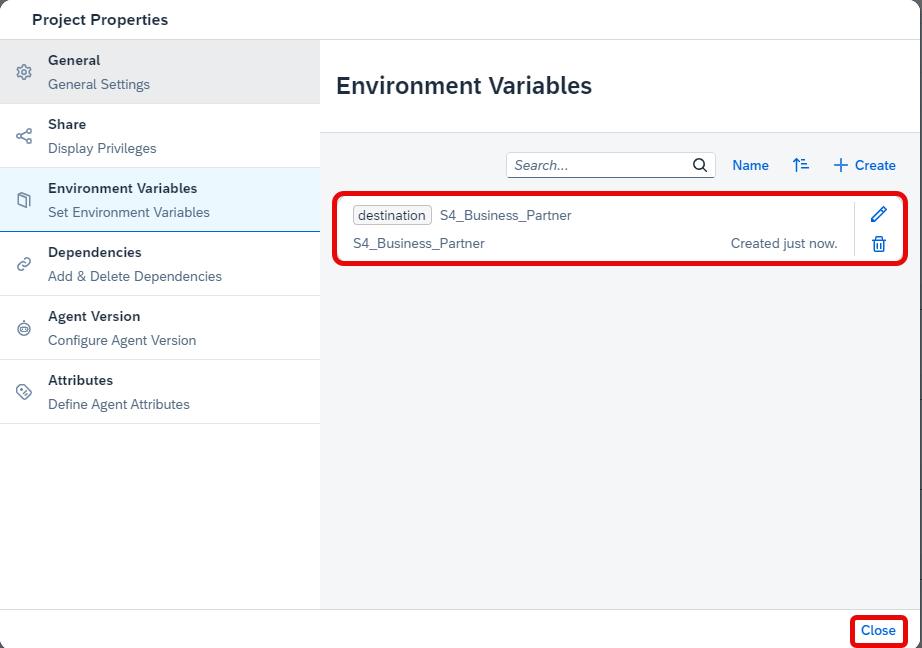

### Add action project to dropdown

1. Select the **Customer Name** dropdown.
   
2. As **Data to display**, choose **Data Source**.
   
3. Select the value-help option for **Data Source** field.

    <!-- border -->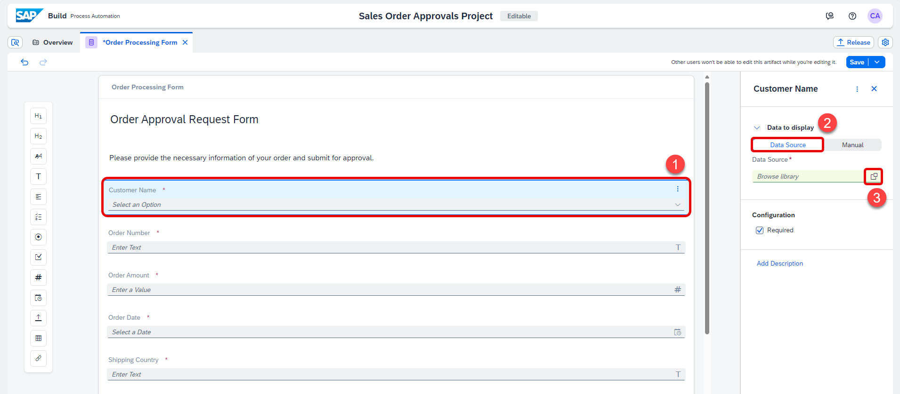

4. In the **Browse Library** pop-up, choose **GET** as **Action Type**. 
   
5. Select the **Add** option for the action project you created earlier.

    <!-- border -->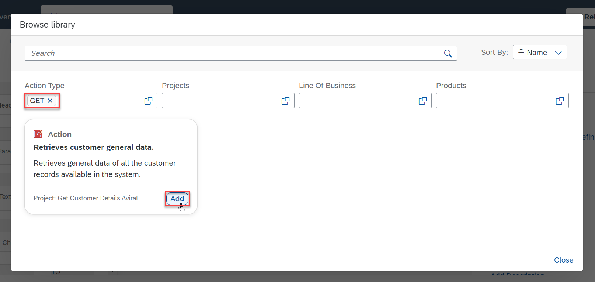

    > **CAUTION:** The action project will only be visible in the Browse Library pop-up if the Main Output Array is marked in the action response as described in previous tutorial.

6. Select the `S4_Business_Partner` as the **Destination Variable** and select the value-help option for **Available Data** field.

    <!-- border -->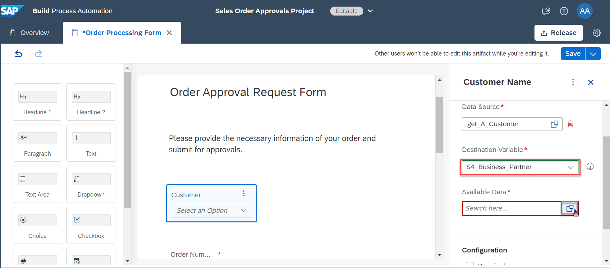

7. Choose the **Customer Name** option from the dropdown.

    <!-- border -->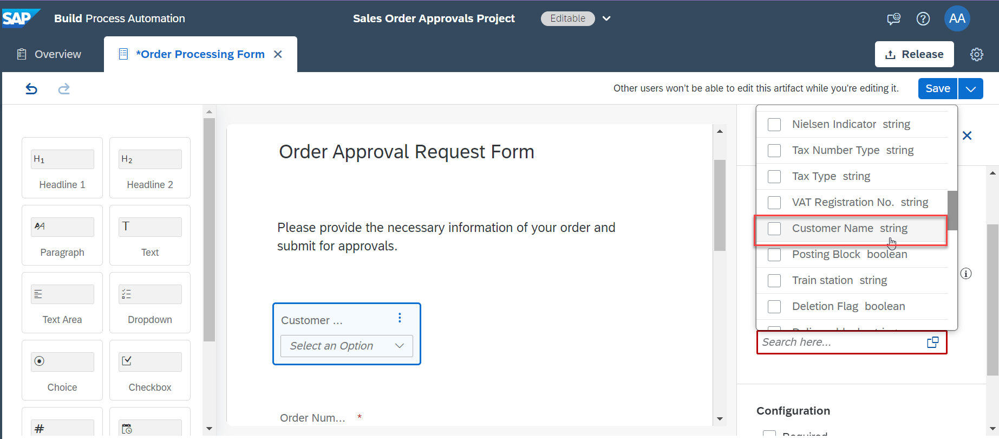

8. **Save** the form.

    <!-- border -->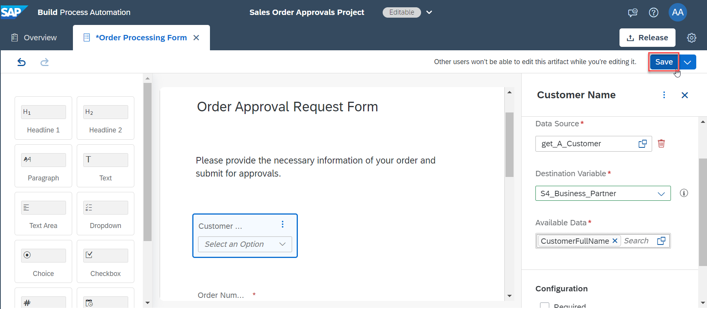

    With this, you have created a form with dropdown as input field and connected your action project to the dropdown.
