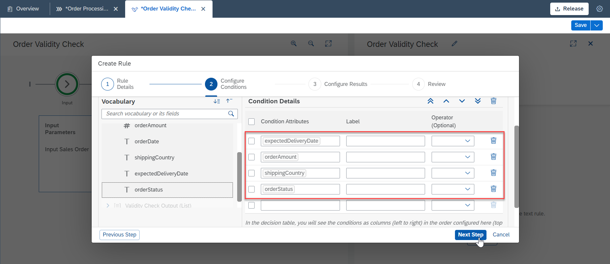
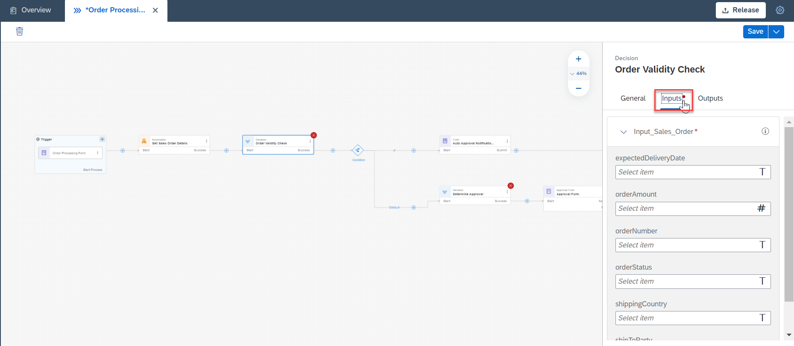
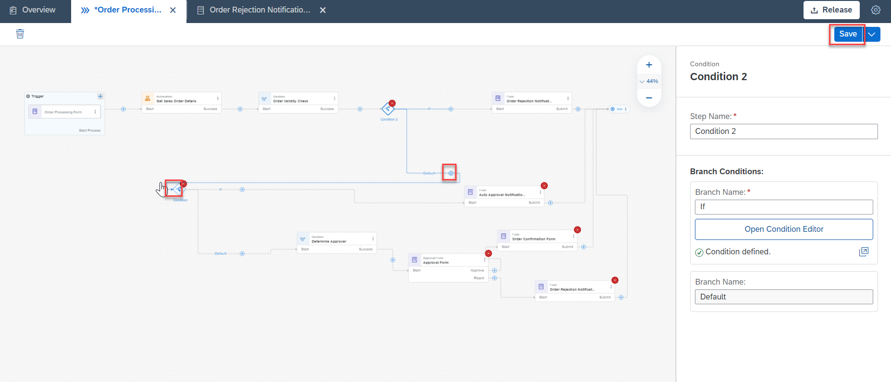
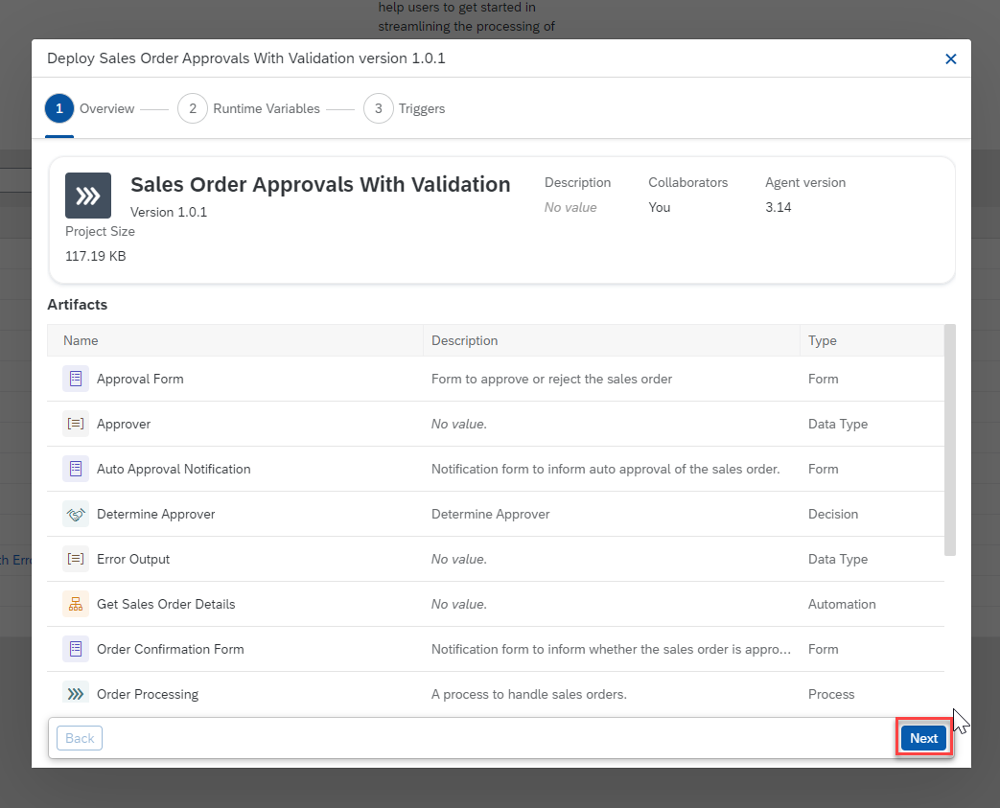
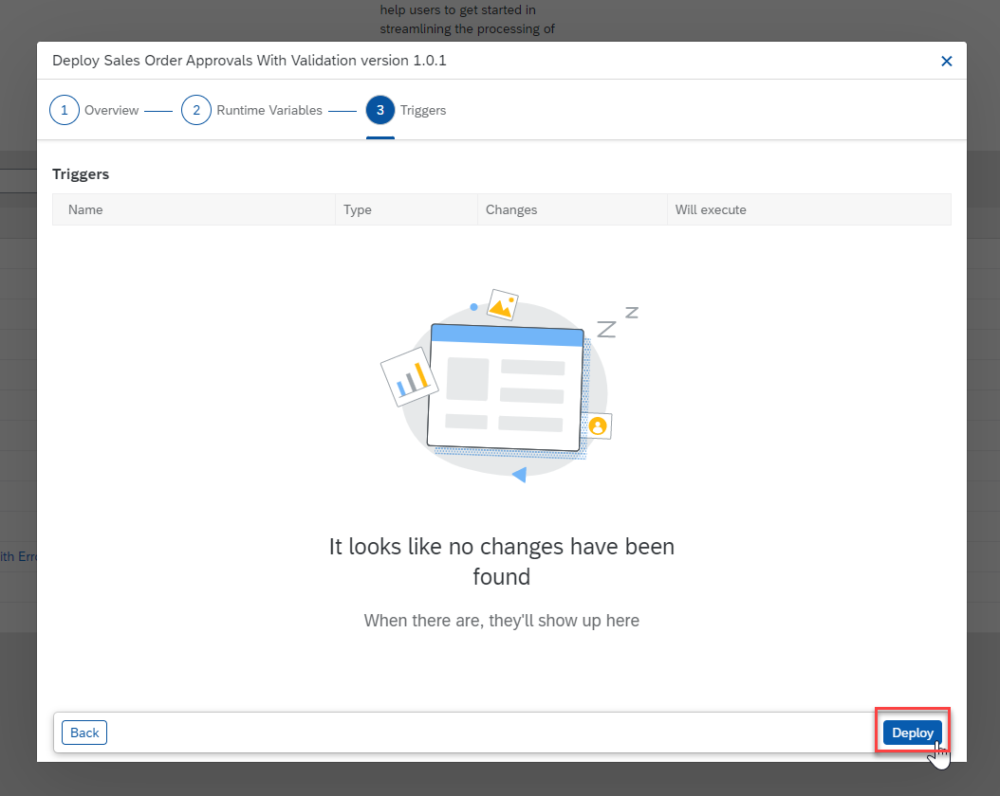

# Create Tables in the Form
<!-- description --> Validate the order details extracted from the automation and display the error details in table in a form.

## Prerequisites
 - Complete the mission [Boost your Business Process with Automation, Decision and Process Visibility](mission.sap-process-automation-boost).
 - Download the [Orders.xlsx](https://github.com/sap-tutorials/sap-build-process-automation/blob/main/tutorials/spa-forms-table/Orders.xlsx) on your local machine.
 - Setup the desktop agent to run automation as explained in [this tutorial](spa-run-agent-settings)

## You will learn
  - How to create Table in the Form.
  - How to use List in Decision.
  - How to bind List in Decision to Table in Form.
  - How to retrieve the sample project from the Store.

## Intro
In this tutorial, you will be creating a Decision to validate the Purchase Order Details extracted from excel. If the Purchase Order Details has errors, the errors will be displayed in a table in a form.

---

### Create decision artifact

Once you have completed the prerequisite mission, your process should look something like below. 

<!-- border -->

1. Select the process **Order Processing**.
    - Choose **+**.
    - Select **Decision**,  **New Decision**.

    <!-- border -->

2. A pop up will appear to configure the decision. Enter **Order Validity Check** as decision name and choose **Create**.

    <!-- > It would be with suffix as **Registered**. -->

    <!-- border -->

   

### Create data types

1. Go to the **Overview** Tab. Choose the **Create** button. Create an artifact of the type **Data Type**.

    <!-- border -->

2. A new pop-up will appear.
    - Enter **Name** of the data type: **Error Output**.
    - Enter **Description** of your choice.
    - Choose **Create**.

    <!-- border -->

3.  In the Data Type **Error Output** add new fields as following.

    |  Field Name           | Type
    |  :-------------       | :-------------
    |  `ErrorCode`          | String
    |  `ErrorDescription`   | String

    <!-- border -->

    <!-- border -->

4. Choose **Save**.

### Configure decision

1. Navigate to the **Order Processing** process.Select the decision **Order Validity Check** menu option and choose **Open Editor**.

    <!-- border -->

2. Add Input and Output parameters.

    <!-- border -->

3. Edit Input and Output parameters as follows.

    |  Parameter Name       | Data type        | Parameter Type | Description
    |  :---------------     | :-------------   | :------------- | :---------------
    |  `Input Sales Order`      | Sales Order     | Input          | Input Sales Order
    |  `Validity Check Output`    | Error Output| Output         | Validity Check Output

    Select the **List** checkbox to make the output type as list of Error Outputs.

    <!-- border -->

4. Select the **Rules** tab. Choose **Add Rule**.

    <!-- border -->

5. Enter **Rule Name** as Error Check and **Rule Description** of your choice.

6. Choose **Next Step**.

    <!-- border -->

7. In the **Configure Conditions** section, expand the **Input Sales Order** parameter.

    <!-- border -->

8. For this scenario you will be choosing `expectedDeliveryDate`, `orderAmount`, `shippingCountry` and `orderStatus`. Choose **Next Step**.

    <!-- border -->
    <!-- border -->

9. In the **Configure Results** section, enter Validity Check Output in **Result Vocabulary**. Choose **Validity Check Output** parameter. Choose **Next Step**.

    <!-- border -->

10. In the **Review** section, a summary of the rule to be added is displayed. Choose **Create**.

    <!-- border -->

11. In the **Decision Table**, add the below mentioned conditions. Choose **Save**.

    |  Parameter Name       | Condition        | Error Code | Error Description
    |  :---------------     | :-------------   | :------------- | :---------------
    |  `expectedDeliveryDate`      | >TODAY()     | 'ERR01'          | 'Delivery date is after current date'
    |  `orderAmount`    | >10000000| 'ERR02'              | 'Fraudulent Request'
    |  `shippingCountry`      | NOTEXISTSIN ['India','United Kingdom']     | 'ERR03'               | 'Delivery not supported in this country'
    |  `orderStatus`    | =''| 'ERR04'              | 'Order status is not set'

    <!-- border -->

    <!-- border -->

    <!-- border -->

    <!-- border -->

### Bind parameters to decision

1. Go to the **Order Processing** process.Select the **Order Validity Check** decision and choose **Inputs** in decision details.

    <!-- border -->

2. Map the input parameters listed in `Input_Sales_Order` to the `selectedSalesOrder` output variables from **Get Sales Order Details** automation.

    <!-- border -->

### Create rejection notification form with tables

1. In the **Overview** tab, click the **Create** dropdown and choose **Form** under **Process** section.

    <!-- border -->

2. In the **Create Form** popup, enter the form name and choose **Create**.

    <!-- border -->

3. Add a **Headline** and **Paragraph** to provide necessary details. Add the **Customer Name** and **Order Number** as read only fields.

    <!-- border -->

4. Add a **Table** with **Error Details** as title. Mark it as Read Only.

    <!-- border -->

5. Choose the **+** icon in table and select **Text**. Enter **Error Code** as field name.

    <!-- border -->
    
6. Choose the **+** icons beside Error Code field and select **Text**.

    <!-- border -->
    
7. Enter **Error Description** as field name and choose **Save**.

    <!-- border -->

### Create condition and add rejection form

1. In the **Order Processing** process choose the **+** sign and select **Condition** under **Controls**.

    <!-- border -->

2. Choose the **Open Condition Editor** for the new condition.

    <!-- border -->

3. In the **Edit Branch Condition** popup select the `list-Valicity_Check_Output` parameter.

    <!-- border -->

4. Put **0** as value and select **Apply**.

    <!-- border -->

5. After the new condition
    - Choose **+** to add a new artifact.
    - Select **Order Rejection Notification With Errors** under **Forms**.

    <!-- border -->
    
6. In the **General** section of form details, add **Process Started By** as **Recipient**.

    <!-- border -->
    
7. Under **Inputs** section, choose **Select list** and bind `list Validity_Check_Output` to it.

    <!-- border -->

8. Choose the **Order Number** and **Customer Name** from trigger form to map them with the respective input fields.

    <!-- border -->
    
9. Select the arrow after **Order Rejection Notification with Errors** form and drag it to connect with the **END** of the process.

    <!-- border -->

10. Select the **+** symbol after the **Default** branch and drag it to connect with the previous condition.

    <!-- border -->

11. At the end, your process will look like this.

    <!-- border -->

### Release and deploy

1. In the **Order Processing** process, choose the **Release** button in the top right corner.

    <!-- border -->

2. In the **Release Project** popup, select **Release**.

    <!-- border -->

3. In the **Overview** section that appears, choose **Deploy**.

    <!-- border -->

4. In the popup that appears, choose **Next**.

    <!-- border -->

5. In the **Runtime Variables** section, enter the `filePath` for the excel file you downloaded in the prerequisites section. Choose **Next**

    <!-- border -->
    
6. In the **Triggers** section, choose **Deploy**.

    <!-- border -->
    
7. After project deployment, a confirmation popup will appear. Choose **Close**.

    <!-- border -->

### Test the process

1. In the **Order Processing** process, choose the **Order Processing Form** artifact. In the right panel that appears, select the **Copy Link** icon under **Form Link** field.

    <!-- border -->

2. Before executing the process, make sure your desktop agent is in unattended mode. You can refer the prerequisites to Execute the Process with an Automation.

    <!-- border -->

3. In a new tab in your browser, enter the form link. Enter the details required in form and select **Submit**.

    <!-- border -->

    When you enter the order number in the form, the automation fetches the order details from excel stored in your machine. The details are the validated according to the rules in the decision table and the respective errors are shown in a table in the form.

4. In the SAP Build Lobby, choose the **Inbox** icon on the top right.

    <!-- border -->

5. You will get a notification with the error details in a table.

    <!-- border -->

### Retrieve sample project from the store

This sample project can be downloaded from the SAP Build Store.

To retrieve this sample, please follow these steps:
    
1. From the SAP Build Lobby, navigate to Store.
   
2. Search for the sample project: **Sales Order Management (TU05)**.
   
3. Choose **Create from Template** to retrieve the sample and save it as a new project in your lobby.

    <!-- border -->

4. Choose **Create**.

    <!-- border -->

    Your project gets created in editable version. You may release and deploy it and run the project.
    
5. Navigate back to the lobby by clicking on the SAP logo.
  
    <!-- border -->

    You can see your project is available in the lobby.
  
    <!-- border -->

---
