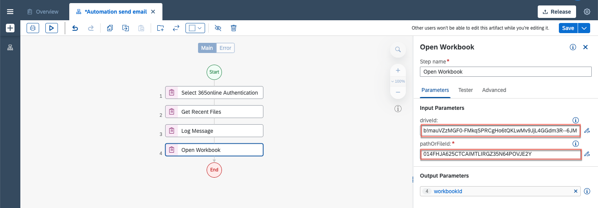
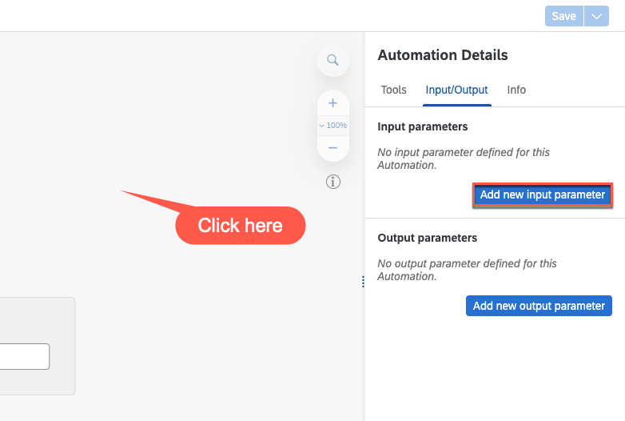
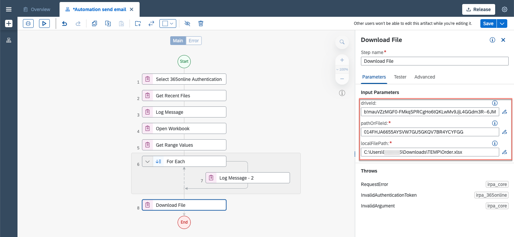

# Build Your Automation Using Microsoft 365 Cloud SDK of SAP Build Process Automation
<!-- description --> Use Microsoft 365 Cloud Office SDK to automate Microsoft Cloud products

## Prerequisites
 - A Windows PC
 - If you are using a MAC, please install a VDI
 - [Install and Setup the Desktop Agent](spa-setup-desktop-3-0-agent)
 - Save [Sales Order Data](https://github.com/sap-tutorials/sap-build-process-automation/blob/50c942bbd0a7612e1cb672134578e517786e7b0e/tutorials/spa-create-automation/Orders.xlsx) on your SharePoint or OneDrive.

## You will learn
- How to use Microsoft 365 Cloud Office SDK Activities

## Intro
After completing this tutorial, you will be able to search for an Excel file on SharePoint or OneDrive, download it and store it on your local machine, read Excel data for a given range and send an email via Outlook with the new Excel file as an attachment.

---

### Check authentication and set up your agent

First you will have to check if the external authentication to access Microsoft services is enabled. Otherwise some activities will not be available.

1. Navigate to SAP Build Lobby. Choose **Settings > External Authentication**.

    > If the External Authentication for Office 365 is not listed, contact your company administrator to set it up.

2. Open Desktop Agent. Once you are connected to the tenant, choose **Settings > External Authentication**.

    <!-- border -->

    > The agent receives and shows a list of registration items defined in IRPA Factory.

4. Select Office 365 Authentication.

    <!-- border -->

5. Fill out your email address and **save**.

    <!-- border -->

    > Each registration item can be registered or unregistered given a user email address.

6. Select **Register** button.

    <!-- border -->

7. In the newly opened window consent for agent to use your ID with the activities.

8. The confirmation of registration will appear.

    <!-- border -->

### Create a project

1. Go the SAP Build lobby. Choose **Create** button.

    <!-- border -->

2. Select **Build an Automated Process**.

    <!-- border -->

3. Choose **Task Automation**.

    <!-- border -->

4. Provide a **Name** for the project, a description and choose **Create**.

    <!-- border -->

5. Select the agent version that is registered on your system.

    <!-- border -->

6. Provide the name of the automation, a description and choose **Create**.

    <!-- border -->

### Set up the dependency

You will be navigated to the automation editor where you can build your automation. In order to use Microsoft 365 activities, you need to add the Microsoft 365 Cloud SDK to your project.

1. Choose **Settings**.

    <!-- border -->

2. In the **Project Properties** window, select **Dependencies>Add dependency button > Add a Business Process project dependency**.

    <!-- border -->

3. Under Add dependency search for **Microsoft 365 Cloud SDK** and **Add** it.

    <!-- border -->

4. **Close** the window.

### Build an automation

1. Under **Automation Details** panel, under **Tools** look for Select **365online Authentication** activity.

2. Drag and drop the activity into the workflow below Start.

    <!-- border -->

3. Under **Automation Details** panel, under **Tools** look for Select **Get Recent Files** activity. Drag and drop the activity into the workflow.

    <!-- border -->

    > Get Recent Files activity lets you retrieve files recently opened.

4. Select the **Get Recent Files** activity. In **Input Parameters**, under **filter** choose  **Custom Data**.

    <!-- border -->

    > This Activity generates a log message within the tester and the trace file.

5. Apply filter to restrict the list of the recent files. In this case you will look for the file which was created by you. In Input Parameters:

    - under `fileName` type Orders and select the expression in quotes.
    - under `createdByMail` enter your email and select the expression in quotes.

    <!-- border -->

6. Under **Automation Details** panel, under **Tools** look for **Log Message** activity. Add it to the workflow under **Get Recent Files**.

7. Select the **Log Message** activity. n the Input parameters, under message choose `recentList`.

    <!-- border -->

8. **Save** the automation. **Test** the automation.

    <!-- border -->

9.  Once the Test is done, go to the **Info** in **Test Console**. Copy:

    - `driveID` value
    - `fileId` value

    Save it for later.

    > The `driveID` is the ID of the remote SharePoint Drive where the file is located and the `fileID` is the ID of the workbook.

    <!-- border -->

10.  Under **Automation Details** panel, under **Tools** look for Select **Open Workbook** activity. Drag & drop it into the workflow.

    <!-- border -->

    > This activity opens Excel Workbook.

11. Select the **Open Workbook** activity. In Input Parameters under `driveID` and `pathOrFieldId` provide the value that you have copied and saved.

    <!-- border -->

    Here you can automate  if you would like to copy the values in each step or set up the Input Parameters in Automation. To do that click on the canvas and select Input/ Output under Automation Details.

        <!-- border -->

12. Under **Automation Details** panel, under **Tools** look for **Get Range Values** activity. Drag & drop it into the workflow.

      <!-- border -->

      > This activity retrieves the values, formulas or `numberFormats` from the current worksheet.

13. Select the **Get Range Values** activity. Under **Input Parameters** in:
    - range Definition enter: A1:F11 and select the expression in quotes.
    - format choose: `objectsHeadersOnFirstRow`

      <!-- border -->

14. Under **Automation Details** panel, under **Tools** look for **For Each** control. Drag & drop it into the workflow.

      <!-- border -->

15. Select the **For Each** control. Under **Parameters** in **Set looping list** choose **result**.

      <!-- border -->

16. Under **Automation Details** panel, under **Tools** look for **Log messages** activity. Drag & drop it into the workflow inside the **For Each** loop.

      <!-- border -->

17. Select the **Log Message** activity. Under Input Parameters in message choose `currentMember`.

      <!-- border -->

18. Under **Automation Details** panel, under **Tools** look for Select **Download File** activity. Drag & drop it into the workflow outside the **For Each** loop.

      <!-- border -->

19. Select the **Download File** activity. In the Input Parameters:
    - under `driveID` and `pathOrFieldId`: provide the value that you have copied. Select the expression in quotes.
    - under `localFilePath`: provide the path of the file which will store the data on your machine  e.g. `C:\Downloads\Order.xlsx`. Please select the expression in quotes.

      <!-- border -->

20. Under **Automation Details** panel, under **Tools** look for Select **Send emails** activity. Drag & drop it into the workflow just below **Download File** activity.

      <!-- border -->

21. Select the **Send Email** activity. In Input Parameters under `mailDescription` choose **Create Custom Data**.

      <!-- border -->

22. Customize the Email:
    - Under subject enter: **Your list of orders** and select expression in quotes.
    - Under body enter: **Hello, Your List of orders is ready for you.** and select expression in quotes.
    - Under `toRecipients` add: your email address and select the expression in quotes
    - Under attachments path: provide the path of the file which will be added to the email message e.g. `C:\Downloads\Order.xlsx` and select expression in quotes.

      <!-- border -->

23. Under **Automation Details** panel, under **Tools** look for **Remove File/Folder** activity. Drag & drop it into the workflow.

      <!-- border -->

24. Select the **Remove File/Folder** activity. In Input Parameters under path provide the path of the file that will be removed once email is sent.

      <!-- border -->

25. **Save** your work.

### Test the automation

1. Once the automation is saved and ready you can test it. Choose **Test** button.

      <!-- border -->

      >  If you have decided to add Inputs in step Build an automation (sub-step 11), you will need to add the values to the in the Automation Details and run the test.

      <!-- border -->

2. Check your Outlook Inbox to see the email, that was send with the attachment.

---
