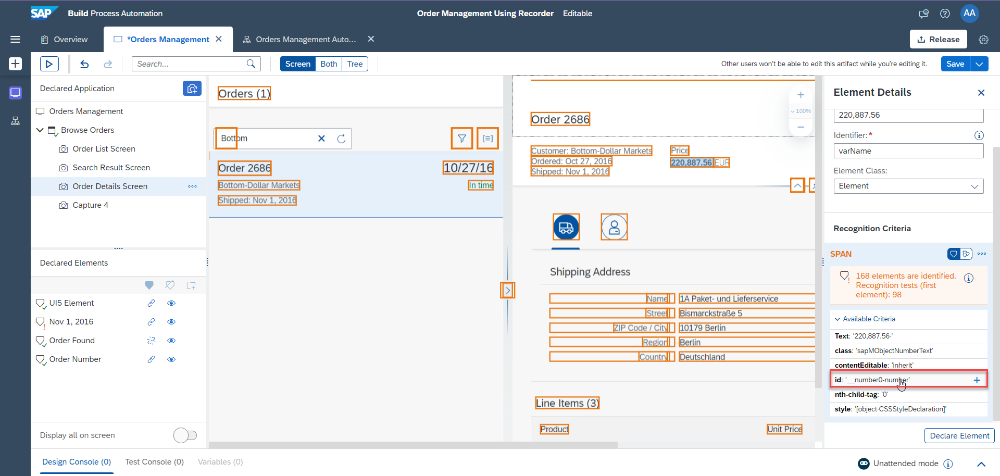
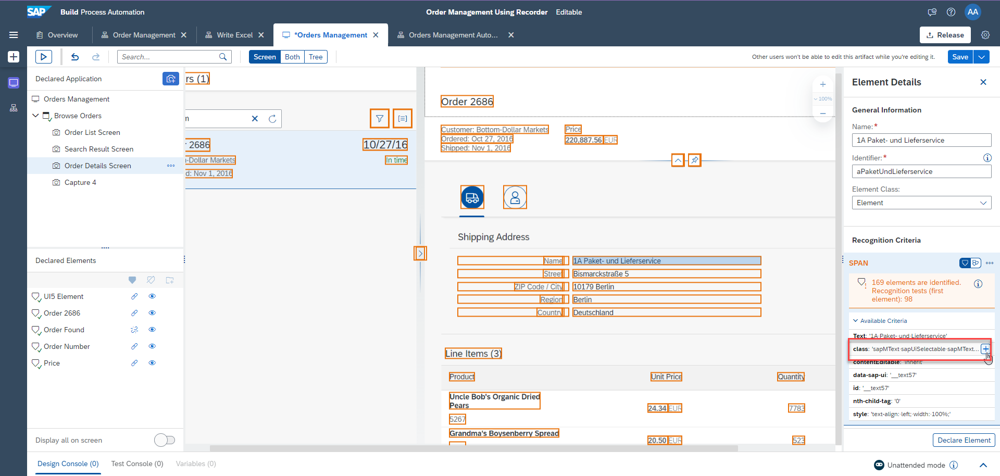

# Capture Orders Management SAP UI5 Application Using Recorder
<!-- description --> Record the Orders Management application to search for supplier name and declare screen elements using SAP Build Process Automation.

## Prerequisites
- [Install and Setup the Desktop Agent](spa-setup-desktop-3-0-agent)
- You have enabled SAP Build Process Automation browser extension

## You will learn
  - How to use the recorder for SAPUI5 applications to prepare screens for automation
  - How to use **Multi Dimensional Collection** in an automation

## Intro
In this tutorial, you will record SAPUI5 application screens using SAP Build Process Automation Recorder and declare multiple screens and elements which can be used later in an automation. You will capture Orders Management application screens and search for an order using supplier name. Later, you will extend this use case to read an excel file with supplier names and search for orders.

---

### Create a project

Navigate to SAP Build Process Automation tenant to create a new project for this specific automation.

1.  In the **SAP Build** Lobby, select **Create**.

    <!-- border -->

2.  Select **Build an Automated Process**.

    <!-- border -->

3.  Select **Task Automation**.

    <!-- border -->

4.  Enter the Project Name as **Order Management Using Recorder** and select **Create**.

    <!-- border -->

5.  Once the project opens in a new tab, select your agent version in the Configure agent version dialog box and select **Confirm**.

    <!-- border -->

6.  In the Create Automation dialog box, select **Cancel**.

    <!-- border -->

### Screen recording

Next, you will define the application which will be used in your automation.

In this case, you will use a recorder because the application is a SAPUI5 application. You can use a recorder for recording SAP GUI for HTML (also known as `WebGUI`), SAP GUI for Windows (also known as `WinGUI`), SAPUI5 or Generic Web applications. You will capture various screens and the elements on the web page.

You will use these screens and elements in the automation later.

### Create application

1. Make sure the [SAPUI5 application](https://openui5.hana.ondemand.com/test-resources/sap/m/demokit/orderbrowser/webapp/test/mockServer.html) is opened in a separate window, not just in a new tab. The Desktop Agent must be running and connected to the right tenant.

2.  In the project window, click the **Create** button and then select the **Application** artifact from the artifact menu.

    <!-- border -->

4.  In the Create Application dialog box, enter the Application Name as **Orders Management** and select **Create**.

    <!-- border -->

3.  Select the screen named **Browse Orders**. This is your SAPUI5 application.

    <!-- border -->

4.  Choose **Next**.

    <!-- border -->

4.  Make sure the Type is set to Recorder and select **Record**.

    <!-- border -->

5. The **Browse Orders** application opens and the recording controls appear.

    <!-- border -->

    > **CAUTION**: If the window with recording controls is not fully visible, click and hold on the drag section (refer to the following screenshot) and move the window. Release the left mouse button to finish.

    <!-- border -->

### Record application

Now, you will record your first step.

1.  Click the **Record** button. Recording starts and your first screen is captured as shown in the following screenshot.

    <!-- border -->

2.  Click on the search box in the SAPUI5 application window, type **Bottom-** and click the **Search** button. **Order 2686** appears and the new step is displayed in the recorder window as shown in the following screenshot.

    <!-- border -->

3.  Now, click the **Capture** button.

    <!-- border -->

    You will see a second line is added to the recording steps.

    <!-- border -->

4.  Choose **Order 2686**.

    <!-- border -->

    After the click, your screen must look like the following screenshot:

    <!-- border -->

5. Click again the **Capture** button.

    <!-- border -->

    Your screen must look like the following screenshot:

    <!-- border -->

6.  Click the **Stop** button.

    <!-- border -->

7.  Click the **Export** button in the recorder window to finish the capturing activity.

    <!-- border -->

    Wait until the recording is saved. The SAP Build Process Automation project opens with new automation steps that have been recorded using Recorder.

    <!-- border -->

### Test application

Now, you can test the automation. This step is optional, however it is highly recommended to check whether the automation runs smoothly.

1.  Close the SAPUI5 application (in a separate window) and click the **Test** button.

    <!-- border -->

2.  Click the **Test** button.

    <!-- border -->

3.  Wait until the package is generated and all **SDK**s are downloaded. You will see that the SAPUI5 application opens in a separate window, all steps are executed and the window gets closed. Test results are shown on the screen.

    <!-- border -->

### Adjust first screen

By using the recorder, you already captured three screens that you will use in your automation. Now, you will define various elements on those screens. You will use these screens and elements in the automation later.

You do not have anything to declare for your first screen because the screen recording has already captured and defined everything. You only need to rename the screen to make it more meaningful.

1.  Open the **Orders Management** application tab.

2.  Select **Capture 1** screen and change the name to **Order List Screen** then press enter.

    <!-- border -->

### Adjust second screen

You will rename the second screen from **Capture 2** to **Search Result Screen**.

<!-- border -->

Next, you will rename elements on the second screen.

1.  Make sure the second screen you just renamed to **Search Result Screen** is selected.

2.  Choose **Order 2686**.

3.  Rename the element to **Order Found**.

4. Change the Element Class to **SAPUI5 Recorder**.

5.  Remove the text equals identifier from **Recognition Criteria**.

6. Select **Declare Element**.

    <!-- border -->

### Adjust third screen

Rename the last screen from **Capture 3** to **Order Details Screen**.

<!-- border -->

Now, you need to define some new elements of the third screen that you will use in your automation to get the data from the screen.

### Declare and set recognition criteria for selected order number

    Select the third screen you just renamed to **Order Details Screen**.

1.  Choose the order number in the preview.

2.  Rename the element to **Order Number**.

    Don't choose **Declare Element** yet.

    <!-- border -->

    As you previously did, you are going to adjust the criteria.

4.  Choose the **Text** criteria.

5.  A popup opens. Change the **Operator** to **contains**.

6.  Change **Value** to **Order** with a space at the end.

7.  Click **Apply**.

    <!-- border -->

8.  Click **Declare Element**.

    <!-- border -->

### Declare and set recognition criteria for price

1.  Make sure that the third screen, **Order Details Screen** is selected.

2.  Choose **Price** in the preview.

3.  Remove the **Text** criteria.

    <!-- border -->

4.  Add the **ID** of the element as criteria instead. This will uniquely identify the price.

    <!-- border -->

5.  Rename the element to **Price**.

6.  Make sure the correct **id** criterion is selected and click **Declare Element**.

    <!-- border -->

    Now, you have successfully declared the element Price and it is visible in the Declared Elements.

    <!-- border -->

### Define shipping address on order details screen

Now, you will define the Shipping Address in a different way, as a collection of multiple elements.

1.  Choose the **Name** under shipping address in the preview.

    <!-- border -->

2.  Remove the **Text** criteria.

    <!-- border -->

3.  Select **class** as element.

    <!-- border -->

    With SAP Build Process Automation, you can also see the underlying technical document structure of the page. You use this to select more precisely the element you would like to define.

4.  Click the **Both** tab on the top to show both the preview, as well as the technical DOM structure.

5. Adjust the zoom (for example, to 50%) to be able to see the HTML elements and the screen.

6.  Choose the **Name** element of the Shipping Address.

7. Select the **DIV** (the container), instead of the **SPAN**. This way, you will be able to connect it to the other elements of the address.

    <!-- border -->

8.  **DIV** is selected. Now, remove the **Text** criteria as it is too specific.

    <!-- border -->

9.  Add the **class** criteria instead.

    <!-- border -->

10.  Class is selected. Set the name to **Shipping Address**.

11.  Click **Declare Element**.

    <!-- border -->

    The element cannot be uniquely identified because multiple elements fulfill the same criteria. SAP Build Process Automation shows this in the warning status message in the **Declared Elements** section.

12. Create a collection of these multiple elements, by clicking the **Is a collection** button under **Recognition Criteria**, while **Shipping Address** is selected.

    <!-- border -->

    As a result, a collection is defined and the element is uniquely identified. The technical page structure shows that multiple elements are part of this collection (0, 1, 2, 3, 4).

    <!-- border -->

11. Don't forget to save the progress by choosing the **Save** button on the top right.

### Define product details (line items) on order details screen

>The automation displays product details, that is product name, unit price, quantity, and total amount of purchase order. You will use **multiple collection** feature and retrieve the data.

1. Navigate to the **Order Details Screen**.

2. Select the Line Item Uncle Bob's Organic Dried, declare **TR** as an element.

3. Rename the declared element to **Table Row**.

4. Make sure you only have class as a recognition criterion.

    <!-- border -->

5.  Since **TR** is a collection, make it as a collection by clicking on the three dots.

6.  Select **Set as collection**.

7.  Click **Declare Element**.

    <!-- border -->

8.  Now, you see the **Table Row** element is added to the list of declared elements and it is represented with the collection symbol since you have set it as a collection.

    <!-- border -->    

    You need to retrieve that table data now, which is a cell.

9.  Select **TD**.

10. Remove **Text** and add class as a recognition criterion.

    <!-- border -->

    Since **TD** is also a collection, it must be set as a collection.

11. Rename the **TD** to **Table Data**.

12. Click on the three dots and select **Set as collection**.

13. Click **Declare Element**.

    <!-- border -->

    You can see the one-dimension array added as of now. Since it is a collection, the **Table Data** is also a collection.

    <!-- border -->

14. Click on the three dots on **Table Row**, to recognize the Table Data as two-dimensional.

15. Click **Add to criteria**.

    <!-- border -->

    In the Element Information section, you can see that everything is added in the **Table Row**, and the **TD** is also marked as a two-dimensional array.

    <!-- border -->

16. Click **Save** to save your application.

Nice! You have completed the capturing of the application and can build the automation by following the next tutorial [Automate the extraction of Order Details in Order Management Application](spa-order-management-int-2-automation)

---
