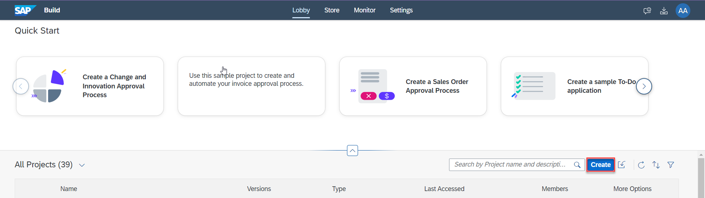
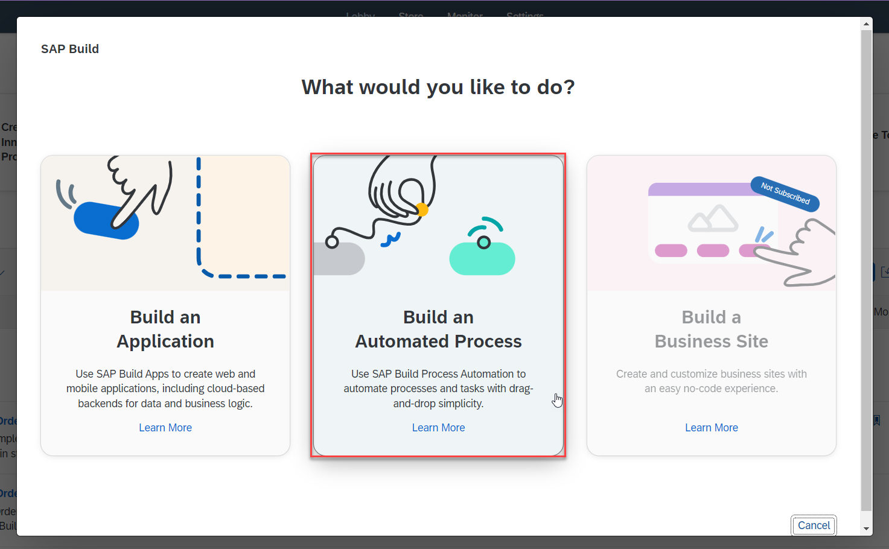
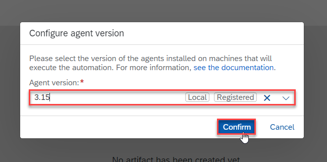
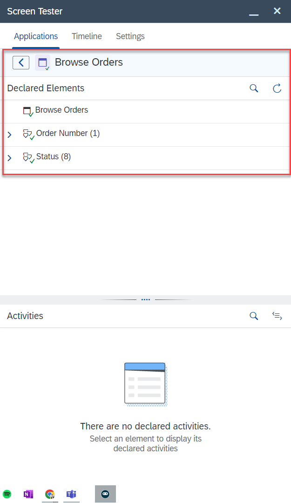

# Capture Orders Management Web Application
<!-- description --> You will capture Orders Management application using SAP Build Process Automation.

## Prerequisites
- [SAP BTP Free Trial Account](spa-subscribe-free-trial)  **OR**
  [SAP BTP Free Tier Account](spa-subscribe-booster) with SAP Build Process Automation enabled
- [Install and Setup the Desktop Agent](spa-setup-desktop-3-0-agent)
- You have enabled SAP Build Process Automation browser extension

## You will learn
  - How to capture a web application
  - How to test an application using Application Tester

## Intro
In this tutorial you will open the Orders Management application in a browser, create an application in SAP Build Process Automation and declare the elements for the application screen.

---

### Open application to automate

Open the application you will automate by choosing the link [Browse Orders](https://openui5.hana.ondemand.com/test-resources/sap/m/demokit/orderbrowser/webapp/test/mockServer.html).

<!-- border -->

### Create a new project

1. In a new browser window, go to SAP Build Process Automation tenant.

2. Select **Create** button to create a new project.

    <!-- border -->

3. Select **Build an Automated Process** option.

    <!-- border -->

4. Select the **Task Automation** option.

    <!-- border -->

5. Enter the **Project Name** and a **Description** as given below. Select **Create**.

    <!-- border -->

6. The project opens in a new tab. In the Configure Agent Version dialog box, select the agent version. Choose Confirm.

    <!-- border -->

### Create application artifact

1. Choose Create and in the dropdown, select Application.

    <!-- border -->

2. In the Create Application dialog, enter Application Name as Record Orders. Select Create.

    <!-- border -->

3. The system starts detecting the applications and their screens currently running on your local machine. You'll see a list of screens on the left-hand side. Select the Browse Orders window and select Next.

    <!-- border -->

4. Select Manual Capture and choose Capture.

    <!-- border -->

5. Once the screen has been recorded, select Go to Application.

    <!-- border -->

> ### What's going on?
To automate a web application, you need to: capture, declare and test the application, screens, and UI elements.

> You will capture the application and its screens. Then, declare the screens and the elements within the screens that will be part of the automation. Finally, test the application to make sure all the applications, screens and elements are getting recognized.

> This is an important step to make sure that the system knows which application to work on, which screen to open and which element to select.

### Declare screens

> To declare an application, you need to set recognition criteria -- which identifies the application, screens and UI elements correctly when your automation runs.

1. Choose the URL (below) in the Captured Data to add them to the Recognition Criteria section.

     Modify the criterion of URL as below and choose **Apply**.

     - **Property** `URL`
     - **Operator** `contains`
     - **URL** `https://openui5.hana.ondemand.com/test-resources/sap/m/demokit/orderbrowser/webapp/test/mockServer.html`

    <!-- border -->

    <!-- border -->

2. Save your changes.

    The Recognition Criteria should look like this:

    <!-- border -->

### Declare screen elements

1. Choose the first order number (here, **Order 7991**) to select. A green or red border will appear around the selected element.

    You can take help from the **Both** view to drill-down to the specific element.

    <!-- border -->

2. In the Element Details panel, enter `Order Number` for the name of the element. The Identifier and Element are automatically detected.

    <!-- border -->

3. Remove any already existing criterion by choosing the **X**.

4. In **Captured Data**, choose the data below to add them to the criteria. The selected data is then automatically added as a criterion in **Recognition Criteria**.

    -	**class equals `sapMTextMaxLine sapMTextLineClamp`**

5. Once Recognition Criteria is green, it indicates that the bot has recognized your element. You can choose **Declare Element** now.

    <!-- border --> 

6. From the **Declared Elements** area, choose the Order Number element. 
    
7. In the right panel under Recognition Criteria, choose the **Is a Collection** button <!-- border -->

8. This converts **Order Number** element into a collection of elements.

    <!-- border -->

9. Repeat steps 1-7 to further declare the element **Status**. Use the below criteria to declare:

     - class equals `sapMObjStatusText`

     Make sure to declare the status as **Collection**.

    <!-- border -->

10. Save your work.

### Test the application

> The purpose of testing an application before using it in an automation is to ensure that you have declared all of the elements correctly so that at runtime, they are correctly identified and can be controlled as intended. The application can be tested using **Application Tester**.

1. To test your application, choose **Test** 

2. Choose **Test**.

    <!-- border -->

    The system launches the **Application Tester**.

    <!-- border -->

    The applications declared in your project are displayed in **Declared Applications**.

3. The elements getting successfully recognized will appear in **green**. If the declared application or screen or element is not recognized, you will see them in **red**.

    The declared elements found on the selected screen are listed in the **Declared Elements** section. Choose the arrow next to a declared element to display its collection.

    <!-- border -->

4. To test the elements select the element `Order Number(0)` from the list.

5. Select **Get Element** activity and choose the Execute button.

6. The result can be seen in **Output parameters** as **Order 7991**. This way you can test that the elements are getting recognized correctly.

    <!-- border -->

Congratulations! You have successfully captured and declared the application for orders management.

In the next tutorial, you will learn how to build an automation with this captured application to automate the orders management process.

---
